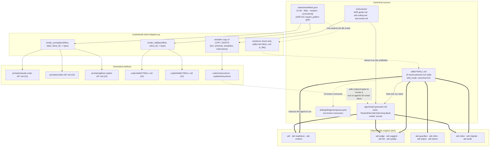

# Agent-Facing Surface

## Overview

- **Name**: Agent-Facing Surface (`agent-surface`)
- **Description**: This cluster is the entire instruction layer through which an LLM agent drives adr-kit. It holds four things: the fifteen hand-authored Claude Code skills under [`skills/`](../skills) (the rich, canonical prose that defines every ADR workflow); one subagent definition, [`agents/adr-generator.md`](../agents/adr-generator.md); three shared instruction documents under [`instructions/`](../instructions) that are copied verbatim into the Codex and Copilot plugin trees; and three generated per-client prompt corpora under [`prompts/`](../prompts) (15 files each, 45 total). Nothing here executes. Every file is Markdown or YAML consumed as model context; the actual work is done by the `bin/` CLIs that this prose instructs the agent to run.
- **Location**:
  - Skills (15 workflows, one directory each): [`skills/adr/SKILL.md`](../skills/adr/SKILL.md), [`context`](../skills/context/SKILL.md), [`grill`](../skills/grill/SKILL.md), [`guardian`](../skills/guardian/SKILL.md), [`init`](../skills/init/SKILL.md), [`install-hooks`](../skills/install-hooks/SKILL.md), [`judge`](../skills/judge/SKILL.md), [`lint`](../skills/lint/SKILL.md), [`migrate`](../skills/migrate/SKILL.md), [`related`](../skills/related/SKILL.md), [`retire`](../skills/retire/SKILL.md), [`review`](../skills/review/SKILL.md), [`setup`](../skills/setup/SKILL.md), [`supersede`](../skills/supersede/SKILL.md), [`upgrade`](../skills/upgrade/SKILL.md)
  - One skill-scoped sidecar: [`skills/grill/agents/openai.yaml`](../skills/grill/agents/openai.yaml)
  - Subagent: [`agents/adr-generator.md`](../agents/adr-generator.md)
  - Instructions: [`instructions/ADR-guide.md`](../instructions/ADR-guide.md), [`instructions/adr.coding.md`](../instructions/adr.coding.md), [`instructions/adr.review.md`](../instructions/adr.review.md)
  - Prompts: [`prompts/claude-code-cli/`](../prompts/claude-code-cli), [`prompts/codex-cli/`](../prompts/codex-cli), [`prompts/github-copilot-cli/`](../prompts/github-copilot-cli) — the same 15 workflow ids in each
  - No binary artefacts and no `__pycache__` exist anywhere in this cluster. All 65 files are UTF-8 text.
- **Language**: 65 files total — 64 Markdown plus one standalone YAML. Only 16 of the Markdown files carry YAML frontmatter (the 15 `SKILL.md` files and `agents/adr-generator.md`); the 3 `instructions/` files and all 45 `prompts/` files are plain Markdown with no frontmatter block. Zero Python, zero executable code, no binaries.
- **Purpose**: Convert one ADR governance model into instructions that three different CLI coding agents can follow to the same outcome. The skills carry the reasoning an agent needs (when an ADR is warranted, the four verification gates, the anti-rationalisation guards, the immutability rule); the `instructions/` files carry the shared per-developer and per-reviewer rules; the `prompts/` files are thin per-client entry stubs. Together they are the only reason the deterministic `bin/` tools get invoked at the right moment with the right flags.

### Governing ADRs

Verified against [`docs/adr/ADR-INDEX.md`](../docs/adr/ADR-INDEX.md) and the ADR bodies. **No ADR Enforcement `path_glob` in the repository covers `skills/`, `prompts/`, `instructions/`, or `agents/`** — this cluster has no mechanical ADR gate at all. Everything below is prose governance.

| ADR | Relationship to this cluster |
|---|---|
| [ADR-010](../docs/adr/ADR-010-certify-three-native-cli-clients-through-one-outcome-contract.md) (Accepted) | Directly prose-governing, and the sentence the whole canonical-versus-generated story rests on. Its "Artifact ownership" table names **Canonical**: "workflow semantics, skill and prompt content, hook intents, MCP intent, settings definitions, guide content"; **Generated**: "client skill/prompt wrappers, shared guidance, hook wrappers, inventories". Outcome 1 of its contract is "discover stable ADR Kit skills and prompts". Its declarative Enforcement `path_glob` is `schemas/client-capabilities.schema.json`, i.e. the schema, not this cluster. |
| [ADR-011](../docs/adr/ADR-011-adopt-deterministic-readiness-and-human-gated-grilling-across-the-adr-lifecycle.md) (Accepted) | Governs the *upstream source* of this cluster, not the cluster itself: `require_pattern "grill"` with `path_glob: clients/workflows.json`. The rule keeps the grill workflow in the registry from which `prompts/*/grill.md` is generated. Its Decision defines the four-way evidence model (observed / human-stated / inferred / unknown) and the one-question protocol that [`skills/grill/SKILL.md:31-48`](../skills/grill/SKILL.md) implements verbatim. |
| [ADR-004](../docs/adr/ADR-004-layered-adr-context-injection.md) (Accepted) | Prose-governing. Defines the three fail-open injection tiers and the one fail-closed floor. [`skills/init/SKILL.md:189`](../skills/init/SKILL.md) writes the edit-tier contract into the project stub verbatim ("Edit-tier injection: when an `[adr-inject] ADR-NNN ... governs <file>` block appears before an edit, treat the quoted Decision as a binding constraint"), and [`instructions/ADR-guide.md:18-19`](../instructions/ADR-guide.md) restates the fail-open / fail-closed split. Enforcement block present but empty (`llm_judge: false`). |
| [ADR-005](../docs/adr/ADR-005-selectable-agent-friendly-adr-formats.md) (Accepted, supersedes ADR-003) | Prose-governing the multi-profile handling in [`skills/migrate/SKILL.md`](../skills/migrate/SKILL.md) (Patterns G and H) and [`skills/adr/SKILL.md:240-258`](../skills/adr/SKILL.md) (`adr profiles --format json`, accept only a returned `available: true` id). Verified as the live successor: ADR-003 is `Superseded by ADR-005, 2026-07-18` and ADR-005's Related Decisions states "Supersedes ADR-003: selectable profiles replace its canonical-only storage contract." Its Enforcement `path_glob` is `schemas/adr-kit-config.schema.json`, not this cluster. |

---

## Code Elements

**Substitution note.** The required "COMPLETE signature (name, parameters with types, return type)" cannot be honoured here without fabricating: this cluster contains no functions, classes, or executable code. The analogous public surface is documented instead:

1. **For each skill** — the YAML frontmatter contract (the fields a host CLI parses to decide whether and how the skill may fire) plus the concrete `bin/` invocations the body instructs the agent to run. Those invocations *are* the callable interface of a skill.
2. **For the subagent** — its `tools` and `model` declarations.
3. **For the prompts** — the Python render function that produces all 45 files, documented by real signature, rather than 45 near-identical file entries. The byte-level equivalence was verified by diff, not assumed (see [Notable Findings](#notable-findings)).

Private helpers do not exist in this cluster, so nothing was summarised in aggregate on that basis. The one deliberate aggregation is the 45 prompt files.

### `skills/` — the canonical Claude Code skill corpus

Fifteen directories, one `SKILL.md` each, hand-authored. These are the `canonical-rich` corpus for the `claude-code-cli` client per [`clients/workflows.json`](../clients/workflows.json) (`skill_mode: "canonical-rich"`, `skill_root: "skills"`). They are **not** generated and carry no provenance comment.

#### Frontmatter contract (the parsed surface)

`disable-model-invocation: true` means the skill is user-only: the session model may not self-call it. `allowed-tools` is the tool allowlist the host enforces for the skill's duration; unset means unrestricted.

| Skill | `disable-model-invocation` | `allowed-tools` | `license` | Frontmatter |
|---|---|---|---|---|
| `adr` | *(unset — model may self-call)* | **(unset — unrestricted)** | MIT | `skills/adr/SKILL.md:1-6` |
| `context` | *(unset)* | `[Read, Bash]` | MIT | `skills/context/SKILL.md:1-7` |
| `grill` | *(unset)* | `[Read, Bash, Edit, Write, Glob, Grep]` | – | `skills/grill/SKILL.md:1-6` |
| `guardian` | *(unset)* | `[Read, Bash, Edit, Write, Task, Glob, Grep]` | – | `skills/guardian/SKILL.md:1-6` |
| `init` | `true` | `[Read, Write, Edit, Bash, Glob, Grep, Task]` | – | `skills/init/SKILL.md:1-7` |
| `install-hooks` | `true` | `[Read, Write, Edit, Bash]` | – | `skills/install-hooks/SKILL.md:1-7` |
| `judge` | *(unset)* | `[Read, Bash, Edit, Write, Task]` | – | `skills/judge/SKILL.md:1-6` |
| `lint` | `true` | `[Read, Glob, Grep]` | – | `skills/lint/SKILL.md:1-7` |
| `migrate` | `true` | `[Read, Edit, Glob, Grep]` | – | `skills/migrate/SKILL.md:1-7` |
| `related` | *(unset)* | `[Read, Bash]` | MIT | `skills/related/SKILL.md:1-7` |
| `retire` | `true` | `[Read, Bash]` | – | `skills/retire/SKILL.md:1-7` |
| `review` | *(unset)* | `[Read, Bash, Edit, Write, Task]` | – | `skills/review/SKILL.md:1-6` |
| `setup` | `true` | `[Read, Write, Edit, Bash]` | – | `skills/setup/SKILL.md:1-7` |
| `supersede` | `true` | `[Read, Bash, Edit, Write, Task]` | MIT | `skills/supersede/SKILL.md:1-8` |
| `upgrade` | `true` | `[Read, Write, Edit, Bash, Task]` | – | `skills/upgrade/SKILL.md:1-7` |

Eight of fifteen are user-only (`disable-model-invocation: true`). The seven model-invocable skills are `adr`, `context`, `grill`, `guardian`, `judge`, `related` and `review` — the read-only retrieval skills plus the three that a model may legitimately fire mid-task, several of which say so explicitly, e.g. [`skills/judge/SKILL.md:136`](../skills/judge/SKILL.md), [`skills/review/SKILL.md:166`](../skills/review/SKILL.md) and [`skills/guardian/SKILL.md:210`](../skills/guardian/SKILL.md).

#### What each skill triggers

The "invokes" column is the load-bearing part: the deterministic tool each skill exists to drive.

| Skill | Purpose | Invokes (with flags, as written in the body) | Anchor |
|---|---|---|---|
| `adr` | The 759-line master skill. Anti-rationalisation guards (9 excuses with counter-arguments), the four verification gates, the ADR template, naming convention, supersession and amendment workflows, code-review integration, human-decision attribution. Every other skill delegates to its gate definitions rather than duplicating them. | `bin/adr propose`, `bin/adr accept ADR-NNN`, `bin/adr profiles --format json`, `bin/adr new "Title" --adr-dir docs/adr`, `bin/adr-index docs/adr/`, `bin/adr-index --check`, `bin/adr-doctor --fix-index docs/adr/`, `bin/adr-lint --strict docs/adr/` | `skills/adr/SKILL.md:24`, `:34`, `:243-244`, `:402`, `:424-425` |
| `context` | Read-only pre-implementation retrieval: which Accepted ADRs constrain this task. Explicitly safe to call from parallel subagents. Keeps governing Accepted separate from advisory Proposed; reports an empty result honestly rather than inventing relevance. | `bin/adr-context --format json --limit 5 "<topic>"` with `--adr-dir`, `--min-score` (default 0.1), `--paths`, `--components`, `--symbols`, `--topics`, `--status`, `--authority`, `--history`, `--strict-index`; repair path `bin/adr-index docs/adr` | `skills/context/SKILL.md:24-43` |
| `grill` | The one-question-at-a-time interactive completion / reconstruction / revalidation protocol from ADR-011. Nine-step protocol; classifies every claim as observed, human-stated, inferred, or unknown; four lifecycle outcomes (Accept / Reject / Defer / Supersede-or-retire). Accepts exactly one of six entry points. | `bin/adr-readiness --format json`; then the existing `adr accept` / reject / supersede lifecycle | `skills/grill/SKILL.md:16-24`, `:32`, `:52-64` |
| `guardian` | The two-tier ADR-set health sweep. Cheap tier (drift + retire + lint, free) and LLM tier (suggest + audit, cost-gated). Applies mix-by-finding-type responses and stamps state so the next session's cooldown is correct. Includes change-based filtering against `retire_seen` to avoid daily nagging. | `bin/adr-guardian state`, `bin/adr-judge --diff - --snapshot worktree --json`, `bin/adr-retire --format json`, `bin/adr-lint`, `bin/adr-status --format json`, `bin/adr-guardian stamp cheap --violations N --retire N --lint "F/A" --coverage PCT --retire-seen '[...]'`, `bin/adr-suggest --diff - --json`, `bin/adr-judge --llm`, `bin/adr-guardian stamp llm --suggest N --audit N`, `bin/adr-guardian refresh-readiness --project-root ... --diff` | `skills/guardian/SKILL.md:43`, `:57`, `:73`, `:91-100`, `:114-119`, `:142`, `:155`, `:173`, `:185` |
| `init` | One-shot project bootstrap, six steps plus two sub-steps. Step 0 is a full Python 3.10+ detection and per-platform install offer (macOS/Homebrew, Debian, Fedora, Arch, Windows winget/Store/python.org). Then guide drop, CLAUDE.md stub, candidate audit, batched LLM curation, hook install with interactive LLM opt-in, lint, guardian setup, optional CI script generation. | `python3 --version` / `python --version` / `py --version`, `uname -s`, `brew install python3`, `apt-get`, `dnf`, `pacman`, `winget install Python.Python.3.12`, `bin/adr-migrate --plan docs/adr/`, `bin/adr-audit --root . --output docs/adr/.adr-kit-init-candidates.json`, `bin/adr-lint docs/adr/`, `bin/adr-generate-scripts --lang shell --output .generated/`, `git config core.hooksPath .githooks`, `chmod +x` | `skills/init/SKILL.md:34`, `:44`, `:152`, `:200`, `:298`, `:341` |
| `install-hooks` | Install or uninstall the owned pre-commit gate, and manage the project-scoped guardian `SessionStart` entry in `.claude/settings.json`. Three-way conflict handling on an existing hook (prepend / replace / abort) with a saved original. Carries an explicit safety invariant: never touch a hook entry whose `command` lacks `adr-guardian`. | `git config core.hooksPath .githooks`, `git config --get core.hooksPath`, `git config --unset core.hooksPath`, `chmod +x`; writes the guardian hook command that resolves `python3`/`python`/`py` and runs `bin/adr-guardian check` with `timeout: 10` | `skills/install-hooks/SKILL.md:20-23`, `:41`, `:63`, `:87`, `:106` |
| `judge` | Interactive judge of the staged diff, then the resolution loop the pre-commit hook cannot drive. Three resolution paths per violation: write a new ADR, supersede the existing one, or fix the code. Optional second-opinion re-run against a different model. | `git diff --cached --unified=0`, `git diff --cached --stat`, `bin/adr-readiness --diff --all-proposed --format json`, `bin/adr-context --format text --limit 5`, `bin/adr-judge --diff … --adr-dir … --repo-root … --snapshot staged --llm --json`, override via `--llm-cmd "claude -p --model claude-opus-4-7"` | `skills/judge/SKILL.md:16`, `:30`, `:40-41`, `:52-58`, `:108-110` |
| `lint` | Read-only validation against the four gates plus the v0.14 Status-History audit. Documents the full `.adr-kit.json` policy surface (`strict_from`, `ignore`, five-key `severity`, `template.required_sections`, `template.profile`), the two per-ADR marker forms, and a severity decision tree expressed as a Graphviz `digraph`. Refuses to lint on malformed policy JSON rather than silently defaulting. | None — the skill reads files itself (`allowed-tools: [Read, Glob, Grep]`, no Bash). It reports the deterministic CLI's migration notices but must never execute the reported write command. | `skills/lint/SKILL.md:30-136`, `:162-171`, `:317-322` |
| `migrate` | Preview-then-confirm metadata and body-profile conversion. Eight named patterns: A (inline status promotion), B/C (alternatives lifted out of Context/Consequences), D (Related split into Related Decisions + References), E/F (TODO placeholders for missing References/Alternatives), and guided G/H for unsupported MADR and Nygard variants. Refuses to fabricate, rename files, or rewrite prose. | `bin/adr-migrate --plan <path>`, `--suggest-retrieval --dry-run`, `--dry-run --to-profile madr`, `--to-profile madr`, `--check --to-profile madr`, `--from-profile` for disambiguation only | `skills/migrate/SKILL.md:22`, `:35`, `:47-49` |
| `related` | Read-only inbound/outbound link graph for one ADR before anyone changes its status. Four declared edge kinds (`related`, `supersedes`, `superseded-by`, `amended-by`) plus weak inbound `mention` edges. Surfaces `dangling` references explicitly. Whole-token matching: ADR-043 is never inferred from ADR-0430. | `bin/adr-related ADR-NNN --format json` with `--adr-dir`; exit code 2 means unknown id or missing directory | `skills/related/SKILL.md:26-35`, `:54-62` |
| `retire` | Read-only ranking of Accepted ADRs that may no longer describe the project. Presents four signal scores per candidate: `staleness_90day`, `tech_removal`, `broken_supersession`, `policy_mismatch`. Hands `REVIEW`/`RETIRE` results to grill rather than acting. | `bin/adr-retire <target> --repo-root . --threshold 0.4 --format markdown` | `skills/retire/SKILL.md:22-24` |
| `review` | Branch/PR audit in two passes: enforcement (declarative only, key-free, matches the CI action) then **discovery** — the part nothing else covers. Gathers commit and PR prose as explicitly untrusted intent evidence, runs the detector, then does its own vigilance pass because a PR can carry several decisions. Dedupes each candidate against the existing set. | `gh pr view --json baseRefName,title,body,url`, `git merge-base`, `git diff --unified=0 BASE...HEAD`, `git log --format='%s%n%b'`, `bin/adr-judge --snapshot worktree --json`, `ADR_KIT_SUGGEST=1 bin/adr-suggest --diff … --intent-file … --json`, `bin/adr-context --format json --limit 3` | `skills/review/SKILL.md:42`, `:46-48`, `:58`, `:70-75`, `:92-96`, `:112` |
| `setup` | The lightweight counterpart to `init`: two coordinated writes (the marker-bracketed CLAUDE.md stub and `.claude/adr-kit-guide.md`), no audit, no hook. Detects and refuses to silently migrate a v0.11 `## ADR Kit Rules` footprint. Stops and asks if `pwd` has no CLAUDE.md, no `.git/`, and no recognisable manifest. | Plugin-path resolution only; no `bin/` tool. | `skills/setup/SKILL.md:29-31`, `:37-41`, `:86-88` |
| `supersede` | Four-step transactional replacement of an Accepted decision. Step 1 shows the graph and applies a hard-stop conflict guard on an existing `Superseded by` pointer. Step 2 revalidates via grill and drafts the successor as Proposed. Step 3 mutates only after approval. Step 4 verifies the chain in both directions. | `bin/adr-related ADR-OLD --format json`, `bin/adr accept ADR-NEW --adr-dir docs/adr`, `bin/adr supersede ADR-OLD --by ADR-NEW --adr-dir docs/adr --changed-by "<user>" --reason "..."`, `bin/adr-related ADR-NEW --format json`, `bin/adr-lint docs/adr/` | `skills/supersede/SKILL.md:32`, `:86`, `:92-95`, `:109-111` |
| `upgrade` | Two jobs in order: artifact refresh (any version) then the one-time v0.11→v0.12 footprint migration. Step 0 uses the same staleness signal as the guardian nudge to detect three copied artefacts (`git-pre-commit-wrapper`, `settings-guardian-entry`, `.claude/adr-kit-guide.md`). Step 4 is the per-ADR Enforcement-block backfill, walked one at a time. Explicitly reports the two artefacts it cannot refresh (GitHub Action pins, `pre-commit` framework `rev:`). | `bin/adr-migrate --plan docs/adr/`, `bin/adr-guardian artifacts --format json`, `bin/adr-lint docs/adr/`, `echo "" \| bin/adr-judge --diff - --adr-dir docs/adr/` as a plumbing smoke test | `skills/upgrade/SKILL.md:25`, `:38-39`, `:132`, `:138` |

#### `skills/grill/agents/openai.yaml`

The only sidecar file inside any skill directory, and a four-line singleton ([`skills/grill/agents/openai.yaml:1-4`](../skills/grill/agents/openai.yaml)):

| Key | Value |
|---|---|
| `interface.display_name` | `"ADR Grilling"` |
| `interface.short_description` | `"Complete and revalidate ADR decisions interactively"` |
| `interface.default_prompt` | `"Use $adr-kit:grill to ground an ADR in repository facts, ask one decision question at a time, and preserve explicit human lifecycle confirmation."` |

The `$adr-kit:grill` invocation form matches the `codex-cli` `invocation` template in [`clients/workflows.json`](../clients/workflows.json), so this is OpenAI/Codex interface metadata. It is referenced nowhere in `scripts/`, `clients/`, `codex/`, or `copilot/` — see [Notable Findings](#notable-findings).

### `agents/adr-generator.md` — the ADR authoring subagent

[`agents/adr-generator.md`](../agents/adr-generator.md), 338 lines. Its frontmatter is its signature:

| Field | Value | Location |
|---|---|---|
| `name` | `adr-generator` | `agents/adr-generator.md:2` |
| `description` | "Use this agent to author a new Architecture Decision Record (ADR). Hand it the decision, the alternatives, and the constraints; it returns a fully populated docs/adr/ADR-XXX-title.md …" | `agents/adr-generator.md:3` |
| `tools` | `Read, Write, Edit, Glob, Grep, Bash` | `agents/adr-generator.md:4` |
| `model` | `sonnet` | `agents/adr-generator.md:5` |

Body structure: a three-step "when to create an ADR" decision tree with quick heuristics; the invariant project conventions (filename, frontmatter, heading, body profile, status values, date format, no em dashes, English); context loading via `bin/adr-context --format json --limit 5` (`:76-77`); a pre-write `bin/adr-doctor --fix-index docs/adr/` pass (`:92-93`); a post-draft `bin/adr-quality "$ADR_FILE"` scoring pass requiring grade B / 0.70+ before Accepted, with weights Completeness 40% / Evidence 20% / Clarity 20% / Consistency 20% (`:104-113`); a five-step workflow including the Step 3b Enforcement-block proposal; the verbatim ADR template including the optional `## Enforcement` JSON block; a quality bar; three explicit refusal conditions (`:310-314`); and a post-decision `bin/adr-doctor --fix-index` health check (`:334-335`).

Two things in this file are worth flagging to a reader. First, it carries an explicit honesty note that two tools disagree by design: "These four gates are evaluated by `bin/adr-quality`. The pre-commit hook (`bin/adr-lint`) runs a different default set of gates (completeness, audit, consistency). Passing `adr-quality` grade B or above does not guarantee passing `adr-lint`, and vice versa" ([`agents/adr-generator.md:151`](../agents/adr-generator.md)). Second, its template's frontmatter omits the `format` key that its own Project Conventions section requires (`:50-51` says the file starts with the invariant fields "including `format` for new records"; the template at `:196-207` has no `format` line).

### `instructions/` — shared guidance, copied verbatim to Codex and Copilot

`instructions` is one of four `COPY_ROOTS` in [`scripts/client_generation_model.py:31`](../scripts/client_generation_model.py), so all three files below are reproduced byte-for-byte into `codex/instructions/` and `copilot/instructions/`. Only `ADR-guide.md` gets a provenance line prepended ([`scripts/client_generation.py:86-88`](../scripts/client_generation.py)); the other two are copied unmodified.

| File | Lines | Purpose | Version posture |
|---|---|---|---|
| [`instructions/ADR-guide.md`](../instructions/ADR-guide.md) | 48 | The current short agent guide: before / during / before-completion checklists, ownership rules for `.adr-kit/ADR-guide.md` versus user-owned `.adr-kit/ADR-guide.local.md`, and the judgment posture (deterministic checks always available; paid or cloud judgment opt-in; unverified model identity is degraded optional judgment, never a success). | Stamped `<!-- adr-kit-guide v0.35.0 -->` at `:1` |
| [`instructions/adr.coding.md`](../instructions/adr.coding.md) | 82 | Per-developer rules for implementation work: five architectural-significance categories, the create-a-new-ADR five-step flow (which hands the work to `adr-generator` at `:22`), the supersede-versus-amend distinction, an eight-item implementation checklist, a five-item Definition of Done, and the five cases where the ADR rule does not apply. | v0.12-era. Names `.claude/adr-kit-guide.md` as the canonical guide at `:31`. |
| [`instructions/adr.review.md`](../instructions/adr.review.md) | 182 | The seven code-review checks (Check 7, the Enforcement-block check, added in v0.12), five ready-to-paste review-comment templates (missing ADR, ADR violation, supersession issue, gate failure, missing Enforcement block), and an eight-item review Definition of Done. | v0.12-era. Names `docs/adr/README.md` as the canonical guide at `:3`. |

### `prompts/` — three generated per-client corpora (45 files)

Every file under `prompts/` is generated. All 45 carry the provenance comment on line 1 and are produced by one function:

| Element | Signature | Description | Location |
|---|---|---|---|
| `render_prompt` | `render_prompt(workflow: dict, label: str, client_id: str) -> bytes` | Emits the complete 5-line prompt file. Line 1 is `<!-- {PROVENANCE}; schema v1; client {client_id}. -->`; line 2 is `# {workflow['title']}`; line 4 is `Use ADR Kit's \`{workflow['id']}\` skill in {label}. {mutation}`; line 5 is the fixed sentence "Pass the remaining prompt as the workflow topic or target. Preserve the skill's confirmation and fail-open boundaries." | [`scripts/client_generation_artifacts.py:248-260`](../scripts/client_generation_artifacts.py) |
| `mutation` (local) | ternary on `workflow["mutates"]` | `True` → "This workflow may write files; show material changes before applying them."  `False` → "This workflow is read-only." | `scripts/client_generation_artifacts.py:249-253` |
| `PROVENANCE` | `PROVENANCE = "Generated by scripts/build-client-adapters.py from clients/workflows.json"` | The stable provenance string asserted by the drift tests. | [`scripts/client_generation_model.py:61`](../scripts/client_generation_model.py) |
| expected-map entry | `expected[f"{client['prompt_root']}/{workflow['id']}.md"] = (render_prompt(...), None)` | Registers all 15 × 3 prompt paths for generation and drift comparison. Note this runs for **all three** clients, including `claude-code-cli`. | [`scripts/client_generation.py:93-97`](../scripts/client_generation.py) |
| `render_skill` | `render_skill(workflow: dict, client_id: str) -> bytes` | The sibling renderer for the *generated* skill corpora (`codex/skills`, `copilot/skills`). Emits frontmatter (`name`, `description`, unconditional `license: MIT`), the provenance comment, the client-specific invocation line, then the numbered `procedure` steps and the fixed closer "Do not contact another model or mutate user-owned instructions." It is never applied to `skills/`. | [`scripts/client_generation_artifacts.py:215-245`](../scripts/client_generation_artifacts.py) |

**Verified by diff, not assumed**: the three corpora are byte-identical except for two substitutions — the `client` id in the line-1 provenance comment (`claude-code-cli` / `codex-cli` / `github-copilot-cli`) and the `label` in line 4 (`Claude Code CLI` / `Codex CLI` / `GitHub Copilot CLI`). Nothing else differs across the 45 files.

The 15 workflow ids and their `mutates` flags, read from [`clients/workflows.json`](../clients/workflows.json):

| Workflow | `mutates` | Rendered line 4 tail | Canonical skill's `allowed-tools` |
|---|---|---|---|
| `adr` | `true` | "may write files" | (unset) |
| `context` | `false` | "read-only" | `[Read, Bash]` |
| `grill` | `true` | "may write files" | `[Read, Bash, Edit, Write, Glob, Grep]` |
| `guardian` | `false` | "read-only" | `[Read, Bash, Edit, Write, Task, Glob, Grep]` |
| `init` | `true` | "may write files" | `[Read, Write, Edit, Bash, Glob, Grep, Task]` |
| `install-hooks` | `true` | "may write files" | `[Read, Write, Edit, Bash]` |
| `judge` | `false` | "read-only" | `[Read, Bash, Edit, Write, Task]` |
| `lint` | `false` | "read-only" | `[Read, Glob, Grep]` |
| `migrate` | `true` | "may write files" | `[Read, Edit, Glob, Grep]` |
| `related` | `false` | "read-only" | `[Read, Bash]` |
| `retire` | `false` | "read-only" | `[Read, Bash]` |
| `review` | `false` | "read-only" | `[Read, Bash, Edit, Write, Task]` |
| `setup` | `true` | "may write files" | `[Read, Write, Edit, Bash]` |
| `supersede` | `true` | "may write files" | `[Read, Bash, Edit, Write, Task]` |
| `upgrade` | `true` | "may write files" | `[Read, Write, Edit, Bash, Task]` |

---

## Dependencies

### Internal

- **[`clients/workflows.json`](../clients/workflows.json)** — the registry that owns the 15 workflow ids, titles, descriptions, `mutates` flags and per-workflow `procedure` arrays. `prompts/*` is generated from it; `skills/*` is only *existence-checked* against it.
- **[`scripts/build-client-adapters.py`](../scripts/build-client-adapters.py)** and its library modules `client_generation.py`, `client_generation_artifacts.py`, `client_generation_model.py`, `client_generation_state.py` — the generator and drift checker (`--check`).
- **`bin/` CLI cluster** — the tools the prose drives: `adr`, `adr-audit`, `adr-context`, `adr-doctor`, `adr-generate-scripts`, `adr-guardian`, `adr-index`, `adr-judge`, `adr-lint`, `adr-migrate`, `adr-quality`, `adr-readiness`, `adr-related`, `adr-retire`, `adr-status`, `adr-suggest`.
- **`schemas/`** — referenced by name from the prose: `adr-enforcement.schema.json` (the Enforcement block), `adr-frontmatter.schema.json` (invariant frontmatter fields).
- **`templates/`** — `adr-kit-guide.md` (copied to `.claude/adr-kit-guide.md`), `githooks/pre-commit`, `cc-settings/guardian-hook-entry.json`, `adr-template.{madr,nygard,canonical}.md`, `github-workflows/adr-guardian-audit.yml`.
- **`codex/instructions/`, `copilot/instructions/`, `codex/skills/`, `copilot/skills/`** — downstream generated mirrors.
- **`docs/adr/.adr-kit.json`** and **`docs/adr/.adr-kit-state.json`** — the config and per-machine state files the skills read and stamp.
- **`packaging/public-artifacts.json`** — lists `agents`, `instructions`, `prompts`, `skills` in `include_roots`, so all four ship in the release payload.

### External

**No third-party Python packages, because there is no Python in this cluster.** The stdlib-only invariant is trivially satisfied. What the *prose* depends on:

| Dependency | Where and why |
|---|---|
| `git` | Diff/log/merge-base capture and `core.hooksPath` config, in `judge`, `review`, `guardian`, `init`, `install-hooks`, `upgrade` |
| `gh` (GitHub CLI) | Optional PR metadata in `review` (`gh pr view --json …`) and PR resolution in `grill`; both degrade honestly when absent |
| `claude` CLI | The `--llm` pass of `adr-judge` and `adr-suggest` (`claude -p --model claude-sonnet-4-6`, overridable to `claude-opus-4-7` / `claude-haiku-4-5`); documented as failing open to declarative-only when missing |
| `python3` / `python` / `py` | Interpreter for every `bin/` invocation; `init` Step 0 detects all three names, and the guardian hook command tries them in that order |
| `chmod`, `ls`, `sort -V`, `tail`, `grep`, `sed`, `diff`, `uname`, `echo` | POSIX shell utilities used in the documented command snippets, notably the `ls -d … \| sort -V \| tail -1` plugin-path resolver repeated across skills |
| `brew`, `apt-get`, `dnf`, `yum`, `pacman`, `winget` | Platform package managers offered by `skills/init/SKILL.md` Step 0 when Python 3.10+ is absent |
| Host CLI runtimes | Claude Code (skills, `agents/`, `Task` tool, `.claude/settings.json`), Codex CLI, GitHub Copilot CLI. The `Task` tool in five skills' `allowed-tools` is a Claude-Code-specific capability. |
| Graphviz `dot` syntax | Used as a *notation* only, in `skills/lint/SKILL.md:98-133`. Nothing renders it; it is documentation for the model. |

---

## Interfaces

### Slash-command / skill invocation

One invocation form per client, from the `invocation` template in [`clients/workflows.json`](../clients/workflows.json):

| Client | Template | Example |
|---|---|---|
| `claude-code-cli` | `/adr-kit:{workflow}` | `/adr-kit:judge`, `/adr-kit:guardian cheap` |
| `codex-cli` | `$adr-kit:{workflow}` | `$adr-kit:grill ADR-007` |
| `github-copilot-cli` | `adr-kit:{workflow}` | `adr-kit:context "mqtt discovery"` |

Every skill takes `$ARGUMENTS` as a single positional string; the frontmatter `argument-hint` is the documented contract:

| Skill | `argument-hint` | Empty-argument behaviour |
|---|---|---|
| `adr` | `[short title of the decision]` | Infer from the current request; at most one short question |
| `context` | `[topic or task description; e.g. "mqtt discovery"]` | Ask for one short topic |
| `grill` | `[ADR-NNN \| --pr N \| --range BASE...HEAD \| --source PATH \| --revalidate ADR-NNN \| --all-proposed]` | Accepts **exactly one** of the six |
| `guardian` | `[cheap \| llm \| all]` | Default to the due tier |
| `init` | `[no arguments]` | Reject unknown arguments rather than guessing |
| `install-hooks` | `[--uninstall]` | Empty means install; reject all other arguments |
| `judge` | `[no arguments]` | Judge the complete staged diff |
| `lint` | `[file or directory; defaults to docs/adr/]` | `docs/adr/` |
| `migrate` | `[file or directory; defaults to docs/adr/]` | `docs/adr/` |
| `related` | `[ADR id; e.g. "ADR-007" or "7"]` | Ask for the id (required) |
| `retire` | `[ADR directory; defaults to docs/adr/]` | `docs/adr/` |
| `review` | `[base-ref, default: origin/main]` | `origin/main`, then `main`, then `master` |
| `setup` | `[no arguments]` | Reject unknown arguments |
| `supersede` | `[ADR id to supersede; e.g. "ADR-007"]` | Ask; never infer a destructive target |
| `upgrade` | `[no arguments]` | Stop for confirmation before any breaking migration |

### Subagent invocation

`agents/adr-generator.md` is reached through the Claude Code `Task` tool by the name `adr-generator`. Six skills declare `Task` in `allowed-tools` and can therefore delegate to it: `guardian`, `init`, `judge`, `review`, `supersede`, `upgrade`. The documented call sites are `skills/judge/SKILL.md:78` (resolution path a), `skills/supersede/SKILL.md:56` (draft the successor), `skills/guardian/SKILL.md:150` (author selected missing-ADR candidates), `instructions/adr.coding.md:22`, and `instructions/adr.review.md:20`.

### Environment-variable contract the prose relies on (honoured by `bin/` and the hook)

| Variable | Effect | Documented at |
|---|---|---|
| `ADR_KIT_LLM=1` | Enable the per-commit LLM pass for one commit | `skills/init/SKILL.md:288`, `skills/install-hooks/SKILL.md:53` |
| `ADR_KIT_NO_LLM=1` | Disable the LLM pass for one commit | Not documented in this cluster; defined in the project guide and the hook |
| `ADR_KIT_HOOK_DISABLE=1` | Skip the pre-commit hook entirely for one commit | `skills/install-hooks/SKILL.md:51`, `skills/upgrade/SKILL.md:107` |
| `ADR_KIT_SUGGEST=1` | Opt into the ADR-suggest pass | `skills/install-hooks/SKILL.md:54`, `skills/review/SKILL.md:92` |
| `$ADR_KIT` (shell local) | Resolved plugin root: `ls -d ~/.claude/plugins/cache/rvdbreemen-adr-kit/adr-kit/*/ \| sort -V \| tail -1`, falling back to `git rev-parse --show-toplevel` | `skills/guardian/SKILL.md:20-27` and six other skills |

### Config contracts the prose reads and writes

`docs/adr/.adr-kit.json`: `strict_from`, `ignore[]`, `severity.{completeness,audit,evidence,clarity,consistency}` with values `always_strict` / `always_advisory` / `advisory_before_strict_from`, `template.profile` (`madr` default, `nygard`, `canonical`), `template.required_sections[]`, `judge.{llm_enabled,llm_model,llm_timeout_seconds,llm_cmd}`, `suggest.enabled`, `guardian.{enabled,drift_stale_days,llm_stale_days,nudge_cooldown_hours,llm_autorun}`. Top-level keys beginning with `_` are comment conventions and ignored silently ([`skills/lint/SKILL.md:72`](../skills/lint/SKILL.md)).

Per-ADR inline markers: `<!-- adr-kit-lint: skip -->`, `<!-- adr-kit-lint: skip <gate>[, <gate>] -->`, `<!-- adr-kit-lint: advisory -->`, and `<!-- adr-kit-judge: skip -->`. Precedence: `config.ignore` beats markers, markers beat config; first matching marker wins and a disagreement is reported ([`skills/lint/SKILL.md:76-136`](../skills/lint/SKILL.md)).

### Result tiers and exit conventions surfaced to the user

Three lint tiers: `PASS`, `ADVISORY`, `FAIL` — and the aggregate bottom line always names the FAIL count, never the ADVISORY count ([`skills/lint/SKILL.md:300`](../skills/lint/SKILL.md)). `bin/adr-related` exit code 2 means unknown id or missing directory ([`skills/related/SKILL.md:34-35`](../skills/related/SKILL.md)). Guardian tiers are stamped after each run so cooldown stays correct.

---

## Relationships

Reading the diagram: the solid path from `clients/workflows.json` is fully mechanical and drift-checked. The dotted path to `skills/` is the gap — the generator only asserts the file is present, never that its content matches the registry's `procedure` array. `agents/adr-generator.md` is reachable by name from three directions but is propagated into no per-client tree.

---

## Notable Findings

1. **`skills/` content is never drift-checked.** For the `canonical-rich` client the generator's only assertion is existence: `elif not (source_root / client["skill_root"] / workflow["id"] / "SKILL.md").is_file(): raise GenerationError(f"missing canonical rich skill: {workflow['id']}")` at [`scripts/client_generation.py:104-109`](../scripts/client_generation.py). So the 759-line `skills/adr/SKILL.md` and the 6-step `adr` `procedure` array in `clients/workflows.json` are two independent descriptions of the same workflow with no agreement check between them. They currently **do** agree in substance (both require profile discovery before scaffolding, an acceptance packet, and an explicit same-session `yes`), but nothing mechanical keeps them aligned. `codex/skills` and `copilot/skills` *are* byte-compared (`tests/test_client_adapter_generation.py:78-90`), so the generated corpora are better protected than the canonical one.

2. **`agents/adr-generator.md` never reaches Codex or Copilot, yet their own instructions tell them to invoke it.** The direct observation: neither client tree contains an `agents/` directory at all. `codex/` holds `bin, hooks, instructions, README.md, schemas, skills, templates`; `copilot/` holds `bin, hooks, hooks.json, instructions, plugin.json, README.md, schemas, skills, templates`. The mechanism: `agents` is not in `COPY_ROOTS` (`('bin', 'schemas', 'templates', 'instructions')`, [`scripts/client_generation_model.py:31`](../scripts/client_generation_model.py)), appears nowhere in the generator's `expected` map, and `scripts/sync-agent-plugins.py` contains no reference to `agents` either. Meanwhile `instructions/adr.coding.md:22` ("Hand the work to the ADR generator subagent (`adr-generator`)") and `instructions/adr.review.md:20` ("Suggest the `adr-generator` subagent for fast scaffolding") are copied byte-for-byte into `codex/instructions/` and `copilot/instructions/`. Important nuance: `agents` *is* in `packaging/public-artifacts.json` `include_roots`, so the file does ship in the release payload — it just never lands in a per-client directory where those clients would look for it. Whether a Codex or Copilot agent can act on that instruction is unverified from this cluster.

3. **The `mutates` flag has undefined semantics, and three workflows disagree with their canonical skill.** `judge`, `guardian` and `review` are `mutates: false` — so their prompts read "This workflow is read-only" — while their `SKILL.md` bodies declare `Edit, Write` in `allowed-tools` and describe writing files (judge resolution path (a) drafts a new ADR; review drafts Proposed records; guardian drafts retirement skeletons). The discriminating fact is that **`mutates` has no schema**: `schemas/` contains no workflows schema, and `validate_workflows()` ([`scripts/client_generation_artifacts.py:54-60`](../scripts/client_generation_artifacts.py)) only checks `schema_version` and client membership. The mismatch is therefore unfalsifiable in both directions. Note the clean contrast that makes it worth reporting: of the seven `mutates: false` workflows, three (`judge`, `guardian`, `review`) declare write tools and four (`context`, `lint`, `related`, `retire`) genuinely declare none. A defensible reading is "mutates = writing project files is the workflow's purpose" versus "can ever touch a file"; nothing in the repository settles which.

4. **Three files in `instructions/` give three different answers to "where is the canonical guide", and all three ship verbatim to all three clients.** `instructions/ADR-guide.md` (stamped v0.35.0) points at `.adr-kit/ADR-guide.md` plus a user-owned `.adr-kit/ADR-guide.local.md`; `instructions/adr.coding.md:31` says "Canonical guide: `.claude/adr-kit-guide.md` after `/adr-kit:init`"; `instructions/adr.review.md:3` says "The canonical guide is `docs/adr/README.md`". Only `ADR-guide.md` gets a provenance line prepended by the generator; the other two are copied unmodified with their v0.12-era pointers intact.

5. **`skills/adr/SKILL.md` is the least constrained skill and also the model-invocable authoring entry point.** It is the only one of the fifteen with **no `allowed-tools`** (unrestricted tool access) *and* no `disable-model-invocation`. Every other write-capable skill either restricts its tools or is user-only.

6. **Frontmatter metadata is inconsistent across the hand-authored corpus but uniform in the generated one.** `license: MIT` appears on only 4 of 15 skills (`adr`, `context`, `related`, `supersede`), while `render_skill` emits `license: MIT` unconditionally for every generated Codex and Copilot skill ([`scripts/client_generation_artifacts.py:228`](../scripts/client_generation_artifacts.py)). The generated corpus is more internally consistent than the canonical one it nominally derives from.

7. **`skills/grill/agents/openai.yaml` has no known consumer.** It is the only `agents/` subdirectory inside any skill. A repo-wide grep for `openai.yaml` finds exactly one hit outside the file itself: an acceptance-criteria line in `backlog/tasks/task-45.7`. It is absent from `COPY_ROOTS`, `HOOK_RUNTIME_FILES`, the generator's `expected` map, and `clients/capabilities.json`; `codex/skills/grill/` and `copilot/skills/grill/` contain only `SKILL.md`. It ships in the release (via the `skills` include_root) but nothing reads it.

8. **`agents/adr-generator.md`'s template contradicts its own conventions section.** `:50-51` states the file starts with the invariant fields from `schemas/adr-frontmatter.schema.json` "including `format` for new records", but the verbatim template it tells the agent to copy (`:196-207`) has no `format` key. The equivalent template in `skills/adr/SKILL.md:261-273` *does* include `format: canonical`.

9. **The rich Claude corpus is 13× the size of the generated ones.** `skills/` totals 3,730 lines (`skills/adr/SKILL.md` alone is 759) against 274 lines for all 15 generated `codex/skills` files and 75 lines for each 15-file prompt corpus. The reasoning content — anti-rationalisation guards, gate sub-checks, the migrate patterns A through H, the lint severity decision tree — exists only on the Claude path. ADR-010 requires equal *outcomes*, not equal instructions, so this is by design; but it means a Codex or Copilot agent reaches the same `bin/` tools with substantially less guidance about when and why.

10. **Documented cost and latency figures live in this prose, not in code.** "~$0.10–0.30 per commit", "5–10s latency", "up to 2 Sonnet calls per commit … each with a 120s timeout" appear in `skills/init/SKILL.md:263-267`, `skills/guardian/SKILL.md:129-132`, and `instructions/adr.review.md:92`. They are asserted, not measured anywhere in this cluster, and a synthesizer should treat them as documentation claims rather than verified behaviour.
