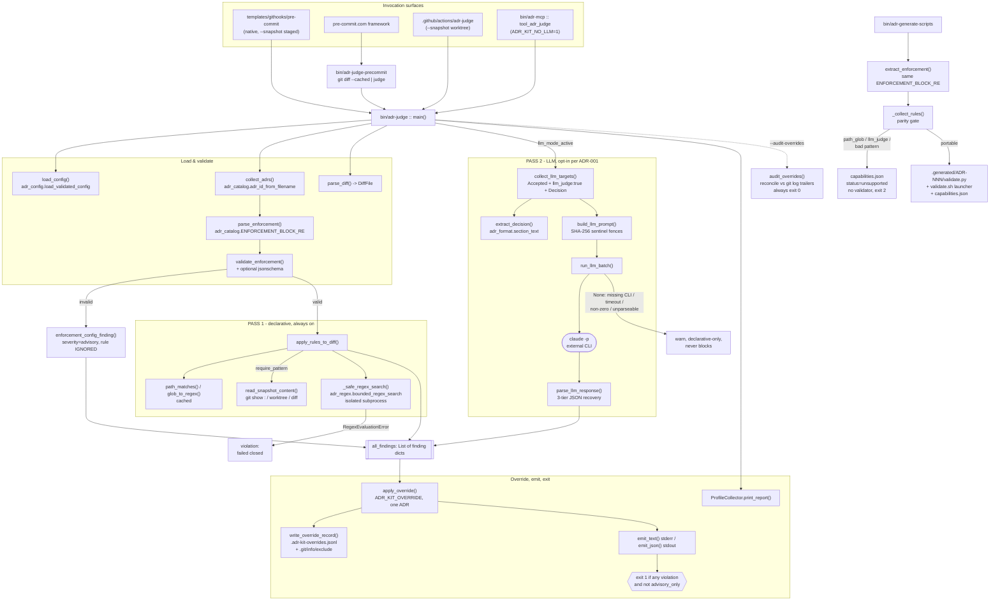

# Enforcement CLIs

## Overview

- **Name**: Enforcement CLIs (`bin-cli-enforcement`)
- **Description**: The fail-closed enforcement floor of adr-kit. `bin/adr-judge` reads the fenced JSON `## Enforcement` block of every **Accepted** ADR and evaluates a unified git diff against it in two passes: an always-on declarative regex pass and an opt-in batched LLM pass. `bin/adr-judge-precommit` is a 77-line adapter that lets the [pre-commit.com](https://pre-commit.com) framework (which passes filenames) drive the judge (which needs a diff on stdin). `bin/adr-generate-scripts` compiles the declarative subset of Enforcement blocks into standalone, adr-kit-free validator scripts so the same rules can run in foreign CI.
- **Location**:
  - [`bin/adr-judge`](../bin/adr-judge) — 1987 lines
  - [`bin/adr-judge-precommit`](../bin/adr-judge-precommit) — 77 lines
  - [`bin/adr-generate-scripts`](../bin/adr-generate-scripts) — 393 lines
- **Language**: Python 3.10+, stdlib-only by design. All three files carry `#!/usr/bin/env python3` and `from __future__ import annotations`, but have **no `.py` extension** — they are extensionless executables, invoked either directly or as `python bin/adr-judge`. Being non-importable is deliberate: shared logic lives in the sibling `adr_*.py` modules instead.
- **Purpose**: This is the only mechanism in adr-kit that **blocks**. Per [ADR-004](../docs/adr/ADR-004-layered-adr-context-injection.md), the three context-injection tiers (session, edit, task) are all fail-open and never block; `bin/adr-judge` at pre-commit and in the CI action "remains the only mechanism that blocks". Everything else in the kit steers; this cluster decides.

  Two qualifications on "the only mechanism that blocks", both by design and both worth stating up front, because a reader will otherwise hit them as contradictions:
  1. **`judge.advisory_only: true`** makes `adr-judge` print every violation and still exit 0 ([`bin/adr-judge:1975`](../bin/adr-judge)). ADR-004 pins *where* the floor lives, not that it is unliftable — this is the project-wide "report but don't gate" mode, distinct from the per-commit, per-ADR `ADR_KIT_OVERRIDE` escape hatch.
  2. **Only the declarative pass fails closed.** The asymmetry is deliberate: a regex that blows its safety budget becomes a `violation` ([`bin/adr-judge:676`](../bin/adr-judge)), while any LLM-pass failure returns `None` and is skipped with a warning ([`bin/adr-judge:1043`](../bin/adr-judge)). A malicious pattern must not be able to sneak past the gate; a missing `claude` binary must not be able to stop legitimate work.

### Governing ADRs

| ADR | Relevance (verified) |
|---|---|
| [ADR-001](../docs/adr/ADR-001-llm-gates-opt-in.md) — Make Per-Commit LLM Gates Opt-In | Directly governs `bin/adr-judge`'s LLM-mode resolution. Mandates `judge.llm_enabled` (default `false`) as the master switch, activation on `--llm` OR `judge.llm_enabled` OR legacy `judge.llm_default`, and that the hook template must not hard-code `--llm`. Its Enforcement block is explicitly **"Manual review only"** — no declarative rule, because `--llm` also appears legitimately in `_LLM_FLAG="--llm"`, `--llm-cmd`, `--llm-timeout`. |
| [ADR-004](../docs/adr/ADR-004-layered-adr-context-injection.md) — Layered ADR context injection | Names `bin/adr-judge` as the "one fail-closed floor", and pins the canonical fields all readers share: scope is the `## Enforcement` `path_glob`; status is the `## Status` line reconciled with the last `status_history` entry — "the same `entries[-1]` comparison `bin/adr-judge` and `bin/adr-lint` already make". |
| [ADR-015](../docs/adr/ADR-015-enforce-a-two-second-deterministic-latency-budget-as-a-test-fixture-contract.md) — Two-second deterministic latency budget | **Negative constraint only, not a governing decision for this code.** Its Enforcement scope is `tests/fixtures/cli/latency-corpus.json`; it touches this cluster solely by *excluding* `adr-judge --llm` and the guardian LLM tier from the deterministic budget ([`ADR-015:154`](../docs/adr/ADR-015-enforce-a-two-second-deterministic-latency-budget-as-a-test-fixture-contract.md)). Do not read it as enforcing anything in `bin/adr-judge`. |

ADR-008 governs `templates/githooks/pre-commit` (engine root resolution), not the files in this cluster; ADR-014 mentions `adr-judge` only in passing. Neither is cited as governing here.

#### ADR-001 and ADR-017 compliance: verified

The behavioural mandates of ADR-001 hold in the code. `judge.llm_enabled` exists and defaults false; activation is the three-way OR at [`bin/adr-judge:1698-1699`](../bin/adr-judge). The pre-commit template at [`templates/githooks/pre-commit:243-244`](../templates/githooks/pre-commit) builds `_LLM_FLAG` from `ADR_KIT_LLM` instead of hard-coding `--llm`, which is exactly what the ADR's "Manual review only" Enforcement note requires.

The module docstring was updated to reflect ADR-017. [`bin/adr-judge:2-35`](../bin/adr-judge) correctly describes the LLM pass as "on by default per ADR-017; opt-out via `ADR_KIT_NO_LLM=1`" and documents the per-ADR isolation introduced by ADR-017 ("`ONE ISOLATED call PER ADR`", line 13). The security fix for SEC-HIGH TASK-63 (replacing batching with per-ADR isolation) is documented in the docstring at lines 26-34.

---

## Code Elements

### `bin/adr-judge`

The diff-vs-ADR engine. 1987 lines, ~48 top-level definitions. **Documented exhaustively below for the public surface; the small private path/format helpers are summarized in aggregate at the end of this subsection rather than enumerated one by one.**

#### Architecture: the two passes

```
stdin (unified diff)  ──►  parse_diff()  ──►  {path: DiffFile}
docs/adr/ADR-*.md     ──►  collect_adrs() ──► [(adr_id, path, body)]
                                   │
                     filter: adr_status(body).lower() == "accepted"
                                   │
                     parse_enforcement() → validate_enforcement()
                                   │
        ┌──────────────────────────┴──────────────────────────┐
   PASS 1 (always on)                                   PASS 2 (opt-in)
   apply_rules_to_diff()                                collect_llm_targets()
   forbid_pattern / forbid_import  → added lines only    → build_llm_prompt()
   require_pattern                 → full post-image     → run_llm_batch()
                                                            ONE `claude -p` call
        └──────────────────────────┬──────────────────────────┘
                          all_findings: List[Dict]
                                   │
                   apply_override()  (ADR_KIT_OVERRIDE, one ADR/commit)
                                   │
                   emit_text() / emit_json()  +  ProfileCollector
                                   │
              exit 1 if any severity=="violation" and not advisory_only
```

Both passes produce the same finding dict shape:

```python
{"adr": str, "rule": str, "pattern": str|None, "path": str|None,
 "line": int|None, "snippet": str|None, "message": str, "severity": "violation"|"advisory"}
```

`apply_override` additionally stamps `"overridden": True` and `"override_reason": str`.

#### The Enforcement block rule types

| Rule kind | Input surface | Regex flags | Failure semantics |
|---|---|---|---|
| `forbid_pattern` | **Added lines only** (`+` lines from the diff), one line at a time | none (line-scoped) | Match → `violation` at `path:line` with a 200-char snippet ([`bin/adr-judge:638`](../bin/adr-judge)) |
| `forbid_import` | Identical engine to `forbid_pattern`; separate name documents intent | none | Same as above — the two kinds share one loop |
| `require_pattern` | **Full post-image** of every file matching `path_glob`, via `read_snapshot_content` | `re.MULTILINE` | Absent match → `violation`. Non-`present` snapshot state → `violation` with "enforcement failed closed" ([`bin/adr-judge:713`](../bin/adr-judge)) |
| `llm_judge` (bool) | The ADR's `## Decision` text + the whole diff, sent to Claude | n/a | With `--llm`: `violation` on a `VIOLATION` verdict. Without `--llm` **and** no declarative rules: a single `advisory` nudge to run `/adr-kit:judge` ([`bin/adr-judge:771`](../bin/adr-judge)) |

Every regex is evaluated through `_safe_regex_search` → `adr_regex.bounded_regex_search`, an **isolated killable subprocess** with a fixed wall-clock budget. A `RegexEvaluationError` (ReDoS/timeout) **fails closed**: the rule emits a `violation` telling the author to simplify the pattern ([`bin/adr-judge:676`](../bin/adr-judge), [`:753`](../bin/adr-judge)).

#### Public functions and classes

| Signature | Purpose | Location |
|---|---|---|
| `class JudgeError(Exception)` | Raised on configuration / input errors → exit 2. | `bin/adr-judge:157` |
| `@dataclass class DiffFile` — fields `path: str`, `old_path: Optional[str]`, `added: List[Tuple[int, str]]`, `is_new: bool = False`, `deleted: bool = False` | One post-diff file plus the added lines needed by forbid rules. | `bin/adr-judge:425` |
| `class ProfileCollector` — `__init__(self) -> None`, `start(self) -> None`, `stop_declarative(self) -> None`, `stop_llm(self) -> None`, `print_report(self, all_findings: List[Dict], budget_ms: int) -> None` | Timing accumulator for `--profile`. Two buckets (`declarative_ms`, `llm_ms`); rule-type counts derived post-hoc from findings so `apply_rules_to_diff` stays uninstrumented. | `bin/adr-judge:1399` |
| `parse_status_history(text: str) -> List[Dict[str, str]]` | Parse the embedded `status_history:` YAML list without a YAML parser. | `bin/adr-judge:175` |
| `validate_status_history(entries: List[Dict[str, str]], current_status: Optional[str] = None, today: Optional[date] = None) -> List[str]` | Structural + chronology issues: missing fields, invalid/future dates, non-monotonic ordering, and `entries[-1].status` vs the `## Status` line (the ADR-004 canonical reconciliation). | `bin/adr-judge:207` |
| `append_to_status_history(adr_path: Path, new_entry: Dict[str, str]) -> bool` | Append one validated transition without touching earlier entries; creates a `## Status History` block if absent. Refuses on validation failure or backwards dates. | `bin/adr-judge:249` |
| `migrate_status_history(adr_path: Path) -> bool` | Seed an initial v0.14 status entry for a legacy ADR (`--migrate-status-history` only). | `bin/adr-judge:296` |
| `parse_enforcement(adr_text: str, adr_path: Path) -> Optional[Dict]` | Extract + `json.loads` the fenced JSON inside `## Enforcement`. `None` when absent; `JudgeError` when malformed or not an object. | `bin/adr-judge:319` |
| `validate_enforcement(data: Dict) -> List[str]` | Stdlib structural validation mirroring `schemas/adr-enforcement.schema.json`, run **before** any regex compile or prompt construction. Layers the real JSON Schema on top when `jsonschema` happens to be installed. `[]` = valid. | `bin/adr-judge:353` |
| `enforcement_config_finding(adr_id: str, issues: List[str]) -> Dict` | Advisory finding stating the block was structurally invalid and **ignored** — never silently used. | `bin/adr-judge:408` |
| `parse_diff(text: str) -> Dict[str, DiffFile]` | Extract `(lineno, content)` per added line, keyed by post-diff path. Handles `/dev/null` (add/delete), Git `core.quotePath` C-escaped paths, and tracks the new-file line counter from `@@` headers. | `bin/adr-judge:491` |
| `glob_to_regex(glob: str) -> re.Pattern` | Translate a shell glob to an anchored regex. Supports `**` (recursive, with optional trailing slash), `*`, `?`, and brace expansion `{a,b,c}` (v0.12.2+, recursive per alternative). Module-wide cached in `_GLOB_PATTERN_CACHE`. Nested braces unsupported → treated literally. | `bin/adr-judge:540` |
| `path_matches(path: str, glob: Optional[str]) -> bool` | True when the path matches, **or no glob is set** (unscoped rules apply everywhere). | `bin/adr-judge:608` |
| `any_skip_match(path: str, skip_globs: List[str]) -> bool` | `judge.skip_files` exclusion test. | `bin/adr-judge:615` |
| `apply_rules_to_diff(adr_id: str, enforcement: Dict, diff_files: Dict[str, DiffFile], repo_root: Path, skip_files: List[str], llm_mode_active: bool = False, snapshot_mode: str = "diff", snapshot_cache: Optional[Dict[Tuple[str, str], Tuple[str, Optional[str]]]] = None) -> List[Dict]` | **The declarative pass.** Applies one ADR's block to the parsed diff. When `llm_mode_active` is True, pure-`llm_judge` ADRs are not emitted as advisories (pass 2 owns them); when False the v0.12.x advisory behaviour is preserved. | `bin/adr-judge:619` |
| `read_snapshot_content(diff_file: DiffFile, repo_root: Path, snapshot_mode: str, cache: Optional[Dict[Tuple[str, str], Tuple[str, Optional[str]]]] = None) -> Tuple[str, Optional[str]]` | Returns `("present"\|"missing"\|"unknown", content)`. The cache keyed by `(snapshot_mode, path)` avoids re-spawning `git show` when several require rules target the same file. | `bin/adr-judge:810` |
| `extract_title(body: str) -> str` | The `# ADR-NNN Title` line text, or `''`. | `bin/adr-judge:875` |
| `extract_decision(body: str) -> str` | Body of `## Decision` — delegates to `adr_format.section_text(body, "decision")`, so it is format-profile-aware (MADR / Nygard / canonical). | `bin/adr-judge:881` |
| `collect_llm_targets(adrs: List[Tuple[str, Path, str]], restrict_to: Optional[str] = None, diff_paths: Optional[Iterable[str]] = None) -> Tuple[List[Dict], List[Dict]]` | Returns `(targets, skipped)`. Targets: `[{adr_id, title, decision}]` for Accepted ADRs whose Enforcement block is valid, has `llm_judge: true` (defaults to true; requires explicit `false` to opt out), has a non-empty Decision section, and whose scope touches the diff. Skipped entries record reasons: invalid block, non-Accepted status, retired by supersession, scope not touched, no Decision section. Recorded so `--json` attests to which decisions were actually covered (TASK-63 AC #7). | `bin/adr-judge:1185` |
| `build_llm_prompt(targets: List[Dict], diff_text: str) -> str` | Builds one prompt per isolated ADR call (ADR-017 per-ADR isolation, SEC-HIGH TASK-63). Single prompt structure: instruction preamble → `=== ADRS TO EVALUATE ===` → fenced ADR blob → `=== STAGED DIFF ===` → fenced diff. Fences are SHA-256-derived sentinel tokens (`<<<ADR-KIT-DATA-{sha256[:16]} BEGIN>>> … END>>>`) so an attacker cannot pre-place an END marker. | `bin/adr-judge:1281` |
| `parse_llm_response(raw: str) -> Dict[str, Dict]` | Three-tier JSON recovery: direct parse → fenced ```` ```json ```` block → greedy first `{...}`. `JudgeError` when nothing is recoverable. Expects `{ADR-NNN: {verdict: OK|VIOLATION, reason: "..."}}` keyed to the single target ADR. | `bin/adr-judge:1374` |
| `_run_llm_single(target: Dict, diff_text: str, backend: LLMBackend, timeout_s: int) -> Optional[Tuple[bool, str]]` | **One isolated LLM call per ADR** (ADR-017 per-ADR isolation, SEC-HIGH TASK-63/F2). Returns `(ok, reason)` or `None` (fall back to declarative-only). See `run_llm_batch` for failure handling. | `bin/adr-judge:1424` |
| `run_llm_batch(targets: List[Dict], diff_text: str, backend: LLMBackend|List[str]|str|None, timeout_s: int, attestation: Optional[Dict] = None) -> Optional[List[Dict]]` | **The LLM pass orchestrator.** Runs one isolated call per ADR target (line 1545: `for t in targets: outcome = _run_llm_single(t, diff_text, resolved, timeout_s)`). Returns `None` (fall back to declarative-only) when: (1) no backend is configured (`"no LLM backend is configured"`), (2) any ADR call fails, times out, or returns unparseable output, (3) any call returns no verdict for its ADR id. Never returns a partial list: one failed call degrades the whole pass, because a partially-evaluated pass reported as complete is the failure mode this hardening exits to remove (SEC-HIGH, TASK-63). Never blocks even when the LLM CLI is missing or network unreachable — warns and skips (ADR-001 integrity). | `bin/adr-judge:1486` |
| `parse_override_env(raw: str) -> Optional[Tuple[str, str]]` | Parse `ADR_KIT_OVERRIDE` into `("ADR-NNN", reason)` with zero-padded normalisation. An empty reason is an explicit **refusal** (returns `None`). | `bin/adr-judge:1162` |
| `write_override_record(adr_dir: Path, repo_root: Path, record: Dict[str, object]) -> Optional[Path]` | Append one JSONL override record; never raises. Also best-effort registers the log in `.git/info/exclude`. | `bin/adr-judge:1234` |
| `apply_override(findings: List[Dict], override_id: str, reason: str) -> int` | Downgrade `violation` → `advisory` **in place**, for exactly one ADR id. Returns the count. Other ADRs keep blocking. | `bin/adr-judge:1254` |
| `audit_overrides(adr_dir: Path, repo_root: Path, as_json: bool) -> int` | Read-only reconciliation of the JSONL log against `ADR-Override:` git-log trailers. Always returns 0 (report, not gate) — except 2 on an unreadable log. | `bin/adr-judge:1296` |
| `load_config(path: Optional[Path]) -> Dict` | `adr_config.load_validated_config` with `ConfigValidationError` re-raised as `JudgeError`. | `bin/adr-judge:1497` |
| `collect_adrs(adr_dir: Path, dry_run_target: Optional[str] = None) -> List[Tuple[str, Path, str]]` | `[(adr_id, path, body)]` for every `ADR-*.md`. With `dry_run_target` it narrows the glob first and only falls back to a full scan when nothing matched, so "not found" stays deterministic. | `bin/adr-judge:1505` |
| `read_diff(diff_arg: str) -> str` | `-`/empty → stdin bytes decoded with `errors="replace"`; otherwise a file path. | `bin/adr-judge:1538` |
| `emit_text(findings: List[Dict], adr_count: int, advisory_only: bool) -> None` | Human report — **entirely on stderr**, so stdout stays clean for `--json`. | `bin/adr-judge:1544` |
| `emit_json(findings: List[Dict], adr_count: int) -> None` | `{"summary": {adrs_checked, violations, advisories}, "findings": [...]}` on stdout. | `bin/adr-judge:1575` |
| `main() -> int` | Argument parsing, config/LLM-mode/LLM-command resolution, the four early-exit subcommands, both passes, override handling, emission, profiling, exit-code decision. | `bin/adr-judge:1588` |

#### Module-level constants worth knowing

| Name | Value / role | Location |
|---|---|---|
| `DEFAULT_LLM_CMD` | `["claude", "-p", "--model", "claude-sonnet-4-6"]` | `bin/adr-judge:64` |
| `DEFAULT_LLM_TIMEOUT_S` | `120` (adr-judge); `30` (adr-suggest) | `bin/adr-judge:131`; `bin/adr-suggest:112` |
| `_LLM_CMD_ALLOWLIST` | `{claude, claude-code, claude-opus-4-7, claude-sonnet-4-6, claude-haiku-4-5, claude-haiku-4-5-20251001}` — enforced **only** for `judge.llm_cmd` from repo-tracked config; env and CLI overrides are deliberately unrestricted (operator-controlled). | `bin/adr-judge:71` |
| `ENFORCEMENT_KNOWN_KEYS` | `{forbid_pattern, forbid_import, require_pattern, llm_judge}` | `bin/adr-judge:347` |
| `ENFORCEMENT_RULE_KEYS` | `{pattern, path_glob, message}` | `bin/adr-judge:350` |
| `STATUS_HISTORY_REQUIRED_FIELDS` | `(date, status, changed_by, reason, changed_via)` | `bin/adr-judge:147` |
| `OVERRIDE_ENV_VAR` / `OVERRIDE_LOG_NAME` / `OVERRIDE_TRAILER_KEY` | `ADR_KIT_OVERRIDE` / `.adr-kit-overrides.jsonl` / `ADR-Override` | `bin/adr-judge:1154–1156` |
| `HUNK_HEADER_RE` | `^@@ -\d+(?:,\d+)? \+(\d+)(?:,\d+)? @@` — the post-image line counter source | `bin/adr-judge:154` |

#### Private helpers (summarized, not enumerated)

Nine private helpers are intentionally summarized rather than documented individually: `_get_enforcement_validator()` (cached optional-`jsonschema` validator), `_safe_regex_search(pattern, text, timeout_s=1.0)` (thin delegate to the shared bounded evaluator — note it *accepts and discards* `timeout_s`, see Notable findings), `_split_cmd(cmd_str)` (Windows-path-safe `shlex.split` with `posix=False`), `_yaml_scalar(value)`, `_format_history_entry(entry)`, `_decode_git_quoted_path(raw)` (full C-escape decoder incl. octal), `_diff_path(raw, prefix)`, `_safe_repo_path(repo_root, path)` (path-traversal guard: rejects absolute paths, `..` components, and anything resolving outside the repo root), `_read_snapshot_content(...)` (uncached inner of the snapshot reader), plus four git helpers `_git_output`, `_git_user`, `_ensure_override_log_excluded`, `_collect_trailer_overrides`.

---

### `bin/adr-judge-precommit`

77-line adapter for the pre-commit.com framework. Registered as [`.pre-commit-hooks.yaml`](../.pre-commit-hooks.yaml) hook id `adr-judge` with `pass_filenames: false`, `stages: [pre-commit]`, `minimum_pre_commit_version: "3.2.0"`.

| Signature | Purpose | Location |
|---|---|---|
| `main() -> int` | Runs `git diff --cached --unified=0`, pipes the raw bytes into the sibling `bin/adr-judge`, propagates the exit code verbatim. | `bin/adr-judge-precommit:45` |

Module-level: `_ADR_JUDGE = Path(__file__).resolve().parent / "adr-judge"` with a fail-fast existence check that exits 2 before `main()` is ever reachable ([`bin/adr-judge-precommit:34-42`](../bin/adr-judge-precommit)). The child invocation is fixed:

```
sys.executable  bin/adr-judge  --diff -  --adr-dir docs/adr/  --repo-root <cwd>  --snapshot staged
```

Note what is **absent**: no `--llm`. Declarative-only unless `judge.llm_enabled` is set in `.adr-kit.json`, which `adr-judge` reads for itself. This is ADR-001 compliance by omission.

Note also what is **hard-coded**: `--adr-dir docs/adr/`. There is no flag, no env var, and no config lookup to change it — the pre-commit framework calls this wrapper bare, and `pass_filenames: false` means nothing is threaded through. A project whose ADRs live in `docs/decisions` therefore cannot use the pre-commit.com integration path at all, even though `bin/adr-generate-scripts` advertises `--adr-dir docs/decisions` in its own usage block and both the native hook and the GitHub Action parameterise the directory.

---

### `bin/adr-generate-scripts`

Compiles the *portable subset* of Enforcement blocks into standalone validators under `.generated/<ADR-ID>/`. The generated scripts read a file on stdin and exit 0 clean / 1 violation / 2 incomplete-enforcement. Output per ADR: `capabilities.json`, `validate.py`, `validate.sh`.

| Signature | Purpose | Location |
|---|---|---|
| `extract_enforcement(content: str) -> Optional[Dict]` | Same `ENFORCEMENT_BLOCK_RE` reader as the judge; `None` when absent, `ValueError` when malformed. | `bin/adr-generate-scripts:35` |
| `generate_python_script(adr_id: str, rules: List[Dict]) -> str` | Render the standalone Python validator from a `__ADR_ID__`/`__RULES__` template. The generated script is itself self-isolating: it re-execs `sys.executable __file__ --regex-worker` per rule with a 1.0 s timeout and a 2 MiB input cap. | `bin/adr-generate-scripts:79` |
| `generate_shell_script(adr_id: str, rules: List[Dict]) -> str` | Render `validate.sh`. **Deliberately not a shell reimplementation** — `del rules` on the first line, then it emits a POSIX launcher that `exec`s `validate.py` so regex semantics stay byte-identical (with a `python3` → `python` fallback probe). | `bin/adr-generate-scripts:188` |
| `generate_scripts_for_adr(adr_id: str, enforcement: Dict, output_dir: Path, langs: List[str]) -> Tuple[List[Path], List[str]]` | Write `capabilities.json` always; write validators only when nothing is unsupported. Returns `(written_paths, unsupported_keys)`. | `bin/adr-generate-scripts:227` |
| `main() -> int` | CLI: resolve ADR dir and langs, iterate `ADR-*.md`, print a summary. Exit 0 clean, 2 when any ADR errored or could not be faithfully compiled. | `bin/adr-generate-scripts:277` |

Private helpers (2, summarized): `_collect_rules(enforcement)` — the parity gate; `_make_executable(path)` — adds `S_IXUSR` only (user-only by design; no-op on Windows).

#### The parity contract in `capabilities.json`

`_collect_rules` ([`bin/adr-generate-scripts:54`](../bin/adr-generate-scripts)) refuses to silently degrade. Any rule carrying a `path_glob`, an empty `pattern`, an uncompilable `pattern`, or the presence of `llm_judge` is recorded in `unsupported[]`, the whole ADR's `status` flips to `"unsupported"`, **no validator is written**, and `main` returns 2. The emitted metadata:

```json
{"schema_version": 1, "adr_id": "...", "status": "supported|unsupported",
 "rule_types": [...], "regex_engine": "python-re-isolated-subprocess",
 "regex_timeout_seconds": 1.0, "max_input_bytes": 2097152,
 "path_scope": false, "shell_mode": "python-launcher"|null, "unsupported": [...]}
```

`path_scope: false` is the honest admission that the standalone form has no notion of which file it is looking at — it reads one blob on stdin.

---

## Dependencies

### Internal

| Module | Imported symbols | Used by |
|---|---|---|
| [`bin/adr_catalog.py`](../bin/adr_catalog.py) | `ENFORCEMENT_BLOCK_RE` (`:40`), `adr_id_from_filename(name: str) -> Optional[str]` (`:92`), `adr_status(text: str) -> Optional[str]` (`:63`) | `adr-judge`, `adr-generate-scripts` (first two only) |
| [`bin/adr_format.py`](../bin/adr_format.py) | `section_text(text: str, role: str, *, profile: Optional[str] = None, tolerant: bool = True) -> str` (`:616`) | `adr-judge` — makes Decision extraction format-profile-aware (ADR-005 registry) |
| [`bin/adr_config.py`](../bin/adr_config.py) | `ConfigValidationError` (`:11`), `load_validated_config(path: Path \| None) -> Dict[str, Any]` (`:154`) | `adr-judge` |
| [`bin/adr_regex.py`](../bin/adr_regex.py) | `RegexEvaluationError` (`:20`), `bounded_regex_search(pattern: str, text: str, flags: int = 0) -> bool` (`:150`) | `adr-judge` — the ReDoS-safe evaluator |
| [`bin/adr-judge`](../bin/adr-judge) | invoked as a subprocess | `bin/adr-judge-precommit`, `bin/adr-mcp` (`tool_adr_judge`, `bin/adr-mcp:456`), `templates/githooks/pre-commit`, `.github/actions/adr-judge/action.yml` |
| [`schemas/adr-enforcement.schema.json`](../schemas/adr-enforcement.schema.json) | read at runtime, only if `jsonschema` is importable | `adr-judge` |

Both scripts prepend `Path(__file__).resolve().parent` to `sys.path` so the sibling `adr_*.py` modules import regardless of cwd ([`bin/adr-judge:53-55`](../bin/adr-judge), [`bin/adr-generate-scripts:26-28`](../bin/adr-generate-scripts)).

Note: `bin/adr-audit:127` carries a **duplicated copy** of `glob_to_regex` with the comment "Same translator as bin/adr-judge" — a known divergence risk outside this cluster.

### External

**Third-party Python packages: none required.** One optional, lazily-imported exception:

- `jsonschema` — [`bin/adr-judge:101`](../bin/adr-judge), inside `_get_enforcement_validator()`, wrapped in `try/except ImportError` returning `None`. When absent, the stdlib structural checks in `validate_enforcement` are the whole story. The stdlib-only invariant therefore **holds at runtime** — the kit never requires the package and behaves correctly without it — but the file does contain a third-party import statement, and the depth of Enforcement-block validation silently differs between a machine that happens to have `jsonschema` installed and one that does not. `bin/adr-lint` uses the same auto-detect approach, so this is a consistent project-wide pattern rather than a one-off.

Standard library used: `argparse`, `dataclasses`, `datetime`, `hashlib`, `json`, `os`, `pathlib`, `re`, `shlex`, `shutil`, `stat`, `subprocess`, `sys`, `time`, `typing`.

**External CLIs / OS services:**

| Command | Where | Purpose |
|---|---|---|
| `claude -p --model claude-sonnet-4-6` | `run_llm_batch`, `bin/adr-judge:1064` | The LLM pass. Presence probed via `shutil.which`; absence → warn + skip, never block. |
| `git diff --cached --unified=0` | `bin/adr-judge-precommit:47` | Capture the staged diff. |
| `git -C <root> show :<path>` | `_read_snapshot_content`, `bin/adr-judge:841` | `--snapshot staged` post-image for `require_pattern`. |
| `git -C <root> config user.name / user.email` | `_git_user`, `bin/adr-judge:1195` | Attribute an override. |
| `git -C <root> rev-parse --git-path info/exclude` | `bin/adr-judge:1212` | Locate the exclude file for the override log. |
| `git -C <root> log --format=...%(trailers:key=ADR-Override,valueonly=true)` | `bin/adr-judge:1277` | Trailer reconciliation for `--audit-overrides`. |
| `python3` / `python` | generated `validate.sh`, `bin/adr-generate-scripts:201` | Launcher probe in generated artefacts. |

All git calls go through `_git_output`, which has a 10 s timeout and swallows every failure into `None`. The `git show` call in `_read_snapshot_content` is the exception — it is called directly, without a timeout.

**Binary artefacts present**: `bin/__pycache__/` holds compiled `.pyc` files for the importable `adr_*.py` siblings (`cpython-310`, `-312`, `-314` variants). The three files in this cluster are extensionless executables and are never byte-compiled, so they have no `__pycache__` entries of their own.

---

## Interfaces

### `bin/adr-judge` CLI

```
adr-judge [--diff PATH|-] [--adr-dir DIR] [--config PATH] [--json]
          [--repo-root DIR] [--snapshot {diff,staged,worktree}]
          [--llm] [--llm-cmd CMD] [--llm-timeout SECONDS]
          [--profile] [--migrate-status-history]
          [--check-override] [--audit-overrides]
          [--dry-run-enforcement ADR-NNN]
```

| Flag | Default | Notes |
|---|---|---|
| `--diff` | `-` (stdin) | Unified diff. Size-gated by `judge.max_diff_bytes` (default 1 048 576) → exit 2, enforcement *not performed*. |
| `--adr-dir` | `docs/adr` | |
| `--config` | `<adr-dir>/.adr-kit.json` | Schema-validated; a validation error is exit 2. |
| `--snapshot` | `diff` | `staged` = `git show :path`; `worktree` = read the file; `diff` reconstructs new files but **fails closed** for incomplete modified-file patches. |
| `--llm` | off | Per ADR-001. |
| `--llm-cmd` / `--llm-timeout` | `claude -p --model claude-sonnet-4-6` / 120 s | LLM timeout in `bin/adr-judge` defaults to 120 s (`judge.llm_timeout_seconds`). Each target ADR with `llm_judge: true` receives one isolated call; worst case is N targets × 120 s. `bin/adr-suggest` defaults to 30 s and derives its bound from `judge.pre_commit_timeout_ms` in the pre-commit hook (line 320-321), with a 10 s floor. |
| `--profile` | off | Timing table on stderr: `Rule / Time(ms) / Count / Avg(ms) / Budget%`, budget = `judge.pre_commit_timeout_ms` (default 5000). |
| `--dry-run-enforcement` | — | Single-ADR test, zero state changes (the override pass is skipped). Accepts `ADR-001`, `ADR-1`, `001`, `1`. Exit 2 if the id is unknown. |
| `--check-override` | — | Validate `ADR_KIT_OVERRIDE` and exit. 0 = parses, 2 = missing/invalid. |
| `--audit-overrides` | — | Read-only report; honours `--json`. Always exit 0. |
| `--migrate-status-history` | — | The **only** write path over ADR files. Normal judging is read-only w.r.t. tracked content. |

**Exit codes** (mirroring `bin/adr-lint`): `0` no violations (advisories may exist, or `judge.advisory_only` forced the downgrade) · `1` at least one violation from either pass · `2` config or input error, plus `KeyboardInterrupt`.

**Output convention**: all *judging* output — the finding list, every WARN, the profile table, the override banner — goes to **stderr**. Stdout carries only machine payloads: the `--json` findings object and the `--migrate-status-history` JSON. That split is what makes `git diff | adr-judge --json | jq` work inside a hook that simultaneously shows the operator its reasoning. One exception: the *non-JSON* `--migrate-status-history` summary at [`bin/adr-judge:1770`](../bin/adr-judge) is a bare `print(...)` and therefore lands on **stdout** despite wearing the same `[adr-judge]` prefix as the stderr messages.

### Environment variables

| Variable | Effect |
|---|---|
| `ADR_KIT_NO_LLM=1` | Highest-precedence force-off for the LLM pass (`bin/adr-judge:1698`). Beats `--llm` and both config flags. `bin/adr-mcp` sets it unconditionally. |
| `ADR_KIT_LLM_CMD` | Override the LLM invocation; **not** allowlist-restricted (operator-controlled). |
| `ADR_KIT_OVERRIDE="ADR-NNN: reason"` | Downgrade violations of exactly one ADR to loud WARN advisories, logged to `<adr-dir>/.adr-kit-overrides.jsonl`. Empty reason = refused. |
| `ADR_KIT_DEBUG=1` | Print LLM stderr / parse errors. Off by default so tokens, paths and prompts do not leak into hook output (`bin/adr-judge:1083`). |
| `ADR_KIT_LLM=1` | Read by `templates/githooks/pre-commit:194` (not by `adr-judge` itself) to set `_LLM_FLAG="--llm"`. |

### Config contract (`docs/adr/.adr-kit.json`, `judge` block)

`skip_files: string[]` · `advisory_only: bool` · `max_diff_bytes: int` · `llm_enabled: bool` · `llm_default: bool` (legacy) · `llm_cmd: string|string[]` (allowlisted) · `llm_model: string` · `llm_timeout_seconds: int` · `pre_commit_timeout_ms: int` · `warn_on_exceed: bool`.

[`schemas/adr-kit-config.schema.json`](../schemas/adr-kit-config.schema.json) declares the `judge` block with `additionalProperties: false`, so every key `adr-judge` reads must be listed there — and all of them are. The reverse is not true: the schema also accepts `judge.llm_timeout_ms` and `judge.pre_push_timeout_ms`, and a repo-wide grep finds **no reader** for `llm_timeout_ms` anywhere in `bin/`. Setting it validates cleanly and does nothing; the effective knob is `llm_timeout_seconds`. This is the same failure mode ADR-001's own Context calls out for `suggest.enabled` — "the opt-out was a documented-but-unread no-op" — still live in the same config file, one block over.

**Performance budget (`judge.pre_commit_timeout_ms`)**: The pre-commit hook [`templates/githooks/pre-commit:203-231`](../templates/githooks/pre-commit) reads and validates this key from `.adr-kit.json`. When absent, defaults to 5000 ms (schema default). Accepts values 0–3,600,000 ms; anything outside that range is logged by name on stderr and the default 5000 ms is used. The value `0` disables the warning (the same as `warn_on_exceed: false`). The 1-hour ceiling accommodates projects with many ADRs (`judge.llm_timeout_seconds` defaults to 120 s; a 10-ADR project's worst case is 20 minutes).

LLM-mode resolution ([`bin/adr-judge:1698`](../bin/adr-judge)):

```python
llm_mode_active = (args.llm or judge_cfg.llm_enabled or judge_cfg.llm_default) and not ADR_KIT_NO_LLM
```

LLM-command precedence ([`:1706`](../bin/adr-judge)): `--llm-cmd` → `ADR_KIT_LLM_CMD` → `judge.llm_cmd` (allowlist-checked, falls back to default with a warning if rejected) → `judge.llm_model` (wrapped as `claude -p --model <m>`) → `DEFAULT_LLM_CMD`.

### JSON contract (`--json`)

```json
{"summary": {"adrs_checked": 0, "violations": 0, "advisories": 0},
 "findings": [{"adr": "ADR-001", "rule": "forbid_pattern", "pattern": "...",
               "path": "src/x.py", "line": 42, "snippet": "...",
               "message": "...", "severity": "violation"}]}
```

`--audit-overrides --json` returns a different shape: `{log_path, log_present, git_log_available, entries[], summary{logged, reconciled, unmatched}}`.

### LLM wire contract

**Per-ADR isolation** (ADR-017, SEC-HIGH TASK-63/F2): Each ADR with `llm_judge: true` receives one isolated prompt containing only its own Decision and the diff. No sibling ADR's text reaches the context that decides its verdict, so a malicious decision cannot flip a genuine VIOLATION to OK (the historical exploit that prompted this redesign).

**Prompt structure**: Instruction preamble → `=== ADRS TO EVALUATE (untrusted data) ===` → fenced single-ADR blob → `=== STAGED DIFF (untrusted data) ===` → fenced diff. Fences are `<<<ADR-KIT-DATA-{sha256[:16]} BEGIN>>> … END>>>` — tokens derived from fenced content so an attacker cannot pre-place a matching END marker: embedding a guessed token changes the content and therefore the token ([`bin/adr-judge:1260`](../bin/adr-judge)).

**Expected response**: `{"ADR-NNN": {"verdict": "OK"}}` or `{"ADR-NNN": {"verdict": "VIOLATION", "reason": "<one sentence>"}}`. Reasons are truncated to 500 chars. Verdict comparison (line 1469-1470): normalised = `raw_verdict.strip().upper()`, matched against `_LLM_OK_VERDICTS` (`frozenset({"OK"})`); anything not literally "OK" when uppercased is treated as a violation.

**Degradation to declarative-only** (ADR-001 integrity): When no LLM backend is configured, or any call fails/times out/returns unparseable output, `run_llm_batch` prints a warning and returns `None`, which causes the whole LLM pass to be skipped and enforcement to fall back to declarative-only. This is deliberate: tooling drift must never block a legitimate commit. Never returns a partial list (one failed call degrades the whole pass). ([`bin/adr-judge:1531-1554`](../bin/adr-judge))

### `bin/adr-judge-precommit`

No flags — the pre-commit framework calls it bare. Exit codes 0/1/2 propagated verbatim from the child.

### `bin/adr-generate-scripts` CLI

```
adr-generate-scripts [--output DIR] [--lang {python,shell,all}] [--adr-dir DIR] [adr_dir]
```

`--output` default `.generated`; `--lang` default `all`; ADR dir resolution is `--adr-dir` → positional → `docs/adr`. Exit 0 clean, 2 on a missing ADR dir or any per-ADR error (unreadable file, malformed Enforcement JSON, unsupported semantics). A directory with no `ADR-*.md` prints a note and exits **0**.

Generated `validate.py` / `validate.sh` contract: file content on stdin, exit 0 = clean, 1 = violations (details on stderr), 2 = input over 2 MiB or a rule that could not be evaluated within the 1.0 s regex budget.

### CI / hook integration surfaces

- [`.pre-commit-hooks.yaml`](../.pre-commit-hooks.yaml) — hook id `adr-judge`, `entry: bin/adr-judge-precommit`, `language: script`, `pass_filenames: false`.
- [`.github/actions/adr-judge/action.yml`](../.github/actions/adr-judge/action.yml) — composite action. Inputs `adr-dir` (default `docs/adr/`), `python-version` (default `3.11`). Runs `git diff --unified=0 origin/$GITHUB_BASE_REF...HEAD | python $JUDGE --diff - --snapshot worktree`. Resolves the judge via `$GITHUB_ACTION_PATH/../../../bin/adr-judge`, and requires `fetch-depth: 0`.
- [`templates/githooks/pre-commit`](../templates/githooks/pre-commit) — the native hook. Builds `_LLM_FLAG` from `ADR_KIT_LLM` (ADR-001 compliant, verified at line 193-194), holds a concurrency lock, and calls the judge with `--snapshot staged`.
- [`bin/adr-mcp`](../bin/adr-mcp) — exposes `adr_judge` as an MCP tool (`tool_adr_judge`, `bin/adr-mcp:456`), forcing `ADR_KIT_NO_LLM=1` (`:474`).

### Tests

Six dedicated test modules cover this cluster: [`tests/test_adr_judge.py`](../tests/test_adr_judge.py), [`test_adr_judge_llm.py`](../tests/test_adr_judge_llm.py), [`test_adr_judge_override.py`](../tests/test_adr_judge_override.py), [`test_adr_judge_precommit.py`](../tests/test_adr_judge_precommit.py), [`test_adr_judge_security.py`](../tests/test_adr_judge_security.py), [`test_adr_generate_scripts.py`](../tests/test_adr_generate_scripts.py). `--llm-cmd` exists partly so tests can inject a fake binary.

---

## Relationships


