# Verification Gate CLIs

## Overview

- **Name**: Verification Gate CLIs (`bin-cli-gates`)
- **Description**: Two stdlib-only Python CLIs that implement adr-kit's verification gates over Markdown ADR files. [`bin/adr-lint`](../bin/adr-lint) is the pass/fail policy engine: it runs eight named gates over a directory or a single file, resolves each finding to `FAIL` or `ADVISORY` through a three-level severity model, and exits non-zero only when something reaches `FAIL`. [`bin/adr-quality`](../bin/adr-quality) is the scoring engine: it runs four weighted gates over one file, emits a `0.00`–`1.00` composite score with an A–D letter grade, structured issue codes, and per-code remediation strings. Neither tool ever invokes an LLM.
- **Location**: [`bin/adr-lint`](../bin/adr-lint) (1590 lines), [`bin/adr-quality`](../bin/adr-quality) (715 lines)
- **Language**: Python 3 (`#!/usr/bin/env python3`, `from __future__ import annotations`), no shebang-less module extension — both files are extensionless executables imported by tests via `SourceFileLoader`
- **Purpose**: Give the project a deterministic, free, offline answer to "is this ADR well-formed and internally consistent?" so that CI, the pre-commit path, `bin/adr accept`, the doctor, the guardian sweep and the MCP server all share one gate implementation instead of each re-deriving the rules. `adr-lint` decides; `adr-quality` advises with a number.

### The four gates, and which are deterministic

The project guide describes "four verification gates". That name survives in both
tools, but the two files realise it differently and `adr-lint` has since grown to
eight gates.

| Gate | In `adr-lint` | In `adr-quality` | Nature |
| --- | --- | --- | --- |
| **Completeness** | yes (default) | yes (weight 0.4) | **Deterministic.** Heading presence against the profile's required set; plus an unresolved-Open-Questions check. |
| **Consistency** | yes (default) | yes (weight 0.2) | **Deterministic.** Filename pattern, heading-number vs filename agreement, duplicate ADR numbers, supersession bidirectionality, frontmatter cross-references. |
| **Evidence** | opt-in via `--gates` | yes (weight 0.2) | **Heuristic.** `adr-lint` looks for bare comparative adjectives with no nearby number/citation and only reports at 3+ hits. `adr-quality` awards points for a non-empty References section, a measurement, an external link, a `file:line` reference. |
| **Clarity** | opt-in via `--gates` | yes (weight 0.2) | **Heuristic.** Unexpanded ALL-CAPS acronyms. This is the gate ADR-009 bounded. |
| **Schema** | opt-in (auto-added by `--strict`) | — | Deterministic. Canonical YAML frontmatter validation. |
| **Audit** | yes (default) | — | Deterministic. `status_history` chain: required fields, ISO dates, no future dates, monotonic order, last entry agrees with the `## Status` section. |
| **Policy** | opt-in via `--gates` | — | Mixed. Deterministic for `## Enforcement` JSON parse + regex compilability (`FAIL`); heuristic for the anti-pattern advisories (excessive wildcard, broad glob) and the selective-retrieval-metadata check. |
| **Quality** | opt-in via `--gates`, always `ADVISORY` | — (this *is* `adr-quality`) | Heuristic. A deliberately reduced subset of `adr-quality`; see [`bin/adr-lint:1013`](../bin/adr-lint#L1013). |

`ALL_GATES` is defined at [`bin/adr-lint:127`](../bin/adr-lint#L127);
`DEFAULT_GATES = ["completeness", "audit", "consistency"]` at
[`bin/adr-lint:137`](../bin/adr-lint#L137). The default set is the three
deterministic gates — the heuristic gates `evidence` and `clarity` are off by
default precisely because, per the module docstring, "they need judgement that a
regex cannot reliably provide" ([`bin/adr-lint:6`](../bin/adr-lint#L6)).

### How ADR-009 bounds the heuristic clarity gate

ADR-009 (Accepted 2026-07-18, `binding: false`) is the governing decision for the
heuristic gates. Its `## Enforcement` block carries a `require_pattern` for
`CLARITY_ACRONYM_ALLOWLIST` scoped to `path_glob: bin/adr-lint`, so the judge
mechanically prevents the allowlist from being replaced by a tuned threshold.

The three bounds it mandates are all present in `adr-lint`:

1. **Frontmatter excluded, line numbers preserved** — `_strip_frontmatter_lines`
   ([`bin/adr-lint:521`](../bin/adr-lint#L521)) returns the line list with
   frontmatter entries replaced by `None` rather than removed, so reported line
   numbers stay accurate.
2. **Both expansion word orders accepted** — `gate_clarity`
   ([`bin/adr-lint:510`](../bin/adr-lint#L510)) matches `ACRONYM (expansion)` via
   a lookahead on the tail and `expansion (ACRONYM)` via `re.search(r"\w\s+\($", head)`.
3. **A reviewable allowlist, not a threshold** — `CLARITY_ACRONYM_ALLOWLIST`
   ([`bin/adr-lint:477`](../bin/adr-lint#L477)) is a 23-entry `frozenset`
   (verified by import). The 3-distinct-acronym failure threshold is unchanged.

The reporting fix ADR-009 also required is at
[`bin/adr-lint:1276`](../bin/adr-lint#L1276): `details` stay capped at five hits
for readability while `summary` counts every distinct acronym.

**`bin/adr-quality` does not implement any of these bounds.** See
[Notable findings](#notable-findings).

## Code Elements

### `bin/adr-lint`

Policy engine. One `main()` run: discover files → build cross-file indexes
(duplicates, supersession, frontmatter consistency) once → lint each file →
aggregate counts → render.

#### Severity resolution

The documented precedence is `ignore > per-ADR markers > config.severity`, and
within `config.severity`: `always_strict > always_advisory > advisory_before_strict_from`.

| Signature | Description | Location |
| --- | --- | --- |
| `class PolicyError(Exception)` | Raised when `.adr-kit.json` is malformed. | [`bin/adr-lint:184`](../bin/adr-lint#L184) |
| `load_config(path: Optional[Path]) -> Dict` | Read `.adr-kit.json`, validate `severity` gate names/values, `strict_from` pattern, `template.profile`; optionally deep-validate against `schemas/adr-kit-config.schema.json` when `jsonschema` is importable. Returns `{}` when absent. | [`bin/adr-lint:188`](../bin/adr-lint#L188) |
| `severity_of(gate: str, adr_num: int, cfg: Dict, strict_from_override: Optional[str]) -> str` | Resolve a gate failure to `"FAIL"` or `"ADVISORY"` from policy. Note the default at line 262: when `strict_from` is set, every gate *except* `consistency` defaults to `advisory_before_strict_from`; `consistency` stays `always_strict`. | [`bin/adr-lint:253`](../bin/adr-lint#L253) |
| `level_for(gate: str, adr_num: int, cfg: Dict, strict_from_override: Optional[str], file_advisory: bool, strict_mode: bool) -> str` | Full precedence wrapper: `--strict` forces `FAIL`, a file-level `advisory` marker forces `ADVISORY`, otherwise defer to `severity_of`. | [`bin/adr-lint:273`](../bin/adr-lint#L273) |
| `parse_marker(text: str) -> Tuple[bool, bool, Set[str], Optional[str]]` | Scan for the first `<!-- adr-kit-lint: ... -->` marker. Directives: `skip`, `advisory`, `skip <gate>[,<gate>]`. Returns `(file_skipped, file_advisory, gate_skip_set, raw_directive)`. Unknown gate names in a `skip` list are dropped, not failed. | [`bin/adr-lint:289`](../bin/adr-lint#L289) |
| `parse_gates(arg: Optional[str]) -> Set[str]` | Parse `--gates`. `None` → `DEFAULT_GATES`; `"all"` → `ALL_GATES`; raises `ValueError` on unknown names. | [`bin/adr-lint:1437`](../bin/adr-lint#L1437) |

#### Discovery

| Signature | Description | Location |
| --- | --- | --- |
| `discover_files(target: Path) -> List[Path]` | Return ADR files under `target` (a file returns itself). Matches `ADR_FILENAME_RE`; de-duplicates case-insensitively; sorted by lowercased name. Non-recursive (`glob("*.md")`). | [`bin/adr-lint:315`](../bin/adr-lint#L315) |
| `scan_extra_migration_notices(target: Path, linted_files: List[Path]) -> List[Dict]` | Second pass over `*.md` files that discovery skipped, reporting recognizable legacy ADRs as read-only migration notices. Never modifies files. | [`bin/adr-lint:328`](../bin/adr-lint#L328) |
| `detect_duplicates(files: List[Path]) -> Dict[int, List[str]]` | Group filenames by ADR number, return only groups of 2+. | [`bin/adr-lint:1341`](../bin/adr-lint#L1341) |

#### Gate implementations

| Signature | Description | Location |
| --- | --- | --- |
| `gate_completeness(text: str, required: List[str]) -> Optional[List[str]]` | Return missing required `## Heading` names, or `None`. Uses the module-level precompiled `_SECTION_PATTERNS` cache. | [`bin/adr-lint:359`](../bin/adr-lint#L359) |
| `gate_audit(text: str) -> Optional[List[str]]` | Validate a *present* `status_history` chain (absent history is legacy-valid, returns `None`): required fields `date, status, changed_by, reason, changed_via`, ISO-parseable dates, no future dates, non-decreasing order, and `entries[-1].status` matching the `## Status` section. | [`bin/adr-lint:415`](../bin/adr-lint#L415) |
| `gate_evidence(text: str) -> Optional[List[Tuple[int, str]]]` | **Heuristic.** Flag lines containing bare comparatives (`faster`, `slower`, `better`, `worse`, `improves`, `reduces`, `more reliable`, `more performant`, `much faster`, `much slower`) when the window `lines[i-2 : i+5]` (2 lines before, 4 after) contains no digit, `http`, `RFC`, `spec`, `datasheet`, `measured`, or `see <word>:`. Returns hits only at 3+. | [`bin/adr-lint:451`](../bin/adr-lint#L451) |
| `gate_clarity(text: str) -> Optional[List[Tuple[int, str]]]` | **Heuristic, bounded by ADR-009.** Flag 3-to-5-letter ALL-CAPS acronyms lacking an inline expansion in either word order, skipping `CLARITY_ACRONYM_ALLOWLIST` and YAML frontmatter. Returns hits only when 3+ *distinct* acronyms are flagged. | [`bin/adr-lint:484`](../bin/adr-lint#L484) |
| `gate_consistency(fp: Path, adr_num: int, text: str, duplicates: Dict[int, List[str]], supersession_issues: Optional[List[str]] = None) -> Optional[List[str]]` | Filename vs `CANONICAL_FILENAME_RE`, first `# ` heading vs `HEADING_NUMBER_RE` and vs the filename number, duplicate-number report (with a `bin/adr-renumber` hint), plus any pre-computed supersession issues. | [`bin/adr-lint:844`](../bin/adr-lint#L844) |
| `detect_supersession_conflicts(files: List[Path]) -> Dict[int, List[str]]` | Cross-file supersession integrity, feeding the consistency gate. Two `FAIL` conditions: *concurrent supersession* (2+ Accepted ADRs claim the same target) and *one-directional supersession* (a single Accepted claimant whose target's Status line does not name it back). A claim against an ADR absent from the directory is deliberately left to `bin/adr-retire`. | [`bin/adr-lint:552`](../bin/adr-lint#L552) |
| `detect_frontmatter_consistency(files: List[Path], repo_root: Path) -> Dict[int, List[str]]` | Cross-file + consuming-repo frontmatter checks: frontmatter `status` vs `## Status` section, `Superseded`↔`superseded_by` coupling, bidirectional `supersedes`/`superseded_by`, `verified_in` pointer resolution, `documents_shipped` requiring a pointer, and Accepted+binding ADRs requiring a `gate` string that actually exists under `repo_root`. | [`bin/adr-lint:766`](../bin/adr-lint#L766) |
| `check_policy_gate(content: str, adr_id: str) -> List[Dict]` | Validate the `## Enforcement` JSON block. Returns finding dicts `{gate, severity, code, message}`. `FAIL` codes: `POLICY_SCHEMA_INVALID`, `POLICY_BAD_REGEX`. `ADVISORY` codes: `POLICY_EXCESSIVE_WILDCARD` (`.*.*.*` in a pattern), `POLICY_BROAD_GLOB` (missing `path_glob`, or `**` / `**/*`). Absent section → `[]` (silent skip). | [`bin/adr-lint:926`](../bin/adr-lint#L926) |
| `check_quality_gate(content: str, adr_id: str) -> List[Dict]` | Three always-`ADVISORY` checks: `QUALITY_VAGUE_LANGUAGE` in `## Decision`, `QUALITY_NO_METRICS` in `## Consequences`, `QUALITY_FEW_ALTERNATIVES` (<2 items). Docstring explicitly defers comprehensive scoring to `bin/adr-quality`. | [`bin/adr-lint:1013`](../bin/adr-lint#L1013) |
| `check_retrieval_metadata(content: str, cfg: Dict) -> Optional[Dict]` | Reported under the `policy` gate. Flags an Accepted + `binding: true` ADR that has no `topics`/`aliases`/`components`/`symbols`, no non-`None` `## Decision Contract` bullet, and no `context_scope: global`. Code `SELECTIVE_CONTEXT_METADATA`; level driven by `config.context.retrieval_completeness` (`off` / `advisory` (default) / `strict`). | [`bin/adr-lint:1069`](../bin/adr-lint#L1069) |
| `_gate_exists_locally(gate: str, repo_root: Path) -> bool` | Single-gate wrapper over `_resolve_gates_locally`; underscored but documented as "kept for direct callers and tests". | [`bin/adr-lint:758`](../bin/adr-lint#L758) |

#### Orchestration and rendering

| Signature | Description | Location |
| --- | --- | --- |
| `lint_file(fp: Path, cfg: Dict, strict_from_override: Optional[str], enabled_gates: Set[str], duplicates: Dict[int, List[str]], required_sections: Optional[List[str]], ignore: Set[str], supersession: Optional[Dict[int, List[str]]] = None, frontmatter_consistency: Optional[Dict[int, List[str]]] = None, strict_mode: bool = False) -> Dict` | Lint one file and return a JSON-serialisable record: `{file, adr_num, bucket, findings, migration_notice}`, or `{file, adr_num, bucket: "SKIPPED", skip_reason, findings: []}`. `bucket` is `PASS` when there are no findings, else `FAIL` if any finding is `FAIL`, else `ADVISORY`. | [`bin/adr-lint:1114`](../bin/adr-lint#L1114) |
| `render_human(result: Dict, verbose: bool) -> str` | Human report: config line, `PASS`/`ADVISORY`/`FAIL`/`SKIPPED` buckets, migration notices, and an "Aggregate / Next steps" line naming the ADR with the most `FAIL` gates. | [`bin/adr-lint:1350`](../bin/adr-lint#L1350) |
| `render_json(result: Dict) -> str` | `json.dumps(result, indent=2, ensure_ascii=False)`. | [`bin/adr-lint:1433`](../bin/adr-lint#L1433) |
| `main(argv: Optional[List[str]] = None) -> int` | Argument parsing, config load, single cross-file index build, per-file lint, render, exit code. | [`bin/adr-lint:1451`](../bin/adr-lint#L1451) |

#### Private helpers (summarized, not enumerated exhaustively)

Thirteen module-private helpers exist. Three are load-bearing enough to name
because ADRs reference them:

- `_strip_frontmatter_lines(text) -> List[Optional[str]]` — [`bin/adr-lint:521`](../bin/adr-lint#L521). ADR-009 mechanism #1.
- `_resolve_gates_locally(gates, repo_root) -> Set[str]` — [`bin/adr-lint:733`](../bin/adr-lint#L733). Named in ADR-015's `symbols`. Resolves every requested gate needle in **one** pass over the scan set; the comment records that the previous per-gate helper made lint runtime `O(gates × files)`.
- `_iter_gate_scan_files(repo_root)` — [`bin/adr-lint:706`](../bin/adr-lint#L706). Walks `repo_root`, prunes `TEXT_SCAN_SKIP_DIRS`, prunes **any directory containing a `.git` entry** (nested worktrees / vendored clones), and hard-caps at 5000 yielded files.

The remaining ten are ordinary extraction/caching utilities: `_section_pattern`
(91), `_get_enforcement_validator` (105), `_yaml_scalar` (368),
`_status_history` (380), `_current_status` (411), `_status_line` (538),
`_frontmatter_records` (643), `_verified_pointer_resolves` (673),
`_section_text` (874), `_extract_enforcement_block` (896).

#### Notable module constants

`CANONICAL_REQUIRED_SECTIONS` (72), `_SECTION_PATTERNS` (85),
`LEGAL_SEVERITIES` (126), `ALL_GATES` (127), `DEFAULT_GATES` (137),
`ENFORCEMENT_KNOWN_KEYS` / `ENFORCEMENT_ARRAY_KEYS` (139–140), `MARKER_RE` (142),
`CANONICAL_FILENAME_RE` (144), `HEADING_NUMBER_RE` (145),
`STATUS_HISTORY_REQUIRED_FIELDS` (149), `SUPERSEDES_CLAIM_RE` /
`SUPERSEDED_BY_RE` (152–153), `TEXT_SCAN_SUFFIXES` (154), `TEXT_SCAN_DIRS` (171),
`TEXT_SCAN_SKIP_DIRS` (172), `CLARITY_ACRONYM_ALLOWLIST` (477).

---

### `bin/adr-quality`

Scoring engine. Single file in, one composite score out. No config file, no
severity model, no directory mode.

Composite: `completeness × 0.4 + evidence × 0.2 + clarity × 0.2 + consistency × 0.2`,
clamped to `[0.0, 1.0]` and rounded to 4 places
([`bin/adr-quality:565`](../bin/adr-quality#L565)). Grades:
`A ≥ 0.85`, `B ≥ 0.70`, `C ≥ 0.55`, `D < 0.55`
([`bin/adr-quality:474`](../bin/adr-quality#L474)).

| Signature | Description | Location |
| --- | --- | --- |
| `@dataclass class QualityIssue` | Structured gate finding. Fields: `code: str`, `detail: str = ""`, `severity: str = "medium"` (`"high"` / `"medium"` / `"low"`). | [`bin/adr-quality:114`](../bin/adr-quality#L114) |
| `QualityIssue.message(self) -> str` | Render `ISSUE_MESSAGES[code]` with `{detail}` interpolated; falls back to the raw code on `KeyError`/`IndexError`. | [`bin/adr-quality:126`](../bin/adr-quality#L126) |
| `QualityIssue.to_dict(self) -> Dict` | `{code, detail, severity, message}` for JSON output. | [`bin/adr-quality:133`](../bin/adr-quality#L133) |
| `gate_completeness(content: str) -> Dict` | Weight 0.4. Starts at 1.0; `−1/7` per missing required section (profile-aware set via `detect_profile`/`required_headings`, falling back to the canonical seven), `−0.1` if `## Decision` ≤ 100 chars, `−0.15` if `## Alternatives Considered` has <2 bullet/`###` items, `−0.1` if `## Consequences` is empty. Returns `{score, issues, checks}`. | [`bin/adr-quality:166`](../bin/adr-quality#L166) |
| `gate_evidence(content: str) -> Dict` | Weight 0.2. **Additive, starts at 0.0**: `+0.4` non-empty `## References`, `+0.3` a measurement matching `METRICS_RE` (`\d+\s*(ms\|MB\|GB\|KB\|%\|req\|s\|hours?)`), `+0.2` an `https?://` link, `+0.1` a `file:line` reference. | [`bin/adr-quality:251`](../bin/adr-quality#L251) |
| `gate_clarity(content: str) -> Dict` | Weight 0.2. Base 0.5; `−0.15` for `VAGUE_WORDS_RE` in `## Decision`, `+0.3` for a `# ADR-NNN` title, `−0.2` for >3 undefined acronyms, `+0.2` for `## Context` > 50 chars. | [`bin/adr-quality:307`](../bin/adr-quality#L307) |
| `gate_consistency(content: str, adr_dir: Optional[Path] = None) -> Dict` | Weight 0.2. Additive, starts at 0.0: `+0.4` non-empty `## Related Decisions`, `+0.3` for referenced `ADR-NNN` numbers existing in `adr_dir` (or partial credit when unverifiable), `+0.3` for a `## Status` word in `VALID_STATUSES`. | [`bin/adr-quality:390`](../bin/adr-quality#L390) |
| `score_adr_quality(content: str, adr_path: Path) -> Dict` | Run all four gates, weight them, sort every `QualityIssue` by `SEVERITY_ORDER`, derive recommendations. Returns `{overall, grade, gates, issues, recommendations}`. `adr_dir` is inferred as `adr_path.parent`. | [`bin/adr-quality:541`](../bin/adr-quality#L541) |
| `main(argv: Optional[List[str]] = None) -> int` | Parse args, read the file, score, render text or JSON, return `0` when `overall ≥ 0.70` else `1`; `2` on a missing/unreadable file. | [`bin/adr-quality:675`](../bin/adr-quality#L675) |

#### Private helpers (summarized, not enumerated one by one)

Eight private helpers: `_section_text` (142, role-mapped through
`adr_format.section_text` with a regex fallback), `_grade` (474),
`_extract_adr_id` (484), `_recommendations_from_issues` (529),
`_count_checks_passed` (598), `_render_text` (607), `_serialize_gates` (651),
`_render_json` (663).

#### Issue-code contract

`ISSUE_MESSAGES` ([`bin/adr-quality:82`](../bin/adr-quality#L82)) and
`_RECOMMENDATIONS_BY_CODE` ([`bin/adr-quality:493`](../bin/adr-quality#L493))
are parallel dicts keyed by the same 15 stable codes. This is the machine-readable
contract consumers should key on rather than parsing the human text — the comment
at line 491 says exactly that: "Driven by the structured issue code rather than
human-text matching, so wording changes don't silently break behaviour."

Codes: `MISSING_SECTION`, `DECISION_TOO_SHORT`, `TOO_FEW_ALTERNATIVES`,
`CONSEQUENCES_EMPTY`, `NO_REFERENCES`, `NO_MEASUREMENTS`, `NO_EXTERNAL_LINK`,
`NO_FILE_LINE_REF`, `VAGUE_LANGUAGE`, `NO_TITLE`, `ACRONYM_UNEXPLAINED`,
`CONTEXT_TOO_SHORT`, `NO_RELATED_DECISIONS`, `ORPHAN_RELATED_ID`,
`INVALID_STATUS`.

## Dependencies

### Internal (repo modules)

Both CLIs inject their own directory onto `sys.path` and import sibling modules
by name — there is no package, so `bin/` is effectively a flat namespace.

| Module | Imported by | Symbols used |
| --- | --- | --- |
| `bin/adr_format.py` | both | `SUPPORTED_PROFILES`, `detect_profile`, `required_headings`, `section_text`; `adr-lint` additionally `is_migration_candidate`, `migration_notice`, `unresolved_open_questions` |
| `bin/adr_schema.py` | `adr-lint` only | `FrontmatterError`, `migrate_text`, `parse_frontmatter`, `split_frontmatter`, `validate_frontmatter` |
| `bin/adr_catalog.py` | `adr-lint` only | `ENFORCEMENT_BLOCK_RE`, `STATUS_BOLD_INLINE_RE`, `STATUS_HEADING_RE`, `STATUS_LINE_RE`, `adr_status` |
| `schemas/adr-kit-config.schema.json` | `adr-lint` | read at [`bin/adr-lint:237`](../bin/adr-lint#L237) when `jsonschema` is importable |
| `schemas/adr-enforcement.schema.json` | `adr-lint` | read at [`bin/adr-lint:115`](../bin/adr-lint#L115), cached validator |
| `bin/adr-renumber` | `adr-lint` | referenced by name in the duplicate-number message only (no exec) |
| `bin/adr-migrate` | `adr-lint` | path embedded in migration notices as a suggested command (no exec) |

`bin/adr-quality` imports **only** `adr_format`. It reads no config file and no
schema.

### External

- **Python standard library only.** `adr-lint`: `argparse`, `json`, `os`, `re`, `subprocess`, `sys`, `datetime.date`, `pathlib`, `typing`. `adr-quality`: `argparse`, `json`, `re`, `sys`, `dataclasses`, `pathlib`, `typing`.
- **`jsonschema` — optional, third-party, import-guarded.** Three sites in `adr-lint`: [`:112`](../bin/adr-lint#L112) (enforcement validator), [`:236`](../bin/adr-lint#L236) (config validation), [`:941`](../bin/adr-lint#L941). Every site is wrapped in `try: import jsonschema / except ImportError`, and the deterministic manual checks (`ENFORCEMENT_KNOWN_KEYS`, per-key type checks, regex compilation) run regardless. So the stdlib-only guarantee holds functionally: `jsonschema` only ever *deepens* validation, never enables it. It is present in this working environment (4.26.0) but is not declared as a runtime requirement.
- **`git` CLI** — `_verified_pointer_resolves` ([`bin/adr-lint:680`](../bin/adr-lint#L680)) shells out to `git -C <repo_root> cat-file -e <sha>^{commit}` with a 5-second timeout to resolve `verified_in: ["commit:<sha>"]` pointers. `OSError` and `TimeoutExpired` are caught and treated as "does not resolve", so a missing `git` degrades to a consistency finding rather than a crash. This is the cluster's only subprocess call.
- **Filesystem / OS** — `adr-lint` walks the whole consuming repo via `os.walk` for gate-name resolution (capped at 5000 files, `followlinks=False`).
- **No LLM, no network.** `.github/workflows/adr-guardian-audit.yml:8` records this as the invariant for the guardian's cheap tier: "Cheap tier only: adr-lint + adr-retire + adr-status. NEVER runs an LLM (ADR-001 posture: LLM gates are opt-in and local)."

## Interfaces

### `adr-lint` CLI

```
adr-lint [path] [--strict-from ADR-NNN] [--strict] [--repo-root PATH]
         [--gates G[,G...]|all] [--format human|text|json]
         [--config PATH] [-v|--verbose] [--version]
```

| Flag | Default | Meaning |
| --- | --- | --- |
| `path` (positional) | `docs/adr/` | File or directory to lint. |
| `--strict-from ADR-NNN` | from config | First ADR id (inclusive) on which gates are strict; overrides `config.strict_from`. |
| `--strict` | off | CI governance mode: adds the `schema` gate when `--gates` was not given, and forces every finding to `FAIL`. |
| `--repo-root PATH` | `cwd` | Consuming-repo root for `gate` and `verified_in` resolution. |
| `--gates` | `completeness,audit,consistency` | Comma-separated subset of `schema,completeness,audit,evidence,clarity,consistency,policy,quality`, or the literal `all`. |
| `--format` | `human` | `human` \| `text` (alias) \| `json`. |
| `--config PATH` | `<path>/.adr-kit.json` | Policy file override. |
| `-v`, `--verbose` | off | Include `ADVISORY` and `SKIPPED` detail. |
| `--version` | — | Prints `adr-lint 0.15.0` (stale; see notable findings). |

**Exit codes**: `0` = no `FAIL`; `1` = at least one `FAIL`; `2` = config or input
error (path not found, unknown gate name, malformed JSON, illegal severity value).

**JSON contract** (`--format json`) — top-level keys:
`target`, `config_path`, `config_summary`, `strict_from_override`, `strict_mode`,
`repo_root`, `gates_enabled`, `summary` (`{pass, advisory, fail, skipped, total}`),
`files` (list of `lint_file` records), `migration_notices`, `exit_code`.
Each finding is `{gate, level, details, summary}` plus an optional `code`.

**In-file control markers**: `<!-- adr-kit-lint: skip -->`,
`<!-- adr-kit-lint: advisory -->`, `<!-- adr-kit-lint: skip evidence,clarity -->`.

**Config surface consumed** (from `docs/adr/.adr-kit.json`): `ignore` (list of ADR
ids or filenames), `severity.<gate>`, `strict_from`, `template.profile`,
`template.required_sections`, `context.retrieval_completeness`.

### `adr-quality` CLI

```
adr-quality <file> [--format text|json] [--version]
```

Single required positional file — **no directory mode**. `--format text`
(default) prints `Quality Score: ADR-NNN -- 0.90 (A)`, a per-gate line with
`[n/m checks passed]`, then `Issues:` and `Recommendations:` blocks.
`--version` prints `adr-quality 0.15.0`.

**Exit codes**: `0` = `overall ≥ 0.70` (grade B or better); `1` = `overall < 0.70`;
`2` = file not found or unreadable.

**JSON contract** (`--format json`):
`{adr_id, overall, grade, gates: {completeness|evidence|clarity|consistency: {score, issues: [{code, detail, severity, message}], checks: {…bool}}}, issues: [...], recommendations: [str]}`.

### Importable functions

Neither file has a `.py` extension, so normal `import` does not work. Tests
(`tests/test_adr_lint.py`, `tests/test_adr_lint_clarity.py`,
`tests/test_adr_lint_governance.py`, `tests/test_adr_lint_supersession.py`,
`tests/test_adr_policy.py`, `tests/test_adr_quality.py`) load them via
`importlib.machinery.SourceFileLoader`. Both expose
`main(argv: Optional[List[str]]) -> int` for in-process invocation, and every
`gate_*` / `check_*` / `detect_*` function above is directly callable.

### Consumers in this repo

| Consumer | How it calls in |
| --- | --- |
| `bin/adr accept` → `_assert_acceptance_gates` ([`bin/adr:413`](../bin/adr#L413)) | `python bin/adr-lint --strict --format json --gates schema,completeness,audit,evidence,clarity,consistency,policy --repo-root <root> <file>`. Non-zero blocks acceptance. **This is why a heuristic false positive becomes an unsatisfiable acceptance condition — the exact defect ADR-009 fixed.** |
| `bin/adr accept` → `_assert_auto_accept_eligible` ([`bin/adr:393`](../bin/adr#L393)) | `python bin/adr-quality --format json <file>`, then blocks when `overall < --quality-threshold`. |
| `bin/adr_doctor_core.py` → `run_doctor` ([`bin/adr_doctor_core.py:215`](../bin/adr_doctor_core.py#L215)) | `adr-lint --strict --format json --repo-root <root> <adr_dir>`; findings fed through `gate_findings_from_lint`. |
| `bin/adr-mcp` → `tool_adr_quality` ([`bin/adr-mcp:512`](../bin/adr-mcp#L512)) | `run_cli("adr-quality", ["--format", "json", path])`. Exposed as the MCP tool `adr_quality`. |
| `bin/adr_doctor_probes.py:229` | Probes the `adr_quality` MCP tool for client certification. |
| `.github/workflows/release-publish.yml:71`, `.github/workflows/release-candidate.yml:49` | `python bin/adr-lint --strict docs/adr` as a release gate. |
| `.github/workflows/adr-lint-self.yml` | Self-test: default gates on `examples/`, JSON parseability, and an asserted exit-1 on `tests/fixtures/missing-headings/`. |
| `.github/workflows/adr-guardian-audit.yml:53` | `python bin/adr-lint docs/adr` — report-only cheap tier. |
| `skills/lint/SKILL.md` (+ `codex/`, `copilot/` mirrors) | The `/adr-kit:lint` slash command wraps this CLI. |

## Governing ADRs

Verified against `docs/adr/ADR-INDEX.md` and each ADR's own text — only these
three name this cluster:

- **ADR-009 — Bound Heuristic Gates to Findings an Author Can Act On** (Accepted, `binding: false`). The governing decision for the heuristic gates. Enforcement `require_pattern` on `CLARITY_ACRONYM_ALLOWLIST` with `path_glob: bin/adr-lint`. References name `gate_clarity`, `_strip_frontmatter_lines` and the allowlist directly.
- **ADR-015 — Enforce a Two-Second Deterministic Latency Budget as a Test Fixture Contract** (Accepted, `binding: true`, `gate: adr-kit-cli-latency-v1`). Lists `adr-lint` in `components` and `_resolve_gates_locally` in `symbols`. `tests/fixtures/cli/latency-corpus.json` sets `adr-lint` budgets p50 1200 ms / p95 1600 ms / hard timeout 2000 ms, and records the measured pre-fix regression (p95 2032 ms on a contaminated tree) that the single-pass scan and `.git`-pruning fixed. The Enforcement `path_glob` targets the fixture, not `bin/adr-lint`, so the budget is guarded by `tests/test_cli_performance.py` rather than by the judge.
- **ADR-004 — Layered ADR Context Injection** (Accepted). Its "Pin canonical fields" clause names `bin/adr-lint` explicitly: status is "the `## Status` line reconciled with the latest (last) `status_history` entry, the same `entries[-1]` comparison `bin/adr-judge` and `bin/adr-lint` already make" ([`ADR-004:118`](../docs/adr/ADR-004-layered-adr-context-injection.md)). That comparison is `gate_audit` at [`bin/adr-lint:440`](../bin/adr-lint#L440).

Related but **not** governing (no enforcement scope over these files, no textual
reference to them): ADR-005 defines the semantic format registry that both CLIs
consume through `adr_format.detect_profile` / `required_headings`, which is why
the completeness gate is profile-aware. ADR-001's opt-in-LLM posture is cited by
`.github/workflows/adr-guardian-audit.yml` as the reason `adr-lint` stays
LLM-free, but ADR-001 itself is about the judge.

## Notable findings

1. **`bin/adr-quality`'s clarity gate never received the ADR-009 bounding.** Verified two ways — source read and runtime. Its `_ACRO_RE = r"\b([A-Z]{2,})\b"` ([`bin/adr-quality:72`](../bin/adr-quality#L72)) scans the whole document *including* frontmatter, matches 2-letter acronyms, recognises only `ACRONYM (`/`stands for`/`means`/`:` as a definition (never `expansion (ACRONYM)`), and its `acro_stopwords` set ([`:348`](../bin/adr-quality#L348)) contains only `ADR` and `ID` plus 20 two-letter English words — no allowlist of `JSON`, `YAML`, `HTTP`, `MCP`, `CLI`. Running both tools on `docs/adr/ADR-007-…md` (the very record ADR-009 was written about): `adr-lint --gates clarity` reports **PASS** with zero findings; `adr-quality` reports `ACRONYM_UNEXPLAINED: CI, CLI, INDEX, JSON, MADR` and deducts 0.2 from clarity. `CLI` is ADR-009's own worked example of a false positive, and `JSON`/`MADR` are in its allowlist. Because `bin/adr accept --quality-threshold` gates on `overall`, this un-bounded heuristic can still contribute to blocking acceptance (0.2 × 0.2 = 0.04 off the composite). ADR-009's Confirmation section only pins `tests/test_adr_lint_clarity.py`, so nothing catches the divergence.
2. **The `adr-lint` module docstring contradicts `DEFAULT_GATES`.** Lines 5–6 say "Default gates are completeness and consistency (the deterministic ones)", but line 137 is `DEFAULT_GATES = ["completeness", "audit", "consistency"]`. The `audit` gate was added without updating the docstring or the `.claude/adr-kit-guide.md` narrative, which still describes exactly four gates while the tool has eight.
3. **`--version` strings are stale by 27 minor releases.** Both files hardcode `0.15.0` ([`bin/adr-lint:1490`](../bin/adr-lint#L1490), [`bin/adr-quality:689`](../bin/adr-quality#L689)) while `.claude-plugin/plugin.json` declares `0.42.0`. ADR-013 ("declare version sites in one registry and bump by writing") exists precisely to prevent this; these two argparse `--version` strings are apparently not registered sites. Worth checking against the registry.
4. **`adr-quality`'s consistency checks and score can disagree.** In `gate_consistency`, the `else` branch at [`bin/adr-quality:447`](../bin/adr-quality#L447) sets `checks["referenced_adrs_exist"] = False` yet still awards `+0.3` when `## Related Decisions` is non-empty. Verified: a document with a prose-only Related Decisions section scores `1.0` while reporting `{'related_decisions_present': True, 'referenced_adrs_exist': False, 'valid_status': True}` — so the text renderer prints `[2/3 checks passed]` next to a perfect `1.00`. The `elif mentioned_adrs` branch at line 443 also awards full credit for references it explicitly could not verify.
5. **Two "quality" implementations and two of every gate name.** `adr-lint.check_quality_gate` is a deliberately reduced re-implementation of three `adr-quality` checks, with a docstring pointing at the other tool. Only `VAGUE_WORDS_RE` is kept textually identical, and both files carry a comment asserting that ("identical to bin/adr-quality's VAGUE_WORDS_RE" / "identical to bin/adr-lint's check_quality_gate()") — an invariant maintained by comment, not by a shared constant or a test.
6. **`adr-lint` walks the entire consuming repository during a lint run.** `_iter_gate_scan_files` exists only to answer "does the string in this ADR's `gate:` frontmatter field appear anywhere in the repo?". It prunes any directory containing `.git` — a fix driven by this repo's own `.claude/worktrees/` agent trees, which contain eight nested checkouts with full copies of `bin/` and inflated lint from p95 665 ms to p95 2032 ms. The 5000-file cap silently truncates the scan on large repos, so a legitimate `gate` string beyond file 5000 produces a false "gate not found" consistency finding.
7. **The `policy` gate is doing two unrelated jobs.** `check_policy_gate` validates the `## Enforcement` JSON block; `check_retrieval_metadata` validates selective-context retrieval metadata (an ADR-014/ADR-004 concern) and reports under the same `policy` gate label. They share a severity bucket but not a subject, and only the latter is configurable (`context.retrieval_completeness`).
8. **`severity_of` hardcodes an exception for `consistency`.** At [`bin/adr-lint:262`](../bin/adr-lint#L262), when `strict_from` is set, every gate defaults to `advisory_before_strict_from` *except* `consistency`, which stays `always_strict`. Defensible (structural integrity should not be grandfathered) but undocumented in the docstring's severity model.
9. **Compiled artefacts are checked into the working tree.** `bin/__pycache__/` contains `.pyc` files for three Python versions (3.10, 3.12, 3.14), including `adr-lintcpython-*.pyc` and `adr-qualitycpython-*.pyc` in the worktree copies. Not source, but they exist and pollute the file counts the scanners walk.
10. **Both CLIs ship as three forks, and `bin/adr-quality` has CRLF line endings while its forks have LF.** `scripts/build-client-adapters.py` generates `codex/bin/` and `copilot/bin/` copies per ADR-010's three-native-client contract. Verified byte-for-byte: `codex/bin/adr-lint` and `copilot/bin/adr-lint` are **identical** to `bin/adr-lint` (LF, 59120 bytes each). `bin/adr-quality` is 25305 bytes with 715 CRLF terminators; both forks are 24590 bytes with 0 CRLF and are identical to it after newline normalization. So `diff` reports the entire file as changed (`1,715c1,715`) with zero semantic difference — the Windows CRLF false positive in the adapter drift check tracked as TASK-57, reproduced here in this specific pair of files. `bin/adr-lint` is unaffected because it is already LF in the working tree.

## Relationships

```mermaid
flowchart TD
    subgraph callers["Callers"]
        ACCEPT["bin/adr accept<br/>_assert_acceptance_gates<br/>_assert_auto_accept_eligible"]
        DOCTOR["bin/adr_doctor_core.py<br/>run_doctor"]
        MCP["bin/adr-mcp<br/>tool_adr_quality"]
        CI["CI workflows<br/>release-publish / release-candidate<br/>adr-lint-self / adr-guardian-audit"]
        SKILL["/adr-kit:lint skill"]
    end

    subgraph cluster["Verification Gate CLIs"]
        LINT["bin/adr-lint<br/>main → lint_file<br/>8 gates, FAIL/ADVISORY"]
        QUAL["bin/adr-quality<br/>main → score_adr_quality<br/>4 weighted gates, A-D"]
    end

    subgraph gates_l["adr-lint gates"]
        DET["deterministic<br/>schema · completeness<br/>audit · consistency"]
        HEU["heuristic<br/>evidence · clarity<br/>quality (always ADVISORY)"]
        POL["policy<br/>deterministic JSON+regex<br/>+ heuristic advisories"]
    end

    subgraph xfile["cross-file indexes (built once per run)"]
        DUP["detect_duplicates"]
        SUP["detect_supersession_conflicts"]
        FMC["detect_frontmatter_consistency"]
        SCAN["_iter_gate_scan_files<br/>_resolve_gates_locally<br/>os.walk, cap 5000"]
    end

    subgraph shared["shared bin/ modules"]
        FMT["adr_format.py<br/>detect_profile, required_headings<br/>section_text, unresolved_open_questions"]
        SCH["adr_schema.py<br/>split/parse/validate_frontmatter"]
        CAT["adr_catalog.py<br/>adr_status, ENFORCEMENT_BLOCK_RE"]
    end

    CFG[".adr-kit.json<br/>severity · strict_from<br/>template · context"]
    JS["jsonschema<br/>OPTIONAL, import-guarded"]
    GIT["git CLI<br/>cat-file -e (commit: pointers)"]

    ACCEPT -->|"--strict --gates all-but-quality"| LINT
    ACCEPT -->|"--format json, threshold"| QUAL
    DOCTOR -->|"--strict --format json"| LINT
    MCP -->|"--format json"| QUAL
    CI --> LINT
    SKILL --> LINT

    LINT --> DET
    LINT --> HEU
    LINT --> POL
    LINT --> DUP
    LINT --> SUP
    LINT --> FMC
    FMC --> SCAN
    FMC --> GIT
    CFG --> LINT
    JS -.->|"deepens only"| LINT

    LINT --> FMT
    LINT --> SCH
    LINT --> CAT
    QUAL --> FMT

    ADR009["ADR-009<br/>bounds the clarity gate<br/>require_pattern on bin/adr-lint"]
    ADR015["ADR-015<br/>p50 1200 / p95 1600 / hard 2000 ms"]
    ADR004["ADR-004<br/>entries[-1] status reconciliation"]

    ADR009 -.->|governs| HEU
    ADR015 -.->|budgets| SCAN
    ADR004 -.->|pins| DET
    ADR009 -.->|"NOT applied here"| QUAL
```


