# Lifecycle and Health CLIs

## Overview

- **Name**: Lifecycle and Health CLIs (`bin-cli-lifecycle`)
- **Description**: Five extensionless Python CLI scripts that own the *time dimension* of an ADR
  set. `adr` mutates a record's lifecycle status transactionally; `adr-guardian` is a
  never-blocking staleness detector plus state ledger for the two-tier health cadence;
  `adr-status` renders a repo-wide health dashboard; `adr-retire` scores Accepted ADRs for
  retirement on four deterministic signals; `adr-doctor` is a thin orchestrator over the
  doctor check/probe modules that reports ADR *and* client-integration health.
- **Location**:
  [`bin/adr`](../bin/adr) ·
  [`bin/adr-guardian`](../bin/adr-guardian) ·
  [`bin/adr-status`](../bin/adr-status) ·
  [`bin/adr-retire`](../bin/adr-retire) ·
  [`bin/adr-doctor`](../bin/adr-doctor)
- **Language**: Python 3 (stdlib only, `#!/usr/bin/env python3`, no `.py` extension —
  scripts are invoked as `python3 bin/<name>` or executed directly; tests import them via
  `importlib.machinery.SourceFileLoader`)
- **Purpose**: Everything that happens to an ADR *after* it is written. The lifecycle CLI is
  the only sanctioned writer of status transitions (with rollback across ADR files and the
  generated indexes). The guardian, dashboard, retirement scorer and doctor are the read-side:
  they detect decay, report coverage, and nudge an in-session agent to act — without ever
  blocking a commit or a session start.

Governing ADRs verified against `docs/adr/`:

| ADR | Applies because |
|---|---|
| ADR-002 | Names `bin/adr-guardian check` as the dumb SessionStart detector plus in-session smart sweep, and names `adr-retire`/`adr-lint`/`adr-status` as the cheap-tier tools (`ADR-002:52`, `ADR-002:62`, `ADR-002:173`) |
| ADR-004 | Session tier of layered injection *is* `bin/adr-guardian check` (`ADR-004:46`); the "fail-closed floor" buckets that `adr-status` reports are this ADR's model |
| ADR-010 | Names `bin/adr-doctor` as the measurement surface for the three-native-client outcome contract (`ADR-010:66`, `ADR-010:406`) |
| ADR-015 | Names `bin/adr-retire`'s `_walk_repo_files`/`resolve_present_terms` as the p95-latency regression the fixture contract exists to catch (`ADR-015:73`, `ADR-015:245`) |
| ADR-014 | Governs the retrieval-health/probe contract consumed by `adr-status` and `adr-guardian retrieval-health` (contract-level, no file in this cluster is in its `path_glob`) |
| ADR-011 | Governs the deterministic readiness + human-gated grilling model behind `adr-guardian refresh-readiness` and the `/adr-kit:grill` queue (contract-level) |
| ADR-005 | Governs the selectable body-profile registry that `adr new --profile` and `adr profiles` consume (`adr_format.SUPPORTED_PROFILES`, `bin/adr_format.py:17`) (contract-level) |

ADR-009 is *not* a governing ADR here — its Enforcement scope is `bin/adr-lint` — but it
mentions `bin/adr accept` (`ADR-009:50`, `ADR-009:74`) and constrains the gate set that
`_assert_acceptance_gates` invokes. No ADR Enforcement `path_glob` in `ADR-INDEX.json`
covers any file in this cluster, so none of these five scripts is guarded declaratively at
commit time.

---

## Code Elements

### `bin/adr` — lifecycle command group

Path: [`bin/adr`](../bin/adr) (700 lines). Subcommands: `new`, `profiles`, `propose`,
`accept`, `reject`, `supersede`, `document`. Every mutation goes through one transactional
writer that also regenerates the indexes and rolls both back on failure.

| Element | Signature | Purpose | Location |
|---|---|---|---|
| `AdrLifecycleError` | `class AdrLifecycleError(Exception)` | Single error type; `main` maps it to exit 2 | `bin/adr:54` |
| `LEGAL_TRANSITIONS` | `dict[str, set[str]]` | The transition table (see finding below) | `bin/adr:44` |
| `normalize_adr_id` | `normalize_adr_id(value: str) -> str` | `"7"`/`"adr-7"` → `"ADR-007"` | `bin/adr:58` |
| `find_adr_file` | `find_adr_file(adr_dir: Path, adr_id: str) -> Path` | Resolve exactly one `ADR-NNN-*.md`; raises on 0 or >1 | `bin/adr:65` |
| `load_adr` | `load_adr(path: Path) -> Tuple[Dict, str]` | Migrate + split frontmatter, return `(frontmatter, body)` | `bin/adr:75` |
| `write_adr` | `write_adr(path: Path, data: Dict, body: str) -> None` | Render frontmatter + body through the atomic writer | `bin/adr:111` |
| `assert_legal_transition` | `assert_legal_transition(current: str, target: str) -> None` | Enforce `LEGAL_TRANSITIONS` | `bin/adr:152` |
| `set_status_line` | `set_status_line(body: str, status_line: str) -> str` | Replace the `## Status` body, or synthesize the section | `bin/adr:161` |
| `history_entry` | `history_entry(status: str, changed_by: str, reason: str, changed_via: str, when: str) -> str` | One YAML `status_history` list item | `bin/adr:167` |
| `append_status_history` | `append_status_history(body: str, status: str, changed_by: str, reason: str, changed_via: str, when: str) -> str` | Append inside the existing `status_history` fence or create `## Status History` | `bin/adr:177` |
| `mutate_status` | `mutate_status(path: Path, status: str, status_line: str, when: str, changed_by: str, reason: str, changed_via: str) -> str` | Compute the full new file text for a transition (no I/O) | `bin/adr:208` |
| `run_index` | `run_index(adr_dir: Path) -> None` | Shell out to `bin/adr-index`; raise on non-zero | `bin/adr:228` |
| `load_config` | `load_config(adr_dir: Path, explicit: str \| None = None) -> Dict` | Read `.adr-kit.json` from explicit path, `<adr_dir>`, then `<adr_dir>/../..` | `bin/adr:269` |
| `command_new` | `command_new(args) -> List[str]` | Pick profile template, allocate `max(used)+1`, write Proposed ADR | `bin/adr:290` |
| `command_profiles` | `command_profiles(args) -> List[str]` | Human/JSON catalog of shipped body profiles and template availability | `bin/adr:322` |
| `command_document` | `command_document(args) -> List[str]` | Set `documents_shipped: true` + `verified_in` pointers, append history | `bin/adr:445` |
| `command_auto_accept` | `command_auto_accept(args) -> List[str]` | `accept --auto`: eligibility gate, then assist-or-mutate | `bin/adr:469` |
| `command_accept` | `command_accept(args) -> List[str]` | Run all seven lint gates, then transition to Accepted | `bin/adr:494` |
| `command_set_status` | `command_set_status(args, status: str, status_line: str, default_reason: str) -> List[str]` | Shared body for `propose` and `reject` | `bin/adr:512` |
| `command_supersede` | `command_supersede(args) -> List[str]` | Two-file transition with six pre-flight consistency checks | `bin/adr:529` |
| `add_common_args` | `add_common_args(parser: argparse.ArgumentParser) -> None` | `--adr-dir`, `--date`, `--changed-by`, `--reason` | `bin/adr:598` |
| `build_parser` | `build_parser() -> argparse.ArgumentParser` | Full subcommand tree | `bin/adr:605` |
| `main` | `main(argv: List[str] \| None = None) -> int` | Dispatch; `AdrLifecycleError` → stderr + exit 2 | `bin/adr:657` |

Private helpers, summarized rather than enumerated: `_atomic_write_text` (`bin/adr:86`,
same-directory `NamedTemporaryFile` + `fsync` + `os.replace`), `_snapshot_files`
(`bin/adr:115`), `_restore_snapshot` (`bin/adr:122`), `_write_transaction` (`bin/adr:136`),
`_commit_lifecycle_changes` (`bin/adr:239`), `_slugify` (`bin/adr:283`),
`_auto_accept_config` (`bin/adr:360`), `_run_json_tool` (`bin/adr:374`),
`_assert_auto_accept_eligible` (`bin/adr:393`), `_assert_acceptance_gates` (`bin/adr:413`).

Two of those carry the design weight and are worth naming explicitly:

- `_commit_lifecycle_changes(adr_dir, changes)` (`bin/adr:239`) snapshots the ADR files
  *and* `README.md`, `ADR-INDEX.md`, `ADR-INDEX.json`, applies every write, then runs
  `bin/adr-index`. Any failure — including index regeneration — restores the whole snapshot.
  A failed rollback is itself surfaced as an `AdrLifecycleError` mentioning both errors.
- `_assert_acceptance_gates(path, args)` (`bin/adr:413`) blocks acceptance on unresolved
  `Open Questions`, then runs `bin/adr-lint --strict --gates
  schema,completeness,audit,evidence,clarity,consistency,policy`. This is the strictest gate
  invocation in the repo; `adr-lint` defaults to fewer gates (ADR-009).
  `_run_json_tool` (`bin/adr:374`) deliberately distinguishes "non-zero with empty stdout"
  (a crash — surface stderr) from "non-zero with JSON" (a gate verdict).

### `bin/adr-guardian` — two-tier staleness detector and state ledger

Path: [`bin/adr-guardian`](../bin/adr-guardian) (1009 lines). Subcommands: `check`, `stamp`,
`state`, `artifacts`, `refresh-readiness`, `retrieval-health`. Its module docstring
(`bin/adr-guardian:22-41`) states the invariants ADR-002 requires: `check` is read-only on
ADRs, spawns nothing, runs no LLM, always exits 0, and prints nothing when nothing is due.

| Element | Signature | Purpose | Location |
|---|---|---|---|
| `DEFAULT_STATE` | `Dict` | Shape of `.adr-kit-state.json`: `cheap_tier`, `llm_tier`, `retire_seen`, `last_nudged`, `trend` | `bin/adr-guardian:90` |
| `TREND_MAX_ENTRIES` | `int = 52` | Cap on the append-only trend list | `bin/adr-guardian:108` |
| `cmd_check` | `cmd_check(args: argparse.Namespace) -> int` | SessionStart detector: cwd-guard, config, due tiers, cooldown, emit block, stamp `last_nudged` | `bin/adr-guardian:607` |
| `cmd_stamp` | `cmd_stamp(args: argparse.Namespace) -> int` | Record a completed sweep tier and append one trend entry | `bin/adr-guardian:681` |
| `cmd_state` | `cmd_state(args: argparse.Namespace) -> int` | Print current state JSON (default state when absent) | `bin/adr-guardian:779` |
| `cmd_artifacts` | `cmd_artifacts(args: argparse.Namespace) -> int` | Report copied-artifact freshness vs the installed plugin version | `bin/adr-guardian:739` |
| `cmd_refresh_readiness` | `cmd_refresh_readiness(args: argparse.Namespace) -> int` | Shell out to `bin/adr-readiness --all-proposed`, cache ≤3 ranked actions | `bin/adr-guardian:800` |
| `cmd_retrieval_health` | `cmd_retrieval_health(args: argparse.Namespace) -> int` | Deterministic selective-context probes + metadata findings (ADR-014) | `bin/adr-guardian:661` |
| `main` | `main() -> int` | Build the parser, dispatch, swallow every exception | `bin/adr-guardian:872` |

Detector internals (private, but each carries a documented rule):

| Element | Signature | Purpose | Location |
|---|---|---|---|
| `_guardian_config` | `_guardian_config(cfg: Dict) -> Dict` | Merge `guardian` block over defaults: `enabled` true, `drift_stale_days` 1, `llm_stale_days` 14, `nudge_cooldown_hours` 24, `llm_autorun` false | `bin/adr-guardian:134` |
| `_compute_due_tiers` | `_compute_due_tiers(state: Dict, gcfg: Dict, now: datetime) -> Tuple[bool, bool]` | `(cheap_due, llm_due)`; never-run counts as due | `bin/adr-guardian:370` |
| `_is_throttled` | `_is_throttled(state: Dict, gcfg: Dict) -> bool` | True inside the `nudge_cooldown_hours` window | `bin/adr-guardian:398` |
| `_format_guardian_block` | `_format_guardian_block(cheap_due: bool, llm_due: bool, state: Dict, adr_count: int, now: datetime) -> str` | The `[adr-guardian]` nudge text | `bin/adr-guardian:504` |
| `_format_trend_delta` | `_format_trend_delta(state: Dict) -> Optional[str]` | `trend: drift 2 -> 0, coverage 40% -> 45%`; needs ≥2 well-formed entries | `bin/adr-guardian:430` |
| `_append_trend_entry` | `_append_trend_entry(state: Dict, tier: str, now_iso: str, total_adrs: Optional[int], coverage: Optional[float]) -> None` | Carry-forward semantics for the tier that did not run | `bin/adr-guardian:462` |
| `_own_version` | `_own_version() -> Optional[str]` | Read `version` from `.claude-plugin/plugin.json`, `.codex-plugin/plugin.json`, or `plugin.json` | `bin/adr-guardian:222` |
| `_check_git_wrapper` | `_check_git_wrapper(path: Path, plugin_semver: Tuple[int, int, int]) -> Optional[Dict]` | Compare `ADR_KIT_WRAPPER_VERSION="X.Y.Z"` in a pre-commit hook; ignores third-party hooks | `bin/adr-guardian:262` |
| `_check_settings_entry` | `_check_settings_entry(path: Path, plugin_semver: Tuple[int, int, int]) -> Optional[Dict]` | Walk `.claude/settings.json` for a guardian hook `command` and its `_wrapper_version` | `bin/adr-guardian:281` |
| `_artifact_report` | `_artifact_report(project_root: Path) -> Dict` | `{plugin_version, artifacts: [...]}` over `.githooks/pre-commit`, `.git/hooks/pre-commit`, `.claude/settings.json` | `bin/adr-guardian:330` |
| `_stale_artifact_lines` | `_stale_artifact_lines(report: Dict) -> List[str]` | Nudge lines; empty when everything is fresh | `bin/adr-guardian:350` |
| `_emit_context` | `_emit_context(text: str) -> None` | Print the SessionStart `additionalContext` envelope | `bin/adr-guardian:582` |

Remaining private helpers, summarized: UTF-8 stream forcing `_ensure_utf8_streams`
(`bin/adr-guardian:76`); state wrappers `_load_state`/`_update_state`
(`bin/adr-guardian:111`, `:125`) delegating to `adr_state`; time helpers `_now_utc`,
`_parse_iso`, `_hours_since`, `_days_since` (`:152`–`:181`); `_count_adrs` (`:188`);
`_parse_semver` (`:244`); `_read_capped` (`:254`, 64 KiB cap); trend guards `_trend_list`,
`_is_number`, `_fmt_pct` (`:412`–`:425`); `_escape_for_json` (`:572`, a hand-rolled escaper
rather than `json.dumps`).

Envelope shape (`bin/adr-guardian:582`): when `CLAUDE_PLUGIN_ROOT` is set and `COPILOT_CLI`
is not, it emits `{"suppressOutput": true, "hookSpecificOutput": {"hookEventName":
"SessionStart", "additionalContext": "..."}}`; otherwise the flat
`{"suppressOutput": true, "additionalContext": "..."}` form for other SDK clients.

A stale copied artifact counts as a due item, so it surfaces even when both sweep tiers are
fresh, and it rides the same nudge cooldown (`bin/adr-guardian:624-651`).

`retire_seen` is a deliberate handoff channel, not dead state: `stamp --retire-seen` writes a
JSON array of candidate ADR ids (`bin/adr-guardian:712-718`), and the in-session
`/adr-kit:guardian` skill reads it back through `adr-guardian state` to suppress repeat
nudges about candidates it has already reported (`skills/guardian/SKILL.md:80`). The detector
itself never reads or compares it — that division is the ADR-002 "dumb detector, smart sweep"
invariant made concrete.

### `bin/adr-status` — health dashboard

Path: [`bin/adr-status`](../bin/adr-status) (738 lines). One file read per ADR produces a
full `AdrRecord`; three renderers share the same computed summary.

| Element | Signature | Purpose | Location |
|---|---|---|---|
| `AdrRecord` | `class AdrRecord` with `__init__(self, path: Path, adr_id: str, title: str, status: str, date: Optional[str], age_days: Optional[int], has_enforcement: bool, enforcement_valid: bool, enforcement_types: Optional[List[str]] = None) -> None` | Per-ADR record; `__slots__`, deliberately not a dataclass | `bin/adr-status:67`, `:77` |
| `CANONICAL_STATUSES` | `set[str]` = proposed, accepted, deprecated, superseded, amended | Status vocabulary for bucketing | `bin/adr-status:60` |
| `extract_status` | `extract_status(content: str) -> str` | Delegates to `adr_catalog.adr_status` so the report agrees with the gate; capitalizes, `"Unknown"` fallback | `bin/adr-status:104` |
| `extract_date` | `extract_date(content: str) -> Optional[str]` | First ISO date anywhere in the file, else `DD Month YYYY` | `bin/adr-status:115` |
| `compute_age_days` | `compute_age_days(date_str: Optional[str]) -> Optional[int]` | Days from that date to today | `bin/adr-status:140` |
| `has_enforcement` | `has_enforcement(content: str) -> bool` | An `## Enforcement` JSON block exists | `bin/adr-status:168` |
| `has_valid_enforcement_json` | `has_valid_enforcement_json(content: str) -> bool` | …and parses to a dict | `bin/adr-status:173` |
| `extract_enforcement_types` | `extract_enforcement_types(content: str) -> List[str]` | Non-empty rule types out of `forbid_pattern`, `forbid_import`, `require_pattern`, `llm_judge` | `bin/adr-status:196` |
| `extract_title` | `extract_title(content: str) -> str` | First heading, `ADR-NNN` prefix stripped | `bin/adr-status:204` |
| `parse_adr` | `parse_adr(path: Path) -> Optional[AdrRecord]` | Single read → full record; `None` on unreadable file or non-matching name | `bin/adr-status:216` |
| `load_adr_set` | `load_adr_set(adr_dir: Path) -> List[AdrRecord]` | All `ADR-*.md`, filename-sorted | `bin/adr-status:254` |
| `compute_summary` | `compute_summary(adrs: List[AdrRecord]) -> Dict[str, Any]` | `total`, `by_status`, `health_pct`, `avg_age_days`, `with_enforcement`, `enforcement_valid_pct`, `coverage_pct`, `llm_judge_pct`, plus the three ADR-004 floor buckets | `bin/adr-status:268` |
| `find_retirement_candidates` | `find_retirement_candidates(adrs: List[AdrRecord]) -> List[Dict[str, Any]]` | Top-10 candidates, confidence high/medium/low | `bin/adr-status:353` |
| `format_table` | `format_table(summary: Dict[str, Any], adrs: List[AdrRecord], candidates: List[Dict[str, Any]], adr_dir: Path, limit: Optional[int] = None, retrieval: Optional[Dict[str, Any]] = None) -> str` | Fixed-width console dashboard | `bin/adr-status:432` |
| `format_markdown` | `format_markdown(summary: Dict[str, Any], adrs: List[AdrRecord], candidates: List[Dict[str, Any]], adr_dir: Path, limit: Optional[int] = None, retrieval: Optional[Dict[str, Any]] = None) -> str` | Markdown report | `bin/adr-status:535` |
| `format_json_output` | `format_json_output(summary: Dict[str, Any], adrs: List[AdrRecord], candidates: List[Dict[str, Any]], retrieval: Optional[Dict[str, Any]] = None) -> str` | `{summary, adrs, retirement_candidates, retrieval}` | `bin/adr-status:614` |
| `main` | `main() -> None` | Parse args, load, compute, print — **no return value, no explicit exit code** | `bin/adr-status:657` |

Private helpers, summarized: `_parse_enforcement` (`bin/adr-status:151`, one regex scan +
one JSON parse shared by the three public enforcement accessors), `_types_from_parsed`
(`:187`), `_health_indicator` (`:413`, `OK`/`-`/`WARN`/`?`), `_enforce_label` (`:424`,
`none`/`json`/`invalid`), `_ensure_utf8_stdout` (`:646`).

Coverage semantics (`bin/adr-status:275-280`, `:309-322`) are defined over **Accepted ADRs
only**: `coverage_pct` counts Accepted ADRs with a parseable Enforcement block carrying at
least one rule; `llm_judge_pct` counts those with `llm_judge: true`; the floor buckets split
Accepted ADRs into `accepted_declarative`, `accepted_manual_review` (a valid block whose only
content is `"llm_judge": false` — the documented manual-review pattern, counted as covered,
not as a gap) and `accepted_no_enforcement`.

Retirement candidate rules (`bin/adr-status:353`): Superseded/Deprecated → high;
Proposed and `age_days > 365` → medium; Accepted and `age_days > 730` without an Enforcement
block → low. Sorted by confidence then age, truncated to 10.

### `bin/adr-retire` — four-signal retirement scorer

Path: [`bin/adr-retire`](../bin/adr-retire) (439 lines). Each signal is a pure function
returning a float in `[0, 1]`; the score is their unweighted mean.

| Element | Signature | Purpose | Location |
|---|---|---|---|
| `RetireError` | `class RetireError(Exception)` | Config/input error; `__main__` maps it to exit 2 | `bin/adr-retire:49` |
| `MAX_FILES` | `int = 50_000` | Safety cap on the repo-wide scan | `bin/adr-retire:35` |
| `SOURCE_SUFFIXES` / `IGNORED_DIRS` | `set[str]` | Scan surface: 17 extensions (`.c .cc .cpp .go .h .hpp .ino .java .js .json .py .rs .sh .ts .tsx .yaml .yml`); skips `.git`, `.venv`, `__pycache__`, `docs`, `node_modules`, `vendor`, `.pytest_cache` (+`.tox` at `:166`) | `bin/adr-retire:40`, `:44` |
| `load_adr_set` | `load_adr_set(adr_dir: Path) -> List[Tuple[str, Path, str]]` | `(adr_id, path, content)` triples; unreadable files warn on stderr and are skipped | `bin/adr-retire:53` |
| `extract_section` | `extract_section(text: str, heading: str) -> str` | Semantic-role lookup via `adr_format.section_text` for Status/Decision/Enforcement, regex fallback otherwise | `bin/adr-retire:70` |
| `detect_90day_staleness` | `detect_90day_staleness(adr_id: str, content: str, config: Dict, as_of: Optional[date] = None) -> float` | 1.0 when the newest `status_history` date (or the Status-line date) is ≥ `retirement.threshold_days` (default 90) old | `bin/adr-retire:118` |
| `resolve_present_terms` | `resolve_present_terms(repo_root: Path, terms: Iterable[str]) -> Set[str]` | One pass over the tree; early exit once every term is located | `bin/adr-retire:195` |
| `detect_tech_removal` | `detect_tech_removal(adr_id: str, content: str, repo_root: Path, present_terms: Optional[Set[str]] = None) -> float` | 1.0 only when *every* backticked Decision identifier has vanished from source | `bin/adr-retire:219` |
| `detect_supersession_broken` | `detect_supersession_broken(adr_id: str, content: str, all_adr_ids: List[str]) -> float` | 1.0 when `Superseded by ADR-NNN` names a missing ADR | `bin/adr-retire:241` |
| `detect_policy_mismatch` | `detect_policy_mismatch(adr_id: str, content: str, config: Dict) -> float` | Fraction of Enforcement rules with a risky pattern or broad glob; **1.0 when the block is malformed JSON** | `bin/adr-retire:272` |
| `score_adr` | `score_adr(adr_id: str, content: str, all_adr_ids: List[str], repo_root: Path, config: Dict, as_of: Optional[date] = None, present_terms: Optional[Set[str]] = None) -> Dict` | Mean of four signals → `KEEP` / `MONITOR` (≥0.4) / `REVIEW` (≥0.6) / `RETIRE` (≥0.8) | `bin/adr-retire:294` |
| `render_markdown` | `render_markdown(results: List[Dict]) -> str` | Per-ADR heading + signal table | `bin/adr-retire:341` |
| `render_text` | `render_text(results: List[Dict]) -> str` | One line per candidate | `bin/adr-retire:364` |
| `main` | `main(argv: Optional[List[str]] = None) -> int` | Load config, precompute terms, score, filter, sort, print; returns 0 | `bin/adr-retire:374` |

Private helpers, summarized: `_status_history_dates` (`bin/adr-retire:87`),
`_status_line_date` (`:107`), `_technology_terms` (`:132`, backticked identifiers matching
`[A-Za-z][A-Za-z0-9_.+#-]{1,49}` minus a stop-list), `_walk_repo_files` (`:150`),
`_source_files` (`:191`), `_enforcement_rules` (`:253`, returns `None` on malformed JSON —
which is what makes `detect_policy_mismatch` return 1.0).

Signal gating (`bin/adr-retire:305-323`): only `broken_supersession` runs for every status.
`staleness_90day`, `tech_removal` and `policy_mismatch` are computed **only for Accepted
ADRs**, so a Proposed ADR can score at most 0.25 and can therefore never even reach
`MONITOR` (≥0.4).

Risky-pattern heuristics (`bin/adr-retire:286-289`): an unescaped `.` not acting as a
quantifier, one or two unescaped `.*`, or a `path_glob` in `{*, **, **/*, **/*.*}` / starting
with `**/`.

Performance shape, the subject of ADR-015: `_WALK_CACHE` (`bin/adr-retire:147`) is a
process-global memo keyed on `(repo_root, frozenset(extensions))`, and `main` resolves the
union of *all* ADRs' technology terms in a single pass before scoring
(`bin/adr-retire:411-416`). Before that, scoring N ADRs triggered N full-tree walks. The
walk uses `os.walk(followlinks=False)`, prunes ignored directories in place, and refuses to
descend into a nested checkout (any directory containing `.git`).

### `bin/adr-doctor` — health + client-integration orchestrator

Path: [`bin/adr-doctor`](../bin/adr-doctor) (80 lines). This file is *only* wiring: argument
parsing, three calls, one report, one exit code. All logic lives in
`bin/adr_doctor_*.py`, which is outside this cluster.

| Element | Signature | Purpose | Location |
|---|---|---|---|
| `ROOT` | `Path` | Plugin root (`bin/..`); default for `--plugin-root` | `bin/adr-doctor:11` |
| `_parser` | `_parser() -> argparse.ArgumentParser` | The full flag surface | `bin/adr-doctor:23` |
| `main` | `main(argv: list[str] \| None = None) -> int` | Resolve root, run ADR doctor + client checks + optional deep probes, render, `return int(report["exit_code"])` | `bin/adr-doctor:42` |

`bin/adr-doctor:12-14` inserts three import roots into `sys.path` — the plugin root, `bin`,
and `scripts` — which is how the extensionless-script convention coexists with the
`clients.installer.*` / `hooks.hook_benchmark` packages the doctor modules import.

Mode resolution (`bin/adr-doctor:47`): `args.fix_index = bool(args.fix_index or not
args.check)`. So a bare `adr-doctor` regenerates the index (a *write*), `--check` is the
read-only gate, and the legacy `--fix-index` flag is hidden with `argparse.SUPPRESS`.
`--fix` is a separate, stronger switch: it permits backed-up managed rewrites of client
integration files, while default mode already repairs "safe owned state" without it.
Output selection (`bin/adr-doctor:70-75`): `--format json` dumps the whole report;
`text` with no client checks prints the compact ADR-only text; everything else renders the
human report.

---

## Dependencies

### Internal (repo modules)

| Module | Used by | What is used |
|---|---|---|
| `bin/adr_format.py` | `bin/adr`, `bin/adr-retire` | `DEFAULT_PROFILE`, `SUPPORTED_PROFILES`, `AdrFormatError`, `configured_profile`, `normalize_profile`, `profile_catalog`, `profile_template_path`, `unresolved_open_questions`, `section_text` |
| `bin/adr_schema.py` | `bin/adr` | `migrate_text`, `parse_frontmatter`, `render_frontmatter`, `split_frontmatter` |
| `bin/adr_catalog.py` | `bin/adr-status`, `bin/adr-retire` | `ENFORCEMENT_BLOCK_RE`, `adr_status`, `ADR_FILENAME_RE` — imported specifically so reports agree with what `adr-judge` acts on (`bin/adr-status:26-28`) |
| `bin/adr_config.py` | `bin/adr-guardian` | `load_json_config` |
| `bin/adr_state.py` | `bin/adr-guardian` | `find_project_adr_dir`, `load_state`, `update_state` (cross-process lock via `fcntl`/`msvcrt`, atomic `os.replace`) |
| `bin/adr_guardian_queue.py` | `bin/adr-guardian` | `QUEUE_CACHE_NAME` (`.adr-kit-readiness.json`), `build_queue_cache`, `write_queue_cache` |
| `bin/adr_retrieval_health.py` | `bin/adr-status`, `bin/adr-guardian` | `run_retrieval_health`, `render_retrieval_health` (ADR-014 probe contract) |
| `bin/adr_doctor_core.py` | `bin/adr-doctor` | `run_doctor(args) -> Dict`, `render_text(payload: Dict) -> str` (aliased `render_adr_text`) |
| `bin/adr_doctor_checks.py` | `bin/adr-doctor` | `run_client_checks(root: Path, plugin_root: Path, *, global_settings: Path \| None, check_only: bool, allow_fix: bool) -> tuple[list[dict], list[dict]]` |
| `bin/adr_doctor_probes.py` | `bin/adr-doctor` | `run_deep_extensions(root: Path, plugin_root: Path, *, checks: list[dict], global_settings: Path \| None, check_only: bool) -> list[dict]` |
| `bin/adr_doctor_models.py` | `bin/adr-doctor` | `build_report(*, root: Path, mode: str, adr: dict[str, Any], checks: list[dict[str, Any]], repairs: list[dict[str, Any]]) -> dict[str, Any]`, `render_human(report: dict[str, Any]) -> str` |

Sibling CLIs invoked as subprocesses (always via `sys.executable`, never via `PATH`):

| Caller | Callee | Why |
|---|---|---|
| `bin/adr` (`run_index`, `bin/adr:228`) | `bin/adr-index` | Regenerate `README.md` / `ADR-INDEX.md` / `ADR-INDEX.json` inside the lifecycle transaction |
| `bin/adr` (`_assert_acceptance_gates`, `:413`) | `bin/adr-lint` | Seven-gate strict acceptance check |
| `bin/adr` (`_assert_auto_accept_eligible`, `:393`) | `bin/adr-quality` | `--auto` quality-score threshold |
| `bin/adr-guardian` (`cmd_refresh_readiness`, `:800`) | `bin/adr-readiness` | `--all-proposed --format json`, 10 s timeout, cwd pinned to the project root |
| `bin/adr-doctor` → `adr_doctor_core.run_doctor` | `bin/adr-index`, `bin/adr-lint`, `bin/adr-audit` | Index check, strict lint, and an audit *only* when material drift is found (`bin/adr_doctor_core.py:279-281`) |

Transitively (through the out-of-scope doctor modules): `scripts/adr_settings.py`
(`resolve_settings`, `SettingsError`), `scripts/client_generation.py`,
`scripts/project_setup.py`, `clients/installer/contracts.py` (`CLIENT_IDS`),
`clients/installer/detection.py` (`detect_clients`), `hooks/hook_benchmark.py`
(`measure` → `measure_hooks`).

### External

- **Third-party packages: none.** All five in-scope files import stdlib only —
  `argparse`, `json`, `os`, `re`, `subprocess`, `sys`, `tempfile`, `io`, `datetime`,
  `pathlib`, `typing`, `warnings`. This matches the project's dependency-free design and
  `.claude-plugin/plugin.json`'s empty `dependencies` array. (I audited the five in-scope
  files; the out-of-scope `bin/adr_doctor_*.py` transitive graph was not audited.)
- **External CLIs / OS services**: none from these five directly. `adr-doctor --deep`
  reaches external tools indirectly through `adr_doctor_probes.py`: the detected native
  client executables (`claude`, `codex`, `copilot`) and a local Ollama endpoint over
  `urllib.request`. No LLM is ever invoked from this cluster's own code — the guardian's LLM
  tier is executed by the in-session model via `/adr-kit:guardian`, not by the binary.
- **Filesystem contracts**: `docs/adr/.adr-kit.json` (config), `docs/adr/.adr-kit-state.json`
  (+ `.lock` sibling, per-machine, gitignored), `docs/adr/.adr-kit-readiness.json`
  (24 h queue cache), `.githooks/pre-commit`, `.git/hooks/pre-commit`,
  `.claude/settings.json`, `.adr-kit/model-health.json` (written by deep probes).
- **Environment variables read**: `CLAUDE_PROJECT_DIR` (ADR-dir discovery, and the sink for
  `check --adr-dir`), `CLAUDE_PLUGIN_ROOT` + `COPILOT_CLI` (which SessionStart envelope shape
  to emit).
- **Binary artefacts**: `bin/__pycache__/` exists in the working tree and was skipped. No
  compiled binaries live in this cluster (the shipped `adr-hook.exe` belongs to `hooks/`).

---

## Interfaces

### `bin/adr`

```
adr new <title>        [--adr-dir DIR] [--date YYYY-MM-DD] [--changed-by WHO] [--reason TEXT]
                       [--profile madr|nygard|canonical] [--config PATH]
adr profiles           [--format human|json]
adr propose <adr>      [common args]
adr accept  <adr>      [common args] [--auto] [--auto-mode auto|assist] [--confirm]
                       [--quality-threshold FLOAT] [--config PATH] [--repo-root DIR]
adr reject  <adr>      [common args]
adr supersede <old> --by <new>   [common args]
adr document  <adr> --verified-in POINTER [--verified-in ...]   [common args]
```

Common args default to `--adr-dir docs/adr`, `--date` = today (bound at parser-build time),
`--changed-by adr-kit`. `--profile` choices are `adr_format.SUPPORTED_PROFILES`, verified as
`("madr", "nygard", "canonical")` with `DEFAULT_PROFILE = "madr"`
(`bin/adr_format.py:16-17`).
Exit codes: **0** on success, **2** on any `AdrLifecycleError` (illegal transition, ambiguous
ADR id, failed gate, malformed config, rolled-back transaction), argparse's **2** on bad usage.
Stdout is one line per performed action, e.g. `accepted: ADR-016-foo.md`.

`accept --auto` in `assist` mode (the default from `lifecycle.auto_accept.mode`) prints an
eligibility line and mutates nothing unless `--confirm` is passed. Auto-accept additionally
requires `documents_shipped: true`, at least one `verified_in` pointer, and an `adr-quality`
score ≥ `lifecycle.auto_accept.quality_threshold` (default 0.70).

### `bin/adr-guardian`

```
adr-guardian check              [--adr-dir DIR]
adr-guardian stamp <cheap|llm>  [--violations N] [--retire N] [--retire-seen JSON_ARRAY]
                                [--lint STR] [--suggest N] [--audit N] [--coverage PCT]
                                [--state-dir DIR]
adr-guardian state              [--state-dir DIR]
adr-guardian artifacts          [--project-root DIR] [--format human|json]
adr-guardian refresh-readiness  [--project-root DIR] [--adr-dir DIR] [--diff]
                                [--base REF --head REF] [--today DATE]
                                [--generated-at ISO] [--ttl-hours N]
adr-guardian retrieval-health   [--adr-dir DIR] [--probes-file PATH] [--format human|json]
```

`check` is the SessionStart hook contract. Stdout is either empty or exactly one JSON line
(the `additionalContext` envelope described above). It is silent when: no `docs/adr/` with
ADRs is reachable, `guardian.enabled` is false, no tier is due and no artifact is stale, or
the nudge cooldown is still active. **Every subcommand always exits 0** — a bare
`except Exception: return 0` at `bin/adr-guardian:1000-1003` covers all of them; the only
non-zero path is exit **2** when no subcommand is given (`:977-979`).

`stamp` is the write side of the sweep contract: the `/adr-kit:guardian` skill runs the
tools, then reports counts back through these flags. `--coverage` is documented to come from
`adr-status --format json` → `summary.coverage_pct` and is carried forward from the previous
trend entry when omitted.

### `bin/adr-status`

```
adr-status [ADR_DIR] [--adr-dir DIR] [--format table|markdown|json] [--limit N]
```

`--adr-dir` wins over the positional; default `docs/adr`. `--limit` truncates the ADR rows
only — summary and candidates are always complete. `--format json` emits
`{summary, adrs[], retirement_candidates[], retrieval}`; the `summary` object is the
documented source of `coverage_pct` for `adr-guardian stamp --coverage`. Retrieval health is
computed unconditionally (`bin/adr-status:709`). Exit codes: **1** when the ADR directory
does not exist, otherwise the process falls off the end of `main()` and exits **0** — the
dashboard is report-only and cannot signal "unhealthy" through its status code.

### `bin/adr-retire`

```
adr-retire [ADR_DIR] [--format text|markdown|json] [--threshold 0.0..1.0]
           [--config PATH] [--repo-root DIR]
```

Default `ADR_DIR` is `docs/adr`; `--repo-root` defaults to `<adr_dir>/../..`. Config is read
from `--config`, else `<adr_dir>/.adr-kit.json`, else `<repo_root>/.adr-kit.json`; the
`retirement` block supports `threshold_days` (default 90), `check_supersession`,
`check_tech_removal` and `check_policy_mismatch` (all default true). `--format json` emits a
list of `{adr_id, status, retirement_score, signals{staleness_90day, tech_removal,
broken_supersession, policy_mismatch}, recommendation}`, sorted by descending score then id.
Exit codes: **0** on success, **2** on `RetireError` (out-of-range threshold, malformed
config), argparse's **2** on bad usage.

### `bin/adr-doctor`

```
adr-doctor [ADR_DIR] [--repo-root DIR] [--plugin-root DIR] [--config PATH]
           [--global-settings PATH] [--stale-days N]
           [--format text|human|json] [--check] [--fix] [--deep]
```

`--check` = diagnose only; `--fix` = permit backed-up managed rewrites; `--deep` = add
bounded native/MCP/model probes. Exit code is `report["exit_code"]` from
`adr_doctor_models.build_report`: `1 if adr["exit_code"] or required_failures else 0`
(`bin/adr_doctor_models.py:92`), where `required_failures` are checks with `required: true`
and a status in `FAILURE_STATUSES` (`failed`, `stale`), and the ADR side's own exit code is
`1` when the index check failed, strict lint failed, or any finding was produced
(`bin/adr_doctor_core.py:304`). This is the gating counterpart to `adr-status`'s report-only
posture.

### Exit-code summary

Five tools, five conventions. Anything scripting this cluster needs the distinction.

| Tool | Success | Failure | Notes |
|---|---|---|---|
| `bin/adr` | 0 | 2 | `AdrLifecycleError` → stderr + 2 (`bin/adr:691-693`) |
| `bin/adr-guardian` | 0 | **never** | Blanket `except Exception: return 0` for *all* subcommands (`bin/adr-guardian:1000-1003`); 2 only when no subcommand is given (`:977-979`) |
| `bin/adr-status` | 0 (implicit) | 1 only for a missing ADR dir (`bin/adr-status:702-704`) | `main() -> None`; cannot signal "unhealthy" |
| `bin/adr-retire` | 0 | 2 | `RetireError` handled in `__main__` (`bin/adr-retire:435-439`); a high score is *not* a non-zero exit |
| `bin/adr-doctor` | 0 | 1 | `int(report["exit_code"])` (`bin/adr-doctor:76`) — the only gating tool here |

### Importable surface

None of these files is a package module (no `.py` extension), so nothing imports them the
normal way. Tests load them as modules via `importlib.machinery.SourceFileLoader`
(`tests/test_adr_status.py:27-35`) and exercise the pure functions directly — that is the de
facto library interface for `extract_status`, `compute_summary`,
`find_retirement_candidates`, `score_adr`, `detect_*`, `mutate_status`,
`append_status_history`, `_compute_due_tiers`, and friends. Everything else drives them by
subprocess.

### Hook and skill wiring

- **Two independent SessionStart paths exist.** The plugin-level hook declared in
  `.claude-plugin/plugin.json` routes SessionStart to
  `hooks/run-hook.cmd session-start claude-code-cli` → `hooks/adr-hook.py`, i.e. the
  normalized hook core, which reads the readiness queue cache itself
  (`hooks/adr_hook_core.py:200 load_queue_context`) and emits Proposed-ADR advisories. No
  file under `hooks/` references `adr-guardian`. The `[adr-guardian]` *health nudge* can
  therefore only originate from `bin/adr-guardian check`, which is reached via the
  project-scoped `.claude/settings.json` SessionStart entry (template:
  `templates/cc-settings/guardian-hook-entry.json:7`) — that entry resolves the newest
  installed plugin cache directory and runs `check`, swallowing all errors with `|| true`.
  Both paths feed the same session, from different producers.
- `skills/guardian/SKILL.md` is the in-session sweep: it reads `adr-guardian state`, runs the
  due tier's tools, diffs fresh retire candidates against `retire_seen` (`SKILL.md:80`),
  then calls `adr-guardian stamp` and `adr-guardian refresh-readiness`.
- `templates/github-workflows/adr-guardian-audit.yml` runs the cheap tier in CI
  (lint + retire + status), report-only, no LLM, no secrets beyond `GITHUB_TOKEN`.

---

## Relationships

```mermaid
flowchart TD
    subgraph triggers["Triggers"]
        SS["SessionStart hook<br/>.claude/settings.json entry"]
        SKILL["/adr-kit:guardian skill<br/>(in-session sweep)"]
        HUMAN["Human / agent CLI"]
        CI["CI cron workflow"]
    end

    subgraph cluster["bin-cli-lifecycle"]
        ADR["bin/adr<br/>lifecycle transitions"]
        GUARD["bin/adr-guardian<br/>check · stamp · state<br/>artifacts · refresh-readiness<br/>retrieval-health"]
        STATUS["bin/adr-status<br/>dashboard"]
        RETIRE["bin/adr-retire<br/>4-signal scorer"]
        DOCTOR["bin/adr-doctor<br/>orchestrator"]
    end

    subgraph shared["Shared stdlib-only modules (bin/)"]
        FMT["adr_format<br/>adr_schema<br/>adr_catalog"]
        STATE["adr_state<br/>adr_config"]
        QUEUE["adr_guardian_queue"]
        RETR["adr_retrieval_health"]
        DOCMODS["adr_doctor_core / _checks<br/>_probes / _models"]
    end

    subgraph siblings["Sibling CLIs (out of cluster)"]
        INDEX["bin/adr-index"]
        LINT["bin/adr-lint"]
        QUALITY["bin/adr-quality"]
        READY["bin/adr-readiness"]
        AUDIT["bin/adr-audit"]
    end

    subgraph files["Filesystem state"]
        ADRS[("docs/adr/ADR-*.md")]
        IDX[("README.md<br/>ADR-INDEX.md/.json")]
        ST[("dot-adr-kit-state.json<br/>+ .lock")]
        RQ[("dot-adr-kit-readiness.json")]
        CFG[("dot-adr-kit.json")]
    end

    HUMAN --> ADR
    HUMAN --> STATUS
    HUMAN --> RETIRE
    HUMAN --> DOCTOR
    SS --> GUARD
    SKILL --> GUARD
    SKILL --> RETIRE
    SKILL --> STATUS
    CI --> RETIRE
    CI --> STATUS

    ADR -->|read+write, transactional| ADRS
    ADR -->|subprocess| INDEX
    INDEX --> IDX
    ADR -->|subprocess, 7 gates| LINT
    ADR -->|subprocess, --auto| QUALITY
    ADR --> FMT

    GUARD -->|locked read-modify-write| ST
    GUARD -->|count only| ADRS
    GUARD --> CFG
    GUARD --> STATE
    GUARD -->|subprocess, 10s timeout| READY
    GUARD --> QUEUE --> RQ
    GUARD --> RETR

    STATUS --> ADRS
    STATUS --> FMT
    STATUS --> RETR
    STATUS -.->|summary.coverage_pct<br/>via the skill| GUARD

    RETIRE --> ADRS
    RETIRE -->|os.walk source tree| FILES[("project source files")]
    RETIRE --> FMT
    RETIRE -.->|candidate count + retire_seen<br/>via the skill| GUARD

    DOCTOR --> DOCMODS
    DOCMODS --> INDEX
    DOCMODS --> LINT
    DOCMODS -->|only on material drift| AUDIT
    DOCMODS --> RETR
```



Note that `adr-status` and `adr-retire` never call `adr-guardian` and never call each other:
the arrows marked "via the skill" are hops the in-session model performs by reading one
tool's JSON and passing numbers to `adr-guardian stamp`. That indirection is exactly what
ADR-002 prescribes — the detector stays dumb, the sweep stays in-session.

### Cross-file couplings worth knowing

**Two independent retirement detectors.** `bin/adr-status:353 find_retirement_candidates`
and `bin/adr-retire:294 score_adr` both answer "which ADRs should go?" with different
heuristics and different vocabularies (`high/medium/low` confidence vs
`KEEP/MONITOR/REVIEW/RETIRE` on a four-signal mean), different thresholds (365/730 days vs a
configurable 90), and no shared code. Neither imports the other. ADR-002:62 names
`adr-retire` as the cheap-tier retirement tool and the sweep stamps `--retire N` from it, so
`adr-status`'s candidate list is display-only and feeds nothing downstream.

**`age_days` measures time since the last status change, not authoring age.**
`bin/adr-status:216 parse_adr` never strips frontmatter before
`extract_date` → `_DATE_ISO_RE.search(content)` (`bin/adr-status:121`) returns the first ISO
date in the raw text, in practice the frontmatter `date:` field. `bin/adr:220 mutate_status`
rewrites `data["date"] = when` on **every** transition. So the two age-based candidate rules
("Proposed for >365 days without acceptance", "Accepted >730 days without Enforcement") both
measure staleness-since-last-transition, which is not what the reason strings read as. This
is a coupling between two tools inside this same cluster.

**The lifecycle CLI cannot reach every status the readers understand.**
`LEGAL_TRANSITIONS` (`bin/adr:44-51`) has `Deprecated` and `Amended` only as *source* states
— no value set contains them — and there is no `deprecate`/`amend` subcommand. Yet
`CANONICAL_STATUSES` (`bin/adr-status:60`) recognizes both and
`find_retirement_candidates` treats `deprecated` as high-confidence. Those states can only
arrive by hand-editing or by an external writer.

**Name collisions across the two readers.** `load_adr_set` returns `List[AdrRecord]` in
`bin/adr-status:254` but `List[Tuple[str, Path, str]]` in `bin/adr-retire:53`;
`extract_status` capitalizes and defaults to `"Unknown"` in `bin/adr-status:104` but is a
bare import alias for `adr_catalog.adr_status` in `bin/adr-retire:31`. Because tests load
both files as modules through `SourceFileLoader`, the collision is reachable in one process —
the module names differ (`adr_status` vs the retire loader), so it is a readability hazard
rather than a bug today.

**Python 3.14 portability constraint.** `AdrRecord` is a plain `__slots__` class explicitly
"to avoid Python 3.14's SourceFileLoader+dataclass interaction issue when this file is
imported without a .py extension via importlib" (`bin/adr-status:67-70`). That constraint
follows from the extensionless-script convention and therefore applies to every file in
`bin/`, not just this one.

**`check --adr-dir` steers discovery through an environment variable.**
`bin/adr-guardian:982-983` sets `os.environ["CLAUDE_PROJECT_DIR"] =
Path(args.adr_dir).resolve().parent.parent` so that `adr_state.find_project_adr_dir` picks it
up. The consequence: the flag only works when the ADR directory is exactly
`<root>/docs/adr`. Any other layout resolves to a different (or non-existent) `docs/adr`, the
cwd-guard trips, and `check` exits 0 in silence.
