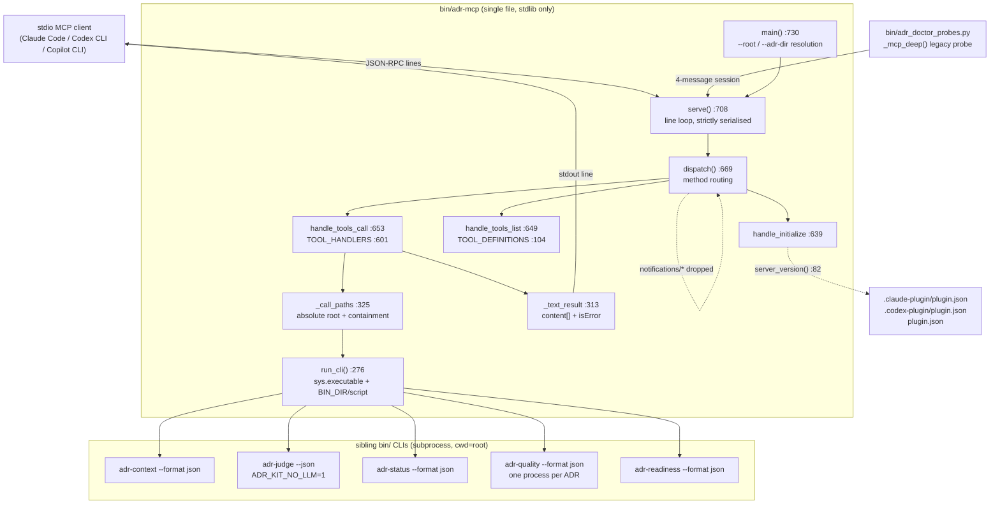

# MCP Server

## Overview

- **Name**: MCP Server (`adr-mcp`)
- **Description**: A single-file, hand-rolled Model Context Protocol server that speaks
  newline-delimited JSON-RPC 2.0 over stdio. It exposes exactly five read-only ADR tools
  (`adr_context`, `adr_judge`, `adr_status`, `adr_quality`, `adr_readiness`), each implemented
  as a subprocess call into a sibling `bin/` CLI. There is no `mcp` package dependency and no
  LLM path: the server is key-free by construction, and `adr-suggest` is deliberately not
  exposed because its value is LLM-only. Everything an agent can reach through this server is
  deterministic, read-only, and incapable of mutating ADR lifecycle state.
- **Location**:
  - [`bin/adr-mcp`](../bin/adr-mcp) — the implementation (763 lines, the only file in scope)
  - Byte-identical distribution mirrors: [`codex/bin/adr-mcp`](../codex/bin/adr-mcp),
    [`copilot/bin/adr-mcp`](../copilot/bin/adr-mcp)
  - Client wiring: [`.mcp.json`](../.mcp.json), [`codex/.mcp.json`](../codex/.mcp.json),
    [`copilot/.mcp.json`](../copilot/.mcp.json)
  - Tests: [`tests/test_adr_mcp.py`](../tests/test_adr_mcp.py) (588 lines, 24 test functions)
- **Language**: Python 3 (stdlib only — `argparse`, `json`, `os`, `re`, `subprocess`, `sys`,
  `pathlib`, `typing`). No shebang-external interpreter assumptions beyond `#!/usr/bin/env python3`.
- **Purpose**: Give a local coding agent (Claude Code, OpenAI Codex CLI, GitHub Copilot CLI, or
  any compatible stdio MCP client) first-class tool access to ADR retrieval, enforcement judging,
  repository health, quality scoring and lifecycle readiness — without an API key, without
  network access, and without the ability to write anything. It is the machine-readable face of
  the same CLIs a human runs from the shell, and it is one of the three fail-open context
  injection tiers named in ADR-004.

### Architectural shape in one sentence

`stdin line -> json.loads -> dispatch() -> TOOL_HANDLERS[name] -> subprocess(sys.executable, bin/<cli>) -> JSON text content item -> stdout line`.

---

## Code Elements

### `bin/adr-mcp`

The entire cluster is one executable script. It is organised into six banner-commented regions:
server metadata, tool definitions, CLI subprocess plumbing, tool handlers, JSON-RPC plumbing,
method handlers plus entry point.

#### Module-level constants

| Name | Value / type | Line | Notes |
| --- | --- | --- | --- |
| `BIN_DIR` | `Path` | `bin/adr-mcp:49` | `Path(__file__).resolve().parent`; every wrapped CLI is resolved relative to this, so a distribution mirror wraps its own siblings. |
| `REPO_ROOT` | `Path` | `bin/adr-mcp:50` | `BIN_DIR.parent`; used only for manifest version lookup, **not** as the tool working directory. |
| `DEFAULT_PROTOCOL_VERSION` | `str = "2025-06-18"` | `bin/adr-mcp:53` | Fallback when the client omits `protocolVersion`. |
| `CLI_TIMEOUT_S` | `int = 60` | `bin/adr-mcp:57` | Per-subprocess wall-clock timeout, also quoted verbatim inside the `adr_context` tool description. |
| `_ADR_ID_RE` | `re.Pattern` | `bin/adr-mcp:59` | `ADR-0*(\d{1,4})`, case-insensitive; bounded to 4 digits. |
| `WORKSPACE_PROPERTIES` | `Dict[str, Dict[str, Any]]` | `bin/adr-mcp:61` | The shared `project_root` / `adr_dir` JSON-Schema fragment spliced into all five tool schemas. |
| `TOOL_DEFINITIONS` | `List[Dict[str, Any]]` | `bin/adr-mcp:104` | The literal `tools/list` payload; five entries, list order is the wire order. |
| `TOOL_HANDLERS` | `dict[str, Callable]` | `bin/adr-mcp:601` | Name → handler dispatch table. |
| `PARSE_ERROR` | `-32700` | `bin/adr-mcp:614` | Standard JSON-RPC codes; no MCP-specific codes are defined. |
| `INVALID_REQUEST` | `-32600` | `bin/adr-mcp:615` | |
| `METHOD_NOT_FOUND` | `-32601` | `bin/adr-mcp:616` | |
| `INVALID_PARAMS` | `-32602` | `bin/adr-mcp:617` | Also used for an unknown tool name. |
| `INTERNAL_ERROR` | `-32603` | `bin/adr-mcp:618` | |

#### Public functions

Signatures copied verbatim from the source.

| Signature | Line | Description |
| --- | --- | --- |
| `server_version() -> str` | `bin/adr-mcp:82` | Reads `version` from the first readable native manifest of `REPO_ROOT/.claude-plugin/plugin.json`, `REPO_ROOT/.codex-plugin/plugin.json`, `REPO_ROOT/plugin.json`; returns `"0.0.0"` if none parse. Swallows `OSError`/`ValueError` per candidate. |
| `run_cli(script: str, args: List[str], root: Path, stdin_text: Optional[str] = None, env_extra: Optional[Dict[str, str]] = None) -> Tuple[int, str, str]` | `bin/adr-mcp:276` | Runs `[sys.executable, BIN_DIR/script] + args` with `cwd=root`, UTF-8 text mode, `errors="replace"`, and `timeout=CLI_TIMEOUT_S`. Returns `(returncode, stdout, stderr)`; lets `subprocess.TimeoutExpired` escape to the caller. |
| `tool_adr_context(arguments: Dict[str, Any], root: Path, adr_dir: Path) -> Dict[str, Any]` | `bin/adr-mcp:363` | Validates `query`, `limit` (1–100), six list options (each ≤32 items, ≤240 chars, enum-checked for `statuses`/`authorities`), two booleans and `min_score` (0–1), then shells out to `bin/adr-context --format json`. Non-zero exit becomes an `isError` tool result. |
| `tool_adr_judge(arguments: Dict[str, Any], root: Path, adr_dir: Path) -> Dict[str, Any]` | `bin/adr-mcp:456` | Pipes the `diff` string into `bin/adr-judge --diff - --snapshot diff --json` with `ADR_KIT_NO_LLM=1`. `--llm` is never passed. Wraps the outcome as `{"exit_code", "verdict", "result"}`; only exit code 2 is an error. |
| `tool_adr_status(arguments: Dict[str, Any], root: Path, adr_dir: Path) -> Dict[str, Any]` | `bin/adr-mcp:484` | Runs `bin/adr-status --format json --adr-dir <adr_dir>`; takes no tool-specific arguments beyond the workspace pair. |
| `tool_adr_quality(arguments: Dict[str, Any], root: Path, adr_dir: Path) -> Dict[str, Any]` | `bin/adr-mcp:512` | Resolves matching `ADR-*.md` files, then runs `bin/adr-quality --format json <file>` **once per file**. Returns the single report when `adr_id` was given, otherwise `{"adrs": [...]}`. Per-file exit code 2 becomes an inline `{"file", "error"}` entry rather than failing the whole call. |
| `tool_adr_readiness(arguments: Dict[str, Any], root: Path, adr_dir: Path) -> Dict[str, Any]` | `bin/adr-mcp:540` | Validates `adr_id`, `all_proposed`, the `base`/`head` pair (must be supplied together) and `today`, then runs `bin/adr-readiness --format json --repo-root <root> --adr-dir <adr_dir>`. |
| `handle_initialize(params: Dict[str, Any]) -> Dict[str, Any]` | `bin/adr-mcp:639` | Returns `{"protocolVersion", "capabilities": {"tools": {}}, "serverInfo": {"name": "adr-kit", "version": server_version()}}`. **Echoes the client's requested `protocolVersion` verbatim** (see Known limitations). |
| `handle_tools_list(params: Dict[str, Any]) -> Dict[str, Any]` | `bin/adr-mcp:649` | Returns `{"tools": TOOL_DEFINITIONS}`. Ignores `params`; no pagination cursor, no `ttlMs`/`cacheScope`. |
| `handle_tools_call(params: Dict[str, Any], root: Path, adr_dir: Path) -> Dict[str, Any]` | `bin/adr-mcp:653` | Looks up the handler (raising `KeyError` for an unknown name), rejects non-object `arguments`, and converts `subprocess.TimeoutExpired` and any other exception into an `isError` tool result so a tool failure never kills the loop. |
| `dispatch(message: Dict[str, Any], root: Path, adr_dir: Path) -> None` | `bin/adr-mcp:669` | Routes one parsed message. Recognises `initialize`, `ping`, `tools/list`, `tools/call`; silently drops anything starting with `notifications/`; replies `METHOD_NOT_FOUND` otherwise. Notifications (no `id` key) never get a reply. |
| `serve(root: Path, adr_dir: Path) -> int` | `bin/adr-mcp:708` | The read loop: `for line in sys.stdin`, skip blanks, `json.loads`, reply `PARSE_ERROR` on bad JSON or `INVALID_REQUEST` on a non-object, else `dispatch`. Always returns `0` at EOF. |
| `main() -> int` | `bin/adr-mcp:730` | Parses `--root` / `--adr-dir`, resolves the root (`--root` > `PROJECT_ROOT` env > `os.getcwd()`), exits `2` if the root is not a directory, prints a one-line banner to **stderr**, and runs `serve()`. `KeyboardInterrupt` → `0`. |

#### Private helpers (summarised, not enumerated individually)

Four `_`-prefixed helpers are summarised here rather than given their own rows:
`_parse_json_or_raw` (`bin/adr-mcp:306`) returns parsed JSON or the raw string on
failure; `_text_result` (`bin/adr-mcp:313`) wraps any payload as
`{"content": [{"type": "text", "text": ...}]}` plus optional `"isError": True`;
`_call_paths` (`bin/adr-mcp:325`) resolves the per-call workspace pair and
enforces containment; `_resolve_adr_files` (`bin/adr-mcp:495`) globs and filters
`ADR-*.md`. Three trivial wire writers — `_write_message` (`bin/adr-mcp:621`),
`_reply_result` (`bin/adr-mcp:626`), `_reply_error`
(`bin/adr-mcp:630`) — do `json.dumps` + `"\n"` + `flush()`.

Two of these carry security-relevant behaviour worth calling out explicitly, since they are the
only validation gate between an untrusted tool argument and a subprocess:

- `_call_paths` requires `project_root` to be a **non-empty absolute** path that exists as a
  directory, resolves `adr_dir` relative to it when given as a relative path, and then asserts
  `adr_dir.relative_to(root)` — so a caller cannot point the ADR directory outside the project
  root (`bin/adr-mcp:352-355`). Server state is never mutated; the resolved pair
  is returned and used for that one call only.
- `_text_result` is why tool-level failures are *successful* JSON-RPC results carrying
  `isError: true`, not JSON-RPC errors. See the two-layer error model below.

---

## Dependencies

### Internal

All internal coupling is **process-level, not import-level**. `bin/adr-mcp` imports zero sibling
`adr_*.py` modules — unusual for this repository, where most `bin/` entry points import the shared
`adr_format`, `adr_query`, `adr_config` helpers directly. Instead it invokes siblings through
`[sys.executable, BIN_DIR / script]` (`bin/adr-mcp:288`):

| Wrapped CLI | Invoked by | Flags used |
| --- | --- | --- |
| [`bin/adr-context`](../bin/adr-context) | `tool_adr_context` | `--format json --adr-dir <dir>` `[--limit N]` `[--path/--component/--symbol/--topic/--status/--authority V]*` `[--include-history]` `[--strict-index]` `[--min-score X]` `<query>` |
| [`bin/adr-judge`](../bin/adr-judge) | `tool_adr_judge` | `--diff - --adr-dir <dir> --repo-root <root> --snapshot diff --json` (stdin = diff, env `ADR_KIT_NO_LLM=1`) |
| [`bin/adr-status`](../bin/adr-status) | `tool_adr_status` | `--format json --adr-dir <dir>` |
| [`bin/adr-quality`](../bin/adr-quality) | `tool_adr_quality` | `--format json <adr-file>` (one process per ADR) |
| [`bin/adr-readiness`](../bin/adr-readiness) | `tool_adr_readiness` | `--format json --repo-root <root> --adr-dir <dir>` `[<adr_id>]` `[--all-proposed]` `[--base B --head H]` `[--today D]` |

Manifest files read at startup (for the reported version only): `.claude-plugin/plugin.json`,
`.codex-plugin/plugin.json`, `plugin.json`.

Consumers inside the repository:

- `bin/adr_doctor_probes.py:180-231` — `_mcp_deep()` spawns the
  server and drives a four-message legacy session (`initialize`, `notifications/initialized`,
  `tools/list`, `tools/call adr_status`), asserting the tool set is exactly the five names.
- `clients/installer/payload.py:32` — `bin/adr-mcp` is a
  `REQUIRED_INSTALL_FILES` entry, so a prepared install source without it is rejected.
- `packaging/executables.json:99-106` — declared runtime
  entrypoint, `expected_mode: 100755`, `invocation: direct-or-python`.
- [`tests/test_adr_mcp.py`](../tests/test_adr_mcp.py) — 24 subprocess-driven end-to-end tests.

### External

- **Third-party packages: none.** Verified by reading every import in the file
  (`bin/adr-mcp:40-47`) — `argparse`, `json`, `os`, `re`, `subprocess`, `sys`,
  `pathlib.Path`, `typing`. This upholds the repository's stdlib-only rule; there is no `mcp`
  SDK, no `pydantic`, no `anyio`.
- **External CLIs**: none directly. `git` may be reached indirectly when `adr_readiness` is
  given `base`/`head` refs, or by `adr-judge`'s own snapshot logic — but `bin/adr-mcp` itself
  shells out only to `sys.executable`.
- **No `claude` CLI**, no network, no credentials. The comment at
  `bin/adr-mcp:471-472` records the belt-and-braces approach: `--llm` is simply
  not passed *and* `ADR_KIT_NO_LLM=1` is injected into the child environment.
- **OS services**: stdin/stdout as the transport, stderr for the startup banner, `os.environ`
  (`PROJECT_ROOT`), `os.getcwd()`, process creation via `subprocess.run`.

---

## Interfaces

### CLI invocation

```
adr-mcp [--root DIR] [--adr-dir DIR]
```

| Flag | Default | Effect |
| --- | --- | --- |
| `--root DIR` | `PROJECT_ROOT` env, then `os.getcwd()` | Project root; becomes the `cwd` of every wrapped CLI. |
| `--adr-dir DIR` | `<root>/docs/adr` | Directory scanned for `ADR-*.md`. Resolved absolutely. **Must resolve inside `--root`** — `main()` does not check this, but every `tools/call` does; see notable finding 5. |

Exit codes: `0` on clean EOF or `KeyboardInterrupt`; `2` when the resolved project root is not a
directory (`bin/adr-mcp:749-751`). The server never exits non-zero because of a
tool or protocol failure — the loop is designed to survive everything.

Shipped client wiring (three near-identical configs, differing only in how the plugin root is
expressed):

| File | `command` | `args` | `cwd` |
| --- | --- | --- | --- |
| [`.mcp.json`](../.mcp.json) | `python` | `${CLAUDE_PLUGIN_ROOT}/bin/adr-mcp` | (unset) |
| [`codex/.mcp.json`](../codex/.mcp.json) | `python` | `./bin/adr-mcp` | `.` |
| [`copilot/.mcp.json`](../copilot/.mcp.json) | `python` | `${PLUGIN_ROOT}/bin/adr-mcp` | `.` |

### Wire protocol

Newline-delimited JSON-RPC 2.0 on stdin/stdout — **not** `Content-Length` framed
(`bin/adr-mcp:4-5`). One message per line, one response line per request,
strictly serialised.

| Method | Handled | Response |
| --- | --- | --- |
| `initialize` | yes | `{protocolVersion, capabilities: {tools: {}}, serverInfo: {name: "adr-kit", version}}` |
| `ping` | yes | `{}` |
| `tools/list` | yes | `{tools: [...5 definitions...]}` |
| `tools/call` | yes | MCP content result, or `isError: true` result |
| `notifications/*` | dropped | no reply (covers `notifications/initialized` and `notifications/cancelled`) |
| anything else (incl. `server/discover`) | no | `-32601 Method not found: <name>` |

### Tool contracts (`tools/call`)

All five accept the optional workspace pair `project_root` (absolute) and `adr_dir`. Required
fields are marked.

| Tool | Arguments | Wraps |
| --- | --- | --- |
| `adr_context` | **`query`** (string), `limit` (int 1–100), `paths`/`components`/`symbols`/`topics` (string[], ≤32, each ≤240 chars), `statuses` (enum[] of Accepted/Proposed/Superseded/Rejected/Deprecated/Amended/Unknown), `authorities` (enum[] of governing/advisory/historical), `include_history` (bool), `strict_index` (bool), `min_score` (number 0–1) | `adr-context` |
| `adr_judge` | **`diff`** (string, unified diff) | `adr-judge` declarative pass |
| `adr_status` | none | `adr-status` |
| `adr_quality` | `adr_id` (string, e.g. `ADR-001`, `001`, `1`) | `adr-quality` per file |
| `adr_readiness` | `adr_id` (string), `all_proposed` (bool), `base` + `head` (strings, together), `today` (`YYYY-MM-DD`) | `adr-readiness` |

### Two-layer error model

This is the single most important contract detail for a caller, and it is easy to get wrong.

1. **Protocol layer** — malformed frames and unroutable methods produce real JSON-RPC errors:
   `-32700` (unparseable line), `-32600` (non-object message, or missing `method`), `-32601`
   (unknown method), `-32602` (unknown tool name), `-32603` (anything escaping `dispatch`).
2. **Tool layer** — every tool failure is a *successful* JSON-RPC result whose body carries
   `isError: true` and a human-readable text item: bad argument types, a non-zero CLI exit, a
   missing ADR directory, and the 60-second timeout
   (`bin/adr-mcp:663-666`) all land here.
3. **`adr_judge` is deliberately asymmetric**: exit code `1` (violations found) is **not** an
   error. It returns a normal result `{"exit_code": 1, "verdict": "violation", "result": {...}}`.
   Only exit code `2` (config/input error) becomes `isError`
   (`bin/adr-mcp:476-481`). A caller that treats a non-empty finding list as a
   tool failure will misreport clean enforcement runs.
4. **`adr_quality` return shape is polymorphic**: a bare report object when `adr_id` was
   supplied, `{"adrs": [...]}` when it was omitted (`bin/adr-mcp:536`).

---

## Relationships



---

## Governing ADRs

Verified against [`docs/adr/ADR-INDEX.md`](../docs/adr/ADR-INDEX.md) and the frontmatter/Enforcement
blocks of each record. The three below apply at different strengths, and the difference matters:

| ADR | Basis | What it binds here |
| --- | --- | --- |
| **ADR-011** — deterministic readiness with human-gated grilling | **Enforced.** Its `## Enforcement` block carries `require_pattern` `"adr_readiness"` with `path_glob: "bin/adr-mcp"` ([ADR-011 Enforcement block](../docs/adr/ADR-011-adopt-deterministic-readiness-and-human-gated-grilling-across-the-adr-lifecycle.md)), message: *"MCP must expose deterministic readiness without lifecycle mutation."* | The `adr_readiness` tool must stay present and must stay read-only. `bin/adr-mcp:1` is also a References entry. |
| **ADR-014** — generated ADR graph as the selective-context query engine | **Component-level claim.** `binding: true`, `gate: "index-first-retrieval"`, and frontmatter `components:` includes `"adr-mcp"`. Its `verified_in:` list does *not* include `bin/adr-mcp`, and its Enforcement scope has no `path_glob` for this file. | `adr_context` must delegate to the index-first engine rather than re-implementing retrieval. |
| **ADR-004** — layered ADR context injection | **Descriptive reference only** (no Enforcement scope covering this file). Names the MCP `adr_context` tool as the key-free exposure of the task tier (`ADR-004:55-59`). | Positions this server as one of three fail-open injection tiers. |

ADR-015 (two-second deterministic latency budget) is scoped to
`tests/fixtures/cli/latency-corpus.json`; no `adr-mcp` entry exists in that corpus today, so it
does not currently bind this file. Noted below as an observation, not a violation.

---

## Known limitations (current state, verified)

### MCP revision 2026-07-28 non-compliance — real, planned, not yet started

The MCP specification revision dated 2026-07-28 makes the protocol stateless: `initialize` and
`notifications/initialized` are removed, each request carries its own protocol version and client
capabilities in `params._meta`, and servers answer a `server/discover` probe. This is documented
in [`docs/research/2026-07-29-mcp-2026-07-28-revision.md`](../docs/research/2026-07-29-mcp-2026-07-28-revision.md).

`bin/adr-mcp` implements the **handshake era only**. As of this document:

- `DEFAULT_PROTOCOL_VERSION = "2025-06-18"` (`bin/adr-mcp:53`).
- `server/discover` is unrouted and answers `-32601` (`bin/adr-mcp:700-702`).
  Per the spec's backward-compatibility rules a dual-era client must not key its fallback to a
  specific code, so it correctly classifies this server as legacy and falls back to
  `initialize`. **The server is non-compliant, not broken.**
- `handle_initialize` **echoes the client's requested `protocolVersion` verbatim**
  (`bin/adr-mcp:640-641`). It will therefore claim to speak `2026-07-28` — or any
  arbitrary string — without implementing it. There is no intersection against a declared
  supported set and no `-32022 UnsupportedProtocolVersion`. This behaviour is currently
  *asserted as intended* by `test_initialize_echoes_client_protocol_version`
  (`tests/test_adr_mcp.py:203-208`).
- `dispatch()` never checks that `initialize` arrived first (`bin/adr-mcp:669-705`).
  A modern-only client that skips the probe gets its `tools/call` silently processed under legacy
  semantics instead of a deterministic failure — exactly the "era-ambiguous method" hazard the
  stdio transport page warns about.
- No `resultType`, no `ttlMs`/`cacheScope` on `tools/list`, no
  `_meta["io.modelcontextprotocol/serverInfo"]` on results.

The remediation is tracked as **TASK-58** (`backlog/tasks/task-58 - Support-MCP-protocol-revision-2026-07-28-in-adr-mcp-stdio-dual-era.md`),
`status: To Do`, priority high, 12 acceptance criteria, planned to modify `bin/adr-mcp`,
`tests/test_adr_mcp.py` and `docs/adr/`. Its AC #12 requires an ADR recording the decision
(including the rejected alternative of adopting the official `mcp` Python SDK 2.0.0); that ADR
does **not exist yet**, so there is no accepted decision to cite. Nothing in this section is
implemented.

### Other current-state limitations

- **Strictly one in-flight request.** `for line in sys.stdin` (`bin/adr-mcp:710`)
  processes messages serially. Combined with `notifications/*` being dropped
  (`bin/adr-mcp:683-685`), `notifications/cancelled` is a no-op: there is no
  cancellation, and a wrapped CLI that runs for the full `CLI_TIMEOUT_S = 60` stalls the entire
  connection for a minute.
- **`adr_quality` fans out one subprocess per ADR file** (`bin/adr-mcp:528`).
  With `adr_id` omitted on a repository of *N* ADRs, that is *N* Python interpreter startups in
  one tool call, each with its own share of the 60-second budget.
- **`tools/list` order is the literal `TOOL_DEFINITIONS` list order** — deterministic in practice,
  but not sorted or explicitly contracted.
- **No pagination, no resources, no prompts, no logging, no sampling, no roots.** The surface is
  five tools and four methods.

---

## Notable findings

1. **Documentation drift between README and the live `inputSchema`.**
   `README.md:378-384` documents `adr_readiness` as taking
   `adr_id?`, `all_proposed?`, `changed_paths?`, `source_text?`, `today?` — but `changed_paths`
   and `source_text` do **not exist** in the schema; the real optional pair is `base` + `head`
   (`bin/adr-mcp:250-260`). The same table
   (`README.md:380`) lists `history?` for `adr_context` where the actual property
   is `include_history` (`bin/adr-mcp:170`). An agent following the README will
   send arguments the server ignores.
2. **Internal drift in the module docstring.** The tool summary at
   `bin/adr-mcp:13-21` omits `min_score`, which is a real schema property at
   `bin/adr-mcp:178-182`.
3. **Stale line anchors in two ADRs.** `ADR-014:396`
   cites `bin/adr-mcp:295-316` as "MCP delegation to `adr-context`", and
   `ADR-004:191` cites `bin/adr-mcp:293`.
   Both are wrong today: `tool_adr_context` starts at `bin/adr-mcp:363`, and line
   293 sits inside `run_cli`'s `subprocess.run` call. Line-pinned citations into an actively
   edited file are a maintenance liability.
4. **Three byte-identical committed copies of the server.** `bin/adr-mcp`,
   `codex/bin/adr-mcp` and `copilot/bin/adr-mcp` are `diff`-clean against each other and all
   three are tracked in git (verified with `git check-ignore`: none is ignored). I searched
   `scripts/build-client-adapters.py`, `scripts/sync-agent-plugins.py`,
   `scripts/install-agent-envs.py` and `scripts/client_generation*.py` and found **no generator
   that writes `codex/bin/` or `copilot/bin/`**, and no test asserting mirror parity — the only
   hit is an executable-bit check in
   `tests/test_agent_installer.py:307`. If the mirrors are
   hand-synced at release time, TASK-58 must land in all three or the Codex and Copilot
   distributions silently diverge. I could not prove either way from the repository, so this is
   flagged as an unresolved risk rather than a conclusion.
5. **`--adr-dir` outside `--root` starts cleanly and then fails every single tool call.**
   `main()` resolves `--adr-dir` with no containment check (`bin/adr-mcp:752`) and the startup
   banner cheerfully reports it, but `_call_paths` runs `adr_dir.relative_to(root)`
   *unconditionally* — including on the `else: adr_dir = default_adr_dir` branch
   (`bin/adr-mcp:351-355`), which is the path taken when the caller supplies no per-call
   workspace override. Verified empirically against this repository:

   ```
   $ python bin/adr-mcp --root "$(pwd)" --adr-dir "C:/…/Temp"
   adr-mcp 0.42.0 serving root=D:\…\adr-kit adr_dir=C:\…\Temp     # stderr, looks fine
   … "text": "adr_status: ADR directory must stay within project root: C:\\…\\Temp",
     "isError": true                                              # every tools/call
   ```

   The containment rule itself is correct and desirable for untrusted per-call arguments; the
   defect is that a *trusted operator flag* is silently validated against it at call time
   instead of at startup, so the failure surfaces as a per-tool error rather than a non-zero
   exit from `main()`.
6. **Zero import-level coupling to the shared `bin/adr_*.py` modules.** This file is the only
   `bin/` entry point in the cluster that reaches its siblings purely by subprocess
   (`sys.executable`, `bin/adr-mcp:288`). That buys crash isolation and exact
   CLI/MCP outcome parity — `test_adr_context_cli_mcp_outcome_parity`
   (`tests/test_adr_mcp.py:315`) tests precisely that — at the cost of
   one interpreter startup per tool call.
7. **The key-free property is enforced by absence plus an env belt.** `adr_judge` never passes
   `--llm` and additionally injects `ADR_KIT_NO_LLM=1` (`bin/adr-mcp:471-475`).
   `adr-suggest` is excluded from the tool set on purpose (`bin/adr-mcp:23-25`).
   Neither is expressed as a machine-checked rule, so a future edit could add an LLM path
   without tripping any enforcement.
8. **`adr_judge` exit code 1 is a success.** Documented above under the error model; repeated
   here because it is the most likely integration mistake for any new client.
9. **The MCP server carries no ADR-015 latency budget.** `tests/fixtures/cli/latency-corpus.json`
   contains no `adr-mcp` entry (verified by loading the JSON). Given the `adr_quality` fan-out
   and the 60-second per-call timeout, whether an agent-facing MCP call counts as a
   "deterministic user-facing path" under ADR-015 is an open question worth resolving at the
   component level.
10. **`ping` is implemented but removed in the 2026-07-28 revision.** Harmless today (legacy era),
   but it is one of the small surfaces TASK-58 has to make era-conditional.
