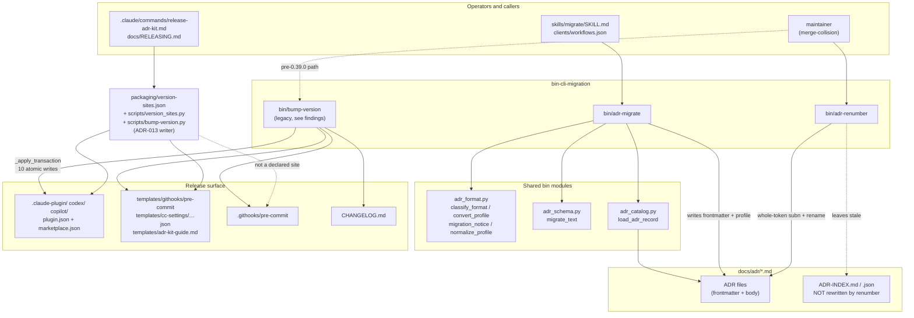

# Migration and Release CLIs

## Overview

- **Name**: Migration and Release CLIs (`bin-cli-migration`)
- **Description**: Three independent, single-file Python CLIs that mutate ADR *identity* and *packaging metadata* rather than ADR content. `adr-migrate` adds canonical frontmatter and converts between body profiles; `adr-renumber` moves one ADR to a free number and rewrites every cross-reference; `bump-version` stamps a release version across the plugin manifests, marketplaces, changelog and hook wrappers. All three default to non-destructive behaviour: `adr-migrate --plan/--dry-run/--check`, `adr-renumber` dry-run-by-default, and `bump-version` computes every edit before the first write and rolls back on failure.
- **Location**:
  - [`bin/adr-migrate`](../bin/adr-migrate) (517 lines)
  - [`bin/adr-renumber`](../bin/adr-renumber) (254 lines)
  - [`bin/bump-version`](../bin/bump-version) (295 lines)
- **Language**: Python 3.10+ (`from __future__ import annotations`, PEP 604 unions, `dict[Path, bytes]` builtin generics). Stdlib only — no third-party imports found in any of the three files.
- **Purpose**: These are the *migration and release* mutators of adr-kit. Everything else in `bin/` reads ADRs (lint, judge, index, context, query) or reports on them. This cluster is where files get renamed, headings rewritten, frontmatter injected and version strings stamped — the operations that must never half-apply, which is why each script carries an explicit safety model.

### Governing ADRs (verified)

| ADR | Status | How it applies |
|---|---|---|
| [ADR-005](../docs/adr/ADR-005-selectable-agent-friendly-adr-formats.md) (*Use Selectable ADR Body Profiles with MADR as the Default*) | Accepted | Decision Outcome item 6: *"Migration between supported profiles is explicit, dry-run by default, content-preserving, deterministic, and idempotent."* This is exactly the contract `adr-migrate --to-profile` implements. Item 4 names `--profile` as the per-migration override. Supersedes ADR-003. |
| [ADR-013](../docs/adr/ADR-013-declare-version-sites-in-one-registry-and-bump-by-writing.md) | Accepted, 2026-07-22 | *"Chosen: the declarative registry with a writer."* Names `packaging/version-sites.json` + `scripts/version_sites.py` + `scripts/bump-version.py` as the writer. **`bin/bump-version` is the pre-ADR-013 hardcoded-path implementation it replaced** — see Notable Findings. |

ADR-012 (release runbook) does not mention `bump-version` by name and is therefore not cited as governing this file directly; ADR-013 amends its version-consistency invariant.

---

## Code Elements

### `bin/adr-migrate`

**Path**: [`bin/adr-migrate`](../bin/adr-migrate)

**Purpose**: Plan or apply safe ADR metadata and profile migrations. Four mutually-constrained modes, all sharing one file-discovery + render pipeline:

1. `--plan` — read-only format detection over *all* `*.md` (catches legacy filenames), emits `migration_notice` advice. Never writes, always exits 0.
2. default / `--dry-run` / `--check` — canonical frontmatter injection via `migrate_text`, optionally followed by profile conversion.
3. `--suggest-retrieval --dry-run` — derives selective-context metadata (topics, components, symbols) and a Decision Contract *candidate* from existing ADR evidence. Explicitly human-approval-gated.

The module is a thin orchestrator: all parsing, classification and profile conversion lives in the shared `adr_format` / `adr_schema` / `adr_catalog` modules. Nothing here writes except `migrate_file` (`bin/adr-migrate:151`).

| Function | Signature | Description | Location |
|---|---|---|---|
| `discover_files` | `discover_files(target: Path) -> List[Path]` | Canonical-only discovery: a single file passes through; a directory yields `ADR-*.md` filtered by `ADR_FILE_RE`, name-sorted case-insensitively. | `bin/adr-migrate:55` |
| `discover_plan_files` | `discover_plan_files(target: Path) -> List[Path]` | Wider read-only discovery for `--plan`: reads every `*.md` and keeps whatever `is_migration_candidate(path, text)` accepts, so legacy filenames (`0010-use-queues.md`) are seen. Falls back to filename matching on `OSError`. | `bin/adr-migrate:66` |
| `plan_file` | `plan_file(path: Path) -> Dict` | Builds `{file, detected_format, notice}` for one document. On read failure it synthesises a `guided-migration` notice rather than raising. | `bin/adr-migrate:85` |
| `migrate_file` | `migrate_file(path: Path, write: bool, to_profile: str \| None = None, from_profile: str \| None = None) -> Dict` | The only writing path. Runs `migrate_text`, then `convert_profile` when `to_profile` is set, then writes iff `not issues and changed and write`. Returns `{file, changed, ok, issues, source_profile, target_profile}`. | `bin/adr-migrate:123` |
| `render_text` | `render_text(target: Path, results: List[Dict], check: bool, dry_run: bool) -> str` | Human renderer for the migrate modes; the `needs migration`/`migrated` prefix is chosen from the mode. | `bin/adr-migrate:170` |
| `render_plan_text` | `render_plan_text(target: Path, scanned: List[Dict]) -> str` | Human renderer for `--plan`; groups notices into deterministic vs guided, tallies detected formats, always closes with `"No files changed. Migration is never automatic."`. | `bin/adr-migrate:191` |
| `suggest_retrieval_file` | `suggest_retrieval_file(path: Path) -> Dict` | Derives review-only retrieval candidates from one ADR record: title tokens minus `SUGGESTION_STOP_WORDS`, first path components of `scope` globs and `verified_in` pointers, symbols after `:` in pointers. Existing values always win over derived ones. Every result carries `requires_human_approval: True` and `writes_automatically: False`. | `bin/adr-migrate:233` |
| `render_retrieval_suggestions` | `render_retrieval_suggestions(target: Path, results: List[Dict]) -> str` | Human renderer for the retrieval-suggestion mode. | `bin/adr-migrate:322` |
| `main` | `main(argv: List[str] \| None = None) -> int` | Argparse wiring, mutual-exclusion validation, mode dispatch, exit-code mapping. | `bin/adr-migrate:344` |

Module constants: `ADR_FILE_RE = re.compile(r"(?i)^ADR-\d{1,4}-.*\.md$")` (`bin/adr-migrate:42`) and `SUGGESTION_STOP_WORDS` (`bin/adr-migrate:43`, 8 words: adopt/and/for/from/into/the/use/with). `_BIN_DIR` is prepended to `sys.path` at `bin/adr-migrate:26-28` so the sibling `adr_*.py` modules import when the script is invoked by absolute path.

There are no private helpers in this file — every function is module-level and listed above.

A path-disambiguation detail worth knowing: at `bin/adr-migrate:254` a symbol is only extracted from a `verified_in` pointer when the part before `:` is *not* a single letter — that is the Windows drive-letter guard (`D:\...` must not be read as `file:symbol`).

### `bin/adr-renumber`

**Path**: [`bin/adr-renumber`](../bin/adr-renumber)

**Purpose**: Resolve the merge-collision case where two parallel branches both claim `ADR-043`. Renames the file, rewrites the heading, and updates every whole-token reference to the old id across all ADRs in the directory. Dry-run by default. Self-declared safety properties (`bin/adr-renumber:14-19`): whole-token matching only, refuses when the target is taken or the source is missing, and *all regexes are linear — no nested or lazy quantifiers*, citing the 0.19.1/0.19.2 ReDoS history in `CHANGELOG.md`.

| Element | Signature | Description | Location |
|---|---|---|---|
| `RenumberError` | `class RenumberError(Exception)` | Input-error sentinel; caught once in `main` and mapped to exit code 2. | `bin/adr-renumber:47` |
| `parse_adr_id` | `parse_adr_id(raw: str) -> int` | Parses `ADR-NNN` (1–4 digits, case-insensitive) to an int, else raises `RenumberError`. | `bin/adr-renumber:51` |
| `discover_adrs` | `discover_adrs(adr_dir: Path) -> List[Path]` | Non-recursive `*.md` glob filtered by `ADR_FILENAME_RE`, name-sorted. Raises if the directory is missing. | `bin/adr-renumber:59` |
| `numbers_in_use` | `numbers_in_use(files: List[Path]) -> Dict[int, List[Path]]` | Maps ADR number → files carrying it. A list, not a single path, precisely so duplicates are representable. | `bin/adr-renumber:69` |
| `next_free_number` | `next_free_number(in_use: Dict[int, List[Path]]) -> int` | `max(used) + 1`, or 1 when empty. Gaps are deliberately **not** reused — a gap usually means a retired or reserved number and reusing it would resurrect stale references. | `bin/adr-renumber:79` |
| `token_pattern` | `token_pattern(num: int) -> "re.Pattern[str]"` | Builds `\bADR-(?:<spellings>)(?!\d)` from the deduped set `{str(num), f"{num:03d}", f"{num:04d}"}` sorted **longest-first** so `0043` is tried before `043` before `43`. Pure alternation of literals: linear time. | `bin/adr-renumber:86` |
| `renamed_filename` | `renamed_filename(name: str, new_num: int) -> str` | Swaps the leading `ADR-NNN-` for the zero-padded new number, preserving the slug. | `bin/adr-renumber:98` |
| `find_source` | `find_source(source_arg: str, adr_dir: Path, files: List[Path]) -> Tuple[Path, int]` | Accepts either an id or a `.md` path (bare filenames are resolved inside `adr_dir`). Refuses an ambiguous id by naming every colliding file. | `bin/adr-renumber:106` |
| `build_plan` | `build_plan(files: List[Path], source: Path, old_num: int, new_num: int) -> List[Tuple[Path, int, str, str]]` | Line-granular dry-run plan: `(file, 1-based lineno, old line, new line)` for every hit. Reads with `errors="replace"`. | `bin/adr-renumber:137` |
| `apply_plan` | `apply_plan(files: List[Path], source: Path, old_num: int, new_num: int) -> Path` | Whole-file `subn` over each file, writing only files that changed, then renames the source. Returns the new path. Reads with strict UTF-8 (no `errors="replace"`). | `bin/adr-renumber:153` |
| `main` | `main(argv: Optional[List[str]] = None) -> int` | Validation → plan print → optional apply. Warns when the source number is duplicated, because rewritten references may belong to either file. | `bin/adr-renumber:170` |

I verified the docstring claim at `bin/adr-renumber:90-91` ("renumbering ADR-043 never touches ADR-0430") against the generated pattern by hand: for `num=43` the pattern is `\bADR-(?:0043|043|43)(?!\d)`; against `ADR-0430` the `043` branch matches but the `(?!\d)` lookahead fails on the trailing `0`, and no other branch matches at that offset. The claim holds.

No private helpers — every function is module-level and listed. `--version` reports a script-local `adr-renumber 0.1.0` (`bin/adr-renumber:195`), independent of the plugin version.

### `bin/bump-version`

**Path**: [`bin/bump-version`](../bin/bump-version)

**Purpose**: Release helper. Stamps a semver version into ten targets in one transaction, rewrites the `## [Unreleased]` changelog heading into a dated release heading, refreshes the `[Unreleased]`/`[<version>]` compare links, and prints the follow-up git commands. It deliberately does **not** commit or tag.

Its architecture is *preflight-then-transaction*: every required file is existence-checked (`bin/bump-version:195-197`), every manifest shape is validated, every stamp regex is confirmed to match, and only then are all ten byte payloads computed and handed to `_apply_transaction`. That ordering is the fix recorded for TASK-32 after the source audit found it "writes manifests before validating later" targets (`docs/reviews/2026-07-18-source-audit/FINDINGS.md:419`).

Two historical notes are baked into the file. The module docstring (`bin/bump-version:35-41`) explains why this is Python and not bash: the Windows `python3` Store alias routes through the Python Install Manager, which scans argv for a script file and dispatches on *its* shebang, so passing the bash-shebanged pre-commit template as an argument made the launcher exec bash instead of python. And ADR-013's Context records that a hand-edit of `ADR_KIT_WRAPPER_VERSION="0.37.0"` once failed silently because an unquoted regex matched nothing — hence `WRAPPER_STAMP_RE` anchors the full quoted assignment.

All functions except `main` are private (leading underscore) but each is architecturally load-bearing, so they are enumerated rather than summarised:

| Function | Signature | Description | Location |
|---|---|---|---|
| `_fail` | `_fail(msg: str) -> "NoReturn"` | Writes `ERROR: <msg>` to stderr and `sys.exit(1)`. | `bin/bump-version:72` |
| `_read_json` | `_read_json(path: Path) -> dict` | UTF-8 JSON load; `OSError`/`JSONDecodeError` become a `_fail`. | `bin/bump-version:77` |
| `_json_bytes` | `_json_bytes(data: dict) -> bytes` | Canonical serialisation: `indent=2` plus a trailing newline, UTF-8. | `bin/bump-version:84` |
| `_atomic_write_bytes` | `_atomic_write_bytes(path: Path, content: bytes) -> None` | Same-directory `NamedTemporaryFile` → `flush` → `os.fsync` → `os.replace`. Cleans up the temp file in `finally` if the replace never happened. | `bin/bump-version:88` |
| `_apply_transaction` | `_apply_transaction(changes: dict[Path, bytes]) -> None` | Snapshots the original bytes of every target, writes all of them atomically, and on **any** `BaseException` rewrites the originals. Reports rollback failures separately from the triggering error. | `bin/bump-version:109` |
| `_require_version_manifest` | `_require_version_manifest(path: Path) -> dict` | Asserts the file is an object with a string `version` field. | `bin/bump-version:129` |
| `_matching_marketplace_entries` | `_matching_marketplace_entries(path: Path, plugin_name: str) -> tuple[dict, list]` | Returns the whole document plus every `plugins[]` entry whose `name` matches, failing when none match or any lacks a string `version`. Returning *all* matches means a marketplace listing adr-kit twice is fully updated. | `bin/bump-version:136` |
| `_update_changelog_links` | `_update_changelog_links(changelog: str, current: str, new: str) -> str` | Replaces the `[Unreleased]:` link definition with a new `[Unreleased]` compare link plus a `[<new>]: v<current>...v<new>` line; appends both when no link definition exists. | `bin/bump-version:153` |
| `main` | `main(argv: list) -> int` | Argument count check, semver validation, preflight, edit computation, transaction, then the printed git recipe. Takes raw `sys.argv` (argv[0] is the program name). | `bin/bump-version:172` |

**The ten write targets** (module constants, `bin/bump-version:55-64`): `.claude-plugin/plugin.json`, `codex/.codex-plugin/plugin.json`, `copilot/plugin.json`, `.github/plugin/marketplace.json`, `.claude-plugin/marketplace.json`, `CHANGELOG.md`, `templates/githooks/pre-commit`, `templates/cc-settings/guardian-hook-entry.json`, `templates/adr-kit-guide.md`, `.githooks/pre-commit`.

**The four stamp regexes** (`bin/bump-version:66-69`): `SEMVER_RE` (strict three-part, no pre-release or build metadata), `WRAPPER_STAMP_RE` (`^ADR_KIT_WRAPPER_VERSION="[^"]*"$`, MULTILINE), `GUIDE_STAMP_RE` (`^<!-- adr-kit-guide v[0-9.]+ -->`, matched with `.match` so it must be line 1), `UNRELEASED_LINK_RE`.

A cross-platform detail: every text payload is normalised with `.replace("\r\n", "\n")` before encoding (`bin/bump-version:268-272`), so a bump on Windows cannot introduce CRLF into the shipped shell wrappers.

---

## Dependencies

### Internal (repo modules)

Only `bin/adr-migrate` imports repo code; `adr-renumber` and `bump-version` are fully self-contained.

| Import | From | Used for |
|---|---|---|
| `AdrFormatError`, `classify_format`, `convert_profile`, `is_migration_candidate`, `migration_notice`, `normalize_profile` | [`bin/adr_format.py`](../bin/adr_format.py) | Format detection and profile conversion. Signatures used: `classify_format(text: str) -> str` (`bin/adr_format.py:413`), `migration_notice(text, path, *, metadata_changed=False, metadata_issues=None, migrate_command="bin/adr-migrate") -> Optional[Dict]` (`bin/adr_format.py:453`), `is_migration_candidate(path: Path, text: str) -> bool` (`bin/adr_format.py:577`), `convert_profile(text, target, *, source=None) -> Tuple[str, str]` (`bin/adr_format.py:696`), `normalize_profile(value, *, default=None) -> str` (`bin/adr_format.py:214`). |
| `migrate_text` | [`bin/adr_schema.py`](../bin/adr_schema.py) | `migrate_text(text: str, path: Optional[Path] = None) -> Tuple[str, bool, List[str]]` (`bin/adr_schema.py:390`) — adds canonical metadata and normalises an identifiable legacy H1. |
| `load_adr_record` | [`bin/adr_catalog.py`](../bin/adr_catalog.py) | `load_adr_record(path: Path) -> Dict` (`bin/adr_catalog.py:327`) — the shared semantic record shape consumed by `--suggest-retrieval`. |

Import is enabled by the `sys.path` prepend at `bin/adr-migrate:26-28`, not by a package install.

Shelled-out-to: **none**. No `subprocess`, no `os.system` in any of the three files. `bump-version` only *prints* the git commands for the operator to run.

### External

- **Python stdlib only**: `argparse`, `json`, `re`, `sys`, `os`, `tempfile`, `pathlib`, `datetime.date`, `typing`. No third-party import was found — the dependency-free design holds for this cluster.
- **External CLIs**: none invoked. `git` is referenced only as printed operator instructions (`bin/bump-version:281-290`).
- **OS services**: `os.fsync` and `os.replace` for durable atomic replacement; `Path.rename` for the ADR file move; `tempfile.NamedTemporaryFile(dir=path.parent)` to keep the temp file on the same filesystem so `os.replace` is atomic.

---

## Interfaces

### `bin/adr-migrate`

```
adr-migrate [path] [--check] [--plan] [--dry-run] [--format {text,json}]
            [--to-profile {madr,nygard,canonical}]
            [--from-profile {madr,nygard,canonical}]
            [--suggest-retrieval]
```

- `path` defaults to `docs/adr`.
- Mutual exclusion, enforced at `bin/adr-migrate:398-415`: `--plan` may not be combined with `--check`, `--dry-run`, `--to-profile`, `--from-profile` or `--suggest-retrieval`; `--suggest-retrieval` *requires* `--dry-run` and may not be combined with `--check`, `--to-profile` or `--from-profile`.
- Writing happens only when neither `--check` nor `--dry-run` is passed (`write = not args.check and not args.dry_run`, `bin/adr-migrate:473`).

**Exit codes**: `0` success (including every `--plan` run); `1` only in `--check` mode when at least one file needs migration; `2` when any file failed, when `--suggest-retrieval` had a failure, or when `normalize_profile` rejected `--to-profile`. Argparse mutual-exclusion errors also exit 2.

**JSON contracts** (`--format json`), three shapes distinguished by `mode`:
- `mode: "plan"` — `{target, mode, read_only: true, summary: {total, notices, deterministic, guided, formats}, files: [notice…]}`
- `mode: "retrieval-suggestions"` — `{target, mode, read_only: true, requires_human_approval: true, writes_automatically: false, summary: {total, suggestions, failed}, files: [...]}`; each file entry carries `existing`, `suggested` (topics/aliases/components/symbols/context_scope/decision_contract) and `source_evidence`.
- `mode: "check" | "dry-run" | "write"` — `{target, mode, summary: {total, changed, failed}, files: [{file, changed, ok, issues, source_profile, target_profile}]}`

**Callers**: [`skills/migrate/SKILL.md`](../skills/migrate/SKILL.md) lines 22–49, [`docs/format-migration.md`](../docs/format-migration.md) lines 26–74, [`docs/selective-context.md`](../docs/selective-context.md) line 62, and two agent instructions in [`clients/workflows.json`](../clients/workflows.json) ("Run `adr-migrate --plan` first, then show `--dry-run` output"). Declared as a shipped runtime entrypoint in [`packaging/executables.json`](../packaging/executables.json) at line 108 with `"invocation": "direct-or-python"`, `"expected_mode": "100755"`.

### `bin/adr-renumber`

```
adr-renumber <source> [--to ADR-NNN] [--adr-dir DIR] [--apply] [--version]
```

- `source` is an ADR id (`ADR-043`) or a file path; `--to` defaults to `next_free_number` (max in use + 1); `--adr-dir` defaults to `docs/adr`.
- Dry-run is the default; `--apply` executes.

**Exit codes**: `0` success (plan printed, or `--apply` completed); `2` input error — source missing, target taken, target equals source, ambiguous source, malformed id, or missing ADR directory. No JSON output mode; the plan is human-readable `file:line` text, which is why it is greppable and clickable.

Declared in [`packaging/executables.json`](../packaging/executables.json) at line 148.

### `bin/bump-version`

```
bin/bump-version <new-version>      # e.g. 0.16.0
python bin/bump-version 0.16.0      # on Windows
```

**Exit codes**: `0` on success; `1` on wrong argument count and on every `_fail` (bad semver, missing file, malformed manifest, missing stamp, missing `## [Unreleased]`, write/rollback failure). There is no `2`, no `--check`, and no `--dry-run` — a notable asymmetry with `scripts/bump-version.py`, which does have `--check` and `--date`.

**Not a shipped interface**: `bump-version` appears in neither `packaging/executables.json` nor `packaging/public-artifacts.json`, and is explicitly excluded from client-adapter copies by `COPY_EXCLUSIONS = {"bin/bump-version"}` at [`scripts/client_generation_model.py:32`](../scripts/client_generation_model.py). It is a repo-internal maintainer tool.

**Tests**: [`tests/test_adr_migrate.py`](../tests/test_adr_migrate.py), [`tests/test_migration_discovery.py`](../tests/test_migration_discovery.py), [`tests/test_adr_renumber.py`](../tests/test_adr_renumber.py), [`tests/test_bump_version.py`](../tests/test_bump_version.py) (which copies the script into a scratch tree — `tests/test_bump_version.py:61` — and invokes it via `sys.executable`).

---

## Relationships



The three scripts share no code with each other. `adr-migrate` is the only one that depends on the shared semantic layer; `adr-renumber` and `bump-version` are deliberately standalone so they keep working when the parsing layer is mid-migration. The dotted edges are the two gaps documented in Notable Findings below.

---

## Notable Findings

These are the architecturally surprising facts a component-level reader needs. Each is stated with the evidence I verified it against.

### 1. `bin/bump-version` is superseded by `scripts/bump-version.py` but still present, still tested, and still wired into one wrapper comment

[ADR-013](../docs/adr/ADR-013-declare-version-sites-in-one-registry-and-bump-by-writing.md) (Accepted 2026-07-22, shipped in 0.39.0) moved release bumping to a declarative registry plus writer: `packaging/version-sites.json` + `scripts/version_sites.py` + `scripts/bump-version.py`. `bin/bump-version` is the hardcoded-path predecessor. Evidence that the new path is now canonical:

- [`docs/RELEASING.md:54,78`](../docs/RELEASING.md) and [`CONTRIBUTING.md:141`](../CONTRIBUTING.md) name `scripts/bump-version.py` only.
- [`.claude/commands/release-adr-kit.md:25`](../.claude/commands/release-adr-kit.md) runs `python scripts/bump-version.py $ARGUMENTS` and calls it "the only place a version is typed".
- The shipped wrappers `templates/githooks/pre-commit:50`, `codex/templates/githooks/pre-commit:50` and `copilot/templates/githooks/pre-commit:50` say *"Maintained by scripts/bump-version.py"*, but the repo's own [`.githooks/pre-commit:50`](../.githooks/pre-commit) still says *"Maintained by bin/bump-version"*.
- The 0.42.0 release record, `backlog/tasks/task-56 - Release-v0.42.0-to-the-three-marketplaces.md:45`, states: *"scripts/bump-version.py wrote 0.42.0 to all 10 version sites"*.

`bin/bump-version` nevertheless has a live 269-line test suite (`tests/test_bump_version.py`) and no deprecation notice in its docstring. Two writers for one invariant is exactly the duplication ADR-013 set out to eliminate.

### 2. Neither version writer is a superset of the other — and `.githooks/pre-commit` has silently drifted five minor versions

`bin/bump-version` stamps `.githooks/pre-commit` (`OWN_WRAPPER`, `bin/bump-version:64`). `packaging/version-sites.json` declares ten sites and `.githooks/pre-commit` is **not** among them — only `templates/githooks/pre-commit` is. Conversely the registry declares two `README.md` sites (the `adr-judge@vX` / `rev: vX` pins) that `bin/bump-version` never touches.

Verified consequence, measured on the current tree:

```
.githooks/pre-commit:51        ADR_KIT_WRAPPER_VERSION="0.37.0"
templates/githooks/pre-commit:51  ADR_KIT_WRAPPER_VERSION="0.42.0"
.claude-plugin/plugin.json:4      "version": "0.42.0"
```

The repo's own pre-commit wrapper is stamped 0.37.0 while the plugin is 0.42.0. Per the `bin/bump-version` docstring (`bin/bump-version:20-22`), adr-guardian compares these stamps against the plugin version to detect stale copied wrappers (task-15), so the kit's own hook is in the state its guardian is built to flag. This looks like a real dangling edge from the ADR-013 migration, not a deliberate exclusion — the registry's `must_not_carry_version` list names only the Codex local marketplace, and its `notes` say nothing about `.githooks/`.

### 3. `adr-renumber` does not update `ADR-INDEX.md` / `ADR-INDEX.json`

`ADR_FILENAME_RE = ^ADR-(\d{1,4})-` (`bin/adr-renumber:43`) requires digits after `ADR-`, so `ADR-INDEX.md` never matches and is never in `discover_adrs`' result. `ADR-INDEX.json` is not `.md` at all. A renumber therefore leaves both generated indexes pointing at the old id, and `bin/adr-index docs/adr` must be re-run afterwards. Nothing in the tool's output says so — the closing line is `"Applied: N line(s) rewritten; renamed to <path>"`. The same holds for ADR ids cited outside the ADR directory (CHANGELOG, README, `backlog/tasks/`): the docstring is honest that scope is "all ADRs in the directory", but the practical trap is real.

### 4. `adr-renumber --apply` is not transactional, while `bump-version` is

`apply_plan` (`bin/adr-renumber:153-167`) writes each changed file in turn and then renames the source. An `OSError` on file *k* leaves files 1..k-1 rewritten, the rest untouched, and the rename undone — a half-renumbered ADR set with no rollback. `bin/bump-version` solved exactly this class of problem with `_apply_transaction` (`bin/bump-version:109`), including original-bytes snapshotting and rollback-failure reporting, as recorded in TASK-32.5 ("Make release and shared-state updates transaction safe", which lists `bin/bump-version` in scope). The renumber path was apparently not covered by that work.

### 5. `adr-renumber` reads with two different error policies

`build_plan` reads with `errors="replace"` (`bin/adr-renumber:145`); `apply_plan` reads with strict UTF-8 (`bin/adr-renumber:161`). A file with invalid UTF-8 therefore produces a clean dry-run plan and then raises `UnicodeDecodeError` mid-apply — the exact scenario finding 4 makes unrecoverable. Low likelihood on an ADR corpus, but the asymmetry is unintentional-looking.

### 6. `build_plan`'s `source` parameter is unused

`build_plan(files, source, old_num, new_num)` (`bin/adr-renumber:137`) never references `source` in its body; the signature mirrors `apply_plan`, which does need it for the rename. Harmless, but it invites the reader to assume the source file is treated specially. It is not — the source is just another entry in `files`, which is why the whole-file `subn` also rewrites the source's own frontmatter `id:` and H1.

### 7. `_fail`'s return annotation references an unimported name

`def _fail(msg: str) -> "NoReturn":` at `bin/bump-version:72` — `NoReturn` is never imported from `typing`. Because `from __future__ import annotations` is active *and* the annotation is quoted, it is never evaluated, so there is no runtime error. A type checker resolving annotations would report an undefined name.

### 8. `adr-migrate`'s `--plan` error message omits one of the flags it rejects

The guard at `bin/adr-migrate:398-401` rejects `--plan` combined with `--suggest-retrieval`, but the `parser.error` text at `bin/adr-migrate:402-405` lists only `--check`, `--dry-run`, `--to-profile` and `--from-profile`. A user hitting that combination gets a message that does not name the flag that caused it. Cosmetic, but it is a genuine message/condition mismatch.

### 9. Two independent version namespaces inside one cluster

`adr-renumber --version` reports a hand-maintained `adr-renumber 0.1.0` (`bin/adr-renumber:195`), unrelated to the plugin version, and `packaging/version-sites.json` does not declare it as a site. It has therefore stayed at 0.1.0 since v0.23.0. It is the only script in this cluster with a `--version` flag at all.

### 10. Windows-specific defensive coding appears in two unrelated places

The `bin/bump-version` docstring (lines 35–41) records the `python3` Store-alias / Python Install Manager shebang-dispatch trap that forced the bash-to-Python rewrite, and every text payload is CRLF-normalised before writing (`bin/bump-version:268-272`). Independently, `bin/adr-migrate:254` guards against reading a Windows drive letter as a `file:symbol` pointer separator. This cluster carries more Windows-hardening than its size suggests, which is worth preserving in any refactor.
