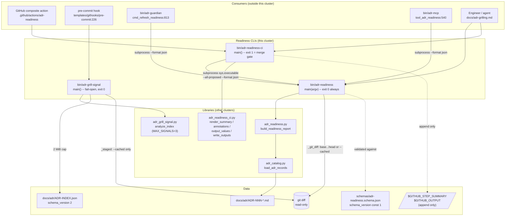

# Readiness CLIs

## Overview

- **Name**: Readiness CLIs (`bin-cli-readiness`)
- **Description**: Three thin, stdlib-only Python entry points that expose deterministic ADR
  *readiness* to humans and to automation. `adr-readiness` renders the readiness report computed
  by `adr_readiness.py`; `adr-readiness-ci` re-invokes `adr-readiness` as a subprocess and turns
  its JSON into GitHub Step Summary text, workflow annotations, and step outputs; `adr-grill-signal`
  emits at most three bounded, fail-open grill advisories from the generated `ADR-INDEX.json`.
  All argument parsing, git invocation, and formatting lives here; all classification logic lives
  in the sibling libraries.
- **Location**:
  - [`bin/adr-readiness`](../bin/adr-readiness) (174 lines)
  - [`bin/adr-readiness-ci`](../bin/adr-readiness-ci) (80 lines)
  - [`bin/adr-grill-signal`](../bin/adr-grill-signal) (100 lines)
- **Language**: Python 3 (`#!/usr/bin/env python3`, `from __future__ import annotations`), stdlib only.
- **Purpose**: Provide the *read* half of the ADR grilling lifecycle. They answer "what is the
  readiness state of these ADRs, and does this diff implement a Proposed one?" and they never answer
  it by changing anything. `bin/adr-readiness --format json` is the de-facto internal RPC of the
  whole readiness subsystem: three independent consumers spawn it as a subprocess rather than
  re-implementing readiness.

### Read-only posture (precise version)

**No file in this cluster mutates an ADR, a lifecycle status, the ADR index, or any repository
state.** There is no write path to `docs/adr/`, no `git add`/`commit`, and no invocation of
`adr accept` or any other lifecycle command. Git is only ever called with `diff`.

The one nuance worth carrying forward: `adr-readiness-ci` *does* write, but exclusively to
caller-supplied CI sinks, in append mode, and only when the caller passes the flag:

| Write | Site | Mode | Destination in practice |
| --- | --- | --- | --- |
| Step Summary markdown | [`bin/adr-readiness-ci:60`](../bin/adr-readiness-ci) | `open("a")` | `$GITHUB_STEP_SUMMARY` |
| `key=value` step outputs | `adr_readiness_ci.write_outputs`, `bin/adr_readiness_ci.py:87-91` | `open("a")` | `$GITHUB_OUTPUT` |

Both are ephemeral runner files named by the composite action at
[`.github/actions/adr-readiness/action.yml:71-72`](../.github/actions/adr-readiness/action.yml).
Without `--summary-file` the summary goes to stdout; without `--output-file` no outputs are written.
`adr-readiness` and `adr-grill-signal` write nothing but stdout/stderr.

## Code Elements

Every function in all three files is enumerated below — **nothing was summarized in aggregate.**
The cluster is 354 lines total, so full enumeration is feasible. Private helpers are marked and
listed individually because in scripts this small they *are* the architecture.

### `bin/adr-readiness`

Human/JSON/GitHub readiness reporter. Module docstring: *"Inspect ADR readiness without mutating
repository or lifecycle state."*

| Signature | Kind | Description | Defined at |
| --- | --- | --- | --- |
| `_ensure_utf8_streams() -> None` | private | Reconfigures `sys.stdout`/`sys.stderr` to UTF-8 when the stream supports `reconfigure`; swallows `AttributeError`/`io.UnsupportedOperation`. The only Windows-console guard in the cluster. | [`bin/adr-readiness:18`](../bin/adr-readiness) |
| `_git_diff(root: Path, base: str \| None, head: str \| None) -> Tuple[List[str], str]` | private | Runs `git diff --name-only -M` and `git diff --unified=0 -M` (10 s timeout each) and returns `(normalized_sorted_paths, raw_diff_text)`. Uses `f"{base}...{head}"` when both refs are given, otherwise `--cached`. Raises `ReadinessError` if either ref is supplied alone or if git fails. | [`bin/adr-readiness:27`](../bin/adr-readiness) |
| `_human(report: dict) -> str` | private | Renders the plain-text report: header line, one line per ADR (`id [status] classification: title`), each mechanical + human finding, an explicit `LINKED_PROPOSED_IMPLEMENTATION` line when `blocking_proposed`, the `Next:` command, then advisories. | [`bin/adr-readiness:62`](../bin/adr-readiness) |
| `_safe_markdown(value: object) -> str` | private | Flattens `\r`/`\n`, turns backticks into apostrophes, HTML-escapes `<`/`>`. Local twin of `adr_readiness_ci.markdown_escape`. | [`bin/adr-readiness:84`](../bin/adr-readiness) |
| `_github(report: dict) -> str` | private | Renders `--format github` markdown: `[BLOCK]`/`[INFO]` per ADR, `[ADVISORY]` per advisory, `- No ADR readiness findings.` when `adrs` is empty. | [`bin/adr-readiness:95`](../bin/adr-readiness) |
| `build_parser() -> argparse.ArgumentParser` | public | Builds the full CLI grammar (see [Interfaces](#interfaces)). | [`bin/adr-readiness:115`](../bin/adr-readiness) |
| `main(argv: List[str] \| None = None) -> int` | public | Validates flags, resolves `--repo-root` and `--adr-dir`, resolves `--today` (default `date.today()`), collects the diff when in diff mode, calls `build_readiness_report`, overwrites `report["adr_dir"]` with the repo-relative path, then prints in the selected format. Returns `0`, or `2` on `ReadinessError`/`ValueError`/`OSError`/`subprocess.TimeoutExpired`. | [`bin/adr-readiness:129`](../bin/adr-readiness) |

Entry: `sys.exit(main())` at [`bin/adr-readiness:174`](../bin/adr-readiness).

### `bin/adr-readiness-ci`

CI adapter and the cluster's only merge gate. Module docstring: *"Run PR readiness and publish
GitHub summary, annotations, and outputs."*

| Signature | Kind | Description | Defined at |
| --- | --- | --- | --- |
| `main() -> int` | public | The entire program. Parses flags, builds `[sys.executable, <sibling>/adr-readiness, --all-proposed, --base …, --head …, --repo-root …, --adr-dir …, --format json]`, runs it with a 30 s timeout, `json.loads` the stdout, then calls `render_summary`, `write_outputs`, and `annotations` from `adr_readiness_ci`. Returns `1` when `summary.blocking_count` is truthy, `2` on any infrastructure failure (non-zero child exit, `OSError`, `ValueError`, `JSONDecodeError`, `TimeoutExpired`), else `0`. Infrastructure failures are reported as `::error title=ADR readiness infrastructure::…`. | [`bin/adr-readiness-ci:15`](../bin/adr-readiness-ci) |

No private helpers. The sibling script is located by path, not by `PATH` lookup:
`Path(__file__).resolve().with_name("adr-readiness")` at
[`bin/adr-readiness-ci:28`](../bin/adr-readiness-ci). Entry: `raise SystemExit(main())` at
[`bin/adr-readiness-ci:79-80`](../bin/adr-readiness-ci).

### `bin/adr-grill-signal`

Hook-grade advisory emitter. Module docstring: *"Emit bounded, non-blocking ADR grill advisories
from the generated index."*

| Signature | Kind | Description | Defined at |
| --- | --- | --- | --- |
| `_staged(root: Path) -> tuple[list[str], str]` | private | Runs `git diff --cached --name-only -M` and `git diff --cached --unified=0 -M` with a 5 s timeout each; returns `(normalized_sorted_paths, diff_text)`. Raises `ValueError` if either git call fails. No `--base`/`--head` range mode exists here. | [`bin/adr-grill-signal:15`](../bin/adr-grill-signal) |
| `_human(report: dict) -> str` | private | Renders one `[adr-grill] STRONG <id> (<evidence,…>) -> <command>` line per linked Proposed ADR and one `[adr-grill] ADVISORY <path> may contain a durable decision -> <command>` line per suspected decision. The `[adr-grill]` prefix is the contract the pre-commit hook greps for. | [`bin/adr-grill-signal:45`](../bin/adr-grill-signal) |
| `main() -> int` | public | Resolves `--repo-root` and `--index`, refuses an index larger than 2 MiB, parses it, gathers paths from `--staged` or from `--paths`/`--source-text`, calls `analyze_index`, prints JSON or human text. Returns `0` (always, even with findings) or `2` on `OSError`/`UnicodeError`/`ValueError`/`JSONDecodeError`/`TimeoutExpired`. Prints nothing at all when the human report is empty. | [`bin/adr-grill-signal:60`](../bin/adr-grill-signal) |

Entry: `raise SystemExit(main())` at [`bin/adr-grill-signal:99-100`](../bin/adr-grill-signal).

### Importability

None of the three files carries a `.py` extension, so `main` and `build_parser` are public *in form*
but unreachable by a normal `import`. In-process use requires
`importlib.util.spec_from_file_location`, which is exactly what the test suite does
(`import importlib.util` at [`tests/test_adr_readiness.py:3`](../tests/test_adr_readiness.py)).
Only `adr-readiness` accepts an injectable `argv`; the other two read `sys.argv` directly. Every
production consumer therefore reaches them as a **subprocess**, not as a library.

## Dependencies

### Internal (repo modules)

| Import | From | Used for |
| --- | --- | --- |
| `ReadinessError`, `build_readiness_report`, `normalize_path` | [`bin/adr_readiness.py`](../bin/adr_readiness.py) | `bin/adr-readiness:15` — all classification, implementation-link evidence, and advisory logic |
| `annotations`, `output_values`, `render_summary`, `write_outputs` | [`bin/adr_readiness_ci.py`](../bin/adr_readiness_ci.py) | `bin/adr-readiness-ci:12` — all GitHub rendering and escaping |
| `analyze_index`, `normalize_path` | [`bin/adr_grill_signal.py`](../bin/adr_grill_signal.py) | `bin/adr-grill-signal:12` — index-only signal analysis |

Transitively, `adr_readiness.py:11` pulls `build_relationships`, `load_adr_records`, and
`normalize_adr_id` from [`bin/adr_catalog.py`](../bin/adr_catalog.py). That is the cluster's only
route to ADR Markdown; `adr-grill-signal` never touches Markdown at all.

Imports resolve because CPython prepends the script's own directory to `sys.path`. Consequently
**these scripts only work when they sit next to their libraries in `bin/`** — there is no
`sys.path` manipulation, no package, and no installed distribution.

### External

- **Python stdlib only** — `argparse`, `io`, `json`, `subprocess`, `sys`, `datetime.date`,
  `pathlib.Path`, `typing`. **No third-party import was found in any of the three files.** The
  dependency-free invariant holds for this cluster.
- **External CLI: `git`** — only `git diff` (never a mutating verb), at
  `bin/adr-readiness:35,44` and `bin/adr-grill-signal:17,26`.
- **External CLI: the current Python interpreter** — `adr-readiness-ci` re-enters via
  `sys.executable` (`bin/adr-readiness-ci:27`). This is the only self-spawn in the cluster.
- **No `claude`, `gh`, or any network call.** Deliberate: ADR-011 requires CI readiness to need
  "no secret or model".
- **OS services**: process spawn, filesystem reads, and (in CI) the runner-provided
  `$GITHUB_STEP_SUMMARY` / `$GITHUB_OUTPUT` files.

## Interfaces

### `bin/adr-readiness`

```
python bin/adr-readiness [ADR] [--all-proposed] [--diff] [--base REF --head REF]
                         [--format {human,json,github}] [--repo-root PATH]
                         [--adr-dir PATH] [--today YYYY-MM-DD]
```

| Flag | Default | Notes |
| --- | --- | --- |
| `ADR` (positional, optional) | — | e.g. `ADR-011`; bare digits are accepted and zero-padded by `build_readiness_report`. Mutually exclusive with `--all-proposed` (`bin/adr-readiness:133`). |
| `--all-proposed` | off | Selects every `Proposed` record. With neither `ADR` nor this flag, **all** records are selected. |
| `--diff` | off | Analyze the staged diff (`git diff --cached`). |
| `--base` / `--head` | none | Must be supplied together (`bin/adr-readiness:30`); implies diff mode. Uses triple-dot `base...head`, i.e. merge-base symmetric difference — matching GitHub's PR diff semantics. |
| `--format` | `human` | `json` prints `json.dumps(..., indent=2, ensure_ascii=False, sort_keys=True)` — stable, diffable output. |
| `--today` | `date.today()` | Injectable clock, so tests and CI are reproducible. |

**JSON contract**: pinned by [`schemas/adr-readiness.schema.json`](../schemas/adr-readiness.schema.json)
with `schema_version` as `const 1`. Required top level: `schema_version`, `evaluated_on`, `adr_dir`,
`summary`, `advisories`, `adrs`. Required per-ADR: `adr_id`, `title`, `path`, `status`,
`classification`, `mechanical_findings`, `human_findings`, `quality`, `implementation_link`,
`next_command`. `classification` is one of the seven ADR-011 classes: `not-an-adr`,
`needs-human-input`, `needs-mechanical-fix`, `ready-for-confirmation`, `accepted`, `rejected`,
`supersession-required`.

**Exit codes**: `0` on success **regardless of findings** — a blocking Proposed ADR still exits `0`.
`2` on error. **Never `1`.** There is no gate in this script.

### `bin/adr-readiness-ci`

```
python bin/adr-readiness-ci --base REF --head REF [--repo-root PATH] [--adr-dir PATH]
                           [--today YYYY-MM-DD] [--summary-file PATH] [--output-file PATH]
```

`--base` and `--head` are `required=True`. Always runs the child with `--all-proposed`.

**Exit codes — this is the merge gate**:

| Code | Meaning | Site |
| --- | --- | --- |
| `0` | Clean, or advisories only | `bin/adr-readiness-ci:68` |
| `1` | `summary.blocking_count` is truthy — an explicitly linked, implemented Proposed ADR | `bin/adr-readiness-ci:68` |
| `2` | Infrastructure failure (child non-zero, bad JSON, timeout, OS error) | `bin/adr-readiness-ci:56`, `:76` |

**Step outputs** written as `key=value` lines, sorted, with CR/LF stripped
(`adr_readiness_ci.output_values` / `write_outputs`): `blocking-count`, `blocking-adrs`
(compact JSON array), `advisory-count`, `schema-version`, `conclusion`
(`blocked` | `advisory-or-clean`). These are declared as the composite action's outputs at
[`.github/actions/adr-readiness/action.yml:24-39`](../.github/actions/adr-readiness/action.yml).

**Workflow annotations** printed to stdout: `::error title=ADR readiness block::…` per blocking ADR
and `::notice title=ADR review advisory::…` per advisory, values passed through
`adr_readiness_ci.github_escape` (`%`→`%25`, CR→`%0D`, LF→`%0A`).

### `bin/adr-grill-signal`

```
python bin/adr-grill-signal [--repo-root PATH] [--index PATH] [--staged]
                           [--paths P ...] [--source-text TEXT]
                           [--shell {posix,powershell}] [--format {human,json}]
```

`--index` defaults to `docs/adr/ADR-INDEX.json`. `--shell` selects the quoting style for the
emitted `/adr-kit:grill --source …` command. `--staged` reads git; otherwise `--paths` and
`--source-text` are used verbatim, which makes the script trivially testable without a repo.

**JSON contract**: `{schema_version: 1, linked_proposed: [...], suspected_decisions: [...],
signal_count: int}`. `MAX_SIGNALS = 3` ([`bin/adr_grill_signal.py:12`](../bin/adr_grill_signal.py))
is applied **per list** — `linked[:3]` and `suspected[:3]` at `:120-121` — so a report can carry up
to **six** items while `signal_count` is `min(3, len(linked) + len(suspected))` at `:122`. See
notable finding 5.

**Exit codes**: `0` always, `2` on error. Fail-open by construction, and the pre-commit hook
additionally swallows the status with `|| true` and greps only for the two known prefixes:

```sh
"$_PYTHON3" "$ADR_GRILL_SIGNAL" --staged --repo-root "$ROOT" --shell posix --format human 2>/dev/null || true
printf '%s\n' "$GRILL_OUT" | grep -aE "^\[adr-grill\] (STRONG|ADVISORY) " >&2 || true
```

([`templates/githooks/pre-commit:226-232`](../templates/githooks/pre-commit))

### Consumers of `bin/adr-readiness --format json`

| Consumer | Call site | Timeout | Purpose |
| --- | --- | --- | --- |
| `bin/adr-readiness-ci` | [`bin/adr-readiness-ci:26-28`](../bin/adr-readiness-ci) | 30 s | PR gate |
| `bin/adr-guardian` (`cmd_refresh_readiness`) | [`bin/adr-guardian:813`](../bin/adr-guardian) | 10 s | Caches the Proposed work queue outside SessionStart; failures degrade to a stderr note and `return 0` |
| `bin/adr-mcp` (`tool_adr_readiness` → `run_cli`) | [`bin/adr-mcp:540`, `:592`](../bin/adr-mcp) | `CLI_TIMEOUT_S` | Exposes the `adr_readiness` MCP tool — readiness only, no lifecycle mutation |
| `clients/workflows.json` (the grill workflow prose) | [`clients/workflows.json:60`](../clients/workflows.json) | — | Instructs the agent to run it and inspect facts before asking a question |

## Relationships



## Governing ADRs

- **[ADR-011](../docs/adr/ADR-011-adopt-deterministic-readiness-and-human-gated-grilling-across-the-adr-lifecycle.md)
  (Accepted, 2026-07-20) — the governing decision, verified applicable.** It defines the readiness
  boundary these CLIs implement: a "shared stdlib-only, read-only engine", the seven classification
  values, "the same repository, arguments, and injected date produce stably ordered structured
  output", "hooks never start an interview or full readiness sweep… they may emit a short, fail-open
  advisory with an exact grill command", "CI performs deterministic diff readiness… and requires no
  secret or model", and "CI blocks only when explicit, inspectable evidence shows that the pull
  request implements a linked Proposed ADR". Its stated warm p95 targets: 500 ms single-record CLI,
  1 s for all-Proposed over 50 records, 250 ms for 500 changed paths against 50 records, ≤100 ms MCP
  adapter overhead, ≤5 s PR action overhead excluding checkout and runtime install.

  **Important scoping caveat:** ADR-011's `Enforcement` block globs only `clients/workflows.json`
  and `bin/adr-mcp`. It therefore governs this cluster **semantically but not mechanically** — no
  declarative rule in the repository guards these three files. A change here that broke the
  read-only or fail-open posture would pass `bin/adr-judge` untouched.

- **[ADR-007](../docs/adr/ADR-007-json-adr-graph-index-for-agent-retrieval.md) — relevant, not
  governing.** `adr-grill-signal` is a consumer of the ADR-007 generated index. ADR-007's
  `Enforcement` globs only `docs/adr/ADR-INDEX.json`, i.e. it constrains the produced artefact, not
  its readers.

- **[ADR-015](../docs/adr/ADR-015-enforce-a-two-second-deterministic-latency-budget-as-a-test-fixture-contract.md)
  — goal applies, no budget entry exists.** Its fixture states the repo-wide goal "No deterministic
  user-facing CLI path may exceed 2 seconds wall clock", but
  [`tests/fixtures/cli/latency-corpus.json:16-19`](../tests/fixtures/cli/latency-corpus.json)
  enumerates budgets for `adr-lint` and `adr-retire` only. No readiness command has a measured
  budget. Verified by reading the corpus.

ADR-014's `Enforcement` rules are empty and its subject is the context query engine, not readiness;
no other ADR in [`docs/adr/ADR-INDEX.md`](../docs/adr/ADR-INDEX.md) scopes these paths.

## Notable findings

1. **Two divergent GitHub-markdown renderers, and the CLI's has no production consumer.**
   `_github()` ([`bin/adr-readiness:95-112`](../bin/adr-readiness), escaping via local
   `_safe_markdown` at `:84`) emits *every* ADR and omits Evidence lines.
   `render_summary()` ([`bin/adr_readiness_ci.py:33-73`](../bin/adr_readiness_ci.py), escaping via
   `markdown_escape` at `:19`) skips items that are neither linked nor `Proposed` and *does* include
   an Evidence line. `--format github` is referenced only from
   `tests/test_adr_readiness.py:444` and `:552` — nothing in CI, hooks, the action, or the workflows
   uses it. Duplicated intent with already-live drift.
2. **`_human()` is not defensive while the CI module is.** `_human()` indexes required keys directly
   (`report['summary']['total']` at `bin/adr-readiness:64`, `item['implementation_link'][...]` at
   `:73`), whereas `adr_readiness_ci` uses `.get()` throughout. `KeyError` is absent from the caught
   tuple at `bin/adr-readiness:161` (`ReadinessError, ValueError, OSError, subprocess.TimeoutExpired`),
   so a readiness-schema change surfaces as a traceback instead of the clean `exit 2` path.
3. **Encoding hardening is inconsistent across the cluster.** `_ensure_utf8_streams()` exists only in
   `adr-readiness` ([`:18-24`](../bin/adr-readiness)). In `adr-grill-signal` the `print()` calls at
   `:91` and `:95` sit *outside* the `try/except` that catches `UnicodeError` (`:81-89`), so on a
   cp1252 Windows console a non-ASCII path in the report would raise at print time rather than
   degrade to `exit 2`. `adr-readiness-ci` also lacks the guard. Relevant given this repository's
   Windows encoding history (open TASK-57 concerns a Windows CRLF false positive elsewhere).
4. **`normalize_path` exists twice with different behavior, and the injection defense is on the
   wrong side.** [`adr_readiness.py:52`](../bin/adr_readiness.py) only folds separators;
   [`adr_grill_signal.py:24`](../bin/adr_grill_signal.py) additionally strips `[\x00-\x1f\x7f]+`
   and maps `::`→`__`. The `::` defense (which prevents forging GitHub workflow commands) lives in
   the module that prints to *hook stderr*, while the module that actually emits `::error`/`::notice`
   relies on a separate `github_escape` ([`adr_readiness_ci.py:10-16`](../bin/adr_readiness_ci.py)).
   Two mechanisms, split across the wrong boundary — an observation about coherence, not a
   demonstrated exposure.
5. **`signal_count` can understate the signals actually emitted.** `MAX_SIGNALS = 3` is applied
   per list (`linked[:3]`, `suspected[:3]` at
   [`bin/adr_grill_signal.py:120-121`](../bin/adr_grill_signal.py)) but `signal_count` is
   `min(MAX_SIGNALS, len(linked) + len(suspected))` at `:122`. Verified by evaluating the
   arithmetic: 2 linked + 2 suspected emits **4** items and reports `signal_count = 3`; 3 + 3 emits
   **6** and still reports `3`. Any consumer that trusts `signal_count` to size the two arrays will
   truncate. The human renderer is unaffected because it iterates the lists directly.
6. **`adr-grill-signal` is index-only and version-agnostic.** It reads `ADR-INDEX.json` and never
   opens ADR Markdown, so a stale index yields stale hook advisories. It also never checks
   `schema_version`, so a v1 index would be consumed silently even though ADR-007 pins the artefact
   to v2. Verified that the current index shape matches its expectations: `adrs[].id`, `.status`,
   `.path` (a bare filename, which is why `adr_grill_signal.py:76` compares `Path(path).name`),
   `.scope.path_globs`, `.metadata.verified_in`.
7. **Timeout ladder is far looser than the stated budgets.** 5 s per git call in `adr-grill-signal`
   (`:22`, `:32`), 10 s in `adr-readiness` (`:41`, `:50`), 30 s for the child process in
   `adr-readiness-ci` (`:51`). These are ceilings, not expectations, but every one exceeds ADR-011's
   p95 targets and the 10 s/30 s ceilings exceed ADR-015's 2 s goal. Nothing enforces the budgets on
   these paths.
8. **Library resolution is implicit and fragile.** All three rely on CPython putting the script's
   directory on `sys.path`; there is no package, no `sys.path` insert, and no console-entry-point
   installation. `adr-readiness-ci` and `adr-guardian` compensate by locating the sibling with
   `Path(__file__).resolve().with_name("adr-readiness")`, so the pair must stay co-located in `bin/`.
9. **`codex/bin/` and `copilot/bin/` copies are byte-identical to `bin/`** (verified with `diff -q`
   for all three files). They are generated mirrors, inventoried in
   [`packaging/executables.json`](../packaging/executables.json) (entries at `:52`, `:124`, `:132`)
   and drift-checked by [`.github/workflows/validate.yml:90-92`](../.github/workflows/validate.yml).
   Edit `bin/` and regenerate; never edit a mirror. No ADR verified as governing this mirroring.
10. **A bare `python bin/adr-readiness` with no selector reports every ADR, not just Proposed ones.**
   The selection predicate is in the library, not the CLI:
   [`bin/adr_readiness.py:316-324`](../bin/adr_readiness.py), where the third disjunct
   `(not normalized_id and not all_proposed)` matches every record. Harmless but easy to misread as
   a Proposed-only queue.
11. **`adr-readiness` deliberately declines to be a gate.** It exits `0` even when
    `summary.blocking_count > 0`. Only `adr-readiness-ci` translates a blocking finding into a
    non-zero status. Any future consumer that expects `adr-readiness` to fail on findings will
    silently pass.
