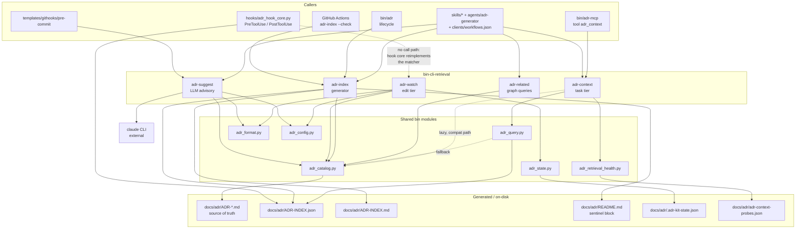

# Retrieval and Injection CLIs

## Overview

- **Name**: Retrieval and Injection CLIs (`bin-cli-retrieval`)
- **Description**: Five extension-less Python scripts that make recorded architecture decisions
  *findable* rather than *enforced*. `adr-context` ranks ADRs against a task query through the
  generated graph, `adr-related` answers dependency-graph questions for a single ADR, `adr-index`
  generates every derived index view (compact Markdown map, legacy JSON list, node-and-edge graph,
  README block), `adr-watch` nudges or injects the governing decision around a single file edit, and
  `adr-suggest` is the one LLM-backed member: an advisory "is this a NEW decision?" detector for a
  staged diff. Everything here is fail-open by construction — the fail-closed floor lives in
  `bin/adr-judge`, which is a different cluster.
- **Location**:
  [`bin/adr-context`](../bin/adr-context) ·
  [`bin/adr-related`](../bin/adr-related) ·
  [`bin/adr-index`](../bin/adr-index) ·
  [`bin/adr-watch`](../bin/adr-watch) ·
  [`bin/adr-suggest`](../bin/adr-suggest)
- **Language**: Python 3 (stdlib only, `from __future__ import annotations`, `#!/usr/bin/env python3`).
  All five files are **extension-less**, so they are invoked as `python bin/<name>` and imported by
  tests through `importlib.machinery.SourceFileLoader`.
- **Purpose**: Implement the retrieval half of the ADR-004 layered context model. ADR-004 defines
  three fail-open injection tiers and one fail-closed enforcement floor; this cluster owns all three
  fail-open tiers (session index, edit-time injection, task-time query) plus the advisory
  new-decision detector. `adr-index` produces the artefacts the other tiers read, so it is the
  cluster's generator and everything else is a consumer.

### Governing ADRs (verified in `docs/adr/`)

| ADR | Status | How it binds this cluster |
|---|---|---|
| ADR-001 — LLM gates opt-in | Accepted | Names `bin/adr-suggest` directly: "Fix `bin/adr-suggest` to honor `suggest.enabled` (default `false`)" (`docs/adr/ADR-001-llm-gates-opt-in.md:59`). Implemented at `bin/adr-suggest:657`. |
| ADR-004 — Layered ADR context injection | Accepted | Defines the session tier (`bin/adr-index`), the edit tier (`bin/adr-watch --pre-edit` / `--hook`) and the task tier (`bin/adr-context`); mandates exit 0 on every path including errors (`ADR-004:96`, `:102`, `:110`, `:216`). |
| ADR-007 — JSON ADR graph index for agent retrieval | Accepted | Scope `docs/adr/ADR-INDEX.json`. Items 5-7 assign generation to `adr-index`, enriched ranked results to `adr-context`, and shared relationship-extraction rules to `adr-related`. |
| ADR-014 — Use the generated ADR graph as the selective-context query engine | Accepted | Makes the generated graph the normal runtime projection with Markdown as visible fallback, and separates relevance from authority (Accepted governs, Proposed advisory, rest historical). This is why `adr-context` delegates to `adr_query`. |
| ADR-015 — Two-second deterministic latency budget as a test fixture contract | Accepted | Scope `tests/fixtures/cli/latency-corpus.json`. Applies to "every deterministic user-facing CLI path". See the coverage gap in Notable Findings. |

## Code Elements

### `bin/adr-context` — task-tier relevance ranking

Path: [`bin/adr-context`](../bin/adr-context) (551 lines).

This file has **two disjoint surfaces**, and the split is the single most important thing to know
about it:

- **Script surface** — `_index_first_cli()` at `bin/adr-context:39`, reached from the *first*
  `if __name__ == "__main__":` block at `bin/adr-context:166-167`, which `raise SystemExit(...)`.
  Because that raise happens at module level, **lines 170-551 are never executed when the file runs
  as a script**: the legacy scoring surface is not merely unused, it is not even defined. Verified
  empirically — `python bin/adr-context --help` prints the terse parser from `_index_first_cli`
  (no per-flag help strings), not the documented parser in `main()`.
- **Import surface** — everything from `bin/adr-context:174` onward, defined only when the file is
  imported under a name other than `__main__` (which is exactly what `tests/test_adr_context.py`
  does via `SourceFileLoader`). This includes the second `main()` at `bin/adr-context:437` and its
  fully documented `argparse` parser, which is **unreachable as a CLI entry point**.

| Element | Signature | Description | Location |
|---|---|---|---|
| `_index_first_cli` | `_index_first_cli() -> int` | The real CLI. Parses args, discovers `.adr-kit.json` by walking up ≤5 levels from the ADR dir, optionally runs the probe health check, then delegates to `adr_query.query_adr_context`. Returns 0 on success, 2 on `IndexQueryError`/`ValueError`, and 1 when `--check-probes` reports `fail`/`degraded`. | `bin/adr-context:39` |
| `extract_keywords` | `extract_keywords(query: str) -> List[str]` | Lowercase, split on non-alphanumerics, keep tokens ≥3 chars, sorted and de-duplicated. Import-only. | `bin/adr-context:230` |
| `infer_task_domain` | `infer_task_domain(text: str) -> Optional[str]` | Legacy domain classifier over five keyword sets (frontend/infra/security/data/backend). Returns the highest-hit domain, ties broken alphabetically, `None` on no evidence. Import-only. | `bin/adr-context:245` |
| `extract_adr_metadata` | `extract_adr_metadata(adr_file: Path) -> Dict` | Compatibility shim: loads one ADR through `adr_catalog.load_adr_record` and reshapes it into the pre-graph metadata dict (adds `domain_tags`, parses `date` into `datetime.date`). Import-only. | `bin/adr-context:282` |
| `score_adr` | `score_adr(query: str, keywords: List[str], domain: Optional[str], metadata: Dict, weights: Optional[Dict[str, float]] = None) -> Dict` | Compatibility wrapper over `adr_query.score_record`. `keywords`, `domain` and `weights` are accepted and **ignored**; the docstring states status, age, domain and relationship count no longer contribute relevance. Import-only. | `bin/adr-context:343` |
| `load_adr_context` | `load_adr_context(query: str, adr_dir: Path, limit: int = 5, min_score: float = 0.1, config: Optional[Dict] = None, strict_index: bool = False, include_history: bool = False, statuses: tuple[str, ...] = (), authorities: tuple[str, ...] = (), paths: tuple[str, ...] = (), symbols: tuple[str, ...] = (), components: tuple[str, ...] = (), topics: tuple[str, ...] = ()) -> List[Dict]` | In-process query entry point used by the performance tests; prints `outcome["warnings"]` to stderr and returns `outcome["results"]`. Import-only. | `bin/adr-context:369` |
| `load_config` | `load_config(config_path: Optional[Path], adr_dir: Path) -> Dict` | Unvalidated `.adr-kit.json` loader with the same ≤5-level upward walk as the script path. Import-only. | `bin/adr-context:409` |
| `main` | `main() -> None` | The documented-but-dead CLI (full `argparse` help text, `sys.exit` instead of return codes). Never reached as a script. | `bin/adr-context:437` |

Private helpers summarised rather than enumerated: `_domain_patterns` (lazy regex compilation,
`:212`) and `_domain_has_signal` (`:266`) exist only to serve the legacy domain functions above.
Module data: `_DOMAIN_KEYWORDS` (`:174`) and the lazily-populated `_DOMAIN_RE` (`:209`).

### `bin/adr-related` — single-ADR dependency graph

Path: [`bin/adr-related`](../bin/adr-related) (373 lines). Read-only; exit 0 on success, 2 on
usage/config errors.

| Element | Signature | Description | Location |
|---|---|---|---|
| `AdrRefs` | `class AdrRefs` with `__slots__ = ("path", "adr_id", "title", "status", "related_ids", "supersedes_ids", "superseded_by_ids", "amended_by_ids", "mention_ids")` | Reference profile of one ADR file. Deliberately a plain class, not a `@dataclass`, "for `SourceFileLoader` compatibility, matching `bin/adr-status`". | `bin/adr-related:63` |
| `AdrRefs.__init__` | `__init__(self, path: Path, adr_id: str, title: str, status: str, related_ids: List[str], supersedes_ids: List[str], superseded_by_ids: List[str], amended_by_ids: List[str], mention_ids: List[str]) -> None` | Positional/keyword constructor; no validation. | `bin/adr-related:76` |
| `normalize_adr_id` | `normalize_adr_id(raw: str) -> Optional[str]` | `'ADR-7'`, `'adr-007'`, `'7'` → `'ADR-007'`; `None` when unparseable. | `bin/adr-related:99` |
| `parse_adr_refs` | `parse_adr_refs(path: Path) -> Optional[AdrRefs]` | Reads one ADR (raw text *and* `adr_catalog.load_adr_record`), classifies its outbound refs, and computes `mention_ids` as whole-token `ADR-NNN` hits that are neither self nor already classified. `None` on unreadable file or non-ADR filename. | `bin/adr-related:118` |
| `load_adr_set` | `load_adr_set(adr_dir: Path) -> List[AdrRefs]` | Profiles every `ADR-*.md` in the directory, sorted by filename. | `bin/adr-related:162` |
| `build_graph` | `build_graph(target_id: str, records: List[AdrRefs]) -> Dict` | Builds `{adr, outbound, inbound, dangling}`. Outbound excludes plain mentions ("they carry no declared relationship"); inbound includes them. Raises `KeyError` when the target is absent. | `bin/adr-related:193` |
| `format_human` | `format_human(graph: Dict) -> str` | Renders the `->` / `<-` human view, marking dangling targets and appending a warning block. | `bin/adr-related:262` |
| `main` | `main() -> None` | CLI: normalise id → check directory → load set → `build_graph` → print human or JSON. | `bin/adr-related:317` |

Private helpers summarised: `_ids_from` (`:108`, unique normalised ids in first-seen order),
`_edges_of` (`:176`, flattens one record into `{adr_id, kind}` edges), the nested `enrich` (`:203`)
and `sort_key` (`:237`) inside `build_graph`, and `_ensure_utf8_stdout` (`:306`). Module data:
`_ADR_TOKEN_RE` (`:48`, `\bADR-(\d{1,4})\b` — greedy digits are what stop `ADR-0430` matching
`ADR-043`), `_ADR_FILENAME_RE` (`:51`), `KIND_ORDER` (`:55`) and `_KIND_RANK` (`:56`).

### `bin/adr-index` — index generator (two modes in one command)

Path: [`bin/adr-index`](../bin/adr-index) (418 lines). Mode selection is flag-shape-based, not
subcommand-based: `-o`/`--adr-dir` force **context mode**, a bare positional path or
`--check`/`--readme` select **README mode** (see `_should_use_context_mode`, and the precedence
footgun in Notable Findings).

| Element | Signature | Description | Location |
|---|---|---|---|
| `enforcement_globs` | `enforcement_globs(text: str) -> List[str]` | Thin re-export of `adr_catalog.enforcement_globs`, kept for callers/tests importing this module. | `bin/adr-index:73` |
| `discover_files` | `discover_files(adr_dir: Path) -> List[Path]` | Re-export of `adr_catalog.discover_adr_files`. | `bin/adr-index:78` |
| `load_index` | `load_index(adr_dir: Path) -> List[Dict]` | Re-export of `adr_catalog.load_adr_records` — one read per ADR file, shared with every other index view. | `bin/adr-index:82` |
| `render_markdown` | `render_markdown(rows: List[Dict]) -> str` | The compact `ADR-INDEX.md` map: generated-file banner, ADR-004 scope note, one `\| ADR \| Status \| Scope \| Decision \|` row per record, `\| _(none)_ \|` when empty. | `bin/adr-index:91` |
| `render_context_json` | `render_context_json(rows: List[Dict]) -> str` | Legacy flat JSON list (`adr_id, title, status, format, scope, decision, path`). | `bin/adr-index:115` |
| `render_graph_json` | `render_graph_json(rows: List[Dict]) -> str` | The ADR-007 node-and-edge graph, delegated to `adr_catalog.build_graph_document`. | `bin/adr-index:131` |
| `render_generated_readme_block` | `render_generated_readme_block(records: List[Dict], issues: List[str]) -> str` | Builds the sentinel-delimited README block: status-count summary table, per-decision table with supersession notes, optional "Index Issues" list. | `bin/adr-index:171` |
| `default_readme` | `default_readme(block: str) -> str` | Minimal README skeleton when none exists. | `bin/adr-index:223` |
| `update_readme` | `update_readme(existing: Optional[str], block: str) -> str` | Replaces only the text between `<!-- adr-kit-index:begin -->` and `<!-- adr-kit-index:end -->`; appends the block when the sentinels are absent, preserving all human prose. | `bin/adr-index:236` |
| `build_readme_payload` | `build_readme_payload(adr_dir: Path, readme: Path) -> Dict` | Computes desired README, `ADR-INDEX.md` and `ADR-INDEX.json` content, diffs each against disk, detects duplicate ADR ids, and returns the payload plus three private `_desired_*` keys the caller pops before printing. | `bin/adr-index:246` |
| `render_readme_text` | `render_readme_text(payload: Dict, check: bool) -> str` | Three-line human summary plus one line per issue. | `bin/adr-index:292` |
| `main` | `main(argv: Optional[List[str]] = None) -> int` | Sets UTF-8 streams, parses args, dispatches to context or README mode. | `bin/adr-index:371` |

Private helpers summarised: `_ensure_utf8_streams` (`:55`, rewraps `sys.stdout/stderr` in a
`TextIOWrapper` with `newline="\n"`), `_escape_cell` (`:87`), `_find_adr_dir` (`:139`, tries
`docs/adr`, `adr`, `.`), `_readme_record` (`:149`), `_supersession_note` (`:161`),
`_should_use_context_mode` (`:307`), `_run_context_mode` (`:315`) and `_run_readme_mode` (`:340`).
Module data: `BEGIN`/`END` sentinels (`:46-47`) and two regexes (`TITLE_RE` `:49`,
`DECISION_SECTION_RE` `:50`) that are declared but no longer used by this file — parsing moved into
`adr_catalog`.

### `bin/adr-watch` — edit-tier nudge and pre-edit injector

Path: [`bin/adr-watch`](../bin/adr-watch) (643 lines). Design posture from its own docstring:
always exit 0, silent when there is no ADR directory, no LLM, no network, one read per ADR file, all
regexes linear-time and module-level. The bottom-level `except Exception: sys.exit(0)` at
`bin/adr-watch:641-643` makes the exit-0 guarantee structural.

| Element | Signature | Description | Location |
|---|---|---|---|
| `glob_to_regex` | `glob_to_regex(glob: str) -> re.Pattern` | Shell glob → anchored regex, supporting `**/` (`(?:.*/)?`), `**`, `*` (`[^/]*`), `?` and `{a,b}` brace alternation, memoised in `_GLOB_PATTERN_CACHE`. Same semantics as `adr-judge`. | `bin/adr-watch:113` |
| `watch_config` | `watch_config(cfg: Dict) -> Dict` | Returns the `watch` block merged over `{enabled: True, cooldown_hours: 4.0}`. | `bin/adr-watch:173` |
| `inject_config` | `inject_config(cfg: Dict) -> Dict` | Returns the ADR-004 `inject` block merged over `{enabled: True, max_tokens: 400, cooldown_hours: 4.0}`. | `bin/adr-watch:185` |
| `load_adrs` | `load_adrs(adr_dir: Path) -> List[Dict]` | Reads every `ADR-*.md` once, keeps only `Accepted`, and returns `{adr_id, title, search_text, decision, globs}` per ADR. | `bin/adr-watch:267` |
| `normalize_path` | `normalize_path(raw: str, project_root: Path) -> str` | Backslash → slash, absolute → project-relative when possible, POSIX form out. | `bin/adr-watch:301` |
| `path_keywords` | `path_keywords(rel_path: str) -> List[str]` | Directory names plus file stem, split on non-alphanumerics, tokens ≥3 chars, sorted/unique. Extension dropped deliberately. | `bin/adr-watch:314` |
| `match_adrs` | `match_adrs(rel_path: str, adrs: List[Dict]) -> List[Dict]` | Two-signal scorer: any Enforcement `path_glob` match ⇒ score `1.0`; otherwise keyword hit fraction ≥ `0.5` scaled by `0.8` (so a keyword-only hit can never outrank a glob hit). Sorted by `(-score, adr_id)`. | `bin/adr-watch:333` |
| `run_watch` | `run_watch(paths: List[str], adr_dir: Path, now: Optional[datetime] = None) -> List[str]` | PostToolUse path: up to `MAX_NUDGES` (3) `[adr-watch] ADR-NNN (title) may apply to <path>` lines, suppressed per `ADR+path` key inside the cooldown window, then stamped and pruned in one locked state transaction. Never raises. | `bin/adr-watch:367` |
| `run_inject` | `run_inject(paths: List[str], adr_dir: Path, now: Optional[datetime] = None) -> Optional[str]` | ADR-004 edit tier: picks the **single** top-scored Accepted ADR for the first matching path and returns `[adr-inject] ADR-NNN (title) governs <path>. Honour its decision before editing:\n<decision>`, with the Decision text bounded to `inject.max_tokens`. Separate `inject` cooldown key. Never raises. | `bin/adr-watch:457` |
| `main` | `main() -> int` | Self-guards on a missing ADR dir, reads paths from argv or from the hook payload on stdin, dispatches to `run_inject` (`--pre-edit`) or `run_watch`, emits plain text or a `hookSpecificOutput` envelope. Always returns 0. | `bin/adr-watch:577` |

Private helpers summarised in aggregate — the cooldown/state family and the output plumbing:
`_ensure_utf8_streams` (`:99`), `_project_root` (`:162`, honours `CLAUDE_PROJECT_DIR`), `_load_state`
(`:202`) and `_update_state` (`:207`) which wrap `adr_state.load_state`/`update_state`, `_now_utc`
(`:212`), `_parse_iso` (`:216`), `_section_nudges` (`:225`), `_watch_nudges` (`:236`),
`_within_cooldown` (`:241`), `_prune_nudges` (`:250`), `_bound_decision` (`:440`, truncates on the
last paragraph/sentence boundary in budget and appends `[…]`), `_emit_hook_output` (`:535`) and
`_paths_from_hook_payload` (`:555`, accepts `file_path`, `notebook_path` or `path`). Nested
transaction closures: `collect_and_stamp` (`:391`) and `select_and_stamp` (`:490`).

### `bin/adr-suggest` — advisory new-decision detector (LLM)

Path: [`bin/adr-suggest`](../bin/adr-suggest) (758 lines). The only LLM caller in this cluster. Exit
0 on every advisory outcome including a missing `claude` CLI, a timeout, or an unparseable response;
exit 2 is reserved for genuine usage errors (`SuggestError`, `FileNotFoundError`, `KeyboardInterrupt`).

| Element | Signature | Description | Location |
|---|---|---|---|
| `SuggestError` | `class SuggestError(Exception)` | Genuine usage error → exit 2. | `bin/adr-suggest:104` |
| `glob_to_regex` | `glob_to_regex(glob: str) -> re.Pattern` | Same translation as `adr-watch`/`adr-judge`, intentionally uncached (the skip set is applied at most once per diffed path). | `bin/adr-suggest:144` |
| `path_matches` | `path_matches(path: str, glob: Optional[str]) -> bool` | `True` when `glob` is falsy (no filter). | `bin/adr-suggest:189` |
| `any_skip_match` | `any_skip_match(path: str, skip_globs: List[str]) -> bool` | Docs/markdown/lockfile paths cannot carry a decision, so a diff touching only these is skipped without an LLM round-trip. | `bin/adr-suggest:195` |
| `parse_diff` | `parse_diff(text: str) -> Dict[str, List[Tuple[int, str]]]` | Added lines per post-diff path, tracking the new-file line counter via the `@@` hunk header; deleted files (`+++ /dev/null`) are dropped. Copied verbatim from `adr-judge`. | `bin/adr-suggest:199` |
| `extract_title` | `extract_title(body: str) -> str` | First `# …` heading text, `''` if absent. | `bin/adr-suggest:228` |
| `extract_decision` | `extract_decision(body: str) -> str` | `adr_format.section_text(body, "decision")` — format-aware, so MADR/Nygard/canonical all work. | `bin/adr-suggest:234` |
| `load_config` | `load_config(path: Optional[Path]) -> Dict` | Schema-validated `.adr-kit.json` via `adr_config.load_validated_config`; a validation error becomes `SuggestError`. | `bin/adr-suggest:239` |
| `collect_adrs` | `collect_adrs(adr_dir: Path) -> List[Tuple[str, Path, str]]` | `(adr_id, path, body)` for each `ADR-*.md`; unreadable files skipped. | `bin/adr-suggest:247` |
| `read_diff` | `read_diff(diff_arg: str) -> str` | `'-'`/`''` ⇒ stdin bytes decoded with `errors="replace"`; otherwise the file. | `bin/adr-suggest:264` |
| `build_adr_list` | `build_adr_list(adrs: List[Tuple[str, Path, str]]) -> str` | One `- ADR-NNN — Title — <decision, ≤160 chars>` line per ADR so the model cannot propose a duplicate; `(none recorded yet)` sentinel when empty. | `bin/adr-suggest:273` |
| `read_intent` | `read_intent(intent_arg: str) -> str` | Reads the author's stated intent, truncated to `INTENT_MAX_CHARS` (8000) with a `[intent truncated]` marker. Unreadable file ⇒ `SuggestError`. | `bin/adr-suggest:316` |
| `build_suggest_prompt` | `build_suggest_prompt(adr_list: str, diff_text: str, intent_text: Optional[str] = None) -> str` | Builds the detector prompt: what does/doesn't warrant an ADR, an explicit prompt-injection warning, and the required JSON response shape. ADR list, diff and intent are each wrapped in content-derived sentinel fences and declared untrusted data. Byte-identical to the no-intent form when `intent_text` is empty. | `bin/adr-suggest:332` |
| `parse_suggest_response` | `parse_suggest_response(raw: str) -> Optional[Dict]` | Three-stage extraction (direct JSON → fenced block → first/last brace span), then normalisation: `needs_adr` coerced to bool, `confidence` clamped to low/medium/high, `category` clamped to the six-value set, `reason` ≤200 chars, `suggested_title` ≤80. `None` ⇒ graceful skip. | `bin/adr-suggest:402` |
| `run_llm_suggest` | `run_llm_suggest(prompt: str, llm_cmd: List[str], timeout_s: int) -> Optional[Dict]` | `shutil.which` pre-check, then `subprocess.run` with the prompt on stdin. Missing binary, timeout, non-zero exit or unparseable output all return `None`. | `bin/adr-suggest:463` |
| `resolve_llm_cmd` | `resolve_llm_cmd(args, cfg: Dict) -> List[str]` | Precedence `--llm-cmd` > `ADR_KIT_LLM_CMD` > `suggest.llm_cmd` > `suggest.llm_model` > `judge.llm_cmd` > `judge.llm_model` > `DEFAULT_LLM_CMD`. Repo-tracked `*.llm_cmd` binaries are checked against `_LLM_CMD_ALLOWLIST` by name **and** stem; a rejected value logs a warning and falls through rather than being honoured. | `bin/adr-suggest:495` |
| `resolve_llm_timeout` | `resolve_llm_timeout(args, cfg: Dict) -> int` | `--llm-timeout` > `suggest.llm_timeout_seconds` > `judge.llm_timeout_seconds` > 120 s. | `bin/adr-suggest:544` |
| `emit_advisory` | `emit_advisory(result: Dict) -> None` | Four-line advisory block, always on **stderr** so stdout stays pipe-clean. | `bin/adr-suggest:559` |
| `main` | `main() -> int` | Opt-in gate → read diff/intent → skip-glob filter → collect ADRs → prompt → LLM → advisory or JSON. Emits the advisory only when `needs_adr` and confidence is medium/high. | `bin/adr-suggest:590` |

Private helpers summarised: `_split_cmd` (`:123`, `shlex.split` with `posix=False` on Windows so
`C:\Users\…` survives, then manual quote-stripping), `_data_fence_token` (`:296`, 16 hex chars of
SHA-256 over the fenced content so a guessed END marker changes the token), `_fence` (`:306`) and
`_ensure_utf8_streams` (`:580`). Module data: `DEFAULT_LLM_CMD` (`:55`,
`claude -p --model claude-sonnet-4-6`), `DEFAULT_LLM_TIMEOUT_S` (`:56`), `INTENT_MAX_CHARS` (`:61`),
`_LLM_CMD_ALLOWLIST` (`:67`), `SKIP_GLOBS` (`:79`), `_VALID_CONFIDENCE`/`_VALID_CATEGORY`
(`:391-399`).

## Dependencies

### Internal (repo modules)

| Module | Used by | What is imported |
|---|---|---|
| [`bin/adr_query.py`](../bin/adr_query.py) | `adr-context` | `IndexQueryError`, `SUPPORTED_AUTHORITIES`, `SUPPORTED_STATUSES`, `query_adr_context`, `score_record` — the ADR-014 shared engine (index-first with visible Markdown fallback). |
| [`bin/adr_catalog.py`](../bin/adr_catalog.py) | `adr-index`, `adr-related`, `adr-watch`, `adr-suggest`, `adr-context` (lazily, inside `extract_adr_metadata`) | `load_adr_record`, `load_adr_records`, `discover_adr_files`, `enforcement_globs`, `adr_status`, `adr_id_from_filename`, `build_graph_document`. |
| [`bin/adr_format.py`](../bin/adr_format.py) | `adr-watch`, `adr-suggest` | `section_text` — format-aware section extraction (MADR / Nygard / canonical). |
| [`bin/adr_config.py`](../bin/adr_config.py) | `adr-watch` (`load_json_config`), `adr-suggest` (`load_validated_config`, `ConfigValidationError`) | Config loading; only `adr-suggest` schema-validates. |
| [`bin/adr_state.py`](../bin/adr_state.py) | `adr-watch` | `find_project_adr_dir`, `load_state`, `update_state` — locked, atomic (`os.replace`), fail-open state transactions. |
| [`bin/adr_retrieval_health.py`](../bin/adr_retrieval_health.py) | `adr-context` (imported lazily, only under `--check-probes`) | `run_retrieval_health`, `render_retrieval_health`. |

All six are imported by inserting `Path(__file__).resolve().parent` at the front of `sys.path` —
necessary because these are extension-less scripts, not a package.

**Inbound** (who calls into this cluster): [`bin/adr`](../bin/adr) shells out to `adr-index` after
every lifecycle mutation (`bin/adr:228-236`, inside a snapshot/rollback transaction);
[`bin/adr-mcp`](../bin/adr-mcp) exposes `adr-context --format json` as the `adr_context` MCP tool
(`bin/adr-mcp:450`) and deliberately does **not** expose `adr-suggest` (`bin/adr-mcp:23`);
[`templates/githooks/pre-commit`](../templates/githooks/pre-commit) pipes `git diff --cached` into
`adr-suggest` (`:246`); [`hooks/adr_hook_core.py`](../hooks/adr_hook_core.py) reads the
`ADR-INDEX.json` graph that `adr-index` generates; and the skills
(`skills/context`, `skills/related`, `skills/supersede`, `skills/review`, `skills/judge`,
`skills/adr`), the `adr-generator` agent and `clients/workflows.json:142` all invoke these CLIs by
path.

### External

- **Python standard library only** — `argparse`, `json`, `re`, `sys`, `io`, `os`, `shlex`,
  `shutil`, `subprocess`, `hashlib`, `datetime`, `pathlib`, `typing`. No third-party import in any
  of the five files; the dependency-free posture holds.
- **External CLI**: `claude` (default `claude -p --model claude-sonnet-4-6`), invoked only by
  `adr-suggest` via `subprocess.run` with a `shutil.which` pre-check. No other file in the cluster
  spawns a process. `git` never appears — the pre-commit hook produces the diff and pipes it in.
- **OS services**: filesystem only. `adr-watch` additionally uses advisory file locking via
  `adr_state.state_lock` (`msvcrt` on Windows, `fcntl` on POSIX) and atomic `os.replace` for state.
- **Environment variables read**: `CLAUDE_PROJECT_DIR` and `CLAUDE_PLUGIN_ROOT` / `COPILOT_CLI`
  (`adr-watch`), `ADR_KIT_LLM_CMD` and `ADR_KIT_SUGGEST` (`adr-suggest`). `ADR_KIT_SUGGEST_DISABLE`
  is honoured by the pre-commit wrapper, not by `adr-suggest` itself — the script only advertises it
  in its advisory text (`bin/adr-suggest:574-576`).

## Interfaces

### `adr-context`

```
python bin/adr-context [--limit N] [--format json|text] [--adr-dir DIR] [--min-score F]
                       [--config PATH] [--strict-index] [--include-history]
                       [--status S]... [--authority A]... [--path P]... [--symbol S]...
                       [--component C]... [--topic T]... [--check-probes]
                       [--probes-file PATH] [query]
```

`--status` ∈ {Accepted, Amended, Deprecated, Proposed, Rejected, Superseded, Unknown};
`--authority` ∈ {governing, advisory, historical}. Exit **0** on success, **2** on
`IndexQueryError`/`ValueError` (message on stderr prefixed `[adr-context] ERROR:`), **1** when
`--check-probes` reports `fail` or `degraded`. A missing ADR directory prints `[]` in JSON mode,
nothing in text mode, and exits 0. Warnings (stale/absent/unsupported graph → Markdown fallback) go
to stderr; results to stdout.

`--format json` emits a list of result objects. The contract is built in
[`bin/adr_query.py:412`](../bin/adr_query.py) (`_public_result`) and carries far more than the text
formatter prints:

```
adr_id, title, path, status, is_accepted, authority, role, format,
decision_summary, scope, related_ids, metadata, topics, aliases,
components, symbols, context_scope, decision_contract,
score, signals, matches, source, engine, schema_version, redirected_from
```

`authority` is `governing` / `advisory` / `historical`; `role` is `primary` or a supporting role;
`engine` is `index-first` or `markdown-fallback`. `signals`/`matches` are the ADR-007-compatible
explainability fields and are query-specific — never persisted into the graph.

### `adr-related`

```
python bin/adr-related <ADR-NNN|adr-7|7> [--adr-dir DIR] [--format human|json]
```

Exit **0** on success, **2** on an invalid id, a missing directory, or an id absent from the set.
JSON shape: `{"adr": {adr_id, title, status, path}, "outbound": [{adr_id, kind, exists, title,
status, path}], "inbound": [{adr_id, kind, title, status, path}], "dangling": [adr_id]}`, with
`kind` ∈ {supersedes, superseded-by, amended-by, related, mention}.

### `adr-index`

```
Context mode:  python bin/adr-index [--adr-dir DIR] [--format md|json|graph] [-o PATH]
README mode:   python bin/adr-index <adr_dir> [--check] [--readme PATH] [--format text|json]
```

Context mode writes to `-o` or stdout, returns **0** always (including on write failure — see
Notable Findings), and **2** on an unsupported `--format`. README mode returns **0** on a
successful write, **1** when duplicate ADR ids exist or (`--check`) when any of README /
`ADR-INDEX.md` / `ADR-INDEX.json` is stale, and **2** on an unsupported `--format`. Without
`--check` it writes all three artefacts. `--format json` (README mode) emits
`{adr_dir, readme, context_markdown, context_json, summary: {total, duplicates, changed,
readme_changed, context_markdown_changed, context_json_changed}, issues, records}`.

CI consumes exactly the positional form: `python bin/adr-index --check docs/adr`
(`.github/workflows/adr-index-check.yml:24`, `release-candidate.yml:50`,
`release-publish.yml:74`, `validate.yml:151`). `docs/adr/ADR-INDEX.json` is additionally validated
against `schemas/adr-index.schema.json` with `ajv` in `validate.yml:45`.

### `adr-watch`

```
python bin/adr-watch <path> [<path> ...]     # plain CLI: one nudge line per stdout line
python bin/adr-watch --hook                  # PostToolUse: payload JSON on stdin
python bin/adr-watch --pre-edit              # PreToolUse edit-tier injection (ADR-004)
```

**Always exits 0.** Hook modes read `{"tool_name": ..., "tool_input": {"file_path"|"notebook_path"|
"path": ...}}` from stdin. Output envelope: when `CLAUDE_PLUGIN_ROOT` is set and `COPILOT_CLI` is
not, `{"suppressOutput": true, "hookSpecificOutput": {"hookEventName": "PostToolUse"|"PreToolUse",
"additionalContext": <text>}}`; otherwise plain text. Config: `watch.{enabled, cooldown_hours}` and
`inject.{enabled, max_tokens, cooldown_hours}` in `docs/adr/.adr-kit.json`. State: the `watch` and
`inject` keys of `docs/adr/.adr-kit-state.json` (gitignored, per-machine), keyed `ADR-NNN|<relpath>`.

Reachability caveat: the shipped hook runtime registers `PreToolUse`/`PostToolUse` on
`Edit|MultiEdit|Write` through [`hooks/hooks.json`](../hooks/hooks.json) → `hooks/run-hook.cmd` →
[`hooks/adr_hook_core.py`](../hooks/adr_hook_core.py), which does **not** invoke `bin/adr-watch` —
see Notable Findings.

### `adr-suggest`

```
git diff --cached --unified=0 | python bin/adr-suggest [--diff -|PATH] [--intent-file PATH]
    [--adr-dir DIR] [--config PATH] [--llm-cmd CMD] [--llm-timeout S] [--json] [--repo-root PATH]
```

Exit **0** on every advisory outcome (disabled, docs-only diff, LLM unavailable, unparseable
response, no decision detected, decision detected); **2** only on a bad `--diff`/`--intent-file`
path, config validation failure, or `KeyboardInterrupt`. Opt-in gate: silent no-op unless
`ADR_KIT_SUGGEST=1` or `suggest.enabled: true` (ADR-001). Advisory text goes to **stderr**;
`--json` writes to stdout:

```json
{"needs_adr": false, "confidence": "low|medium|high",
 "reason": "<=200 chars", "suggested_title": "<=80 chars",
 "category": "architecture|api-contract|dependency|security|data-model|none",
 "skipped": true}
```

`skipped` is present only on the three skip paths (disabled, no code changes, LLM unavailable).
The prompt/response JSON contract with the model is defined at `bin/adr-suggest:379-383`.

## Relationships



Two structural points the diagram encodes. First, `adr-index` is the only writer of the derived
artefacts, and `adr-context` (through `adr_query`) plus `hooks/adr_hook_core.py` are their readers —
that is the ADR-007/ADR-014 "generate once, query many" shape. Second, the dashed edge from the hook
core to `adr-watch` is a *documented* relationship with no code path behind it.

## Notable Findings

1. **`bin/adr-context` has a dead documented CLI and an import-only legacy half.** The first
   `if __name__ == "__main__":` at `bin/adr-context:166-167` raises `SystemExit`, so lines 170-551
   never execute as a script; `main()` at `:437` — the one with full `argparse` help text — is
   unreachable from the command line. Confirmed by running `python bin/adr-context --help`, which
   prints the terse `_index_first_cli` parser. The pattern is deliberate ("Run the healthy CLI path
   before loading legacy scoring compatibility", `:40`): it keeps regex compilation and the
   `adr_catalog` import off the CLI hot path while leaving the compatibility surface available to
   in-process importers such as `tests/test_adr_context.py`.
2. **Stale scoring documentation in two places.** The `adr-context` module docstring still says
   "heuristic scoring with 5 weighted signals" (`bin/adr-context:4`) and ADR-004's References line
   points at "five weighted signals, weights at `bin/adr-context:249`" (`ADR-004:191`). Neither is
   true any more: `score_adr` (`:343-350`) states that status, age, domain and relationship count no
   longer contribute, and scoring is `adr_query.score_record` field-weighted positive evidence
   (ADR-014). ADR-004 is Accepted and therefore immutable, so this can only be fixed in the
   docstring, not the ADR.
3. **`adr-index` reports success when the write fails.** `bin/adr-index:329-334` catches `OSError`
   around `Path(args.output).write_text(...)`, prints to stderr, and `return 0`. A generator whose
   output never landed exits 0 — deliberate fail-open per ADR-004, but it means a CI step using
   `-o` cannot detect a failed write from the exit code.
4. **`adr-index` flag precedence silently swallows `--check`.** `_should_use_context_mode`
   (`bin/adr-index:307-312`) tests `--output`/`--adr-dir` *before* `--check`. Verified:
   `python bin/adr-index --adr-dir docs/adr --check` prints the Markdown index to stdout and exits 0
   — `--check` is ignored, so a freshness gate written that way always passes. Repository CI is
   unaffected because it uses the positional form (`adr-index --check docs/adr`).
5. **`bin/adr-watch` is no longer the wired hook implementation.** `.claude-plugin/plugin.json`
   (v0.42.0) declares no `hooks` key at all; the shipped runtime declares `PreToolUse`/`PostToolUse`
   on `Edit|MultiEdit|Write` with 1 s timeouts in `hooks/hooks.json`, dispatching through
   `hooks/run-hook.cmd` to `hooks/adr_hook_core.py`. (What registers `hooks/hooks.json` with the host
   was not traced — `plugin.json` contains no pointer to it.) Greps for `adr-watch` across `hooks/` and
   `skills/install-hooks/` return nothing, and the hook core re-implements the matcher itself
   (`_matching_path_records` at `hooks/adr_hook_core.py:319`, reading `ADR-INDEX.json` via
   `load_index_records` at `:182`). Meanwhile `templates/adr-kit-guide.md:262`, `CHANGELOG.md:513`
   and ADR-004 all still describe `bin/adr-watch --pre-edit`/`--hook` as the wired edit tier. The
   behaviour is duplicated in two places with only the newer one actually installed.
6. **`adr-watch`'s stated latency target is not what its test asserts.** The docstring targets
   "<100ms for 50 ADRs" (`bin/adr-watch:26-28`) and the hook corpus sets PostToolUse/PreToolUse at
   p50 25 ms / p95 50 ms / hard 100 ms (`tests/fixtures/hooks/reference-corpus.json`), but
   `tests/test_adr_watch.py:417` only asserts `elapsed < 2.0` seconds — a 20× looser bound than the
   documented budget.
7. **ADR-015 latency-corpus coverage gap.** ADR-015's Must clause reads "Every deterministic
   user-facing CLI or hook path keeps a p50/p95/hard-budget entry in a committed latency fixture
   with measured evidence", and its outcome adds "New deterministic user-facing tools must be added
   to the corpus and test when they ship". `tests/fixtures/cli/latency-corpus.json` currently
   budgets only `adr-lint` and `adr-retire`, and `tests/test_cli_performance.py:36` iterates exactly
   those two. None of `adr-context`, `adr-related`, `adr-index` or `adr-watch` has a CLI corpus
   entry. `adr-watch`'s two hook modes are covered indirectly by the separate hook corpus
   (`adr-kit-hook-latency-v1`). Stated as an observed coverage gap; these tools shipped before
   ADR-015, so intent is not established.
8. **Deliberate code duplication with `adr-judge`.** `bin/adr-suggest:108-113` documents that
   `glob_to_regex`, `parse_diff`, `_split_cmd`, `_fence` and the LLM-resolution logic are copied
   verbatim from `adr-judge` because "adr-kit bins are standalone scripts with no shared importable
   module", with a "keep these in sync" instruction. That is now only partly true — `adr_catalog`,
   `adr_format`, `adr_config`, `adr_state` and `adr_query` *are* shared importable modules used by
   the rest of this cluster, so the rationale has been overtaken by the codebase. `adr-watch` and
   `adr-suggest` each carry their own copy of `glob_to_regex` (`adr-watch:113`, `adr-suggest:144`),
   differing only in caching.
9. **Prompt-injection hardening in `adr-suggest` is content-derived, not static.** `_data_fence_token`
   (`:296`) derives the fence sentinel from a SHA-256 of the fenced content, so embedding a guessed
   END marker changes the token. The repo-config allowlist (`:67`, checked at `:524` on both
   `Path(...).name` and `.stem`) deliberately restricts only repo-tracked `llm_cmd` values, leaving
   env and CLI overrides unrestricted as operator-controlled.
10. **`--repo-root` is accepted and unused** (`bin/adr-suggest:640-644`), documented as "reserved
    for parity with adr-judge".
11. **All five scripts are triplicated into the client adapter trees.** `codex/bin/` and
    `copilot/bin/` each hold a copy of all five files, verified byte-identical to `bin/` modulo
    line endings. The adapter drift check is known to false-positive on Windows CRLF (open task
    TASK-57), so a "drift" report in this cluster should be checked for line-ending noise before
    being believed.
12. **Binary artefacts present**: `bin/__pycache__/adr-contextcpython-{310,312,314}.pyc`,
    `adr-indexcpython-{310,312,314}.pyc`, `adr-relatedcpython-{310,312,314}.pyc`,
    `adr-watchcpython-{310,312,314}.pyc` and `adr-suggestcpython-312.pyc`. Bytecode caches for
    extension-less files exist only because the test suite imports them as modules — corroborating
    evidence for the `SourceFileLoader` pattern, and the reason `adr-related`'s `AdrRefs` is a plain
    class rather than a `@dataclass` (`bin/adr-related:66-68`).
13. **`adr-index` carries two unused module-level regexes** (`TITLE_RE` `:49`, `DECISION_SECTION_RE`
    `:50`) left over from before parsing moved into `adr_catalog`; the file also inserts its bin
    directory into `sys.path` twice (`:32` and `:34-36`).
14. **Stdlib-only confirmed.** No third-party import in any of the five files. The only external
    process is the `claude` CLI from `adr-suggest`.
