# Doctor Health-Probe Libraries

## Overview

- **Name**: Doctor Health-Probe Libraries (`bin-lib-doctor`)
- **Description**: Four flat Python modules that implement the whole of `adr-doctor`: the ADR-set health engine (index/lint/staleness/retrieval), the fast local client checks with enumerated safe repairs, the bounded deep probes (native CLI, MCP handshake, local model identity, hook latency), and the versioned output model that renders both human text and the JSON contract. The executable [`bin/adr-doctor`](../bin/adr-doctor) is a thin argparse shell over these four; it contains no check logic of its own.
- **Location**:
  - [`bin/adr_doctor_core.py`](../bin/adr_doctor_core.py) — 342 lines
  - [`bin/adr_doctor_checks.py`](../bin/adr_doctor_checks.py) — 409 lines
  - [`bin/adr_doctor_probes.py`](../bin/adr_doctor_probes.py) — 343 lines
  - [`bin/adr_doctor_models.py`](../bin/adr_doctor_models.py) — 152 lines
  - Driver (out of scope, documented for context): [`bin/adr-doctor`](../bin/adr-doctor)
  - JSON contract (out of scope, documented for context): [`schemas/doctor-output.schema.json`](../schemas/doctor-output.schema.json)
- **Language**: Python 3 (`from __future__ import annotations` everywhere; PEP 604 `X | None` unions in three of four modules, `typing.Optional`/`Dict`/`List` in `adr_doctor_core.py`). Standard library only.
- **Purpose**: Give a developer — and an agent — one local, login-free, model-free command that answers "is ADR Kit actually wired up and is the ADR set still honest?", with machine-readable evidence per finding, an enumerated set of safe self-repairs, and a single exit code that CI can gate on.

### Governing ADRs

Verified as governing this cluster:

- **[ADR-010 — Certify Three Native CLI Clients Through One Outcome Contract](../docs/adr/ADR-010-certify-three-native-cli-clients-through-one-outcome-contract.md)** (Accepted, 2026-07-23). Its Decision names `bin/adr-doctor` explicitly (ADR-010 lines 66, 406) and dictates this cluster's core rules almost line by line: fast doctor uses *local files and cached health only*; both fast and deep modes may repair *an enumerated safe deterministic ADR Kit-owned state*; `--check` is the same diagnosis without mutation; `--fix` additionally authorises backed-up configuration rewrites and managed-block replacement; deep doctor may run *bounded* native, MCP, hook, latency and model-identity probes; a missing, ambiguous, unreachable or rejected model must never appear as successful judgment. The code maps onto those clauses directly — see [Relationships](#relationships).

Not governing, but relevant context: ADR-010's own "Model judgment" section invokes **[ADR-001](../docs/adr/ADR-001-llm-gates-opt-in.md)**'s constraint that no hook hot path invokes a model and paid/cloud judgment stays explicit opt-in. ADR-001's Decision itself is about `judge.llm_enabled`, the pre-commit hook template, `adr-suggest`, a flock guard and `/adr-kit:init` — it never mentions the doctor, so treat it as an inherited constraint (the reason `_model_fast` reads a cache and `_model_deep` only talks to loopback), not as a governing decision for these files.

Adjacent but **not** governing this cluster's files: ADR-015 (two-second latency budget) scopes `tests/fixtures/cli/latency-corpus.json` and the two performance test modules, not `bin/`. The doctor's `hook-latency-extension` consumes the *hook* reference corpus (`tests/fixtures/hooks/reference-corpus.json`) via `hooks/hook_benchmark.py`, and the per-event hook budgets it checks come from ADR-010's "Performance and engineering budgets" table. ADR-007/ADR-014 mention "doctor" only as a mitigation for index drift.

## Code Elements

### `bin/adr_doctor_models.py` — versioned output models and rendering

The schema layer. Every check in the cluster is constructed through `check()`, which is why the JSON shape is uniform. Module constants: `SCHEMA_VERSION = 1` ([adr_doctor_models.py:8](../bin/adr_doctor_models.py)), `FAILURE_STATUSES = {"failed", "stale"}` ([:9](../bin/adr_doctor_models.py)) and the eight-value severity ranking `STATUS_ORDER` ([:10](../bin/adr_doctor_models.py), `failed` 8 → `healthy` 1).

| Function | Signature | Description | Defined |
|---|---|---|---|
| `check` | `check(check_id: str, *, status: str, client: str = "common", summary: str, evidence: list[dict[str, Any]] \| None = None, repairs: list[dict[str, Any]] \| None = None, degradations: list[dict[str, Any]] \| None = None, actions: list[dict[str, Any]] \| None = None, required: bool = True, extension: dict[str, Any] \| None = None) -> dict[str, Any]` | Build one check record with exactly the ten keys `doctor-output.schema.json` requires (`additionalProperties: false`). Sole producer of the check object. | [adr_doctor_models.py:22](../bin/adr_doctor_models.py) |
| `benchmark_extension` | `benchmark_extension(*, method_id: str, state: str, sample_count: int, reference_fixture: str, budget: dict[str, float \| int], measurements: dict[str, float \| int \| None] \| None = None) -> dict[str, Any]` | Build the typed `extension` payload for a latency benchmark: `contract_version: 1`, `kind: "latency-benchmark"`, and `measurements` pre-seeded with `p50_ms`/`p95_ms`/`max_ms` = `None` so absent measurements are explicit rather than missing. | [adr_doctor_models.py:49](../bin/adr_doctor_models.py) |
| `build_report` | `build_report(*, root: Path, mode: str, adr: dict[str, Any], checks: list[dict[str, Any]], repairs: list[dict[str, Any]]) -> dict[str, Any]` | Fold checks + the ADR payload into the top-level report: per-client rollup (worst status wins by `STATUS_ORDER`), `overall_status`, `summary` counters, legacy flat fields, and `exit_code`. | [adr_doctor_models.py:72](../bin/adr_doctor_models.py) |
| `render_human` | `render_human(report: dict[str, Any]) -> str` | Render the report as a compact human block: header line, `clients:` line, counter line, one indented line per check with nested `action:` lines, then one line per repair. | [adr_doctor_models.py:131](../bin/adr_doctor_models.py) |

Decision rules worth naming, because the exit code depends on them ([adr_doctor_models.py:88-101](../bin/adr_doctor_models.py)):

- `exit_code = 1` if the ADR payload's own `exit_code` is truthy **or** any check with `required: true` has status `failed` or `stale`.
- `overall_status` precedence: `failed` (if exiting non-zero) → `degraded` (any `degraded` or `trust-pending`) → `repaired` (any repair applied or `repaired` status) → `healthy`.
- The per-client rollup only considers `client in ("claude", "codex", "copilot")`; the `client: "common"` checks (generated adapters, settings, guidance, MCP live, latency) never appear in `clients`, only in `checks` and the exit code. A client with no checks at all is reported `unsupported`.

### `bin/adr_doctor_core.py` — ADR/index/lint/staleness/retrieval health

The pre-existing ADR-set doctor, kept as its own module and reachable as a standalone CLI. Constants: `ADR_FILENAME_RE` ([:19](../bin/adr_doctor_core.py)) and `MATERIAL_DRIFT_TYPES = {"accepted_evidence_changed", "missing_gate"}` ([:20](../bin/adr_doctor_core.py)) — the two finding types that escalate to a full missing-ADR audit.

| Function | Signature | Description | Defined |
|---|---|---|---|
| `load_config` | `load_config(adr_dir: Path, explicit: Optional[str]) -> Dict` | Load `.adr-kit.json` from the explicit path, then `<adr_dir>/.adr-kit.json`, then `<adr_dir>/../../.adr-kit.json`; `{}` when none exists. | [adr_doctor_core.py:32](../bin/adr_doctor_core.py) |
| `discover_files` | `discover_files(adr_dir: Path) -> List[Path]` | Case-insensitively sorted `ADR-*.md` glob; `[]` when the directory is absent. | [adr_doctor_core.py:43](../bin/adr_doctor_core.py) |
| `load_records` | `load_records(adr_dir: Path) -> List[Dict]` | Parse each ADR into `{"path", "data", "body"}`; files with no frontmatter are skipped silently. | [adr_doctor_core.py:47](../bin/adr_doctor_core.py) |
| `pointer_resolves` | `pointer_resolves(pointer: str, repo_root: Path) -> bool` | Resolve one `verified_in` pointer. `commit:<sha>` is checked with `git cat-file -e <sha>^{commit}`; `path:symbol` requires the file to exist *and* contain the symbol as a substring. | [adr_doctor_core.py:69](../bin/adr_doctor_core.py) |
| `pointer_changed_after` | `pointer_changed_after(pointer: str, repo_root: Path, accepted_on: date) -> bool` | True when the pointed-at file's **filesystem mtime** date is later than the acceptance/review date. | [adr_doctor_core.py:91](../bin/adr_doctor_core.py) |
| `latest_status_date` | `latest_status_date(body: str, status: str) -> Optional[date]` | Scan the `status_history` YAML block line-wise for the newest `- date:` whose following `status:` equals `status`. | [adr_doctor_core.py:102](../bin/adr_doctor_core.py) |
| `staleness_findings` | `staleness_findings(records: List[Dict], repo_root: Path, stale_days: int) -> List[Dict]` | Emit `shipped_but_proposed`, `old_proposed`, and `accepted_evidence_changed` findings. | [adr_doctor_core.py:122](../bin/adr_doctor_core.py) |
| `gate_findings_from_lint` | `gate_findings_from_lint(lint_payload: Dict) -> List[Dict]` | Lift strict-lint consistency findings whose summary contains `"gate "` into `missing_gate` findings. | [adr_doctor_core.py:172](../bin/adr_doctor_core.py) |
| `run_audit` | `run_audit(repo_root: Path, audit_script: Path) -> Dict` | Shell out to `bin/adr-audit --root <repo_root>` and normalise into `{triggered, exit_code, candidate_count, candidates, error}`. | [adr_doctor_core.py:186](../bin/adr_doctor_core.py) |
| `run_doctor` | `run_doctor(args) -> Dict` | The ADR-set orchestrator. Optionally regenerates the index, runs `adr-index --check` and `adr-lint --strict` as JSON subprocesses, computes staleness + gate findings, runs retrieval health, and escalates to `run_audit` on material drift. Returns the `adr` sub-payload. | [adr_doctor_core.py:205](../bin/adr_doctor_core.py) |
| `render_text` | `render_text(payload: Dict) -> str` | Legacy flat text renderer for the ADR payload alone (used when no client checks ran). | [adr_doctor_core.py:308](../bin/adr_doctor_core.py) |
| `main` | `main(argv: List[str] \| None = None) -> int` | Standalone `adr-doctor` CLI over `run_doctor` only (`adr_dir`, `--repo-root`, `--config`, `--stale-days`, `--fix-index`, `--format text\|json`). | [adr_doctor_core.py:323](../bin/adr_doctor_core.py) |

`run_doctor` takes a **duck-typed argparse namespace**, not keyword arguments; it reads `args.adr_dir`, `args.repo_root`, `args.config`, `args.stale_days`, `args.fix_index`. `bin/adr-doctor` satisfies this by declaring the same flags plus its own, and by forcing `args.fix_index = bool(args.fix_index or not args.check)` ([bin/adr-doctor:47](../bin/adr-doctor)) — i.e. **default mode regenerates `ADR-INDEX.md`/`.json` before checking**; `--check` is the read-only path.

Finding types `run_doctor` can produce: `shipped_but_proposed`, `old_proposed`, `accepted_evidence_changed`, `missing_gate`, `retrieval_probe_config`, `retrieval_probe`, plus any `FAIL`-level retrieval metadata finding passed through verbatim ([adr_doctor_core.py:263-267](../bin/adr_doctor_core.py)). `ADVISORY` metadata findings are counted in `summary.retrieval_advisories` but never block. Its own `exit_code` is 1 when index check fails, strict lint fails, **or any finding exists at all**.

Private helpers (summarised, not enumerated): `_run_json` ([:23](../bin/adr_doctor_core.py)) runs a subprocess and parses stdout as JSON, falling back to `{"_stdout", "_stderr"}` on a decode error; `_pointer_parts` ([:59](../bin/adr_doctor_core.py)) splits `path:symbol` while deliberately not mistaking a Windows drive letter (`^[A-Za-z]:[\\/]`) for a symbol separator.

### `bin/adr_doctor_checks.py` — fast client checks and enumerated safe repairs

The fast tier. Everything here reads local files or already-cached state; nothing invokes a model or a network. Constant `HOOK_EVENTS` ([:27](../bin/adr_doctor_checks.py)) pins the certified per-client hook event sets — six PascalCase events for `claude` and `codex`, three camelCase events (`sessionStart`, `userPromptSubmitted`, `postToolUse`) for `copilot`.

| Function | Signature | Description | Defined |
|---|---|---|---|
| `resolve_launcher_target` | `resolve_launcher_target(plugin_root: Path, command: str, args: list[str]) -> tuple[str \| None, list[str]]` | Expand `${PLUGIN_ROOT}`/`${CLAUDE_PLUGIN_ROOT}` in MCP args, resolve the command (absolute path, else `shutil.which`), and return the concrete payload targets it points at. | [adr_doctor_checks.py:48](../bin/adr_doctor_checks.py) |
| `check_mcp_launcher` | `check_mcp_launcher(plugin_root: Path, client: str, *, required: bool) -> dict[str, Any]` | Check `<client_root>/.mcp.json` → `mcpServers.adr-kit`: `failed` when missing or malformed, `stale` when the command or payload no longer resolves (with a concrete `install-agent-envs.py --clients <client>` action), else `healthy`. | [adr_doctor_checks.py:74](../bin/adr_doctor_checks.py) |
| `check_hook_package` | `check_hook_package(plugin_root: Path, client: str) -> dict[str, Any]` | Validate the native hook package: `hooks.json` event set must equal `HOOK_EVENTS[client]` exactly, handlers must be `type: "command"` (or, for copilot, carry both `bash` and `powershell` strings), and `hooks/adr-hook.py` + `hooks/bin/windows-x64/adr-hook.exe` (+ `hooks/run-hook.cmd` for non-copilot) must exist. Always `required=False`. | [adr_doctor_checks.py:134](../bin/adr_doctor_checks.py) |
| `run_client_checks` | `run_client_checks(root: Path, plugin_root: Path, *, global_settings: Path \| None, check_only: bool, allow_fix: bool) -> tuple[list[dict], list[dict]]` | The fast-tier orchestrator. Returns `(checks, repairs)`. | [adr_doctor_checks.py:308](../bin/adr_doctor_checks.py) |

`run_client_checks` emits, in order: `generated-adapters`, `settings`, `local-judgment`, `project-guidance`, then per client id in `CLIENT_IDS` either a `disabled` `native-client` check or the triple `native-client` / `mcp-launcher` / `hook-package`, and finally — only when `allow_fix` is set **and** guidance is `degraded`/`failed` — `project-guidance-fix`. Two subtleties:

- `mcp-launcher` is `required=(root/".adr-kit"/"ADR-guide.md").is_file()`. A project that was never set up cannot fail on a launcher it never asked for; a set-up project can.
- **`mcp-launcher` and `hook-package` run for every non-disabled client whether or not the CLI is installed.** `detected.get(name)` feeds only the `native-client` check ([adr_doctor_checks.py:345](../bin/adr_doctor_checks.py)); the launcher and hook-package checks that follow are unconditional ([:356-361](../bin/adr_doctor_checks.py)). In a set-up project that therefore means an absent `codex/.mcp.json` yields a `required` `failed` check — exit 1 — for a CLI the user never installed.
- The `--fix` repair path selects only clients that are both detected and not disabled by settings, calls `collect_changes` + `apply_changes` (which back up before rewriting), and records one repair per planned change; a `SetupError` degrades to a `failed` check rather than a traceback ([adr_doctor_checks.py:403-408](../bin/adr_doctor_checks.py)).

Private check builders (each returns a `check()` dict, so they are effectively three more checks rather than incidental helpers):

- `_generated_check(plugin_root: Path, check_only: bool) -> tuple[dict, list[dict]]` ([:208](../bin/adr_doctor_checks.py)) — runs `client_generation.generate(plugin_root, check=True)`. No drift → `healthy`. Drift under `--check` → `stale` with a `build-client-adapters.py` action. Drift otherwise → regenerates for real and reports `repaired` with a repair record. Generation errors → `failed`.
- `_guidance_check(root: Path) -> dict` ([:247](../bin/adr_doctor_checks.py)) — validates managed marker blocks in `AGENTS.md`, `CLAUDE.md`, `.github/copilot-instructions.md` (read as `utf-8-sig`, so a BOM is tolerated). Malformed markers → `failed` (required). Valid markers but no `.adr-kit/ADR-guide.md` → `degraded`, `required=False`.
- `_model_fast(values: dict, root: Path) -> dict` ([:278](../bin/adr_doctor_checks.py)) — the ADR-010 "cached health only" path: reads `.adr-kit/model-health.json` if parseable, asks `local_judgment_state(values, probed=False)`, and maps `disabled`→`disabled`, `configured-unverified`/`unconfigured`→`degraded`, anything else→`healthy`. Always `required=False`, and it states in its own summary that "fast mode invoked no model".

### `bin/adr_doctor_probes.py` — bounded deep probes

Only reached under `--deep`. Every probe is time-boxed and every failure is caught and turned into a check, never an exception.

| Function | Signature | Description | Defined |
|---|---|---|---|
| `classify_model_probe` | `classify_model_probe(values: dict, *, candidates: list[tuple[str, str]], reachable: bool, rejection: str \| None) -> tuple[str, str, str]` | Pure classifier mapping settings + discovery results to `(state, status, action)`. Ordered states: `disabled`, `missing-provider-or-model`, `missing-provider`, `unreachable-backend`, `nonexistent-model-tag`, `ambiguous-discovery`, `no-models`, `rejected-probe`, `healthy`. Everything except `disabled`/`healthy` maps to `degraded`. | [adr_doctor_probes.py:61](../bin/adr_doctor_probes.py) |
| `run_deep_extensions` | `run_deep_extensions(root: Path, plugin_root: Path, *, checks: list[dict], global_settings: Path \| None, check_only: bool) -> list[dict]` | Deep-tier orchestrator: one `native-registration` per detected client, then `mcp-live`, then `local-judgment-live` (persisting `.adr-kit/model-health.json` unless `check_only`), then `hook-latency-extension`. Returns extra checks to append. The `checks` keyword is accepted and never read anywhere in the body ([:260-343](../bin/adr_doctor_probes.py)) — the deep tier does not currently consult fast-tier results, so `bin/adr-doctor` passes them for nothing. | [adr_doctor_probes.py:260](../bin/adr_doctor_probes.py) |

Private probes (again, each is really a check producer):

- `_native_deep(root, name, executable) -> dict` ([:30](../bin/adr_doctor_probes.py)) — runs `<cli> plugin list --json` (`claude`, `codex`) or `<cli> plugin list` (copilot) with a 10 s timeout. Classification is by substring over combined stdout+stderr, lowercased: `trust`/`review` → `trust-pending`; non-zero exit → `failed`; no `adr-kit` → `stale`; else `healthy`.
- `_ollama_candidates() -> tuple[list[tuple[str, str]], bool, str | None]` ([:117](../bin/adr_doctor_probes.py)) — one 1.0 s GET to `http://127.0.0.1:11434/api/tags`, returning `(candidates, reachable, error)`.
- `_model_deep(values) -> dict` ([:140](../bin/adr_doctor_probes.py)) — discovery, then a single 2.0 s `POST /api/show` identity probe for the configured tag only, then `classify_model_probe`; records `elapsed_ms`, `backend_error`, `rejection` as evidence.
- `_mcp_deep(root, plugin_root) -> dict` ([:181](../bin/adr_doctor_probes.py)) — spawns `python bin/adr-mcp` with a four-message stdin script (`initialize` with protocol `2025-06-18`, `notifications/initialized`, `tools/list`, `tools/call adr_status`), 15 s timeout. `healthy` requires exit 0, an exact tool set of `{adr_context, adr_judge, adr_status, adr_quality, adr_readiness}`, and a non-error tool result.
- `_command(values, *, cwd, timeout)` ([:23](../bin/adr_doctor_probes.py)) — the one genuinely incidental helper: `subprocess.run` with capture, UTF-8, `errors="replace"`, and a mandatory timeout.

The latency extension ([:298-342](../bin/adr_doctor_probes.py)) calls `hooks.hook_benchmark.measure(plugin_root, root, samples=5)` and aggregates per-event percentiles by **max across events** (worst event wins), wrapping them in `benchmark_extension(...)` and then bolting two extra keys onto the extension dict after construction: `process_startup_included` and the full per-event `results`. Status is `healthy`/`degraded` on `all_targets_met`; `required=False` either way. One caveat on the parity reading of that number: `hook_benchmark.measure` resolves its command with `host_command(plugin_root, "codex-cli", event)` — a **hardcoded host** ([hooks/hook_benchmark.py:86](../hooks/hook_benchmark.py)) — so the latency evidence in an ADR-010 report is single-host, not per-client.

### Notable code-level facts

Verified while reading, and load-bearing for anyone consuming this cluster:

1. **`bin/` is mirrored verbatim into `codex/bin/` and `copilot/bin/`.** `scripts/client_generation_model.py:31` declares `COPY_ROOTS = ("bin", "schemas", "templates", "instructions")`, and `diff` confirms `codex/bin/adr_doctor_*.py` and `copilot/bin/adr_doctor_*.py` are byte-identical to the originals. So the `generated-adapters` check is *self-referential*: the doctor verifies that its own copies match itself, and editing any file in this cluster requires running `scripts/build-client-adapters.py` or the check goes `stale`.
2. **Adapter drift fails the fast tier, and on Windows it probably does so spuriously.** `_generated_check` builds its drift result with `check("generated-adapters", status="stale", …)` and no `required=` ([adr_doctor_checks.py:222](../bin/adr_doctor_checks.py)), so the default `required=True` applies and `stale ∈ FAILURE_STATUSES` → **`adr-doctor --check` exits 1 on any adapter drift, in fast mode, without `--deep`**. The drift test is a raw-bytes comparison (`actual == content`, [scripts/client_generation.py:193](../scripts/client_generation.py), reading `read_bytes()` at [:160](../scripts/client_generation.py)), which is exactly the code path the open **TASK-57** names: on a Windows checkout with `core.autocrlf`, git materialises CRLF while the generator emits LF, and 13 generated files report drift while `git diff` is clean. Two consequences follow for this cluster, both unverified by a run but mechanically implied: `adr-doctor --check` exits 1 on such a checkout, and **default mode silently rewrites those 13 files as LF** and reports `repaired` — the same phantom-modification noise TASK-57 describes for `build-client-adapters.py`, except reached through a health check nobody expects to mutate the tree.
3. **`--deep` can turn a green run red for a second reason.** `_mcp_deep` and `_native_deep` also build their checks with the default `required=True`, while the fast-tier `native-client`, `hook-package` and `mcp-launcher` (in a non-set-up project) are `required=False`. So a native CLI whose `plugin list` output lacks `adr-kit` produces `stale` + `required` → exit 1 under `--deep` where fast mode exited 0. `trust-pending` is deliberately not a failure status, so a trust prompt does not block.
4. **`degradations` is dead weight.** `check()` accepts a `degradations` argument and the JSON schema requires the key, but no caller in the repo ever passes it — the array is always `[]`. Grep for `degradations` outside `adr_doctor_models.py` finds only the client-capabilities/certification schemas, which are a different contract.
5. **Nothing validates `schemas/doctor-output.schema.json`.** A repo-wide search finds the file, its two generated mirrors and one backlog task — no test, no runtime check, no CI step. The schema is documentation with an `$id`, not an enforced gate, so `build_report` and the schema can drift apart silently.
6. **`ADR_FILENAME_RE` ([adr_doctor_core.py:19](../bin/adr_doctor_core.py)) is never used** in the module. Leftover from an earlier revision.
7. **Staleness rests on filesystem mtime, not git history.** `pointer_changed_after` compares `os.path.getmtime` against the acceptance date, so a fresh clone, a checkout, or a line-ending rewrite can manufacture `accepted_evidence_changed` findings — and, because that type is in `MATERIAL_DRIFT_TYPES`, escalate to a full `bin/adr-audit` subprocess.
8. **The MCP tool set is asserted by exact equality**, not containment ([adr_doctor_probes.py:226-231](../bin/adr_doctor_probes.py)). Adding a sixth MCP tool fails `mcp-live` until this list is updated.
9. **An underscore-private function is part of the de facto test API**: `tests/test_client_doctor.py:25` imports `_mcp_deep` alongside the public `classify_model_probe`, so renaming it breaks tests despite the naming convention.
10. **Flat module namespace with an implicit path contract.** There is no `bin/__init__.py`; `bin/adr_doctor_checks.py` imports `adr_settings`, `client_generation` and `project_setup`, which live in `scripts/`. These modules are only importable after a caller inserts `<root>`, `<root>/bin` and `<root>/scripts` into `sys.path`. `bin/` code depending on `scripts/` code is a layering inversion worth flagging at component level.

## Dependencies

### Internal (repo modules)

| Imported by | Module | What for |
|---|---|---|
| `adr_doctor_checks`, `adr_doctor_probes` | [`bin/adr_doctor_models.py`](../bin/adr_doctor_models.py) | `check`, `benchmark_extension` |
| `adr_doctor_core` | [`bin/adr_schema.py`](../bin/adr_schema.py) | `parse_frontmatter`, `split_frontmatter` |
| `adr_doctor_core` | [`bin/adr_retrieval_health.py`](../bin/adr_retrieval_health.py) | `run_retrieval_health(adr_dir, config=cfg)` |
| `adr_doctor_checks`, `adr_doctor_probes` | [`scripts/adr_settings.py`](../scripts/adr_settings.py) | `resolve_settings`, `local_judgment_state`, `SettingsError` |
| `adr_doctor_checks`, `adr_doctor_probes` | [`clients/installer/detection.py`](../clients/installer/detection.py) | `detect_clients()` → `{name: Client(name, executable, version)}` |
| `adr_doctor_checks` | [`clients/installer/contracts.py`](../clients/installer/contracts.py) | `CLIENT_IDS = ("claude", "codex", "copilot")` |
| `adr_doctor_checks` | [`scripts/client_generation.py`](../scripts/client_generation.py) | `generate(source_root, output_root=None, check=False)`, `GenerationError` |
| `adr_doctor_checks` | [`scripts/project_setup.py`](../scripts/project_setup.py) | `validate_markers`, `collect_changes`, `apply_changes`, `SetupError` |
| `adr_doctor_probes` | [`hooks/hook_benchmark.py`](../hooks/hook_benchmark.py) | `measure(plugin_root, project_root, *, samples, reference_path=None)` |

Subprocesses shelled out to (all `sys.executable <script>`, all inside this repo): [`bin/adr-index`](../bin/adr-index), [`bin/adr-lint`](../bin/adr-lint), [`bin/adr-audit`](../bin/adr-audit), [`bin/adr-mcp`](../bin/adr-mcp). Referenced in remediation text but never executed by the doctor: `scripts/install-agent-envs.py`, `scripts/build-client-adapters.py`, `scripts/setup-project.py`.

### External

- **Third-party packages: none.** All imports across the four modules are stdlib: `argparse`, `json`, `os`, `re`, `shutil`, `subprocess`, `sys`, `time`, `datetime`, `pathlib`, `typing`, `urllib.request`, `urllib.error`. The dependency-free constraint holds for this cluster.
- **External CLIs**: `git` (invoked as `git -C <root> cat-file -e <sha>^{commit}` for `commit:` pointers, [adr_doctor_core.py:74](../bin/adr_doctor_core.py)); `claude`, `codex`, `copilot` (detected via `shutil.which` and probed with `plugin list` under `--deep` only). All three CLIs are optional — absence yields `unsupported`, not failure.
- **OS / network services**: local filesystem mtimes (the staleness signal), and one loopback HTTP service — Ollama on `http://127.0.0.1:11434` (`/api/tags`, `/api/show`), `--deep` only. No outbound network call exists anywhere in the cluster.
- **State files written**: `.adr-kit/model-health.json` (atomically, via a `.<pid>.tmp` file plus `os.replace`, [adr_doctor_probes.py:277-295](../bin/adr_doctor_probes.py)); `.adr-kit/backups/…` and managed instruction files via `project_setup.apply_changes` under `--fix`; `docs/adr/ADR-INDEX.{md,json}` via `bin/adr-index` in default (non-`--check`) mode.

## Interfaces

### CLI: `bin/adr-doctor` (primary consumer)

```
adr-doctor [adr_dir] [--repo-root PATH] [--plugin-root PATH] [--config PATH]
           [--global-settings PATH] [--stale-days N]
           [--format text|human|json] [--check] [--fix] [--deep]
```

- `adr_dir` positional, default `docs/adr`. `--plugin-root` defaults to the repo root of the running script.
- `--check` — diagnose only; suppresses index regeneration, adapter regeneration, and the model-health cache write.
- `--fix` — additionally authorises backed-up managed-guidance rewrites.
- `--deep` — adds the bounded native / MCP / model / hook-latency probes.
- `--fix-index` — hidden (`argparse.SUPPRESS`) backward-compatibility alias; the default mode already implies it.
- Output selection: `json` → `json.dumps(report, indent=2, sort_keys=True)`; `text` **with no client checks at all** → the legacy `render_text(adr)`; otherwise `render_human(report)`. `text` and `human` are identical in effect, and the `render_adr_text` branch at [bin/adr-doctor:72-73](../bin/adr-doctor) is **unreachable**: `run_client_checks` unconditionally appends `generated-adapters`, then `settings` plus `local-judgment` (or a failed `settings`), then `project-guidance`, so `checks` is never empty.
- **Exit codes**: `0` healthy/repaired/degraded-but-not-required, `1` on any ADR finding, failed index/lint, or any `required` check that is `failed`/`stale`. Only 0 and 1 are emitted (`doctor-output.schema.json` pins `exit_code` to that enum).

### CLI: `python bin/adr_doctor_core.py`

`adr_doctor_core` carries its own `main()`/`__main__` guard with `prog="adr-doctor"` and the ADR-only flag set. Nothing in the repo invokes it this way; it is a still-working legacy entry point.

### Importable functions

Import requires the caller to put `<root>`, `<root>/bin` and `<root>/scripts` on `sys.path` first — there is no `bin/__init__.py`, so these are top-level modules in a flat namespace, and `adr_settings` / `client_generation` / `project_setup` only resolve because `scripts/` is on the path. `bin/adr-doctor` ([lines 11-14](../bin/adr-doctor)) and `tests/test_client_doctor.py` ([lines 15-25](../tests/test_client_doctor.py)) both perform exactly that bootstrap.

Stable surface actually consumed elsewhere:

- `adr_doctor_core.run_doctor(args)` — used by `bin/adr-doctor`. `adr_doctor_core.render_text(payload)` is imported by it but, per the unreachable branch above, never actually called through that entry point; it is live only via `adr_doctor_core.main()`.
- `adr_doctor_checks.run_client_checks(...)`, `adr_doctor_probes.run_deep_extensions(...)`, `adr_doctor_models.build_report(...)`, `adr_doctor_models.render_human(...)` — used by `bin/adr-doctor`.
- `adr_doctor_checks.check_mcp_launcher` — [`tests/test_client_doctor.py:23`](../tests/test_client_doctor.py).
- `adr_doctor_checks.check_hook_package` — [`tests/test_native_client_packages.py:14`](../tests/test_native_client_packages.py).
- `adr_doctor_models.benchmark_extension`, `adr_doctor_probes._mcp_deep`, `adr_doctor_probes.classify_model_probe` — [`tests/test_client_doctor.py:24-25`](../tests/test_client_doctor.py). Note two of those three are underscore-private by name yet imported by tests.

### JSON contracts

- **Doctor report** — [`schemas/doctor-output.schema.json`](../schemas/doctor-output.schema.json). Required top level: `schema_version` (const 1), `mode` (`fast`|`deep`), `root`, `overall_status`, `clients`, `summary`, `checks`, `repairs`, `adr`, `exit_code`. Each check is `additionalProperties: false` over exactly the ten keys `check()` emits. `build_report` additionally emits the flat legacy fields `adr_dir`, `repo_root`, `index`, `lint`, `findings`, `audit` for existing CI consumers, which the schema permits via top-level `additionalProperties: true`.
- **Latency-benchmark extension** — inline contract, `contract_version: 1`, `kind: "latency-benchmark"`, produced by `benchmark_extension`. No JSON Schema file exists for it.
- **Model-health cache** — `.adr-kit/model-health.json`, `{schema_version: 1, status, checked_at, **model_evidence}`. Written by the deep probe, read by the fast check.

### RPC (as a client, not a server)

`_mcp_deep` speaks MCP over stdio to `bin/adr-mcp`: `initialize` (protocolVersion `2025-06-18`, clientInfo `adr-doctor/1`), `notifications/initialized`, `tools/list`, `tools/call` for `adr_status` with `{"project_root": <root>}`. The expected tool set is asserted by exact equality, so *adding* an MCP tool without updating [adr_doctor_probes.py:226-231](../bin/adr_doctor_probes.py) turns `mcp-live` red.

## Relationships

```mermaid
flowchart TD
    CLI["bin/adr-doctor<br/>(argparse shell)"]

    subgraph cluster["Doctor Health-Probe Libraries"]
        CORE["adr_doctor_core<br/>run_doctor()<br/>ADR set health"]
        CHECKS["adr_doctor_checks<br/>run_client_checks()<br/>fast tier + safe repairs"]
        PROBES["adr_doctor_probes<br/>run_deep_extensions()<br/>bounded deep tier"]
        MODELS["adr_doctor_models<br/>check() / benchmark_extension()<br/>build_report() / render_human()"]
    end

    CLI -->|"adr payload"| CORE
    CLI -->|"check_only, allow_fix"| CHECKS
    CLI -->|"--deep only"| PROBES
    CLI -->|"assemble + exit code"| MODELS
    CHECKS -->|"check()"| MODELS
    PROBES -->|"check(), benchmark_extension()"| MODELS

    CORE --> IDX["bin/adr-index<br/>(subprocess)"]
    CORE --> LINT["bin/adr-lint --strict<br/>(subprocess)"]
    CORE --> AUDIT["bin/adr-audit<br/>(only on material drift)"]
    CORE --> RETR["adr_retrieval_health"]
    CORE --> SCHEMA["adr_schema"]
    CORE --> GIT[("git cat-file")]

    CHECKS --> GEN["scripts/client_generation.generate()"]
    CHECKS --> SET["scripts/adr_settings"]
    CHECKS --> PROJ["scripts/project_setup<br/>collect/apply changes"]
    CHECKS --> DET["clients/installer/detection"]
    CHECKS --> FILES[("client .mcp.json<br/>hooks.json + runtimes")]

    PROBES --> DET
    PROBES --> SET
    PROBES --> NATIVE[("claude / codex / copilot<br/>plugin list, 10s")]
    PROBES --> MCP["bin/adr-mcp<br/>(stdio JSON-RPC, 15s)"]
    PROBES --> OLLAMA[("127.0.0.1:11434<br/>/api/tags 1s, /api/show 2s")]
    PROBES --> BENCH["hooks/hook_benchmark.measure()"]
    PROBES -->|"unless --check"| CACHE[(".adr-kit/model-health.json")]
    CHECKS -.->|"reads cache, never probes"| CACHE

    MODELS --> REPORT["JSON report<br/>schemas/doctor-output.schema.json"]
    MODELS --> HUMAN["human text"]
```



### ADR-010 clause → code mapping

| ADR-010 clause | Implementation |
|---|---|
| Fast doctor uses local files and cached health only | `_model_fast` reads `.adr-kit/model-health.json`; no probe module is imported unless `--deep` ([bin/adr-doctor:56-62](../bin/adr-doctor)) |
| Both modes may repair enumerated safe owned state | index regeneration ([bin/adr-doctor:47](../bin/adr-doctor)), adapter regeneration ([adr_doctor_checks.py:232](../bin/adr_doctor_checks.py)) |
| `--check` is the same diagnosis without mutation | `check_only` suppresses regeneration and the cache write; `fix_index` is forced off |
| `--fix` authorises backed-up managed rewrites | `allow_fix` gate → `collect_changes`/`apply_changes` + `.adr-kit/backups` restore hint |
| Deep probes are bounded | 10 s native, 15 s MCP, 1 s + 2 s Ollama, 5 samples per hook event |
| A missing/ambiguous/unreachable/rejected model is never successful judgment | `classify_model_probe` returns `degraded` for all six unhappy states |
| User-owned config is never an automatic repair target | repairs are limited to generated adapters and marker-managed blocks, always via `project_setup`'s backup path |
