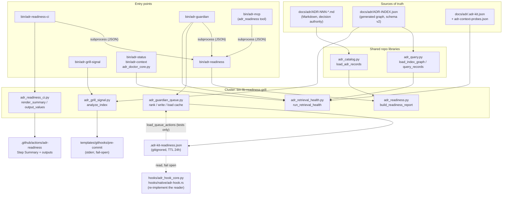

# Readiness and Grilling Libraries

## Overview

- **Name**: Readiness and Grilling Libraries (`bin-lib-readiness-grill`)
- **Description**: Five importable, stdlib-only Python modules that make up the deterministic half of ADR Kit's "grilling" feature. They compute lifecycle readiness for Architecture Decision Records, turn that report into GitHub Actions output, emit bounded fail-open advisories for hooks and pre-commit, rank and cache the Proposed-ADR work queue, and check that Accepted binding ADRs carry enough retrieval metadata to be found by selective context. None of them mutate ADR lifecycle state, call a model, or touch the network.
- **Location**:
  - [`bin/adr_readiness.py`](../bin/adr_readiness.py) — readiness domain model
  - [`bin/adr_readiness_ci.py`](../bin/adr_readiness_ci.py) — GitHub Actions reporting
  - [`bin/adr_grill_signal.py`](../bin/adr_grill_signal.py) — bounded index-only advisories
  - [`bin/adr_guardian_queue.py`](../bin/adr_guardian_queue.py) — Proposed-ADR work queue cache
  - [`bin/adr_retrieval_health.py`](../bin/adr_retrieval_health.py) — retrieval probes and metadata health
- **Language**: Python 3 (`from __future__ import annotations` in all five; the project targets 3.11 in CI). Standard library only.
- **Purpose**: Provide the one shared, deterministic readiness contract that ADR-011 requires. Every consumer surface — CLI, MCP, guardian, pre-commit hook, GitHub Actions, doctor — imports these modules instead of reimplementing readiness. The split is deliberate: the *domain* modules are libraries with no `argparse`, no `sys.exit`, and no I/O beyond reading files, while the thin executables in `bin/` own argument parsing, `git` subprocesses, and exit codes.

Two of the five modules resolve their inputs from the generated ADR graph (`docs/adr/ADR-INDEX.json`), and one resolves them from the Markdown ADRs. That asymmetry is real and documented under *Notable behaviours* below.

## Code Elements

### `bin/adr_readiness.py` — deterministic readiness domain model

The core of ADR-011's "readiness boundary". Loads Markdown ADR records through `adr_catalog`, classifies each into exactly one of seven readiness classes, and computes explicit, inspectable implementation-link evidence against a set of changed paths plus diff text.

| Element | Signature | Description | Location |
| --- | --- | --- | --- |
| `READINESS_SCHEMA_VERSION` | `= 1` | Report schema version; mirrored by `schemas/adr-readiness.schema.json` (`"const": 1`). | [`adr_readiness.py:14`](../bin/adr_readiness.py) |
| `READINESS_CLASSES` | `tuple[str, ...]` (7 entries) | The closed classification vocabulary: `not-an-adr`, `needs-human-input`, `needs-mechanical-fix`, `ready-for-confirmation`, `accepted`, `rejected`, `supersession-required`. | [`adr_readiness.py:15`](../bin/adr_readiness.py) |
| `FINDING_CODES` | `tuple[str, ...]` (11 entries) | The closed finding/evidence code vocabulary (`ADR_FILE_CHANGED` … `VERIFIED_IN_CHANGED`). | [`adr_readiness.py:24`](../bin/adr_readiness.py) |
| `ReadinessError` | `class ReadinessError(ValueError)` | Raised when readiness input cannot be analyzed safely; the CLI maps it to exit 2. | [`adr_readiness.py:48`](../bin/adr_readiness.py) |
| `normalize_path` | `normalize_path(value: str) -> str` | Backslash → slash, strip leading `./`, collapse repeated slashes. Portable repo-relative form. | [`adr_readiness.py:52`](../bin/adr_readiness.py) |
| `explicit_adr_ids` | `explicit_adr_ids(text: str) -> List[str]` | Extract `ADR-NNN` tokens from arbitrary text (case-insensitive, zero-padded to 3 digits), sorted and deduplicated. | [`adr_readiness.py:60`](../bin/adr_readiness.py) |
| `implementation_evidence` | `implementation_evidence(record: Dict, changed_paths: Sequence[str], source_text: str = "", *, paths_normalized: bool = False, path_pairs: Optional[Sequence[tuple[str, str]]] = None, cited_ids: Optional[Sequence[str]] = None) -> Dict` | Returns `{linked, implemented, blocking_proposed, changed_paths, evidence}`. A link requires an implementation path outside `docs/adr/` **and** one of: the ADR id cited in the diff, the ADR file itself changed, or a `verified_in` target changed. The keyword-only args are a pre-normalisation fast path used by the batch report. | [`adr_readiness.py:66`](../bin/adr_readiness.py) |
| `architecture_advisories` | `architecture_advisories(changed_paths: Sequence[str]) -> List[Dict[str, str]]` | Non-blocking `ARCHITECTURE_REVIEW_RECOMMENDED` signals for architecture-sensitive paths. Docstring is explicit: "heuristics never prove ADR linkage". | [`adr_readiness.py:164`](../bin/adr_readiness.py) |
| `readiness_for_record` | `readiness_for_record(record: Dict, *, evaluated_on: date, changed_paths: Sequence[str] = (), source_text: str = "", relationships: Sequence[Dict] = (), paths_normalized: bool = False, path_pairs: Optional[Sequence[tuple[str, str]]] = None, cited_ids: Optional[Sequence[str]] = None) -> Dict` | Full per-ADR readiness record: classification, mechanical/human findings, a 3-check quality score, open questions, `verified_in`, implementation link, related ADRs, and the recommended `/adr-kit:grill …` next command. | [`adr_readiness.py:220`](../bin/adr_readiness.py) |
| `build_readiness_report` | `build_readiness_report(adr_dir: Path, *, evaluated_on: date, adr_id: Optional[str] = None, all_proposed: bool = False, changed_paths: Sequence[str] = (), source_text: str = "") -> Dict` | Top-level entry point. Loads records + relationships, selects one ADR / all Proposed / everything, and returns the versioned report with `summary.blocking_proposed`. Raises `ReadinessError` on an invalid or unknown ADR id. | [`adr_readiness.py:294`](../bin/adr_readiness.py) |

Private helpers, summarized rather than enumerated: `_mechanical_findings` ([`:180`](../bin/adr_readiness.py)) merges loader metadata findings with `DECISION_MISSING` and `SUPERSESSION_STATE_INCONSISTENT`; `_classification` ([`:199`](../bin/adr_readiness.py)) is the seven-way decision ladder (status first, then mechanical, then human, then `Proposed` → `ready-for-confirmation`). Two module-level regexes: `_ADR_TOKEN_RE` ([`:38`](../bin/adr_readiness.py)) and `_ARCHITECTURE_PATH_RE` ([`:39`](../bin/adr_readiness.py)).

Determinism notes: every list in the output is sorted (paths by `str.casefold`, evidence by a `(code, path, adr_id)` tuple, reports by `adr_id`), and the evaluation date is injected rather than read from the clock. That is what makes fixed-clock permutation tests possible.

### `bin/adr_readiness_ci.py` — safe GitHub Actions reporting

Pure formatting over an already-computed readiness report. No file loading, no ADR parsing. Everything is escaped before it reaches a workflow command or a Markdown summary.

| Element | Signature | Description | Location |
| --- | --- | --- | --- |
| `github_escape` | `github_escape(value: object) -> str` | Escape `%`, `\r`, `\n` for GitHub workflow-command payloads (`%25`/`%0D`/`%0A`). | [`adr_readiness_ci.py:10`](../bin/adr_readiness_ci.py) |
| `markdown_escape` | `markdown_escape(value: object) -> str` | Strip control characters, neutralize backticks and angle brackets for Step Summary Markdown. | [`adr_readiness_ci.py:19`](../bin/adr_readiness_ci.py) |
| `render_summary` | `render_summary(report: dict) -> str` | Build the `## ADR readiness` Step Summary: one `[BLOCK]`/`[INFO]` bullet per linked-or-Proposed ADR with evidence codes and next command, then `[ADVISORY]` bullets. | [`adr_readiness_ci.py:33`](../bin/adr_readiness_ci.py) |
| `output_values` | `output_values(report: dict) -> dict[str, str]` | The five GitHub Action outputs: `blocking-count`, `blocking-adrs` (compact JSON array), `advisory-count`, `schema-version`, `conclusion` (`blocked` \| `advisory-or-clean`). | [`adr_readiness_ci.py:76`](../bin/adr_readiness_ci.py) |
| `write_outputs` | `write_outputs(path: Path, values: dict[str, str]) -> None` | Append `key=value` lines to `$GITHUB_OUTPUT` with `newline="\n"`, sorted by key, newlines stripped from values. | [`adr_readiness_ci.py:87`](../bin/adr_readiness_ci.py) |
| `annotations` | `annotations(report: dict) -> list[str]` | `::error title=ADR readiness block::` per blocking ADR and `::notice title=ADR review advisory::` per advisory. | [`adr_readiness_ci.py:94`](../bin/adr_readiness_ci.py) |

One private helper: `_source_command` ([`:28`](../bin/adr_readiness_ci.py)) builds a quoted `/adr-kit:grill --source "<path>"` fallback command.

### `bin/adr_grill_signal.py` — bounded index-only advisories

The hook/pre-commit path. Reads the *generated index* only (never the Markdown loader, never a subprocess per ADR), and caps output at three signals per category so a commit can never be flooded or slowed.

| Element | Signature | Description | Location |
| --- | --- | --- | --- |
| `SIGNAL_SCHEMA_VERSION` | `= 1` | Advisory payload schema version. | [`adr_grill_signal.py:12`](../bin/adr_grill_signal.py) |
| `MAX_SIGNALS` | `= 3` | Hard cap per category. | [`adr_grill_signal.py:13`](../bin/adr_grill_signal.py) |
| `normalize_path` | `normalize_path(value: object) -> str` | Hardened variant of the readiness normalizer: also scrubs control characters and rewrites `::` to `__` so a crafted filename cannot inject a GitHub workflow command or hook directive. | [`adr_grill_signal.py:24`](../bin/adr_grill_signal.py) |
| `analyze_index` | `analyze_index(index: dict, changed_paths: Sequence[str], source_text: str, *, shell: str = "posix") -> dict` | Returns `{schema_version, linked_proposed, suspected_decisions, signal_count}`. `linked_proposed` carries `LINKED_PROPOSED_IMPLEMENTATION` items with evidence codes and an exact `/adr-kit:grill ADR-NNN` command; `suspected_decisions` carries advisory `ARCHITECTURE_REVIEW_RECOMMENDED` items for architecture-sensitive paths not already claimed by a link. | [`adr_grill_signal.py:50`](../bin/adr_grill_signal.py) |

Private helpers, summarized: `_matches` ([`:33`](../bin/adr_grill_signal.py)) does casefolded glob-or-prefix matching; `_quote` ([`:43`](../bin/adr_grill_signal.py)) shell-quotes a path for POSIX (`shlex.quote`) or PowerShell (single-quote doubling), truncating to 4096 characters after control-character removal. Regexes `_ADR_RE` ([`:14`](../bin/adr_grill_signal.py)) and `_SENSITIVE_RE` ([`:15`](../bin/adr_grill_signal.py)).

### `bin/adr_guardian_queue.py` — Proposed-ADR work queue and disposable cache

Turns a readiness report into a ranked, explainable, non-authoritative work queue and persists at most three actions into a gitignored, TTL-bounded cache that lifecycle hooks read at session start.

| Element | Signature | Description | Location |
| --- | --- | --- | --- |
| `QUEUE_SCHEMA_VERSION` | `= 1` | Cache schema version; readers reject anything else. | [`adr_guardian_queue.py:14`](../bin/adr_guardian_queue.py) |
| `QUEUE_CACHE_NAME` | `= ".adr-kit-readiness.json"` | Cache filename, written next to the ADRs. Gitignored at `.gitignore:60`. | [`adr_guardian_queue.py:15`](../bin/adr_guardian_queue.py) |
| `QUEUE_MAX_ACTIONS` | `= 3` | Hard cap on cached actions. | [`adr_guardian_queue.py:16`](../bin/adr_guardian_queue.py) |
| `QUEUE_MAX_BYTES` | `= 256 * 1024` | Refuse to write, and refuse to read, a cache larger than 256 KiB. | [`adr_guardian_queue.py:17`](../bin/adr_guardian_queue.py) |
| `QUEUE_TTL_HOURS` | `= 24` | Default freshness window. | [`adr_guardian_queue.py:18`](../bin/adr_guardian_queue.py) |
| `rank_proposed` | `rank_proposed(report: dict) -> list[dict]` | Rank Proposed ADRs by `(linked, shipped, ready-for-confirmation, open questions, age desc, quality asc, adr_id)` and attach human-readable `reasons`. Docstring: "Rank explainable Proposed work without granting lifecycle authority." | [`adr_guardian_queue.py:34`](../bin/adr_guardian_queue.py) |
| `build_queue_cache` | `build_queue_cache(report: dict, *, generated_at: datetime, ttl_hours: int = QUEUE_TTL_HOURS) -> dict` | Wrap the top `QUEUE_MAX_ACTIONS` ranked items with UTC `generated_at`/`expires_at`, source schema version, `total_proposed`, and an explicit `"authoritative": false`. Naive datetimes are treated as UTC. | [`adr_guardian_queue.py:86`](../bin/adr_guardian_queue.py) |
| `write_queue_cache` | `write_queue_cache(path: Path, payload: dict) -> None` | Atomic replace via a PID+thread-ident temp file opened `"xb"`, then `os.replace` with up to 8 retries and linear backoff on `PermissionError`. Raises `ValueError` above the size limit; unlinks the temp file on any `BaseException`. | [`adr_guardian_queue.py:109`](../bin/adr_guardian_queue.py) |
| `load_queue_actions` | `load_queue_actions(path: Path, *, now: datetime | None = None) -> list[dict]` | Read at most three actions, re-validating schema version, expiry, `ADR-\d{3,4}` id shape, and an exact-match `^/adr-kit:grill ADR-\d{3,4}$` command. Every failure mode returns `[]` — fail open, never raise. | [`adr_guardian_queue.py:139`](../bin/adr_guardian_queue.py) |

Private helpers, summarized: `_parse_date` ([`:22`](../bin/adr_guardian_queue.py)) tolerant ISO date parse returning `None`; `_age_days` ([`:29`](../bin/adr_guardian_queue.py)) clamped-at-zero day delta. Regex `_COMMAND_RE` ([`:19`](../bin/adr_guardian_queue.py)).

The double validation is intentional: the writer already produced clean data, but the reader treats the on-disk cache as untrusted input because it is a per-machine, gitignored file that anything could have edited.

### `bin/adr_retrieval_health.py` — selective-context probes and metadata health

Read-only health checks over the generated ADR graph. Answers two questions: do the project's declared retrieval probes still return the ADRs they should, and do Accepted binding ADRs carry enough selective metadata to be retrievable at all.

| Element | Signature | Description | Location |
| --- | --- | --- | --- |
| `MAX_PROBES` | `= 100` | Upper bound on probes in one file. | [`adr_retrieval_health.py:12`](../bin/adr_retrieval_health.py) |
| `MAX_EXPECTATIONS` | `= 20` | Upper bound on `include`/`exclude` entries per probe. | [`adr_retrieval_health.py:13`](../bin/adr_retrieval_health.py) |
| `DEFAULT_PROBE_FILE` | `= "adr-context-probes.json"` | Default probe filename, resolved relative to the ADR directory. | [`adr_retrieval_health.py:14`](../bin/adr_retrieval_health.py) |
| `ProbeConfigError` | `class ProbeConfigError(ValueError)` | Raised when a project retrieval-probe file is malformed. | [`adr_retrieval_health.py:17`](../bin/adr_retrieval_health.py) |
| `load_probes` | `load_probes(path: Path) -> Dict` | Strict, closed-world validator for the probe file: `schema_version` must be `1`, unknown root and probe fields are rejected by name, ids must match `[a-z][a-z0-9-]{0,79}` and be unique, `limit` must be `1..20` (and not a `bool`), `include`/`exclude` must be valid `ADR-\d{3,4}` ids and must not overlap. Returns a normalized `{schema_version, probes}` dict. | [`adr_retrieval_health.py:42`](../bin/adr_retrieval_health.py) |
| `evaluate_probes` | `evaluate_probes(records: Sequence[Dict], relationships: Sequence[Dict], schema_version: int, adr_dir: Path, probes: Sequence[Dict]) -> Dict` | Run each probe through `adr_query.query_records` and report `missing`, `unexpected`, and `historical_leakage`. A probe fails if any of the three is non-empty — so a Superseded/Rejected ADR appearing in results is itself a failure. | [`adr_retrieval_health.py:170`](../bin/adr_retrieval_health.py) |
| `run_retrieval_health` | `run_retrieval_health(adr_dir: Path, *, probe_path: Optional[Path] = None, config: Optional[Dict] = None) -> Dict` | Whole check. Resolves the probe file from `context.probes_file`, refuses a path outside the ADR directory, loads the index graph, evaluates probes, applies the `off`/`advisory`/`strict` metadata policy, and returns `status` of `pass` \| `fail` \| `degraded`. | [`adr_retrieval_health.py:264`](../bin/adr_retrieval_health.py) |
| `render_retrieval_health` | `render_retrieval_health(payload: Dict) -> str` | Compact multi-line human rendering: status/source line, probe pass/fail/total, metadata finding count with mode, then one line per failing probe. | [`adr_retrieval_health.py:354`](../bin/adr_retrieval_health.py) |

Private helpers, summarized: `_string_array` ([`:21`](../bin/adr_retrieval_health.py)) the shared bounded/unique/≤240-char string-list validator; `_metadata_findings` ([`:130`](../bin/adr_retrieval_health.py)) emits one `selective_context_metadata` finding (level `FAIL` when strict, else `ADVISORY`) per Accepted binding ADR that is neither `context_scope: global`, nor carries `topics`/`aliases`/`components`/`symbols`, nor has a non-empty Decision Contract; `_load_config` ([`:253`](../bin/adr_retrieval_health.py)) best-effort read of `<adr_dir>/.adr-kit.json` that returns `{}` on any error.

Status semantics worth remembering: `degraded` means the *index* was unavailable (missing, stale, invalid, unsupported version) and no judgement was possible; `fail` means a real finding. That distinction is what lets hooks fail open while CI and doctor report failure.

## Dependencies

### Internal

| From | Imports | Purpose |
| --- | --- | --- |
| `adr_readiness.py:11` | `adr_catalog.build_relationships`, `load_adr_records`, `normalize_adr_id` | Markdown-first semantic ADR loading and the relationship graph. |
| `adr_retrieval_health.py:10` | `adr_query.IndexQueryError`, `load_index_graph`, `query_records` | Index-first graph loading and the shared ranking engine. |
| `adr_readiness_ci.py` | none | Pure formatting; stdlib only. |
| `adr_grill_signal.py` | none | Takes the parsed index as a plain `dict` from its caller. |
| `adr_guardian_queue.py` | none | Takes the readiness report as a plain `dict` from its caller. |

Consumers of these modules (all resolve them by inserting `bin/` on `sys.path`):

- [`bin/adr-readiness`](../bin/adr-readiness) → `adr_readiness` (`ReadinessError`, `build_readiness_report`, `normalize_path`)
- [`bin/adr-readiness-ci`](../bin/adr-readiness-ci) → `adr_readiness_ci` (all four public functions)
- [`bin/adr-grill-signal`](../bin/adr-grill-signal) → `adr_grill_signal` (`analyze_index`, `normalize_path`)
- [`bin/adr-guardian`](../bin/adr-guardian) (`:63`, `:68`) → `adr_guardian_queue` (`QUEUE_CACHE_NAME`, `build_queue_cache`, `write_queue_cache`) and `adr_retrieval_health` (`render_retrieval_health`, `run_retrieval_health`)
- [`bin/adr-status`](../bin/adr-status) (`:30`, used at `:709`) → `run_retrieval_health`
- [`bin/adr-context`](../bin/adr-context) (`:106`, `:487`, lazy in-function imports) → `run_retrieval_health`, `render_retrieval_health`
- [`bin/adr_doctor_core.py`](../bin/adr_doctor_core.py) (`:16`, used at `:239`) → `run_retrieval_health`
- [`bin/adr-mcp`](../bin/adr-mcp) (`:540`) → reaches readiness *indirectly* by shelling out to `bin/adr-readiness --format json`
- [`scripts/benchmark-adr-grilling.py`](../scripts/benchmark-adr-grilling.py) (`:21`) → `build_readiness_report` for the ADR-011 latency budgets

### External

- **Python standard library only**: `fnmatch`, `re`, `json`, `os`, `shlex`, `threading`, `time`, `datetime`, `pathlib`, `typing`. No third-party import was found in any of the five modules. The dependency-free posture holds.
- **External CLIs**: none invoked from these libraries. `git` (`git diff --name-only -M`, `git diff --unified=0 -M`) is invoked only by the thin wrappers `bin/adr-readiness` ([`:34`](../bin/adr-readiness), 10 s timeout) and `bin/adr-grill-signal` ([`:15`](../bin/adr-grill-signal), 5 s timeout). No `claude`, `gh`, or network call anywhere in this cluster — required by ADR-011's "hooks and CI must stay local, model-free, bounded, and deterministic" driver.
- **OS services**: filesystem only. `write_queue_cache` relies on `os.replace` atomicity and carries a Windows-specific `PermissionError` retry loop (antivirus/indexer holding the temp file).

## Interfaces

### CLI (thin wrappers over these libraries)

**`bin/adr-readiness [ADR] [flags]`** — `--all-proposed`, `--diff`, `--base REF`, `--head REF`, `--format {human,json,github}` (default `human`), `--repo-root PATH` (default `.`), `--adr-dir PATH` (default `docs/adr`), `--today YYYY-MM-DD`. Exit `0` on success, `2` on any `ReadinessError`/`ValueError`/`OSError`/timeout. Notably it does **not** exit non-zero for a blocking ADR — blocking is expressed in the payload, and only the CI wrapper turns it into a failure.

**`bin/adr-readiness-ci --base REF --head REF [flags]`** — `--repo-root`, `--adr-dir`, `--today`, `--summary-file`, `--output-file`. Shells out to `bin/adr-readiness --all-proposed … --format json` (30 s timeout) and then renders. Exit codes: `0` clean or advisory-only, `1` at least one blocking ADR, `2` infrastructure failure (which is also emitted as `::error title=ADR readiness infrastructure::`). The 0/1/2 split is the contract that lets a workflow distinguish "your PR is blocked" from "the check itself broke".

**`bin/adr-grill-signal [flags]`** — `--repo-root`, `--index` (default `docs/adr/ADR-INDEX.json`), `--staged`, `--paths [PATH …]`, `--source-text TEXT`, `--shell {posix,powershell}`, `--format {human,json}`. Refuses an index above 2 MiB. Exit `0` always on the success path, `2` on error. Human output lines are prefixed `[adr-grill] STRONG …` / `[adr-grill] ADVISORY …`, which is exactly what `templates/githooks/pre-commit:231` greps for before writing them to stderr — the hook swallows the exit status with `|| true`, so this path can never block a commit.

### GitHub Actions contract

[`.github/actions/adr-readiness/action.yml`](../.github/actions/adr-readiness/action.yml) is a composite action wrapping `bin/adr-readiness-ci`. Inputs: `adr-dir`, `base`, `head`, `python-version` (default `3.11`). Outputs, produced verbatim by `output_values()`: `blocking-count`, `blocking-adrs`, `advisory-count`, `schema-version`, `conclusion`. [`templates/github-workflows/adr-readiness.yml`](../templates/github-workflows/adr-readiness.yml) is the copy-paste consumer workflow.

### MCP

`adr_readiness` is the fifth and only read-only readiness tool on the key-free MCP server, defined at [`bin/adr-mcp:237`](../bin/adr-mcp) and handled at [`bin/adr-mcp:540`](../bin/adr-mcp). Declared input schema: `adr_id?`, `all_proposed?`, `base?`, `head?`, `today?`, plus the shared workspace properties. `base` and `head` must be supplied together. It exposes readiness only — there is deliberately no acceptance or other lifecycle mutation, and ADR-011's own Enforcement block has a `require_pattern` on `adr_readiness` in `bin/adr-mcp` to keep it that way.

### JSON contracts

| Contract | Schema | Producer |
| --- | --- | --- |
| Readiness report, `schema_version: 1` | [`schemas/adr-readiness.schema.json`](../schemas/adr-readiness.schema.json) | `build_readiness_report` |
| Grill signal payload, `schema_version: 1` | *(no JSON Schema file; contract lives in `analyze_index` and its tests)* | `analyze_index` |
| Queue cache `docs/adr/.adr-kit-readiness.json`, `schema_version: 1` | *(no JSON Schema file; validated in code by both writer and reader)* | `build_queue_cache` / `write_queue_cache` |
| Retrieval probes, `schema_version: 1` | [`schemas/adr-context-probes.schema.json`](../schemas/adr-context-probes.schema.json); live example [`docs/adr/adr-context-probes.json`](../docs/adr/adr-context-probes.json) | consumed by `load_probes` |
| Config keys `context.probes_file`, `context.retrieval_completeness` (`off`\|`advisory`\|`strict`, default `advisory`) | [`schemas/adr-kit-config.schema.json`](../schemas/adr-kit-config.schema.json) | consumed by `run_retrieval_health` |

### Importable surface

All five modules are importable as plain modules once `bin/` is on `sys.path`; the tests do exactly that ([`tests/test_adr_readiness.py`](../tests/test_adr_readiness.py), [`tests/test_adr_readiness_ci.py`](../tests/test_adr_readiness_ci.py), [`tests/test_adr_grill_signal.py`](../tests/test_adr_grill_signal.py), [`tests/test_adr_guardian_queue.py`](../tests/test_adr_guardian_queue.py), [`tests/test_adr_retrieval_health.py`](../tests/test_adr_retrieval_health.py), plus [`tests/test_adr_grill_integrations.py`](../tests/test_adr_grill_integrations.py) and [`tests/test_adr_open_questions.py`](../tests/test_adr_open_questions.py)).

## Relationships

## Governing ADRs

Verified against [`docs/adr/ADR-INDEX.md`](../docs/adr/ADR-INDEX.md) and the ADR sources:

- **ADR-011** (Accepted, 2026-07-20) — *Adopt Deterministic Readiness and Human-Gated Grilling Across the ADR Lifecycle*. Directly governing. Its "Readiness boundary" section defines the seven classification values implemented verbatim in `READINESS_CLASSES` ([`adr_readiness.py:15`](../bin/adr_readiness.py)); its "Automation boundary" section mandates that hooks emit only a short fail-open advisory with an exact grill command (`adr_grill_signal`) and that CI blocks only on explicit, inspectable evidence of a linked Proposed ADR (`implementation_evidence` → `blocking_proposed` → `adr_readiness_ci`). Its Enforcement block pins `adr_readiness` into `bin/adr-mcp`.
- **ADR-014** (Accepted) — *Use the Generated ADR Graph as the Selective-Context Query Engine*. Governs `adr_retrieval_health.py`: the probes run against the generated graph through the one shared engine, historical-authority results are a failure (matching ADR-014's authority separation), and the `degraded` status implements ADR-014's "missing, invalid, unsupported, or stale graph handling will be explicit and observable". It also governs `adr_grill_signal.py`'s index-only posture.
- **ADR-004** (Accepted) — *Layered ADR Context Injection*. Cited by ADR-011 as defining the fail-open context tiers. It governs the queue cache's role: `load_queue_actions` / `hooks.load_queue_context` are injection-tier readers that must fail open, while `adr-judge` at commit time remains the fail-closed floor. Neither this cluster's hook advisories nor its cache can block anything.
- **ADR-007** (Accepted, scope `docs/adr/ADR-INDEX.json`) — relevant as the upstream producer of the index that `adr_grill_signal` and `adr_retrieval_health` consume, though the scope glob does not cover these files.

## Notable behaviours and risks

1. **`load_queue_actions` has no production consumer.** It is defined at [`adr_guardian_queue.py:139`](../bin/adr_guardian_queue.py) and referenced only by [`tests/test_adr_guardian_queue.py`](../tests/test_adr_guardian_queue.py). The real hook reader is a separate implementation, `load_queue_context` at [`hooks/adr_hook_core.py:200`](../hooks/adr_hook_core.py), which duplicates `QUEUE_CACHE_NAME`, `QUEUE_MAX_BYTES`, the schema check, the expiry check, and the id/command validation. A third implementation exists in Rust at [`hooks/native/adr-hook.rs:210`](../hooks/native/adr-hook.rs). Three readers of one contract, only one of which is exercised by this cluster's tests.
2. **Markdown-first readiness vs index-first everything else.** `build_readiness_report` loads Markdown through `adr_catalog.load_adr_records` ([`adr_readiness.py:303`](../bin/adr_readiness.py)), while `adr_grill_signal` and `adr_retrieval_health` read the generated graph. The two therefore read differently shaped records for the same concepts: readiness uses `record["verified_in"]` and `record["scope"]` (a flat glob list), the index path uses `record["metadata"]["verified_in"]` and `record["scope"]["path_globs"]`. Correct today, but it means the linkage rule exists in two places.
3. **Two near-duplicate regexes, one duplicated function name with different semantics.** `_ARCHITECTURE_PATH_RE` ([`adr_readiness.py:39`](../bin/adr_readiness.py)) and `_SENSITIVE_RE` ([`adr_grill_signal.py:15`](../bin/adr_grill_signal.py)) are character-identical but independent — silent drift risk. `normalize_path` exists in both modules with deliberately *different* behaviour: the grill-signal version additionally scrubs control characters and rewrites `::` to `__`. Importing the wrong one would quietly weaken injection defence.
4. **Case-sensitive ADR-file comparison in the hook path.** [`adr_grill_signal.py:76`](../bin/adr_grill_signal.py) uses `Path(path).name == str(record.get("path", ""))`, while the equivalent readiness check at [`adr_readiness.py:92-95`](../bin/adr_readiness.py) casefolds both sides. On a case-insensitive filesystem a differently-cased diff path yields `ADR_FILE_CHANGED` from readiness but not from the hook signal. Impact is limited to a missing advisory (fail-open), not a false block.
5. **`signal_count` under-reports.** [`adr_grill_signal.py:122`](../bin/adr_grill_signal.py) computes `min(MAX_SIGNALS, len(linked) + len(suspected))`, but the payload can carry up to three items in *each* list, i.e. six. The only test assertion is `signal_count <= 3`, so nothing catches it. Cosmetic today because no production consumer reads the field.
6. **Fragile sentinel in the CI summary renderer.** [`adr_readiness_ci.py:71`](../bin/adr_readiness_ci.py) detects "nothing was emitted" with `if len(lines) == 4`, coupling the empty-state branch to the exact length of the four-line header. Adding a header line silently suppresses the "No ADR readiness findings." message.
7. **README documents MCP arguments the server does not accept.** [`README.md:384`](../README.md) lists `adr_readiness` as taking `changed_paths?` and `source_text?`; the actual `inputSchema` at [`bin/adr-mcp:242`](../bin/adr-mcp) exposes `base` and `head` instead. Documentation drift, not a code defect.
8. **Three byte-identical copies of every module.** `codex/bin/` and `copilot/bin/` contain verified byte-identical copies of all five files (checked with `cmp`). They are generated client payloads and must be regenerated together; `.github/workflows/validate.yml:90-92` also pins `bin/adr-readiness`, `bin/adr-readiness-ci`, and `bin/adr-grill-signal` into the packaging inventory.
9. **Windows-specific atomic-write hardening.** [`adr_guardian_queue.py:123-130`](../bin/adr_guardian_queue.py) retries `os.replace` eight times with linear backoff on `PermissionError`. That loop only makes sense on Windows, where an antivirus scanner or search indexer can briefly hold the destination handle; on POSIX `os.replace` is already atomic. Worth keeping in mind when touching this function.
10. **Path-traversal guard on the probe file.** [`adr_retrieval_health.py:278-296`](../bin/adr_retrieval_health.py) resolves the configured probe path and returns a `fail` payload (rather than raising) if it escapes the ADR directory. A project config therefore cannot point the probe loader at arbitrary filesystem locations.
11. **Blocking is a payload fact, not an exit code, at the CLI layer.** `bin/adr-readiness` returns `0` even when `summary.blocking_count > 0`; only `bin/adr-readiness-ci` translates that into exit `1`. Any new consumer that checks only the exit status of `adr-readiness` will silently miss blocks.
