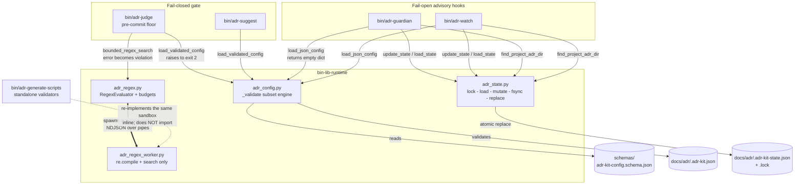

# Runtime Infrastructure Libraries

## Overview

- **Name**: Runtime Infrastructure Libraries (`bin-lib-runtime`)
- **Description**: Four small, importable, stdlib-only Python modules that every
  adr-kit command relies on for the three things that are dangerous to get wrong at
  runtime: reading project configuration without letting a malformed file weaken a
  gate, mutating shared JSON state without losing a concurrent writer's update, and
  evaluating repository-authored regular expressions without letting a hostile or
  merely careless pattern hang a commit. They contain no CLI of their own except the
  regex worker, which exists only to be spawned as a child process.
- **Location**:
  - [`bin/adr_config.py`](../bin/adr_config.py) — configuration schema validation
  - [`bin/adr_state.py`](../bin/adr_state.py) — transactional JSON state + project discovery
  - [`bin/adr_regex.py`](../bin/adr_regex.py) — bounded regex evaluator (parent side)
  - [`bin/adr_regex_worker.py`](../bin/adr_regex_worker.py) — isolated regex worker (child side)
- **Language**: Python 3 (`from __future__ import annotations`; standard library only)
- **Purpose**: Concentrate the repository's fail-closed / fail-open decisions into one
  place. The blocking pre-commit gate (`bin/adr-judge`) and the advisory hooks
  (`bin/adr-guardian`, `bin/adr-watch`) draw from the same four modules but call
  deliberately different functions, because a gate must refuse to run on bad input
  while a hook must never interrupt a session. That asymmetry is this cluster's
  actual thesis and is tabulated under [Fail-open vs fail-closed](#fail-open-vs-fail-closed-postures).

### Fail-open vs fail-closed postures

This is the single most load-bearing fact about the cluster. Four functions, four
deliberate postures:

| Function | Posture on bad input | Consumer | Effect |
| --- | --- | --- | --- |
| `load_validated_config` | raises `ConfigValidationError` | `adr-judge`, `adr-suggest` | wrapped as `JudgeError` / `SuggestError` → **exit 2** |
| `load_json_config` | returns `{}` | `adr-guardian`, `adr-watch` | silently falls back to defaults |
| `update_state` | catches, calls `warning`, returns `None` | `adr-guardian`, `adr-watch` | advisory state update is skipped, never written unlocked |
| `bounded_regex_search` | raises `RegexEvaluationError` | `adr-judge` | emitted as a `severity: violation` finding → **exit 1** |

`ADR-004` states this principle at the architecture level ("three fail-open injection
tiers and one fail-closed enforcement floor"); these four functions are that principle
expressed as library code.

---

## Code Elements

### `bin/adr_config.py` — configuration schema validation

Hand-rolled validator for a **subset** of JSON Schema draft-07, applied to
`docs/adr/.adr-kit.json` before any tool reads a value out of it. It exists because
adr-kit ships no third-party dependencies: `jsonschema` is imported *optionally* by
`bin/adr-judge:101` (for `## Enforcement` blocks) and degrades to `None` when absent,
so a config validator that must always run cannot depend on it.

The motivation is finding **F-02** of the July 2026 source audit
([`docs/reviews/2026-07-18-source-audit/FINDINGS.md:124-147`](../docs/reviews/2026-07-18-source-audit/FINDINGS.md)):
before this module existed, `adr-judge` read config with Python truthiness and bare
`int()`, so `"advisory_only": "false"` was truthy (violations exited 0) and
`"max_diff_bytes": -1` skipped every non-empty diff. Type coercion was an enforcement
bypass.

| Element | Signature | Description | Location |
| --- | --- | --- | --- |
| `ConfigValidationError` | `class ConfigValidationError(ValueError)` | Raised when `.adr-kit.json` is malformed or violates its schema. | [adr_config.py:11](../bin/adr_config.py) |
| `validate_project_config` | `validate_project_config(config: Any, schema_path: Path) -> Dict[str, Any]` | Validate an already-parsed config against a schema file; returns the config unchanged on success, raises with all issues joined by `"; "`. | [adr_config.py:117](../bin/adr_config.py) |
| `load_project_config` | `load_project_config(path: Path, schema_path: Path) -> Dict[str, Any]` | Read + validate one config file against an explicit schema path. A missing file returns `{}` (defaults); unreadable or invalid JSON raises. | [adr_config.py:131](../bin/adr_config.py) |
| `load_validated_config` | `load_validated_config(path: Path \| None) -> Dict[str, Any]` | **Fail-closed entry point.** Validates against the shipped schema. `path is None` or a missing file yields `{}`. | [adr_config.py:154](../bin/adr_config.py) |
| `load_json_config` | `load_json_config(path: Path) -> Dict[str, Any]` | **Fail-open entry point.** Reads a JSON object tolerantly; any `OSError`, `JSONDecodeError`, or non-dict root yields `{}`. No schema check at all. | [adr_config.py:165](../bin/adr_config.py) |
| `DEFAULT_CONFIG_SCHEMA` | `Path` (module-level constant) | `Path(__file__).resolve().parent.parent / "schemas" / "adr-kit-config.schema.json"`. Resolved relative to `__file__`, which is why each mirrored copy finds its own root's `schemas/`. | [adr_config.py:149](../bin/adr_config.py) |

**`_validate` is documented individually despite being private**, because the subset it
implements *is* the contract:

| Element | Signature | Description | Location |
| --- | --- | --- | --- |
| `_validate` | `_validate(value: Any, schema: Dict[str, Any], path: str) -> List[str]` | Recursive validator returning a list of human-readable issues (empty = valid). Supported keywords: `oneOf`, `type`, `enum`, `minLength`, `pattern`, `minItems`, `items`, `minimum`, `maximum`, `properties`, `patternProperties`, `required`, `additionalProperties`. | [adr_config.py:39](../bin/adr_config.py) |

Two private helpers are **summarized in aggregate** rather than enumerated: `_type_matches`
([adr_config.py:15](../bin/adr_config.py)) maps a JSON type name to an `isinstance` check —
notably `boolean` and `integer` are disjoint (`isinstance(value, bool)` is excluded from
`integer`/`number`), which is exactly the truthiness bug F-02 described; and `_path`
([adr_config.py:33](../bin/adr_config.py)) formats an error breadcrumb as `$.judge.llm_model`
for identifier-safe keys and `$["odd key"]` otherwise.

Validator semantics worth knowing before editing:

- Unsupported draft-07 keywords are **silently ignored**, not rejected. Verified against
  the shipped schema: `allOf`, `anyOf`, `$ref`, `const`, `maxLength`, `maxItems`,
  `uniqueItems`, `dependencies`, `if`/`then`/`else`, `format`, `multipleOf`,
  `propertyNames`, `exclusiveMinimum`/`exclusiveMaximum`, and `not` do not currently
  appear in [`schemas/adr-kit-config.schema.json`](../schemas/adr-kit-config.schema.json),
  so today validator and schema agree. Nothing mechanically prevents a future schema
  edit from adding one and silently losing its constraint.
- Array-form `"type": ["string", "null"]` is **not** type-checked: line 53 only acts when
  `expected` is a `str`. No such declaration exists in the shipped schema today.
- `_type_matches` returns `True` for any unrecognized type name ([adr_config.py:30](../bin/adr_config.py)),
  so a typo'd `"type": "strng"` accepts every value.
- `oneOf` early-returns at [adr_config.py:50](../bin/adr_config.py) without applying sibling
  keywords. The schema uses `oneOf` twice, both for `llm_cmd` (`judge.llm_cmd` at
  schema line 141, `suggest.llm_cmd` at line 194), each an array-or-string union with no
  siblings — so the early return is harmless as written.

### `bin/adr_state.py` — transactional JSON state and project discovery

Shared read-modify-write transaction layer for `docs/adr/.adr-kit-state.json`, the
per-machine, gitignored state file that `ADR-002` defines (guardian tier clocks, nudge
cooldowns, health trend entries). Motivated by audit finding **F-16**
([`FINDINGS.md:437-452`](../docs/reviews/2026-07-18-source-audit/FINDINGS.md)): guardian
and watcher previously rewrote that file with fixed temporary paths and incomplete
cross-process locking, so concurrent hooks could lose cooldown or trend updates.

| Element | Signature | Description | Location |
| --- | --- | --- | --- |
| `T` | `T = TypeVar("T")` | Result type of a state mutation. | [adr_state.py:14](../bin/adr_state.py) |
| `StateMutation` | `StateMutation = Callable[[Dict], Tuple[bool, T]]` | Public type alias. A mutation receives the loaded state dict, mutates it in place, and returns `(dirty, result)`; the state is written only when `dirty` is truthy. | [adr_state.py:15](../bin/adr_state.py) |
| `find_project_adr_dir` | `find_project_adr_dir() -> Optional[Path]` | Locate `docs/adr/`, preferring `$CLAUDE_PROJECT_DIR` over `Path.cwd()`. A candidate counts only if it exists **and** holds at least one `ADR-*.md` — the hook self-guard, which means an empty `docs/adr/` reads as "not an adr-kit project". | [adr_state.py:18](../bin/adr_state.py) |
| `StateLockTimeout` | `class StateLockTimeout(OSError)` | Raised when the cross-process lock cannot be acquired inside the deadline. Subclasses `OSError`, so `update_state`'s handler catches it either way. | [adr_state.py:45](../bin/adr_state.py) |
| `state_lock` | `@contextlib.contextmanager`<br>`state_lock(state_path: Path, timeout_seconds: float = 2.0)` | Hold an exclusive cross-process lock over a whole transaction. No return annotation in the source. Creates `<state>.lock` beside the state file. | [adr_state.py:49](../bin/adr_state.py) |
| `load_state` | `load_state(state_path: Path, default_factory: Callable[[], Dict], warning: Optional[Callable[[str], None]] = None) -> Dict` | Load one JSON object. Missing, unreadable, corrupt, or non-dict-rooted state returns `default_factory()` and optionally reports via `warning`. | [adr_state.py:106](../bin/adr_state.py) |
| `atomic_save_state` | `atomic_save_state(state_path: Path, state: Dict) -> None` | Write to a **unique** same-directory `NamedTemporaryFile` (`newline=""`, `indent=2`, trailing newline), `flush` + `os.fsync`, then `os.replace`. Cleans up the temp file if the replace never happens. | [adr_state.py:128](../bin/adr_state.py) |
| `update_state` | `update_state(state_path: Path, default_factory: Callable[[], Dict], mutation: StateMutation[T], warning: Optional[Callable[[str], None]] = None, timeout_seconds: float = 2.0) -> Optional[T]` | Lock → load → mutate → conditionally save, as one transaction. **Fail-open**: any `OSError` or `StateLockTimeout` is reported via `warning` and returns `None`. | [adr_state.py:154](../bin/adr_state.py) |

Locking mechanics — cross-platform without a dependency:

- The lock is acquired in a **non-blocking spin loop with a deadline**, not a blocking
  wait: `fcntl.flock(..., LOCK_EX | LOCK_NB)` on POSIX, falling back on `ImportError`
  to `msvcrt.locking(..., LK_NBLCK, 1)` on Windows. Failure sleeps 10 ms and retries
  until `timeout_seconds` elapses ([adr_state.py:58-85](../bin/adr_state.py)). Effect is
  block-with-timeout; the audit's prose calls it "blocking".
- The Windows path must lock a byte that exists, so it writes a single `\0` when the
  lock file is empty before `msvcrt.locking` ([adr_state.py:68-73](../bin/adr_state.py)).
- The `.lock` file is never deleted. All four variants are gitignored
  ([`.gitignore:56-59`](../.gitignore)).
- **Caller caveat**: `update_state` returns `None` both when the transaction failed and
  when the mutation legitimately returned `None`; callers cannot distinguish.
  `bin/adr-watch:432` copes with `_update_state(...) or []`.
- An `OSError` raised from inside the caller's `mutation` is also swallowed by the
  handler at [adr_state.py:169](../bin/adr_state.py) and reported as "state update
  skipped". Intentional for advisory state; surprising if a mutation ever does real I/O.

### `bin/adr_regex.py` — bounded, killable regex evaluation (parent side)

Runs one persistent worker subprocess and speaks newline-delimited JSON to it, owning
every timeout and budget on the parent side so the child can be killed outright.

| Element | Signature | Description | Location |
| --- | --- | --- | --- |
| `DEFAULT_REGEX_TIMEOUT_SECONDS` | `= 1.0` | Wall-clock budget per search. | [adr_regex.py:15](../bin/adr_regex.py) |
| `DEFAULT_REGEX_INPUT_BYTES` | `= 2 * 1024 * 1024` | 2 MiB UTF-8 input ceiling. | [adr_regex.py:16](../bin/adr_regex.py) |
| `DEFAULT_REGEX_PATTERN_CHARS` | `= 4096` | Pattern-length ceiling. | [adr_regex.py:17](../bin/adr_regex.py) |
| `RegexEvaluationError` | `class RegexEvaluationError(RuntimeError)` | Base error: the regex could not be evaluated safely. | [adr_regex.py:20](../bin/adr_regex.py) |
| `RegexTimeoutError` | `class RegexTimeoutError(RegexEvaluationError)` | The isolated regex exceeded its wall-clock budget. | [adr_regex.py:24](../bin/adr_regex.py) |
| `RegexBudgetError` | `class RegexBudgetError(RegexEvaluationError)` | Pattern or input exceeded its deterministic budget. Raised **before** any subprocess work. | [adr_regex.py:28](../bin/adr_regex.py) |
| `RegexEvaluator` | `class RegexEvaluator` | One persistent worker process, restarted after timeout or failure. | [adr_regex.py:32](../bin/adr_regex.py) |
| `RegexEvaluator.__init__` | `__init__(self, *, timeout_seconds: float = DEFAULT_REGEX_TIMEOUT_SECONDS, max_input_bytes: int = DEFAULT_REGEX_INPUT_BYTES, max_pattern_chars: int = DEFAULT_REGEX_PATTERN_CHARS) -> None` | Keyword-only budgets. Does not start the worker; startup is lazy. | [adr_regex.py:35](../bin/adr_regex.py) |
| `RegexEvaluator.close` | `close(self) -> None` | Close the worker's stdin, `wait(timeout=0.2)`, then `kill()` + `wait()` if it has not exited. | [adr_regex.py:75](../bin/adr_regex.py) |
| `RegexEvaluator.search` | `search(self, pattern: str, text: str, flags: int = 0) -> bool` | Budget-check, lazily (re)start the worker, send one request, await one response inside `timeout_seconds`. Returns whether the pattern matched; raises a `RegexEvaluationError` subclass otherwise. | [adr_regex.py:98](../bin/adr_regex.py) |
| `bounded_regex_search` | `bounded_regex_search(pattern: str, text: str, flags: int = 0) -> bool` | Module-level convenience over a lazily-created process-global `RegexEvaluator`. This is what `adr-judge` calls. | [adr_regex.py:150](../bin/adr_regex.py) |

Two private members, **summarized in aggregate**: `_start`
([adr_regex.py:48](../bin/adr_regex.py)) spawns `[sys.executable, adr_regex_worker.py]`
with piped stdin/stdout, `stderr=DEVNULL`, `text=True`, `encoding="utf-8"`,
`errors="replace"`, `bufsize=1`, and launches a daemon reader thread; `_terminate`
([adr_regex.py:91](../bin/adr_regex.py)) hard-kills the worker and clears the handle so
the next `search` starts a fresh one. Module-level `_DEFAULT_EVALUATOR`
([adr_regex.py:147](../bin/adr_regex.py)) and the `atexit`-registered `_close_default`
([adr_regex.py:158-165](../bin/adr_regex.py)) manage the process-global instance.

**The queue-binding invariant** ([adr_regex.py:62-73](../bin/adr_regex.py)) deserves
naming, because violating it produced a shipped bug fixed in v0.41.0
([`CHANGELOG.md:72-79`](../CHANGELOG.md)). The reader thread closes over local
`_stdout` and `_responses` rather than reading `self._process.stdout` /
`self._responses`. Without that, a retired worker's end-of-stream sentinel (`None`)
landed in the *new* worker's queue after a restart, and the next evaluation read the
stale sentinel and failed closed with "worker exited unexpectedly" — blocking a commit
that had no violation. Any refactor of `_start` must preserve this binding.

Restart / error taxonomy, as coded in `search`:

| Condition | Handling | Worker killed? |
| --- | --- | --- |
| Pattern > `max_pattern_chars` | `RegexBudgetError` before any I/O | n/a — never started |
| UTF-8 input > `max_input_bytes` | `RegexBudgetError` before any I/O | n/a |
| `BrokenPipeError` / `OSError` on write | `RegexEvaluationError` | yes, `_terminate()` |
| No response within `timeout_seconds` | `RegexTimeoutError` | yes, `_terminate()` |
| Sentinel `None` read (worker died) | `RegexEvaluationError("...exited unexpectedly")` | yes, `_terminate()` |
| Non-JSON response line | `RegexEvaluationError("...invalid JSON")` | yes, `_terminate()` |
| `{"ok": false, "error": ...}` | `RegexEvaluationError("...rejected pattern: ...")` | **no** — the worker is healthy, the pattern was not |

### `bin/adr_regex_worker.py` — isolated regex worker (child side)

Thirty lines, and deliberately so. A `#!/usr/bin/env python3` script whose only job is
to read request lines from stdin, compile and search, and write one response line per
request. It owns **no** timeout: the module docstring states outright that "the parent
process owns all timeouts and can terminate this process if CPython's backtracking
regex engine becomes unresponsive."

| Element | Signature | Description | Location |
| --- | --- | --- | --- |
| `main` | `main() -> int` | Loop over stdin lines: parse JSON, `re.compile(request["pattern"], int(request.get("flags", 0)))`, `pattern.search(request["text"])`, emit one compact JSON response and flush. Always returns `0`. | [adr_regex_worker.py:15](../bin/adr_regex_worker.py) |
| module entry | `if __name__ == "__main__": raise SystemExit(main())` | Sole CLI surface of the cluster. Takes no arguments. | [adr_regex_worker.py:29-30](../bin/adr_regex_worker.py) |

The caught exception set is `(KeyError, TypeError, ValueError, re.error)`
([adr_regex_worker.py:22](../bin/adr_regex_worker.py)) — a bad pattern or a malformed
request becomes `{"ok": false, "error": ...}` and the worker survives. `MemoryError` and
`RecursionError` are **deliberately excluded**: they crash the worker, the parent's
reader thread emits its EOF sentinel, and `search` raises
`RegexEvaluationError("isolated regex worker exited unexpectedly")`. That path is by
design — a worker that cannot answer is treated the same as one that answers "violation".

---

## Threat model: why the regex sandbox exists

The untrusted input is the **`pattern` string inside an ADR's `## Enforcement` JSON
block**, authored by anyone who can land a file under `docs/adr/`. adr-kit's own
pre-commit gate compiles and runs those patterns against every added line of a staged
diff. Repository-authored policy is therefore executable input from a party the gate
does not fully trust — a collaborator, a merged PR, or simply a well-meaning author who
wrote `(a+)+$`.

**The GIL makes an in-process timeout impossible, not merely unreliable.** Audit finding
**F-01** ([`FINDINGS.md:99-122`](../docs/reviews/2026-07-18-source-audit/FINDINGS.md)) is
explicit about the mechanism: the pre-TASK-32 implementation ran `re.search` in a daemon
thread and called `join(timeout)`, but CPython's regex engine holds the global
interpreter lock while backtracking, so the joining thread never gets scheduled to
enforce its own deadline. The recorded reproduction: `(a+)+$` against 30 `a` characters
plus `!`, with a nominal 0.1-second helper timeout, blew straight past an outer
5-second process timeout. A process boundary is *required* here, not preferred — it is
the only place a `kill()` can land.

**The sandbox is wired fail-closed, and that is the security half.** Availability
protection on its own would create a new bypass: pad an input until the pattern times
out and the rule silently stops applying. Instead, `adr-judge` converts every
`RegexEvaluationError` into a `severity: violation` finding
([`bin/adr-judge:657-660`](../bin/adr-judge) for `forbid_pattern`/`forbid_import`,
[`bin/adr-judge:736-739`](../bin/adr-judge) for `require_pattern`). The regression test
asserts exactly that: exit code `1`, elapsed under 3 seconds, and a finding whose
message contains `"failed closed"`
([`tests/test_adr_regex_safety.py:87-93`](../tests/test_adr_regex_safety.py)). A second
test proves the evaluator recovers — a catastrophic pattern raises `RegexTimeoutError`,
and the very next `search("safe", "safe value")` on the same evaluator returns `True`
([`tests/test_adr_regex_safety.py:96-110`](../tests/test_adr_regex_safety.py)).

**What the sandbox does not defend.** This is isolation for *termination*, not a
security sandbox. The worker runs under the same user, the same filesystem, and the same
`sys.executable` as the parent; it has no seccomp filter, no resource limits, no
namespace. Three budgets are enforced — wall clock (1.0 s), pattern length (4096 chars),
input size (2 MiB) — and **memory is not among them**. A pattern that allocates rather
than backtracks is only reaped when the deadline fires, and only after it has already
allocated. The pattern text itself is never sanitized; it is passed to `re.compile`
verbatim, which is the point: policy semantics must match plain CPython `re` exactly, or
an ADR author cannot predict what their rule does.

---

## Dependencies

### Internal (who depends on this cluster)

Nothing in this cluster imports another repo module — that is intentional, so hook entry
points pay no extra import cost ([adr_state.py:25-26](../bin/adr_state.py)). The
dependency arrows all point inward:

| Consumer | Imports | Site |
| --- | --- | --- |
| `bin/adr-judge` | `ConfigValidationError`, `load_validated_config` | [adr-judge:59](../bin/adr-judge) |
| `bin/adr-judge` | `RegexEvaluationError`, `bounded_regex_search` | [adr-judge:60](../bin/adr-judge), used via `_safe_regex_search` at [adr-judge:116-121](../bin/adr-judge) |
| `bin/adr-suggest` | `ConfigValidationError`, `load_validated_config` | [adr-suggest:50](../bin/adr-suggest) |
| `bin/adr-guardian` | `load_json_config`, `find_project_adr_dir`, `load_state`, `update_state` | [adr-guardian:60-62](../bin/adr-guardian) |
| `bin/adr-watch` | `load_json_config`, `find_project_adr_dir`, `load_state`, `update_state` | [adr-watch:62-64](../bin/adr-watch) |
| `bin/adr_regex.py` | spawns `bin/adr_regex_worker.py` (subprocess, not import) | [adr_regex.py:49-60](../bin/adr_regex.py) |

Consumers reach the modules by `sys.path.insert(0, str(_BIN_DIR))` at the top of each
command script (e.g. [adr-judge:58-60](../bin/adr-judge)) — there is no installed
package, no `__init__.py`, no `setup.py` for `bin/`.

Data-file dependencies: [`schemas/adr-kit-config.schema.json`](../schemas/adr-kit-config.schema.json)
(read by `adr_config`) and `docs/adr/.adr-kit-state.json` + its `.lock` sibling (managed
by `adr_state`).

### External

**None.** Verified stdlib-only across all four files:

- `adr_config.py`: `json`, `re`, `pathlib`, `typing`
- `adr_state.py`: `contextlib`, `json`, `os`, `tempfile`, `time`, `pathlib`, `typing`, plus
  lazily-imported `fcntl` (POSIX) or `msvcrt` (Windows)
- `adr_regex.py`: `atexit`, `json`, `queue`, `subprocess`, `sys`, `threading`, `pathlib`, `typing`
- `adr_regex_worker.py`: `json`, `re`, `sys`

No third-party import, no external CLI, no network. The only OS services touched are
process creation (`subprocess.Popen` of `sys.executable`), advisory file locking
(`fcntl.flock` / `msvcrt.locking`), and `os.fsync` + `os.replace`. One environment
variable is read: `CLAUDE_PROJECT_DIR` ([adr_state.py:28](../bin/adr_state.py)).

---

## Interfaces

### Importable functions

These are libraries; their primary interface is the Python surface tabulated under
[Code Elements](#code-elements). Import is by path injection, not package install:

```python
sys.path.insert(0, str(Path(__file__).resolve().parent))  # the bin/ dir
from adr_config import ConfigValidationError, load_validated_config
from adr_regex import RegexEvaluationError, bounded_regex_search
from adr_state import find_project_adr_dir, load_state, update_state
```

### Worker JSON line protocol

The one process-level interface in this cluster. `bin/adr_regex_worker.py` speaks
newline-delimited JSON on stdin/stdout, one response object per request object, and
exits `0` on stdin EOF.

Request (written by [adr_regex.py:112-116](../bin/adr_regex.py), `ensure_ascii=False`,
`separators=(",", ":")`, terminated by `\n`):

```json
{"pattern": "<regex source>", "text": "<subject>", "flags": 0}
```

Response (written by [adr_regex_worker.py:24](../bin/adr_regex_worker.py),
`separators=(",", ":")`, terminated by `\n`):

```json
{"ok": true, "matched": false}
{"ok": false, "error": "missing ), unterminated subpattern at position 3"}
```

`flags` is an integer bitmask passed straight to `re.compile`; `adr-judge` forwards
`pattern.flags` from an already-compiled `re.Pattern`
([adr-judge:121](../bin/adr-judge)). The worker's `stderr` is `DEVNULL`, so a traceback
is never surfaced — the parent sees only the EOF sentinel.

### Configuration contract

`docs/adr/.adr-kit.json`, validated against
[`schemas/adr-kit-config.schema.json`](../schemas/adr-kit-config.schema.json)
(draft-07 subset, see the caveats above). Top-level keys starting with `_` are allowed
as annotations via the schema's `patternProperties`. A missing file means defaults, in
both the fail-closed and fail-open readers.

### Exit-code conventions

These modules define **no** exit codes — they raise or return, and their callers map
that to a status. Recorded here because the mapping is the point of the fail-closed
posture:

| Raised here | Mapped by | Process exit |
| --- | --- | --- |
| `ConfigValidationError` | `adr-judge.load_config` → `JudgeError` ([adr-judge:1497-1502](../bin/adr-judge)); `adr-suggest.load_config` → `SuggestError` ([adr-suggest:239-244](../bin/adr-suggest)) | 2 (config/input error) |
| `RegexEvaluationError` | `adr-judge` violation findings ([adr-judge:657-660](../bin/adr-judge), [adr-judge:736-739](../bin/adr-judge)) | 1 (violations) |
| `StateLockTimeout` / `OSError` | swallowed inside `update_state` | unchanged (advisory) |

---

## Relationships



The dashed edge is the informative one: `bin/adr-generate-scripts:80-145` emits
standalone validator scripts that re-implement this exact sandbox inline
(self-re-exec with a `--regex-worker` argv flag, `subprocess.run(..., timeout=1.0)`,
the same 2 MiB input ceiling) rather than importing `adr_regex`. It has to — a generated
validator ships to a repository that does not have adr-kit on `sys.path`. The cost is a
second implementation of the same threat model, per-call instead of persistent, that has
to be kept semantically aligned by hand.

---

## Governing ADRs

**No ADR Enforcement `path_glob` covers `bin/adr_*.py`.** Verified by enumerating every
`path_glob` in `docs/adr/*.md`; the narrowest-scoped ADRs point at
`schemas/adr-kit-config.schema.json` (ADR-005), `docs/adr/ADR-INDEX.json` (ADR-007),
`templates/githooks/pre-commit` (ADR-008), `bin/adr-lint` (ADR-009),
`schemas/client-capabilities.schema.json` (ADR-010), `clients/workflows.json` +
`bin/adr-mcp` (ADR-011), and `tests/fixtures/cli/latency-corpus.json` (ADR-015). None
match. Three ADRs are nonetheless related, each by a different kind of relationship:

| ADR | Status | Relationship |
| --- | --- | --- |
| [ADR-002](../docs/adr/ADR-002-adr-guardian-session-start-staleness-detector.md) | Accepted | **Defines the artefact** `adr_state.py` manages: `docs/adr/.adr-kit-state.json` as a gitignored, per-machine state file with independent cheap/LLM tier clocks (ADR-002:83-84, :177). |
| [ADR-005](../docs/adr/ADR-005-selectable-agent-friendly-adr-formats.md) | Accepted | **Governs the schema file** `adr_config.py` validates against (`schemas/adr-kit-config.schema.json`), and shares its "preserve deterministic, stdlib-only local operation" driver (ADR-005:70). |
| [ADR-004](../docs/adr/ADR-004-layered-adr-context-injection.md) | Accepted | **States the principle** the two config loaders implement: three fail-open injection tiers and one fail-closed enforcement floor, with the pre-commit judge as "the only mechanism that blocks" (ADR-004:96, :115). |

Backlog provenance for the cluster: TASK-32.1 (fail closed on invalid judge config),
TASK-32.2 (bound regex execution and align generated validators), TASK-32.5 (make
release and shared state updates transaction-safe) — each resolving the audit finding
cited in the corresponding section above.

---

## Deployment note: byte-identical triplication

All four modules exist three times, byte-for-byte identical (verified by MD5 across
`bin/`, `codex/bin/`, `copilot/bin/` — 12 files, one digest per module, identical across
all three roots, so the triplication currently holds):

```
f508909664cc362c1f6f7760d8f28ba7  {bin,codex/bin,copilot/bin}/adr_config.py
e6e829138a652da3d7702dc5c9eac4bf  {bin,codex/bin,copilot/bin}/adr_state.py
e3b756c8fe1b0660c1ca8a448fc95d2f  {bin,codex/bin,copilot/bin}/adr_regex.py
d63653a8c50122e2ebfc942fe9f3be52  {bin,codex/bin,copilot/bin}/adr_regex_worker.py
```

`bin/` is the source of truth. The copies are generated by
[`scripts/build-client-adapters.py`](../scripts/build-client-adapters.py), which
verbatim-copies `COPY_ROOTS = ("bin", "schemas", "templates", "instructions")`
([`scripts/client_generation_model.py:31`](../scripts/client_generation_model.py)) into
each client root; `--check` drift-checks instead of writing and exits `1` on drift
([`build-client-adapters.py:116-135`](../scripts/build-client-adapters.py)). Because
`schemas/` travels with `bin/`, `DEFAULT_CONFIG_SCHEMA`'s `__file__`-relative resolution
lands correctly in every root (`codex/schemas/…` and `copilot/schemas/…` both exist).
**Never hand-edit a `codex/bin/` or `copilot/bin/` copy** — regenerate. Note that
TASK-57 tracks an open Windows CRLF false-positive in this drift check, so a clean tree
can currently report drift on Windows.
