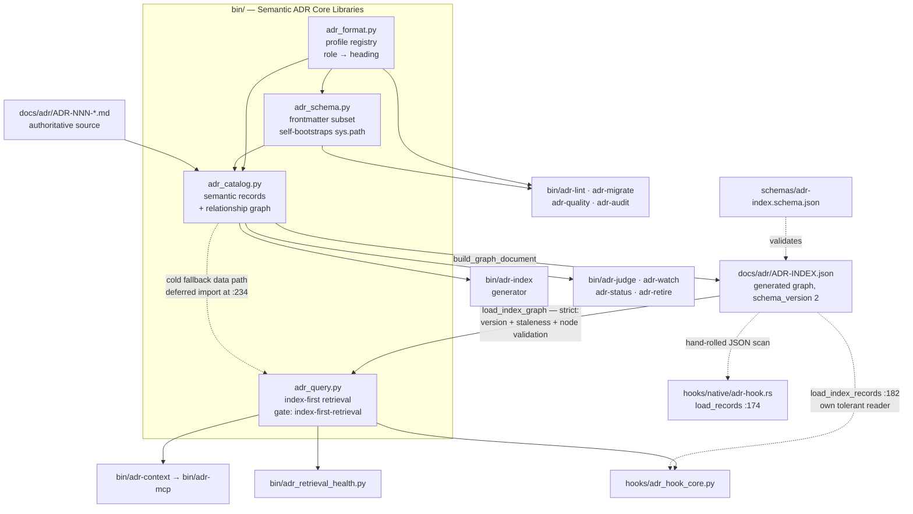

# Semantic ADR Core Libraries

## Overview

- **Name**: Semantic ADR Core Libraries (`bin-lib-semantic-core`)
- **Description**: Four importable Python modules that form the semantic
  substrate of adr-kit. `adr_format` maps human-facing Markdown headings onto
  stable semantic *roles* so three body profiles (MADR, Nygard, canonical) can
  coexist. `adr_schema` parses, renders and validates the invariant YAML-subset
  frontmatter. `adr_catalog` projects a directory of Markdown ADRs into shared
  semantic records and a node-and-edge graph document. `adr_query` is the
  index-first retrieval engine: it validates and queries the generated
  `ADR-INDEX.json` graph, and only falls back to the Markdown loader when the
  graph is missing, stale, invalid or unsupported.
- **Location**:
  [`bin/adr_format.py`](../bin/adr_format.py) (731 lines) ·
  [`bin/adr_schema.py`](../bin/adr_schema.py) (405 lines) ·
  [`bin/adr_catalog.py`](../bin/adr_catalog.py) (518 lines) ·
  [`bin/adr_query.py`](../bin/adr_query.py) (676 lines)
- **Language**: Python 3, stdlib only, `from __future__ import annotations` in
  all four modules. Byte-identical copies ship under `codex/bin/` and
  `copilot/bin/` (see Notable characteristics).
- **Purpose**: This is the single place where "what an ADR *means*" is defined.
  Every CLI in `bin/`, the Claude Code hooks, and the MCP server read ADRs
  through these modules rather than parsing Markdown themselves. That is what
  lets adr-kit accept three different body layouts without every tool growing
  its own parser, and what lets agent retrieval run off a generated JSON graph
  while Markdown stays the only authoring authority.

**Governing ADRs** (verified against [`docs/adr/ADR-INDEX.md`](../docs/adr/ADR-INDEX.md)
and the ADR bodies):

| ADR | Status | Relevance to this cluster |
|---|---|---|
| [ADR-005](../docs/adr/ADR-005-selectable-agent-friendly-adr-formats.md) | Accepted | Selectable `madr`/`nygard`/`canonical` body profiles "through one semantic format registry", MADR default. That registry is `adr_format.py`. Supersedes ADR-003. |
| [ADR-007](../docs/adr/ADR-007-json-adr-graph-index-for-agent-retrieval.md) | Accepted | Versioned JSON node-and-edge graph generated "from one shared, format-aware semantic record loader". That loader is `adr_catalog.py`; ADR-007 References cites `bin/adr_format.py` directly. |
| [ADR-014](../docs/adr/ADR-014-use-the-generated-adr-graph-as-the-selective-context-query-engine.md) | Accepted, `binding: true`, `gate: "index-first-retrieval"` | The graph becomes the runtime query engine. Its `verified_in` names `bin/adr_query.py:INDEX_FIRST_RETRIEVAL_GATE` — the literal anchor at [`adr_query.py:16`](../bin/adr_query.py). Adds schema v2 retrieval metadata, the authority model and the fail-open fallback posture. |

[ADR-004](../docs/adr/ADR-004-layered-adr-context-injection.md) (layered context
injection) is architecturally adjacent — it defines the task tier that consumes
this cluster — but its Decision constrains `bin/adr-context` and the injection
tiers, not these four modules, so it is not listed as governing. Note that
ADR-004 describes the task tier as "five weighted signals"; `adr_query`
now weights eight fields (see `FIELD_WEIGHTS` below), a post-ADR-014 change.

---

## Code Elements

Private helpers (names beginning with `_`) and module-level compiled regexes are
**summarized in aggregate** at the end of each module's subsection rather than
enumerated one by one. Every public name is listed. All signatures are copied
verbatim from source.

### `bin/adr_format.py` — the semantic format registry

Maps headings to semantic roles so engines consume roles, never literal heading
names (ADR-005 point 1). Contains no file writes at all — `migration_notice`
returns data-only advice so lint, install, upgrade and `adr-migrate` can render
identical guidance ([`adr_format.py:461-466`](../bin/adr_format.py)).

**Module contract constants**

| Name | Value / shape | Line |
|---|---|---|
| `DEFAULT_PROFILE` | `"madr"` | [`adr_format.py:16`](../bin/adr_format.py) |
| `SUPPORTED_PROFILES` | `("madr", "nygard", "canonical")` | [`adr_format.py:17`](../bin/adr_format.py) |
| `DETECTED_PROFILES` | `SUPPORTED_PROFILES + ("hybrid", "unknown")` | [`adr_format.py:18`](../bin/adr_format.py) |
| `LEGACY_PROFILES` | `("y-statement", "tyree-akerman", "arc42")` — recognized migration inputs, not storage profiles | [`adr_format.py:19`](../bin/adr_format.py) |
| `PROFILE_CATALOG` | per-profile `label`, `preferred`, `template`, `best_for`, `trade_off` | [`adr_format.py:21`](../bin/adr_format.py) |
| `PROFILE_HEADINGS` | profile → role → heading text, 13 roles per profile | [`adr_format.py:60`](../bin/adr_format.py) |
| `REQUIRED_ROLES` | `status, context, decision, alternatives, consequences, related, references` | [`adr_format.py:108`](../bin/adr_format.py) |
| `PROFILE_REQUIRED_ROLES` | MADR additionally requires `drivers` | [`adr_format.py:118`](../bin/adr_format.py) |

**Exception**: `class AdrFormatError(ValueError)` — [`adr_format.py:155`](../bin/adr_format.py)

**Public functions**

| Signature | Description | Line |
|---|---|---|
| `profile_template_path(profile: object, template_dir: Path) -> Path` | Resolve one approved profile to its shipped template or fail closed. | [`adr_format.py:179`](../bin/adr_format.py) |
| `profile_catalog(template_dir: Path) -> List[Dict[str, object]]` | Ordered agent-readable catalog with installed `available` flags. | [`adr_format.py:193`](../bin/adr_format.py) |
| `normalize_profile(value: object, *, default: Optional[str] = None) -> str` | Lower-case, alias `adr-kit`→`canonical`, reject unsupported. | [`adr_format.py:214`](../bin/adr_format.py) |
| `configured_profile(config: Dict, *, default: str = DEFAULT_PROFILE) -> str` | Read `config.template.profile` as the creation default. | [`adr_format.py:232`](../bin/adr_format.py) |
| `declared_profile(text: str) -> Optional[str]` | Read the frontmatter `format:` discriminator, if present. | [`adr_format.py:249`](../bin/adr_format.py) |
| `h2_headings(text: str) -> List[str]` | Ordered `##` headings, fence-aware. | [`adr_format.py:275`](../bin/adr_format.py) |
| `unresolved_open_questions(text: str) -> List[str]` | Stable unresolved items from the optional Open Questions role. | [`adr_format.py:284`](../bin/adr_format.py) |
| `detect_profile(text: str) -> str` | Declared profile wins; else deterministic heading detection returning a supported profile, `hybrid`, or `unknown`. Decorated `@lru_cache(maxsize=256)`. | [`adr_format.py:320`](../bin/adr_format.py) (decorator at `:319`) |
| `detect_legacy_profile(text: str) -> Optional[str]` | Conservative markers for Y-Statement / Tyree-Akerman / arc42. Only consulted when `detect_profile` says `unknown`. | [`adr_format.py:356`](../bin/adr_format.py) |
| `classify_format(text: str) -> str` | Supported, legacy, `hybrid` or `unknown` classification. | [`adr_format.py:413`](../bin/adr_format.py) |
| `is_canonical_filename(path: Path) -> bool` | Match `ADR-NNN-kebab-case.md`. | [`adr_format.py:421`](../bin/adr_format.py) |
| `suggested_filename(path: Path, text: str) -> Optional[str]` | Suggest an adr-kit filename when a legacy number can be inferred. | [`adr_format.py:430`](../bin/adr_format.py) |
| `is_migration_candidate(path: Path, text: str) -> bool` | Whether a Markdown file belongs in format discovery. Skips `README.md` / `ADR-INDEX.md`. | [`adr_format.py:577`](../bin/adr_format.py) |
| `heading(profile: str, role: str) -> str` | Role → heading text for one profile. | [`adr_format.py:586`](../bin/adr_format.py) |
| `required_heading_names(profile: str) -> List[str]` | Required heading names for a profile. | [`adr_format.py:594`](../bin/adr_format.py) |
| `required_headings(profile: str) -> List[str]` | Same, prefixed with `## `. | [`adr_format.py:599`](../bin/adr_format.py) |
| `profile_for_text(text: str, *, fallback: Optional[str] = None) -> str` | Resolve a document's profile or raise with remediation advice. | [`adr_format.py:603`](../bin/adr_format.py) |
| `section_text(text: str, role: str, *, profile: Optional[str] = None, tolerant: bool = True) -> str` | **The workhorse.** Extract one semantic section by role; `tolerant=True` tries every profile's heading name. | [`adr_format.py:616`](../bin/adr_format.py) |
| `replace_role_heading(text: str, role: str, source: str, target: str) -> str` | Rename one role heading between profiles. | [`adr_format.py:649`](../bin/adr_format.py) |
| `has_role_heading(text: str, profile: str, role: str) -> bool` | Case-insensitive presence check. | [`adr_format.py:663`](../bin/adr_format.py) |
| `set_frontmatter_profile(text: str, profile: str) -> str` | Insert or rewrite `format: "<profile>"`; requires existing frontmatter. | [`adr_format.py:683`](../bin/adr_format.py) |

Longer signatures:

```python
def migration_notice(
    text: str,
    path: Path,
    *,
    metadata_changed: bool = False,
    metadata_issues: Optional[List[str]] = None,
    migrate_command: str = "bin/adr-migrate",
) -> Optional[Dict]:                                  # adr_format.py:453
```
Returns `None` when nothing needs migrating, else a dict with `action`
(`deterministic-preview` | `guided-migration`), `deterministic`, `message`,
`preview_command`, `apply_command`, `guided_command`, `detected_format`,
`supported`, `missing_sections`, `rename_to`, and a hard-coded
`"writes_automatically": False`.

```python
def convert_profile(
    text: str,
    target: str,
    *,
    source: Optional[str] = None,
) -> Tuple[str, str]:                                 # adr_format.py:696
```
Content-preserving profile conversion. Renames the five body roles, appends
placeholder blocks for any role the target requires but the source lacks
(`_append_missing_role`), then stamps the frontmatter discriminator. Returns
`(converted_text, source_profile)`. Raises `AdrFormatError` if
`--from-profile` conflicts with a declared format, or if the source is missing
`context`/`decision`/`consequences`.

**Private helpers** (aggregate): `_validate_profile_catalog_contract` (`:159`,
a self-check that raises if `PROFILE_CATALOG` drifts from `SUPPORTED_PROFILES`
or marks a non-default profile preferred), `_leading_frontmatter` (`:239`),
`_lines_outside_fences` (`:258`, the fence tracker every heading scan relies
on), `_slugify` (`:425`), `_append_missing_role` (`:668`), plus 8 module-level
compiled regexes at `:124-152`.

### `bin/adr_schema.py` — invariant frontmatter schema

The module docstring states the scope precisely: "stdlib-only and
YAML-subset-only… scalar fields plus string lists"
([`adr_schema.py:1-6`](../bin/adr_schema.py)). It renders and re-reads its own
dialect; it is not a general YAML parser.

**Contract constants**

| Name | Value | Line |
|---|---|---|
| `FRONTMATTER_FIELD_ORDER` | `id, title, status, date, binding, gate, documents_shipped, verified_in, supersedes, superseded_by` — always emitted | [`adr_schema.py:23`](../bin/adr_schema.py) |
| `OPTIONAL_FRONTMATTER_FIELD_ORDER` | `topics, aliases, components, symbols, context_scope, format` — emitted only if present (the ADR-014 retrieval metadata plus the ADR-005 discriminator) | [`adr_schema.py:36`](../bin/adr_schema.py) |
| `VALID_STATUSES` | `{Proposed, Accepted, Deprecated, Superseded, Amended, Rejected}` | [`adr_schema.py:45`](../bin/adr_schema.py) |
| `VALID_CONTEXT_SCOPES` | `{global, selective}` | [`adr_schema.py:46`](../bin/adr_schema.py) |

**Exception**: `class FrontmatterError(Exception)` — [`adr_schema.py:67`](../bin/adr_schema.py)

**Public functions**

| Signature | Description | Line |
|---|---|---|
| `split_frontmatter(text: str) -> Tuple[Optional[str], str]` | Split into raw frontmatter and body; returns `(None, text)` unchanged when absent. | [`adr_schema.py:78`](../bin/adr_schema.py) |
| `parse_frontmatter(raw: Optional[str]) -> Dict` | Parse the YAML subset rendered by `render_frontmatter`. Raises `FrontmatterError` on unsupported syntax. | [`adr_schema.py:115`](../bin/adr_schema.py) |
| `infer_frontmatter(body: str, path: Optional[Path] = None) -> Dict` | Infer canonical metadata from legacy prose (filename, H1, `## Status` line, `Supersedes`/`Superseded by` tokens) without editing the body. | [`adr_schema.py:145`](../bin/adr_schema.py) |
| `render_frontmatter(data: Dict) -> str` | Render with stable field order: required, then optional-if-present, then any remaining keys sorted alphabetically. | [`adr_schema.py:222`](../bin/adr_schema.py) |
| `canonicalize_frontmatter(existing: Dict, inferred: Dict) -> Dict` | Complete existing metadata with inferred required fields; case-normalize `status`. | [`adr_schema.py:265`](../bin/adr_schema.py) |
| `validate_frontmatter(data: Dict) -> List[str]` | Return human-readable issues; empty list means valid. Validates ids against `ADR-\d{3,4}`, ISO dates via `date.fromisoformat`, booleans, ADR-reference lists, `format` against `SUPPORTED_PROFILES`, retrieval lists (≤32 entries, ≤120 chars, case-insensitively unique) and `context_scope`. | [`adr_schema.py:305`](../bin/adr_schema.py) |
| `migrate_text(text: str, path: Optional[Path] = None) -> Tuple[str, bool, List[str]]` | Add canonical metadata and normalize an identifiable legacy H1. Returns `(new_text, changed, issues)`; returns the input unchanged when issues exist. | [`adr_schema.py:390`](../bin/adr_schema.py) |

**Private helpers** (aggregate): `_normalize_adr_id` (`:71`), `_parse_scalar`
(`:93`, the scalar dialect — `null`/`true`/`false`/`[]`, JSON double-quoted
strings, single-quoted with `''` escaping, else bare), `_render_scalar`
(`:212`), `_normalize_legacy_heading` (`:281`, rewrites only the H1 and never
decision prose). Plus 9 compiled regexes at `:48-64`.

`adr_schema.py` is the only module in this cluster that **bootstraps its own
`sys.path`** ([`adr_schema.py:17-19`](../bin/adr_schema.py)) before importing
`adr_format`.

### `bin/adr_catalog.py` — semantic records, catalog and relationship graph

The docstring is explicit about authority: "Markdown ADR files remain
authoritative. This module projects their invariant frontmatter and
format-aware semantic sections into records"
([`adr_catalog.py:1-6`](../bin/adr_catalog.py)) — ADR-007 point 1.

**Contract constants**

| Name | Value | Line |
|---|---|---|
| `GRAPH_SCHEMA_VERSION` | `2` | [`adr_catalog.py:29`](../bin/adr_catalog.py) |
| `GRAPH_SCHEMA_REF` | `"../../schemas/adr-index.schema.json"` | [`adr_catalog.py:30`](../bin/adr_catalog.py) |
| `DECISION_SUMMARY_MAX` | `120` (ADR-007 point 5) | [`adr_catalog.py:31`](../bin/adr_catalog.py) |
| `RETRIEVAL_VALUE_MAX` / `RETRIEVAL_VALUE_LIMIT` | `120` chars / `32` entries | [`adr_catalog.py:32-33`](../bin/adr_catalog.py) |
| `CONTRACT_ITEM_MAX` / `CONTRACT_ITEM_LIMIT` | `240` chars / `20` items | [`adr_catalog.py:34-35`](../bin/adr_catalog.py) |
| `ENFORCEMENT_BLOCK_RE` | the `## Enforcement` fenced-JSON extractor, re-exported by `adr-judge`, `adr-status` and `adr-generate-scripts` | [`adr_catalog.py:40`](../bin/adr_catalog.py) |

**Public functions**

| Signature | Description | Line |
|---|---|---|
| `adr_status(text: str) -> Optional[str]` | The single cross-tool status reader for gates and listings. `## Status` body wins, then bold-inline `**Status:** X`, then a plain `Status: X` line — a deliberate superset of the older per-tool regexes so `adr-judge`, `adr-lint`, `adr-retire`, `adr-status` and `adr-watch` cannot disagree. | [`adr_catalog.py:63`](../bin/adr_catalog.py) |
| `normalize_adr_id(raw: object) -> Optional[str]` | Normalize any `ADR-N` token *anywhere* in text to `ADR-NNN`. | [`adr_catalog.py:85`](../bin/adr_catalog.py) |
| `adr_id_from_filename(name: str) -> Optional[str]` | Same, but anchored at the filename start. | [`adr_catalog.py:92`](../bin/adr_catalog.py) |
| `discover_adr_files(adr_dir: Path) -> List[Path]` | Sorted `ADR-*.md` files matching the canonical filename pattern. | [`adr_catalog.py:104`](../bin/adr_catalog.py) |
| `enforcement_globs(text: str) -> List[str]` | De-duplicated `path_glob` scope from the Enforcement block; a rule without a glob contributes `"**"`. Returns `[]` on malformed JSON. | [`adr_catalog.py:117`](../bin/adr_catalog.py) |
| `decision_summary(text: str, *, decision: Optional[str] = None) -> str` | First meaningful decision paragraph, markdown-stripped, first-sentence-clipped, hard-bounded to 120 chars with an ellipsis. | [`adr_catalog.py:150`](../bin/adr_catalog.py) |
| `decision_contract(text: str) -> Dict[str, List[str]]` | Project the optional `## Decision Contract` into `must` / `must_not` / `exceptions` / `verification` lists. `Confirmation` maps onto `verification`. | [`adr_catalog.py:258`](../bin/adr_catalog.py) |
| `load_adr_record(path: Path) -> Dict` | **The central projection.** Loads one ADR into the shared 27-key semantic record. See below. | [`adr_catalog.py:327`](../bin/adr_catalog.py) |
| `load_adr_records(adr_dir: Path) -> List[Dict]` | All records, sorted by `(num, adr_id)`. | [`adr_catalog.py:437`](../bin/adr_catalog.py) |
| `build_relationships(records: Iterable[Dict]) -> List[Dict]` | Sorted, de-duplicated directed edges of type `related`, `supersedes`, `superseded-by`, `amended-by`, each carrying a `resolved` boolean (ADR-007 point 4). | [`adr_catalog.py:443`](../bin/adr_catalog.py) |
| `public_adr_node(record: Dict) -> Dict` | Strip the internal record down to the published graph node shape. | [`adr_catalog.py:480`](../bin/adr_catalog.py) |
| `build_graph_document(records: Iterable[Dict], *, schema_ref: str = GRAPH_SCHEMA_REF) -> Dict` | Assemble `{$schema, schema_version, adrs, relationships}` — no timestamp, by design (ADR-007 point 2). | [`adr_catalog.py:507`](../bin/adr_catalog.py) |

`load_adr_record` is a **tolerant** reader: malformed frontmatter is recorded as
a `FRONTMATTER_MALFORMED` finding and discovery continues from invariant prose
rather than failing ([`adr_catalog.py:334-343`](../bin/adr_catalog.py)). Its
returned keys are `num, adr_id, title, path, format, status, date, decision,
decision_text, decision_contract, scope, topics, aliases, components, symbols,
context_scope, binding, gate, documents_shipped, verified_in, supersedes,
superseded_by, related_ids, amended_by, open_questions, metadata_findings,
_source_path`. `metadata_findings` codes emitted here:
`FRONTMATTER_MALFORMED`, `STATUS_UNKNOWN`, `FORMAT_UNKNOWN`,
`RETRIEVAL_METADATA_INVALID`.

**Private helpers** (aggregate): `_plain_markdown` (`:142`), `_status_history`
(`:179`, parses the deliberately small `status_history` YAML subset), `_ids`
(`:201`), `_strings` (`:209`), `_retrieval_strings` (`:216`, bounds-checks the
ADR-014 retrieval lists and appends findings), `_related_ids` (`:317`). Plus
8 compiled regexes at `:37-60`.

### `bin/adr_query.py` — index-first retrieval engine

Docstring: "`index-first-retrieval` is the named verification gate for ADR-014.
Markdown ADRs remain authoritative; this module queries their generated graph
projection and uses the semantic Markdown loader only as a visible fallback"
([`adr_query.py:1-6`](../bin/adr_query.py)).

**Contract constants**

| Name | Value | Line |
|---|---|---|
| `INDEX_FIRST_RETRIEVAL_GATE` | `"index-first-retrieval"` — the literal verification anchor ADR-014 requires in shipped source | [`adr_query.py:16`](../bin/adr_query.py) |
| `SUPPORTED_SCHEMA_VERSIONS` | `{1, 2}` | [`adr_query.py:17`](../bin/adr_query.py) |
| `SUPPORTED_STATUSES` | the 6 lifecycle statuses **plus `Unknown`** | [`adr_query.py:18`](../bin/adr_query.py) |
| `SUPPORTED_AUTHORITIES` | `{governing, advisory, historical}` | [`adr_query.py:27`](../bin/adr_query.py) |
| `HISTORICAL_STATUSES` | `{Superseded, Rejected, Deprecated, Amended, Unknown}` — excluded unless `include_history` | [`adr_query.py:28`](../bin/adr_query.py) |
| `FIELD_WEIGHTS` | `path 1.0, symbols 0.95, components 0.90, topics 0.75, aliases 0.70, title 0.60, decision_contract 0.50, decision_summary 0.40` | [`adr_query.py:35`](../bin/adr_query.py) |
| `MAX_SUPPORTING_RESULTS` | `2` — ADR-014's "at most two one-hop supporting ADRs" | [`adr_query.py:45`](../bin/adr_query.py) |

**Exception**: `class IndexQueryError(RuntimeError)` — [`adr_query.py:48`](../bin/adr_query.py)

**Public functions**

| Signature | Description | Line |
|---|---|---|
| `extract_keywords(value: str) -> List[str]` | Sorted unique tokens of length ≥ 3, split on everything outside `[a-z0-9_.:/-]`. | [`adr_query.py:52`](../bin/adr_query.py) |
| `load_index_graph(adr_dir: Path) -> Tuple[List[Dict], List[Dict], int]` | **Strict** reader of `<adr_dir>/ADR-INDEX.json`. Raises `IndexQueryError` on missing, stale, unparseable, non-object, unsupported-version, structurally invalid or duplicate-id graphs. Returns `(records, edges, schema_version)`. | [`adr_query.py:201`](../bin/adr_query.py) |

```python
def score_record(
    record: Dict,
    query: str,
    *,
    paths: Sequence[str] = (),
    symbols: Sequence[str] = (),
    components: Sequence[str] = (),
    topics: Sequence[str] = (),
    _query_keywords: Optional[Sequence[str]] = None,
    _normalized_query_value: Optional[str] = None,
) -> Dict:                                            # adr_query.py:305
```
Scores one graph node "from positive field evidence only" — no negative
signals, no recency, no relationship count. Returns
`{"total": float, "signals": {field: weight}, "matches": [{"field", "values"}]}`
with `total` capped at 1.0. Explicit filter hits score full coverage; lexical
hits score `matched_tokens / len(query_keywords)`. The two underscore-prefixed
parameters are caller-visible memoization hooks that `query_records` uses to
hoist keyword extraction out of the per-record loop. An early `break` at
[`adr_query.py:360-367`](../bin/adr_query.py) stops field evaluation once the
score saturates, but only when no explicit filters were supplied.

```python
def query_records(
    records: Sequence[Dict],
    relationships: Sequence[Dict],
    query: str,
    adr_dir: Path,
    *,
    limit: int = 5,
    min_score: float = 0.1,
    include_history: bool = False,
    statuses: Sequence[str] = (),
    authorities: Sequence[str] = (),
    paths: Sequence[str] = (),
    symbols: Sequence[str] = (),
    components: Sequence[str] = (),
    topics: Sequence[str] = (),
    source: str = "index-v2",
    schema_version: int = 2,
) -> List[Dict]:                                      # adr_query.py:456
```
Rank, filter and expand. Implements ADR-014's authority model: a `Superseded`
match is not returned but **redirects** its score to a live successor with a
`successor_redirect` match marker and a `redirected_from` field
([`adr_query.py:505-524`](../bin/adr_query.py)); other historical statuses are
dropped. Ordering is `(-total, ADR-number, ADR-id)` — ADR id is the stable final
tie-breaker. Then up to `MAX_SUPPORTING_RESULTS` one-hop `related` ADRs are
appended with `role="supporting"` and `score=0.0`.

```python
def query_adr_context(
    query: str,
    adr_dir: Path,
    *,
    limit: int = 5,
    min_score: float = 0.1,
    strict_index: bool = False,
    include_history: bool = False,
    statuses: Sequence[str] = (),
    authorities: Sequence[str] = (),
    paths: Sequence[str] = (),
    symbols: Sequence[str] = (),
    components: Sequence[str] = (),
    topics: Sequence[str] = (),
) -> Dict:                                            # adr_query.py:593
```
The cluster's primary public entry point. Validates every argument up front
(raising `ValueError`), then tries `load_index_graph`. On `IndexQueryError`:
re-raise if `strict_index`, otherwise emit an `[adr-context] WARN: …; using
Markdown compatibility fallback` string into `warnings` and rebuild the graph
from Markdown. Returns
`{"results": [...], "warnings": [...], "source": str, "engine": str, "schema_version": int}`
where `source` is `index-v1` / `index-v2` / `markdown-fallback` and `engine` is
`index-first` / `markdown-fallback`.

**Private helpers** (aggregate): `_normalized_text` (`:62`), `_string_list`
(`:66`), `_empty_contract` (`:72`), `_normalize_contract` (`:81`),
`_validate_node` (`:90`, the schema-v2 node validator), `_validate_relationship`
(`:171`), `_index_path` (`:184`), `_is_stale` (`:188`, `st_mtime_ns` comparison
against every `ADR-*.md`), `_markdown_graph` (`:231`, the deferred fallback),
`_contract_values` (`:243`), `_explicit_matches` (`:254`), `_lexical_matches`
(`:266`), `_path_matches` (`:294`, `fnmatch.fnmatchcase` with `\`→`/`
normalization and case-folding), `_authority` (`:373`), `_adr_sort_key`
(`:381`), `_related_ids` (`:386`), `_successor_id` (`:398`), `_public_result`
(`:412`, builds the 25-key result dict).

---

## Dependencies

### Internal

| From | Imports | Line |
|---|---|---|
| `adr_schema` | `adr_format.SUPPORTED_PROFILES` | [`adr_schema.py:21`](../bin/adr_schema.py) |
| `adr_catalog` | `adr_format`: `SUPPORTED_PROFILES, detect_profile, section_text, unresolved_open_questions` | [`adr_catalog.py:15`](../bin/adr_catalog.py) |
| `adr_catalog` | `adr_schema`: `FrontmatterError, infer_frontmatter, parse_frontmatter, split_frontmatter` | [`adr_catalog.py:21`](../bin/adr_catalog.py) |
| `adr_query` | `adr_catalog`: `build_relationships, load_adr_records, public_adr_node` — **function-local, deferred** | [`adr_query.py:234`](../bin/adr_query.py) |

`adr_format` has zero internal dependencies — it is the root of the cluster.
`adr_query`'s only internal dependency is deferred by design; the comment at
[`adr_query.py:232-233`](../bin/adr_query.py) states the reason: "Keep the
semantic Markdown stack off the healthy index hot path. Its format/frontmatter
imports are paid only for an explicit fallback."

**Consumers inside the repo** (verified by grep over `bin/`, `hooks/`, `tests/`):

- `adr_format` → `bin/adr` `:21`, `bin/adr-audit` `:41`, `bin/adr-judge` `:58`, `bin/adr-lint` `:62`, `bin/adr-migrate` `:30`, `bin/adr-quality` `:29`, `bin/adr-retire` `:32`, `bin/adr-suggest` `:49`, `bin/adr-watch` `:61`
- `adr_schema` → `bin/adr` `:31`, `bin/adr_doctor_core.py` `:15`, `bin/adr-lint` `:44`, `bin/adr-migrate` `:38`
- `adr_catalog` → `bin/adr_readiness.py` `:11`, `bin/adr-context` `:294`, `bin/adr-generate-scripts` `:32`, `bin/adr-index` `:38`, `bin/adr-judge` `:57`, `bin/adr-lint` `:55`, `bin/adr-migrate` `:39`, `bin/adr-related` `:38`, `bin/adr-retire` `:30-31`, `bin/adr-status` `:28-29`, `bin/adr-suggest` `:48`, `bin/adr-watch` `:59-60`
- `adr_query` → `bin/adr-context` `:30`, `bin/adr_retrieval_health.py` `:10`, `hooks/adr_hook_core.py` `:19`
- Tests: `tests/test_adr_query.py`, `tests/test_selectable_formats.py`,
  `tests/test_migration_discovery.py`, `tests/test_adr_open_questions.py`,
  `tests/test_adr_retrieval_health.py`, `tests/test_adr_readiness.py`, and
  five tests that load `adr_schema` via `importlib.util.spec_from_file_location`.

### External

**Zero third-party imports across all four files** — verified by enumerating
every `import` statement. The dependency-free design of the project holds here.
Standard library only:

| Module | Used by |
|---|---|
| `re` | all four |
| `json` | `adr_schema`, `adr_catalog`, `adr_query` |
| `pathlib.Path` | all four |
| `typing` | all four |
| `functools.lru_cache` | `adr_format` |
| `datetime.date` | `adr_schema` (ISO date validation) |
| `sys` | `adr_schema` (`sys.path` bootstrap only) |
| `fnmatch` | `adr_query` (`fnmatchcase` for path-glob matching) |

No external CLIs are invoked (no `subprocess`, no `os.system`, no shelling out
to `git`, `gh` or `claude`). No network access. No environment-variable reads.
OS services used: filesystem reads (`Path.read_text`, `Path.glob`,
`Path.is_file`, `Path.stat`) — read-only; none of the four modules writes a
file.

Build artefacts: compiled bytecode exists at `bin/__pycache__/` for CPython
3.10, 3.12 and 3.14 (`adr_format`, `adr_schema`, `adr_catalog` for all three;
`adr_query` only for 3.12), evidence that the cluster is exercised across three
interpreter versions.

---

## Interfaces

**There is no CLI surface here.** None of the four modules defines `main()`,
uses `argparse`, or has an `if __name__ == "__main__"` block — verified by grep.
They are pure libraries. Consequently **there are no exit-code conventions in
this cluster**: the modules raise, and the calling `bin/adr-*` script maps
exceptions to exit status.

### 1. Sibling-module imports

The primary interface. Callers put `bin/` on `sys.path` and import by bare
module name. Only `adr_schema` bootstraps its own path
([`adr_schema.py:17-19`](../bin/adr_schema.py)); `adr_catalog` and `adr_query`
rely on the caller having done it (as `hooks/adr_hook_core.py:14-16` does).

Most-used entry points:
`section_text`, `detect_profile`, `required_headings` (format);
`split_frontmatter`, `parse_frontmatter`, `render_frontmatter`,
`validate_frontmatter`, `migrate_text` (schema);
`load_adr_record(s)`, `adr_status`, `enforcement_globs`,
`build_graph_document`, `ENFORCEMENT_BLOCK_RE` (catalog);
`query_adr_context`, `load_index_graph`, `query_records`, `IndexQueryError`
(query).

### 2. The `ADR-INDEX.json` document contract

The cluster's only persistent data contract, and the seam between its two
halves.

- **Produced by** `adr_catalog.build_graph_document`
  ([`adr_catalog.py:507`](../bin/adr_catalog.py)) from
  `public_adr_node` + `build_relationships`. Written by `bin/adr-index`.
- **Validated and consumed by** `adr_query.load_index_graph`
  ([`adr_query.py:201`](../bin/adr_query.py)).
- **Formal schema**: [`schemas/adr-index.schema.json`](../schemas/adr-index.schema.json)
  (ADR-007 point 9).
- Shape: `{"$schema", "schema_version": 2, "adrs": [...], "relationships": [...]}`.
  Node keys: `id, title, path, format, status, date, decision_summary, topics,
  aliases, components, symbols, context_scope, decision_contract, scope, metadata`.
  Edge keys: `source, target, type, resolved` with
  `type ∈ {related, supersedes, superseded-by, amended-by}`.
- Freshness is part of the contract: `load_index_graph` refuses a graph older
  than any `ADR-*.md` in the directory.

### 3. The frontmatter round-trip contract

`render_frontmatter` ([`adr_schema.py:222`](../bin/adr_schema.py)) ↔
`parse_frontmatter` ([`adr_schema.py:115`](../bin/adr_schema.py)). The module
docstring scopes this itself: "adr-kit frontmatter is rendered in a simple
shape that this parser can round-trip: scalar fields plus string lists"
([`adr_schema.py:3-5`](../bin/adr_schema.py)). Formal schema:
[`schemas/adr-frontmatter.schema.json`](../schemas/adr-frontmatter.schema.json).

### 4. The `query_adr_context` result contract

Returned dict: `results`, `warnings`, `source`, `engine`, `schema_version`.
Each result carries `adr_id, title, path, status, is_accepted, authority, role,
format, decision_summary, scope, related_ids, metadata, topics, aliases,
components, symbols, context_scope, decision_contract, score, signals, matches,
source, engine, schema_version, redirected_from`. `bin/adr-context` serializes
this to JSON for CLI callers, and `bin/adr-mcp` re-exposes it as the MCP
`adr_context` tool, so this dict shape is the de-facto RPC payload.

### 5. Failure channel

| Exception | Raised by | Meaning |
|---|---|---|
| `AdrFormatError(ValueError)` | `adr_format` | Unsupported profile, undetectable body format, missing semantic section, catalog drift |
| `FrontmatterError(Exception)` | `adr_schema` | Frontmatter outside the supported YAML subset |
| `IndexQueryError(RuntimeError)` | `adr_query` | Generated graph missing / stale / invalid / unsupported version / duplicate ids |
| `ValueError` | `adr_query.query_adr_context` | Argument validation (query, limit, min_score, filters) |

`adr_catalog` raises nothing of its own by design — it degrades into
`metadata_findings` entries so index and retrieval stay available on damaged
input. Whether a caller sees an exception or a warning is a deliberate policy
split: `strict_index=True` and CI fail loudly; hooks and interactive context
fail open (ADR-014).

---

## Relationships

**Arrow convention: every arrow points from provider to consumer** — `A --> B`
means "A provides to B". Dashed arrows are conditional or fallback paths.



Reading the diagram: the solid spine `Markdown → adr_catalog → ADR-INDEX.json →
adr_query` is the intended runtime flow under ADR-007 and ADR-014, and the
leaf nodes on the right are the consumers each module serves. The dashed edge
`adr_catalog ⇢ adr_query` is the compatibility fallback — a data path that
exists only because of the deferred import at `adr_query.py:234`, and it is
meant to stay cold. The two dashed edges into the hook nodes are the *other*
two readers of the same JSON contract — see Notable characteristics item 1.

---

## Notable characteristics

1. **Three independent readers of `ADR-INDEX.json`, with three different
   strictness levels.** `adr_query.load_index_graph`
   ([`adr_query.py:201`](../bin/adr_query.py)) validates schema version,
   staleness, node structure and duplicate ids, and raises. But
   `hooks/adr_hook_core.py:182` has its own `load_index_records` that reads the
   same file, caps it at 2 MiB, and returns `[]` on any problem — no version
   check, no staleness check. And `hooks/native/adr-hook.rs:174` has a third
   reader in Rust with a **hand-rolled JSON scanner** (`array_section`,
   `top_level_objects`, `json_string`, `string_array`) — no serde. The hook
   paths' fail-open posture is what ADR-014 asks for ("Hooks keep that fallback
   bounded and fail open"), but the practical consequence is that a stale or
   schema-v1 graph is rejected by the CLI and silently accepted by both hook
   readers.

2. **The cluster is triplicated by copy.** `codex/bin/` and `copilot/bin/` each
   hold all four modules. All twelve files are byte-identical to `bin/` right
   now (MD5-verified at time of writing), so the shipped payloads are in sync —
   but this is a copy-synchronization surface, not a shared import, and nothing
   in the modules themselves enforces it. ADR-007 point 9 mandates the copying;
   ADR-005's Confirmation requires "generated client payloads are synchronized".

3. **Two status-resolution paths inside `adr_catalog.py`, and they can
   disagree.** `adr_status()` ([`adr_catalog.py:63`](../bin/adr_catalog.py)) is
   documented as the single cross-tool reader "used by adr-index, adr-judge,
   adr-lint, adr-retire, and adr-watch" — but `load_adr_record` never calls it.
   It takes the last `_status_history` entry first, then frontmatter
   ([`adr_catalog.py:348-350`](../bin/adr_catalog.py)). The docstring says this
   is deliberate ("Authoritative lifecycle status still comes from the
   status_history chain… this is the lightweight reader used by gates and
   listings"), so it is a designed split rather than a bug — but gates and
   index/retrieval will report different statuses for an ADR whose `## Status`
   line and `status_history` chain have diverged.

4. **Three overlapping status vocabularies.** `adr_schema.VALID_STATUSES`
   ([`adr_schema.py:45`](../bin/adr_schema.py)) has 6 entries; `load_adr_record`
   re-declares the same 6 as an inline literal set rather than importing it
   ([`adr_catalog.py:352`](../bin/adr_catalog.py)); `adr_query.SUPPORTED_STATUSES`
   ([`adr_query.py:18`](../bin/adr_query.py)) has 7 because it adds `Unknown`
   as a queryable status. Any lifecycle change has to be applied in three
   places.

5. **The formal schema is stricter than the reader.**
   `schemas/adr-index.schema.json` pins `"schema_version": {"const": 2}`, while
   `adr_query.SUPPORTED_SCHEMA_VERSIONS = {1, 2}`. This is ADR-014's stated
   policy — "New readers will retain schema-v1 compatibility for one
   minor-release window" — so the asymmetry is intentional and time-bounded, but
   it means a v1 graph passes retrieval and fails schema validation.

6. **`detect_profile` is `lru_cache`d on full document text.**
   [`adr_format.py:319`](../bin/adr_format.py) caches up to 256 entries keyed by
   the *entire* ADR body string. For a 1,000-ADR repository that caps at 256
   documents retained in memory for the process lifetime. Fine for short-lived
   CLI processes; worth knowing for the long-lived MCP server.

7. **Deliberate lazy import as a latency mechanism.** `adr_query` refuses to
   import `adr_catalog` at module scope
   ([`adr_query.py:231-234`](../bin/adr_query.py)) specifically to keep the
   format/frontmatter stack out of the healthy hot path. This is a cold-start
   optimization consistent with ADR-014's p95 latency thresholds (250 ms
   through 200 ADRs) and ADR-015's 2000 ms CLI ceiling. Anyone "tidying" that
   import to the top of the file would silently regress the budget.

8. **`sys.path` bootstrap asymmetry.** `adr_schema` fixes its own import path;
   `adr_format`, `adr_catalog` and `adr_query` do not. So `adr_schema` is
   importable standalone from anywhere, while the other three require the caller
   to have inserted `bin/` — which is why five test files load `adr_schema` via
   `importlib.util.spec_from_file_location` while others import normally.

9. **No Enforcement `path_glob` covers these files.** ADR-005's Enforcement
   targets `schemas/adr-kit-config.schema.json`, ADR-007's targets
   `docs/adr/ADR-INDEX.json`, and ADR-014 ships deliberately empty rule arrays
   ("Declarative diff rules are deferred until the implementation surface
   exists"). So edit-tier ADR injection never fires on `bin/adr_*.py` even
   though ADR-014 is `binding: true` with a named gate and lists
   `bin/adr_query.py:INDEX_FIRST_RETRIEVAL_GATE` in `verified_in`. The gate is
   enforced by tests, not by the pre-commit judge.

10. **ADR-014's References cite `bin/adr_catalog.py:170-338`**, which no longer
    matches today's graph-construction functions (`load_adr_record` onwards
    starts at `:327`). This is expected drift, not a defect: that References
    section explicitly documents the *pre-TASK-52 baseline* ("current
    schema-version-1 graph contract", "current Markdown-first query loop"), and
    Accepted ADRs are immutable by policy.

11. **`adr_format` never writes.** The docstring-level and code-level
    commitment that migration advice is data-only
    ([`adr_format.py:461-466`](../bin/adr_format.py), plus the hard-coded
    `"writes_automatically": False`) is what lets lint, install, upgrade and the
    migration CLI render identical guidance without four divergent
    implementations.
