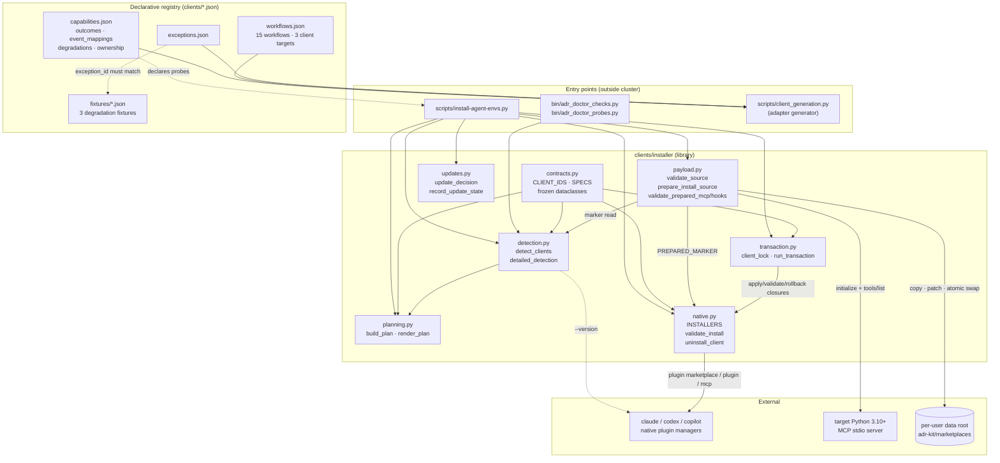

# Client Installer and Capability Registry

## Overview

- **Name**: Client Installer and Capability Registry (`clients-installer`)
- **Description**: This cluster is the seam between the adr-kit repository and the three CLI coding agents it supports (Claude Code, Codex, GitHub Copilot). It holds two distinct things that share a directory: (1) a *declarative registry* of what each client can and cannot do — [`clients/capabilities.json`](../clients/capabilities.json), [`clients/workflows.json`](../clients/workflows.json), [`clients/exceptions.json`](../clients/exceptions.json) and the degradation fixtures under [`clients/fixtures/`](../clients/fixtures) — and (2) a *desired-state installer library* under [`clients/installer/`](../clients/installer) that detects installed CLIs, prepares a platform-local marketplace payload, and drives each client's native plugin manager under a lock with rollback.
- **Location**:
  - [`clients/__init__.py`](../clients/__init__.py)
  - [`clients/capabilities.json`](../clients/capabilities.json), [`clients/workflows.json`](../clients/workflows.json), [`clients/exceptions.json`](../clients/exceptions.json)
  - [`clients/fixtures/claude-rich-workflow-source.json`](../clients/fixtures/claude-rich-workflow-source.json), [`clients/fixtures/copilot-lifecycle-event-limit.json`](../clients/fixtures/copilot-lifecycle-event-limit.json), [`clients/fixtures/copilot-pretool-context-limit.json`](../clients/fixtures/copilot-pretool-context-limit.json)
  - [`clients/installer/__init__.py`](../clients/installer/__init__.py), [`contracts.py`](../clients/installer/contracts.py), [`detection.py`](../clients/installer/detection.py), [`native.py`](../clients/installer/native.py), [`payload.py`](../clients/installer/payload.py), [`planning.py`](../clients/installer/planning.py), [`transaction.py`](../clients/installer/transaction.py), [`updates.py`](../clients/installer/updates.py)
  Binary artefacts present but not documented: `clients/__pycache__/` and `clients/installer/__pycache__/` hold compiled `.pyc` files for both CPython 3.10 and 3.12 (18 files). They are build residue, not source; `payload.py` explicitly excludes `__pycache__` and `*.pyc` from both the payload copy and the payload digest.
- **Language**: Python 3.10+ (stdlib only; `from __future__ import annotations` in every module) plus declarative JSON.
- **Purpose**: Make one adr-kit release land identically — in *outcome*, not in mechanism — on three CLI clients with genuinely different hook models, and record the differences honestly instead of pretending they do not exist. The registry is the honesty layer; the installer is the convergence layer.

**Governing ADRs** (verified against [`docs/adr/ADR-INDEX.md`](../docs/adr/ADR-INDEX.md) and the ADR bodies):

| ADR | Relationship to this cluster |
|---|---|
| [ADR-010](../docs/adr/ADR-010-certify-three-native-cli-clients-through-one-outcome-contract.md) | Directly governing. Defines the one outcome contract, the three first-class client ids, the documented-degradation rule, and the 300/400-line module budgets. Its declarative `Enforcement` `path_glob` is `schemas/client-capabilities.schema.json`, i.e. the *schema*, not `clients/capabilities.json` itself. |
| [ADR-006](../docs/adr/ADR-006-prepare-platform-local-marketplaces-for-native-installs.md) | Directly governing [`payload.py`](../clients/installer/payload.py) and [`native.py`](../clients/installer/native.py): prepare a persistent platform-local marketplace from validated source, patch only the copy, smoke-test MCP before touching a client marketplace, isolate failures per client. Enforcement block is empty (`llm_judge: false`), so this is prose-governed only. |
| [ADR-011](../docs/adr/ADR-011-adopt-deterministic-readiness-and-human-gated-grilling-across-the-adr-lifecycle.md) | Mechanically governing [`clients/workflows.json`](../clients/workflows.json): `require_pattern` `"grill"` with `path_glob: clients/workflows.json` — the grill workflow must stay in the catalog. |

---

## Code Elements

### `clients/__init__.py`

[`clients/__init__.py`](../clients/__init__.py) — a one-line docstring package marker (`clients/__init__.py:1`). No code. Its only job is to make `clients.installer` importable as `clients.installer.*` after callers push the repo root onto `sys.path`.

### `clients/installer/__init__.py`

[`clients/installer/__init__.py`](../clients/installer/__init__.py) — re-exports the contract surface only. `__all__` is `("CLIENT_IDS", "SPECS", "ClientPlan", "ClientResult", "ClientSpec", "DetectedClient", "InstallPlan")` (`clients/installer/__init__.py:13`). Note what is *absent*: no function is re-exported, so every real caller imports from the submodules directly.

### `clients/installer/contracts.py` — registry and immutable state

[`clients/installer/contracts.py`](../clients/installer/contracts.py) (117 lines). All dataclasses are `frozen=True`, so plan and detection state is immutable once built.

| Element | Signature | Description | Location |
|---|---|---|---|
| `ClientId` | `ClientId = Literal["claude", "codex", "copilot"]` | The closed set of first-class client ids. | `contracts.py:9` |
| `CLIENT_IDS` | `CLIENT_IDS: tuple[ClientId, ...] = ("claude", "codex", "copilot")` | Canonical iteration order for every plan, detection sweep and doctor check. | `contracts.py:10` |
| `ClientSpec` | `@dataclass(frozen=True)` with `id: ClientId`, `capability_id: str`, `version_marker: str`, `marketplace: str`, `manifest: str`, `native_manager: str`, `update_trigger: str` | Per-client static facts: how to recognise it, which marketplace name it registers, which manifest carries its version. | `contracts.py:14` |
| `SPECS` | `SPECS = {spec.id: spec for spec in (...)}` | The registry itself — three `ClientSpec` literals. Maps `claude` → marketplace `rvdbreemen-adr-kit` / manifest `.claude-plugin/plugin.json`; `codex` → `rvdbreemen-adr-kit-codex` / `codex/.codex-plugin/plugin.json`; `copilot` → `rvdbreemen-adr-kit-copilot` / `copilot/plugin.json`. | `contracts.py:24` |
| `DetectedClient` | `@dataclass(frozen=True)` with `id: ClientId`, `executable: str`, `version: str`, `config_override: str \| None`, `native_manager_available: bool`, `installed_version: str \| None`, `source: str \| None`, `source_sha256: str \| None`, `legacy_footprints: tuple[str, ...]`, `disabled: bool`, `trusted: bool \| None`, `duplicate_roots: tuple[str, ...]` | Enriched read-only observation of one installed CLI. | `contracts.py:59` |
| `DetectedClient.as_dict` | `as_dict(self) -> dict` | `dataclasses.asdict` passthrough for JSON output. | `contracts.py:73` |
| `ClientPlan` | `@dataclass(frozen=True)` with `id: ClientId`, `selected: bool`, `current_state: str`, `desired_state: str`, `reason: str`, `migrations: tuple[str, ...]`, `backups: tuple[str, ...]`, `activation: tuple[str, ...]`, `validation: tuple[str, ...]`, `rollback: tuple[str, ...]`, `removals: tuple[str, ...]`, `update_trigger: str` | One client's row in the desired-state plan, including what would be backed up and how it would roll back. | `contracts.py:78` |
| `ClientPlan.as_dict` | `as_dict(self) -> dict` | JSON projection. | `contracts.py:92` |
| `InstallPlan` | `@dataclass(frozen=True)` with `schema_version: int`, `adr_kit: dict[str, Any]`, `settings: dict[str, Any]`, `clients: tuple[ClientPlan, ...]`, `requires_confirmation: bool` | The whole plan document; `schema_version` is always written as `1`. | `contracts.py:97` |
| `InstallPlan.as_dict` | `as_dict(self) -> dict` | JSON projection consumed by `render_plan(..., format="json")`. | `contracts.py:104` |
| `ClientResult` | `@dataclass(frozen=True)` with `id: ClientId`, `status: Literal["noop", "installed", "updated", "removed", "failed", "rolled-back"]`, `changed: bool`, `evidence_path: str \| None = None`, `detail: str \| None = None` | Outcome record for one client transaction. | `contracts.py:109` |
| `ClientResult.as_dict` | `as_dict(self) -> dict` | JSON projection. | `contracts.py:116` |

### `clients/installer/detection.py` — read-only detection

[`clients/installer/detection.py`](../clients/installer/detection.py) (146 lines). Never writes and never invokes a plugin manager (the module docstring states this as a contract, `detection.py:1`). Both `which` and `runner` are injectable, which is how the test suite drives it without real CLIs.

| Element | Signature | Description | Location |
|---|---|---|---|
| `Client` | `@dataclass(frozen=True)` with `name: str`, `executable: str`, `version: str` | Minimal detection result: resolved absolute executable plus the first line of `--version`. | `detection.py:18` |
| `Runner` | `Runner = Callable[[Sequence[str]], subprocess.CompletedProcess[str]]` | Injection point for subprocess execution. | `detection.py:24` |
| `run_version` | `run_version(command: Sequence[str]) -> subprocess.CompletedProcess[str]` | Default runner: UTF-8, `errors="replace"`, 10-second timeout. | `detection.py:27` |
| `detect_client` | `detect_client(name: str, *, which: Callable[[str], str \| None] = shutil.which, runner: Runner = run_version) -> Client \| None` | Resolves the bare client id on `PATH`, runs `--version`, and requires the spec's `version_marker` to appear case-insensitively in stdout+stderr. Raises `ValueError` for an unknown client id; returns `None` for absent/failing/mismatched. | `detection.py:38` |
| `detect_clients` | `detect_clients(*, which: Callable[[str], str \| None] = shutil.which, runner: Runner = run_version) -> dict[str, Client]` | Walks `CLIENT_IDS` in order and keeps only successful detections. | `detection.py:60` |
| `sha256_file` | `sha256_file(path: Path) -> str \| None` | 1 MiB-chunked SHA-256; returns `None` for a non-file or on `OSError`. | `detection.py:72` |
| `detailed_detection` | `detailed_detection(clients: dict[str, Client], *, install_root: Path, effective_settings: dict, env: dict[str, str] \| None = None) -> dict[str, DetectedClient]` | Enriches each `Client` into a `DetectedClient` by reading prepared-source markers under `install_root`, resolving the per-client config-override env var (`CLAUDE_CONFIG_DIR` / `CODEX_HOME` / `COPILOT_HOME`), hashing the recorded source manifest, and flagging legacy `cache/`+`plugins/` footprints and duplicate marketplace roots. | `detection.py:98` |

Private helpers, summarized in aggregate: one — `_marker_roots(install_root)` (`detection.py:85`) globs `*/.adr-kit-prepared-source.json` one level under the install root, tolerates unreadable or non-object JSON by substituting `{}`, and returns `(resolved_dir, payload)` pairs sorted by path. `detailed_detection` treats the *last* pair as current and every earlier one as a duplicate root.

### `clients/installer/native.py` — native plugin-manager mutations

[`clients/installer/native.py`](../clients/installer/native.py) (249 lines). This is the only module in the cluster that mutates client state, and each of the three CLIs gets its own installer because their `plugin` sub-commands, JSON shapes and scope flags genuinely differ.

| Element | Signature | Description | Location |
|---|---|---|---|
| `Runner` | `Runner = Callable[[Sequence[str]], subprocess.CompletedProcess[str]]` | Injected subprocess runner. | `native.py:16` |
| `MARKETPLACES` | `MARKETPLACES = {name: SPECS[name].marketplace for name in CLIENT_IDS}` | Client id → marketplace name projection of the registry. | `native.py:17` |
| `display_command` | `display_command(command: Sequence[str], system: str \| None = None) -> str` | Renders a command for the user with `subprocess.list2cmdline` on Windows and `shlex.join` elsewhere. | `native.py:20` |
| `json_output` | `json_output(result: subprocess.CompletedProcess[str]) -> object` | Best-effort `json.loads(result.stdout)`; returns `None` on `TypeError`/`JSONDecodeError`. | `native.py:24` |
| `require_success` | `require_success(result: subprocess.CompletedProcess[str], description: str) -> None` | Raises `RuntimeError` with the return code and trimmed stderr/stdout on a non-zero exit. | `native.py:31` |
| `marketplace_source_matches` | `marketplace_source_matches(value: object, source: Path) -> bool` | Recursively harvests every string in an arbitrary JSON value and compares each, path-normalized (strips the `\\?\` prefix, `\`→`/`, trailing `/`, casefolded), against the resolved source — equality or substring containment. | `native.py:51` |
| `claude_marketplace_source_matches` | `claude_marketplace_source_matches(value: object, source: Path) -> bool` | Claude-specific superset: falls back to trusting the prepared marker when an older Claude CLI reports `source: "directory"`/`"local"` *without* any path-shaped field. If a path *is* reported, the mismatch is authoritative so a version bump re-points instead of pinning to a stale directory. The inline comment (`native.py:62`) documents this as the fix for the stale-marketplace bug. | `native.py:59` |
| `invoke` | `invoke(command: Sequence[str], *, dry_run: bool, runner: Runner) -> subprocess.CompletedProcess[str]` | Echoes `  $ <command>`, short-circuits to a synthetic success under `dry_run`, otherwise runs and raises `RuntimeError` on non-zero exit. | `native.py:78` |
| `install_claude` | `install_claude(client: Client, source: Path, dry_run: bool, runner: Runner, desired_version: str \| None = None) -> None` | `plugin marketplace list --json` → JSON array of objects keyed by `name`; re-points a mismatched marketplace via `remove`+`add --scope user`; then `plugin list --json`, matches `id == "adr-kit@rvdbreemen-adr-kit"` with `scope == "user"`, short-circuits when the version already matches, else `plugin update`/`install --scope user`. | `native.py:92` |
| `install_codex` | `install_codex(client: Client, source: Path, dry_run: bool, runner: Runner, desired_version: str \| None = None) -> None` | Same shape, different JSON: marketplaces live under `payload["marketplaces"]`, installs under `payload["installed"]` keyed by `pluginId`, flag is `--json` not `--scope user`, and there is no `update` verb — a version change is `remove` then `add`. Falls back to reading the version out of `codex/.codex-plugin/plugin.json` when `desired_version` is `None`. | `native.py:136` |
| `install_copilot` | `install_copilot(client: Client, source: Path, dry_run: bool, runner: Runner, desired_version: str \| None = None) -> None` | Copilot has no JSON output, so registration and installation are detected by substring search over stdout+stderr; marketplace removal uses `--force`. | `native.py:180` |
| `INSTALLERS` | `INSTALLERS = {"claude": install_claude, "codex": install_codex, "copilot": install_copilot}` | Dispatch table used by the CLI's per-client `apply()` closure. | `native.py:209` |
| `validate_install` | `validate_install(name: str, client: Client, runner: Runner) -> None` | Post-activation gate: requires `adr-kit@<marketplace>` in `plugin list` output, and for Codex and Copilot additionally requires `adr-kit` in `mcp list`. Prints `  validation: PASS (<name>)`. | `native.py:212` |
| `uninstall_client` | `uninstall_client(client: Client, *, dry_run: bool, runner: Runner) -> None` | Per-client teardown pair (uninstall/remove the plugin, then remove the marketplace) with the client's own verb and flag spelling. | `native.py:228` |

Private helpers, summarized in aggregate: two — `_string_values(value)` (`native.py:37`) flattens strings out of nested lists/dicts, and `_normalized_path_text(value)` (`native.py:47`) canonicalizes a path string for comparison. Both exist solely to support the two `*_source_matches` predicates.

### `clients/installer/payload.py` — prepared payload and smoke probes

[`clients/installer/payload.py`](../clients/installer/payload.py) (**exactly 400 lines** — see notable findings). This is the ADR-006 implementation: validate source, copy an allowlisted public payload to a versioned per-user directory, patch only the copy, prove the copy works, then swap it into place atomically.

| Element | Signature | Description | Location |
|---|---|---|---|
| `MIN_PYTHON` | `MIN_PYTHON = (3, 10)` | Minimum interpreter for the packaged runtime. | `payload.py:16` |
| `PREPARED_MARKER` | `PREPARED_MARKER = ".adr-kit-prepared-source.json"` | Ownership marker. Its presence is the *only* thing that authorizes deleting or replacing a directory. | `payload.py:17` |
| `REQUIRED_INSTALL_FILES` | 14-entry `tuple[str, ...]` | Manifests, MCP configs, hook manifests, `hooks/run-hook.cmd` and `bin/adr-mcp` that must exist in a valid source. | `payload.py:18` |
| `JSON_INSTALL_FILES` | `tuple(path for path in REQUIRED_INSTALL_FILES if path.endswith(".json"))` | The subset that is parsed and version-checked. | `payload.py:34` |
| `validate_source` | `validate_source(source: Path) -> str` | Four gates, returning the release version: every required file present; every required JSON parses; `repository` in `.claude-plugin/plugin.json` equals exactly `https://github.com/rvdbreemen/adr-kit.git`; and all five version sites (Claude plugin+marketplace, Codex plugin, Copilot plugin, `.github/plugin/marketplace.json`) equal that version. Raises `RuntimeError` otherwise. | `payload.py:37` |
| `payload_digest` | `payload_digest(root: Path) -> str` | Content hash of the prepared payload: walks `rglob("*")` in posix-sorted order, skips `.git`, `.native-cert`, `.pytest_cache`, `.venv`, `__pycache__`, `backlog`, skips the marker and `*.pyc`, and hashes `relative_path \0 bytes \0` with CRLF normalized to LF (which is what makes the digest stable across Windows and Unix checkouts). | `payload.py:75` |
| `validate_python` | `validate_python(executable: str, runner: Runner) -> str` | Runs a one-line `-c` probe that emits `{"version": [...], "executable": ...}`, enforces `>= MIN_PYTHON`, and returns the child's own resolved `sys.executable` — so a launcher shim resolves to the real interpreter. | `payload.py:97` |
| `default_install_root` | `default_install_root(*, system: str \| None = None, env: dict[str, str] \| None = None, home: Path \| None = None) -> Path` | Platform data root + `adr-kit/marketplaces`: `%LOCALAPPDATA%` on Windows, `~/Library/Application Support` on Darwin, `$XDG_DATA_HOME` (default `~/.local/share`) elsewhere. | `payload.py:125` |
| `prepare_install_source` | `prepare_install_source(source: Path, *, version: str, python_executable: str, install_root: Path, dry_run: bool, system: str \| None = None) -> Path` | The core transaction. Refuses a destination inside the source checkout; refuses to replace any existing `.tmp`/target/`.old` directory that lacks the marker; builds into `<version>.tmp`, copies the allowlisted payload, patches MCP + hook wrappers, restores Unix exec bits, writes the marker with `payload_sha256`, re-runs `validate_source` on the copy, re-checks the digest, then `destination -> .old` and `.tmp -> destination` with a best-effort restore of `.old` if the final rename fails. | `payload.py:223` |
| `remove_owned_payloads` | `remove_owned_payloads(install_root: Path) -> list[Path]` | Deletes only marker-bearing child directories and returns what it removed. | `payload.py:280` |
| `validate_prepared_mcp` | `validate_prepared_mcp(source: Path, python_executable: str, *, copilot_project_root: Path \| None = None) -> None` | For each of `claude`, `codex`, `copilot`: asserts `.mcp.json`'s `mcpServers.adr-kit.command` equals the patched interpreter, asserts `args` is a list of strings, asserts Claude args reference `${CLAUDE_PLUGIN_ROOT}` and Copilot args reference `${PLUGIN_ROOT}`, substitutes those variables, and drives a real JSON-RPC handshake. Claude and Copilot are probed from a scratch project root (a `TemporaryDirectory` when not supplied) to prove root resolution; Codex is probed from its own plugin root. | `payload.py:340` |
| `validate_prepared_hooks` | `validate_prepared_hooks(source: Path) -> None` | Runs `hooks/run-hook.cmd session-start` (via `cmd.exe /d /c` on Windows, `sh` elsewhere) with `CLAUDE_PLUGIN_ROOT` set, requires exit 0, and requires any non-empty stdout to be valid JSON — the SessionStart fail-open contract. | `payload.py:378` |

Private helpers, summarized in aggregate (five, all called only from `prepare_install_source` or `validate_prepared_mcp`):

- `_safe_version(value)` (`payload.py:138`) — sanitizes a version into a directory name, falling back to `"unknown"`.
- `_patch_mcp_python(root, executable)` (`payload.py:142`) — rewrites `mcpServers.adr-kit.command` in the three `.mcp.json` copies and substitutes the `__ADR_KIT_PYTHON__` placeholder in the three `run-hook.cmd` wrappers, forcing LF newlines. Raises if the placeholder is missing.
- `_make_unix_entrypoints_executable(root, system)` (`payload.py:167`) — no-op on Windows; otherwise ORs `0o111` onto the three hook wrappers and everything in `bin/`, `codex/bin/`, `copilot/bin/`.
- `_copy_public_payload(source, destination)` (`payload.py:183`) — reads `packaging/public-artifacts.json`, requires a non-empty `include_roots` list, rejects absolute or `..`-containing roots and symlinked roots, then `copytree`/`copy2` each root ignoring `__pycache__`, `*.pyc`, `*.pdb`.
- `_validate_mcp_process(command, *, working_directory, environment)` (`payload.py:291`) — pipes `initialize` (protocol `2025-06-18`), `notifications/initialized` and `tools/list` into the server with a 30 s timeout, asserts stderr contains `serving root=<resolved cwd> `, and asserts the advertised tool set is exactly `{adr_context, adr_judge, adr_status, adr_quality, adr_readiness}`.

### `clients/installer/planning.py` — deterministic desired-state planning

[`clients/installer/planning.py`](../clients/installer/planning.py) (98 lines). Pure functions; no I/O beyond `Path.resolve()`.

| Element | Signature | Description | Location |
|---|---|---|---|
| `build_plan` | `build_plan(detected: dict[str, DetectedClient], *, source: Path, version: str, source_sha256: str, effective_settings: dict, requested: tuple[str, ...] \| None = None, remove: bool = False) -> InstallPlan` | Walks `CLIENT_IDS`, derives `current_state` (`absent` / `installed:<v>` / `detected`) and `desired_state` (`removed` / `installed:<version>` / unchanged), and sets `requires_confirmation = True` whenever an installed major version differs from the target major (recorded as a `major-version:<old>-><new>` migration). Explicit `requested` overrides detection-and-settings selection. | `planning.py:11` |
| `render_plan` | `render_plan(plan: InstallPlan, *, format: str = "human") -> str` | `format="json"` emits `json.dumps(..., indent=2, sort_keys=True)`; `"human"` emits a header plus one `SELECTED`/`SKIP` line per client with six labelled sub-lists and a trailing confirmation notice. | `planning.py:73` |

No private helpers.

### `clients/installer/transaction.py` — lock, evidence, rollback

[`clients/installer/transaction.py`](../clients/installer/transaction.py) (102 lines).

| Element | Signature | Description | Location |
|---|---|---|---|
| `STALE_LOCK_SECONDS` | `STALE_LOCK_SECONDS = 15 * 60` | A lock older than 15 minutes is considered abandoned. | `transaction.py:15` |
| `client_lock` | `@contextmanager client_lock(state_root: Path, client: str, *, stale_seconds: float = STALE_LOCK_SECONDS) -> Iterator[Path]` | Per-client advisory lock at `<state_root>/locks/<client>.lock`. A fresh lock raises `RuntimeError`; a stale one is unlinked and retaken via `os.open(..., O_CREAT \| O_EXCL \| O_WRONLY)` with the PID written into it. Always unlinks on exit. | `transaction.py:29` |
| `run_transaction` | `run_transaction(client: str, *, state_root: Path, apply: Callable[[], None], validate: Callable[[], None], rollback: Callable[[], None]) -> ClientResult` | Runs `apply()` then `validate()` under the lock. On any `BaseException` it attempts `rollback()`, writes `<state_root>/evidence/<client>-last-transaction.json` with status `rolled-back` or `failed`, re-raises `KeyboardInterrupt`/`SystemExit`/`RuntimeError` unchanged and wraps anything else in a `RuntimeError`. On success it writes the same evidence file with status `healthy`. | `transaction.py:54` |

Private helpers, summarized in aggregate: one — `_atomic_json(path, payload)` (`transaction.py:18`) writes PID-suffixed `.tmp` then `os.replace`, so a crashed run never leaves a half-written evidence file.

### `clients/installer/updates.py` — deferred update policy

[`clients/installer/updates.py`](../clients/installer/updates.py) (43 lines). The docstring is a constraint, not a comment: *"never imported by hook runtimes"* (`updates.py:1`) — this module must stay off the latency-critical hook path.

| Element | Signature | Description | Location |
|---|---|---|---|
| `update_decision` | `update_decision(values: dict, version: str, *, now: float \| None = None, last_check: float \| None = None) -> dict` | Pure policy evaluation over `values["update"]`. Returns `policy`, `trigger`, `frequency_hours`, `offline`, `pinned_version`, `due` (no prior check, or `now - last_check >= frequency_hours * 3600`) and `activation_allowed` (false when offline or policy is `manual`/`notify`; under `pinned` it is true only when the pin equals the payload version). | `updates.py:11` |
| `record_update_state` | `record_update_state(state_root: Path, client: str, *, version: str, trigger: str) -> Path` | Atomically writes `<state_root>/updates/<client>.json` with `schema_version`, client, version, trigger and `last_check_epoch`; returns the path. | `updates.py:30` |

No private helpers.

### `clients/capabilities.json` — the capability registry

[`clients/capabilities.json`](../clients/capabilities.json) (320 lines), `$schema: ../schemas/client-capabilities.schema.json`, `schema_version: 1`. This is the ADR-010 outcome contract in machine-readable form. Five top-level blocks:

- **`program_scope`** — `first_class_clients: ["claude-code-cli", "codex-cli", "github-copilot-cli"]`, `future_epic: "TASK-43"`.
- **`ownership`** — three-way file classification that tells generators and reviewers what may be edited by hand: `canonical` (e.g. `clients/*.json`, `skills/*/SKILL.md`), `generated` (e.g. `codex/{bin,instructions,schemas,skills,templates}/**`, `prompts/{...}/**`), and `hand_authored_validated` (the eleven plugin manifests and `.mcp.json` files).
- **`settings`** — `precedence: ["project", "global", "detected-default"]` plus five key definitions with value type and scopes.
- **`clients`** — one entry per client with `surface`, `platforms` (`windows: release-required`, macOS/Linux `best-effort`), the seven `required_outcomes` (`workflow-discovery`, `task-context`, `edit-governance`, `mcp`, `pre-commit`, `lifecycle`, `doctor`), `event_mappings`, `degradations`, `probes`, `settings_keys` and `certification_ref`.
- **`certification`** — `windows_native_required: true`, `all_clients_block_release: true`, evidence schema pointer.

The `event_mappings` block is where the three clients visibly diverge, and it is the most load-bearing data in the cluster:

| Logical mapping | claude-code-cli | codex-cli | github-copilot-cli |
|---|---|---|---|
| `edit-governance` | native `PreToolUse` | native `PreToolUse` | **backstop** `PostToolUse` (degradation `copilot-pretool-context-limit`) |
| `task-context` | native `SessionStart` | native `SessionStart` | native `SessionStart` |
| `prompt-context` | native `UserPromptSubmit` | native `UserPromptSubmit` | native `userPromptSubmitted` (note the camelCase spelling) |
| `subagent-context` | native `SubagentStart` | native `SubagentStart` | **unsupported** (degradation `copilot-lifecycle-event-limit`) |
| `compaction-context` | native `PreCompact` | native `PreCompact` | **unsupported** (same degradation) |

Every declared degradation carries `reason`, `user_effect`, `backstop` and `blocks_certification` — and all three currently set `blocks_certification: false`.

### `clients/exceptions.json` and `clients/fixtures/`

[`clients/exceptions.json`](../clients/exceptions.json) (23 lines) is the exception registry: three entries (`claude-rich-workflow-source`, `copilot-pretool-context-limit`, `copilot-lifecycle-event-limit`), each with `fixture`, `rationale` and `user_effect`. The fixtures are deliberately tiny single-line JSON objects with exactly three keys — `exception_id`, `client`, `expected_effect`:

| Fixture | `client` | `expected_effect` |
|---|---|---|
| [`claude-rich-workflow-source.json`](../clients/fixtures/claude-rich-workflow-source.json) | `claude-code-cli` | `richer-native-discovery` |
| [`copilot-lifecycle-event-limit.json`](../clients/fixtures/copilot-lifecycle-event-limit.json) | `github-copilot-cli` | `session-prompt-context-plus-instruction-continuity` |
| [`copilot-pretool-context-limit.json`](../clients/fixtures/copilot-pretool-context-limit.json) | `github-copilot-cli` | `proactive-check-plus-posttool-verification` |

The binding is enforced in `tests/test_client_adapter_generation.py:159` (`test_exceptions_have_rationale_effect_and_real_fixtures`): every exception must have non-empty rationale and user effect, its fixture file must exist, and the fixture's `exception_id` must equal the registry id. So a degradation cannot be claimed in prose without a real fixture behind it.

### `clients/workflows.json` — the workflow catalog

[`clients/workflows.json`](../clients/workflows.json) (198 lines), `schema_version: 1`, `generator_version: 1`. Two blocks:

- **`clients`** — per-client generation targets: `label`, `skill_mode` (`canonical-rich` for Claude, `generated` for the other two), `skill_root`, `prompt_root`, and the client-native invocation template — `/adr-kit:{workflow}` (Claude), `$adr-kit:{workflow}` (Codex), `adr-kit:{workflow}` (Copilot).
- **`workflows`** — exactly 15 entries, each with `id`, `title`, `description`, `mutates` and an ordered `procedure` list of imperative steps. Ids: `adr`, `context`, `grill`, `guardian`, `init`, `install-hooks`, `judge`, `lint`, `migrate`, `related`, `retire`, `review`, `setup`, `supersede`, `upgrade`. Seven are read-only (`mutates: false`): `context`, `guardian`, `judge`, `lint`, `related`, `retire`, `review`. Eight mutate: `adr`, `grill`, `init`, `install-hooks`, `migrate`, `setup`, `supersede`, `upgrade`.

This file is the single source from which every generated skill, prompt and guide is produced; `tests/test_client_adapter_generation.py:171` asserts that the set of `codex/skills/*/SKILL.md` and `copilot/skills/*/SKILL.md` directories and the set of `prompts/<client>/*.md` stems each equal the workflow id set exactly.

---

## Dependencies

### Internal

The installer library sits *below* its callers — it imports nothing from the rest of the repo.

**Inbound (who imports this cluster):**

| Consumer | What it imports |
|---|---|
| [`scripts/install-agent-envs.py`](../scripts/install-agent-envs.py) | The whole surface: `CLIENT_IDS`; `Client`, `detect_client`, `detect_clients`, `detailed_detection`, `sha256_file`; `INSTALLERS`, `MARKETPLACES`, `claude_marketplace_source_matches`, `display_command`, `install_claude`, `install_codex`, `install_copilot`, `marketplace_source_matches`, `uninstall_client`, `validate_install`; `MIN_PYTHON`, `PREPARED_MARKER`, `REQUIRED_INSTALL_FILES`, `default_install_root`, `prepare_install_source`, `payload_digest`, `remove_owned_payloads`, `validate_prepared_hooks`, `validate_prepared_mcp`, `validate_python`, `validate_source`; `build_plan`, `render_plan`; `run_transaction`; `record_update_state`, `update_decision` (`scripts/install-agent-envs.py:20`–`55`) |
| [`bin/adr_doctor_checks.py`](../bin/adr_doctor_checks.py) and its two generated mirrors `codex/bin/`, `copilot/bin/` | `CLIENT_IDS` (`:17`), `detect_clients` (`:18`) |
| [`bin/adr_doctor_probes.py`](../bin/adr_doctor_probes.py) and its two generated mirrors | `detect_clients` (`:19`) |
| [`tests/test_agent_installer.py`](../tests/test_agent_installer.py) | `DetectedClient`, `detailed_detection`, `build_plan`, `render_plan`, `client_lock`, `run_transaction`, `payload_digest`, `remove_owned_payloads`, `record_update_state`, `update_decision` (`:16`–`21`) |

**Outbound (repo artefacts this cluster reads or requires at runtime):**

- [`packaging/public-artifacts.json`](../packaging/public-artifacts.json) — `include_roots` drives `_copy_public_payload`.
- The 14 paths in `REQUIRED_INSTALL_FILES`, notably `bin/adr-mcp`, `hooks/hooks.json`, `hooks/run-hook.cmd` and the three `.mcp.json` files, plus `codex/hooks/run-hook.cmd` and `copilot/hooks/run-hook.cmd` (required by `_patch_mcp_python` but *not* listed in `REQUIRED_INSTALL_FILES`).
- `scripts/adr_settings.py` supplies the `effective_settings` dict that `detailed_detection`, `build_plan` and `update_decision` index into — but the dependency is by shape only; the installer never imports it.

The JSON registries are read by [`scripts/client_generation.py`](../scripts/client_generation.py) (`:72`–`75`) and declared as generator inputs in [`scripts/client_generation_model.py`](../scripts/client_generation_model.py) (`:44`–`46`).

### External

- **Third-party packages: none.** Every import across the seven Python modules resolves to the standard library — `argparse` is not even needed here; the set is `contextlib`, `dataclasses`, `hashlib`, `json`, `os`, `pathlib`, `platform`, `re`, `shlex`, `shutil`, `subprocess`, `tempfile`, `time`, `typing`. The zero-dependency baseline holds.
- **External CLIs invoked as subprocesses:** `claude`, `codex`, `copilot` (each via `--version`, `plugin marketplace list/add/remove`, `plugin list/install/update/uninstall/add/remove`, `mcp list`), the target Python interpreter (`-c` probe, and as the patched MCP `command`), and `cmd.exe` (Windows) or `sh` (Unix) for the hook smoke test.
- **OS services:** `PATH` lookup via `shutil.which`; per-user data roots (`%LOCALAPPDATA%`, `~/Library/Application Support`, `$XDG_DATA_HOME`); `os.open` with `O_EXCL` for locking; `os.replace`/`Path.replace` for atomic swaps; POSIX file modes via `chmod`; the env vars `CLAUDE_CONFIG_DIR`, `CODEX_HOME`, `COPILOT_HOME` (read) and `PLUGIN_ROOT`, `COPILOT_PLUGIN_ROOT`, `CLAUDE_PLUGIN_ROOT` (written for probes).

---

## Interfaces

### CLI (indirect)

This cluster ships no entry point of its own. Its behavior is reached through [`scripts/install-agent-envs.py`](../scripts/install-agent-envs.py), whose flags are (`scripts/install-agent-envs.py:156`–`177`):

```
--clients/--agents <auto|comma-list>   --source <path>        --project-root <path>
--python <exe>                         --install-root <path>  --global-settings <path>
--format <human|json>                  --dry-run              --plan
--yes                                  --skip-validation      --detect-only
--uninstall
```

Exit codes from that entry point: `0` success (including `--plan` and `--detect-only`), `1` one or more per-client failures, `2` no supported CLI detected. `argparse.error()` (exit `2`) is used for source/settings/pin/prepare failures and for a breaking-version migration without `--yes`.

`clients/capabilities.json` also declares the per-client probe commands the certification harness uses: `detect` = `<client> --version`, `install`/`update`/`rollback`/`remove` = `scripts/install-agent-envs.py`, `disable` = `scripts/settings.py`, `doctor` = `bin/adr-doctor`.

### Importable Python surface

`from clients.installer import CLIENT_IDS, SPECS, ClientSpec, DetectedClient, ClientPlan, InstallPlan, ClientResult` — the contract types only. Functions are imported from the submodules (`clients.installer.detection`, `.native`, `.payload`, `.planning`, `.transaction`, `.updates`) as listed in Code Elements. Callers must first put the repo root on `sys.path`; the package is not installed.

### JSON contracts produced

| Artefact | Shape |
|---|---|
| Install plan | `InstallPlan.as_dict()` — `{schema_version: 1, adr_kit: {version, source, source_sha256}, settings: {...}, clients: [ClientPlan...], requires_confirmation: bool}` |
| Prepared-source marker | `<install_root>/<safe_version>/.adr-kit-prepared-source.json` — `{source, version, python, platform, payload_sha256}` (`payload.py:258`) |
| Transaction evidence | `<state_root>/evidence/<client>-last-transaction.json` — `{schema_version: 1, client, status, started_at_epoch, finished_at_epoch}` plus `error` and `rollback_error` on failure (`transaction.py:74`) |
| Update state | `<state_root>/updates/<client>.json` — `{schema_version: 1, client, version, trigger, last_check_epoch}` (`updates.py:33`) |
| Detect-only report | `{schema_version: 1, adr_kit: {...}, clients: {<id>: DetectedClient.as_dict() \| null}}` (emitted by the CLI, not the library) |

### JSON contracts consumed

`clients/capabilities.json` against [`schemas/client-capabilities.schema.json`](../schemas/client-capabilities.schema.json); `clients/workflows.json` and `clients/exceptions.json` validated by `scripts/client_generation.py`; `packaging/public-artifacts.json` `include_roots`; each client's `plugin marketplace list --json` / `plugin list --json` output (three different shapes, see `native.py`).

### RPC

`_validate_mcp_process` speaks MCP over stdio JSON-RPC 2.0, protocol version `2025-06-18`: `initialize` → `notifications/initialized` → `tools/list`, and asserts the tool set is exactly `{adr_context, adr_judge, adr_status, adr_quality, adr_readiness}` (`payload.py:335`).

### Exit / error conventions inside the library

Every failure path raises `RuntimeError` with a human-readable message; `detect_client` raises `ValueError` only for an unknown client id; detection failures are represented as `None` rather than exceptions. `run_transaction` deliberately lets `RuntimeError`, `KeyboardInterrupt` and `SystemExit` through unwrapped so the CLI's own error text survives.

---

## Relationships



Reading the diagram: `contracts.py` is the only module every other one depends on, and the dependency graph inside the library is a DAG with a single non-obvious edge — `native.py` imports `PREPARED_MARKER` from `payload.py` (`native.py:14`) purely so `claude_marketplace_source_matches` can fall back to trusting an ADR-Kit-owned directory. The registry half of the cluster has no code dependency on the installer half at all; they meet only in `capabilities.json`'s `probes` block, which names `scripts/install-agent-envs.py` as the install/update/rollback/remove probe.

---

## Notable characteristics and open edges

Verified observations a component-level reader should carry forward. Each is stated with the evidence; where I could not settle intent from the code, I say so.

1. **Four declared settings keys are orphaned.** `clients/capabilities.json` declares `doctor.repair_safe`, `judgment.cloud_enabled`, `judgment.local_enabled` and `updates.mode` (`capabilities.json:58`–`82`, repeated in each client's `settings_keys`). A repo-wide search finds those four strings *only* in `clients/capabilities.json`. The runtime settings schema in `scripts/adr_settings.py:14` uses a different namespace: `update.policy`/`update.trigger`/`update.frequency_hours`/`update.offline`/`update.pinned_version`, `judgment.local.enabled`, `judgment.cloud.enabled`, `doctor.auto_repair`, `doctor.check_only`. Only `clients.enabled` has a runtime analogue, and even there the shape differs — runtime is per-client tri-state `clients.<id>.enabled` (`None`/bool), while the registry declares `value_type: "string"`. Nothing maps between the two vocabularies. This is either deliberate capability-level abstraction or drift; the code cannot tell you which.

2. **`ClientResult.status` has six values; exactly one is ever produced.** `run_transaction` unconditionally returns `ClientResult(client, "updated", True, str(evidence))` on success (`transaction.py:102`), so `noop`, `installed`, `removed`, `failed` and `rolled-back` are unreachable through this path — even though the evidence *file* does record `healthy`/`rolled-back`/`failed` correctly. The richer status vocabulary lives in the on-disk evidence, not the return value. `scripts/install-agent-envs.py` ignores the returned `ClientResult` entirely and tracks success via its own `installed`/`failures` lists.

3. **Three `DetectedClient` fields are stubbed constants.** `native_manager_available` is hardcoded `True` (`detection.py:126`) and `trusted` is hardcoded `None` (`detection.py:143`), so neither field carries information today. Likewise every `ClientSpec.update_trigger` is the literal `"native-manager-deferred"` (`contracts.py:34`, `:43`, `:52`) and every `ClientSpec.native_manager` is a display string (`"claude plugin"`, `"codex plugin"`, `"copilot plugin"`) that no code dispatches on. The update-trigger value is written verbatim into every `ClientPlan` and into `updates/<client>.json`.

4. **`_copy_public_payload` honours only half of the release allowlist.** It reads `packaging/public-artifacts.json` and uses `include_roots`, but never consults `forbidden_segments` or `forbidden_globs` (`payload.py:183`). It does hard-code `shutil.ignore_patterns("__pycache__", "*.pyc", "*.pdb")`, which covers three of the declared forbidden patterns; `**/*.key`, `**/*.pem`, `**/.env` and the `secrets`/`docs/plans`/`docs/reviews` segments are not filtered at copy time. The full allowlist is enforced elsewhere, in `validate_release_paths` (exercised by `tests/test_release_allowlist.py:39`), i.e. on the release-archive path rather than the local-install path. A stray `bin/.env` in a developer checkout would be copied into the prepared marketplace. Whether that matters depends on whether the prepared directory is ever redistributed — it is per-user and local, so the practical exposure is low, but the two paths do disagree.

5. **`payload.py` sits exactly on its ADR-010 line budget.** ADR-010 sets support modules at "at most 400 physical lines" (`docs/adr/ADR-010-certify-three-native-cli-clients-through-one-outcome-contract.md:253`), `tests/test_release_allowlist.py:70` asserts `<= 400`, and `clients/installer/payload.py` is 400 lines. One added line fails the suite. It is also the only file in `clients/` named in that budget test — the other six installer modules are unbudgeted.

6. **Two ignore-sets for the same payload, and they differ.** `payload_digest` skips `.git`, `.native-cert`, `.pytest_cache`, `.venv`, `__pycache__`, `backlog` (`payload.py:78`); `_copy_public_payload` skips `__pycache__`, `*.pyc`, `*.pdb` (`payload.py:198`). The digest is computed over the *destination* both before and after the marker write (`payload.py:263`, `:267`), so the asymmetry is currently harmless — but the two lists must be kept mentally paired, and nothing enforces that.

7. **CRLF normalization is load-bearing.** `payload_digest` replaces `\r\n` with `\n` before hashing (`payload.py:93`), and `_patch_mcp_python` writes hook wrappers with `newline="\n"` (`payload.py:163`). Without those, a Windows checkout and a Unix checkout of the same release would produce different digests. This is the same class of Windows-line-ending hazard tracked elsewhere in the repo for the adapter drift check.

8. **`claude_marketplace_source_matches` is a documented bug fix, not general logic.** Its fallback trusts a prepared directory when an older Claude CLI reports `source: "directory"`/`"local"` with no path-shaped field, and the inline comment (`native.py:62`–`67`) explains why a reported path must stay authoritative: otherwise a version bump such as `.../marketplaces/0.36.0` → `.../0.37.0` would silently keep the stale directory and never advance. Backlog `task-48` is the corresponding record. Codex and Copilot use the plain `marketplace_source_matches`, so this leniency is Claude-only.

9. **Copilot is detected by substring, not by structured output.** `install_copilot` decides whether the marketplace is registered and whether the plugin is installed by searching stdout+stderr for `"rvdbreemen-adr-kit-copilot"` and `"adr-kit"` (`native.py:186`, `:197`), and the version no-op check is `desired_version in (stdout + stderr)` (`native.py:198`). That is inherently fragile against output-format changes, and it also means an unrelated line mentioning `adr-kit` would be read as "installed". Claude and Codex parse real JSON. This is a genuine capability difference, consistent with ADR-010's premise that the three clients are not equal — but it is not written down as a declared degradation in `capabilities.json`, which only records *hook-event* degradations.

10. **`substring containment` in path matching is deliberately loose.** `marketplace_source_matches` accepts a candidate when the normalized expected path is a *substring* of the candidate (`native.py:54`). This makes matching tolerant of a client wrapping the path in extra text, at the cost of a theoretical false positive from a longer path that happens to contain the expected one.

11. **`client_lock` has a narrow stale-lock race.** It unlinks a stale lock and then re-creates it with `O_CREAT | O_EXCL` (`transaction.py:41`–`45`). Two processes that both judge the same lock stale can both unlink; one then wins the `O_EXCL` create and the other raises. The failure mode is a spurious "already locked" error rather than a double install, so it fails safe.

12. **The MCP tool set is asserted by exact equality.** `_validate_mcp_process` requires the advertised tools to be exactly `{adr_context, adr_judge, adr_status, adr_quality, adr_readiness}` (`payload.py:335`). Adding or renaming an MCP tool anywhere in the repo breaks every install until this set is updated — a tight coupling between the installer and the MCP server's public surface.

13. **`REQUIRED_INSTALL_FILES` is incomplete relative to what patching needs.** `_patch_mcp_python` rewrites `codex/hooks/run-hook.cmd` and `copilot/hooks/run-hook.cmd` (`payload.py:151`), but only `hooks/run-hook.cmd` appears in `REQUIRED_INSTALL_FILES` (`payload.py:31`). Both files do exist in the repo, so this is latent rather than active: a source missing the Codex or Copilot wrapper would pass `validate_source` and then fail later inside `_patch_mcp_python` with a less specific error.

14. **Source identity is pinned to one repository URL.** `validate_source` hard-fails unless `.claude-plugin/plugin.json`'s `repository` is exactly `https://github.com/rvdbreemen/adr-kit.git` (`payload.py:66`). Forks cannot install without editing the installer.

15. **`validate_source` re-implements the ADR-013 version-site registry in Python.** [`packaging/version-sites.json`](../packaging/version-sites.json) is the single declarative registry of every place the release version lives, and its own `$comment` states that "the bump writer (`scripts/bump-version.py`), the release gate (`scripts/check-release-version.py`), the client-adapter generator and the test suite all read THIS file, so adding a version-bearing file is a one-line change here instead of edits in three places that can drift." The installer is *not* in that list. `validate_source` hardcodes the same five JSON sites with the same pointers — `.claude-plugin/plugin.json:/version`, `codex/.codex-plugin/plugin.json:/version`, `copilot/plugin.json:/version`, `.claude-plugin/marketplace.json:/plugins/0/version`, `.github/plugin/marketplace.json:/plugins/0/version` (`payload.py:55`–`62`). Adding a sixth *plugin-manifest* version site would therefore need editing both places. To be precise about scope: [ADR-013](../docs/adr/ADR-013-declare-version-sites-in-one-registry-and-bump-by-writing.md) names `packaging/version-sites.json`, `scripts/version_sites.py`, `scripts/bump-version.py` and `tests/test_version_sites.py` as its implementation and carries no `path_glob` covering `clients/`, so it does **not** govern this cluster — but the duplication runs against its stated intent and is worth a maintainer's attention.

16. **`install_copilot` never re-sets `registered` after a marketplace add — asymmetric with Codex.** On the re-point path `registered` is set to `False` (`native.py:192`) and the subsequent `marketplace add` (`native.py:194`) does not restore it, so `installed = registered and "adr-kit" in ...` (`native.py:197`) is forced `False` and the function takes the `plugin install` branch rather than `plugin update`. `install_codex` handles the equivalent case explicitly by removing the plugin first (`native.py:158`–`160`). Stated as an asymmetry to verify, not a confirmed bug: whether Copilot CLI's `plugin install` is idempotent when the plugin is already present cannot be determined from this repository.

17. **The registry's honesty mechanism is test-enforced, not schema-enforced.** A degradation claim is only credible because `tests/test_client_adapter_generation.py:159` requires a matching fixture file whose `exception_id` equals the registry id. The three fixtures are three-key stubs; they assert that a documented degradation *exists and is named*, not that the described backstop actually works.
