# Generated Client Distributions

## Overview

- **Name**: Generated Client Distributions
- **Description**: [`codex/`](../codex) and [`copilot/`](../copilot) are self-contained, installable plugin payloads for the Codex CLI and the GitHub Copilot CLI. They contain **no independent implementation**. Both are deterministic projections of the repository-root trees, emitted by a single generator (`scripts/build-client-adapters.py`). Of the 91 git-tracked files in each mirror, 88 are machine-generated and 3 are hand-maintained manifests. The overwhelming majority of the payload — all 39 executables in `bin/`, all 11 `schemas/`, all 11 `templates/`, and 8 hook-runtime files — is copied **verbatim**; only the 15 skills, one native hook config, and one provenance header line are transformed per client.
- **Location**: [`codex/`](../codex), [`copilot/`](../copilot). Generator (documented in the `scripts/` cluster): [`scripts/build-client-adapters.py`](../scripts/build-client-adapters.py), [`scripts/client_generation.py`](../scripts/client_generation.py), [`scripts/client_generation_model.py`](../scripts/client_generation_model.py), [`scripts/client_generation_artifacts.py`](../scripts/client_generation_artifacts.py), [`scripts/client_generation_state.py`](../scripts/client_generation_state.py). Registries: [`clients/workflows.json`](../clients/workflows.json), [`hooks/manifest.json`](../hooks/manifest.json).
- **Language**: Python 3.10+ (stdlib only), JSON manifests, Markdown skills/instructions, one committed Windows PE binary per tree.
- **Purpose**: Ship one governance engine to three native CLI clients whose plugin contracts, hook event names, and skill invocation syntax differ, without forking the engine. The mirrors exist because Codex and Copilot each demand a self-contained plugin directory with its own manifest at a client-specific path; they do **not** exist because the three clients need different ADR logic.

### One engine, one projection step

```
canonical roots                 projection                    per-client output
bin/ schemas/ templates/     ──[verbatim + LF]──▶   codex/{bin,schemas,templates,instructions}/
instructions/                                       copilot/{bin,schemas,templates,instructions}/

hooks/{run-hook.cmd,             ──[verbatim,     ──▶   codex/hooks/…  copilot/hooks/…
  adr-hook.py, adr_hook_core.py,     flattened]
  adapters/*, bin/…/adr-hook.exe}

clients/workflows.json           ──[render_skill]──▶   codex/skills/<id>/SKILL.md   (thin)
  (15 workflows)                                       copilot/skills/<id>/SKILL.md (thin)
                                 ──[render_prompt]─▶   prompts/<client>/<id>.md

hooks/manifest.json              ──[native_hook_  ──▶   codex/hooks/hooks.json  (nested schema)
  (6 lifecycle events)               config]            copilot/hooks.json      (flat lowerCamel)
```

`generate()` builds one `expected: dict[relative_path, (bytes, mode)]` map covering **both** clients in a single pass, compares it against what is on disk, writes only the deltas, then sweeps unexpected files out of the generated roots. There is no per-client code path beyond the two render functions and the hook-config branch.

---

## Code Elements

### Scope note — read this first

This cluster is almost entirely **generated content, not source**. The Python modules under `codex/bin/` and `copilot/bin/` are byte-identical copies of `bin/`, whose public surface is already documented in the six sibling documents `c4-code-bin-cli-*.md` and `c4-code-bin-lib-*.md`. **Reproducing 39 signature tables twice would be 78 duplicate tables describing the same functions.** I therefore document:

1. the **projection manifest** — the declarative constants that define what gets mirrored and how (this is the real "code" of this cluster);
2. the **transform functions** with full signatures and `file:line` (these live in the `scripts/` cluster and are cited, not re-implemented here);
3. the **hand-maintained** files inside the mirror trees, which are the only files here a maintainer may legitimately edit.

Private helpers in the generator (`_manifest_version`, `_marketplace_version`, `_runner_timeout`, `_nested_hook_config`, `_copilot_hook_config`, `_safe_release_path`, `_cache_path`, `_source_stamps`, `_expected_fingerprint`) are **summarized in aggregate** rather than enumerated: they perform manifest-version validation, per-client hook-schema assembly, release-path allowlisting, and warm-state cache fingerprinting.

### 1. Projection manifest — `scripts/client_generation_model.py`

The entire mirror layout is declared in five module-level constants. Changing the mirrors means changing these, not the mirrors.

| Constant | Value | Meaning | Defined at |
|---|---|---|---|
| `GENERATED_CLIENTS` | `{"codex-cli": "codex", "github-copilot-cli": "copilot"}` | The two clients that get a generated mirror tree. Claude Code is served from the repo root and is deliberately absent. | `client_generation_model.py:30` |
| `COPY_ROOTS` | `("bin", "schemas", "templates", "instructions")` | Root trees copied verbatim into every mirror. | `client_generation_model.py:31` |
| `COPY_EXCLUSIONS` | `{"bin/bump-version"}` | The single file withheld from the mirrors — a maintainer-only release tool, not runtime. | `client_generation_model.py:32` |
| `HOOK_RUNTIME_FILES` | 8 paths under `hooks/` | Hook runtime copied and **flattened**: `hooks/X` → `<client>/hooks/X`. Includes `hooks/bin/windows-x64/adr-hook.exe`. | `client_generation_model.py:33-42` |
| `WORKFLOW_IDS` | 15 ids, `adr` … `upgrade` | The closed workflow set; generation fails if `clients/workflows.json` deviates. | `client_generation_model.py:13-29` |
| `SOURCE_FILES` | 16 JSON inputs, incl. `codex/.codex-plugin/plugin.json`, `copilot/plugin.json`, `codex/.mcp.json`, `copilot/.mcp.json` | Validated **inputs**. Files inside the mirrors that are read, never written. | `client_generation_model.py:43-60` |
| `PROVENANCE` | `"Generated by scripts/build-client-adapters.py from clients/workflows.json"` | Header string stamped into rendered artefacts. | `client_generation_model.py:61` |

### 2. Transform functions (defined in the `scripts/` cluster)

| Signature | Description | Defined at |
|---|---|---|
| `generate(source_root: Path, output_root: Path \| None = None, check: bool = False) -> tuple[Stats, list[str]]` | The whole engine. Builds the combined `expected` map for both mirrors, validates registries, writes deltas, sweeps orphans, returns stats plus sorted drift list. | `client_generation.py:57` |
| `render_skill(workflow: dict, client_id: str) -> bytes` | Renders a **thin** per-client `SKILL.md` from a workflow record. The only genuinely client-divergent text is the invocation sentence (`$adr-kit:<id>` for Codex vs `/skills` phrasing for Copilot). | `client_generation_artifacts.py:215` |
| `render_prompt(workflow: dict, label: str, client_id: str) -> bytes` | Renders `prompts/<client>/<id>.md`. Emitted for all **three** clients, including Claude — so `prompts/` is a sibling output of this same engine, outside the two mirror trees. | `client_generation_artifacts.py:248` |
| `native_hook_config(manifest: dict, client_id: str) -> bytes` | Dispatches to the Copilot flat schema or the nested Codex/Claude schema. The one place where client hook contracts genuinely diverge. | `client_generation_artifacts.py:209` |
| `declared_source_files(root: Path) -> list[Path]` | Enumerates the copy set from `COPY_ROOTS` + `HOOK_RUNTIME_FILES`, skipping `__pycache__`, sorted by POSIX relative path for determinism. Raises `GenerationError` on a missing declared input. | `client_generation_artifacts.py:263` |
| `validate_workflows(value: object) -> dict` | Fails unless the registry declares exactly the three native clients and exactly the canonical 15 workflow ids. | `client_generation_artifacts.py:55` |
| `validate_manifests(inputs: dict[str, object], version: str) -> None` | Cross-checks the three plugin manifests and two marketplace manifests against the CHANGELOG version, and asserts each client's declared `skills`/`hooks` root. Collects **all** stale manifests before failing. | `client_generation_artifacts.py:98` |
| `validate_capabilities(value: object, exception_registry: object) -> dict` | Asserts the capability registry lists exactly the three first-class clients and that every declared degradation has a fixture in `clients/exceptions.json`. | `client_generation_artifacts.py:20` |
| `write(path: Path, content: bytes, mode: int \| None, stats: Stats) -> None` | Atomic write: PID+TID-suffixed temp file, `chmod`, `os.replace`. Safe under the generator's `ThreadPoolExecutor`. | `client_generation_model.py:105` |
| `validate_release_paths(paths: Iterable[str], allowlist: dict) -> list[str]` | Returns any generated path outside `packaging/public-artifacts.json`; a non-empty result aborts generation. | `client_generation_state.py:49` |

### 3. Per-client projection classes — exactly what is copied vs transformed

Measured against the git index (not the worktree — see the CRLF subsection below).

| Class | Files per client | Transform applied |
|---|---|---|
| **Verbatim** `bin/` | 39 | CRLF→LF only. Content **and** POSIX mode (`100755`) preserved (`client_generation.py:86,89`). `bin/bump-version` withheld. |
| **Verbatim** `schemas/` | 11 | CRLF→LF only. 11/11 byte-identical to root. |
| **Verbatim** `templates/` | 11 | CRLF→LF only. 11/11 byte-identical to root. |
| **Verbatim** `instructions/` | 2 of 3 | `adr.coding.md`, `adr.review.md` identical. |
| **Header-stamped** | 1 | `instructions/ADR-guide.md` gets exactly one prepended HTML comment line (`client_generation.py:87-88`). This is the *only* transform applied to any `COPY_ROOTS` file. |
| **Verbatim, flattened** `hooks/` | 8 | `hooks/X` → `<client>/hooks/X`. `.exe`/`.dll` skip LF normalization (`client_generation.py:114`). |
| **Rendered per client** `skills/` | 15 | Generated from `clients/workflows.json`. Diverges only in one invocation sentence. |
| **Rendered per client** hook config | 1 | `codex/hooks/hooks.json` (nested, `$PLUGIN_ROOT` + `commandWindows`) vs `copilot/hooks.json` (flat `lowerCamel`, dual `bash`/`powershell`). |
| **Hand-maintained** | 3 | See below. |
| **Untracked build artefact** | 1 | `hooks/bin/windows-x64/adr-hook.pdb`. |
| **Total on disk** | **92** | 88 generated + 3 hand-maintained (tracked = 91) + 1 untracked `.pdb`. |

**Correction to a previously measured claim.** A prior measurement reported "37 of 40 files in `codex/bin` byte-identical; `adr-quality` and `adr-renumber` differ", and inferred that `schemas/`, `templates/` and `instructions/` are "transformed per client because paths and client vocabulary are rewritten". The 37/40 figure **reproduces exactly** on this Windows worktree, but the inference is wrong on both counts:

- Against the **git index**, `bin/` is **39 identical out of 40** tracked files, measured independently for `codex/bin` and `copilot/bin` (both: `identical=39 differ=0 missing=1`). `bin/bump-version` is the only omission, and that omission is policy, declared at `client_generation_model.py:32`. `adr-quality` and `adr-renumber` do not differ in the repository at all; both blobs are LF, and the worktree copies carry 715 and 254 stray CRs respectively.
- `schemas/` is 11/11 and `templates/` is 11/11 byte-identical after CR normalization, and `instructions/` differs in exactly one file by exactly one comment line. **No path rewriting or client-vocabulary substitution is applied to any of these roots.** The engine's only operation on them is `content.replace(b"\r\n", b"\n")`.

Genuine per-client transformation is confined to `skills/`, the two `hooks.json` files, and the `ADR-guide.md` header.

### 4. Hand-maintained files inside the mirror trees

These three files per mirror are **inputs**, not outputs — the highest-value fact in this document, because the mirror trees mix generated and editable files with no on-disk marker distinguishing them.

| File | Role | Why it survives the sweep |
|---|---|---|
| `codex/.codex-plugin/plugin.json`, `copilot/plugin.json` | Client plugin manifest: version, `skills` root, `hooks` path, Codex `interface` block. Declared in `SOURCE_FILES` and validated by `validate_manifests`. | Listed as an input; sits outside every `generated_roots` entry. |
| `codex/.mcp.json`, `copilot/.mcp.json` | MCP server registration. Note the deliberate divergence: Codex uses `./bin/adr-mcp` with `cwd: "."`; Copilot uses `${PLUGIN_ROOT}/bin/adr-mcp`; root Claude uses `${CLAUDE_PLUGIN_ROOT}/bin/adr-mcp`. | Same. |
| `codex/README.md`, `copilot/README.md` | Human-facing note explaining that the tree is generated. | Not under any `generated_roots` path, so `rglob` never sees it. |

**Consequence:** editing `codex/bin/adr-lint` is silently reverted on the next generator run; editing `codex/README.md` persists. `generated_roots` (`client_generation.py:141-151`) is the authoritative boundary.

---

## Dependencies

- **Internal**:
  - Consumes the canonical roots [`bin/`](../bin), [`schemas/`](../schemas), [`templates/`](../templates), [`instructions/`](../instructions), [`hooks/`](../hooks).
  - Consumes the registries [`clients/workflows.json`](../clients/workflows.json), [`clients/capabilities.json`](../clients/capabilities.json), [`clients/exceptions.json`](../clients/exceptions.json), [`hooks/manifest.json`](../hooks/manifest.json), [`packaging/public-artifacts.json`](../packaging/public-artifacts.json), [`packaging/dependencies-source.json`](../packaging/dependencies-source.json), [`packaging/executables-source.json`](../packaging/executables-source.json), and `CHANGELOG.md` (version oracle, `client_generation_model.py:126`).
  - Produced by the `scripts/` cluster; version-bumped by `scripts/bump-version.py` via `packaging/version-sites.json`; installed by the `clients/installer` cluster.
  - The mirrored `bin/` scripts import each other by module name (`adr_config`, `adr_query`, `adr_schema`, `adr_state`, …), resolved relative to the mirror's own `bin/` — which is why the tree must be self-contained.
- **External**:
  - **Runtime third-party: none.** `packaging/dependencies.json` declares `runtime: []`, and `dependencies()` (`client_generation_artifacts.py:317`) raises unless that stays empty. I grepped every `import`/`from` statement across `codex/{bin,hooks,templates}` and `copilot/{bin,hooks,templates}`: all resolve to the stdlib (`argparse`, `json`, `pathlib`, `re`, `subprocess`, `threading`, `hashlib`, `fcntl`, `msvcrt`, …) or to sibling repo modules. One apparent exception, `jsonschema`, is a **guarded optional** import inside `try/except ImportError` returning `None` (`codex/bin/adr-lint:112`, `codex/bin/adr-judge:101`) — see notable findings.
  - **External CLIs**: `python`/`python3` (MCP server launch, Copilot hook `bash` branch), `git` (hook and judge paths inherited from `bin/`), PowerShell (`copilot/hooks.json` `powershell` branch), `cmd.exe` (`hooks/run-hook.cmd`).
  - **OS services**: Windows PE loader for `hooks/bin/windows-x64/adr-hook.exe`; POSIX file modes; the system temp directory for the generator's warm-state cache (`client_generation_state.py:82-84`).

---

## Interfaces

### Generator CLI — the only supported way to change these trees

`python scripts/build-client-adapters.py [FLAGS]` (legacy alias `scripts/sync-agent-plugins.py`)

| Flag | Effect |
|---|---|
| *(none)* | **Writes.** Regenerates both mirrors in place. |
| `--check` | Read-only. Reports drift, writes nothing. |
| `--root PATH` | Source root (default: parent of `scripts/`). |
| `--output-root PATH` | Write mirrors elsewhere — used by tests to generate into a tmpdir. |
| `--format {human,json}` | `json` emits `{status, check, drift[], stats{}, elapsed_ms}`. |
| `--certify FILE --candidate-commit SHA [--release-candidate] [--support-output FILE]` | Three-client certification gate. |
| `--assemble-native-evidence DIR --candidate-commit SHA --evidence-output FILE` | Assembles `{claude,codex,copilot}/windows-native.json`. |

**Exit codes** (`build-client-adapters.py:135`): `0` clean (or drift written), `1` drift under `--check` / certification failure, `2` `GenerationError` or `OSError`.

### Client-facing interfaces exposed by the payloads

- **Skill invocation**: Codex `$adr-kit:<workflow>`; Copilot `adr-kit:<workflow>` via `/skills`. 15 workflows each.
- **MCP**: server `adr-kit` over stdio via `bin/adr-mcp`, registered by each mirror's `.mcp.json`.
- **Lifecycle hooks**: Codex binds `SessionStart`, `UserPromptSubmit`, `PreToolUse`, `PostToolUse`, `SubagentStart`, `PreCompact` (6 events, `matcher: "Edit|MultiEdit|Write"` on the tool-use pair). Copilot binds only `sessionStart`, `userPromptSubmitted`, `postToolUse` (3 events) — `hooks/manifest.json` maps the other three to `null` for `github-copilot-cli`, an honestly-declared capability gap rather than a shim. All hooks are fail-open (`|| true` / `exit 0`) with `timeoutSec` 1–5.
- **CLI entrypoints**: all 39 `bin/` commands are present and executable inside each mirror.

### JSON contracts consumed

`clients/workflows.json` (`schema_version: 1`; per-client `label`, `skill_mode`, `skill_root`, `prompt_root`, `invocation`; per-workflow `id`, `title`, `description`, `procedure`, `mutates`) and `hooks/manifest.json` (`schema_version: 1`; per-event `id`, `command`, `matcher`, `runner_timeout_sec` bounded 1–30, and a `clients` map to native event names).

---

## Relationships

```mermaid
flowchart TD
    subgraph REG["Registries (single source of truth)"]
        WF["clients/workflows.json<br/>15 workflows x 3 clients"]
        HM["hooks/manifest.json<br/>6 lifecycle events"]
        CAP["clients/capabilities.json<br/>+ exceptions.json"]
        PUB["packaging/public-artifacts.json"]
        CL["CHANGELOG.md<br/>(version oracle)"]
    end

    subgraph CANON["Canonical roots"]
        BIN["bin/ (40 files)"]
        SCH["schemas/ (11)"]
        TPL["templates/ (11)"]
        INS["instructions/ (3)"]
        HK["hooks/ runtime (8)"]
        SK["skills/ (15 rich,<br/>3076 lines)"]
    end

    subgraph ENGINE["scripts/ — one engine"]
        CLI["build-client-adapters.py<br/>argparse + exit codes"]
        GEN["client_generation.generate()<br/>builds one expected map"]
        ART["client_generation_artifacts<br/>render_skill / render_prompt /<br/>native_hook_config / validate_*"]
        MOD["client_generation_model<br/>GENERATED_CLIENTS, COPY_ROOTS,<br/>COPY_EXCLUSIONS, HOOK_RUNTIME_FILES"]
        ST["client_generation_state<br/>warm cache + release allowlist"]
    end

    subgraph OUT["Generated distributions"]
        CX["codex/ — 88 generated"]
        CP["copilot/ — 88 generated"]
        PR["prompts/ — 45 rendered<br/>(all 3 clients)"]
        RH["hooks/hooks.json<br/>(Claude, root)"]
    end

    CLAUDE["Claude Code<br/>served from repo root"]

    subgraph HAND["Hand-maintained INSIDE the mirrors (inputs)"]
        MAN["codex/.codex-plugin/plugin.json<br/>copilot/plugin.json"]
        MCP["codex/.mcp.json<br/>copilot/.mcp.json"]
        RM["codex/README.md<br/>copilot/README.md"]
    end

    CLI --> GEN
    GEN --> ART
    GEN --> MOD
    GEN --> ST
    WF --> ART
    HM --> ART
    CAP --> ART
    CL --> ART
    PUB --> ST

    BIN -->|"verbatim + LF<br/>minus bin/bump-version"| GEN
    SCH -->|verbatim + LF| GEN
    TPL -->|verbatim + LF| GEN
    INS -->|"verbatim; ADR-guide.md<br/>gets 1 header line"| GEN
    HK -->|"verbatim, flattened;<br/>.exe not normalized"| GEN
    SK -->|"NOT mirrored:<br/>3076 rich lines,<br/>Claude only"| CLAUDE
    RH --> CLAUDE

    WF -->|render_skill<br/>thin, 274 lines| CX
    WF -->|render_skill<br/>thin, 274 lines| CP
    WF -->|render_prompt| PR
    HM -->|native_hook_config<br/>nested schema| CX
    HM -->|native_hook_config<br/>flat lowerCamel| CP
    HM -->|native_hook_config| RH
    GEN --> CX
    GEN --> CP

    MAN -->|SOURCE_FILES:<br/>validated, never written| GEN
    MCP -->|SOURCE_FILES| GEN
    RM -.->|outside generated_roots;<br/>sweep never sees it| CX

    GEN -->|"sweep: unlink unexpected<br/>files in generated_roots,<br/>hard-skip /hooks/bin/"| OUT

    style REG fill:#e8f4f8,stroke:#0b7285
    style ENGINE fill:#fff4e6,stroke:#d9480f
    style OUT fill:#e6fcf5,stroke:#087f5b
    style HAND fill:#fff0f6,stroke:#a61e4d
```



### Drift, sweeping, and the warm cache

1. **Drift detection** compares the `expected` bytes **and POSIX mode** against each destination (`client_generation.py:186-196`). Reads are parallelized across ≤16 threads because Windows file-open latency dominates.
2. **Sweeping** walks each `generated_roots` entry and `unlink()`s any file not in `expected` — except paths containing `/hooks/bin/`, which are hard-skipped (`client_generation.py:216`), and `__pycache__`.
3. **Release allowlisting** aborts with `GenerationError` if any generated path falls outside `packaging/public-artifacts.json` (`client_generation.py:222-229`).
4. **Warm-state cache** in `<tempdir>/adr-kit-client-generation/<sha256(output_root)[:24]>.json` short-circuits on `(size, mtime_ns, mode)` stamps plus a SHA-256 fingerprint of the whole `expected` map. Bypassed entirely under `--check`.

### CI enforcement

`--check` runs in [`.github/workflows/validate.yml:149`](../.github/workflows/validate.yml), [`release-candidate.yml:48`](../.github/workflows/release-candidate.yml), and [`release-publish.yml:64`](../.github/workflows/release-publish.yml). A mirror edited by hand fails the build.

---

## Governing ADRs

Verified against [`docs/adr/ADR-INDEX.md`](../docs/adr/ADR-INDEX.md); only ADRs whose Decision text demonstrably covers this cluster are cited.

| ADR | Status | Relevance |
|---|---|---|
| **ADR-010** — Certify Three Native CLI Clients Through One Outcome Contract | Accepted | Strongest governance. Mandates one outcome contract across the three clients, that *"generated artifacts must stay byte-deterministic while clean and unchanged generation remain fast on Windows"*, that hooks stay *"local, bounded, model-free, and fail-open"*, and that the zero-runtime-dependency baseline holds. `binding: true`, `gate: three-client-release`. |
| **ADR-012** — Release to the Three Coding-Agent Marketplaces From the Public Repository | Accepted | Requires one identical version across `.claude-plugin/plugin.json`, `codex/.codex-plugin/plugin.json`, `copilot/plugin.json` and both marketplace manifests — i.e. the hand-maintained manifests inside these mirrors. Enforced by `validate_manifests` and `scripts/check-release-version.py`. |
| **ADR-013** — Declare Version Sites in One Registry and Bump by Writing | Accepted | The mirrors' version-bearing manifests are declared sites in `packaging/version-sites.json`; `scripts/bump-version.py X.Y.Z` is the only sanctioned writer. |
| **ADR-006** — Prepare Platform-Local Marketplaces for Native Installs | Accepted | Narrow but real: at install time the installer copies these trees to a per-user data root and *"patches only that copy's Codex and Copilot MCP commands"*, restoring Unix executable modes. The mirrors in the repo stay unpatched. |
| **ADR-004** — Layered ADR Context Injection | Accepted | Defines the injection tiers the generated `hooks.json` files wire up, and the fail-closed floor (`bin/adr-judge` at pre-commit, ADR-004:114) that is *not* client-dependent. Explains why Copilot's missing `PreToolUse` costs advice, not enforcement — see finding 9. |

---

## Notable Findings

1. **Reproduced open bug TASK-57 — Windows CRLF false-positive drift.** `python scripts/build-client-adapters.py --check --format json` exits **1** on this Windows checkout with **13 phantom drift entries**: `codex/hooks/hooks.json`, `copilot/hooks.json`, `hooks/hooks.json`, and `{codex,copilot}/templates/{adr-kit-guide.md, cc-settings/guardian-hook-entry.json, githooks/pre-commit, validate_adr_template.py, validate_adr_template.sh}`. Root cause, verified three ways: every committed blob is LF (`git show ":path" | tr -cd '\r' | wc -c` = 0 for all of them), `core.autocrlf=true`, and `git check-attr text eol` returns **`unspecified`** for all 13 paths. `.gitattributes` pins `eol=lf` for `bin/*`, `codex/bin/*`, `copilot/bin/*`, `scripts/*.py`, `.githooks/*`, `templates/githooks/*` — but **not** for `templates/*` generally, **not** for `codex/templates/**` or `copilot/templates/**`, and **not** for any `hooks*.json`. So git writes CRLF into the worktree while the generator's `expected` bytes are always LF. Note the asymmetry: `templates/githooks/pre-commit` is pinned (CR=0) but its own mirror `codex/templates/githooks/pre-commit` is not (CR=250). **Danger:** the bare (write) invocation would rewrite all 13 files as LF, making the check pass locally and hiding the defect — the fix belongs in `.gitattributes`, not in the files.
2. **A previously measured architectural claim is wrong, and its numbers are reproducible.** "37 of 40 identical, `adr-quality`/`adr-renumber` differ" reproduces on this worktree, but the true index-level figure is **39 of 40 identical, one withheld by policy** (`COPY_EXCLUSIONS = {"bin/bump-version"}`). The two "differing" files carry 715 and 254 stray worktree CRs despite being pinned `eol=lf`; git hides this because the `text` attribute normalizes on read, so `git status` is clean while `cmp` reports a difference. Critically, the accompanying inference — that `schemas/`, `templates/`, `instructions/` are "transformed per client because paths and client vocabulary are rewritten" — is **false**: those roots are 11/11, 11/11, and 2/3 byte-identical, and the engine applies nothing but `replace(b"\r\n", b"\n")` to them.
3. **Rich/thin skill asymmetry — the mirrors are not mirrors of `skills/`.** Claude Code reads the canonical `skills/` (**3076** lines across 15 files; `skills/adr/SKILL.md` alone is **759**). Codex and Copilot receive **274** lines total — an **11.2× overall reduction**, and **36×** for the flagship `adr` workflow (759 → 21 lines). `clients/workflows.json` marks this deliberately: `skill_mode: "canonical-rich"` for Claude vs `"generated"` for the other two, and `generate()` *refuses* to render a thin skill for Claude, raising `GenerationError("missing canonical rich skill")` if the hand-written one is absent (`client_generation.py:104-109`). The three clients are therefore **not** at behavioural parity on guidance depth, even though they are at parity on tooling. This is the single largest functional difference in the cluster and it is invisible from file counts.
4. **Generated and hand-maintained files are interleaved with no on-disk marker.** Inside `codex/`, editing `bin/adr-lint` is silently reverted; editing `README.md`, `.mcp.json`, or `.codex-plugin/plugin.json` persists (the latter two are `SOURCE_FILES`; `README.md` simply falls outside every `generated_roots` path so `rglob` never reaches it). The generated files carry no provenance header either — only `ADR-guide.md`, the skills, and the prompts do. A maintainer has no local signal that `codex/bin/adr-lint` is generated.
5. **Stale untracked `.pdb` files survive in both mirrors.** `codex/hooks/bin/windows-x64/adr-hook.pdb` and the Copilot equivalent are 1,052,672 bytes while the root's is 1,511,424 — different builds. They persist because the sweep hard-skips any path containing `/hooks/bin/` (`client_generation.py:216`). They are correctly excluded from release (`.gitignore:53` `*.pdb`; `packaging/public-artifacts.json` `forbidden_globs: **/*.pdb`), so this is untidiness, not a leak — but the skip that protects the tracked `.exe` also shelters unbounded stale debris.
6. **`adr-hook.exe` is checked out in triplicate but stored once.** 248,320 bytes, byte-identical across `hooks/`, `codex/hooks/`, and `copilot/hooks/`. Because the content is identical, git assigns one blob — verified: `git rev-parse` returns SHA-1 `45eb632f88a661786fdb62442b232a46b51376d1` for all three index paths. So the on-disk cost is 3 × 243 KB but the repository cost is **one ~248 KB blob per rebuild**, not three. Still the only committed binary artefact in an otherwise text-only, dependency-free repo, and each rebuild adds a fresh unreachable-by-history blob; worth knowing before assuming the mirrors are free.
7. **`jsonschema` is an undeclared optional third-party dependency.** Guarded imports at `codex/bin/adr-lint:112`, `codex/bin/adr-lint:236`, `codex/bin/adr-judge:101` wrap it in `try/except ImportError` and degrade to `None`, so the stdlib-only runtime guarantee holds and `packaging/dependencies.json` correctly reports `runtime: []`. But `jsonschema` appears in **neither** `runtime` nor `development` (which lists only `pytest`), so a validation path that silently strengthens when the package happens to be installed is nowhere declared. Behaviour differs between a bare and a `pip install jsonschema` environment with no record of it.
8. **The mirrors' executables are absent from the executable inventory.** `packaging/executables.json` has 28 entries: 22 under `bin/`, 6 under `scripts/`, **0 under `codex/` or `copilot/`** — because `inventory()` filters on `relative.startswith("bin/") and path.suffix == "" and path.name != "bump-version"` (`client_generation_artifacts.py:284`), i.e. extensionless root paths only. The 22 root entries are complete and correct (root `bin/` holds 23 extensionless files, minus the withheld `bump-version`); the 17 `.py` files per `bin/` tree are library imports, not entrypoints, and are rightly absent everywhere. What is missing is the **44 mirrored entrypoints** (22 × 2). These are genuinely executable, not merely declared: `codex/bin/adr-lint` and `copilot/bin/adr-lint` are mode `755` in the worktree **and** `100755` in the git index (verified via `git ls-files -s`), matching root. Any consumer treating `executables.json` as the complete list of shipped executables will miss two-thirds of them.
9. **Copilot's hook coverage is genuinely narrower, and honestly declared.** Copilot binds 3 of 6 lifecycle events; `hooks/manifest.json` maps `pre-tool-use`, `subagent-start`, and `pre-compact` to `null` for `github-copilot-cli`. The user-visible consequence: Copilot has **no `PreToolUse`**, so ADR-004's fail-open **edit-tier context injection** — the `Edit|MultiEdit|Write` hook that prepends the `[adr-inject]` block naming the governing ADR before a file is edited (`ADR-004-layered-adr-context-injection.md:102`) — never fires for Copilot users. ADR-004's *fail-closed* floor is unaffected: that floor is `bin/adr-judge` at pre-commit plus the CI action (`ADR-004:114`), a git hook independent of the client, and ADR-004 explicitly **rejects** a fail-closed `PreToolUse` gate as a considered alternative (`ADR-004:132-135`). So Copilot loses pre-edit *advice*, not enforcement. Copilot compensates operationally with a PowerShell branch that prefers the native `.exe` and falls back to `python`, whereas Codex routes everything through `run-hook.cmd`.
10. **Codex's hook commands are hardcoded to the string `codex-cli`.** `_nested_hook_config` (`client_generation_artifacts.py:159-171`) emits `… run-hook.cmd {command} codex-cli` in its non-Claude branch rather than interpolating `client_id`. Correct today because `GENERATED_CLIENTS` routes only Codex through that branch (Copilot has its own renderer), but it is a latent trap: adding a fourth nested-schema client would silently label its hooks `codex-cli`.
