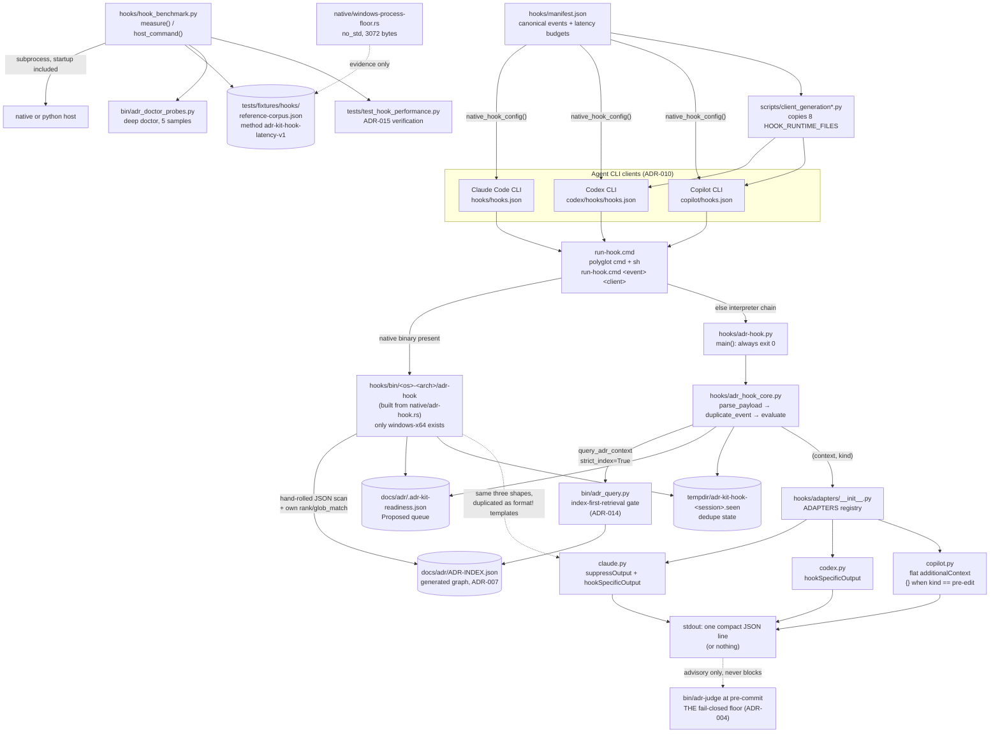

# Hook Integration Layer

## Overview

- **Name**: Hook Integration Layer (`hooks`)
- **Description**: The lifecycle-hook runtime that pushes ADR context into an agent session. A polyglot dispatcher picks the fastest available host (a native Rust binary, else Python), a shared core normalizes each client's event payload into one `Envelope`, performs bounded read-only retrieval from the generated `ADR-INDEX.json`, and three thin per-client adapters render the client-specific JSON response. Everything in this cluster is advisory and fail-open: it exits 0 and prints nothing rather than ever blocking a session, an edit, or a commit.
- **Location**:
  - [`hooks/`](../hooks) — cluster root
  - [`hooks/adr-hook.py`](../hooks/adr-hook.py) — Python CLI entrypoint
  - [`hooks/adr_hook_core.py`](../hooks/adr_hook_core.py) — shared normalize/retrieve/evaluate core
  - [`hooks/adapters/`](../hooks/adapters) — per-client response renderers (`claude.py`, `codex.py`, `copilot.py`, `__init__.py`)
  - [`hooks/run-hook.cmd`](../hooks/run-hook.cmd) — polyglot cmd + POSIX-sh dispatcher
  - [`hooks/hooks.json`](../hooks/hooks.json) — generated Claude Code hook registration
  - [`hooks/manifest.json`](../hooks/manifest.json) — canonical event/latency/client-mapping manifest
  - [`hooks/hook_benchmark.py`](../hooks/hook_benchmark.py) — end-to-end latency harness
  - [`hooks/native/adr-hook.rs`](../hooks/native/adr-hook.rs) — native Rust hot-path host
  - [`hooks/native/windows-process-floor.rs`](../hooks/native/windows-process-floor.rs) — `no_std` process-launch floor probe
  - [`hooks/native/README.md`](../hooks/native/README.md) — release build recipe
  - `hooks/bin/windows-x64/adr-hook.exe` — committed prebuilt native host (248,832 bytes, binary; the sibling `adr-hook.pdb` is a 1.5 MB local build artefact that `.gitignore:53` excludes)
  - [`hooks/__init__.py`](../hooks/__init__.py) — package marker (docstring only)
- **Language**: Python 3.10+ (stdlib only; `X | None` unions and `from __future__ import annotations`), Rust (std for the host, `no_std`/no-CRT for the floor probe), one polyglot Windows-`cmd`/POSIX-`sh` shell script, and JSON for configuration.
- **Purpose**: Implements the **session**, **prompt**, **edit**, and **subagent/compact** injection tiers of ADR-004's layered context model. When an agent is about to write code, the governing Accepted ADRs for the target path arrive in its context *before* the edit. Nothing here enforces: ADR-004 keeps `bin/adr-judge` at pre-commit as the single fail-closed floor, and [`hooks/adr-hook.py:36-38`](../hooks/adr-hook.py) states that contract in code by swallowing every exception and returning 0.

### Governing ADRs (verified)

| ADR | How it reaches this cluster |
|---|---|
| **ADR-004** — Layered ADR Context Injection | Defines the three fail-open injection tiers this cluster implements (session, edit, task) and the one fail-closed pre-commit floor it must never replace. Mandates the `PreToolUse` `Edit\|MultiEdit\|Write` matcher and bounded injected content. |
| **ADR-014** — Generated ADR Graph as the Selective-Context Query Engine | `context_scope: global`; its `verified_in` metadata names `hooks/adr_hook_core.py`. Must: "Keep query and hook hot paths local, deterministic, bounded, stdlib-first, model-free, and key-free" and "Preserve fail-open context injection and fail-closed judge enforcement". Must Not: introduce a service, database, embedding model, or LLM call into the hook path. The `index-first-retrieval` gate literal lives in [`bin/adr_query.py:16`](../bin/adr_query.py). |
| **ADR-015** — Two-Second Deterministic Latency Budget as a Test Fixture Contract | Must: every deterministic user-facing CLI **or hook** path keeps a p50/p95/hard-budget entry in a committed latency fixture with measured evidence. Verification names `tests/test_hook_performance.py` and `tests/fixtures/hooks/reference-corpus.json`. |
| **ADR-010** — Certify Three Native CLI Clients Through One Outcome Contract | Restricts the client set to exactly `claude-code-cli`, `codex-cli`, `github-copilot-cli`; requires equal *outcomes* rather than identical event names; classifies hook wrappers as **generated** artefacts and hook intents as **canonical**. Copilot's missing pre-edit hook is a registered degradation with a documented post-edit backstop, not a defect. |

Two corrections to the cluster brief, both verified against the sources:

- **ADR-012 does not govern this cluster.** Its text contains zero occurrences of "hook", it has no `## Decision Contract` section, and its decision is release version-consistency across marketplace manifests. `hooks/manifest.json` appears in `tests/test_release_allowlist.py:50`, but no ADR references that allowlist.
- **ADR-015 did not motivate the native path.** The Windows process-creation floor was measured 2026-07-19 (`tests/fixtures/hooks/windows-process-floor.json`) under method `adr-kit-hook-latency-v1`; ADR-015 was accepted 2026-07-26, is scoped to `tests/fixtures/cli/latency-corpus.json`, and carries method `adr-kit-cli-latency-v1`. ADR-015 generalised the fixture-contract discipline the hook harness already practised. Its 2000 ms ceiling is also not the binding constraint here — the hook hard budgets are 100–750 ms, an order of magnitude tighter.

---

## Code Elements

### `hooks/adr-hook.py` — Python CLI entrypoint

Twenty-three lines of logic whose entire job is to be unable to fail. It prepends its own directory to `sys.path` ([`:11-13`](../hooks/adr-hook.py)) so `adapters` and `adr_hook_core` resolve as top-level modules regardless of how the file was invoked.

| Element | Signature | Description | Location |
|---|---|---|---|
| `main` | `main(argv: list[str] \| None = None) -> int` | Parses `--client`/`--event`, reads ≤ 64 KiB + 1 byte from stdin, dedupes, evaluates, renders through the client adapter, prints compact single-line JSON. Always returns 0. | [`adr-hook.py:19`](../hooks/adr-hook.py) |

Notable in the body: `parser.parse_known_args(argv)` tolerates unknown flags a future client might pass; `sys.stdin.buffer.read(64 * 1024 + 1)` deliberately reads one byte past the limit so oversize input is *detectable* rather than silently truncated; and `except BaseException: return 0` ([`:36`](../hooks/adr-hook.py)) catches `KeyboardInterrupt` and `SystemExit` too. That breadth is intentional per ADR-004's fail-open tier — the comment on [`:37`](../hooks/adr-hook.py) records why. Do not "fix" it to `except Exception`.

### `hooks/adr_hook_core.py` — shared core (483 lines)

The protocol oracle. Imports `query_adr_context` from `bin/adr_query.py` by injecting `<root>/bin` into `sys.path` at [`:15-19`](../hooks/adr_hook_core.py) (`Path(__file__).resolve().parents[1] / "bin"` — which resolves to `codex/bin` and `copilot/bin` in the generated client trees, so the same file works unchanged in all three layouts).

**Module constants** ([`:21-59`](../hooks/adr_hook_core.py)) — the bounds ADR-014 requires:

| Name | Value | Location |
|---|---|---|
| `MAX_INPUT_BYTES` | `64 * 1024` | [`:21`](../hooks/adr_hook_core.py) |
| `MAX_PARENT_CHARS` | `8 * 1024` | [`:22`](../hooks/adr_hook_core.py) |
| `MAX_CONTEXT_CHARS` | `4 * 1024` | [`:23`](../hooks/adr_hook_core.py) |
| `MAX_RESULTS` | `3` | [`:24`](../hooks/adr_hook_core.py) |
| `QUEUE_CACHE_NAME` | `".adr-kit-readiness.json"` | [`:25`](../hooks/adr_hook_core.py) |
| `QUEUE_MAX_BYTES` | `256 * 1024` | [`:26`](../hooks/adr_hook_core.py) |
| `WRITE_TOOLS` | `{"edit","multiedit","write","applypatch","create","notebookedit"}` | [`:27`](../hooks/adr_hook_core.py) |
| `NOOP_EVENTS` | 7 terminal/irrelevant events | [`:35`](../hooks/adr_hook_core.py) |
| `EVENT_ALIASES` | 14 compact-lowercase → canonical event names | [`:44`](../hooks/adr_hook_core.py) |

**`Envelope`** — frozen dataclass, the one normalized payload shape every host and adapter agrees on ([`:62`](../hooks/adr_hook_core.py)):

```python
@dataclass(frozen=True)
class Envelope:
    client: str
    client_version: str | None
    event: str
    session_id: str | None
    agent_id: str | None
    workspace: Path
    tool_name: str | None
    tool_input: dict[str, Any]
    prompt: str | None
    parent_context: str | None
```

**Public functions:**

| Signature | Description | Location |
|---|---|---|
| `normalize(payload: dict[str, Any], client: str, event: str \| None) -> Envelope` | Maps any client's snake_case/camelCase payload onto `Envelope`, resolving the event through `EVENT_ALIASES` after stripping non-alphabetic characters, resolving `cwd`/`workspace`/`workspace_root` to an absolute path, and length-bounding every string field. | [`:89`](../hooks/adr_hook_core.py) |
| `parse_payload(raw: bytes, client: str, event: str \| None = None) -> Envelope \| None` | Rejects oversize (> `MAX_INPUT_BYTES`), non-UTF-8, non-object, malformed, and `adr_kit_disabled: true` payloads by returning `None`. Empty stdin normalizes as `{}`. | [`:128`](../hooks/adr_hook_core.py) |
| `duplicate_event(envelope: Envelope) -> bool` | Best-effort cross-process dedupe. Writes a canonical JSON signature of (event, tool, path, prompt, agent) to `<tempdir>/adr-kit-hook-<session>.seen` via write-temp-then-`os.replace`. Returns `False` on any `OSError` — dedupe failure never suppresses context. | [`:140`](../hooks/adr_hook_core.py) |
| `load_index_records(workspace: Path) -> list[dict[str, Any]]` | Reads `docs/adr/ADR-INDEX.json` (fallback `adr/ADR-INDEX.json`), refuses files over 2 MiB, returns the `adrs` array's dict members; `[]` on any read/parse fault. | [`:182`](../hooks/adr_hook_core.py) |
| `load_records(workspace: Path) -> list[dict[str, Any]]` | `load_index_records` filtered to `status == "Accepted"`. **Currently unreferenced** — see notable findings. | [`:194`](../hooks/adr_hook_core.py) |
| `load_queue_context(workspace: Path) -> str` | Reads the prepared readiness queue (`docs/adr/.adr-kit-readiness.json`), requiring `schema_version == 1` and a future `expires_at`; emits at most `MAX_RESULTS` lines, each accepted only if `adr_id` matches `ADR-\d{3,4}` **and** `command` equals exactly `/adr-kit:grill <adr_id>`. Returns `""` on anything unexpected. | [`:200`](../hooks/adr_hook_core.py) |
| `rank(records: list[dict[str, Any]], query: str) -> list[dict[str, Any]]` | Flat token-overlap ranking over id/title/summary/globs, ties broken by ADR id, capped at `MAX_RESULTS`. **Currently unreferenced** except by the equally unreferenced `_matching_path_records`. | [`:262`](../hooks/adr_hook_core.py) |
| `evaluate(envelope: Envelope) -> tuple[str, str]` | The event state machine. Returns `(context_text, kind)` where `kind` ∈ `noop`, `session`, `prompt`, `pre-edit`, `post-edit`, `subagent`, `compact`. Context is always truncated to `MAX_CONTEXT_CHARS`. | [`:404`](../hooks/adr_hook_core.py) |

`evaluate`'s dispatch, in order ([`:404-483`](../hooks/adr_hook_core.py)):

1. `NOOP_EVENTS` → `("", "noop")`.
2. `SubagentStart` / `PreCompact` → pass the caller-supplied `parent_context` through, bounded. No index read at all — these tiers only relay context the parent already had.
3. `SessionStart` → Accepted ADRs whose `context_scope == "global"`, id-sorted, plus the readiness queue.
4. `UserPromptSubmit` → `_query(workspace, prompt)`, split into "Governing Accepted" and "Advisory Proposed" blocks.
5. `PreToolUse` / `PostToolUse` → only for tools in `WRITE_TOOLS` (matched after lowercasing and stripping `_`, so `Multi_Edit` and `multiedit` both hit); resolves the edit path, rejects anything escaping the workspace, then renders governing + advisory + the `grill` nudge. The heading differs by event: "Governing Accepted ADRs before this edit:" versus "Post-edit ADR backstop; verify this change against:".

**Private helpers (summarized in aggregate, as permitted).** Twelve `_`-prefixed functions: `_bounded_text`, `_first`, `_index_path`, `_tokens`, `_record_text`, `_query`, `_safe_edit_path`, `_matching_path_records`, `_render`, `_client_grill`, `_safe_source_argument`, `_proposed_advisory`. Three deserve individual mention because they carry security or contract weight:

- **`_query`** ([`:273`](../hooks/adr_hook_core.py)) is the ADR-014 seam. It calls `query_adr_context(query, index.parent, limit=MAX_RESULTS, strict_index=True, include_history=False, statuses=("Accepted","Proposed"), paths=(path,) if path else ())` and returns `[]` on `IndexQueryError`, `OSError`, `UnicodeError`, or `ValueError`. `strict_index=True` means: use the generated graph or nothing — never fall back to parsing Markdown on the hot path.
- **`_safe_edit_path`** ([`:302`](../hooks/adr_hook_core.py)) is the path-traversal guard. It rejects values over 4096 chars, resolves relative paths against the workspace, and returns `None` when `resolved.relative_to(envelope.workspace)` raises — so a payload naming `../../etc/passwd` produces a silent noop.
- **`_proposed_advisory`** ([`:362`](../hooks/adr_hook_core.py)) links a Proposed ADR to the file being edited via its `metadata.verified_in` or `scope.path_globs`, emitting a client-correct `grill` invocation. With no link it falls back to a hardcoded regex of architecture-smelling paths (`architecture/`, `infra/`, `migrations/`, `schemas/`, `api/`, `contracts/`, `config/`, `deploy/`, `security/`, and the manifests `Dockerfile`, `compose.y[a]ml`, `pyproject.toml`, `package.json`, `Cargo.toml`, `go.mod`) and suggests `grill --source "<path>"`. `_safe_source_argument` ([`:356`](../hooks/adr_hook_core.py)) whitelists `[A-Za-z0-9_./\\ -]{1,4096}` before the path is ever interpolated into a suggested command — shell-injection defence by allowlist.

### `hooks/adapters/` — per-client response renderers

Three files, one function each, identical signature. This is where ADR-010's "equal outcomes, not identical events" lands.

| Client id | Signature | Response shape | Location |
|---|---|---|---|
| `claude-code-cli` | `render(event: str, context: str, kind: str) -> dict` | `{"suppressOutput": true, "hookSpecificOutput": {"hookEventName": …, "additionalContext": …}}` | [`adapters/claude.py:6`](../hooks/adapters/claude.py) |
| `codex-cli` | `render(event: str, context: str, kind: str) -> dict` | `{"hookSpecificOutput": {…}}` — same nesting, no `suppressOutput` | [`adapters/codex.py:6`](../hooks/adapters/codex.py) |
| `github-copilot-cli` | `render(event: str, context: str, kind: str) -> dict` | `{"additionalContext": …}` flat, **and returns `{}` when `kind == "pre-edit"`** | [`adapters/copilot.py:6`](../hooks/adapters/copilot.py) |

All three return `{}` for empty context, which `adr-hook.py:34` treats as "print nothing". Copilot's pre-edit suppression is the registered ADR-010 degradation: Copilot CLI has no pre-edit hook, so emitting pre-edit context there would be a false promise. The docstring on [`copilot.py:1`](../hooks/adapters/copilot.py) calls it "an honest post-edit backstop".

| Element | Value | Location |
|---|---|---|
| `ADAPTERS` | `dict[str, Callable[[str, str, str], dict]]` mapping the three client ids to their renderers; also the source of `--client`'s `choices` tuple | [`adapters/__init__.py:9`](../hooks/adapters/__init__.py) |

### `hooks/run-hook.cmd` — polyglot dispatcher

A single file that is simultaneously a valid Windows batch script and a valid POSIX shell script. Line 1 is `: << 'CMDBLOCK'` — in `sh` that starts a here-document the null command discards, swallowing the entire batch section through the `CMDBLOCK` sentinel on [`:28`](../hooks/run-hook.cmd); `cmd.exe` ignores the label-like first line, runs the batch block, and `exit /b 0` before reaching the shell half. One file, two interpreters, no wrapper script per platform.

Host selection order, identical in both halves:

1. Platform-specific native binary — `bin/windows-x64/adr-hook.exe`, `bin/darwin-$ARCH/adr-hook`, or `bin/linux-$ARCH/adr-hook`, with `$ARCH` normalized to `x64`/`arm64` ([`:34-44`](../hooks/run-hook.cmd)).
2. `$ADR_KIT_PYTHON` / `%ADR_KIT_PYTHON%` environment override.
3. The `__ADR_KIT_PYTHON__` placeholder, rewritten to a concrete interpreter path at install time by [`clients/installer/payload.py:158-165`](../clients/installer/payload.py) (which raises if the placeholder is missing, and always writes back with `newline="\n"`).
4. `python3`, then `python`, then `py -3` on Windows.
5. Exit 0 having done nothing, if no interpreter exists at all.

Every branch ends in `exit /b 0` or `|| true; exit 0`. Argument order is **event first, client second** (`run-hook.cmd <event> <client>`) — the inverse of the Python CLI's named flags — and `CLIENT` defaults to `claude-code-cli`.

### `hooks/manifest.json` — canonical event manifest

The single source of truth for hook wiring, and an *input* to code generation rather than a runtime read. Declares `policy` (`fail_open: true`, `network_allowed: false`, `future_clients_allowed: false`) and six events, each with `id`, `command`, `matcher`, `outcome`, optional `runner_timeout_sec`, `latency_budget_ms`, a `latency` triple, and a `clients` map giving the native event name per client (`null` where the client has no such hook).

| Event id | Matcher | Outcome | Runner timeout | p50 / p95 / hard (ms) | Copilot mapping |
|---|---|---|---|---|---|
| `session-start` | — | task-context | 5 s | 50 / 150 / 500 | `sessionStart` |
| `user-prompt-submit` | — | task-context | 5 s | 75 / 250 / 500 | `userPromptSubmitted` |
| `pre-tool-use` | `Edit\|MultiEdit\|Write` | edit-governance | (default 1 s) | 25 / 50 / 100 | `null` |
| `post-tool-use` | `Edit\|MultiEdit\|Write` | edit-governance | (default 1 s) | 25 / 50 / 100 | `postToolUse` |
| `subagent-start` | — | task-context | (default 1 s) | 30 / 100 / 250 | `null` |
| `pre-compact` | — | lifecycle | (default 1 s) | 30 / 100 / 500 | `null` |

`hooks/hooks.json` is **generated** from this manifest by `native_hook_config()` ([`scripts/client_generation_artifacts.py:209`](../scripts/client_generation_artifacts.py)), which emits three shapes to three targets: `hooks/hooks.json` (Claude), `codex/hooks/hooks.json` (Codex), and `copilot/hooks.json` (Copilot, flattened at the client root). `docs/hook-performance.md:23` confirms the manifest owns runner timeouts, bounded to integers 1–30 s.

### `hooks/hook_benchmark.py` — latency harness (162 lines)

The only module in this cluster that spawns subprocesses. It measures the *real* path including process startup — the point `tests/fixtures/hooks/reference-corpus.json` makes with `"process_startup_included": true`.

| Element | Signature | Description | Location |
|---|---|---|---|
| `METHOD_ID` | `= "adr-kit-hook-latency-v1"` | Method identifier; `tests/test_hook_performance.py:23` asserts the fixture agrees. | [`:15`](../hooks/hook_benchmark.py) |
| `host_command` | `host_command(plugin_root: Path, client: str, event: str) -> tuple[list[str], str]` | Resolves the platform native binary path; returns `(argv, "native")` if it exists, else `(argv_via_sys.executable, "python-fallback")`. | [`:24`](../hooks/hook_benchmark.py) |
| `reference_payloads` | `reference_payloads(project_root: Path) -> dict[str, dict[str, Any]]` | The seven fixed reference payloads (SessionStart, UserPromptSubmit, SubagentStart, PreToolUse, PostToolUse, PreCompact, Stop) sharing `cwd` and `session_id: "benchmark-session"`. | [`:45`](../hooks/hook_benchmark.py) |
| `measure` | `measure(plugin_root: Path, project_root: Path, *, samples: int, reference_path: Path \| None = None) -> dict[str, Any]` | One unmeasured warm-up launch per event, then `samples` timed `subprocess.run` calls with the fixture's `hard_timeout_ms` as the actual subprocess timeout. Returns per-event `p50_ms`/`p95_ms`/`max_ms`/`timeout_count`/`budget`/`targets`, plus machine metadata and `all_targets_met`. | [`:76`](../hooks/hook_benchmark.py) |

One private helper, `_percentile(values, percentile)` ([`:18`](../hooks/hook_benchmark.py)), a nearest-rank percentile on the sorted sample. Two deliberate design choices worth noting: each sample carries a unique `agent_id` (`f"benchmark-{sample}"`) so `duplicate_event` cannot short-circuit the measurement into a fake-fast noop; and a `subprocess.TimeoutExpired` is counted in `timeout_count` while its elapsed time is still appended to `durations`, so a timeout inflates the percentiles instead of vanishing from them.

### `hooks/native/adr-hook.rs` — native Rust host (630 lines)

A dependency-free reimplementation of the same protocol, including a hand-rolled JSON scanner, glob matcher, and FNV-1a-based dedupe. `#![cfg_attr(target_os = "windows", windows_subsystem = "windows")]` on [`:1`](../hooks/native/adr-hook.rs) suppresses the console window on Windows.

**It exports no `pub` items.** Its entire external surface is the CLI contract plus `main()`. The table below documents internal architecture, not an importable API.

| Function | Signature | Description | Location |
|---|---|---|---|
| `Record` | `struct Record { id, title, path, status, summary, context_scope: String, globs, verified, topics, aliases, components, symbols, contract: Vec<String> }` | The index record projection, `#[derive(Clone)]`. | [`:22`](../hooks/native/adr-hook.rs) |
| `json_string` | `fn json_string(input: &str, key: &str) -> Option<String>` | First-match scan for `"key"` then the following quoted string, decoding the seven JSON escapes plus `\uXXXX`. | [`:39`](../hooks/native/adr-hook.rs) |
| `json_true` | `fn json_true(input: &str, key: &str) -> bool` | Whether `"key"` is followed by literal `true`. Used only for the `adr_kit_disabled` kill switch. | [`:90`](../hooks/native/adr-hook.rs) |
| `array_section` | `fn array_section<'a>(input: &'a str, key: &str) -> Option<&'a str>` | Bracket-depth scan, quote- and escape-aware, returning the array body slice. | [`:98`](../hooks/native/adr-hook.rs) |
| `top_level_objects` | `fn top_level_objects(input: &str) -> Vec<&str>` | Splits an array body into depth-0 `{…}` object slices. | [`:127`](../hooks/native/adr-hook.rs) |
| `string_array` | `fn string_array(input: &str, key: &str) -> Vec<String>` | Every quoted token inside `key`'s array. | [`:159`](../hooks/native/adr-hook.rs) |
| `load_records` | `fn load_records(workspace: &Path) -> Vec<Record>` | Same two index candidates and 2 MiB cap as the Python core; `context_scope` defaults to `"selective"`; `contract` concatenates `must`, `must_not`, `exceptions`, `verification`. | [`:174`](../hooks/native/adr-hook.rs) |
| `load_queue_context` | `fn load_queue_context(workspace: &Path) -> String` | Readiness-queue reader, 256 KiB cap; freshness by **file mtime < 24 h**; `schema_version: 1` checked as a substring in both spaced and unspaced forms. | [`:209`](../hooks/native/adr-hook.rs) |
| `tokens` | `fn tokens(value: &str) -> Vec<String>` | Lowercase ASCII tokens of length ≥ 3 minus the same seven stopwords as Python. | [`:251`](../hooks/native/adr-hook.rs) |
| `rank` | `fn rank(records: &[Record], query: &str) -> Vec<Record>` | Weighted field-overlap scoring: symbols ×95, components ×90, topics ×75, aliases ×70, title ×60, contract ×50, summary ×40. Positive scores only, ties by id, top 3. | [`:259`](../hooks/native/adr-hook.rs) |
| `glob_match` | `fn glob_match(pattern: &[u8], value: &[u8]) -> bool` | Recursive byte glob. `*` stops at `/`, `**` crosses separators, `?` matches one byte, comparison is ASCII-case-insensitive. | [`:286`](../hooks/native/adr-hook.rs) |
| `safe_relative` | `fn safe_relative(workspace: &Path, value: &str) -> Option<String>` | Lexical normalization (`..` pops, refuses to escape), then `strip_prefix(workspace)`; the Rust counterpart of `_safe_edit_path`. | [`:314`](../hooks/native/adr-hook.rs) |
| `escape_json` | `fn escape_json(value: &str) -> String` | Escapes `"`, `\`, `\n`, `\r`, `\t`; maps any other control char to a space. | [`:335`](../hooks/native/adr-hook.rs) |
| `duplicate_event` | `fn duplicate_event(payload: &str, event: &str) -> bool` | Same temp-file dedupe contract, but stores a 16-hex-digit **FNV-1a hash** of a pipe-joined signature rather than the Python core's raw JSON signature. | [`:351`](../hooks/native/adr-hook.rs) |
| `render` | `fn render(records: &[Record], heading: &str) -> String` | Emits `- ID: title — summary (source: docs/adr/<path>)`, truncating at `MAX_CONTEXT`. | [`:389`](../hooks/native/adr-hook.rs) |
| `client_grill` | `fn client_grill(client: &str, arguments: &str) -> String` | `/adr-kit:grill` / `$adr-kit:grill` / `adr-kit:grill` per client. | [`:407`](../hooks/native/adr-hook.rs) |
| `proposed_advisory` | `fn proposed_advisory(records: &[Record], relative: &str, client: &str) -> String` | Rust counterpart of `_proposed_advisory`; the Python regex becomes a 19-entry `contains` marker list. | [`:417`](../hooks/native/adr-hook.rs) |
| `normalized_event` | `fn normalized_event(value: &str) -> String` | The `EVENT_ALIASES` equivalent; unknown values pass through verbatim. | [`:454`](../hooks/native/adr-hook.rs) |
| `response` | `fn response(client: &str, event: &str, context: &str, pre_edit: bool) -> String` | The three adapter shapes as `format!` templates, including Copilot's pre-edit suppression. | [`:474`](../hooks/native/adr-hook.rs) |
| `run` | `fn run() -> Option<String>` | The whole pipeline; every failure path is `None`/`?`. | [`:488`](../hooks/native/adr-hook.rs) |
| `main` | `fn main()` | Prints `run()`'s non-empty output. No explicit exit code — always 0. | [`:624`](../hooks/native/adr-hook.rs) |

Constants mirror the Python core: `MAX_INPUT` 64 KiB, `MAX_CONTEXT` 4 KiB, `MAX_PARENT` 8 KiB, `MAX_RESULTS` 3, `QUEUE_MAX_BYTES` 256 KiB ([`:16-20`](../hooks/native/adr-hook.rs)).

### `hooks/native/windows-process-floor.rs` — process-launch floor probe

Twenty-two lines: `#![no_std]`, `#![no_main]`, one `extern "system"` import of `ExitProcess` from `kernel32`, a `mainCRTStartup` that immediately exits 0, and a panic handler that does the same. Compiled it is 3,072 bytes and does nothing at all — which is the point. It measures the irreducible cost of *launching a Windows process*, isolating platform overhead from anything ADR Kit controls. Its 300-sample evidence (13.171 ms min, 18.116 ms p50, 25.857 ms p95, 144.603 ms max) lives in `tests/fixtures/hooks/windows-process-floor.json` and is what justified raising the edit-hook budget from 10/25/100 ms to 25/50/100 ms. The fixture records `"hard_timeout": false` — one scheduling outlier exceeded 100 ms — and `tests/test_hook_performance.py:53-57` asserts that failure remains visible rather than being rounded away.

| Element | Signature | Location |
|---|---|---|
| `mainCRTStartup` | `pub extern "system" fn mainCRTStartup() -> !` | [`:15`](../hooks/native/windows-process-floor.rs) |
| `panic` | `fn panic(_info: &PanicInfo) -> !` | [`:20`](../hooks/native/windows-process-floor.rs) |

### `hooks/native/README.md`

The release build recipe: `rustc -C opt-level=3 -C lto=fat -C codegen-units=1 -C panic=abort -C strip=symbols hooks/native/adr-hook.rs -o hooks/bin/windows-x64/adr-hook.exe`. States the two invariants that matter for reviewers: "The Rust compiler is a release-build tool, not a runtime dependency", and "The Python implementation remains the portable fallback and protocol oracle."

---

## Dependencies

### Internal

| Target | How reached | Purpose |
|---|---|---|
| [`bin/adr_query.py`](../bin/adr_query.py) | `sys.path` injection of `<root>/bin` at [`adr_hook_core.py:15-19`](../hooks/adr_hook_core.py); imports `query_adr_context`, `IndexQueryError` | The ADR-014 shared index-first retrieval engine. Python only — the Rust host does not use it. |
| `docs/adr/ADR-INDEX.json` (fallback `adr/ADR-INDEX.json`) | Read-only, ≤ 2 MiB | The generated ADR graph (ADR-007). Data contract, not code. |
| `docs/adr/.adr-kit-readiness.json` | Read-only, ≤ 256 KiB | The Proposed-ADR readiness queue produced by `bin/adr-readiness`. |
| `<tempdir>/adr-kit-hook-<session>.seen` | Read/write | Cross-process dedupe state. Per-machine, disposable. |
| [`scripts/client_generation.py`](../scripts/client_generation.py), [`scripts/client_generation_model.py`](../scripts/client_generation_model.py), [`scripts/client_generation_artifacts.py`](../scripts/client_generation_artifacts.py) | Inbound — these consume `hooks/` | Copies the 8 `HOOK_RUNTIME_FILES` into `codex/hooks/` and `copilot/hooks/`, and generates each client's `hooks.json` from `hooks/manifest.json`. |
| [`clients/installer/payload.py`](../clients/installer/payload.py) | Inbound | Substitutes `__ADR_KIT_PYTHON__` in all three `run-hook.cmd` copies and marks them executable on non-Windows. |
| [`bin/adr_doctor_probes.py`](../bin/adr_doctor_probes.py) | Inbound — `from hooks.hook_benchmark import measure as measure_hooks` | The deep-doctor latency probe (5 samples). |
| [`tests/test_hook_protocol.py`](../tests/test_hook_protocol.py), [`tests/test_hook_performance.py`](../tests/test_hook_performance.py), [`tests/test_adr_grill_signal.py`](../tests/test_adr_grill_signal.py), [`tests/test_adr_guardian_queue.py`](../tests/test_adr_guardian_queue.py) | Inbound | Protocol, parity, and latency certification. |

### External

**None third-party — confirmed.** Every Python import in this cluster resolves to the standard library: `argparse`, `dataclasses`, `datetime`, `fnmatch`, `json`, `os`, `pathlib`, `platform`, `re`, `statistics`, `subprocess`, `sys`, `tempfile`, `time`, `typing`. The Rust host uses only `core`/`std` (`std::cmp`, `std::collections::HashSet`, `env`, `fs`, `io`, `path`, `time`); the floor probe uses neither, linking `kernel32` directly. `hooks/manifest.json` declares `"network_allowed": false` and no code in the cluster opens a socket, spawns a model, or reads a credential.

**Build-time / OS:**

| Dependency | Kind | Note |
|---|---|---|
| `rustc` | Build-time only | Manual release build per `hooks/native/README.md`. No CI step compiles the `.rs` files. |
| `cmd.exe` / POSIX `sh` | Runtime | Both halves of `run-hook.cmd`. |
| `where` (Windows) / `command -v` (POSIX) | Runtime | Interpreter discovery. |
| `python3` / `python` / `py -3` | Runtime | Only when no native binary and no configured interpreter exists. |
| `kernel32.dll` | Link-time | `ExitProcess` in the floor probe. |
| OS temp directory | Runtime | Dedupe state. |

---

## Interfaces

### CLI — Python host

```
adr-hook.py --client {claude-code-cli,codex-cli,github-copilot-cli} [--event <EventName>]
```

- `--client` is **required** and validated against `tuple(ADAPTERS)`; an unknown value makes `argparse` exit non-zero before any work happens (the only path in this cluster with a non-zero exit).
- `--event` is optional. When absent the event is read from the payload's `hook_event_name` / `hookEventName` / `event`.
- Unknown extra flags are tolerated (`parse_known_args`).

### CLI — native host

```
adr-hook.exe --client <id> [--event <EventName>]
```

Parsed by scanning `args.windows(2)` for the flag names ([`adr-hook.rs:490-491`](../hooks/native/adr-hook.rs)). `--client` missing → `None` → silent exit 0. Flag order is free; `--flag=value` is *not* supported by either host.

### CLI — dispatcher

```
run-hook.cmd <event> [client]
```

Positional, **event first**, `client` defaulting to `claude-code-cli`. An empty event exits 0 immediately. Events are passed as the manifest's kebab-case `command` values (`session-start`, `user-prompt-submit`, `pre-tool-use`, `post-tool-use`, `subagent-start`, `pre-compact`) — `EVENT_ALIASES` / `normalized_event` canonicalize them.

### stdin JSON contract

One JSON object, ≤ 65,536 bytes. Recognised keys, each with its accepted aliases:

| Field | Aliases |
|---|---|
| event | `hook_event_name`, `hookEventName`, `event` |
| workspace | `cwd`, `workspace`, `workspace_root` |
| tool name | `tool_name`, `toolName`, `tool_name_normalized` |
| tool input | `tool_input`, `toolInput`, `tool` |
| edit path (inside tool input) | `file_path`, `filePath`, `path`, `notebook_path` |
| prompt | `prompt`, `user_prompt`, `userPrompt` |
| parent context | `parent_context`, `parentContext`, `adr_context` |
| session | `session_id`, `sessionId` |
| agent | `agent_id`, `agentId`, `subagent_id` |
| version | `client_version`, `version` |
| **kill switch** | `adr_kit_disabled: true` → immediate silent noop |

### stdout JSON contract

Zero or one line of compact JSON (`separators=(",", ":")`, `ensure_ascii=False`). Nothing is printed when there is no context. Three shapes, one per client, listed in the adapters table above.

### Exit-code convention

**Always 0.** That is the cluster's defining contract, asserted at four independent levels: `except BaseException: return 0` in the Python host, `Option`-returning `run()` in Rust, `exit /b 0` / `|| true` on every dispatcher branch, and `tests/test_hook_protocol.py` (`test_unsupported_and_terminal_events_are_successful_noops`, `test_malformed_oversized_and_disabled_payloads_fail_open`). ADR-004 puts blocking authority solely in `bin/adr-judge` at pre-commit.

### Importable Python API

`hooks/` is a package (`hooks/__init__.py`), so `from hooks.hook_benchmark import measure, host_command, reference_payloads, METHOD_ID` works from the repo root — this is how `bin/adr_doctor_probes.py:20` and `tests/test_hook_performance.py:16` reach it. `adr_hook_core` and `adapters` are imported *flat* (`from adr_hook_core import …`) after `hooks/` is put on `sys.path`, because the shipped client layouts have no `hooks` package parent. Tests do the same at `tests/test_hook_protocol.py:19-27`.

### Configuration surfaces

| Surface | Effect |
|---|---|
| `ADR_KIT_PYTHON` env var | Overrides interpreter selection in `run-hook.cmd`. |
| `__ADR_KIT_PYTHON__` placeholder | Install-time interpreter pin; `clients/installer/payload.py:158` raises if absent. |
| `adr_kit_disabled: true` in the payload | Per-invocation kill switch, honoured by both hosts. |
| `hooks/manifest.json` | Runner timeouts, matchers, latency budgets, client event mappings. Generation input. |
| `hooks/hooks.json` | Generated Claude Code registration; discovered by convention — `.claude-plugin/plugin.json` declares no `hooks` key, whereas `codex/.codex-plugin/plugin.json:19` and `copilot/plugin.json:19` point at theirs explicitly. |

---

## Relationships



### Layered relationship to ADR-004's tiers

| ADR-004 tier | Implemented by | Fails |
|---|---|---|
| Session | `SessionStart` → global Accepted ADRs + readiness queue | open |
| Prompt | `UserPromptSubmit` → `_query(prompt)` | open |
| Edit | `PreToolUse` / `PostToolUse` on `Edit\|MultiEdit\|Write` | open |
| Subagent / compact | `SubagentStart` / `PreCompact` → parent-context relay | open |
| Enforcement floor | `bin/adr-judge` at pre-commit — **outside this cluster** | closed |
