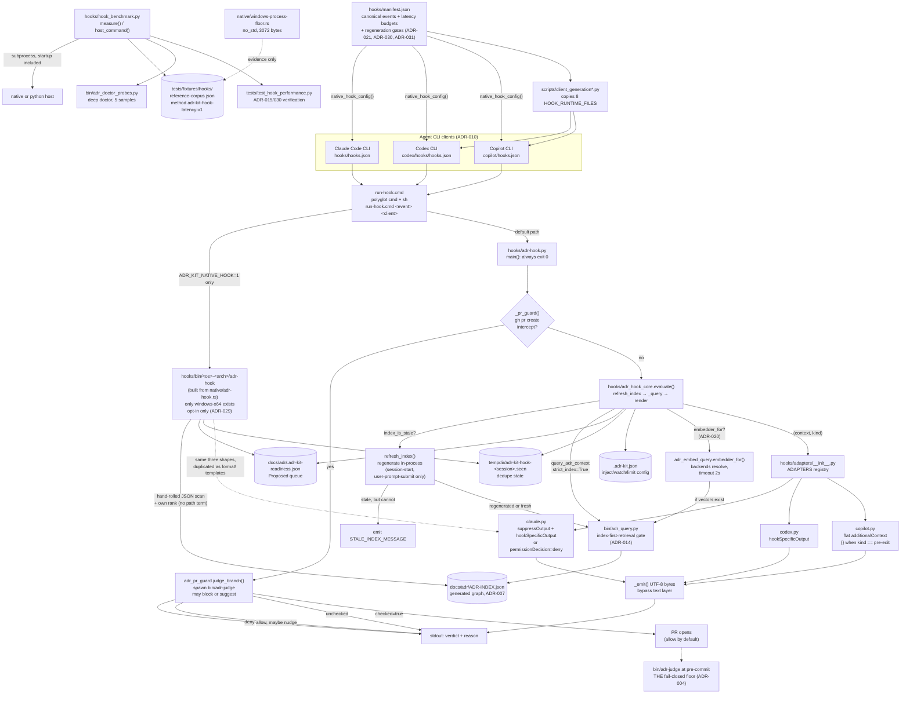

# Hook Integration Layer

## Overview

- **Name**: Hook Integration Layer (`hooks`)
- **Description**: The lifecycle-hook runtime that pushes ADR context into an agent session. A polyglot dispatcher selects an interpreter (native binary only when opt-in via `ADR_KIT_NATIVE_HOOK=1`, else Python), a shared core normalizes each client's event payload into one `Envelope`, probes and regenerates a stale ADR index when the budget allows, performs retrieval from the generated `ADR-INDEX.json`, and three thin per-client adapters render the client-specific JSON response. Everything in this cluster is advisory and fail-open: it exits 0 and prints nothing rather than ever blocking a session, an edit, or a commit. One module, `adr_pr_guard`, is the exception — it may block a pull request when the branch violates an Accepted ADR.
- **Location**:
  - [`hooks/`](../hooks) — cluster root
  - [`hooks/adr-hook.py`](../hooks/adr-hook.py) — Python CLI entrypoint and dispatcher logic
  - [`hooks/adr_hook_core.py`](../hooks/adr_hook_core.py) — shared normalize/retrieve/regenerate/evaluate core
  - [`hooks/adr_embed_query.py`](../hooks/adr_embed_query.py) — optional query embedding backend (ADR-020)
  - [`hooks/adr_pr_guard.py`](../hooks/adr_pr_guard.py) — pull-request guard; the one module permitted to block and to spawn subprocesses
  - [`hooks/adapters/`](../hooks/adapters) — per-client response renderers (`claude.py`, `codex.py`, `copilot.py`, `__init__.py`)
  - [`hooks/run-hook.cmd`](../hooks/run-hook.cmd) — polyglot cmd + POSIX-sh dispatcher
  - [`hooks/hooks.json`](../hooks/hooks.json) — generated Claude Code hook registration
  - [`hooks/manifest.json`](../hooks/manifest.json) — canonical event/latency/client-mapping manifest
  - [`hooks/hook_benchmark.py`](../hooks/hook_benchmark.py) — end-to-end latency harness
  - [`hooks/native/adr-hook.rs`](../hooks/native/adr-hook.rs) — native Rust opt-in host (630 lines; not selected by default)
  - [`hooks/native/windows-process-floor.rs`](../hooks/native/windows-process-floor.rs) — `no_std` process-launch floor probe (measurement only)
  - [`hooks/native/README.md`](../hooks/native/README.md) — opt-in native host release build recipe
  - `hooks/bin/windows-x64/adr-hook.exe` — committed prebuilt native host (248,320 bytes, binary; runs only when `ADR_KIT_NATIVE_HOOK=1`; `adr-hook.pdb` is a local build artefact that `.gitignore:53` excludes)
  - [`hooks/__init__.py`](../hooks/__init__.py) — package marker (docstring only)
- **Language**: Python 3.10+ (stdlib only; `X | None` unions and `from __future__ import annotations`), Rust (std for the opt-in host, `no_std`/no-CRT for the floor probe), one polyglot Windows-`cmd`/POSIX-`sh` shell script, and JSON for configuration.
- **Purpose**: Implements the **session**, **prompt**, **edit**, **plan-exit**, and **subagent/compact** injection tiers of ADR-004's layered context model, plus the **pull-request moment** enforcement gate specified in ADR-031. When an agent is about to write code or open a pull request, the governing Accepted ADRs for the target path arrive in its context *before* the edit or proposal. Nothing here enforces at commit: ADR-004 keeps `bin/adr-judge` at pre-commit as the single fail-closed floor, and [`hooks/adr-hook.py:149`](../hooks/adr-hook.py) states that contract in code by swallowing every exception and returning 0.

### Governing ADRs (verified)

| ADR | How it reaches this cluster |
|---|---|
| **ADR-004** — Layered ADR Context Injection | Defines the three fail-open injection tiers this cluster implements (session, prompt, edit) and the plan-exit advisory tier, plus the one fail-closed pre-commit floor it must never replace. Mandates the `PreToolUse` `Edit\|MultiEdit\|Write` matcher and bounded injected content. |
| **ADR-014** — Generated ADR Graph as the Selective-Context Query Engine | `context_scope: global`; its `verified_in` metadata names `hooks/adr_hook_core.py`. Must: "Keep query and hook hot paths local, deterministic, bounded, stdlib-first, model-free, and key-free" and "Preserve fail-open context injection and fail-closed judge enforcement". Must Not: introduce a service, database, embedding model, or LLM call into the hook path. The `index-first-retrieval` gate literal lives in [`bin/adr_query.py:16`](../bin/adr_query.py). |
| **ADR-015** — Two-Second Deterministic Latency Budget as a Test Fixture Contract | Must: every deterministic user-facing CLI **or hook** path keeps a p50/p95/hard-budget entry in a committed latency fixture with measured evidence. Verification names `tests/test_hook_performance.py` and `tests/fixtures/hooks/reference-corpus.json`. The 2000 ms ceiling applies to all recalibrated events except `pr-create`, which ADR-031 names as deliberately slower. |
| **ADR-020** — Embed the Query When the Budget Allows | Session-scoped and prompt-scoped hooks may embed the query if the corpus has been vector-embedded; edit-tier events stay lexical only because a round-trip does not fit a 100 ms hard timeout at any realistic ADR count. `embedder_for` is exported by `hooks/adr_embed_query.py` and injected at [`hooks/adr-hook.py:142`](../hooks/adr-hook.py) on condition. |
| **ADR-021** — Let the Session-Scoped Hooks Regenerate a Stale ADR Index | `session-start` and `user-prompt-submit`, at 500 ms budget, probe for staleness and regenerate in-process when they find it and the projected cost fits. Edit-tier events and smaller events stay read-only and render a staleness message instead. Concurrency is guarded by a lock file; a session that cannot take the lock reads what is on disk and continues. See `refresh_index()`, `index_is_stale()`, and `REFRESHING_EVENTS` at [`adr_hook_core.py:357-443`](../hooks/adr_hook_core.py). |
| **ADR-024** — Suggest Unrecorded Decisions Before a Pull Request | When the branch passes the judge (no violations), the pull-request guard asks whether it contains a decision no ADR records yet — advisory and unable to block. Implemented by `_nudge()` in `adr_pr_guard.py`. |
| **ADR-029** — Retire the Native Hook Binary Rather Than Maintain a Second Retrieval Engine | The Rust host is opt-in only, activated by `ADR_KIT_NATIVE_HOOK=1` environment variable. Default path is Python. Measured against the Python oracle the binary returned fewer governing ADRs on edits (1 of 4) and contained an outdated retrieval engine. One implementation at scale is better than two. See [`run-hook.cmd:12-18, 49-50`](../hooks/run-hook.cmd) for the opt-in condition. |
| **ADR-030** — Recalibrate the Hook Latency Budgets to the Python Host That Actually Ships | All declared budgets (p50, p95, hard timeout) were measured against the Python host, not the retired native binary. Measured on Windows 11 / CPython 3.12.9 with 29 ADRs. The interpreter floor (`python -c pass`) measures 182.6 ms on the test machine, which is a hard bound no hook can improve. See `MEASURED_INTERPRETER_FLOOR_MS` at [`hook_benchmark.py:60`](../hooks/hook_benchmark.py) and the current values in `hooks/manifest.json`. |
| **ADR-031** — Name the Pull-Request Moment as a Deliberately Slower User-Initiated Event | The `pr-create` event's 5000 ms budget exceeds ADR-015's 2000 ms ceiling because a pull-request guard that judges the branch before the PR exists provides value worth the latency. Marked with `latency_ceiling_exception: "ADR-031"` in the manifest. |
| **ADR-010** — Certify Three Native CLI Clients Through One Outcome Contract | Restricts the client set to exactly `claude-code-cli`, `codex-cli`, `github-copilot-cli`; requires equal *outcomes* rather than identical event names; classifies hook wrappers as **generated** artefacts and hook intents as **canonical**. Copilot's missing pre-edit hook is a registered degradation with a documented post-edit backstop, not a defect. |

Two corrections to the cluster brief, both verified against the sources:

- **ADR-012 does not govern this cluster.** Its text contains zero occurrences of "hook", it has no `## Decision Contract` section, and its decision is release version-consistency across marketplace manifests. `hooks/manifest.json` appears in `tests/test_release_allowlist.py:50`, but no ADR references that allowlist.
- **The manifest budget projection is p50, not hard timeout.** `_event_budget_ms()` reads `latency.p50_ms` from the manifest and uses that as the project bound for ADR-021 index regeneration (line 459 in adr_hook_core.py). So session-start projects against 400 ms and user-prompt-submit against 450 ms, not the hard timeouts of 1000 ms and 900 ms respectively.

---

## Code Elements

### `hooks/adr-hook.py` — Python CLI entrypoint

Thirty-three lines of logic whose entire job is to be unable to fail. It prepends its own directory to `sys.path` ([`:11-13`](../hooks/adr-hook.py)) so `adapters`, `adr_hook_core`, `adr_embed_query`, and `adr_pr_guard` resolve as top-level modules regardless of how the file was invoked.

| Element | Signature | Description | Location |
|---|---|---|---|
| `_pr_guard` | `_pr_guard(envelope) -> tuple[str, str] \| None` | Intercept a `gh pr create` command and judge the branch if one is being opened. Returns a context/kind tuple or None to let injection run. Supplies the optional `suggest` parameter to `judge_branch()` for ADR-024 missing-decision detection. | [`adr-hook.py:20`](../hooks/adr-hook.py) |
| `_embedder_for` | `_embedder_for(envelope) -> Callable[[str], Optional[List[float]]] \| None` | Supply a query embedder for `session-start` and `user-prompt-submit` if the corpus is vector-embedded; None otherwise. Injected into `evaluate()` for ADR-020. | [`adr-hook.py:111`](../hooks/adr-hook.py) |
| `_emit` | `_emit(response) -> None` | Write the response as UTF-8 bytes, bypassing Python's text layer which would apply platform-specific encoding (cp1252 on Windows). Ensures ADR titles with unicode characters reach the client intact. | [`adr-hook.py:77`](../hooks/adr-hook.py) |
| `main` | `main(argv: list[str] \| None = None) -> int` | Parses `--client`/`--event`, reads ≤ 64 KiB + 1 byte from stdin, dedupes, judges for pull requests, evaluates and renders through the client adapter, emits compact single-line JSON. Always returns 0. | [`adr-hook.py:128`](../hooks/adr-hook.py) |

Notable in the body: `parser.parse_known_args(argv)` tolerates unknown flags a future client might pass; `sys.stdin.buffer.read(64 * 1024 + 1)` deliberately reads one byte past the limit so oversize input is *detectable* rather than silently truncated; and `except BaseException: return 0` ([`:147`](../hooks/adr-hook.py)) catches `KeyboardInterrupt` and `SystemExit` too. That breadth is intentional per ADR-004's fail-open tier — the comment on [`:148`](../hooks/adr-hook.py) records why. Do not "fix" it to `except Exception`.

### `hooks/adr_hook_core.py` — shared core (792 lines)

The protocol oracle and index regeneration engine. Imports `query_adr_context` from `bin/adr_query.py` by injecting `<root>/bin` into `sys.path` at [`:27-29`](../hooks/adr_hook_core.py) (`Path(__file__).resolve().parents[1] / "bin"` — which resolves to `codex/bin` and `copilot/bin` in the generated client trees, so the same file works unchanged in all three layouts).

**Module constants** ([`:33-96`](../hooks/adr_hook_core.py)) — the bounds ADR-014 requires:

| Name | Value | Location |
|---|---|---|
| `MAX_INPUT_BYTES` | `64 * 1024` | [`:33`](../hooks/adr_hook_core.py) |
| `MAX_PARENT_CHARS` | `8 * 1024` | [`:34`](../hooks/adr_hook_core.py) |
| `MAX_CONTEXT_CHARS` | `4 * 1024` | [`:35`](../hooks/adr_hook_core.py) |
| `DEFAULT_MAX_RESULTS` | `5` | [`:40`](../hooks/adr_hook_core.py) |
| `MAX_RESULTS` | `DEFAULT_MAX_RESULTS`, overridable 1–20 via `context.default_limit` | [`:41`](../hooks/adr_hook_core.py) |
| `QUEUE_CACHE_NAME` | `".adr-kit-readiness.json"` | [`:42`](../hooks/adr_hook_core.py) |
| `QUEUE_MAX_BYTES` | `256 * 1024` | [`:43`](../hooks/adr_hook_core.py) |
| `WRITE_TOOLS` | `{"edit","multiedit","write","applypatch","create","notebookedit"}` | [`:44-51`](../hooks/adr_hook_core.py) |
| `PLAN_EXIT_TOOLS` | `{"exitplanmode","exitplan","planexit"}` | [`:52`](../hooks/adr_hook_core.py) |
| `NOOP_EVENTS` | 8 terminal/irrelevant events | [`:58-80`](../hooks/adr_hook_core.py) |
| `EVENT_ALIASES` | 14 compact-lowercase → canonical event names | [`:81-96`](../hooks/adr_hook_core.py) |
| `REFRESHING_EVENTS` | `{"SessionStart", "UserPromptSubmit"}` | [`:357`](../hooks/adr_hook_core.py) |
| `STALE_INDEX_MESSAGE` | Nudge message when index is stale and cannot be regenerated | [`:359-362`](../hooks/adr_hook_core.py) |

**`Envelope`** — frozen dataclass, the one normalized payload shape every host and adapter agrees on ([`:99-110`](../hooks/adr_hook_core.py)):

```python
@dataclass(frozen=True)
class Envelope:
    client: str
    client_version: str | None
    event: str
    session_id: str | None
    agent_id: str | None
    workspace: Path
    tool_name: str | None
    tool_input: dict[str, Any]
    prompt: str | None
    parent_context: str | None
```

**Public functions:**

| Signature | Description | Location |
|---|---|---|
| `normalize(payload: dict[str, Any], client: str, event: str \| None) -> Envelope` | Maps any client's snake_case/camelCase payload onto `Envelope`, resolving the event through `EVENT_ALIASES` after stripping non-alphabetic characters, resolving `cwd`/`workspace`/`workspace_root` to an absolute path, and length-bounding every string field. | [`:126`](../hooks/adr_hook_core.py) |
| `parse_payload(raw: bytes, client: str, event: str \| None = None) -> Envelope \| None` | Rejects oversize (> `MAX_INPUT_BYTES`), non-UTF-8, non-object, malformed, and `adr_kit_disabled: true` payloads by returning `None`. Empty stdin normalizes as `{}`. | [`:165`](../hooks/adr_hook_core.py) |
| `duplicate_event(envelope: Envelope) -> bool` | Best-effort cross-process dedupe. Writes a canonical JSON signature of (event, tool, path, prompt, agent) to `<tempdir>/adr-kit-hook-<session>.seen` via write-temp-then-`os.replace`. Returns `False` on any `OSError` — dedupe failure never suppresses context. | [`:177`](../hooks/adr_hook_core.py) |
| `load_index_records(workspace: Path) -> list[dict[str, Any]]` | Reads `docs/adr/ADR-INDEX.json` (fallback `adr/ADR-INDEX.json`), refuses files over 2 MiB, returns the `adrs` array's dict members; `[]` on any read/parse fault. | [`:219`](../hooks/adr_hook_core.py) |
| `load_records(workspace: Path) -> list[dict[str, Any]]` | `load_index_records` filtered to `status == "Accepted"`. **Currently unreferenced** — see notable findings. | [`:231`](../hooks/adr_hook_core.py) |
| `load_queue_context(workspace: Path) -> str` | Reads the prepared readiness queue (`docs/adr/.adr-kit-readiness.json`), requiring `schema_version == 1` and a future `expires_at`; emits at most `MAX_RESULTS` lines, each accepted only if `adr_id` matches `ADR-\d{3,4}` **and** `command` equals exactly `/adr-kit:grill <adr_id>`. Returns `""` on anything unexpected. | [`:237`](../hooks/adr_hook_core.py) |
| `rank(records: list[dict[str, Any]], query: str) -> list[dict[str, Any]]` | Flat token-overlap ranking over id/title/summary/globs, ties broken by ADR id, capped at `MAX_RESULTS`. **Currently unreferenced** except by the equally unreferenced `_matching_path_records`. | [`:299`](../hooks/adr_hook_core.py) |
| `index_is_stale(workspace: Path) -> bool` | Cheap precondition check (~2.8 ms measured) via `index_probably_fresh()` from `bin/adr_index_core.py`. Not a certification, only used to avoid unnecessary work. Returns False on any import or filesystem fault. | [`:365`](../hooks/adr_hook_core.py) |
| `refresh_index(workspace: Path, event: str) -> str` | Regenerate a stale index in-process when this event may afford it. Returns "" on success or no-op, returns `STALE_INDEX_MESSAGE` when regeneration was skipped (edit tier, budget exceeded, lock contention, or any fault). The message matters more than the write: an empty result from a stale index is indistinguishable from "no ADR was relevant" — ADR-021's defect — so every path that skips the write emits the message instead. | [`:384`](../hooks/adr_hook_core.py) |
| `evaluate(envelope: Envelope, embedder: Any = None) -> tuple[str, str]` | Refresh a stale index where the budget allows, then render the context. Returns `(context_text, kind)` where `kind` ∈ `noop`, `session`, `prompt`, `pre-edit`, `post-edit`, `plan-exit`, `stale-index`, `subagent`, `compact`. Context is always truncated to `MAX_CONTEXT_CHARS`. The message path wraps `_evaluate_context()` so every return carries the staleness notice when one is needed. | [`:634`](../hooks/adr_hook_core.py) |

`_evaluate_context`'s dispatch, in order ([`:661-791`](../hooks/adr_hook_core.py)):

1. `NOOP_EVENTS` → `("", "noop")`.
2. `SubagentStart` / `PreCompact` → pass the caller-supplied `parent_context` through, bounded. No index read at all — these tiers only relay context the parent already had.
3. `SessionStart` → Accepted ADRs whose `context_scope == "global"`, id-sorted, plus the readiness queue. Kind is `"session"`.
4. `UserPromptSubmit` → `_query(workspace, prompt)`, split into "Governing Accepted" and "Advisory Proposed" blocks, with route degradation notice. Kind is `"prompt"`.
5. `PreToolUse` with `PLAN_EXIT_TOOLS` matcher (`ExitPlanMode`, etc.) → Query the plan text and prompt the user whether a decision remains unrecorded. Kind is `"plan-exit"`.
6. `PreToolUse` / `PostToolUse` with `WRITE_TOOLS` matcher → Honourables `inject.enabled` and `watch.enabled` project config (separately, so a team can have pre without post or vice versa). Resolves the edit path, rejects anything escaping the workspace, then renders governing + advisory + the `grill` nudge. The heading differs by event: "Governing Accepted ADRs before this edit:" versus "Post-edit ADR backstop; verify this change against:". Kind is `"pre-edit"` or `"post-edit"`.

**Private helpers (summarized in aggregate, as permitted).** Twenty-four `_`-prefixed functions including `_bounded_text`, `_first`, `_index_path`, `_tokens`, `_record_text`, `_project_config`, `_switched_off`, `_configured_limit`, `_query`, `_safe_edit_path`, `_matching_path_records`, `_render`, `_client_grill`, `_safe_source_argument`, `_proposed_advisory`, `_plan_text`, `_plan_decision_prompt`, `_event_budget_ms`. Seven deserve individual mention because they carry security, contract, or regeneration weight:

- **`index_is_stale()`** ([`:365`](../hooks/adr_hook_core.py)) is the fast probe (2.8 ms measured) that decides whether regeneration is needed. Calls `index_probably_fresh` from `bin/adr_index_core.py` and returns False on any fault, preserving fail-open.
- **`refresh_index()`** ([`:384`](../hooks/adr_hook_core.py)) is where the write happens, gated by `REFRESHING_EVENTS`, budget projection, and an advisory lock file. Calls `regenerate_index()` from `bin/adr_index_core.py` in-process, never by spawning. A session that cannot take the lock reads what is on disk and continues; waiting is forbidden by ADR-021.
- **`_event_budget_ms()`** ([`:446`](../hooks/adr_hook_core.py)) reads the p50 budget for this event from `hooks/manifest.json`. Used by `refresh_index()` to project render cost against budget. Returns 400.0 ms as fallback.
- **`_query`** ([`:468`](../hooks/adr_hook_core.py)) is the ADR-014 seam. It calls `query_adr_context(query, index.parent, limit=limit, strict_index=True, include_history=False, statuses=("Accepted","Proposed"), paths=(path,) if path else (), embedder=embedder)` and returns `[], "none"` on `IndexQueryError`, `OSError`, `UnicodeError`, or `ValueError`. `strict_index=True` means: use the generated graph or nothing — never fall back to parsing Markdown on the hot path. The `embedder` parameter is None on edit-tier events (budget too tight) and supplied by the entrypoint on session/prompt events only.
- **`_safe_edit_path`** ([`:511`](../hooks/adr_hook_core.py)) is the path-traversal guard. It rejects values over 4096 chars, resolves relative paths against the workspace, and returns `None` when `resolved.relative_to(envelope.workspace)` raises — so a payload naming `../../etc/passwd` produces a silent noop.
- **`_proposed_advisory`** ([`:571`](../hooks/adr_hook_core.py)) links a Proposed ADR to the file being edited via its `metadata.verified_in` or `scope.path_globs`, emitting a client-correct `grill` invocation. With no link it falls back to a hardcoded regex of architecture-smelling paths (`architecture/`, `infra/`, `migrations/`, `schemas/`, `api/`, `contracts/`, `config/`, `deploy/`, `security/`, and the manifests `Dockerfile`, `compose.y[a]ml`, `pyproject.toml`, `package.json`, `Cargo.toml`, `go.mod`) and suggests `grill --source "<path>"`. `_safe_source_argument` ([`:565`](../hooks/adr_hook_core.py)) whitelists `[A-Za-z0-9_./\\ -]{1,4096}` before the path is ever interpolated into a suggested command — shell-injection defence by allowlist.
- **`_switched_off()`** ([`:321`](../hooks/adr_hook_core.py)) honors `inject.enabled` and `watch.enabled` from the project config (`.adr-kit.json`), documented in `schemas/adr-kit-config.schema.json`. Teaches the hook to respect project-level overrides while defaulting to on. `inject` gates `PreToolUse`, `watch` gates `PostToolUse`.

### `hooks/adr_embed_query.py` — optional query embedding (98 lines)

This module exists so that `adr_hook_core.py` cannot reach a model or the network — a test walks its imports and fails if it can. ADR-020 permits embedding the query in a hook; it does not permit the ranking core to acquire a socket. Everything here declines rather than raises: a hook that cannot embed falls back to lexical ranking and says so.

| Element | Signature | Description | Location |
|---|---|---|---|
| `EMBED_TIMEOUT_S` | `2` | Well under the 500 ms budget of the events that may embed, so a slow backend degrades to lexical rather than getting the whole hook killed. | [`:32`](../hooks/adr_embed_query.py) |
| `STORE_NAME` | `".adr-vectors.json"` | Filename of the vector store written by `bin/adr-embed`. | [`:28`](../hooks/adr_embed_query.py) |
| `embedder_for` | `embedder_for(adr_dir: Path) -> Optional[Callable[[str], Optional[List[float]]]]` | Return a callable that embeds one query to a vector, or None when this cannot work (no store, no model recorded, no resolvable backend, any import failure). The caller then takes the lexical route. Only exported function; supplied to `evaluate()` by the entrypoint on session and prompt events only (ADR-020). | [`:67`](../hooks/adr_embed_query.py) |

### `hooks/adr_pr_guard.py` — pull-request guard (362 lines)

The one hook module permitted to block and to spawn subprocesses. Judges whether a branch violates an Accepted ADR before a pull request exists, and asks whether it contains an unrecorded decision (advisory, advisory only — ADR-024). Fail-open on anything that is not a violation: no judge, no git, no branch, a timeout — all let the command through.

**Constants:**

| Name | Value | Description | Location |
|---|---|---|---|
| `PR_CREATE_RE` | `re.compile(r"(?:^|[;&\|]\s*)gh\s+pr\s+create\b")` | Command shape match for `gh pr create`, not a substring. `gh pr list` and comments must not fire. | [`:38`](../hooks/adr_pr_guard.py) |
| `CI_DIFF_BUDGET` | `33_554_432` | CI-sized budget (32 MiB) for branch diffs passed to the judge. | [`:42`](../hooks/adr_pr_guard.py) |
| `GUARD_OVERHEAD_S` | `1` | Seconds kept back from the runner budget for startup, imports, stdin read, and response rendering. Not measurable from inside the guard. | [`:44-56`](../hooks/adr_pr_guard.py) |
| `MIN_SUBPROCESS_S` | `1` | Below this a subprocess cannot usefully start, so the guard stops instead of launching one it will kill immediately. | [`:60`](../hooks/adr_pr_guard.py) |
| `DIFF_BUDGET_SHARE` | `0.4` | Share of remaining budget `git diff` may consume; judge keeps the majority. | [`:64`](../hooks/adr_pr_guard.py) |
| `FALLBACK_BUDGET_S` | `1` | Used when the manifest cannot be read or declares no budget for this event. One second, the default the generator writes when `runner_timeout_sec` is absent. | [`:71`](../hooks/adr_pr_guard.py) |
| `MAX_RUNNER_S` | `30` | Upper bound on `runner_timeout_sec` read from the manifest at runtime. Validates against the generator's own bounds. | [`:79`](../hooks/adr_pr_guard.py) |

**Public functions:**

| Element | Signature | Description | Location |
|---|---|---|---|
| `Deadline` | class with `__init__(seconds: int, start: Optional[float] = None)` and `remaining() -> Optional[int]` | One budget for the whole guard, spent down by each subprocess. `remaining()` returns how many seconds are left, or None if `MIN_SUBPROCESS_S` cannot be satisfied. Deriving the judge timeout alone was not enough; this structures the bound. | [`:82-103`](../hooks/adr_pr_guard.py) |
| `guard_budget_s` | `guard_budget_s() -> int` | How long the whole guard may run, read from the `pr-create` event's `runner_timeout_sec` in `hooks/manifest.json`, bounded and validated against the generator's range. Returns `FALLBACK_BUDGET_S` on any fault. | [`:106`](../hooks/adr_pr_guard.py) |
| `looks_like_pr_create` | `looks_like_pr_create(command: str) -> bool` | Whether the command string matches the `gh pr create` shape. Uses `PR_CREATE_RE`. | [`:144`](../hooks/adr_pr_guard.py) |
| `base_ref` | `base_ref(cwd: Path, deadline: Deadline) -> Optional[str]` | The branch this PR would target, by checking origin/HEAD, init.defaultBranch, then probing main/master/dev. Consumes from the deadline with each probe. Returns None on any failure or budget exhaustion. | [`:162`](../hooks/adr_pr_guard.py) |
| `judge_branch` | `judge_branch(cwd: Path, adr_dir: Path, judge: Path, suggest: Optional[Path] = None) -> Dict` | Return a verdict dict with `decision` ∈ {`allow`, `deny`}, `reason`, `checked`, and optional `violations` and `nudge`. Every non-violation outcome is `allow`. The `suggest` parameter (new, ADR-024) points to `bin/adr-suggest` and is used to ask about unrecorded decisions; it is applied only after a clean branch is found. | [`:231`](../hooks/adr_pr_guard.py) |

**Private functions:**

- **`_nudge()`** ([`:191`](../hooks/adr_pr_guard.py)) invokes `bin/adr-suggest` with the branch diff to ask about missing decisions. Returns text or nothing. Advisory by construction — never contributes to denial. Reuses the diff the judge already read and what is left of the deadline.
- **`_violations()`** ([`:329`](../hooks/adr_pr_guard.py)) parses the judge's JSON verdict and extracts violations (where `severity == "violation"`).
- **`_explain()`** ([`:340`](../hooks/adr_pr_guard.py)) renders a human-readable explanation of the violations.

### `hooks/adapters/` — per-client response renderers

Three files, one function each, identical signature. This is where ADR-010's "equal outcomes, not identical events" lands.

| Client id | Signature | Response shape | Location |
|---|---|---|---|
| `claude-code-cli` | `render(event: str, context: str, kind: str) -> dict` | `{"suppressOutput": true, "hookSpecificOutput": {"hookEventName": …, "additionalContext": …}}` for advisory kinds; `{"hookSpecificOutput": {"hookEventName": …, "permissionDecision": "deny", "permissionDecisionReason": …}}` when `kind == "pr-guard-deny"`. | [`adapters/claude.py:6`](../hooks/adapters/claude.py) |
| `codex-cli` | `render(event: str, context: str, kind: str) -> dict` | `{"hookSpecificOutput": {…}}` — same nesting, no `suppressOutput` | [`adapters/codex.py:6`](../hooks/adapters/codex.py) |
| `github-copilot-cli` | `render(event: str, context: str, kind: str) -> dict` | `{"additionalContext": …}` flat, **and returns `{}` when `kind == "pre-edit"`** | [`adapters/copilot.py:6`](../hooks/adapters/copilot.py) |

All three return `{}` for empty context, which `adr-hook.py:145` treats as "print nothing". Copilot's pre-edit suppression is the registered ADR-010 degradation: Copilot CLI has no pre-edit hook, so emitting pre-edit context there would be a false promise. The docstring on [`copilot.py:1`](../hooks/adapters/copilot.py) calls it "an honest post-edit backstop". The new `pr-guard-deny` kind is handled only by Claude (line 9); the other clients return their default shape, which conveys the message but not the permissionDecision override.

| Element | Value | Location |
|---|---|---|
| `ADAPTERS` | `dict[str, Callable[[str, str, str], dict]]` mapping the three client ids to their renderers; also the source of `--client`'s `choices` tuple | [`adapters/__init__.py:9`](../hooks/adapters/__init__.py) |

### `hooks/run-hook.cmd` — polyglot dispatcher

A single file that is simultaneously a valid Windows batch script and a valid POSIX shell script. Line 1 is `: << 'CMDBLOCK'` — in `sh` that starts a here-document the null command discards, swallowing the entire batch section through the `CMDBLOCK` sentinel on [`:32`](../hooks/run-hook.cmd); `cmd.exe` ignores the label-like first line, runs the batch block, and `exit /b 0` before reaching the shell half. One file, two interpreters, no wrapper script per platform.

Host selection order, identical in both halves:

1. **Opt-in native binary** — `bin/windows-x64/adr-hook.exe`, `bin/darwin-$ARCH/adr-hook`, or `bin/linux-$ARCH/adr-hook` only when the `ADR_KIT_NATIVE_HOOK=1` environment variable is set ([`:16-18`](../hooks/run-hook.cmd) for Windows, [`:49-50`](../hooks/run-hook.cmd) for POSIX). The binary is not selected by default because measured against the Python oracle it returned fewer governing ADRs on edits (ADR-029).
2. `$ADR_KIT_PYTHON` / `%ADR_KIT_PYTHON%` environment override.
3. The `__ADR_KIT_PYTHON__` placeholder, rewritten to a concrete interpreter path at install time by [`clients/installer/payload.py:158-165`](../clients/installer/payload.py) (which raises if the placeholder is missing, and always writes back with `newline="\n"`).
4. `python3`, then `python`, then `py -3` on Windows.
5. Exit 0 having done nothing, if no interpreter exists at all.

Every branch ends in `exit /b 0` or `|| true; exit 0`. Argument order is **event first, client second** (`run-hook.cmd <event> <client>`) — the inverse of the Python CLI's named flags — and `CLIENT` defaults to `claude-code-cli`.

### `hooks/manifest.json` — canonical event manifest

The single source of truth for hook wiring, and an *input* to code generation rather than a runtime read. Declares `policy` (`fail_open: true`, `network_allowed: false`, `future_clients_allowed: false`) and eight events, each with `id`, `command`, `matcher`, `outcome`, optional `runner_timeout_sec`, `latency_budget_ms`, a `latency` triple with measured p50/p95/hard values, and a `clients` map giving the native event name per client (`null` where the client has no such hook). Since ADR-034 the network line is a default rather than a set-wide property: `user-prompt-submit` and `pr-create` carry their own `network_allowed: true` with a `network_reason` naming what they reach. Measured on Windows 11 / CPython 3.12.9 with 29 ADRs; every hard timeout is above the 182.6 ms interpreter floor.

| Event id | Matcher | Outcome | Runner timeout | p50 / p95 / hard (ms) | Copilot mapping | Regenerates index? |
|---|---|---|---|---|---|---|
| `session-start` | — | task-context | 5 s | 400 / 500 / 1000 | `sessionStart` | Yes (ADR-021) |
| `user-prompt-submit` | — | task-context | 5 s | 450 / 450 / 900 | `userPromptSubmitted` | Yes (ADR-021) |
| `pre-tool-use` | `Edit\|MultiEdit\|Write` | edit-governance | (default 1 s) | 450 / 550 / 1100 | `null` | No (read-only) |
| `post-tool-use` | `Edit\|MultiEdit\|Write` | edit-governance | (default 1 s) | 650 / 750 / 1500 | `postToolUse` | No (read-only) |
| `plan-exit` | `ExitPlanMode` | task-context | (default 1 s) | 700 / 900 / 1800 | `null` | No (read-only) |
| `pr-create` | `Bash` | enforcement | 5 s | 1500 / 3000 / 5000 | `null` | No; spawns subprocess (ADR-031 exception to 2000 ms ceiling) |
| `subagent-start` | — | task-context | (default 1 s) | 600 / 800 / 1600 | `null` | No (relay only) |
| `pre-compact` | — | lifecycle | (default 1 s) | 650 / 1000 / 2000 | `null` | No (relay only) |

`hooks/hooks.json` is **generated** from this manifest by `native_hook_config()` ([`scripts/client_generation_artifacts.py:219`](../scripts/client_generation_artifacts.py)), which emits three shapes to three targets: `hooks/hooks.json` (Claude), `codex/hooks/hooks.json` (Codex), and `copilot/hooks.json` (Copilot, flattened at the client root). `docs/hook-performance.md:23` confirms the manifest owns runner timeouts, bounded to integers 1–30 s.

### `hooks/hook_benchmark.py` — latency harness (235 lines)

The only module in this cluster that spawns subprocesses. It measures the *real* path including process startup — the point `tests/fixtures/hooks/reference-corpus.json` makes with `"process_startup_included": true`. Keyed by event **id** rather than client-facing event name, because `plan-exit` and `pr-create` both register as `pre-tool-use` with a matcher — keyed by name they collided, so the lookup found no budget and the benchmark silently skipped both (TASK-123, ADR-030).

| Element | Signature | Description | Location |
|---|---|---|---|
| `METHOD_ID` | `= "adr-kit-hook-latency-v1"` | Method identifier; `tests/test_hook_performance.py:23` asserts the fixture agrees. | [`:15`](../hooks/hook_benchmark.py) |
| `MEASURED_INTERPRETER_FLOOR_MS` | `182.6` | Start cost of a bare `python -c pass`, p50 over samples, Windows 11 / CPython 3.12.9, 2026-08-05. Property of the machine, not of this kit; a hard bound no hook optimization can improve. Three events' budgets used to declare 100 ms hard timeouts, which the interpreter exceeds before reaching the first line of adr-hook.py (ADR-030). | [`:60`](../hooks/hook_benchmark.py) |
| `host_command` | `host_command(plugin_root: Path, client: str, event: str) -> tuple[list[str], str]` | Resolves whether to use the native binary (only when `ADR_KIT_NATIVE_HOOK=1`) or Python; returns `(argv, "native")` or `(argv, "python-fallback")`. Does NOT follow the filesystem; follows the dispatcher, so the benchmark measures what actually ships. | [`:24`](../hooks/hook_benchmark.py) |
| `reference_payloads` | `reference_payloads(project_root: Path) -> dict[str, dict[str, Any]]` | The eight fixed reference payloads keyed by event **id** (not client-facing name), sharing `cwd` and `session_id: "benchmark-session"`. Includes `plan-exit` and `pr-create`, which were invisible when keyed by event name. | [`:63`](../hooks/hook_benchmark.py) |
| `measure` | `measure(plugin_root: Path, project_root: Path, *, samples: int, reference_path: Path \| None = None) -> dict[str, Any]` | One unmeasured warm-up launch per event, then `samples` timed `subprocess.run` calls with the fixture's `hard_timeout_ms` as the actual subprocess timeout. Returns per-event `p50_ms`/`p95_ms`/`max_ms`/`timeout_count`/`budget`/`targets`, plus machine metadata and `all_targets_met`. | [`:117`](../hooks/hook_benchmark.py) |

One private helper, `_percentile(values, percentile)` ([`:18`](../hooks/hook_benchmark.py)), a nearest-rank percentile on the sorted sample. Two deliberate design choices worth noting: each sample carries a unique `agent_id` (`f"benchmark-{sample}"`) so `duplicate_event` cannot short-circuit the measurement into a fake-fast noop; and a `subprocess.TimeoutExpired` is counted in `timeout_count` while its elapsed time is still appended to `durations`, so a timeout inflates the percentiles instead of vanishing from them.

### `hooks/native/adr-hook.rs` — native Rust opt-in host (633 lines)

A dependency-free reimplementation of the hook hot path when the option is enabled, including a hand-rolled JSON scanner, glob matcher, and FNV-1a-based dedupe. `#![cfg_attr(target_os = "windows", windows_subsystem = "windows")]` on [`:1`](../hooks/native/adr-hook.rs) suppresses the console window on Windows. **This host is opt-in only** (ADR-029) because measured against the Python oracle it returns fewer governing ADRs on edits and has a second retrieval engine. The source remains available for reference and future improvement but is not the default path.

**It exports no `pub` items.** Its entire external surface is the CLI contract plus `main()`. The table below documents internal architecture.

| Function | Signature | Description | Location |
|---|---|---|---|
| `Record` | `struct Record { id, title, path, status, summary, context_scope: String, globs, verified, topics, aliases, components, symbols, contract: Vec<String> }` | The index record projection, `#[derive(Clone)]`. | [`:22`](../hooks/native/adr-hook.rs) |
| `json_string` | `fn json_string(input: &str, key: &str) -> Option<String>` | First-match scan for `"key"` then the following quoted string, decoding the seven JSON escapes plus `\uXXXX`. | [`:39`](../hooks/native/adr-hook.rs) |
| `json_true` | `fn json_true(input: &str, key: &str) -> bool` | Whether `"key"` is followed by literal `true`. Used only for the `adr_kit_disabled` kill switch. | [`:90`](../hooks/native/adr-hook.rs) |
| `array_section` | `fn array_section<'a>(input: &'a str, key: &str) -> Option<&'a str>` | Bracket-depth scan, quote- and escape-aware, returning the array body slice. | [`:98`](../hooks/native/adr-hook.rs) |
| `top_level_objects` | `fn top_level_objects(input: &str) -> Vec<&str>` | Splits an array body into depth-0 `{…}` object slices. | [`:127`](../hooks/native/adr-hook.rs) |
| `string_array` | `fn string_array(input: &str, key: &str) -> Vec<String>` | Every quoted token inside `key`'s array. | [`:159`](../hooks/native/adr-hook.rs) |
| `load_records` | `fn load_records(workspace: &Path) -> Vec<Record>` | Same two index candidates and 2 MiB cap as the Python core; `context_scope` defaults to `"selective"`; `contract` concatenates `must`, `must_not`, `exceptions`, `verification`. | [`:174`](../hooks/native/adr-hook.rs) |
| `load_queue_context` | `fn load_queue_context(workspace: &Path) -> String` | Readiness-queue reader, 256 KiB cap; freshness by **file mtime < 24 h**; `schema_version: 1` checked as a substring in both spaced and unspaced forms. | [`:209`](../hooks/native/adr-hook.rs) |
| `tokens` | `fn tokens(value: &str) -> Vec<String>` | Lowercase ASCII tokens of length ≥ 3 minus the same seven stopwords as Python. | [`:251`](../hooks/native/adr-hook.rs) |
| `rank` | `fn rank(records: &[Record], query: &str) -> Vec<Record>` | Weighted field-overlap scoring: symbols ×95, components ×90, topics ×75, aliases ×70, title ×60, contract ×50, summary ×40. Positive scores only, ties by id, top 3. **Does not weight path** — a divergence from the Python core that contributed to fewer governing ADRs on edits (ADR-029). | [`:259`](../hooks/native/adr-hook.rs) |
| `glob_match` | `fn glob_match(pattern: &[u8], value: &[u8]) -> bool` | Recursive byte glob. `*` stops at `/`, `**` crosses separators, `?` matches one byte, comparison is ASCII-case-insensitive. | [`:286`](../hooks/native/adr-hook.rs) |
| `safe_relative` | `fn safe_relative(workspace: &Path, value: &str) -> Option<String>` | Lexical normalization (`..` pops, refuses to escape), then `strip_prefix(workspace)`; the Rust counterpart of `_safe_edit_path`. | [`:314`](../hooks/native/adr-hook.rs) |
| `escape_json` | `fn escape_json(value: &str) -> String` | Escapes `"`, `\`, `\n`, `\r`, `\t`; maps any other control char to a space. | [`:335`](../hooks/native/adr-hook.rs) |
| `duplicate_event` | `fn duplicate_event(payload: &str, event: &str) -> bool` | Same temp-file dedupe contract, but stores a 16-hex-digit **FNV-1a hash** of a pipe-joined signature rather than the Python core's raw JSON signature. | [`:351`](../hooks/native/adr-hook.rs) |
| `render` | `fn render(records: &[Record], heading: &str) -> String` | Emits `- ID: title — summary (source: docs/adr/<path>)`, truncating at `MAX_CONTEXT`. | [`:389`](../hooks/native/adr-hook.rs) |
| `client_grill` | `fn client_grill(client: &str, arguments: &str) -> String` | `/adr-kit:grill` / `$adr-kit:grill` / `adr-kit:grill` per client. | [`:407`](../hooks/native/adr-hook.rs) |
| `proposed_advisory` | `fn proposed_advisory(records: &[Record], relative: &str, client: &str) -> String` | Rust counterpart of `_proposed_advisory`; the Python regex becomes a 19-entry `contains` marker list. | [`:417`](../hooks/native/adr-hook.rs) |
| `normalized_event` | `fn normalized_event(value: &str) -> String` | The `EVENT_ALIASES` equivalent; unknown values pass through verbatim. | [`:454`](../hooks/native/adr-hook.rs) |
| `response` | `fn response(client: &str, event: &str, context: &str, pre_edit: bool) -> String` | The three adapter shapes as `format!` templates, including Copilot's pre-edit suppression. | [`:474`](../hooks/native/adr-hook.rs) |
| `run` | `fn run() -> Option<String>` | The whole pipeline; every failure path is `None`/`?`. | [`:488`](../hooks/native/adr-hook.rs) |
| `main` | `fn main()` | Prints `run()`'s non-empty output. No explicit exit code — always 0. | [`:624`](../hooks/native/adr-hook.rs) |

Constants mirror the Python core: `MAX_INPUT` 64 KiB, `MAX_CONTEXT` 4 KiB, `MAX_PARENT` 8 KiB, `MAX_RESULTS` 3, `QUEUE_MAX_BYTES` 256 KiB ([`:16-20`](../hooks/native/adr-hook.rs)). **Note:** The Rust native host still uses `MAX_RESULTS = 3`, while the Python core now defaults to 5. This is a source of divergence and another reason the binary is opt-in only (ADR-029).

### `hooks/native/windows-process-floor.rs` — process-launch floor probe

Twenty-two lines: `#![no_std]`, `#![no_main]`, one `extern "system"` import of `ExitProcess` from `kernel32`, a `mainCRTStartup` that immediately exits 0, and a panic handler that does the same. Compiled it is 3,072 bytes and does nothing at all — which is the point. It measures the irreducible cost of *launching a Windows process*, isolating platform overhead from anything ADR Kit controls. Its 300-sample evidence (13.171 ms min, 18.116 ms p50, 25.857 ms p95, 144.603 ms max) lives in `tests/fixtures/hooks/windows-process-floor.json` and justified the move from a process floor of 20–40 ms to recognizing the true 180+ ms interpreter floor when choosing which budgets are achievable. The fixture records `"hard_timeout": false` — one scheduling outlier exceeded the measured max — and `tests/test_hook_performance.py:53-57` asserts that failure remains visible rather than being rounded away.

| Element | Signature | Location |
|---|---|---|
| `mainCRTStartup` | `pub extern "system" fn mainCRTStartup() -> !` | [`:15`](../hooks/native/windows-process-floor.rs) |
| `panic` | `fn panic(_info: &PanicInfo) -> !` | [`:20`](../hooks/native/windows-process-floor.rs) |

### `hooks/native/README.md`

The opt-in release build recipe: `rustc -C opt-level=3 -C lto=fat -C codegen-units=1 -C panic=abort -C strip=symbols hooks/native/adr-hook.rs -o hooks/bin/windows-x64/adr-hook.exe`. States the two invariants that matter for reviewers: "The Rust compiler is a release-build tool, not a runtime dependency", and "The Python implementation remains the portable fallback and protocol oracle." The host is not rebuilt by CI or by any shipped installer; it is a developer artefact and opt-in only (ADR-029).

---

## Dependencies

### Internal

| Target | How reached | Purpose |
|---|---|---|
| [`bin/adr_query.py`](../bin/adr_query.py) | `sys.path` injection of `<root>/bin` at [`adr_hook_core.py:27-29`](../hooks/adr_hook_core.py); imports `query_adr_context`, `IndexQueryError` | The ADR-014 shared index-first retrieval engine. Python only — the opt-in Rust host does not use it. |
| [`bin/adr_index_core.py`](../bin/adr_index_core.py) | Imported in `adr_hook_core.py:377, 409` as needed | In-process index regeneration (`index_probably_fresh`, `projected_render_ms`, `regenerate_index`). Used only by `index_is_stale()` and `refresh_index()` (ADR-021). |
| [`bin/adr-embed`](../bin/adr-embed) | Loaded dynamically by `adr_embed_query.py:41-48` via importlib (no suffix) | Query embedding backend resolution and execution (ADR-020). Only reached when corpus is vector-embedded. |
| [`bin/adr-judge`](../bin/adr-judge) | Spawned by `adr_pr_guard.py:270` | Pull-request guard, judges branch against Accepted ADRs. Subprocess only; never imported. |
| [`bin/adr-suggest`](../bin/adr-suggest) | Spawned by `adr_pr_guard.py:208-220` when supplied and after a clean verdict | Asks about unrecorded decisions in the branch diff (ADR-024). Subprocess only. Optional — guard works without it. |
| `docs/adr/ADR-INDEX.json` (fallback `adr/ADR-INDEX.json`) | Read-only, ≤ 2 MiB | The generated ADR graph (ADR-007). Data contract, not code. |
| `docs/adr/.adr-kit-readiness.json` | Read-only, ≤ 256 KiB | The Proposed-ADR readiness queue produced by `bin/adr-readiness`. |
| `docs/adr/.adr-kit.json` | Read-only | Project config for `inject.enabled`, `watch.enabled`, `context.default_limit`. See `schemas/adr-kit-config.schema.json`. |
| `.adr-index.lock` | Read/write (during regeneration only) | Lock file in the ADR directory, acquired by the hook that wins the regeneration race, released after write completes. |
| `<tempdir>/adr-kit-hook-<session>.seen` | Read/write | Cross-process dedupe state. Per-machine, disposable. |
| [`scripts/client_generation.py`](../scripts/client_generation.py), [`scripts/client_generation_model.py`](../scripts/client_generation_model.py), [`scripts/client_generation_artifacts.py`](../scripts/client_generation_artifacts.py) | Inbound — these consume `hooks/` | Copies the 8 `HOOK_RUNTIME_FILES` into `codex/hooks/` and `copilot/hooks/`, and generates each client's `hooks.json` from `hooks/manifest.json`. |
| [`clients/installer/payload.py`](../clients/installer/payload.py) | Inbound | Substitutes `__ADR_KIT_PYTHON__` in all three `run-hook.cmd` copies and marks them executable on non-Windows. |
| [`bin/adr_doctor_probes.py`](../bin/adr_doctor_probes.py) | Inbound — `from hooks.hook_benchmark import measure as measure_hooks` | The deep-doctor latency probe (5 samples). |
| [`tests/test_hook_protocol.py`](../tests/test_hook_protocol.py), [`tests/test_hook_performance.py`](../tests/test_hook_performance.py), [`tests/test_adr_grill_signal.py`](../tests/test_adr_grill_signal.py), [`tests/test_adr_guardian_queue.py`](../tests/test_adr_guardian_queue.py) | Inbound | Protocol, parity, and latency certification. |

### External

**None third-party — confirmed.** Every Python import in this cluster resolves to the standard library: `argparse`, `dataclasses`, `datetime`, `fnmatch`, `json`, `os`, `pathlib`, `platform`, `re`, `shutil`, `statistics`, `subprocess`, `sys`, `tempfile`, `time`, `typing`. The opt-in Rust host uses only `core`/`std` (`std::cmp`, `std::collections::HashSet`, `env`, `fs`, `io`, `path`, `time`); the floor probe uses neither, linking `kernel32` directly. `hooks/manifest.json` declares `"network_allowed": false` as the *default*, and two events override it (ADR-034). `adr_hook_core.py` opens no socket, spawns no model and reads no credential -- ADR-018's import gate forbids it the imports to do so -- and that is what the six inheriting events rest on. The two that override step outside that module by name: `adr_pr_guard.py` spawns `bin/adr-judge` for `pr-create`, and `adr_embed_query.py` loads `bin/adr-embed` for `user-prompt-submit`.

**Build-time / OS:**

| Dependency | Kind | Note |
|---|---|---|
| `rustc` | Build-time only, optional | Manual release build per `hooks/native/README.md`. No CI step compiles the `.rs` files. The binary is a developer artefact, not rebuilt by installers (ADR-029). |
| `cmd.exe` / POSIX `sh` | Runtime | Both halves of `run-hook.cmd`. |
| `where` (Windows) / `command -v` (POSIX) | Runtime | Interpreter discovery. |
| `python3` / `python` / `py -3` | Runtime | Default interpreter path when no native option is active. |
| `git` | Runtime | Only for `pr-create` event to compute branch diff (`adr_pr_guard.py:252`). |
| `kernel32.dll` | Link-time, opt-in binary only | `ExitProcess` in the floor probe. |
| OS temp directory | Runtime | Dedupe state and index regeneration lock. |

---

## Interfaces

### CLI — Python host

```
adr-hook.py --client {claude-code-cli,codex-cli,github-copilot-cli} [--event <EventName>]
```

- `--client` is **required** and validated against `tuple(ADAPTERS)`; an unknown value makes `argparse` exit non-zero before any work happens (the only path in this cluster with a non-zero exit).
- `--event` is optional. When absent the event is read from the payload's `hook_event_name` / `hookEventName` / `event`.
- Unknown extra flags are tolerated (`parse_known_args`).

### CLI — native host (opt-in only)

```
adr-hook.exe --client <id> [--event <EventName>]
```

Parsed by scanning `args.windows(2)` for the flag names ([`adr-hook.rs:490-491`](../hooks/native/adr-hook.rs)). `--client` missing → `None` → silent exit 0. Flag order is free; `--flag=value` is *not* supported by either host. Only runs when `ADR_KIT_NATIVE_HOOK=1`.

### CLI — dispatcher

```
run-hook.cmd <event> [client]
```

Positional, **event first**, `client` defaulting to `claude-code-cli`. An empty event exits 0 immediately. Events are passed as the manifest's kebab-case `command` values (`session-start`, `user-prompt-submit`, `pre-tool-use`, `post-tool-use`, `plan-exit`, `pr-create`, `subagent-start`, `pre-compact`) — `EVENT_ALIASES` / `normalized_event` canonicalize them.

### stdin JSON contract

One JSON object, ≤ 65,536 bytes. Recognised keys, each with its accepted aliases:

| Field | Aliases |
|---|---|
| event | `hook_event_name`, `hookEventName`, `event` |
| workspace | `cwd`, `workspace`, `workspace_root` |
| tool name | `tool_name`, `toolName`, `tool_name_normalized` |
| tool input | `tool_input`, `toolInput`, `tool` |
| edit path (inside tool input) | `file_path`, `filePath`, `path`, `notebook_path` |
| prompt | `prompt`, `user_prompt`, `userPrompt` |
| parent context | `parent_context`, `parentContext`, `adr_context` |
| session | `session_id`, `sessionId` |
| agent | `agent_id`, `agentId`, `subagent_id` |
| version | `client_version`, `version` |
| **kill switch** | `adr_kit_disabled: true` → immediate silent noop |

### stdout JSON contract

Zero or one line of compact JSON (`separators=(",", ":")`, `ensure_ascii=False`). Nothing is printed when there is no context. Three shapes, one per client, listed in the adapters table above.

### Exit-code convention

**Always 0.** That is the cluster's defining contract, asserted at four independent levels: `except BaseException: return 0` in the Python host, `Option`-returning `run()` in Rust, `exit /b 0` / `|| true` on every dispatcher branch, and `tests/test_hook_protocol.py` (`test_unsupported_and_terminal_events_are_successful_noops`, `test_malformed_oversized_and_disabled_payloads_fail_open`). ADR-004 puts blocking authority solely in `bin/adr-judge` at pre-commit. The exception is `pr-guard-deny`: when a pull-request guard denies the `gh pr create` call, the Claude hook renders `"permissionDecision": "deny"` in the response, preventing the tool execution (ADR-031).

### Importable Python API

`hooks/` is a package (`hooks/__init__.py`), so `from hooks.hook_benchmark import measure, host_command, reference_payloads, METHOD_ID` works from the repo root — this is how `bin/adr_doctor_probes.py:20` and `tests/test_hook_performance.py:16` reach it. `adr_hook_core` and `adapters` are imported *flat* (`from adr_hook_core import …`) after `hooks/` is put on `sys.path`, because the shipped client layouts have no `hooks` package parent. Tests do the same at `tests/test_hook_protocol.py:19-27`.

### Configuration surfaces

| Surface | Effect |
|---|---|
| `ADR_KIT_NATIVE_HOOK` env var | When set to `1`, enables the opt-in native binary if it exists. Default path is Python (ADR-029). |
| `ADR_KIT_PYTHON` env var | Overrides interpreter selection in `run-hook.cmd`. |
| `__ADR_KIT_PYTHON__` placeholder | Install-time interpreter pin; `clients/installer/payload.py:158` raises if absent. |
| `adr_kit_disabled: true` in the payload | Per-invocation kill switch, honoured by both hosts. |
| `hooks/manifest.json` | Runner timeouts, matchers, latency budgets, client event mappings, regeneration events. Generation input. |
| `hooks/hooks.json` | Generated Claude Code registration; discovered by convention — `.claude-plugin/plugin.json` declares no `hooks` key, whereas `codex/.codex-plugin/plugin.json:19` and `copilot/plugin.json:19` point at theirs explicitly. |
| `docs/adr/.adr-kit.json` | Project-level config for `inject.enabled`, `watch.enabled`, `context.default_limit`. |

---

## Relationships



### Layered relationship to ADR-004's tiers

| ADR-004 tier | Implemented by | Fails | Regenerates? |
|---|---|---|---|
| Session | `SessionStart` → global Accepted ADRs + readiness queue | open | Yes (ADR-021) |
| Prompt | `UserPromptSubmit` → `_query(prompt)` | open | Yes (ADR-021) |
| Edit | `PreToolUse` / `PostToolUse` on `Edit\|MultiEdit\|Write` | open | No (read-only) |
| Plan-exit | `PreToolUse` on `ExitPlanMode` → query the plan | open | No (read-only) |
| Subagent / compact | `SubagentStart` / `PreCompact` → parent-context relay | open | N/A (no query) |
| Enforcement floor | `bin/adr-judge` at pre-commit — **outside this cluster** | closed | N/A (pre-commit) |
| Pull-request gate | `pr-create` `PreToolUse` → judge branch + suggest (ADR-024, ADR-031) | can deny | No (subprocess) |
