# Packaging and CI

## Overview

- **Name**: Packaging and CI
- **Description**: The release-engineering cluster. It holds the declarative packaging registries
  (`packaging/*.json`), the ten GitHub Actions workflows that gate every push, PR, cron sweep and
  tag, and the twenty maintenance modules in `scripts/` that generate the Codex and Copilot client
  trees, propagate the release version across every version-bearing file, assemble and validate
  three-client certification evidence, install ADR Kit into detected CLIs, and benchmark the
  deterministic paths. It is the machinery that turns one repository into three marketplace payloads
  and proves the result is coherent before a tag becomes a GitHub Release.
- **Location**:
  - [`packaging/`](../packaging) — 8 declarative JSON registries (3 generated, 5 hand-held)
  - [`.github/workflows/`](../.github/workflows) — 10 workflow YAML files
  - [`scripts/`](../scripts) — 20 Python modules (11 runnable CLIs with a `__main__` block, 9
    import-only libraries) + `__pycache__/`. All 20 are mode `100644` in the git index.
- **Language**: Python 3.10+ (stdlib only, `from __future__ import annotations` everywhere),
  GitHub Actions YAML, with embedded `bash` and `pwsh` step bodies.
- **Purpose**: Guarantee that (a) the generated `codex/` and `copilot/` trees are byte-identical
  functions of declared source, (b) every publish surface carries the same version, (c) release
  claims are backed by evidence bound to an exact commit, and (d) the release branch never silently
  drifts away from the development branch. Everything is deterministic and key-free; no workflow in
  this cluster invokes an LLM.

### Governing ADRs (verified)

No `## Enforcement` `path_glob` in `docs/adr/` covers `scripts/`, `packaging/`, or
`.github/workflows/`. Every ADR below therefore applies **by body text**, not by enforcement scope —
the pre-commit judge will not mechanically block edits in this cluster.

| ADR | Basis |
|---|---|
| **ADR-013** — Declare Version Sites in One Registry and Bump by Writing | Names `packaging/version-sites.json`, `scripts/version_sites.py`, `scripts/bump-version.py` directly (`ADR-013…md:167`, `:92`, `:101`). Strongest link in the cluster. |
| **ADR-012** — Release to the Three Coding-Agent Marketplaces From the Public Repository | Defines the release flow, the version-bearing sites and the prepared-directory consumption path; governs `release-publish.yml` and `scripts/check-release-version.py`. |
| **ADR-006** — Prepare Platform-Local Marketplaces for Native Installs | Governs `scripts/install-agent-envs.py`: prepared, version-pinned, platform-local payload built from a validated source without mutating the checkout. |
| **ADR-010** — Certify Three Native CLI Clients Through One Outcome Contract | The outcome contract implemented by `scripts/client_certification.py` and `scripts/client_evidence.py`, gated by `release-candidate.yml`. |
| **ADR-001** — LLM Gates Opt-In / **ADR-002** — ADR Guardian | Both are cited in the header comment of `.github/workflows/adr-guardian-audit.yml:3,:9` as the reason the CI sweep is cheap-tier-only and report-only. |
| **ADR-008** — Version-Ranked Root Resolution Including the Checkout | Weaker than the cluster brief implies. Its glob is `templates/githooks/pre-commit`; this cluster touches that file only as one row in the version-site registry (the `ADR_KIT_WRAPPER_VERSION` stamp). Recorded, not governing. |

ADR-015 (two-second deterministic latency budget) is deliberately **not** cited: its glob is
`tests/fixtures/cli/latency-corpus.json` and its `forbid_pattern` targets the literal
`"hard_timeout_ms": 2000`. This cluster's benchmark uses a different key (`hard_timeouts_ms`) with
values 5000/1000. Different budget surface. See `notable_findings`.

## Code Elements

### 1. `packaging/` — declarative registries

Eight JSON files. Three are **generated** by `scripts/build-client-adapters.py` and drift-checked in
CI; five are hand-held source of truth.

| File | Kind | Schema | Purpose | Read by |
|---|---|---|---|---|
| [`packaging/version-sites.json`](../packaging/version-sites.json) | source | `schema_version: 1` | The single registry of every place the release version lives: 1 `canonical` (CHANGELOG heading regex), 10 `sites` (3 plugin manifests, 2 marketplace manifests, pre-commit wrapper stamp, guardian hook entry, guide stamp, 2 README pin patterns), 1 `must_not_carry_version` rule (`.agents/plugins/marketplace.json`). | `scripts/version_sites.py`, `bump-version.py`, `check-release-version.py`, test suite |
| [`packaging/public-artifacts.json`](../packaging/public-artifacts.json) | source | `schema_version: 1` | Release allowlist: 45 `include_roots`, 10 `forbidden_segments`, 5 `forbidden_globs`. | `client_generation_state.validate_release_paths` / `collect_release_files` |
| [`packaging/executables-source.json`](../packaging/executables-source.json) | source | `schema_version: 1` | The 6 declared direct-invocation scripts with `owner`, `purpose`, `task_40_added` flag. | `client_generation_artifacts.inventory` |
| [`packaging/dependencies-source.json`](../packaging/dependencies-source.json) | source | `schema_version: 1` | Dependency policy: `runtime: []`, `development: [pytest]`, `policy.runtime_dependency_budget: 0`, `exact_pins_require_adr: true`, `coverage_is_runtime: false`. | `client_generation_artifacts.dependencies` |
| [`packaging/client-generation-baseline.json`](../packaging/client-generation-baseline.json) | source | `schema_version: 1` | Approved p95 latency baseline (`clean: 1000.0 ms`, `warm: 150.0 ms`) and `regression_threshold_percent: 20`, `approved_by: TASK-40.2`. | `benchmark-client-generation.py`, `client_evidence._generation_benchmarks` |
| [`packaging/executables.json`](../packaging/executables.json) | **generated** | `schema_version: 1` | 28 entries: 22 `bin/` runtime commands + 6 `scripts/` direct entrypoints, each with `expected_mode` (`100755` / `100644`) and `provenance`. | `client_evidence._shared_inventory`, packaging contract tests |
| [`packaging/dependencies.json`](../packaging/dependencies.json) | **generated** | `schema_version: 1` | The shippable dependency claim: `runtime: []`, `development: [pytest]`, `licenses: [MIT]`. | `client_evidence._shared_dependencies` |
| [`packaging/client-generation-benchmark.json`](../packaging/client-generation-benchmark.json) | **generated** (by benchmark) | `schema_version: 1` | Measured evidence: clean p95 896.896 ms / warm p95 128.694 ms over 30 samples, `platform.os: nt`, `passed: true`, `peak_memory_bytes: 617105`. | `client_evidence._generation_benchmarks` |

`packaging/version-sites.json` carries a `$comment` field explaining the registry contract and
pointing at ADR-012 and `docs/RELEASING.md`.

### 2. Client adapter generation — `build-client-adapters.py` + 4 modules

The generator that produces the `codex/` and `copilot/` trees from the canonical Claude-shaped
source. `check=True` is the drift gate; `check=False` writes.

#### [`scripts/build-client-adapters.py`](../scripts/build-client-adapters.py) — CLI entrypoint (139 lines)

| Signature | Description | Location |
|---|---|---|
| `main(argv: list[str] \| None = None) -> int` | Three mutually-exclusive modes chosen by flag: native-evidence assembly (`--assemble-native-evidence`), certification (`--certify`), or generation/drift-check (default). Returns 0 clean, 1 drift/violation, 2 input error. | `scripts/build-client-adapters.py:18` |

#### [`scripts/client_generation.py`](../scripts/client_generation.py) — orchestrator (238 lines)

Inserts its own directory into `sys.path` at import time (`client_generation.py:10-12`) so the
sibling modules resolve regardless of caller cwd.

| Signature | Description | Location |
|---|---|---|
| `generate(source_root: Path, output_root: Path \| None = None, check: bool = False) -> tuple[Stats, list[str]]` | Build the complete expected output map, compare against disk, write or report drift. Returns stats and the sorted set of drifted relative paths. | `scripts/client_generation.py:57` |

Two nested closures exist for the bounded thread pools: `read_output(item) -> bytes | None`
(`:158`) and `write_output(item) -> None` (`:201`). Both pools cap at `max_workers=16`; the read
pool is skipped entirely when `output_root` does not exist (`:171-174`).

Module also re-exports five validators under underscore aliases (`_validate_capabilities`,
`_validate_workflows`, `_validate_manifests`, `_native_hook_config`, `_render_skill`,
`client_generation.py:50-54`) to preserve the surface contract tests import.

#### [`scripts/client_generation_model.py`](../scripts/client_generation_model.py) — model + bounded I/O (131 lines)

Constants: `CLIENT_IDS` (`:12`, 3 native clients), `WORKFLOW_IDS` (`:13`, the canonical 15-workflow
set), `GENERATED_CLIENTS` (`:30`, `{"codex-cli": "codex", "github-copilot-cli": "copilot"}`),
`COPY_ROOTS` (`:31`, `bin schemas templates instructions`), `COPY_EXCLUSIONS` (`:32`,
`{"bin/bump-version"}`), `HOOK_RUNTIME_FILES` (`:33`, 8 paths including the Windows `.exe`),
`SOURCE_FILES` (`:43`, 16 declared JSON inputs), `PROVENANCE` (`:61`), `CACHE_VERSION` (`:62`).

| Signature | Description | Location |
|---|---|---|
| `class GenerationError(RuntimeError)` | Deterministic input, validation or drift failure. | `scripts/client_generation_model.py:65` |
| `@dataclass class Stats` | Counters: `files_read`, `bytes_read`, `files_written`, `bytes_written`, `unchanged` (all `int = 0`). | `scripts/client_generation_model.py:70` |
| `Stats.as_dict(self) -> dict[str, int]` | JSON-serializable counter snapshot. | `scripts/client_generation_model.py:77` |
| `read(path: Path, stats: Stats) -> bytes` | Counted byte read. | `scripts/client_generation_model.py:87` |
| `read_json(path: Path, stats: Stats) -> object` | Counted read + JSON parse, re-raising as `GenerationError`. | `scripts/client_generation_model.py:94` |
| `encoded_json(value: object) -> bytes` | Canonical encoding: `indent=2`, `ensure_ascii=False`, trailing newline, UTF-8. | `scripts/client_generation_model.py:101` |
| `write(path: Path, content: bytes, mode: int \| None, stats: Stats) -> None` | Atomic write via PID+thread-id temp file, `open("xb")`, optional `chmod`, `os.replace`; unlinks the temp file on any `BaseException`. | `scripts/client_generation_model.py:105` |
| `expected_version(root: Path, stats: Stats) -> str` | Read the release version from the top `## [x.y.z]` heading in `CHANGELOG.md`. | `scripts/client_generation_model.py:126` |

#### [`scripts/client_generation_artifacts.py`](../scripts/client_generation_artifacts.py) — validation + rendering (333 lines)

| Signature | Description | Location |
|---|---|---|
| `validate_capabilities(value: object, exception_registry: object) -> dict` | Assert the capability registry declares exactly the three native clients in canonical order, that every degradation carries the 5 required keys, and that used exception ids exactly equal the fixture registry. | `scripts/client_generation_artifacts.py:20` |
| `validate_workflows(value: object) -> dict` | Assert the workflow registry has the three clients and exactly `WORKFLOW_IDS`, with `id` matching `[a-z][a-z0-9-]*` and non-empty `description`/`procedure`. | `scripts/client_generation_artifacts.py:55` |
| `validate_manifests(inputs: dict[str, object], version: str) -> None` | Collect **all** stale manifests before raising; assert Claude has no inline `hooks`, Codex points at `./hooks/hooks.json`, Copilot at `hooks.json`, skill roots are correct, and all three `.mcp.json` declare an `adr-kit` server. | `scripts/client_generation_artifacts.py:98` |
| `native_hook_config(manifest: dict, client_id: str) -> bytes` | Dispatch to the Copilot (flat, `bash`/`powershell`) or nested (Claude/Codex, `command`) hook shape. | `scripts/client_generation_artifacts.py:209` |
| `render_skill(workflow: dict, client_id: str) -> bytes` | Render `SKILL.md` with YAML frontmatter, provenance comment, client-specific invocation line and numbered procedure. | `scripts/client_generation_artifacts.py:215` |
| `render_prompt(workflow: dict, label: str, client_id: str) -> bytes` | Render the short prompt file, branching on `workflow["mutates"]`. | `scripts/client_generation_artifacts.py:248` |
| `declared_source_files(root: Path) -> list[Path]` | Enumerate every file under `COPY_ROOTS` (excluding `__pycache__`) plus `HOOK_RUNTIME_FILES`; raise on any missing declared input; return sorted by POSIX relative path. | `scripts/client_generation_artifacts.py:263` |
| `inventory(root: Path, source_paths: Iterable[Path], source: dict) -> bytes` | Generate `packaging/executables.json`; enforces the TASK-40 budget of at most 4 added direct scripts. | `scripts/client_generation_artifacts.py:280` |
| `dependencies(source: dict) -> bytes` | Generate `packaging/dependencies.json`; refuses a non-empty `runtime`, a non-zero budget, `coverage_is_runtime != False`, or an `exact_pin` without the 5 evidence keys. | `scripts/client_generation_artifacts.py:317` |

Private helpers (5, summarized rather than enumerated one by one): `_manifest_version` (`:76`),
`_marketplace_version` (`:88`), `_runner_timeout` (`:134`, bounds `runner_timeout_sec` to 1–30),
`_nested_hook_config` (`:143`), `_copilot_hook_config` (`:182`) — all pure validation/rendering
helpers of the public functions above.

#### [`scripts/client_generation_state.py`](../scripts/client_generation_state.py) — allowlist + warm cache (260 lines)

| Signature | Description | Location |
|---|---|---|
| `validate_release_paths(paths: Iterable[str], allowlist: dict) -> list[str]` | Return the sorted paths that are **not** publicly shippable under the allowlist. | `scripts/client_generation_state.py:49` |
| `collect_release_files(root: Path, allowlist: dict) -> list[str]` | Walk only the declared `include_roots` (never the repo root); raise on a missing artefact or any symlink. | `scripts/client_generation_state.py:53` |
| `load_early_state(source_root: Path, output_root: Path, source_paths: list[Path], stats: Stats) -> bool` | Pre-read fast path: if every source stamp and every output stamp still matches the cache, generation is a no-op. Swallows every I/O/parse error into `False`. | `scripts/client_generation_state.py:115` |
| `load_fast_state(output_root: Path, expected: dict[str, tuple[bytes, int \| None]], generated_roots: list[str]) -> bool` | Post-build fast path keyed on a SHA-256 fingerprint of the whole expected map. | `scripts/client_generation_state.py:183` |
| `save_fast_state(source_root: Path, output_root: Path, source_paths: list[Path], expected: dict[str, tuple[bytes, int \| None]], generated_roots: list[str]) -> None` | Persist stamps + fingerprint atomically via `tempfile.mkstemp` + `os.replace`; short-circuits when the payload is byte-identical. | `scripts/client_generation_state.py:216` |

Private helpers (3): `_safe_release_path` (`:24`, forbidden-segment/glob then include-root
matching), `_cache_path` (`:82`, `tempdir/adr-kit-client-generation/<sha256(output_root)[:24]>.json`),
`_source_stamps` (`:87`, thread-pooled `(relpath, size, mtime_ns, mode)` stamps), plus
`_expected_fingerprint` (`:172`).

### 3. Certification and evidence

#### [`scripts/client_certification.py`](../scripts/client_certification.py) — the outcome-contract gate (183 lines)

Constants define the contract vocabulary: `CLIENTS` (`:8`), `OUTCOMES` (`:9`, 7 required outcomes),
`FIXTURES` (`:13`, 9), `SMOKE` (`:14`, 14 native smoke steps), `PRESERVATION` (`:19`, 5),
`NATIVE_OPTIMIZATION` (`:23`, 6).

| Signature | Description | Location |
|---|---|---|
| `validate(bundle: object, candidate: str, release_candidate: bool, max_age_days: int) -> list[str]` | Return **every** error, never aborting on the first. Checks schema version, candidate binding, contract-date staleness, the three clients in canonical order, Windows-CLI-only identity, native evidence mode for release candidates, a 64-hex artifact hash on a clean tree, all five outcome maps, per-platform status, cold/warm latency budgets `{"cold": (1000, 2000, 5000), "warm": (150, 500, 1000)}` with a 20 % p95 regression ceiling and `writes == 0` when warm, executable baselines, dependency policy, and release policy. | `scripts/client_certification.py:37` |
| `support_matrix(bundle: dict) -> str` | Render `docs/client-support.md`: a per-client platform table plus a hard-coded lifecycle-retrieval table. Raises `ValueError` unless exactly the three clients are present. | `scripts/client_certification.py:144` |
| `_all_true(value: object, required: set[str], label: str, errors: list[str]) -> None` | Assert every required key is present **and** `True`; appends to `errors`. Underscore-prefixed but **crosses a module boundary** — imported by `client_evidence.py:16`. | `scripts/client_certification.py:28` |

#### [`scripts/client_evidence.py`](../scripts/client_evidence.py) — assemble three observations into one bundle (280 lines)

Constants: `NATIVE_EVIDENCE_PATHS` (`:20`, the three `windows-native.json` locations),
`NATIVE_LIFECYCLE` (`:25`, per-client required lifecycle operations — Claude 8, Codex 6, Copilot 6).

| Signature | Description | Location |
|---|---|---|
| `class CertificationError(RuntimeError)` | Native evidence cannot form a release-candidate bundle. | `scripts/client_evidence.py:41` |
| `assemble_native_bundle(evidence_root: Path, source_root: Path, candidate: str) -> dict` | Build one gate-compatible bundle from the three independent observations; requires a 40–64 hex candidate, one shared prepared-payload hash, one shared contract date, one identical release policy, and then runs `validate(..., release_candidate=True, 30)` on its own output. | `scripts/client_evidence.py:221` |
| `write_bundle(path: Path, bundle: dict, check: bool) -> bool` | With `check=True`, report whether the existing file already equals the canonical `indent=2, sort_keys=True` payload; otherwise write atomically. | `scripts/client_evidence.py:265` |

Private helpers (5, summarized): `_read_json` (`:45`), `_generation_benchmarks` (`:55`, converts
`clean`/`warm` benchmark evidence into `cold`/`warm` gate records and requires
`platform.os == "nt"`), `_shared_inventory` (`:85`), `_shared_dependencies` (`:98`),
`_load_observation` (`:117`), `_record` (`:126`, the per-client record builder — the largest of the
group at 93 lines).

### 4. Version-site registry — read, check, write

#### [`scripts/version_sites.py`](../scripts/version_sites.py) — shared implementation (233 lines)

`REGISTRY_RELPATH = "packaging/version-sites.json"` (`:20`), `SEMVER` (`:21`).

| Signature | Description | Location |
|---|---|---|
| `class VersionSiteError(RuntimeError)` | The registry itself is unusable. | `scripts/version_sites.py:24` |
| `@dataclass(frozen=True) class Finding` | `label: str`, `path: str`, `found: str \| None`, `expected: str`. | `scripts/version_sites.py:29` |
| `Finding.__str__(self) -> str` | `"<label> (<path>) = <found>, expected <expected>"`. | `scripts/version_sites.py:35` |
| `load_registry(root: Path) -> dict` | Load and shape-check the registry (`canonical` + `sites` required). | `scripts/version_sites.py:40` |
| `read_canonical(root: Path, registry: dict \| None = None) -> str \| None` | Read the version from the canonical CHANGELOG heading. | `scripts/version_sites.py:108` |
| `read_all(root: Path, registry: dict \| None = None) -> list[tuple[dict, list[str \| None]]]` | Every site paired with every version value it carries. | `scripts/version_sites.py:143` |
| `check(root: Path, expected: str, registry: dict \| None = None) -> list[Finding]` | Return **every** mismatch, including `must_not_carry_version` violations. | `scripts/version_sites.py:150` |
| `write_all(root: Path, version: str, registry: dict \| None = None) -> list[str]` | Write the version to every declared site; returns the changed `"path (label)"` strings. Rejects a non-semver version. | `scripts/version_sites.py:220` |
| `format_findings(findings: Iterable[Finding]) -> str` | Two-space bulleted rendering. | `scripts/version_sites.py:232` |

Private helpers (4, summarized): a minimal RFC 6901 JSON-pointer subset — `_pointer_parts` (`:56`),
`_pointer_get` (`:62`), `_pointer_set` (`:78`) — plus `_read_site` (`:120`) and `_write_site`
(`:184`) which dispatch on `kind ∈ {json, regex, regex_all}`.

#### [`scripts/bump-version.py`](../scripts/bump-version.py) — the writer (130 lines)

| Signature | Description | Location |
|---|---|---|
| `ensure_changelog_heading(version: str, release_date: str) -> str` | Ensure `## [version] - date` is the top release heading; rewrite an existing heading or insert a new section under `## [Unreleased]` with a TODO placeholder. Returns a human description of what happened. | `scripts/bump-version.py:42` |
| `main(argv: list[str] \| None = None) -> int` | `bump-version.py <version> [--date D] [--check]`. Writes the CHANGELOG heading, then every site, then re-verifies with `check()` and warns if the canonical heading still disagrees. | `scripts/bump-version.py:75` |

#### [`scripts/check-release-version.py`](../scripts/check-release-version.py) — the release gate (81 lines)

| Signature | Description | Location |
|---|---|---|
| `main(argv: list[str] \| None = None) -> int` | `--expect <tag>` (leading `v` stripped). Prints an `[ok]`/`[MISMATCH]` line per site, then fails with the complete finding list and the exact `bump-version.py` remediation command. | `scripts/check-release-version.py:39` |

### 5. Branch hygiene — [`scripts/check-branch-sync.py`](../scripts/check-branch-sync.py) (243 lines)

`MAX_LISTED_COMMITS = 15` (`:44`), `SEMVER_TAG` (`:46`).

| Signature | Description | Location |
|---|---|---|
| `class GitError(RuntimeError)` | A git invocation failed or a ref could not be resolved. | `scripts/check-branch-sync.py:49` |
| `run_git(args: List[str], repo: Path) -> str` | Run git, return stdout, raise `GitError` on non-zero or missing git. | `scripts/check-branch-sync.py:53` |
| `resolve_ref(name: str, repo: Path) -> str` | Prefer `origin/<name>` over the local branch, so the check reflects what is published. | `scripts/check-branch-sync.py:72` |
| `count_commits(base: str, head: str, repo: Path) -> int` | `git rev-list --count base..head`. | `scripts/check-branch-sync.py:92` |
| `list_commits(base: str, head: str, repo: Path, limit: int) -> List[Dict[str, str]]` | Up to `limit` `{sha, subject}` records, `\x1f`-delimited. | `scripts/check-branch-sync.py:98` |
| `tags_merged_into(ref: str, repo: Path) -> List[str]` | `git tag --merged <ref>`. | `scripts/check-branch-sync.py:113` |
| `version_key(tag: str) -> Tuple[int, int, int]` | Semver sort key; unparsable tags sort first as `(-1, -1, -1)`. | `scripts/check-branch-sync.py:119` |
| `missing_release_tags(release_ref: str, dev_ref: str, repo: Path) -> List[str]` | Release tags on the release branch that never reached dev. | `scripts/check-branch-sync.py:127` |
| `evaluate(release_branch: str, dev_branch: str, repo: Path) -> Dict` | The full report: `in_sync`, `behind_count`, `ahead_count`, `missing_tags`, `missing_commits`, `truncated`. | `scripts/check-branch-sync.py:135` |
| `render(report: Dict) -> str` | Human rendering including the copy-pasteable merge-back remediation. | `scripts/check-branch-sync.py:162` |
| `main(argv: Optional[List[str]] = None) -> int` | `[--release-branch main] [--dev-branch dev] [--repo-root P] [--format text\|json]`. Exit 0 in sync, 1 behind, 2 infrastructure error. | `scripts/check-branch-sync.py:207` |

### 6. Installer, project setup, settings

#### [`scripts/install-agent-envs.py`](../scripts/install-agent-envs.py) — native installer (291 lines)

Puts both the repo root and `scripts/` on `sys.path` (`:14-16`) because it imports the
`clients.installer.*` package from the repository root. `Runner` type alias at `:57`.

| Signature | Description | Location |
|---|---|---|
| `validate_python(executable: str, runner: Runner = _run) -> str` | Thin re-export of `clients.installer.payload.validate_python`, injectable for tests. | `scripts/install-agent-envs.py:67` |
| `validate_install(name: str, client: Client, runner: Runner = _run) -> None` | Thin re-export of `clients.installer.native.validate_install`. | `scripts/install-agent-envs.py:71` |
| `report_migration_plan(source: Path, project_root: Path, runner: Runner = _run) -> None` | Read-only `bin/adr-migrate --plan` scan of `docs/adr`; a failure is a warning, never fatal. | `scripts/install-agent-envs.py:75` |
| `parse_selection(raw: str, detected: dict[str, Client]) -> list[str]` | Resolve `auto` / `all` / a comma list against detected clients; raises `ValueError` for unknown or undetected names. | `scripts/install-agent-envs.py:94` |
| `install_selected_clients(selected: Sequence[str], detected: dict[str, Client], source: Path, *, version: str, dry_run: bool, skip_validation: bool, runner: Runner = _run) -> tuple[list[str], list[tuple[str, str]]]` | Per-client apply/validate/rollback closures driven through `run_transaction`; rollback re-installs from the `<source>.old` sibling using that payload's own marker version. Returns `(installed, failures)`. | `scripts/install-agent-envs.py:112` |
| `main(argv: Sequence[str] \| None = None) -> int` | Detect → resolve settings → build identity (`version`, `source_sha256`, `payload_sha256`, update decision) → plan → confirm → prepare payload → install/uninstall. Exit 0 ok, 1 failures, 2 no supported CLI. | `scripts/install-agent-envs.py:179` |

Private helpers (3): `_run` (`:58`, 120 s subprocess timeout), `_display_command` (`:63`),
`_parser` (`:159`, 13 flags).

#### [`scripts/project_setup.py`](../scripts/project_setup.py) — marker-owned setup primitives (367 lines)

`MARKER_RE` (`:17`), `CLIENT_FILES` (`:20`, `codex→AGENTS.md`, `claude→CLAUDE.md`,
`copilot→.github/copilot-instructions.md`), `LEGACY_GUIDES` (`:25`).

| Signature | Description | Location |
|---|---|---|
| `class SetupError(RuntimeError)` | Raised **before** any write when ownership or project state is unsafe. | `scripts/project_setup.py:31` |
| `@dataclass(frozen=True) class PlannedChange` | `path: Path`, `old: bytes \| None`, `new: bytes \| None`, `action: str`, `mode: int \| None = None`. | `scripts/project_setup.py:36` |
| `marker_block(client: str) -> str` | The exact managed `<!-- ADR-KIT <LABEL> START/END -->` block, with client-specific command syntax. | `scripts/project_setup.py:44` |
| `validate_markers(text: str, path: Path) -> dict[str, tuple[int, int]]` | Assert exactly one START and one END per label, correct order and no nesting; return label → `(start, end)` offsets. | `scripts/project_setup.py:85` |
| `update_instruction(path: Path, old: bytes \| None, client: str) -> PlannedChange \| None` | Create, refresh or migrate (from a legacy `STUB` block) the managed block, preserving the file's newline convention and BOM. Returns `None` when already correct. | `scripts/project_setup.py:115` |
| `collect_changes(root: Path, plugin_root: Path, clients: Iterable[str], *, pre_commit_enabled: bool) -> tuple[list[PlannedChange], bool]` | Plan the guide copy, per-client marker edits, legacy-guide removal and the pre-commit hook, each with a content-addressed backup. Returns `(changes, configure_hooks_path)`. | `scripts/project_setup.py:205` |
| `render_diff(changes: Iterable[PlannedChange], root: Path) -> str` | Unified diff of the whole plan. | `scripts/project_setup.py:278` |
| `plan_uninstall(root: Path, clients: Iterable[str]) -> list[PlannedChange]` | Remove the generated guide and only the owned marker blocks; all user guidance survives. | `scripts/project_setup.py:295` |
| `apply_changes(root: Path, changes: Iterable[PlannedChange], *, configure_hooks_path: bool) -> None` | Take an `O_CREAT\|O_EXCL` lock on `.adr-kit/setup.lock`, apply every change atomically, then optionally set `core.hooksPath`. | `scripts/project_setup.py:318` |

Private helpers (6, summarized): `_decode`/`_encode` (`:70`, `:79`, newline+BOM round-trip),
`_backup_path` (`:143`, `.adr-kit/backups/<flat>.<sha12>.<kind>.bak`), `_backup_change` (`:149`,
refuses a collision with different content), `_git` (`:158`, 5 s timeout), `_pre_commit_changes`
(`:168`, refuses to replace a user-owned hook or a foreign `core.hooksPath`), `_atomic_write`
(`:351`, `mkstemp` + `fsync` + `os.replace`, preserving the existing mode).

#### [`scripts/setup-project.py`](../scripts/setup-project.py) — setup CLI (96 lines)

| Signature | Description | Location |
|---|---|---|
| `main(argv: list[str] \| None = None) -> int` | `--project-root`, `--plugin-root`, `--clients`, `--global-settings`, `--dry-run`, `--no-pre-commit`, `--format`. Exit 0 or 2 on `SettingsError`/`SetupError`/`KeyError`. | `scripts/setup-project.py:40` |
| `_parser() -> argparse.ArgumentParser` | Private; `prog="adr-kit:setup"`. | `scripts/setup-project.py:20` |

#### [`scripts/adr_settings.py`](../scripts/adr_settings.py) — settings resolution (352 lines)

`DEFAULTS` (`:16`) is the schema; `ALLOWED_KEYS` is derived from it by flattening (`:62`), so an
unknown dotted key is rejected at load.

| Signature | Description | Location |
|---|---|---|
| `class SettingsError(RuntimeError)` | Invalid settings document or key. | `scripts/adr_settings.py:47` |
| `global_settings_path(env: dict[str, str] \| None = None) -> Path` | `$ADR_KIT_GLOBAL_SETTINGS`, else `%APPDATA%/adr-kit/settings.json` on Windows, else `$XDG_CONFIG_HOME/adr-kit/settings.json`. | `scripts/adr_settings.py:65` |
| `project_settings_path(project_root: Path) -> Path` | `<root>/.adr-kit/settings.json`. | `scripts/adr_settings.py:76` |
| `load_document(path: Path) -> dict[str, Any]` | Load, reject unknown keys and validate every leaf value. Missing file → `{}`. | `scripts/adr_settings.py:80` |
| `resolve_settings(project_root: Path, *, global_path: Path \| None = None) -> dict[str, Any]` | Layer default → global → project; returns `{"values", "entries", "paths"}` with per-key provenance. | `scripts/adr_settings.py:127` |
| `parse_cli_value(raw: str) -> Any` | JSON-parse a CLI value, falling back to the raw string. | `scripts/adr_settings.py:159` |
| `write_setting(project_root: Path, scope: str, key: str, value: Any = None, *, unset: bool = False, global_path: Path \| None = None) -> Path` | Validate then atomically set or delete one dotted key in the chosen scope; returns the written path. | `scripts/adr_settings.py:166` |
| `discover_ollama_models(*, endpoint: str = "http://127.0.0.1:11434/api/tags", timeout: float = 0.25) -> list[tuple[str, str]]` | Bounded 250 ms local identity probe. Never invokes a model; any error returns `[]`. | `scripts/adr_settings.py:254` |
| `local_judgment_state(values: dict[str, Any], *, discovered: Iterable[tuple[str, str]] = (), probed: bool = False) -> dict[str, Any]` | Classify local judgment into one of 8 statuses (`disabled`, `configured-unverified`, `healthy`, `degraded`, `unconfigured`, `healthy-discovered`, `unavailable`, `ambiguous`) with an actionable next step. Always returns `hook_hot_path: False`. | `scripts/adr_settings.py:281` |

Private helpers (6, summarized): `_flatten` (`:51`), `_set_nested` (`:99`), `_delete_nested`
(`:110`, prunes emptied parents), `_validate_value` (`:195`, per-key type/enum rules),
`_atomic_json_write` (`:234`), `_judgment_result` (`:338`).

#### [`scripts/settings.py`](../scripts/settings.py) — settings CLI (108 lines)

| Signature | Description | Location |
|---|---|---|
| `main(argv: list[str] \| None = None) -> int` | Subcommands `show` (default), `set <key> <value>`, `unset <key>`, each with `--scope global\|project`; plus `--probe-models`. Exit 0 or 2 on `SettingsError`. | `scripts/settings.py:65` |

Private: `_parser` (`:21`), `_render_human` (`:45`).

#### [`scripts/sync-agent-plugins.py`](../scripts/sync-agent-plugins.py) — legacy alias (17 lines)

| Signature | Description | Location |
|---|---|---|
| `comparison_bytes(path: Path) -> bytes` | Normalize checkout CRLF to LF for legacy callers. | `scripts/sync-agent-plugins.py:10` |

Under `__main__` it `runpy.run_path`s `build-client-adapters.py` with `run_name="__main__"`
(`:15-17`), so the old command name still works.

### 7. Benchmarks and test corpora

#### [`scripts/benchmark-client-generation.py`](../scripts/benchmark-client-generation.py) (178 lines)

Module constants `ROOT` (`:18`), `BUILD` (`:19`), `BASELINE` (`:20`, loaded at import from
`packaging/client-generation-baseline.json`), `BASELINE_P95_MS` (`:25`).

| Signature | Description | Location |
|---|---|---|
| `percentile(values: list[float], fraction: float) -> float` | Nearest-rank percentile (`ceil(f·n)-1`). | `scripts/benchmark-client-generation.py:30` |
| `invoke(output: Path, check: bool, timeout: float) -> tuple[float, dict]` | Time one out-of-process `build-client-adapters.py --format json` run; raises on non-zero. | `scripts/benchmark-client-generation.py:34` |
| `summarize(samples: list[tuple[float, dict]], state: str) -> dict` | p50/p95/max plus the max of each I/O counter. | `scripts/benchmark-client-generation.py:57` |
| `invoke_warm(output: Path) -> tuple[float, dict]` | Time an **in-process** `generate()` against a pre-warmed root; raises if it drifts. | `scripts/benchmark-client-generation.py:76` |
| `startup_calibration(samples: int) -> dict` | Measure bare `python -c pass` startup so the cold number can be attributed. | `scripts/benchmark-client-generation.py:85` |
| `main(argv: list[str] \| None = None) -> int` | `--samples` (≥ 5, default 11), `--output`. Writes the evidence JSON only when the bytes change. Exit 0 pass, 1 fail. | `scripts/benchmark-client-generation.py:98` |

Pass criteria (`:132-141`): clean p50 ≤ 1000, p95 ≤ 2000, max ≤ 5000 ms; warm p50 ≤ 150,
p95 ≤ 500, max ≤ 1000 ms; `warm.files_written == 0`; no p95 regression beyond 20 % of baseline.

#### [`scripts/benchmark-adr-grilling.py`](../scripts/benchmark-adr-grilling.py) (323 lines)

Imports `build_readiness_report` from `bin/adr_readiness.py` and `render_frontmatter` from
`bin/adr_schema.py` after inserting `bin/` on `sys.path` (`:17-22`).

| Signature | Description | Location |
|---|---|---|
| `benchmark(samples: int) -> dict` | Build a 50-ADR / 500-changed-path git fixture in a temp dir, then measure 8 paths: in-process core and linkage reports, the `adr-readiness` single and `--all-proposed` CLIs, a long-lived `adr-mcp` JSON-RPC server, `adr-status` and `adr-context` baselines, and the `adr-readiness-ci` action. Computes MCP adapter overhead and checks 8 budgets. | `scripts/benchmark-adr-grilling.py:96` |
| `main() -> int` | `--samples` (default 30). Prints the report; exit 0 pass, 1 fail. | `scripts/benchmark-adr-grilling.py:311` |

Budgets (`:266-297`): core 100, linkage 250, single CLI 500, all-proposed CLI 1000, CI action 5000
ms p95; hard ceilings all-proposed max 2000 ms and linkage max 1000 ms; MCP adapter overhead ≤ 100 ms.

Private helpers (3): `_fixture` (`:25`), `_measure` (`:63`, one warm-up then `samples` timed runs),
`_run` (`:81`, 10 s subprocess timeout).

#### [`scripts/refresh-otgw-corpus.py`](../scripts/refresh-otgw-corpus.py) (219 lines)

| Signature | Description | Location |
|---|---|---|
| `refresh(source: Path) -> Dict` | Snapshot numbered ADRs + LICENSE from an adjacent OTGW-firmware checkout into `tests/testsets/otgw-firmware/`, refusing to copy if any numbered ADR is dirty; then run `bin/adr-migrate --plan` and `--dry-run` and write a `manifest.json` with per-file SHA-256, source revision and migration baselines. | `scripts/refresh-otgw-corpus.py:80` |
| `main() -> int` | `--source` (default `../OTGW-firmware`). Exit 0 or 2 on `RuntimeError`. | `scripts/refresh-otgw-corpus.py:193` |

Private helpers (4): `_git` (`:28`), `_json_command` (`:42`), `_sha256` (`:61`, 1 MiB chunks),
`_numbered_adr_changes` (`:69`).

### 8. `.github/workflows/` — the ten workflows

Cross-cutting exit-code convention (stated once): **0** clean, **1** finding, **2** infrastructure
error. `scripts/check-branch-sync.py:20-23` documents it and the `adr-readiness` composite action
follows it.

| Workflow | Trigger | Jobs / steps | What it gates | Failure mode |
|---|---|---|---|---|
| [`validate.yml`](../.github/workflows/validate.yml) | push + PR on `dev`, `main` | `validate` (16 steps) + `python-compatibility` (3 OS × Python 3.10/3.12) | `jq` syntax on 7 manifests; `ajv` schema validation of plugin, marketplace, `ADR-INDEX.json`, `adr-context-probes.json`; a 60-entry required-file list; `plugin.json` ↔ CHANGELOG version; all client manifests equal; `build-client-adapters.py --check`; simulated certification; `adr-index --check`; 10 named pytest modules; markdownlint over 7 glob sets | **Blocks** |
| [`release-publish.yml`](../.github/workflows/release-publish.yml) | push tag `v[0-9]+.[0-9]+.[0-9]+`, or `workflow_dispatch` with `tag` | `publish` | Gate 1 `check-release-version.py --expect <tag>`; Gate 2 adapter drift; Gate 3 `adr-lint --strict` + `adr-index --check` + `pytest -q`; then extracts the CHANGELOG section with `awk` and creates/edits the GitHub Release. Emits a `::notice::` reminding maintainers to re-run `install-agent-envs.py --clients all` | **Blocks** (`contents: write`) |
| [`release-candidate.yml`](../.github/workflows/release-candidate.yml) | `workflow_dispatch` (`candidate_commit`, `evidence_ref`, `evidence_bundle`) | `certify` on **windows-latest**, `pwsh` steps | Binds the checkout to the exact candidate SHA; validates deterministic inputs; sparse-checks out an independently retained evidence commit (40-hex SHA enforced) and refuses a bundle path that escapes it; runs `build-client-adapters.py --certify … --release-candidate`; uploads `.release-output/` for 90 days | **Blocks** |
| [`adr-judge-self.yml`](../.github/workflows/adr-judge-self.yml) | PR → `main` only | `adr-judge` via `./.github/actions/adr-judge` | Declarative Enforcement rules on the PR diff. Push events are deliberately excluded because `GITHUB_BASE_REF` is empty on push | **Blocks** |
| [`adr-readiness.yml`](../.github/workflows/adr-readiness.yml) | PR → `dev`, `main` | `adr-readiness` via `./.github/actions/adr-readiness` | Proposed-ADR readiness; blocks only an explicitly linked, implemented Proposed decision | **Blocks** |
| [`adr-index-check.yml`](../.github/workflows/adr-index-check.yml) | push + PR on `main` | `index-fresh` | `adr-index --check docs/adr` — the generated README, Markdown and JSON indexes are current | **Blocks** |
| [`adr-lint-self.yml`](../.github/workflows/adr-lint-self.yml) | push + PR on `main` | `pytest` + `smoke-test-examples` | Full `pytest tests/ -v`; `adr-lint` on `examples/`; JSON output parses; and an explicit assertion that a FAIL fixture exits exactly 1 | **Blocks** |
| [`branch-sync-check.yml`](../.github/workflows/branch-sync-check.yml) | cron `0 7 * * *`, `workflow_dispatch` | `branch-sync` | Explicit full fetch of both branches + all tags, then `scripts/check-branch-sync.py`. Read-only: no pushes, no issues, no merges. Deliberately **not** triggered on push to `main` so the merge-back gets a grace period | **Blocks** (fails the run) |
| [`adr-guardian-audit.yml`](../.github/workflows/adr-guardian-audit.yml) | cron `0 6 * * 1`, `workflow_dispatch` | `audit` (`issues: write`) | Cheap tier only — `adr-lint` + `adr-retire` + `adr-status`, never an LLM (ADR-001). Creates one "ADR guardian audit" tracking issue on findings, edits its body on later runs, closes it when clean | **Report-only** (`\|\| true`, always succeeds) |
| [`adr-retire-audit.yml`](../.github/workflows/adr-retire-audit.yml) | cron `0 6 * * 1`, `workflow_dispatch` | `audit` (`issues: write`) | `adr-retire --threshold 0.4 --format markdown`; opens a review issue when `^## ADR-` appears | **Report-only** |

Note the Python-version split: nine jobs pin `3.11`, while `validate.yml`'s compatibility matrix
runs 3.10 and 3.12 across ubuntu/macos/windows — the version everything else runs is the one the
matrix skips.

### 9. Binary and bytecode artefacts

- [`scripts/__pycache__/`](../scripts/__pycache__) contains 31 `.pyc` files across CPython 3.10,
  3.12 and 3.14 tags. Not source; not shipped (`__pycache__` is a `forbidden_segment` in
  `public-artifacts.json` and is skipped by `declared_source_files`, `client_generation_artifacts.py:269`).
- Three of those `.pyc` files have **no corresponding `.py`** in `scripts/`:
  `certify-client.cpython-312.pyc`, `client_artifacts.cpython-312.pyc`,
  `generate-support-matrix.cpython-312.pyc` — bytecode residue from a rename/consolidation into the
  present `client_certification.py` / `client_generation_artifacts.py` surface.
- The only genuine binary in the generated payload is `hooks/bin/windows-x64/adr-hook.exe`
  (declared in `HOOK_RUNTIME_FILES`, `client_generation_model.py:41`). `client_generation.py:114`
  special-cases `.exe`/`.dll` to skip CRLF→LF normalization.

### 10. The release-payload boundary — two audiences in one cluster

`packaging/public-artifacts.json` splits this cluster in half, and the split is the cleanest
architectural fact in it.

**Shipped** (14 of the 20 `scripts/*.py` are named individually in `include_roots`): `adr_settings.py`,
`benchmark-client-generation.py`, `build-client-adapters.py`, `client_generation.py`,
`client_generation_artifacts.py`, `client_generation_model.py`, `client_generation_state.py`,
`client_certification.py`, `client_evidence.py`, `install-agent-envs.py`, `project_setup.py`,
`settings.py`, `setup-project.py`, `sync-agent-plugins.py`.

**Maintainer-only** (deliberately absent): `bump-version.py`, `check-release-version.py`,
`check-branch-sync.py`, `version_sites.py`, `benchmark-adr-grilling.py`,
`refresh-otgw-corpus.py` — the release toolchain. `packaging/version-sites.json` is likewise
absent, correctly paired with its unshipped reader.

The shipped subset is **import-closed** (verified): `build-client-adapters` →
`client_generation{,_artifacts,_model,_state}` + `client_certification` + `client_evidence`, all
shipped; `install-agent-envs` → `adr_settings`, `project_setup`, `clients.installer.*`, all shipped;
`setup-project`/`settings` → `adr_settings`, `project_setup`, shipped. Nothing shipped imports
anything unshipped.

`forbidden_globs` contains `.github/workflows/**`, so this repository's own CI is excluded from the
payload; `templates/github-workflows/` is the shipped downstream variant (referenced from
`adr-guardian-audit.yml:15-16`).

## Dependencies

### Internal (repo modules imported or shelled out to)

| From | To | How |
|---|---|---|
| `build-client-adapters.py` | `client_generation`, `client_certification`, `client_evidence` | import |
| `client_generation.py` | `client_generation_artifacts`, `client_generation_model`, `client_generation_state` | import |
| `client_evidence.py` | `client_certification` (incl. the underscore `_all_true`) | import |
| `bump-version.py`, `check-release-version.py` | `version_sites` | import |
| `setup-project.py` | `adr_settings`, `project_setup` | import |
| `settings.py` | `adr_settings` | import |
| `install-agent-envs.py` | `adr_settings`, `project_setup`, `clients.installer.{contracts,detection,native,payload,planning,transaction,updates}` | import (needs repo root on `sys.path`) |
| `install-agent-envs.py` | `bin/adr-migrate` | subprocess |
| `benchmark-adr-grilling.py` | `bin/adr_readiness`, `bin/adr_schema`; `bin/adr-readiness`, `bin/adr-status`, `bin/adr-context`, `bin/adr-readiness-ci`, `bin/adr-mcp` | import + subprocess |
| `benchmark-client-generation.py` | `client_generation`; `scripts/build-client-adapters.py` | import + subprocess |
| `refresh-otgw-corpus.py` | `bin/adr-migrate`; writes `tests/testsets/otgw-firmware/` | subprocess |
| `sync-agent-plugins.py` | `build-client-adapters.py` | `runpy.run_path` |
| Workflows | `bin/adr-lint`, `bin/adr-index`, `bin/adr-retire`, `bin/adr-status`, `bin/adr-judge` (via composite action), `bin/adr-readiness-ci` (via composite action); `.github/actions/adr-judge`, `.github/actions/adr-readiness`; `CHANGELOG.md`; `tests/` | `python`, `uses:` |
| Generator | `clients/*.json`, `hooks/manifest.json`, `bin/`, `schemas/`, `templates/`, `instructions/`, the 6 plugin/marketplace/MCP manifests | declared inputs (`SOURCE_FILES`, `COPY_ROOTS`) |

### External

- **Python stdlib only.** Every one of the 20 modules in `scripts/` imports exclusively from the
  standard library (`argparse`, `json`, `re`, `os`, `sys`, `stat`, `subprocess`, `tempfile`,
  `hashlib`, `fnmatch`, `shutil`, `difflib`, `runpy`, `math`, `statistics`, `platform`, `threading`,
  `tracemalloc`, `datetime`, `dataclasses`, `pathlib`, `typing`, `collections`, `copy`,
  `concurrent.futures`, `urllib.request`/`urllib.error`). **No third-party import was found.**
- **External CLIs invoked**: `git` (`check-branch-sync.py`, `project_setup.py`,
  `refresh-otgw-corpus.py`, `benchmark-adr-grilling.py`, and workflow steps); `gh` (issue and
  release management in `adr-guardian-audit.yml`, `adr-retire-audit.yml`, `release-publish.yml`);
  `jq` and `awk` (workflow steps); `python`/`python3` (everything).
- **CI-only toolchain, none of it declared in `packaging/dependencies-source.json`** (which lists
  `pytest` alone): `pip install pytest jsonschema` (`adr-lint-self.yml:22`), `npm install -g ajv-cli
  ajv-formats` (`validate.yml:36`), `DavidAnson/markdownlint-cli2-action@v17`,
  `actions/checkout@v4`, `actions/setup-python@v5`, `actions/setup-node@v4`,
  `actions/upload-artifact@v4`. Consistent with `.github/workflows/**` being a `forbidden_glob` in
  the release payload — the dependency manifest describes what ships, not what CI needs.
- **OS services**: `os.replace` atomic rename, `O_CREAT|O_EXCL` file locking, `chmod`/POSIX modes
  (`expected_mode` in `executables.json`), the system temp directory (warm-state cache), and a
  bounded HTTP probe of `http://127.0.0.1:11434` for local Ollama identity.

## Interfaces

### Command-line entrypoints

```
python scripts/build-client-adapters.py
    [--check] [--root PATH] [--output-root PATH] [--format human|json]
    [--certify BUNDLE --candidate-commit SHA [--release-candidate] [--support-output PATH]]
    [--assemble-native-evidence DIR --candidate-commit SHA --evidence-output PATH]
  exit 0 = clean/pass · 1 = drift or certification failure · 2 = input/generation error

python scripts/bump-version.py <MAJOR.MINOR.PATCH> [--date YYYY-MM-DD] [--check]
  exit 0 = written/already current · 1 = drift (with --check) or post-write mismatch

python scripts/check-release-version.py --expect <version|vversion>
  exit 0 = all publish surfaces agree · 1 = any mismatch (prints the bump-version fix command)

python scripts/check-branch-sync.py [--release-branch main] [--dev-branch dev]
                                    [--repo-root PATH] [--format text|json]
  exit 0 = in sync · 1 = dev behind · 2 = git/ref infrastructure error

python scripts/install-agent-envs.py [--clients auto|all|<csv>] [--source DIR]
    [--project-root DIR] [--python EXE] [--install-root DIR] [--global-settings FILE]
    [--format human|json] [--dry-run] [--plan] [--yes] [--skip-validation]
    [--detect-only] [--uninstall]
  exit 0 = ok · 1 = per-client failures · 2 = no supported CLI detected

python scripts/setup-project.py [--project-root DIR] [--plugin-root DIR]
    [--clients claude,codex,copilot] [--global-settings FILE] [--dry-run]
    [--no-pre-commit] [--format human|json]
  exit 0 = ok · 2 = settings/setup error

python scripts/settings.py [show | set <key> <value> | unset <key>]
    [--scope global|project] [--project-root DIR] [--global-settings FILE]
    [--format human|json] [--probe-models]
  exit 0 = ok · 2 = settings error

python scripts/benchmark-client-generation.py [--samples N>=5] [--output FILE]
  exit 0 = all budgets met · 1 = budget or regression failure

python scripts/benchmark-adr-grilling.py [--samples N>=1]
  exit 0 = all 8 budgets met · 1 = failure

python scripts/refresh-otgw-corpus.py [--source ../OTGW-firmware]
  exit 0 = corpus refreshed · 2 = not a valid checkout / dirty ADRs

python scripts/sync-agent-plugins.py     # legacy alias, re-runs build-client-adapters.py
```

### Importable functions (used across the repo and by the test suite)

`client_generation.generate`, `client_certification.validate` / `support_matrix`,
`client_evidence.assemble_native_bundle` / `write_bundle`, `version_sites.{load_registry,
read_canonical, read_all, check, write_all, format_findings}`, `bump_version.ensure_changelog_heading`,
`check_branch_sync.{evaluate, render, missing_release_tags}`,
`adr_settings.{resolve_settings, write_setting, local_judgment_state, discover_ollama_models}`,
`project_setup.{collect_changes, apply_changes, plan_uninstall, render_diff, update_instruction,
validate_markers, marker_block}`, `client_generation_state.{validate_release_paths,
collect_release_files}`, `client_generation_artifacts.*`, `install_agent_envs.{parse_selection,
install_selected_clients, validate_python, validate_install}`.

`setup-project.py` and `settings.py` import their siblings with no explicit `sys.path` insert; they
work as `python scripts/<name>.py` because CPython puts the script's directory on `sys.path[0]`.
`client_generation.py` (`:10-12`), `bump-version.py` (`:26`), `check-release-version.py` (`:24`),
`install-agent-envs.py` (`:14-16`) and `benchmark-*.py` insert paths explicitly.

### JSON contracts

- All 8 `packaging/*.json` files carry `schema_version: 1`; the 3 generated ones carry an explicit
  `provenance` string naming `scripts/build-client-adapters.py`.
- `--format json` on `build-client-adapters.py` emits `{status, check, drift, stats, elapsed_ms}`
  for generation, `{passed, release_candidate, errors}` for certification, and
  `{passed, check, candidate_commit, output, errors}` for evidence assembly.
- `check-branch-sync.py --format json` emits `{release_branch, dev_branch, in_sync, behind_count,
  ahead_count, missing_tags, missing_commits, truncated}`.
- Certification bundles: `{schema_version, candidate_commit, contract_date, records[3]}` with the
  three clients in canonical order. Native observations are
  `<evidence-root>/{claude,codex,copilot}/windows-native.json`.
- Benchmark evidence and the approved baseline are both `schema_version: 1` documents; the gate
  compares measured p95 against `approved_baseline_p95_ms` with a 20 % ceiling.

### Composite actions (the CI interface, defined outside this cluster)

- `./.github/actions/adr-judge` — inputs `adr-dir` (default `docs/adr/`), `python-version`
  (default `3.11`); pipes `git diff --unified=0 origin/<base>...HEAD` into `bin/adr-judge`.
  Exit 2 when `bin/adr-judge` is not found at `$GITHUB_ACTION_PATH/../../../bin/adr-judge`.
- `./.github/actions/adr-readiness` — inputs `adr-dir`, `base`, `head`, `python-version`; outputs
  `blocking-count`, `blocking-adrs`, `advisory-count`, `schema-version`, `conclusion`.

## Relationships

```mermaid
flowchart TB
    subgraph SRC["Declared source (outside this cluster)"]
        CHLOG["CHANGELOG.md<br/>canonical version"]
        CLIENTS["clients/*.json<br/>capabilities · workflows · exceptions"]
        HOOKS["hooks/manifest.json<br/>+ hook runtime files"]
        COPY["bin/ · schemas/<br/>templates/ · instructions/"]
        MANIFESTS["3 plugin.json · 2 marketplace.json<br/>3 .mcp.json"]
    end

    subgraph PKG["packaging/ registries"]
        VSITES["version-sites.json<br/>(source)"]
        ALLOW["public-artifacts.json<br/>(source)"]
        EXSRC["executables-source.json<br/>(source)"]
        DEPSRC["dependencies-source.json<br/>(source)"]
        BASE["client-generation-baseline.json<br/>(source)"]
        EXGEN["executables.json<br/>(generated)"]
        DEPGEN["dependencies.json<br/>(generated)"]
        BENCH["client-generation-benchmark.json<br/>(generated)"]
    end

    subgraph GEN["Generator"]
        BUILD["build-client-adapters.py"]
        CG["client_generation.py"]
        CGA["client_generation_artifacts.py"]
        CGM["client_generation_model.py"]
        CGS["client_generation_state.py"]
    end

    subgraph CERT["Certification"]
        CC["client_certification.py"]
        CE["client_evidence.py"]
    end

    subgraph VER["Version toolchain"]
        VS["version_sites.py"]
        BUMP["bump-version.py"]
        CRV["check-release-version.py"]
    end

    subgraph INST["Install / setup"]
        IAE["install-agent-envs.py"]
        PS["project_setup.py"]
        SP["setup-project.py"]
        AS["adr_settings.py"]
        ST["settings.py"]
        SAP["sync-agent-plugins.py"]
    end

    subgraph MEAS["Measurement"]
        BCG["benchmark-client-generation.py"]
        BAG["benchmark-adr-grilling.py"]
        OTGW["refresh-otgw-corpus.py"]
    end

    subgraph CI[".github/workflows/"]
        VAL["validate.yml"]
        RCAND["release-candidate.yml"]
        RPUB["release-publish.yml"]
        BSYNC["branch-sync-check.yml"]
        GUARD["adr-guardian-audit.yml"]
        RETIRE["adr-retire-audit.yml"]
        JSELF["adr-judge-self.yml"]
        LSELF["adr-lint-self.yml"]
        IDX["adr-index-check.yml"]
        RDY["adr-readiness.yml"]
    end

    OUT["codex/ + copilot/ trees<br/>hooks.json · skills · prompts"]
    CBS["check-branch-sync.py"]

    CHLOG --> CGM
    CLIENTS --> CGA
    HOOKS --> CGA
    COPY --> CG
    MANIFESTS --> CGA
    EXSRC --> CGA
    DEPSRC --> CGA
    ALLOW --> CGS

    BUILD --> CG
    CG --> CGA
    CG --> CGM
    CG --> CGS
    CGA --> CGM
    CGS --> CGM
    CG --> OUT
    CGA --> EXGEN
    CGA --> DEPGEN

    BUILD --> CC
    BUILD --> CE
    CE --> CC
    CE --> BENCH
    CE --> BASE
    CE --> EXGEN
    CE --> DEPGEN

    VSITES --> VS
    VS --> BUMP
    VS --> CRV
    BUMP -.writes.-> CHLOG
    BUMP -.writes.-> MANIFESTS

    AS --> SP
    AS --> ST
    AS --> IAE
    PS --> SP
    PS --> IAE
    SAP -.runpy.-> BUILD

    BASE --> BCG
    BCG --> BENCH
    BCG --> CG

    VAL --> BUILD
    VAL --> CC
    IDX --> OUT
    RCAND --> BUILD
    RCAND --> CE
    RPUB --> CRV
    RPUB --> BUILD
    BSYNC --> CBS
    RPUB -.notice.-> IAE

    style OUT fill:#e8f4ea,stroke:#2d6a4f
    style PKG fill:#fdf6e3,stroke:#b58900
    style CI fill:#eef3fb,stroke:#31578f
```



Read the diagram as three flows that meet at the release:

1. **Generate** — declared source + the four source registries → `build-client-adapters.py` →
   the `codex/`/`copilot/` trees and the two generated packaging manifests. `--check` makes this a
   pure drift assertion.
2. **Version** — `packaging/version-sites.json` is read by one module (`version_sites.py`) and used
   by exactly two commands: a writer (`bump-version.py`) and a gate (`check-release-version.py`).
3. **Certify and publish** — the benchmark writes measured evidence, `client_evidence.py` folds
   three independent native observations plus the shared inventory/dependency/benchmark facts into
   one bundle, `client_certification.py` validates it and renders the support matrix, and
   `release-candidate.yml` / `release-publish.yml` are the two workflows allowed to act on the
   result.
