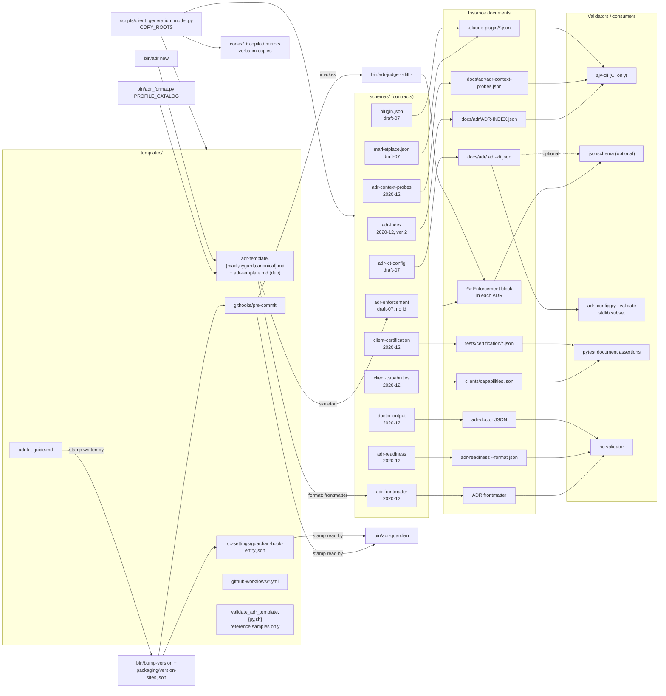

# Schemas and Templates

## Overview

- **Name**: Schemas and Templates
- **Description**: The declarative contract layer of adr-kit. Eleven JSON Schema documents pin the shape of every machine-readable artefact the kit produces or consumes (Enforcement blocks, ADR frontmatter, the generated ADR graph, the project policy file, readiness and doctor reports, client capability/certification evidence, and the two Claude Code plugin manifests). Alongside them sit the copy-out templates: three ADR body profiles (canonical, MADR, Nygard), the project-side guide, the git pre-commit wrapper, the Guardian SessionStart settings entry, two GitHub Actions workflows, and two non-executable reference samples of generated validator scripts.
- **Location**: [`schemas/`](../schemas), [`templates/`](../templates)
- **Language**: JSON Schema (draft-07 and 2020-12, mixed — see Notable findings), Markdown, Bash, YAML. One Python 3 reference sample (`templates/validate_adr_template.py`).
- **Purpose**: These files are the boundary contracts. Every other cluster in the repo either validates against a schema here or copies a template from here into a consuming project. Nothing in this cluster runs as part of normal operation except `templates/githooks/pre-commit`, which becomes a project's `.githooks/pre-commit` and is the only fail-closed gate adr-kit installs.

**Governing ADRs** (verified by parsing each ADR's `## Enforcement` block; only these three carry a `path_glob` that resolves into this cluster):

| ADR | Rule | Target | State |
|---|---|---|---|
| ADR-005 | `require_pattern` `"default"\s*:\s*"madr"` | `schemas/adr-kit-config.schema.json` | satisfied at [`schemas/adr-kit-config.schema.json:99`](../schemas/adr-kit-config.schema.json) |
| ADR-008 | `require_pattern` `_self_root` | `templates/githooks/pre-commit` | satisfied at [`templates/githooks/pre-commit:99`](../templates/githooks/pre-commit) |
| ADR-010 | `require_pattern` `"schema_version"…"const": 1` and `"claude-code-cli"…"codex-cli"…"github-copilot-cli"` | `schemas/client-capabilities.schema.json` | satisfied at lines 22–24 and 33–39 |

Two further ADRs are *adjacent*, not governing: ADR-007 governs `docs/adr/ADR-INDEX.json` — the instance document that `schemas/adr-index.schema.json` describes — and ADR-013 is cited in the `$comment` of `packaging/version-sites.json`, which registers three files in this cluster as release version sites.

## Code Elements

These are contracts, not modules. There is no importable API and only **two** callable definitions in the entire cluster, both listed below. For the eleven schemas I substituted *constraint surface* (dialect, `$id`, instance document, required fields, discriminating constraints, validator) for function signatures, as the cluster guidance directs. Every schema was read in full; nothing is summarized away.

### Callables (complete, not summarized)

| Signature | Purpose | Defined at |
|---|---|---|
| `main() -> None` (calls `sys.exit(1 if violations > 0 else 0)`) | Reference sample: reads stdin, matches each line against `FORBID_RULES`, prints `VIOLATION line N: message` to stderr | [`templates/validate_adr_template.py:25`](../templates/validate_adr_template.py) |
| `_ms_now()` — bash function, no args, prints epoch milliseconds to stdout | Portable millisecond clock for the hook's perf WARN; `date +%s%3N`, falling back to `perl -e 'print int(time()*1000)'` when BSD `date` returns the literal `%3N` | [`templates/githooks/pre-commit:173`](../templates/githooks/pre-commit) |

Module-level data in the sample validator (38 lines total): `FORBID_RULES: list[tuple[re.Pattern, str]]` at [`templates/validate_adr_template.py:20`](../templates/validate_adr_template.py) — the slot `bin/adr-generate-scripts` fills from an ADR's Enforcement block.

`templates/validate_adr_template.sh` defines **no** executable code. It is a 74-line comment block documenting the shape of the generated shell validator, and says so at [`templates/validate_adr_template.sh:9`](../templates/validate_adr_template.sh) ("It is NOT runnable as-is; `{PLACEHOLDERS}` are replaced by the generator"). Its placeholder contract is `{adr_id}`, `{patterns_block}`, `{checks_block}` (lines 71–74).

### Schema contracts — summary

| Schema | Dialect | `$id` host | Instance document(s) | Who validates it |
|---|---|---|---|---|
| [`adr-enforcement.schema.json`](../schemas/adr-enforcement.schema.json) | draft-07 | **none** | the fenced JSON inside each ADR's `## Enforcement` | `bin/adr-judge:101-112`, `bin/adr-lint:112-123` (optional `jsonschema`) |
| [`adr-frontmatter.schema.json`](../schemas/adr-frontmatter.schema.json) | 2020-12 | `rvdbreemen.github.io` | YAML frontmatter of every `docs/adr/ADR-*.md` | **nobody** (see Notable findings) |
| [`adr-index.schema.json`](../schemas/adr-index.schema.json) | 2020-12 | `github.com/rvdbreemen` | `docs/adr/ADR-INDEX.json` | ajv in `.github/workflows/validate.yml:45`; `$schema` written by `bin/adr_catalog.py:30` |
| [`adr-context-probes.schema.json`](../schemas/adr-context-probes.schema.json) | 2020-12 | `adr-kit.dev` | `docs/adr/adr-context-probes.json` | ajv in `validate.yml:48`; consumed by `bin/adr_retrieval_health.py:14` |
| [`adr-kit-config.schema.json`](../schemas/adr-kit-config.schema.json) | draft-07 | `github.com/rvdbreemen` | `docs/adr/.adr-kit.json` | `bin/adr_config.py:39-116` (stdlib subset validator, always on) + optional `jsonschema` at `bin/adr-lint:236-246` |
| [`adr-readiness.schema.json`](../schemas/adr-readiness.schema.json) | 2020-12 | `github.com/rvdbreemen` | `bin/adr-readiness --format json` output | presence-checked only (`validate.yml:69`) — see Notable findings |
| [`client-capabilities.schema.json`](../schemas/client-capabilities.schema.json) | 2020-12 | `github.com/rvdbreemen` | `clients/capabilities.json` | `tests/test_client_capabilities_schema.py` asserts on the *schema document*, not via a validator engine |
| [`client-certification.schema.json`](../schemas/client-certification.schema.json) | 2020-12 | `github.com/rvdbreemen` | `tests/certification/simulated-pass.json`, `simulated-fail.json`, `tests/certification/*/windows-native.json` | `tests/test_client_certification.py:111` (document assertions); instance checking is hand-rolled in `scripts/client_certification.py` |
| [`doctor-output.schema.json`](../schemas/doctor-output.schema.json) | 2020-12 | `github.com/rvdbreemen` | `bin/adr-doctor` JSON output | **nobody** (see Notable findings) |
| [`marketplace.json.schema.json`](../schemas/marketplace.json.schema.json) | draft-07 | `github.com/rvdbreemen` | `.claude-plugin/marketplace.json`; structurally also `.github/plugin/marketplace.json`, `.agents/plugins/marketplace.json` | ajv on the Claude manifest only (`validate.yml:42`); the other two get `jq empty` syntax checks |
| [`plugin.json.schema.json`](../schemas/plugin.json.schema.json) | draft-07 | `github.com/rvdbreemen` | `.claude-plugin/plugin.json`; structurally also `codex/.codex-plugin/plugin.json`, `copilot/plugin.json` | ajv on the Claude manifest only (`validate.yml:39`) |

### Schema contracts — what each one constrains

**`schemas/adr-enforcement.schema.json`** (50 lines) — the pre-commit rule language. Four optional top-level keys: `forbid_pattern`, `forbid_import`, `require_pattern` (arrays of `{pattern (minLength 1, required), path_glob, message}`, `additionalProperties: false` per item) at lines 6, 19, 32, and the boolean `llm_judge` at line 45. `additionalProperties: false` at line 49. The three rule arrays are structurally identical — `forbid_import` exists to document intent, not to change validation. No `$id`, no `required` list: an empty object `{}` is a valid Enforcement block.

**`schemas/adr-frontmatter.schema.json`** (136 lines) — the ADR metadata header. Ten **required** fields (lines 7–18): `id`, `title`, `status`, `date`, `binding`, `gate`, `documents_shipped`, `verified_in`, `supersedes`, `superseded_by`. Discriminators: `id`/`supersedes[]`/`superseded_by` match `^ADR-[0-9]{3,4}$`; `status` is one of six values (lines 32–39); `date` is nullable but must match `^[0-9]{4}-[0-9]{2}-[0-9]{2}$` (line 47). Six *optional* fields carry the retrieval and format layer: `format` ∈ `{madr, nygard, canonical}` (lines 92–96, "legacy records may omit it and are detected from headings"), `topics`, `aliases`, `components`, `symbols` (all `$defs/retrievalStrings`: array, `maxItems: 32`, unique, item `maxLength: 120`, lines 125–134), and `context_scope` ∈ `{global, selective}` (lines 117–120). `additionalProperties: true` — unknown frontmatter keys are tolerated by design.

**`schemas/adr-index.schema.json`** (276 lines) — the generated graph, `schema_version` pinned to `const: 2` (line 20). Two arrays: `adrs` and `relationships`. Each `adr` node requires 15 fields (lines 53–69) including `decision_summary` (`maxLength: 120`, line 114), `scope.path_globs` (line 145 — the injected-scope field), `decision_contract` (`must` / `must_not` / `exceptions` / `verification`, each `$defs/contractStrings`: `maxItems: 20`, item `maxLength: 240`, lines 221–243), and a `metadata` object mirroring the six lifecycle frontmatter fields (lines 155–198). The node `format` enum widens the frontmatter enum with `hybrid` and `unknown` (lines 83–91), and `status` adds `Unknown` (lines 93–103): the graph can represent records the frontmatter schema would reject. Each `relationship` is `{source, target, type ∈ {related, supersedes, superseded-by, amended-by}, resolved: bool}` (lines 245–273) — `resolved: false` is how dangling cross-references survive into the graph instead of failing the build.

**`schemas/adr-context-probes.schema.json`** (56 lines) — retrieval regression fixtures. `schema_version: const 1` (line 10), `probes` array `maxItems: 100`. A probe requires `id` (`^[a-z][a-z0-9-]{0,79}$`, line 37), `query` (1–1000 chars) and `expect`; optional `paths`/`components`/`symbols`/`topics` narrow the query, `limit` is 1–20 default 3 (line 44). `expect.include` / `expect.exclude` are ADR-id lists (`maxItems: 20`) — this is the only schema in the cluster that encodes *test expectations* rather than production data.

**`schemas/adr-kit-config.schema.json`** (361 lines, the largest) — `docs/adr/.adr-kit.json`. `additionalProperties: false` with a `patternProperties: {"^_": {}}` escape hatch so `_comment`/`_note` annotations validate (lines 8–10). Eleven configuration blocks: `strict_from` (`^ADR-\d{3}$`), `ignore`, `severity` (seven per-gate keys, each ∈ `{always_strict, always_advisory, advisory_before_strict_from}`, lines 25–58), `policy` (lines 60–80), `template` (`required_sections` with a `^##\s+\S` per-item pattern, and `profile` ∈ `{canonical, madr, nygard}` default `madr` at line 99 — the ADR-005 anchor), `judge` (lines 104–176; the largest block, carrying `llm_enabled`, the legacy `llm_default`, `llm_model`, a `oneOf` string-or-array `llm_cmd`, `max_diff_bytes` default 1 MiB, and four separate millisecond perf budgets), `suggest` (lines 178–206), `context` (five ranking weights, `strict_index`, `probes_file`, `retrieval_completeness` ∈ `{off, advisory, strict}`), `retirement`, `watch`, `inject` (`max_tokens` default 400), `lifecycle.auto_accept` (`mode` ∈ `{auto, assist}`, `quality_threshold` 0–1 default 0.70), and `guardian` (lines 325–358). The descriptions are unusually long because this schema doubles as the reference documentation for the config surface.

**`schemas/adr-readiness.schema.json`** (41 lines) — the readiness report. `schema_version: const 1`, plus `evaluated_on`, `adr_dir`, `summary` (requires `total`, `blocking_proposed`, `blocking_count`, `advisory_count`), `advisories`, `adrs`. Each per-ADR entry requires ten fields (lines 20–24) and the load-bearing `classification` enum has seven values (lines 27–36): `not-an-adr`, `needs-human-input`, `needs-mechanical-fix`, `ready-for-confirmation`, `accepted`, `rejected`, `supersession-required`. Note this schema is *permissive* — `summary` and `advisories` have no item schemas, so the report shape is only half-pinned.

**`schemas/client-capabilities.schema.json`** (503 lines) — the three-client outcome registry, and the strictest schema in the repo. `schema_version: const 1`. `program_scope.first_class_clients` is a `const` **array literal** `["claude-code-cli","codex-cli","github-copilot-cli"]` (lines 33–39) and `future_epic` is `const: "TASK-43"` (line 41): adding a fourth client is a schema edit by construction. `clients` is `minItems: 3, maxItems: 3` with three `allOf`/`contains` rules pinning `minContains: 1, maxContains: 1` per client id (lines 89–143). `$defs/outcome` is the seven-value vocabulary the whole certification program hangs on: `workflow-discovery`, `task-context`, `edit-governance`, `mcp`, `pre-commit`, `lifecycle`, `doctor` (lines 224–234), and each client must declare all seven in `required_outcomes` (`minItems: 7, maxItems: 7` plus seven `contains` rules, lines 422–466). `$defs/platformScope` hard-codes `windows: const "release-required"`, `macos`/`linux`: `const "best-effort"` (lines 235–253). `$defs/probes` requires exactly seven lifecycle probe strings (`detect`, `install`, `update`, `rollback`, `disable`, `remove`, `doctor`, lines 351–392). `$defs/degradation` requires a `blocks_certification` boolean — degradations are declared, not discovered.

**`schemas/client-certification.schema.json`** (101 lines) — the release evidence bundle. `records` is exactly 3 items (lines 12–17). Each record requires 21 fields (lines 50–56) and pins `surface: const "cli"`, `os: const "windows"` (line 62), `evidence_mode` ∈ `{simulated, native}`, and an optional `artifact_sha256` matching `^[0-9a-f]{64}$`. `required_outcomes`, `fixtures`, `native_smoke` and `lifecycle_preservation` are objects whose `additionalProperties` is `{"const": true}` — every declared key must literally be `true`, so a `false` cannot hide in the bundle. `benchmarks` needs ≥ 2 entries (line 88), each requiring `samples ≥ 5`, `p50_ms`/`p95_ms`/`max_ms`, `hard_timeout_ms ≥ 1`, `timed_out`, `baseline_p95_ms`, `writes` (lines 30–45).

**`schemas/doctor-output.schema.json`** (92 lines) — `bin/adr-doctor` JSON. `schema_version: const 1`, `mode` ∈ `{fast, deep}`, `overall_status` ∈ `{healthy, repaired, degraded, failed}` (line 23), a `clients` object requiring exactly `claude`/`codex`/`copilot` (lines 26–35), and `exit_code` ∈ `[0, 1]` (line 46) — the schema encodes the CLI's two-value exit contract. `$defs/status` is an eight-value enum that is deliberately wider than `overall_status`: it adds `disabled`, `trust-pending`, `stale`, `unsupported` for per-check reporting (lines 48–60). Each `check` requires ten fields with `additionalProperties: false` and an `extension` slot typed `oneOf [object, null]` for client-specific payloads.

**`schemas/marketplace.json.schema.json`** and **`schemas/plugin.json.schema.json`** (70 and 67 lines) — hand-curated schemas for the Claude Code plugin manifests, written as **regression tests for three specific historical install bugs**, which the `description` fields name explicitly: v0.7.1 (missing `marketplace.json` → `/plugin install` failed), v0.7.2 (`repository` declared as npm-style `{type, url}` object; the spec wants a plain URL string — pinned at `plugin.json.schema.json:44-48`), and a defensive rule that `author` must be an object with `name`, never a bare string (lines 28–38). Both pin kebab-case `^[a-z][a-z0-9-]*[a-z0-9]$` names and a semver `^\d+\.\d+\.\d+(-…)?(\+…)?$` version. `additionalProperties: true` on both — they guard the known failure modes rather than closing the manifest.

### ADR body-profile templates

Three shipped profiles plus one duplicate. All four carry the same 17-line frontmatter block and differ only in body headings.

| Template | `format:` | Headings that distinguish it | Selectable id |
|---|---|---|---|
| [`adr-template.canonical.md`](../templates/adr-template.canonical.md) (110 lines) | `canonical` | `## Context`, `## Decision`, `## Alternatives Considered`, `## Consequences` with `**Positive:**` / `**Negative:**` bold labels | `canonical` |
| [`adr-template.madr.md`](../templates/adr-template.madr.md) (126 lines) | `madr` | `## Context and Problem Statement` (39), `## Decision Drivers` (43), `## Considered Options` (48), `## Decision Outcome` (54) + `### Confirmation` (58), `### Positive`/`### Negative` subheadings, `## Pros and Cons of the Options` (90) | `madr` (default) |
| [`adr-template.nygard.md`](../templates/adr-template.nygard.md) (106 lines) | `nygard` | `## Context` ("forces at play in value-neutral language"), `## Decision` ("We will …"), `## Alternatives Considered` labelled *"adr-kit extension for deterministic completeness"* (77) | `nygard` |
| [`adr-template.md`](../templates/adr-template.md) (126 lines) | `madr` | **byte-identical duplicate of `adr-template.madr.md`** (both md5 `d4c524a1100a53c4c7ae0ef2ae07ae39`) | not selectable — kept as the legacy default path required by `validate.yml` |

Every profile carries the same four adr-kit extension sections regardless of upstream format: `## Status History` (a fenced `yaml` `status_history:` list), `## Decision Contract` with `### Must` / `### Must Not` / `### Exceptions` / `### Verification`, `## Open Questions`, and an optional `## Enforcement` with a fenced JSON skeleton. Only `adr-template.canonical.md:97-110` ships a *populated* `forbid_pattern` example; the other two ship empty arrays.

The profile catalog that binds ids to filenames lives outside this cluster at [`bin/adr_format.py:21-58`](../bin/adr_format.py) (`PROFILE_CATALOG`, with `template` values `adr-template.madr.md` / `adr-template.nygard.md` / `adr-template.canonical.md`) and the per-profile heading map at `bin/adr_format.py:60-106`. The template directory is resolved as `Path(__file__).resolve().parent.parent / "templates"` at [`bin/adr:295`](../bin/adr) and [`bin/adr:323`](../bin/adr).

**Placeholder substitution contract** — `adr new` performs exactly five literal replacements ([`bin/adr:311-317`](../bin/adr)), so any placeholder change here must stay in step:

| Placeholder | Replaced with |
|---|---|
| `ADR-NNN` | allocated `ADR-%03d` |
| `"Short Imperative Title"` (quoted, frontmatter) | `json.dumps(title)` |
| `Short Imperative Title` (bare, heading) | raw title |
| `YYYY-MM-DD` | `--date` |
| `user@example.com` | `--changed-by` |

### `templates/adr-kit-guide.md` (302 lines)

The canonical project-side guide, copied to a consuming project's `.claude/adr-kit-guide.md` by `/adr-kit:init`, `/adr-kit:upgrade` and `/adr-kit:setup`. Line 1 is the machine-readable version stamp `<!-- adr-kit-guide v0.42.0 -->`, registered as a release version site in `packaging/version-sites.json`. Line 3 states the hard constraint that keeps it portable: *"This file is plain markdown … Do not embed Claude-Code-specific syntax inside this file"* — it must be readable by headless `claude -p`, shell hooks and non-Claude agents, so no `@`-imports. Content covers the four operating modes, the 15 slash commands, the four verification gates, profile selection, the Enforcement rule semantics, the pre-commit knobs, supersession rules, the seven code-review checks, the nine anti-rationalisation guards, the Guardian two-tier cadence, and the ADR-004 three-tier context-injection table.

### `templates/githooks/pre-commit` (250 lines) — the only executable template

Copied to `.githooks/pre-commit` by `/adr-kit:install-hooks`; also read by `scripts/project_setup.py:218`. `set -e` at line 44, and `ADR_KIT_WRAPPER_VERSION="0.42.0"` at line 51 is the stamp `bin/adr-guardian:218` reads to detect a frozen wrapper.

Execution order:

1. **Bypass** — `ADR_KIT_HOOK_DISABLE=1` exits 0 with a notice (53–56).
2. **Python probe** — tries `python3`, `python`, `py`, parses `--version`, requires major ≥ 3; on failure prints platform-specific install hints and **exits 0** (59–78). Tooling absence never blocks a commit.
3. **Engine root ranking** (83–142) — candidate roots are the Claude cache `~/.claude/plugins/cache/rvdbreemen-adr-kit/adr-kit/*`, the Codex cache `${CODEX_HOME:-~/.codex}/plugins/cache/rvdbreemen-adr-kit-codex/adr-kit/*`, the Copilot dir `${COPILOT_HOME:-~/.copilot}/installed-plugins/rvdbreemen-adr-kit-copilot/adr-kit`, and — per **ADR-008** — the current git checkout itself when it has both `bin/adr-judge` and `.claude-plugin/plugin.json` (99–103). Each root's manifest version is read with an inline `python -c json.load` one-liner (122–126) and ranked with `sort -V`; highest wins. Missing engine → notice and **exit 0** (144–148).
4. **Empty-diff short-circuit** — `git diff --cached --name-only` empty → exit 0 (150–154).
5. **Concurrency guard** — non-blocking `flock -n` on `$ROOT/.git/adr-kit-judge.lock`; on contention the declarative pass still runs but LLM passes are suppressed via `ADR_KIT_NO_LLM` (162–169). Degrades to no-lock where `flock` is absent.
6. **Judge** (193–221) — `git diff --cached --unified=0 | "$ADR_JUDGE" --diff - --adr-dir "$ROOT/docs/adr/" --repo-root "$ROOT" --snapshot staged [--llm]`. `set -e` is deliberately lifted around this call (comment at 197–199 explains that otherwise the violation report would never print). Per-ADR `llm_judge:true` advisory lines are filtered out with `grep -avE` (208). Exit 2 gets an explicit "could not run" explanation naming the engine path and manifest version.
7. **Grill signal** (226–232) — fail-open advisory, output filtered to `^\[adr-grill\] (STRONG|ADVISORY)`.
8. **Suggest** (243–248) — fail-open advisory, `|| true`, output filtered to `^\[adr-suggest\] (This change|  )`.

Perf WARN at 211–213: elapsed > 5000 ms prints a non-blocking warning. Exit-code contract passed through from `adr-judge`: `0` clean, `1` violation, `2` config/runtime error.

Environment knobs, all documented in the header (lines 9–42): `ADR_KIT_HOOK_DISABLE`, `ADR_KIT_LLM`, `ADR_KIT_NO_LLM`, `ADR_KIT_SUGGEST`, `ADR_KIT_SUGGEST_DISABLE`, `ADR_KIT_OVERRIDE` (audited single-ADR override, empty reason refused, logged to `docs/adr/.adr-kit-overrides.jsonl`), `CODEX_HOME`, `COPILOT_HOME`.

### `templates/cc-settings/guardian-hook-entry.json` (9 lines)

A single `SessionStart` hook entry to splice into a project's `.claude/settings.json`. `_remove_marker: "adr-guardian-session-start"` (line 4) is declared as the idempotent-removal handle for `/adr-kit:install-hooks --uninstall`, but a repo-wide grep finds **no reader** for that key outside the `codex/`/`copilot/` mirrors — see Notable findings. `_wrapper_version: "0.42.0"` (line 5) *is* read, by `bin/adr-guardian:295`. The `command` (line 7) is a one-liner that globs the plugin cache, `sort -V | tail -1` for the newest, probes `python3|python|py`, runs `bin/adr-guardian check`, and ends in `|| true` — fail-open by construction. `timeout: 10`.

### GitHub workflow templates

| File | Trigger | What it does |
|---|---|---|
| [`github-workflows/adr-readiness.yml`](../templates/github-workflows/adr-readiness.yml) (18 lines) | `pull_request` | Delegates entirely to the composite action `rvdbreemen/adr-kit/.github/actions/adr-readiness@v0.37.0` with `adr-dir: docs/adr`. `permissions: contents: read`. |
| [`github-workflows/adr-guardian-audit.yml`](../templates/github-workflows/adr-guardian-audit.yml) (133 lines) | weekly cron `0 6 * * 1` + `workflow_dispatch` | Checks the consuming repo out, then checks adr-kit out into `.adr-kit/` at `ADR_KIT_REF` (default `main`), sets up Python 3.11, runs the free cheap tier (`adr-lint` → rc captured; `adr-retire --format markdown`; `adr-status --format markdown`), assembles one markdown report, and maintains a single tracking issue titled "ADR guardian audit" via `gh issue list/edit/create/close`. Stated invariants (lines 16–18): never runs an LLM, always succeeds, no secrets beyond `GITHUB_TOKEN`. `permissions: contents: read, issues: write`. |

## Dependencies

**Internal** (this cluster is a leaf — it imports nothing; these are the modules that reach *into* it):

- [`bin/adr_format.py:21-58`](../bin/adr_format.py) — profile catalog mapping `madr`/`nygard`/`canonical` to the three template filenames; heading map at 60–106.
- [`bin/adr:295`](../bin/adr), [`bin/adr:323`](../bin/adr) — resolves `templates/`; `adr new` substitutes placeholders (311–317), `adr profiles` reports `available` per template.
- [`bin/adr_config.py:39-116`](../bin/adr_config.py) — stdlib JSON Schema *subset* validator; `DEFAULT_CONFIG_SCHEMA` at 149–151 points at `schemas/adr-kit-config.schema.json`.
- [`bin/adr-judge:101-112`](../bin/adr-judge), [`bin/adr-lint:112-123`](../bin/adr-lint) — compile `schemas/adr-enforcement.schema.json` into a cached `Draft7Validator` when `jsonschema` is importable; `bin/adr-lint:234-246` validates `.adr-kit.json` the same way, with a manual `additionalProperties` fallback at `bin/adr-lint:914`.
- [`bin/adr_catalog.py:30`](../bin/adr_catalog.py) — `GRAPH_SCHEMA_REF = "../../schemas/adr-index.schema.json"`, stamped into every generated `ADR-INDEX.json`.
- [`bin/adr-guardian:218`](../bin/adr-guardian), `:295`, `:331-348` — reads the two template version stamps to report copied-artifact staleness.
- [`bin/bump-version:62`](../bin/bump-version) and [`packaging/version-sites.json`](../packaging/version-sites.json) — write the stamps in `templates/githooks/pre-commit`, `templates/cc-settings/guardian-hook-entry.json` and `templates/adr-kit-guide.md`.
- [`scripts/client_generation_model.py:31`](../scripts/client_generation_model.py) — `COPY_ROOTS = ("bin", "schemas", "templates", "instructions")`: both directories are mirrored verbatim into `codex/` and `copilot/`.
- [`scripts/project_setup.py:218`](../scripts/project_setup.py) — installs the pre-commit template into a project.
- [`bin/adr_retrieval_health.py:14`](../bin/adr_retrieval_health.py) — `DEFAULT_PROBE_FILE = "adr-context-probes.json"`.
- Tests: `tests/test_selectable_formats.py` (52, 171–191), `tests/test_client_capabilities_schema.py`, `tests/test_client_certification.py:111`, `tests/test_adr_index.py:150`, `tests/test_adr_query.py:202,565`, `tests/test_adr_guardian_artifacts.py:36`, `tests/test_bump_version.py:252`, `tests/test_documentation_contracts.py:13,202`, `tests/test_packaging_contract.py:22`, `tests/test_adr_retrieval_health.py`.

**External** — nothing in this cluster requires a third-party package at runtime.

- `ajv-cli` + `ajv-formats` (npm, Node 20) — CI only, `.github/workflows/validate.yml:31-48`. The only real JSON Schema engine in the project.
- `jsonschema` (PyPI) — **optional**, imported inside `try/except ImportError` at `bin/adr-judge:101`, `bin/adr-lint:112`, `bin/adr-lint:236`; `pip install`ed only in `.github/workflows/adr-lint-self.yml:22`. Absent → validation silently degrades to hand-rolled checks.
- External CLIs reachable from the hook template: `git`, `python3|python|py` (required), `flock` (optional, guard degrades), `perl` (macOS `%3N` fallback), `sort -V`, `grep`, `date`. `claude` is invoked only transitively, by `adr-judge`/`adr-suggest`.
- `gh` and `jq` — `gh` in the guardian-audit workflow template; `jq` in the repo's own `validate.yml`, not in any template.
- OS services: filesystem globbing of platform-specific plugin cache paths (`~/.claude`, `${CODEX_HOME:-~/.codex}`, `${COPILOT_HOME:-~/.copilot}`) and an advisory POSIX file lock under `.git/`.

## Interfaces

**Copy-out surface** (a template becomes a live file in a consuming project):

| Template | Destination | Installer |
|---|---|---|
| `templates/githooks/pre-commit` | `.githooks/pre-commit` | `/adr-kit:install-hooks`, `scripts/project_setup.py:218` |
| `templates/cc-settings/guardian-hook-entry.json` | an entry under `hooks.SessionStart[0].hooks[]` in `.claude/settings.json` | `/adr-kit:install-hooks`, `/adr-kit:upgrade` |
| `templates/adr-kit-guide.md` | `.claude/adr-kit-guide.md` | `/adr-kit:init`, `/adr-kit:upgrade`, `/adr-kit:setup` |
| `templates/adr-template.{madr,nygard,canonical}.md` | `docs/adr/ADR-NNN-<slug>.md` | `python bin/adr new "Title" [--profile <id>]` |
| `templates/github-workflows/*.yml` | `.github/workflows/…` | manual copy-paste (documented in the file headers) |

**CLI reaching this cluster:**

- `python bin/adr new "<title>" --adr-dir docs/adr [--profile madr|nygard|canonical] [--date YYYY-MM-DD] [--changed-by <who>]` — instantiates a template.
- `python bin/adr profiles --format json` — returns `{default, all_templates_available, profiles[{id, label, preferred, template, available, best_for, trade_off}]}`; `available` is a filesystem check against `templates/`.
- `ajv validate -s schemas/<name>.schema.json -d <instance> --spec=draft7|draft2020 -c ajv-formats` — the CI validation call shape; the `--spec` flag differs per schema because the dialects differ.
- `python bin/adr-guardian artifacts [--format json]` — reports the two copied-artifact version stamps.

**JSON contracts produced/consumed** (schema → instance): see the summary table above. `docs/adr/ADR-INDEX.json` and `docs/adr/adr-context-probes.json` both self-declare `"$schema": "../../schemas/adr-index.schema.json"` / `"…/adr-context-probes.schema.json"` — relative refs, so the schema directory must ship alongside the ADR directory.

**Exit-code conventions defined here:**

- Pre-commit template: `0` = proceed (including every fail-open degradation path), non-zero = the judge's own code (`1` violation, `2` config/runtime error).
- `templates/validate_adr_template.py`: `0` clean, `1` violations found (stderr carries `VIOLATION line N: …`).
- `schemas/doctor-output.schema.json:46` pins the doctor CLI to `exit_code ∈ [0, 1]` — an exit-code contract expressed as a schema.

## Relationships

## Notable Findings

1. **Mixed JSON Schema dialects inside one directory.** Four schemas declare draft-07 (`adr-enforcement`, `adr-kit-config`, `marketplace.json`, `plugin.json`), seven declare 2020-12. That is why `.github/workflows/validate.yml` passes `--spec=draft7` for two calls and `--spec=draft2020` for two others (lines 39–48). The `$id` values are equally inconsistent: `adr-enforcement.schema.json` has **no `$id` at all**, and the other ten split across three hosts — `github.com/rvdbreemen` (8), `rvdbreemen.github.io` (frontmatter), `adr-kit.dev` (context-probes). I did not verify whether any of those URLs resolve; every in-repo reference uses a relative path (`"../../schemas/…"`), so the `$id` values are decorative as far as this repository is concerned.

2. **`adr-kit-config.schema.json` is co-designed with a hand-rolled validator.** [`bin/adr_config.py:39-116`](../bin/adr_config.py) implements a JSON Schema *subset* in the stdlib: `type`, `enum`, `minLength`, `pattern`, `minItems`, `items`, `minimum`, `maximum`, `required`, `properties`, `patternProperties`, `additionalProperties`, `oneOf` — and nothing else. The config schema uses **exactly zero** constructs outside that subset (verified: no `const`, `$ref`, `$defs`, `uniqueItems`, `maxItems`, `maxLength`, `allOf`, `anyOf`, `contains`, `format`). Neither file states this coupling, but it is load-bearing: a new constraint expressed with any of those keywords would be enforced only where the optional `jsonschema` package is installed (`bin/adr-lint:236-246` runs a full `jsonschema.validate(cfg, schema)`; `adr-lint-self.yml:22` installs it in CI) and silently skipped everywhere else, because the always-on stdlib path cannot see it. Every *other* schema leans on `$ref`/`$defs`/`const`/`contains`, so none of them can be checked by the stdlib path — only by ajv in CI or by the optional `jsonschema` package.

3. **Two schemas have zero consumers.** `adr-frontmatter.schema.json` and `doctor-output.schema.json` are referenced by no test, no ajv step, no runtime reader, and are not even in `validate.yml`'s required-files list. `adr-readiness.schema.json` is presence-checked only. `client-capabilities`/`client-certification` do have dedicated tests, but those tests assert on the *schema document's own JSON* (e.g. `tests/test_client_capabilities_schema.py:31-43` reads `schema["properties"]["schema_version"]["const"]`); the instance documents are checked by hand-rolled Python in `scripts/`. No JSON Schema engine ever evaluates either one.

4. **The frontmatter contract is duplicated in Python with no lockstep guard.** [`bin/adr_schema.py:23-46`](../bin/adr_schema.py) re-declares the same contract as `FRONTMATTER_FIELD_ORDER` (the 10 required fields, in the schema's exact order), `OPTIONAL_FRONTMATTER_FIELD_ORDER`, `VALID_STATUSES` (the 6-value status enum) and `VALID_CONTEXT_SCOPES`. Nothing ties the two together — grep finds no test importing both. Combined with finding 3, `schemas/adr-frontmatter.schema.json` is effectively documentation while `bin/adr_schema.py` is the operative contract.

5. **`templates/adr-template.md` is a byte-identical duplicate of `templates/adr-template.madr.md`** (both md5 `d4c524a1100a53c4c7ae0ef2ae07ae39`). Both ship, and `validate.yml` requires the un-suffixed one. A *fifth*, divergent ADR template lives outside this cluster at `examples/ADR-template.md` (also required by `validate.yml`): it uses `id: "ADR-XXX"`, an unquoted `status`, and omits every optional retrieval field (`format`, `topics`, `aliases`, `components`, `symbols`, `context_scope`). It still satisfies `adr-frontmatter.schema.json`'s required set, but an ADR authored from it carries no selective-context metadata.

6. **Version-stamp asymmetry.** `packaging/version-sites.json` registers three files in this cluster as version sites, but `bin/adr-guardian` only detects staleness for two: the pre-commit wrapper (`_WRAPPER_STAMP_RE` at `bin/adr-guardian:218`) and the settings entry (`_wrapper_version` at `bin/adr-guardian:295`). The `<!-- adr-kit-guide v0.42.0 -->` stamp at `templates/adr-kit-guide.md:1` has **no detector** — and this repository's own deployed copy demonstrates the consequence: `.claude/adr-kit-guide.md` is 192 lines against the template's 302, carries no stamp at all, and is missing six slash-command rows (`grill`, `context`, `review`, `related`, `supersede`, `retire`) plus the profile-selection, migration-discovery and context-injection (ADR-004) sections. A stale project guide is exactly the drift the stamps exist to catch.

7. **`_remove_marker` is a declared-but-unread key.** `templates/cc-settings/guardian-hook-entry.json:4` sets `"_remove_marker": "adr-guardian-session-start"` as the uninstall handle, yet a repo-wide grep finds no reader for it outside the `codex/`/`copilot/` mirrors — not in `bin/`, `scripts/`, or `skills/install-hooks/SKILL.md`. Whatever makes uninstall idempotent, it is not this field.

8. **The copy-paste readiness workflow ships a five-release-old action pin.** `templates/github-workflows/adr-readiness.yml:16` pins `rvdbreemen/adr-kit/.github/actions/adr-readiness@v0.37.0` while the repo is at 0.42.0. `packaging/version-sites.json` registers the README's `adr-judge@vX.Y.Z` pin as a version site but **not** this template's pin, so `bin/bump-version` never advances it. Downstream users copying the template get v0.37.0 behaviour.

9. **Byte-level mirror comparison is EOL-fragile on Windows.** `scripts/client_generation_model.py:31` copies `schemas/` and `templates/` verbatim into `codex/` and `copilot/`, and `scripts/client_generation.py:158-162` compares them with `read_bytes()`. `.gitattributes:11` pins only `templates/githooks/*` to `eol=lf`. On this Windows checkout the sources come out CRLF while the mirrors are LF: comparing all 22 in-scope files against both mirrors gives **32 EOL-only differences and 0 content differences**. A byte comparison therefore reports adapter drift where none exists; normalizing `\r\n` → `\n` first makes it clean.

10. **The installed hook is fail-open in five distinct places, by design.** Missing Python (`templates/githooks/pre-commit:71-78`), no engine root (144–148), empty staged diff (150–154), lock contention (162–169, LLM suppressed but declarative pass kept), and both advisory passes (226–232, 243–248) all exit 0 or swallow status. Only `adr-judge`'s own exit code propagates (line 221). The one thing that can block a commit is the declarative rule pass — everything else degrades quietly.

11. **The client contract is closed by construction, not by convention.** `client-capabilities.schema.json` encodes the three-client roster as a `const` array literal (lines 33–39), pins `clients` to `minItems: 3, maxItems: 3` with `minContains/maxContains: 1` per id, requires all seven `outcome` values per client, and even freezes the expansion epic as `future_epic: const "TASK-43"`. `client-certification.schema.json` mirrors it with `records` fixed at 3 and `os: const "windows"`. Adding a fourth client is a schema edit plus a test edit — which is the intent recorded in ADR-010, but it means the schema is a release gate, not just a description.
