# Test Suite

## Overview

- **Name**: Test Suite (`tests`)
- **Description**: One flat pytest suite — 71 modules, 806 test functions
  collecting as 903 tests, 35 test classes, ~19,900 lines — certifying every
  deterministic surface of adr-kit. It is dominated by black-box subprocess
  tests that invoke the extensionless `bin/adr-*` CLIs and assert on their JSON
  contracts and exit codes, supplemented by white-box tests that load those same
  extensionless scripts through `importlib.machinery.SourceFileLoader` or
  `runpy.run_path`. Around the modules sit five fixture families: ADR-lint
  control directories, format-profile fixtures, machine-readable contract
  corpora (client contracts, latency budgets, grill conversation shapes), a
  `tests/certification/` directory of committed per-client certification
  evidence, and a frozen 169-ADR GPLv3 real-world corpus in
  `tests/testsets/otgw-firmware/`.
- **Location**: [`tests/`](../tests) — [`tests/fixtures/`](../tests/fixtures),
  [`tests/certification/`](../tests/certification),
  [`tests/testsets/otgw-firmware/`](../tests/testsets/otgw-firmware)
- **Language**: Python 3 (stdlib only plus `pytest`, the sole development
  dependency); fixtures are JSON and Markdown; one GPLv3 `LICENSE` text file
- **Purpose**: Lock down the behavioural contract of every CLI, hook, MCP
  server, installer and generator so the shipped artefacts (plugin manifests,
  hook manifests, client adapters, templates, generated indexes) cannot drift
  from their documented shape without a test failing. A large share of the suite
  is not unit testing at all but **artefact-contract testing**: it reads
  `README.md`, `.github/workflows/*.yml`, `clients/*.json`, `skills/*/SKILL.md`
  and `templates/**` and asserts on their content.

### Scale, in one table

| Metric | Value |
| --- | --- |
| Test modules (`tests/test_*.py`) | 71 |
| Test functions (`def test_*`) | 806 |
| **Tests actually collected** | **903** (`python -m pytest --collect-only -q`, 3.15 s) — 28 `@pytest.mark.parametrize` decorators expand the 806 definitions; `test_selectable_formats.py:446-447` alone is a 3×3 cross-product |
| Test classes | 35, in 8 modules |
| Lines of test code | 19,906 |
| `conftest.py` / `tests/__init__.py` | `tests/conftest.py` exists and carries exactly one fixture (the session-start working-tree snapshot, TASK-128); `tests/__init__.py` still does not exist |
| Modules importing `pytest` | 34 of 71 (the other 37 use bare `assert`) |
| `@pytest.mark.slow` uses | 4 (3 in `test_adr_performance.py`, 1 in `test_client_generator_performance.py`) — and **CI does not skip them** |
| Fixture / corpus files | 29 JSON+Markdown fixtures, 5 certification records, 169 corpus ADRs |

## Test taxonomy

Derived from module content, not filenames. Several names are misleading:
`test_adr_audit.py` tests the *codebase scanner* `bin/adr-audit` (not an audit
gate), `test_adr_generate_scripts.py` tests standalone-validator code
generation, `test_settings.py` tests `scripts/adr_settings.py` layered
configuration, `test_branch_sync.py` tests a release-hygiene script, and
`test_documentation_contracts.py` asserts on prose in `README.md` and
`INSTALL-AGENT.md`.

The ten families below partition all 71 modules exactly once (6+9+8+5+6+8+14+5+4+6 = 71).

| Family | Modules | What it exercises |
| --- | ---: | --- |
| **Quality gates** — lint, policy, quality scoring | 6 | `bin/adr-lint` gate matrix (schema, completeness, audit, evidence, clarity, consistency, policy), `strict_from` severity policy, file-level skip/advisory markers, `bin/adr-quality` A–D grading |
| **Enforcement / judge** — the fail-closed floor | 9 | `bin/adr-judge` declarative rules, the opt-in LLM pass with a fake `claude` binary, `bin/adr-suggest` advisory detector, prompt-injection fencing, ReDoS containment, git-diff decoding, `ADR_KIT_OVERRIDE` audit trail, the `bin/adr-judge-precommit` wrapper |
| **Lifecycle & status** | 8 | `bin/adr` propose/accept/reject/supersede/document transactions with rollback, `## Status History` parse/append/migrate, `bin/adr-status` dashboard + coverage buckets, `bin/adr-doctor` health, `bin/adr-renumber`, `bin/adr-retire` |
| **Retrieval & index** | 5 | `bin/adr-index` schema-v2 node/edge graph, `bin/adr-context` ranking, `adr_query.query_adr_context` index-first engine with visible Markdown fallback, `adr-related` edge graph, probe-based retrieval health |
| **Readiness & grilling** | 6 | `adr_readiness` classification matrix, `bin/adr-readiness-ci` GitHub annotations/escaping, `adr_grill_signal`, and *skill-prose contracts* for `skills/grill`, `skills/adr`, `skills/review` |
| **Guardian, hooks & runtime config** | 8 | `bin/adr-guardian` two-tier staleness detector (always exit 0), state atomicity and concurrency, copied-artifact version stamps, `bin/adr-watch`, the normalized hook protocol in `hooks/adr_hook_core.py` + the `hooks/adapters/` package, the Windows native `adr-hook.exe` parity check, fail-closed `.adr-kit.json` validation |
| **Clients, packaging & release** | 14 | three-client capability schema, deterministic adapter generation and drift checks, certification-bundle validation, the agent installer transaction/lock/rollback model, git-index exec-bit and `git archive` mode contracts, release allowlist + maintainer-path leak scan, version-site registry, `bin/bump-version`, branch sync, managed instruction markers, layered settings, documentation contracts |
| **Formats & migration** | 5 | selectable `madr`/`nygard`/`canonical` profiles, round-trip migration idempotence, legacy-family discovery (Y-statement, Tyree-Akerman, arc42), hybrid rejection, the `adr-audit` codebase scanner |
| **Performance budgets** | 4 | ADR-015 CLI latency corpus + structural single-pass guards, hook latency method, client-generation benchmark, judge profiling and wall-clock budgets |
| **Runtime environment, MCP, generators & corpus** | 6 | Python 3.10 grammar floor, the pre-commit hook's Python-detection bash block, the JSON-RPC MCP server, standalone-validator generation, and the frozen 169-ADR real-world corpus |

## Code Elements

### The module-loading layer (the suite's real architecture)

There is **no `tests/__init__.py`**, which is why the helper modules are
imported top-level (`from adr_fixtures import ...`) and never as `tests.adr_fixtures`.
`tests/conftest.py` exists but is deliberately narrow: one session-scoped
`tree_snapshot` fixture, added by TASK-128 so the client-generator drift check
stops asserting on a tree other tests write to. `pytest.ini`
([`pytest.ini`](../pytest.ini)) sets `pythonpath = .` and declares exactly one
marker (`slow`). Everything else — importing the extensionless `bin/adr-*`
scripts, putting `bin/`, `hooks/`, `scripts/` on `sys.path`, sharing helper
functions — is done by **duplicated boilerplate inside individual test modules**.
45 of the 71 modules carry one of four idioms:

| Idiom | Modules | Why | Representative anchor |
| --- | ---: | --- | --- |
| `importlib.machinery.SourceFileLoader` + `spec_from_loader` | 14 | `bin/adr-status`, `bin/adr-watch`, `bin/adr-guardian` etc. have no `.py` suffix, so `spec_from_file_location` returns `None` on some Python versions | [`tests/test_adr_status.py:27`](../tests/test_adr_status.py#L27), [`tests/test_adr_watch.py:40`](../tests/test_adr_watch.py#L40) |
| `importlib.util.spec_from_file_location` | 14 | used for real `.py` modules under `bin/` and `scripts/` | [`tests/test_adr_doctor.py:19`](../tests/test_adr_doctor.py#L19), [`tests/test_client_adapter_generation.py:17`](../tests/test_client_adapter_generation.py#L17) |
| `runpy.run_path` (returns a namespace `dict`, not a module) | 6 | grabs private functions and module constants such as `ENFORCEMENT_BLOCK_RE` without registering a module | [`tests/test_adr_retire.py:13`](../tests/test_adr_retire.py#L13), [`tests/test_cli_performance.py:24`](../tests/test_cli_performance.py#L24) |
| `sys.path.insert(0, …)` then a plain `import` | 17 | for genuine importable packages/modules (`bin/adr_query.py`, `hooks/adr_hook_core.py`, `scripts/version_sites.py`, `clients/installer/*`) | [`tests/test_adr_query.py:19`](../tests/test_adr_query.py#L19), [`tests/test_hook_protocol.py:19`](../tests/test_hook_protocol.py#L19) |

`test_adr_index.py:20` is the closest thing to a shared loader — a local
`_load(name, path)` that is then called seven times to import `adr-index`,
`adr-watch`, `adr_schema.py`, `adr-judge`, `adr-lint`, `adr-retire` and
`adr_catalog.py` side by side so their status readers can be compared:

```python
def _load(name: str, path: Path):   # tests/test_adr_index.py:20
```

`test_adr_quality.py:31` documents a subtle constraint of the idiom — the module
must be registered in `sys.modules` **before** `exec_module`, otherwise
`@dataclass` on Python 3.13+ cannot resolve `cls.__module__`.

### Cross-module and cross-repo public surface

The genuine importable surface of this cluster is small. Only one test module is
imported by other test modules, making it a de facto fixture library:

| Symbol | Full signature | Defined at | Imported by |
| --- | --- | --- | --- |
| `_write_adr` | `_write_adr(adr_dir: Path, num: int, *, status: str = "Proposed", open_questions: str = "None.", verified_in: list[str] \| None = None) -> Path` | [`tests/test_adr_readiness.py:30`](../tests/test_adr_readiness.py#L30) | [`test_adr_open_questions.py:9`](../tests/test_adr_open_questions.py#L9), [`test_adr_readiness_ci.py:21`](../tests/test_adr_readiness_ci.py#L21), [`test_adr_guardian_queue.py:26`](../tests/test_adr_guardian_queue.py#L26) |

Everything else that tests import comes from **outside** `tests/` (all reached
via `sys.path` manipulation, not packaging):

| Import | Source module | Consumed by |
| --- | --- | --- |
| `render_frontmatter`, `split_frontmatter`, `parse_frontmatter`, `validate_frontmatter` | `bin/adr_schema.py` | `test_adr_query.py`, `test_adr_readiness.py`, `test_adr_retrieval_health.py`, plus `_load_schema_module()` copies in `test_adr_lifecycle/doctor/migrate/auto_accept/lint_governance` |
| `IndexQueryError`, `query_adr_context` | `bin/adr_query.py` | `test_adr_query.py:21` |
| `FINDING_CODES`, `READINESS_CLASSES`, `architecture_advisories`, `build_readiness_report`, `implementation_evidence`, `readiness_for_record` | `bin/adr_readiness.py` | `test_adr_readiness.py:19` |
| `annotations`, `github_escape`, `output_values`, `render_summary` | `bin/adr_readiness_ci.py` | `test_adr_readiness_ci.py:15` |
| `load_probes`, `run_retrieval_health` | `bin/adr_retrieval_health.py` | `test_adr_retrieval_health.py:14` |
| `atomic_save_state`, `update_state` | `bin/adr_state.py` | `test_adr_guardian_state.py:33` |
| `RegexEvaluator`, `RegexTimeoutError` | `bin/adr_regex.py` | `test_adr_regex_safety.py:98` |
| `DEFAULT_PROFILE`, `PROFILE_CATALOG`, `PROFILE_HEADINGS`, `SUPPORTED_PROFILES`, `AdrFormatError`, `classify_format`, `convert_profile`, `detect_legacy_profile`, `detect_profile`, `profile_catalog`, `profile_template_path`, `required_headings`, `section_text`, `unresolved_open_questions` | `bin/adr_format.py` | `test_selectable_formats.py:21`, `test_migration_discovery.py:21`, `test_adr_open_questions.py:12` |
| `build_queue_cache`, `load_queue_actions`, `rank_proposed`, `write_queue_cache` | `bin/adr_guardian_queue.py` | `test_adr_guardian_queue.py:19` |
| `analyze_index` | `bin/adr_grill_signal.py` | `test_adr_grill_signal.py:15` |
| `check_mcp_launcher`, `check_hook_package` | `bin/adr_doctor_checks.py` | `test_client_doctor.py:23`, `test_native_client_packages.py:14` |
| `benchmark_extension` | `bin/adr_doctor_models.py` | `test_client_doctor.py:24` |
| `_mcp_deep`, `classify_model_probe` | `bin/adr_doctor_probes.py` | `test_client_doctor.py:25` |
| `MAX_CONTEXT_CHARS`, `MAX_INPUT_BYTES`, `evaluate`, `parse_payload` | `hooks/adr_hook_core.py` | `test_hook_protocol.py:22`, `test_adr_grill_signal.py:16`, `test_adr_guardian_queue.py:25` |
| `ADAPTERS` (dict of client-id → render function) | `hooks/adapters/` package (`__init__.py` + `claude.py`, `codex.py`, `copilot.py`) | `test_hook_protocol.py:21` |
| `METHOD_ID`, `measure` | `hooks/hook_benchmark.py` | `test_hook_performance.py:16` |
| `client_evidence` (as `EVIDENCE`) | `scripts/client_evidence.py` | `test_client_certification.py:18` |
| `check`, `load_registry`, `read_all`, `read_canonical` | `scripts/version_sites.py` | `test_version_sites.py:21` |
| `DetectedClient`, `detailed_detection`, `build_plan`, `render_plan`, `client_lock`, `run_transaction`, `payload_digest`, `remove_owned_payloads`, `record_update_state`, `update_decision` | `clients/installer/{contracts,detection,planning,transaction,payload,updates}.py` | [`test_agent_installer.py:16-21`](../tests/test_agent_installer.py#L16) |

### Test classes — the full enumerated surface

35 classes in 8 modules. They are plain grouping containers (no base class, no
`__init__`, no shared state — pytest instantiates one per test), so the
"signature" is the bare name; what carries information is which invariant each
one owns.

| Class | Defined at | Owns |
| --- | --- | --- |
| `TestCwdGuard` | `tests/test_adr_guardian.py:100` | silent exit 0 when no `docs/adr/` with ADRs, or guardian disabled |
| `TestDueTiers` | `tests/test_adr_guardian.py:130` | cheap-daily / llm-bi-weekly tier clocks across both `last_run` values |
| `TestNudgeCooldown` | `tests/test_adr_guardian.py:216` | `nudge_cooldown_hours` throttle, including `0` = always nudge |
| `TestRetireNudge` | `tests/test_adr_guardian.py:272` | the detector *displays* stamped retire counts; diffing against `retire_seen` is the skill's job, not the binary's |
| `TestStamp` | `tests/test_adr_guardian.py:326` | `stamp cheap|llm` writes only its own tier and preserves the other |
| `TestStateCmd` | `tests/test_adr_guardian.py:415` | `state` prints defaults when no file exists |
| `TestAlwaysExit0` | `tests/test_adr_guardian.py:449` | the headline invariant: corrupt state, corrupt config, empty dir → still 0 |
| `TestOutputFormat` | `tests/test_adr_guardian.py:486` | `[adr-guardian]` block content and the two JSON envelope shapes |
| `TestTrendStamp` | `tests/test_adr_guardian.py:573` | append-only `trend`, 52-entry cap, cross-tier field carry-over, corrupt-value reset |
| `TestTrendDelta` | `tests/test_adr_guardian.py:688` | the one-line `trend: drift 2 -> 0` delta, absent with 0 or 1 entries |
| `TestAtomicWrite` | `tests/test_adr_guardian_state.py:72` | `atomic_save_state` survives a stray `.tmp` from a dead writer |
| `TestCorruptState` | `tests/test_adr_guardian_state.py:111` | corrupt/non-dict JSON → `DEFAULT_STATE` + one warning, file left in place |
| `TestInterleavedStamps` | `tests/test_adr_guardian_state.py:165` | two `update_state` transactions preserve each other's keys |
| `TestWorkflowStructure` | `tests/test_adr_guardian_state.py:217` | parameterised over self + downstream `adr-guardian-audit.yml`: required keys, never runs an LLM, only `github.token` |
| `TestContextRows` | `tests/test_adr_index.py:104` | one row per ADR, schema-v2 graph shape, byte-identical reruns |
| `TestContextSelfGuard` | `tests/test_adr_index.py:301` | empty dir exits 0; malformed frontmatter falls back to invariant prose |
| `TestNoDriftWithWatch` | `tests/test_adr_index.py:331` | index readers must agree with `adr-watch` |
| `TestStatusReaderUnification` | `tests/test_adr_index.py:350` | all five status readers delegate to `adr_catalog.adr_status` (the PR #38 forked-regex fix) |
| `TestReadmeMode` | `tests/test_adr_index.py:453` | README sentinel round-trip, `--check` idempotence, stale-graph detection, duplicate ids |
| `TestNormalizeAdrId` | `tests/test_adr_related.py:134` | `adr-7` / `7` / `ADR-0430` normalisation and rejection |
| `TestOutbound` | `tests/test_adr_related.py:155` | declared outbound edge kinds; prose mentions are not outbound |
| `TestInbound` | `tests/test_adr_related.py:186` | inbound edges including `mention`; no self-edges |
| `TestDangling` | `tests/test_adr_related.py:212` | unresolved refs flagged with `exists: false` and `DANGLING` in human output |
| `TestWholeToken` | `tests/test_adr_related.py:234` | `ADR-0430` is never read as a reference to `ADR-043` |
| `TestCli` | `tests/test_adr_related.py:257` | exit-2 paths (unknown id, invalid id, missing dir) and the JSON edge schema |
| `TestCoveragePct` | `tests/test_adr_status_coverage.py:106` | coverage over Accepted only; empty/broken blocks don't count |
| `TestOutputFormats` | `tests/test_adr_status_coverage.py:180` | additive-only output: pre-existing summary keys unchanged |
| `TestFloorBuckets` | `tests/test_adr_status_coverage.py:223` | the ADR-004 declarative / manual-review / no-enforcement split |
| `TestEnforcementMatch` | `tests/test_adr_watch.py:165` | `path_glob` nudges, Proposed ignored, absolute paths relativised, ≤ 3 nudges |
| `TestKeywordRelevance` | `tests/test_adr_watch.py:215` | keyword fallback when no glob matches |
| `TestCooldown` | `tests/test_adr_watch.py:234` | per-(ADR, file) cooldown under the `watch` state key; guardian keys preserved |
| `TestSelfGuard` | `tests/test_adr_watch.py:296` | no ADR dir, empty dir, no paths, disabled, corrupt state, malformed Enforcement |
| `TestHookMode` | `tests/test_adr_watch.py:348` | `--hook` PostToolUse payload parsing and envelope selection |
| `TestPerformance` | `tests/test_adr_watch.py:395` | 50 ADRs scored in-process within the warm-median budget |
| `TestPreEditInject` | `tests/test_adr_watch.py:451` | the ADR-004 `--pre-edit` injector: glob beats keyword, token-budget truncation, separate `inject` cooldown key |

### Per-module inventory

**Aggregation note:** the 806 `def test_*` functions are documented in aggregate
per module below (count + subject + notable invariants), not enumerated one by
one. That is deliberate: each is a `(tmp_path)`-parameterised no-return
procedure, so a per-function signature table would carry no information beyond
its name. Private module-level helpers (`_run*`, `_make_project`, `_write_adr`,
`_adr`, `_load*`, `_project`, `_git`) are likewise summarised — they follow a
uniform per-module shape: build a throwaway ADR tree in `tmp_path`, shell out to
`[sys.executable, <bin script>, …]`, parse JSON stdout, return
`(returncode, payload)`. Anything genuinely load-bearing is quoted with its
`file:line`.

#### Quality gates

| Module | Tests | Subject and notable invariants |
| --- | ---: | --- |
| [`test_adr_lint.py`](../tests/test_adr_lint.py) | 15 | `bin/adr-lint` end-to-end via `run_lint(*args)` ([:16](../tests/test_adr_lint.py#L16)). Drives every fixture directory in `tests/fixtures/`. Pins the exit-code contract: `0` clean/advisory, `1` FAIL, `2` config error / unknown gate / missing path. Asserts the summary shape `{"pass","advisory","fail","skipped","total"}` |
| [`test_adr_lint_clarity.py`](../tests/test_adr_lint_clarity.py) | 6 | The clarity gate's unexpanded-ALL-CAPS-acronym check, bounded by three refinements (allowlist, `expansion (ACRONYM)` word order, frontmatter exempt). Detail list capped at 5, summary counts all. Ends by asserting the repo's own ADR-006/ADR-007 pass the full acceptance gate set — dogfooding. Verifies ADR-009 |
| [`test_adr_lint_governance.py`](../tests/test_adr_lint_governance.py) | 6 | `--strict` frontmatter validation: missing frontmatter is a `schema` FAIL; `status: Superseded` requires `superseded_by`; `supersedes` must reciprocate; `verified_in: "src/app.py:symbol"` must resolve on disk; `binding: true` requires a named `gate` findable locally |
| [`test_adr_lint_supersession.py`](../tests/test_adr_lint_supersession.py) | 7 | Concurrent supersession (two Accepted ADRs claiming the same target) FAILs every claimant and names all files; one-directional supersession FAILs; the victim is never blamed; a `Proposed` rival does not conflict; a claim against an absent target is deliberately *not* flagged here |
| [`test_adr_policy.py`](../tests/test_adr_policy.py) | 12 | Mixed style: `check_policy_gate`/`check_quality_gate`/`_extract_enforcement_block`/`DEFAULT_GATES`/`ALL_GATES` pulled straight out of `bin/adr-lint` at [:95-104](../tests/test_adr_policy.py#L95) plus CLI runs. Finding codes pinned: `POLICY_SCHEMA_INVALID`, `POLICY_BAD_REGEX` (FAIL) vs `POLICY_EXCESSIVE_WILDCARD`, `POLICY_BROAD_GLOB`, `QUALITY_VAGUE_LANGUAGE`, `QUALITY_FEW_ALTERNATIVES` (ADVISORY). Asserts `policy` is *not* in `DEFAULT_GATES` |
| [`test_adr_quality.py`](../tests/test_adr_quality.py) | 15 | `bin/adr-quality`: `gate_completeness`, `gate_evidence`, `gate_clarity`, `gate_consistency`, `score_adr_quality` called in-process; grade A vs D end-points; the four-gate JSON envelope and structured-issue contract (`code`/`detail`/`severity`/`message`, severity ∈ high/medium/low) |

#### Enforcement / judge

| Module | Tests | Subject and notable invariants |
| --- | ---: | --- |
| [`test_adr_judge.py`](../tests/test_adr_judge.py) | 15 | Declarative pass. Only `Accepted` enforces (Proposed/Superseded skipped); legacy `**Status:** Accepted` and `**Status: Accepted**` bold-inline forms *are* recognised; `path_glob` brace expansion `src/{a,b}.py` and `src/**/*.{ino,cpp,h}`; malformed Enforcement JSON is exit 2; `llm_judge`-only blocks emit `advisory`, never `violation` |
| [`test_adr_judge_llm.py`](../tests/test_adr_judge_llm.py) | 11 | The whole LLM pass without a network call: `_make_fake_claude()` ([:28](../tests/test_adr_judge_llm.py#L28)) writes a Python script that swallows stdin and echoes a canned verdict, injected via `--llm-cmd`. `_fake_cmd()` ([:48](../tests/test_adr_judge_llm.py#L48)) uses `subprocess.list2cmdline` on Windows because `shlex.split` in POSIX mode eats backslashes. Pins: default-off, `ADR_KIT_NO_LLM=1` wins over `--llm`, `judge.llm_enabled: true` activates without the flag, unparseable output and a missing binary both fall back to exit 0, and **a counter file proves N `llm_judge` ADRs cost exactly one invocation** |
| [`test_adr_judge_security.py`](../tests/test_adr_judge_security.py) | 8 | Prompt-injection hardening. A capturing fake `claude` records the real prompt; `FENCE_RE` ([:25](../tests/test_adr_judge_security.py#L25)) matches `<<<ADR-KIT-DATA-{16 hex} BEGIN>>>…END>>>`. Asserts the injected string appears *only* inside fences, that `UNTRUSTED`/`NOT instructions`/`SOLELY` sit outside, and that the sentinel is a content-derived SHA-256 prefix so a forged END marker cannot escape. Also: unknown rule kinds and wrong-typed rules become `enforcement_config` advisories *before* any regex compile or prompt build; 4 concurrent judge subprocesses leave ADR files byte-identical; `bin/adr-suggest` shares the fencing |
| [`test_adr_judge_override.py`](../tests/test_adr_judge_override.py) | 9 | `ADR_KIT_OVERRIDE="ADR-NNN: reason"` downgrades only that ADR; empty or garbage reason is REFUSED and writes no log; the JSONL record in `docs/adr/.adr-kit-overrides.jsonl` carries `adr`/`reason`/`user`/`timestamp`/`staged_diff_sha256`/`overridden_findings`; `--audit-overrides` reconciles log entries against `ADR-Override:` git commit trailers |
| [`test_adr_judge_precommit.py`](../tests/test_adr_judge_precommit.py) | 9 | `bin/adr-judge-precommit` against a real `git init` repo. The interesting half is `require_pattern` snapshot semantics: an *unstaged* required token cannot make the staged snapshot pass, an unstaged removal cannot make it fail, a staged rename passes, a staged delete **fails closed** ("absent in the selected snapshot"), and git's C-quoted Unicode path `src/é.py` still matches scope |
| [`test_adr_git_diff_semantics.py`](../tests/test_adr_git_diff_semantics.py) | 5 | `parse_diff` decodes git's `"a/src/\303\251\tquote\".py"` C-quoting; unquoted spaces and `/dev/null` deletes survive; an explicit `--snapshot diff` run reconstructs a complete new file but **fails closed** on an incomplete post-image; the per-run snapshot cache is keyed `(snapshot_mode, path)` and proven to skip the read via a poisoned entry |
| [`test_adr_regex_safety.py`](../tests/test_adr_regex_safety.py) | 2 | A repository-authored `(a+)+$` pattern is killed and **fails closed as a violation** in under 3 s; `RegexEvaluator` restarts its worker after a timeout and still serves the next query |
| [`test_enforcement_redos.py`](../tests/test_enforcement_redos.py) | 3 | Parameterised over `["adr-judge", "adr-generate-scripts", "adr-lint"]`: each tool's `ENFORCEMENT_BLOCK_RE` must be linear on a fence-less `## Enforcement` section, must not contain the nested lazy quantifier `(?:.*?\n)*?` (adr-kit#9), and must still match a properly fenced block |
| [`test_adr_suggest.py`](../tests/test_adr_suggest.py) | 19 | `bin/adr-suggest`, the advisory missing-ADR detector. **Every single test asserts exit 0** — the module docstring states the invariant: "a suggestion engine must never block a commit." Same fake-`claude` technique as the judge LLM tests, with `record_prompt=True` capturing the constructed prompt. Docs-only, lockfile-only and empty diffs are skipped *without invoking the LLM at all* — proven by injecting a fake that `sys.exit(99)`s if called. Low confidence stays silent to avoid noise. The pass is opt-in: silent by default, enabled by `suggest.enabled: true` or `ADR_KIT_SUGGEST=1`. Prompt-shape assertions count sentinel occurrences exactly (8 with `--intent-file`, 6 without) and prove a long intent is truncated with `[intent truncated]` so a tail sentinel never reaches the model; a missing `--intent-file` path is a genuine usage error (exit 2) |

#### Lifecycle & status

| Module | Tests | Subject and notable invariants |
| --- | ---: | --- |
| [`test_adr_lifecycle.py`](../tests/test_adr_lifecycle.py) | 6 | `bin/adr propose/accept/reject/supersede`. Frontmatter, `## Status` body, `## Status History` and the generated index must all move together and `adr-index --check` must stay clean. Illegal transitions exit 2 **with byte-identical files**. Two injected-failure tests load `bin/adr` as a module ([:32](../tests/test_adr_lifecycle.py#L32)) and monkeypatch `_atomic_write_text` / `run_index` to prove `_write_transaction` and `command_supersede` roll back and leave no `.tmp` files |
| [`test_adr_auto_accept.py`](../tests/test_adr_auto_accept.py) | 6 | `bin/adr document` + `accept --auto`. `documents_shipped: true` and a resolvable `verified_in` pointer are both required; a broken pointer exits 2 without mutation; `--auto-mode assist` (the default) reports eligibility and asks for `--confirm` rather than writing, and does **not** rewrite `.adr-kit.json` |
| [`test_adr_status.py`](../tests/test_adr_status.py) | 34 | `bin/adr-status`. Nine pure functions imported in-process; four output formats; `health_pct`, `avg_age_days`, `enforcement_valid_pct`, retirement-candidate confidence ordering. The two closing tests are the important ones: the dashboard's status reader must agree with `adr_catalog.adr_status` across seven spellings, and an **untagged** ``` fence must not count as enforcement (reporting it was "false assurance the commit gate never applied") |
| [`test_adr_status_coverage.py`](../tests/test_adr_status_coverage.py) | 15 | `coverage_pct` / `llm_judge_pct` computed over **Accepted only**; empty or unparseable Enforcement blocks do not count; the ADR-004 floor buckets `accepted_declarative` / `accepted_manual_review` / `accepted_no_enforcement` split by shape; asserts pre-existing summary keys are untouched (additive-only output contract) |
| [`test_adr_status_history.py`](../tests/test_adr_status_history.py) | 25 | `parse_status_history` / `validate_status_history` / `append_to_status_history` / `migrate_status_history` pulled from `bin/adr-judge` via `runpy.run_path` ([:14](../tests/test_adr_status_history.py#L14)). Rejects missing fields, bad/future dates, non-chronological entries, header mismatch. Migration is idempotent and **a normal judge run never auto-migrates**. Closes with a parse/append time budget (30 parses < 50 ms, one append < 100 ms) |
| [`test_adr_doctor.py`](../tests/test_adr_doctor.py) | 6 | `bin/adr-doctor` finding types `shipped_but_proposed`, `old_proposed`, `accepted_evidence_changed`, `missing_gate`; `--check` is read-only and `--fix-index` repairs; a `## Status History` re-verification entry clears `accepted_evidence_changed`; material drift sets `audit.triggered` with `reason: "material_drift"` |
| [`test_adr_renumber.py`](../tests/test_adr_renumber.py) | 9 | `bin/adr-renumber` dry-run plan quotes every cross-reference kind with `file:line`; `--apply` rewrites Status, Amended-by, Status-History mentions, prose refs and Related Decisions; **word-boundary safety** — `ADR-0430` and `ADR-430` are never touched when renumbering `ADR-043`; taken target and ambiguous duplicate source both exit 2. Also the duplicate-number lint regression (post-merge collision must FAIL and point at `adr-renumber`) |
| [`test_adr_retire.py`](../tests/test_adr_retire.py) | 23 | The four retirement signals (`staleness_90day`, `tech_removal`, `broken_supersession`, `policy_mismatch`) called directly out of the `runpy` namespace; score = mean of four; non-Accepted scores zero; a fence-less `## Enforcement` with 400 prose lines must score 0.0 in under 0.5 s (adr-kit#9); a 30-ADR scan under 2 s |

#### Retrieval & index

| Module | Tests | Subject and notable invariants |
| --- | ---: | --- |
| [`test_adr_index.py`](../tests/test_adr_index.py) | 18 | `bin/adr-index`. Graph output is `schema_version: 2` with `$schema`, sorted `adrs` and `relationships`, `resolved: false` for dangling edges, `decision_contract` verification capped at 20 items, and **no `generated_at`** so two runs are byte-identical. `TestNoDriftWithWatch` and `TestStatusReaderUnification` load five tools side by side and assert all five status readers delegate to `adr_catalog.adr_status` — the fix for the forked-regex finding in PR #38. README-mode preserves human prose outside `<!-- adr-kit-index:begin -->` sentinels. The final test asserts the *repository's own* `docs/adr/ADR-INDEX.json` matches the JSON Schema, stays ≤ 25 % of the Markdown byte total, and keeps every `decision_summary` ≤ 120 chars |
| [`test_adr_query.py`](../tests/test_adr_query.py) | 12 | `adr_query.query_adr_context`. The headline test monkeypatches `Path.read_text` to raise if any `ADR-*.md` is opened, proving a healthy query is index-only ([:174](../tests/test_adr_query.py#L174)). Five degraded index states are *visible* (missing / invalid / unsupported / malformed-v2 / stale) and `strict_index=True` raises instead. Signals must include path/symbols/components/topics/aliases and must **not** include recency, acceptance_status or related_decisions. Superseded records redirect to the successor with `redirected_from`; authority ∈ governing/advisory/historical. Relationship expansion is one hop capped at two. Verifies ADR-014 |
| [`test_adr_context.py`](../tests/test_adr_context.py) | 22 | `bin/adr-context` keyword extraction, domain inference, scoring. Pins that lifecycle authority is *separate from* relevance (Accepted and Proposed with identical text score identically) and that `score` equals the sum of `signals`. `test_performance_under_100ms` scores 30 synthetic ADRs in-process to keep Windows subprocess cold-start out of the measurement |
| [`test_adr_retrieval_health.py`](../tests/test_adr_retrieval_health.py) | 8 | `run_retrieval_health` over `docs/adr/adr-context-probes.json`; `context.retrieval_completeness` ∈ off/advisory/strict controls whether missing metadata is a FAIL; the dogfood test runs `adr-context --check-probes`, `adr-doctor --check`, `adr-status` and `adr-guardian retrieval-health` against the real repo and asserts `.adr-kit-state.json` is byte-unchanged; `adr-migrate --suggest-retrieval` requires `--dry-run` (exit 2 without it) |
| [`test_adr_related.py`](../tests/test_adr_related.py) | 24 | `bin/adr-related` edge kinds (`related`, `supersedes`, `superseded-by`, `amended-by`, `mention`), no self-edges, prose-only mentions are inbound-`mention` not outbound, dangling refs flagged, and whole-token matching (`ADR-0430` ≠ `ADR-043`) |

#### Readiness & grilling

| Module | Tests | Subject and notable invariants |
| --- | ---: | --- |
| [`test_adr_readiness.py`](../tests/test_adr_readiness.py) | 14 | The six public classifications (`needs-mechanical-fix`, `needs-human-input`, `ready-for-confirmation`, `accepted`, `rejected`, `supersession-required`, plus `not-an-adr`) are stable and parameterised. Reports are byte-stable under path permutation and Windows `src\service.py` separators. `implementation_evidence` only blocks a Proposed ADR on an explicit surface (`ADR_ID_EXPLICIT` + `VERIFIED_IN_CHANGED`, `ADR_FILE_CHANGED`, `ENFORCEMENT_SCOPE_CHANGED`); a fuzzy path match (`services/storage-old/`) never links. The `github` renderer HTML-escapes untrusted titles |
| [`test_adr_readiness_ci.py`](../tests/test_adr_readiness_ci.py) | 8 | `bin/adr-readiness-ci` exit contract: `1` only for an explicitly linked implemented Proposed ADR, `0` for advisory, `2` for infrastructure failure (missing ref). Verifies `::error title=…::` annotations carry no raw newlines, `github_escape("a%\nb") == "a%25%0Ab"`, shallow `--depth 2` clones still work, and the composite action `.github/actions/adr-readiness/action.yml` contains no `ANTHROPIC`/`OPENAI`/`API_KEY`/`gh pr comment` |
| [`test_adr_grill_signal.py`](../tests/test_adr_grill_signal.py) | 4 | `analyze_index` distinguishes linked-Proposed / suspected-decision / no-signal; output is capped at 3, deduplicated, and **cross-shell safe** — a hostile `infra/it's config.yml\n::error::` path is quoted for posix and PowerShell with no newline and no `::error::` surviving serialization. Also asserts `templates/githooks/pre-commit` calls `adr-grill-signal --staged` with `|| true` and the comment "adr-judge above remains the only local blocking path" |
| [`test_adr_grill_workflow.py`](../tests/test_adr_grill_workflow.py) | 2 | Pure contract test with no CLI: `clients/workflows.json` must hold exactly 15 workflows, the `grill` procedure must name all six entry forms and six behavioural rules, the 13 fixture conversation ids must match exactly, and `skills/grill/SKILL.md` must contain "Ask exactly one question.", "explicit \`yes\`" and "Never edit an Accepted ADR in place." |
| [`test_adr_grill_integrations.py`](../tests/test_adr_grill_integrations.py) | 4 | Skill-prose contracts for `skills/{adr,init,review,judge,supersede,retire}/SKILL.md` — the four review outcomes, evidence-based init depth, and same-session explicit confirmation must be *stated in the prompts*. Verifies ADR-011 |
| [`test_adr_open_questions.py`](../tests/test_adr_open_questions.py) | 5 | Unresolved `## Open Questions` are ADVISORY while Proposed, block `adr accept` with exit 2 and no mutation, and FAIL strict lint once Accepted. `unresolved_open_questions` is matrix-tested across all three profile headings and five content shapes |

#### Guardian & hooks

| Module | Tests | Subject and notable invariants |
| --- | ---: | --- |
| [`test_adr_guardian.py`](../tests/test_adr_guardian.py) | 39 in 10 classes | The largest module. `TestCwdGuard`, `TestDueTiers`, `TestNudgeCooldown`, `TestRetireNudge`, `TestStamp`, `TestStateCmd`, `TestAlwaysExit0`, `TestOutputFormat`, `TestTrendStamp`, `TestTrendDelta`. Core invariant: `check` **always exits 0** — corrupt state, corrupt config, empty dir. Silent when nothing is due or inside `nudge_cooldown_hours`. Emits the Claude `hookSpecificOutput`/`SessionStart` envelope when `CLAUDE_PLUGIN_ROOT` is set, otherwise top-level `additionalContext`; `suppressOutput: true` in both. The append-only `trend` list is capped at 52 entries and a non-list `trend` is silently reset |
| [`test_adr_guardian_state.py`](../tests/test_adr_guardian_state.py) | 13 in 4 classes | `atomic_save_state` survives a simulated interruption (stray `.tmp` never affects the state file); corrupt JSON is treated as `DEFAULT_STATE` with exactly one stderr warning and the file is *left in place*; two `update_state` transactions preserve each other's keys. `TestWorkflowStructure` is parameterised over the self-dogfood and downstream-template `adr-guardian-audit.yml` and asserts, at string level, that neither runs an LLM (`--llm`, `adr-suggest`, `ANTHROPIC_API_KEY` all absent) and neither references any secret beyond `github.token`. The module docstring explains the string-level approach: PyYAML is not stdlib |
| [`test_adr_guardian_artifacts.py`](../tests/test_adr_guardian_artifacts.py) | 18 | Copied-artifact staleness: a `.githooks/pre-commit` stamped `ADR_KIT_WRAPPER_VERSION="0.18.0"` is stale, one stamped with the live `plugin.json` version is not, an unstamped adr-kit wrapper is stale, and a *foreign* pre-commit hook is never reported. Three tests assert the shipped stamps in `templates/githooks/pre-commit`, `templates/cc-settings/guardian-hook-entry.json` and `templates/adr-kit-guide.md` line 1 all equal `plugin.json`'s version — a release bump cannot silently skip them |
| [`test_adr_guardian_queue.py`](../tests/test_adr_guardian_queue.py) | 5 | `rank_proposed` ordering is stable, explainable (`reasons[0] == "active implementation link"`) and priority-ordered; the readiness cache is atomic under 8 concurrent `ThreadPoolExecutor` writers, marked `authoritative: false`, bounded to 3 actions, and fails open on partial JSON, staleness or absence; `SessionStart` reads only those 3 prepared `/adr-kit:grill` actions; one test exercises the **native `adr-hook.exe`** on Windows when present |
| [`test_adr_watch.py`](../tests/test_adr_watch.py) | 31 in 7 classes | `bin/adr-watch` PostToolUse nudge and PreToolUse `--pre-edit` injector (ADR-004). Glob match beats keyword match; at most 3 nudges; Proposed ADRs ignored; cooldown keys live under separate `watch` and `inject` state keys and never clobber guardian keys; injected Decision text is truncated to `inject.max_tokens` with a `[…]` marker; malformed payloads and corrupt state all exit 0 |
| [`test_adr_state_concurrency.py`](../tests/test_adr_state_concurrency.py) | 2 | 8 parallel `adr-guardian stamp llm` subprocesses must leave exactly 8 trend entries; 8 parallel `adr-watch` runs must leave 8 distinct cooldown keys; neither may leave a `.tmp` file behind |
| [`test_hook_protocol.py`](../tests/test_hook_protocol.py) | 10 | The normalized hook protocol. Native event names are canonicalised (`sessionStart`→`SessionStart`, `userPromptSubmitted`→`UserPromptSubmit`). Prompt ranking is deterministic, bounded by `MAX_CONTEXT_CHARS`, labelled "Governing Accepted" / "Advisory Proposed" and source-linked. `PreToolUse` filters write aliases (`Edit`/`MultiEdit`/`Write`/`apply_patch`) and rejects `../outside.py` as a noop. Copilot's `PreToolUse` correctly yields `{}` while `PostToolUse` carries `additionalContext`. `SessionStart` uses only `context_scope: global` **Accepted** ADRs. Fail-open: `b"{"`, oversize input and `adr_kit_disabled` all yield `None`, and the hook subprocess exits 0 with empty stdout. Two tests compare Python and **native `adr-hook.exe`** output on Windows; duplicate events are a successful noop (second run emits nothing) |
| [`test_adr_runtime_config.py`](../tests/test_adr_runtime_config.py) | 5 | `.adr-kit.json` schema validation fails **closed** with a JSON-path pointer (`$.judge.advisory_only`); `"false"` as a string cannot enable anything; `_`-prefixed annotation keys stay legal; an oversize diff exits 2 with "enforcement was not performed" and explicitly never says "skipping"; the byte limit counts UTF-8 bytes (`é` is 2) |

#### Clients, packaging & release

| Module | Tests | Subject and notable invariants |
| --- | ---: | --- |
| [`test_client_capabilities_schema.py`](../tests/test_client_capabilities_schema.py) | 6 | `schemas/client-capabilities.schema.json` is versioned (`const: 1`), `additionalProperties: false`, and permits **exactly three** clients (`minItems == maxItems == 3`). Windows is `release-required`, macOS/Linux `best-effort`. Copilot's degradations (`copilot-pretool-context-limit`, `copilot-lifecycle-event-limit`) are declared. Ends with a negative scan: six deferred client names must not appear anywhere in the schema. Verifies ADR-010 |
| [`test_client_adapter_generation.py`](../tests/test_client_adapter_generation.py) | 9 | `scripts/client_generation.py`. Clean generation is byte-identical on a second run and **preserves mtimes with zero writes** when warm; drift detection catches hand edits and stale outputs; manifests must share the release version and reference the canonical hook manifest; native hook shapes are derived from `hooks/manifest.json` with per-event timeouts (SessionStart 5 s, PreToolUse 1 s) and Copilot's lower-camel event names with both `bash` and `powershell` handlers. The three shipped `adr-hook.exe` copies must have **one** SHA-256. Final test greps the generator source for `requests`/`urllib`/`http.client`/`socket`/`subprocess` — no network, no child process |
| [`test_client_certification.py`](../tests/test_client_certification.py) | 13 | `scripts/client_certification.py` + `scripts/client_evidence.py`. The simulated bundle passes the PR gate and fails the native release gate with exactly 7 errors. Native observation assembly rejects dirty trees, cross-commit evidence, mixed `prepared_payload_sha256` and mixed release policy. Also asserts `.github/workflows/release-candidate.yml` pins the evidence ref separately from the candidate and requires a 40-char SHA |
| [`test_client_doctor.py`](../tests/test_client_doctor.py) | 6 | `check_mcp_launcher` reports a removed plugin-cache launcher as `stale` and names the exact missing target; `--check` is read-only, default run repairs only the owned index and never touches user files; `--fix` backs up the instruction file before a managed rewrite; the deep MCP probe must see exactly the five tools; six local-model degradation states are distinct |
| [`test_native_client_packages.py`](../tests/test_native_client_packages.py) | 6 | Each client ships exactly **15** `SKILL.md` files; `check_hook_package` is healthy and its event list matches the client's `native-contract.json`. Discovery syntax is enforced per client: root skills use `/adr-kit:` and must not mention Codex or Copilot; `codex/skills` use `$adr-kit:` only; `copilot/skills` use `/skills` only. Copilot hook handlers must end `|| true` (bash) and `exit 0` (PowerShell) |
| [`test_agent_installer.py`](../tests/test_agent_installer.py) | 31 | The largest client module. `scripts/install-agent-envs.py` plus the six `clients/installer/*` modules. Detection verifies the *version string*, so an unrelated `copilot.exe` is rejected; timeouts and `OSError` are isolated per client. Platform install roots for Windows/Darwin/Linux. The prepared source embeds the resolved Python executable in all three `.mcp.json` files, is idempotent, and **excludes `.git`, `backlog`, `tests` and `docs/plans`**. Transactions apply→validate→rollback and persist `evidence/<client>-last-transaction.json`; `client_lock` refuses re-entry and recovers stale locks; `payload_digest` is newline-stable; uninstall is ownership-bounded by `PREPARED_MARKER`. One regression test pins the 0.36.0→0.37.0 marketplace re-point bug |
| [`test_packaging_contract.py`](../tests/test_packaging_contract.py) | 4 | Every direct entrypoint (`bin/*` without `.py`, `codex/bin/*`, `copilot/bin/*`, both `run-hook.cmd`s, both `pre-commit`s) must be mode `100755` in the **git index**, and `git archive` must preserve the exec bit. Two platform-split tests: Unix direct execution, and the Windows polyglot wrapper must be silent (`stderr == ""`) when launched by absolute path. `_require_commit_bound_entrypoints()` skips rather than fails on an uncommitted tree |
| [`test_release_allowlist.py`](../tests/test_release_allowlist.py) | 8 | `packaging/public-artifacts.json` rejects `backlog/`, `.superpowers/`, `.git/`, `.github/workflows/`, `tests/`, `__pycache__/`, `.adr-kit-cache/`, `.env`, `*.pem`, `*.pdb`. A real tar is built from the allowlist and re-scanned. Two leak scanners: `developer_home_leaks()` ([:154](../tests/test_release_allowlist.py#L154)) flags `C:\Users\Robert\…` and `/home/robert/…` while sparing `<user>`, `...`, `test`, `runner`; binaries are held to the stricter `WINDOWS_DRIVE_PATH` rule. A meta-test proves the scanner is not vacuously passing. Also pins ADR-010 line budgets (entrypoints ≤ 300, support modules ≤ 400 lines) |
| [`test_version_sites.py`](../tests/test_version_sites.py) | 6 | `scripts/version_sites.py` registry is the single source of truth: every declared site exists and yields a version, the repo is version-consistent, and the registry **must cover** the five manifests `client_generation_artifacts.validate_manifests()` checks independently — the guard against the two lists drifting apart. The Codex local marketplace must *not* carry a version (it inherits) |
| [`test_bump_version.py`](../tests/test_bump_version.py) | 10 | `bin/bump-version` run against a copied fixture tree so the real repo is never mutated. Preflight failures (missing `## [Unreleased]`, missing stamps) leave every file byte-identical; an injected write failure rolls back all targets; the staging hint names all ten changed paths. Two structural tests encode the bug the rewrite fixed: **`subprocess` and `os.system` must not appear in the source**, because the old bash version shelled out to `python3` and the Windows Store alias dispatched on the *argument's* shebang (cygheap fork crashes in v0.27.0–v0.29.0) |
| [`test_branch_sync.py`](../tests/test_branch_sync.py) | 9 | `scripts/check-branch-sync.py` in throwaway git repos. dev-ahead is in sync; dev-behind is drift (exit 1) and the report **names the missing release tags**, not just a count; non-semver tags are ignored; the commit list is capped at 15 with `truncated: true`; an unknown branch exits 2 so CI can tell drift from a broken checkout |
| [`test_managed_instructions.py`](../tests/test_managed_instructions.py) | 11 | `scripts/project_setup.py`. Three independent marker blocks (`ADR-KIT CODEX/CLAUDE/COPILOT START`) into `AGENTS.md`, `CLAUDE.md`, `.github/copilot-instructions.md`; user bytes outside markers survive; **BOM, CRLF, Unicode and file mode 0o640 are all preserved**; four malformed/duplicate/reversed/nested marker shapes refuse *all* writes; a legacy `ADR-KIT STUB` block migrates once with backups; a custom `core.hooksPath` is never replaced; uninstall removes only the generated guide and the selected blocks |
| [`test_settings.py`](../tests/test_settings.py) | 6 | `scripts/adr_settings.py` layered defaults → global → project with per-key `source` reporting; unknown keys and wrong types fail closed; set/unset is atomic with no leftover `.tmp`. `local_judgment_state` walks seven states and never activates on an unverified or ambiguous identity |
| [`test_documentation_contracts.py`](../tests/test_documentation_contracts.py) | 15 | Prose and example contracts. Every ```json block in seven canonical documents must parse (≥ 10 checked); the repo's own `ADR-INDEX` surfaces must be current; the filled canonical template must pass the strict schema gate; `INSTALL-AGENT.md` must be linked in the first 30 lines of `README.md`; **45** `SKILL.md` files across the three clients must all carry a non-empty English `description` (a Dutch-word regex guards against the maintainer's first language leaking in); a removed client name must appear nowhere in product docs (spelled `"cur" + "sor"` so the test does not match itself) |

#### Formats & migration

| Module | Tests | Subject and notable invariants |
| --- | ---: | --- |
| [`test_selectable_formats.py`](../tests/test_selectable_formats.py) | 17 | `SUPPORTED_PROFILES == ("madr", "nygard", "canonical")`, `DEFAULT_PROFILE == "madr"`, only MADR flagged `preferred`. Every profile is detected without declared frontmatter. The wide test runs *ten* tools over one three-profile ADR set (lint, index list+graph, context, judge, related, retire, doctor). Migration is dry-run safe and idempotent across all 9 source×target pairs, preserving the `decision` and `enforcement` section text verbatim. `hybrid` and unknown declared formats are explicit strict-lint failures. Final test asserts `detect_profile` keeps its `functools` cache (hot-path guard, checked via `cache_info()`) |
| [`test_template_profiles.py`](../tests/test_template_profiles.py) | 14 | `detect_template_profile` from `bin/adr-audit`: headings inside code fences must be ignored, frontmatter `status:` counts as a MADR signal, one signal is not enough. `adr-audit` accepts MADR/Nygard but flags a `hybrid` profile against a declared project default. The hand-migrated fixtures must pass `adr-lint` cleanly |
| [`test_migration_discovery.py`](../tests/test_migration_discovery.py) | 9 | Conservative detection of three external families — `y-statement`, `tyree-akerman`, `arc42` — and `None` for unrelated Markdown. `adr-migrate --plan` is `read_only: true`, reports `writes_automatically: false`, and routes deterministic vs guided paths; a Y-statement gets a `/adr-kit:migrate` guided command whose message says "will not guess". Also tests `scripts/install-agent-envs.py:report_migration_plan` is read-only and fail-open |
| [`test_adr_migrate.py`](../tests/test_adr_migrate.py) | 6 | Frontmatter migration preserves the body **byte-exactly**, is idempotent, `--check` never writes, `ADR-INDEX.md` is excluded from directory migration, and the `schema` gate flips from FAIL to PASS across the migration |
| [`test_adr_audit.py`](../tests/test_adr_audit.py) | 7 | `bin/adr-audit` codebase scanner: tooling markers, `package.json` dependency extraction, decision phrases grouped **one candidate per file**, `--skip` globs, and existing ADR prose skipped by default while the template-profile diagnostic still runs |

#### Performance budgets

| Module | Tests | Subject and notable invariants |
| --- | ---: | --- |
| [`test_cli_performance.py`](../tests/test_cli_performance.py) | 9 | **The ADR-015 enforcement module.** Layer 1, machine-independent structural guards: `_walk_repo_files` must be memoized (`first is second`), `resolve_present_terms` and `_resolve_gates_locally` must resolve every needle in one pass, and any directory containing a `.git` entry must be pruned. Layer 2, live smoke: `adr-lint docs/adr` and `adr-retire` median over `sample_count.smoke` (3) samples must stay under the 2000 ms `hard_timeout_ms` from the corpus. First test pins the corpus invariants (`method_id`, `process_startup_included`, `p50 < p95 <= hard_timeout == 2000`) |
| [`test_hook_performance.py`](../tests/test_hook_performance.py) | 4 | The `adr-kit-hook-latency-v1` method fixture (Windows runner, 30 certification samples, three cache states, 20 % CI variance) and the 300-sample Windows process-creation floor. `measure()` from `hooks/hook_benchmark.py` must meet every hard timeout; on Windows all hosts must be `native`; `all_targets_met` is asserted to equal the honest conjunction — the comment is explicit that a miss must never be coerced to pass |
| [`test_adr_performance.py`](../tests/test_adr_performance.py) | 20 | `adr-judge --profile` (per-rule table, budget line, always-present `llm_judge` row) and `--dry-run-enforcement ADR-NNN` (single-ADR preview, id normalisation across `1`/`001`/`ADR-1`/`ADR-001`, byte-identical ADR files). Three `@pytest.mark.slow` wall-clock budgets: judge on 50 ADRs × 100-file diff < 3 s, warm-median `adr-status` < 500 ms, `adr-context` < 600 ms |
| [`test_client_generator_performance.py`](../tests/test_client_generator_performance.py) | 2 | The checked-in `packaging/client-generation-benchmark.json` must pass all budgets with `regressions == []` and `warm.files_written == 0`; the `@pytest.mark.slow` live test runs 7 warm generations asserting median ≤ 150 ms, max ≤ 1000 ms and **zero writes** |

Four further latency assertions live inside modules counted in other families:
[`test_adr_query.py:577`](../tests/test_adr_query.py#L577) (cold-process p95 at
200 and 1000 ADRs, skipped unless `ADR_KIT_RUN_PERF=1`),
[`test_adr_context.py:464`](../tests/test_adr_context.py#L464) (30 in-process
scorings < 100 ms), [`test_adr_status.py:326`](../tests/test_adr_status.py#L326)
(30 ADRs < 500 ms in-process) and
[`test_adr_watch.py:397`](../tests/test_adr_watch.py#L397) (50 ADRs, warm
median). None carry `@pytest.mark.slow`, so `-m "not slow"` does **not** skip
them — only the four marked wall-clock tests are excluded from fast CI.

#### Runtime environment, MCP, generators & corpus

| Module | Tests | Subject and notable invariants |
| --- | ---: | --- |
| [`test_python_compatibility.py`](../tests/test_python_compatibility.py) | 1 | The whole module is one static guard: every `scripts/*.py` and every `bin/*` file whose first line mentions `python` must `ast.parse(..., feature_version=10)` — the documented Python 3.10 floor, checked without needing a 3.10 interpreter |
| [`test_python_check.py`](../tests/test_python_check.py) | 8 | The pre-commit hook's Python-detection block. `_find_usable_bash()` ([:25](../tests/test_python_check.py#L25)) rejects a `bash.exe` that exists but cannot run (Windows WSL stub) so the tests *skip* rather than fail. Bash-driven tests replicate the detection loop inline; Python-only tests assert the template contains `_PYTHON3`, `command -v`, the `python3 python py` candidate list, `exit 0` and never `exit 1` in the not-found branch, passes `bash -n`, and resolves all three native plugin-cache paths |
| [`test_init_python_check.py`](../tests/test_init_python_check.py) | 8 | `skills/init/SKILL.md` must document Step 0, Python 3.10, and winget/brew/apt-get/python.org install paths; the hook's Python-absent branch must be non-blocking |
| [`test_adr_generate_scripts.py`](../tests/test_adr_generate_scripts.py) | 22 | `bin/adr-generate-scripts` emits **standalone** validators. Generated Python must import only `re` and `sys` and never `import adr…`. `llm_judge`-only and `path_glob`-scoped rules are *rejected* (exit 2) with `capabilities.json` naming the unsupported feature, rather than silently broadened. The generated validators are then executed as subprocesses: `require_pattern` enforced both ways, and a catastrophic `(a+)+$` pattern makes the generated script exit 2 with "could not be evaluated safely" / "wall-clock budget" |
| [`test_adr_mcp.py`](../tests/test_adr_mcp.py) | 24 | `bin/adr-mcp` driven as a JSON-RPC 2.0 stdio subprocess. `run_session()` ([:116](../tests/test_adr_mcp.py#L116)) writes all messages in one batch and matches responses by id — deadlock-free without threads. Exactly five tools (`adr_context`, `adr_judge`, `adr_status`, `adr_quality`, `adr_readiness`); `adr_suggest` is deliberately absent. Two parity tests assert the MCP payload is **byte-equal to the CLI JSON** for `adr_context` and `adr_readiness`. Ten malformed/unsafe argument shapes become `isError: true` tool errors (including `adr_dir: "../outside"`); unknown tool is `-32602`, unknown method `-32601`, malformed line `-32700`, non-request `-32600`; a bad line does not kill the server; a timeout is explicit and bounded via a monkeypatched `run_cli` |
| [`test_otgw_corpus.py`](../tests/test_otgw_corpus.py) | 5 | See the corpus section below |

## Fixture families

Every fixture under `tests/` is referenced by at least one module — there are
**no orphaned fixtures**. The map below was built by grepping each basename
across the repo.

One fixture family the suite depends on lives **outside** `tests/`:
[`clients/fixtures/`](../clients/fixtures) holds three degradation records
(`claude-rich-workflow-source.json`, `copilot-pretool-context-limit.json`,
`copilot-lifecycle-event-limit.json`), each a one-line
`{exception_id, client, expected_effect}` object. `clients/exceptions.json`
points at them and `test_client_adapter_generation.py:159` asserts every declared
exception has a `rationale`, a `user_effect`, and an existing fixture whose
`exception_id` matches its registry id — so a client degradation cannot be
declared without committed evidence.

### 1. ADR-lint fixture directories — 11 files, one consumer

All of [`tests/fixtures/{bad-config,bad-filename,canonical,heading-mismatch,marker-advisory,marker-skip,marker-skip-gate,missing-headings,with-policy}`](../tests/fixtures)
are consumed **only** by [`tests/test_adr_lint.py`](../tests/test_adr_lint.py)
(`canonical/` is additionally used by `test_template_profiles.py`). Each
directory is a single-purpose control:

| Directory | Exercises |
| --- | --- |
| `canonical/` | the PASS-strictly positive control; its own References point back at the test |
| `missing-headings/` | Completeness gate FAIL (no Alternatives / Related / References) |
| `bad-filename/` | Consistency gate FAIL — unpadded `ADR-3-…` filename |
| `heading-mismatch/` | Consistency gate FAIL — filename `ADR-004`, heading `ADR-099` |
| `marker-skip/` | `<!-- adr-kit-lint: skip -->` → `bucket: SKIPPED`, `skip_reason: "marker"` |
| `marker-advisory/` | `<!-- adr-kit-lint: advisory -->` demotes every FAIL to ADVISORY |
| `marker-skip-gate/` | `<!-- adr-kit-lint: skip completeness -->` skips one gate only |
| `with-policy/` | the `strict_from: ADR-100` boundary: ADR-001 → ADVISORY, ADR-100 → PASS |
| `bad-config/` | a malformed `.adr-kit.json` must exit 2 *before* any gate runs |

### 2. Format-profile fixtures — 4 files, two consumers

[`fixtures/madr/0009-…md`](../tests/fixtures/madr) and
[`fixtures/nygard/0010-…md`](../tests/fixtures/nygard) are legacy-named
originals; `fixtures/madr-migrated/` and `fixtures/nygard-migrated/` are the
hand-migrated canonical counterparts. Consumed by
[`test_template_profiles.py`](../tests/test_template_profiles.py) (detection +
lint-clean outcome) and [`test_migration_discovery.py`](../tests/test_migration_discovery.py)
(plan → preview → apply → strict-clean round trip). ADR-003 references these
paths in its body but has been **superseded** (see `docs/adr/ADR-INDEX.md`); the
live decision is ADR-005.

### 3. Machine-readable contract corpora — 8 files

| Fixture | Consumer | Contract it pins |
| --- | --- | --- |
| [`fixtures/cli/latency-corpus.json`](../tests/fixtures/cli/latency-corpus.json) | `test_cli_performance.py` | `adr-kit-cli-latency-v1`: per-tool `p50/p95/hard_timeout_ms`, `process_startup_included`, `ci_variance_percent: 20`, `python_floor_ms_p50: 124`, plus before/after evidence for clean tree, contaminated tree (8 nested worktrees) and 16/50/100-ADR scaling, and three named root causes. **Governed by ADR-015** |
| [`fixtures/hooks/reference-corpus.json`](../tests/fixtures/hooks/reference-corpus.json) | `test_hook_performance.py`, `hooks/hook_benchmark.py` | `adr-kit-hook-latency-v1`: seven per-event budget triples, 30 certification samples, three cache states |
| [`fixtures/hooks/windows-process-floor.json`](../tests/fixtures/hooks/windows-process-floor.json) | `test_hook_performance.py` | 300-sample probe of a 3,072-byte no-CRT executable establishing the irreducible Windows process-creation floor (p50 18.1 ms, p95 25.9 ms). Records `hard_timeout: false` — one scheduling outlier at 144.6 ms is kept visible rather than smoothed away |
| [`fixtures/{claude,codex,copilot}/native-contract.json`](../tests/fixtures) | `test_native_client_packages.py` | per-client manifest path, component roots, native event names, `workflow_count: 15`, invocation syntax (`/adr-kit:{workflow}` vs `$adr-kit:{workflow}` vs `/skills`), `windows_required: true`, declared degradations |
| [`fixtures/grill/conversations.json`](../tests/fixtures/grill/conversations.json) | `test_adr_grill_workflow.py` | 13 named conversation shapes as `(entry, sequence)` pairs; the `source-injection` case additionally declares `forbidden: ["accept-without-yes", "execute-source-instruction"]` |
| [`fixtures/grill/lifecycle-routing.json`](../tests/fixtures/grill/lifecycle-routing.json) | `test_adr_grill_integrations.py` | four review outcomes, five init cases with depth/status, four revalidation outcomes |

### 4. Certification evidence — 5 files

[`tests/certification/`](../tests/certification) is not test input in the
ordinary sense; it is **committed evidence** validated by the release gate.

| File | Consumer | Role |
| --- | --- | --- |
| `simulated-pass.json` | `test_client_certification.py`, `.github/workflows/validate.yml` | three synthetic records that must pass the PR gate and fail the native release gate with exactly 7 errors |
| `simulated-fail.json` | `test_client_certification.py` | `records: []` — the negative control |
| `{claude,codex,copilot}/windows-native.json` | `test_client_certification.py`, `test_native_client_packages.py` | real observations from adr-kit 0.36.0 on Windows-11 / Python 3.12.9 against Claude Code 2.1.215, Codex CLI 0.144.6 and Copilot CLI 1.0.71. All three carry `working_tree_clean: false` and `release_eligible: false` and share one `prepared_payload_sha256` — the tests assert exactly that, so a dirty capture can never be promoted to a release. `model_invocation: "not-run: paid/cloud model use requires opt-in"`. The three differ only in `degradations`: Codex lacks native update/disable, Copilot lacks `PreToolUse` context injection and enable/disable |

### 5. The OTGW-firmware corpus — 169 ADRs, 1,946,079 bytes

[`tests/testsets/otgw-firmware/`](../tests/testsets/otgw-firmware) is a frozen
snapshot of the real decision log from
[rvdbreemen/OTGW-firmware](https://github.com/rvdbreemen/OTGW-firmware) at
revision `9eaf9618…` (ADR tree `b7b7ad71…`), captured 2026-07-18.

**I did not read the 169 corpus ADR bodies, and this document quotes none of
them.** The corpus is GPLv3 and its own README states: *"Do not copy corpus
prose into ADR Kit templates, examples, or runtime documentation."* This C4 file
is documentation, so the constraint applies. Everything below comes from
`manifest.json`, `README.md` and `test_otgw_corpus.py`.

The manifest is the contract: `schema_version`, `corpus`, `captured_on`,
`license: "GPL-3.0-only"`, `source` (repository URL, both revisions, path,
`numbered_adrs_clean`), `baseline`, and a 169-entry `files` list with
`{path, bytes, sha256}` each. The reviewed baseline:

| Baseline field | Value |
| --- | ---: |
| `file_count` | 169 |
| `total_bytes` | 1,946,079 |
| `migration_plan.format_counts` | canonical 85, nygard 11, unknown 73 |
| `migration_plan.action_counts` | deterministic-preview 81, guided-migration 88 |
| `metadata_dry_run` | `exit_code: 2`, `changed: 154`, `failed: 15` |

[`test_otgw_corpus.py`](../tests/test_otgw_corpus.py) holds 5 tests. Every one
of them re-computes `_frozen_hashes()` afterwards and asserts the corpus is
byte-unchanged; migration writes happen only on `tmp_path` copies. It also
asserts `.gitattributes` carries `tests/testsets/otgw-firmware/adrs/*.md -text`
so Windows checkouts cannot rewrite the hashed bytes. Two other modules borrow
the corpus read-only as a realistic retrieval target:
[`test_adr_query.py:485`](../tests/test_adr_query.py#L485) requires ≥ 90 % top-1
and 100 % top-3 on five representative probes, and
[`test_adr_retrieval_health.py:306`](../tests/test_adr_retrieval_health.py#L306)
requires the same five probes to pass with no historical leakage.

### Binary artefacts

`tests/__pycache__/` contains 192 `.pyc` files with interpreter tags
**`cpython-310`, `cpython-312` and `cpython-314`** and pytest tags `9.1.1`,
`8.3.5` and `9.0.3`. Since CI's matrix is 3.10 + 3.12 (plus 3.11 for the
packaging job), the `cpython-314` byte-code is evidence of *local* runs beyond
the supported matrix, not of a CI leg — the suite is at least being smoke-run
one minor version ahead of what it claims to support. The directory is
gitignored (`.gitignore:28-29`) and is not part of the cluster's source. The only
committed non-source file is `tests/testsets/otgw-firmware/LICENSE` (GPLv3 text).

### Architectural observations

Things a component-level reader should know about this cluster:

1. **Almost no shared test infrastructure.** `tests/conftest.py` exists and
   holds one fixture (`tree_snapshot`); there is no `tests/__init__.py` and no
   fixture package. The loader boilerplate is duplicated across 45 modules and
   the ADR-writing helper is reimplemented per module — there are at least ten
   distinct `_write_adr` / `_make_adr` / `_adr` / `_make_project` variants with
   different signatures. Only `test_adr_readiness._write_adr` is shared, and it
   is shared by *importing another test module*, which only works because
   `pythonpath = .` puts `tests/` on the path.
2. **The suite is the primary consumer of the private API.** Tests reach into
   private functions (`_walk_repo_files`, `_resolve_gates_locally`,
   `_gate_exists_locally`, `_atomic_write_text`, `_write_transaction`,
   `_artifact_report`, `_load_state`, `_native_hook_config`, `_validate_manifests`,
   `_mcp_deep`) and module constants (`ENFORCEMENT_BLOCK_RE`, `DEFAULT_GATES`,
   `MAX_CONTEXT_CHARS`, `CLI_TIMEOUT_S`, `PREPARED_MARKER`). Renaming any of them
   breaks tests in a way the CLI surface would not reveal.
3. **Much of the suite tests artefacts, not code.** `test_documentation_contracts.py`,
   `test_adr_grill_workflow.py`, `test_adr_grill_integrations.py`,
   `test_init_python_check.py`, `test_client_capabilities_schema.py`,
   `test_adr_guardian_state.py`'s workflow class and parts of
   `test_client_certification.py` / `test_native_client_packages.py` assert on
   Markdown prose, YAML text and JSON Schema files. `.yml` files are checked by
   substring because PyYAML is not stdlib — stated explicitly in
   [`test_adr_guardian_state.py:12`](../tests/test_adr_guardian_state.py#L12) and
   again at [`:196`](../tests/test_adr_guardian_state.py#L196).
4. **Windows-first, with honest skips.** Platform-specific behaviour is
   `skipif`-guarded rather than branched: `sys.platform == "win32"` for exec
   bits, `os.name == "nt"` for the polyglot wrapper, `NATIVE.is_file()` for the
   native hook host, and a *usability* probe (not mere presence) for bash. Windows
   quirks are encoded as first-class facts: CRLF-tolerant hash comparison
   (`test_adr_judge_override.py:176`), `subprocess.list2cmdline` instead of
   `shlex` (`test_adr_judge_llm.py:55`), `errors="replace"` decoding for cp1252
   stderr (`test_adr_performance.py:122`), and the 124 ms interpreter-spawn floor
   accepted as irreducible in the ADR-015 corpus.
5. **Adversarial inputs are a recurring theme.** Prompt injection with forged
   sentinels, ReDoS patterns authored *by the ADR itself*, `../outside.py` path
   escapes, `::error::` and `%0A` injection into GitHub annotations, hostile
   shell metacharacters in paths, `<script>` in ADR titles, and a
   maintainer-home-directory scanner with its own meta-test to prove it is not
   vacuously passing.
6. **Every fail-open path is explicitly pinned as exit 0**, and every
   fail-*closed* path is pinned as "did not silently skip": the judge's oversize
   diff must say "enforcement was not performed" and must **not** say "skipping"
   (`test_adr_runtime_config.py:102`); a killed regex becomes a violation, not a
   pass; a staged delete under `require_pattern` fails closed.
7. **`clients/installer/native.py`** is the only installer submodule with no
   direct test import; it is reached only through
   `scripts/install-agent-envs.py`, which the tests do load as a module.

## Dependencies

### Internal (repo modules this cluster imports or shells out to)

- **`bin/`** — every CLI is exercised: `adr`, `adr-audit`, `adr-context`,
  `adr-doctor`, `adr-generate-scripts`, `adr-guardian`, `adr-index`, `adr-judge`,
  `adr-judge-precommit`, `adr-lint`, `adr-mcp`, `adr-migrate`, `adr-quality`,
  `adr-readiness`, `adr-readiness-ci`, `adr-related`, `adr-renumber`,
  `adr-retire`, `adr-status`, `adr-suggest`, `adr-watch`, `adr-grill-signal`,
  `bump-version`. Plus the importable libraries `adr_schema.py`, `adr_catalog.py`,
  `adr_format.py`, `adr_query.py`, `adr_readiness.py`, `adr_readiness_ci.py`,
  `adr_retrieval_health.py`, `adr_state.py`, `adr_regex.py`,
  `adr_guardian_queue.py`, `adr_grill_signal.py`, `adr_doctor_checks.py`,
  `adr_doctor_models.py`, `adr_doctor_probes.py`
- **`hooks/`** — `adr_hook_core.py`, the `adapters/` package, `hook_benchmark.py`,
  `adr-hook.py`, `manifest.json`, `hooks.json`, `run-hook.cmd`, and the native
  `hooks/bin/windows-x64/adr-hook.exe`
- **`scripts/`** — `client_generation.py`, `client_certification.py`,
  `client_evidence.py`, `install-agent-envs.py`, `sync-agent-plugins.py`,
  `project_setup.py`, `setup-project.py`, `adr_settings.py`, `settings.py`,
  `version_sites.py`, `bump-version.py`, `check-branch-sync.py`,
  `build-client-adapters.py`
- **`clients/`** — `capabilities.json`, `workflows.json`, `exceptions.json`,
  `fixtures/*.json` (three degradation-evidence records), and the
  `installer/{contracts,detection,planning,transaction,payload,updates}.py`
  package (`native.py` only indirectly, via `scripts/install-agent-envs.py`)
- **Read as artefacts, not imported** — `schemas/*.json`, `templates/**`,
  `skills/*/SKILL.md` (× 3 clients), `prompts/*`, `instructions/*.md`,
  `packaging/*.json`, `.claude-plugin/plugin.json`, `.claude-plugin/marketplace.json`,
  `codex/.codex-plugin/plugin.json`, `copilot/plugin.json`, `.mcp.json` (× 3),
  `.github/workflows/*.yml`, `.github/actions/adr-readiness/action.yml`,
  `.gitattributes`, `README.md`, `INSTALL.md`, `INSTALL-AGENT.md`, `CHANGELOG.md`,
  `docs/adr/**`

### External

- **`pytest`** — the only third-party import, in 34 of 71 modules. This is the
  **sanctioned** development dependency, not a violation of the stdlib-only
  rule: `packaging/dependencies.json` declares `runtime: []` and
  `tests/certification/simulated-pass.json` records
  `"development": ["pytest"], "development_in_runtime": false`, which
  `test_client_certification.py` and `test_client_adapter_generation.py` both
  assert. The other 37 modules touch no pytest API at all — plain functions and
  bare `assert` — so the dependency is concentrated in the half of the suite
  that needs `tmp_path`, `parametrize`, `skipif`, `raises`, `capsys`,
  `monkeypatch` or module-scoped fixtures.
- **stdlib only otherwise** — `ast`, `copy`, `collections.Counter`,
  `concurrent.futures`, `datetime`, `hashlib`, `importlib.machinery`,
  `importlib.util`, `json`, `locale`, `os`, `pathlib`, `re`, `runpy`, `shlex`,
  `shutil`, `stat`, `statistics`, `subprocess`, `tarfile`, `tempfile`,
  `textwrap`, `time`, `types`, `typing`, `uuid`
- **External CLIs**
  - `git` — required by ~12 modules (`init`, `add`, `commit`, `mv`, `rm`, `tag`,
    `branch`, `checkout --detach`, `clone --depth`, `rev-parse`, `ls-files
    --stage`, `write-tree`, `archive`). `test_adr_judge_override.py:216` skips
    when git is absent; most others assume it
  - `bash` / `sh` — `test_python_check.py` and two `test_adr_generate_scripts.py`
    tests, both guarded by a *usability* probe rather than mere presence
  - `cmd.exe` — `test_packaging_contract.py:117` (Windows wrapper contract)
  - **`claude` is never invoked.** Every LLM path is driven by a generated fake
    Python script passed via `--llm-cmd`. No test in the suite makes a network
    call or requires an API key
  - `hooks/bin/windows-x64/adr-hook.exe` — the native hook host, exercised in 4
    tests, all `skipif`-guarded on `sys.platform == "win32"` and file presence
- **OS services** — filesystem `chmod`/`utime`/exec bits (POSIX-only paths are
  `skipif`-guarded), process spawning, and file locking via `clients/installer`'s
  `client_lock`

## Interfaces

### How the suite is invoked

```bash
python -m pytest                      # everything, including the 4 slow tests
python -m pytest -m "not slow"        # excludes the 4 wall-clock tests
python -m pytest tests/test_adr_lint.py -q
python -m pytest tests/test_otgw_corpus.py -q   # after refreshing the corpus
```

`pytest.ini` supplies `pythonpath = .` (so `hooks.hook_benchmark` and
`clients.installer.*` import) and declares `slow` as the only marker, described
as "skipped in fast CI with `-m "not slow"`".

### How CI actually runs it

Read from [`.github/workflows/validate.yml`](../.github/workflows/validate.yml).
**The `-m "not slow"` invocation the marker docstring advertises is not used by
this repository's CI** — the full-suite job runs plain `python -m pytest -q`, so
all four wall-clock tests execute on every matrix leg.

| Job | Runner(s) | Python | pytest invocation |
| --- | --- | --- | --- |
| `validate` | `ubuntu-latest` | `3.11` | a **hand-picked 10-module subset**: `test_agent_installer`, `test_adr_mcp`, `test_bump_version`, `test_python_check`, `test_documentation_contracts`, `test_packaging_contract`, `test_client_adapter_generation`, `test_client_generator_performance`, `test_release_allowlist`, `test_client_certification` — the packaging/release contracts, run alongside `jq`, `ajv-cli`, `build-client-adapters.py --check/--certify`, `adr-index --check` and markdownlint |
| `python-compatibility` | `ubuntu-latest`, `macos-latest`, `windows-latest` | `3.10`, `3.12` (6 legs, `fail-fast: false`) | `python -m pytest -q` — the complete suite |

Two consequences worth recording:

- The suite's supported-runtime matrix is **3.10 and 3.12 only**. The
  `cpython-314` byte-code in `tests/__pycache__/` is therefore evidence of
  *local* runs on the maintainer's machine, not of a CI leg. `3.11` appears only
  in the packaging job.
- `validate.yml`'s "Verify required files exist" step lists six test modules as
  required release artefacts — `tests/test_adr_lint.py`, `test_adr_judge.py`,
  `test_adr_judge_llm.py`, `test_adr_audit.py`, `test_adr_status_history.py`,
  `test_adr_retire.py`. Deleting or renaming any of them fails CI in the
  file-existence check before pytest even runs.

Six further workflows drive this cluster's tooling rather than its tests:
`adr-lint-self.yml`, `adr-judge-self.yml`, `adr-index-check.yml`,
`adr-retire-audit.yml`, `adr-guardian-audit.yml` (asserted on by
`test_adr_guardian_state.py`), `adr-readiness.yml` and
`branch-sync-check.yml` (both asserted on by their respective test modules), plus
`release-candidate.yml` (asserted on by `test_client_certification.py:306`).

### Environment variables the suite sets or clears

| Variable | Used by | Effect |
| --- | --- | --- |
| `ADR_KIT_RUN_PERF=1` | `test_adr_query.py:573` | opts into the absolute cold-process p95 gate (release certification only) |
| `ADR_KIT_NO_LLM=1` | `test_adr_performance.py:112`, `test_adr_judge_llm.py` | forces declarative-only; asserted to beat an explicit `--llm` |
| `ADR_KIT_SUGGEST=1` | `test_adr_suggest.py`, `test_adr_judge_security.py` | opts into the advisory suggest pass |
| `ADR_KIT_OVERRIDE` | `test_adr_judge_override.py` | the `"ADR-NNN: reason"` audit-trail contract; **popped from the environment** by other judge tests so a developer's local override cannot skew results |
| `CLAUDE_PROJECT_DIR`, `CLAUDE_PLUGIN_ROOT`, `CURSOR_PLUGIN_ROOT`, `COPILOT_CLI` | guardian, watch, guardian-artifacts | popped so tests never pick up the checkout's own `docs/adr/`; `CLAUDE_PLUGIN_ROOT` is then set deliberately to select the hook output envelope |
| `PATH` | `test_python_check.py`, `test_client_doctor.py` | pointed at an empty dir to simulate a missing Python, or prepended with a fake `codex` executable |

### Exit-code conventions the suite pins across every tool

| Code | Meaning |
| --- | --- |
| `0` | clean, advisory-only, skipped, or a fail-open degradation (guardian `check`, watch, suggest, hooks — all *always* 0) |
| `1` | a real finding: lint FAIL, judge violation, doctor drift, readiness block, branch-sync drift, index staleness |
| `2` | usage / configuration / infrastructure error: bad `.adr-kit.json`, unknown gate, missing path, illegal lifecycle transition, unknown ADR id, missing git ref, `--suggest-retrieval` without `--dry-run` |
| `42` | the sentinel in `test_python_check.py`'s inline bash script meaning "Python 3 was found" — chosen to be distinguishable from the hook's non-blocking `exit 0` |

### JSON contracts asserted

- `adr-lint`: `{summary: {pass, advisory, fail, skipped, total}, files: [{adr_num, file, bucket, skip_reason, findings: [{gate, level, code, summary, details}]}], migration_notices, strict_mode}`
- `adr-judge`: `{summary: {violations, advisories, adrs_checked}, findings: [{adr, rule, path, line, snippet, message, severity, overridden}]}`
- `adr-index --format graph`: `{$schema, schema_version: 2, adrs: [...], relationships: [...]}` with fixed per-node key sets
- `adr-status`: `{summary, adrs, retirement_candidates, retrieval}`
- `adr-readiness`: `{schema_version: 1, evaluated_on, summary, adrs, advisories}`
- `adr-mcp`: JSON-RPC 2.0 over stdio — `initialize` echoing the client's
  `protocolVersion`, `tools/list` returning exactly five tools, `tools/call`
  returning a single `{"type": "text"}` content block, `isError: true` for
  argument violations, and error codes `-32602`/`-32601`/`-32700`/`-32600`
- hook envelopes: `{suppressOutput: true, hookSpecificOutput: {hookEventName, additionalContext}}`
  under Claude, top-level `additionalContext` otherwise

## Relationships

```mermaid
flowchart TB
    subgraph tests["tests/ — 71 modules, 806 tests"]
        direction TB
        LOAD["module-loading boilerplate<br/>SourceFileLoader / spec_from_file_location<br/>runpy.run_path / sys.path.insert<br/>(duplicated in 45 modules — no conftest.py)"]
        FIXLIB["test_adr_readiness._write_adr<br/>(the only shared test helper)"]
        GATES["Quality gates (6)"]
        JUDGE["Enforcement / judge (9)"]
        LIFE["Lifecycle & status (8)"]
        RETR["Retrieval & index (5)"]
        READY["Readiness & grilling (6)"]
        GUARD["Guardian, hooks, runtime config (8)"]
        CLIENT["Clients, packaging, release (14)"]
        FMT["Formats & migration (5)"]
        PERF["Performance budgets (4)"]
        ENV["Runtime env, MCP, generators, corpus (6)"]
    end

    subgraph fixtures["fixtures / corpora"]
        LINTFIX["fixtures/&lt;9 lint dirs&gt;"]
        PROFFIX["fixtures/madr|nygard<br/>+ -migrated"]
        CLILAT["fixtures/cli/latency-corpus.json"]
        HOOKLAT["fixtures/hooks/reference-corpus.json<br/>+ windows-process-floor.json"]
        NATIVE["fixtures/{claude,codex,copilot}/<br/>native-contract.json"]
        GRILLFIX["fixtures/grill/*.json"]
        CERT["certification/*.json<br/>(committed evidence)"]
        CORPUS["testsets/otgw-firmware<br/>169 ADRs, GPLv3, sha256-pinned"]
    end

    subgraph target["system under test"]
        BIN["bin/adr-* CLIs<br/>(extensionless)"]
        BINLIB["bin/*.py libraries"]
        HOOKS["hooks/ + adr-hook.exe"]
        SCRIPTS["scripts/"]
        INSTALLER["clients/installer/"]
        ARTEFACTS["artefacts read as data:<br/>schemas, templates, skills,<br/>manifests, workflows, README"]
    end

    FIXLIB --> READY
    FIXLIB --> GUARD
    LOAD --> GATES & JUDGE & LIFE & RETR & GUARD & FMT & PERF & CLIENT

    LINTFIX --> GATES
    PROFFIX --> FMT
    CLILAT --> PERF
    HOOKLAT --> PERF
    NATIVE --> CLIENT
    GRILLFIX --> READY
    CERT --> CLIENT
    CORPUS --> FMT
    CORPUS --> RETR
    CORPUS --> ENV

    GATES --> BIN
    JUDGE --> BIN
    LIFE --> BIN
    RETR --> BIN
    RETR --> BINLIB
    READY --> BINLIB
    READY --> ARTEFACTS
    GUARD --> BIN
    GUARD --> HOOKS
    PERF --> BIN
    PERF --> HOOKS
    FMT --> BIN
    CLIENT --> SCRIPTS
    CLIENT --> INSTALLER
    CLIENT --> ARTEFACTS
    ENV --> ARTEFACTS
    ENV --> BIN

    FAKE["fake claude via --llm-cmd<br/>(no network, no API key, ever)"] --> JUDGE
    GIT["external git CLI"] --> LIFE
    GIT --> READY
    GIT --> CLIENT
```



### Governing ADRs

Verified against [`docs/adr/ADR-INDEX.md`](../docs/adr/ADR-INDEX.md) and every
`## Enforcement` block in `docs/adr/`:

- **ADR-015 — Enforce a Two-Second Deterministic Latency Budget as a Test
  Fixture Contract** is the **only** ADR whose Enforcement `path_glob` points
  into `tests/`. Its rule is
  `require_pattern: {"pattern": "\"hard_timeout_ms\": 2000", "path_glob": "tests/fixtures/cli/latency-corpus.json"}`
  — so the pre-commit judge blocks any commit that removes the 2000 ms ceiling
  from the corpus. ADR-015 also names
  `tests/test_cli_performance.py` and `tests/test_hook_performance.py` in
  `verified_in`, and mandates the two-layer split (machine-independent
  structural guards plus a live smoke test) those files implement.

Five further ADRs name test modules in `verified_in` without governing the
directory: ADR-008 → `test_packaging_contract.py`, ADR-009 →
`test_adr_lint_clarity.py`, ADR-010 → `test_client_capabilities_schema.py`,
ADR-014 → `test_adr_query.py` + `test_adr_retrieval_health.py`. ADR-004 is
referenced by name inside `test_adr_status_coverage.py` and `test_adr_watch.py`
assertions, and ADR-011 by `test_adr_grill_integrations.py`, but neither scopes
`tests/`. No other ADR applies.
