# Agent and Client Integration

## Overview

- **Name**: Agent and Client Integration (`agent-integration`)
- **Description**: Every path by which an LLM agent or CLI client reaches the adr-kit engine. Four
  distinct mechanisms, deliberately separate: a hand-rolled **MCP stdio server** the agent calls on
  purpose; a **lifecycle-hook runtime** that pushes ADR context into the session unasked; an
  **instruction layer** of skills, prompts and one subagent that tells the agent which deterministic
  CLI to run and when; and a **capability registry plus desired-state installer** that makes the
  first three exist on a machine and records honestly what each client cannot do.
- **Type**: Integration and distribution layer — an MCP service, a hook runtime, a declarative
  registry, an installer library, and a prose instruction corpus. It owns no ADR semantics; every
  path here terminates in a `bin/` CLI.
- **Technology**: Python 3.10+ (stdlib only; zero third-party runtime packages), Rust (one committed
  `windows-x64` native hook host, `std` only, opt-in via `ADR_KIT_NATIVE_HOOK=1` since ADR-029), one
  polyglot `cmd.exe`/POSIX-`sh` script, JSON-RPC 2.0 over stdio, JSON file contracts, and 64 Markdown +
  1 YAML files of model-facing prose.

### One-sentence shape per path

| Path | Direction | Shape |
|---|---|---|
| MCP | pull | `stdin line -> dispatch() -> subprocess(sys.executable, bin/<cli>) -> stdout line` |
| Hooks | push | `client event -> run-hook.cmd -> Python host (native opt-in) -> ADR-INDEX.json -> one JSON line` |
| Skills / prompts | instruct | `slash command -> SKILL.md prose -> agent runs bin/<cli> with the documented flags` |
| Installer | provision | `detect -> plan -> prepare per-user payload -> smoke-test -> native plugin manager under a lock` |

---

## Purpose

adr-kit's decision semantics live in `bin/` and its libraries. This component exists so that three
CLI coding agents with genuinely different hook models, plugin managers and output formats all reach
those same semantics — and so that an agent about to edit a file already has the governing Accepted
ADRs in its context rather than having to think to ask.

It solves four problems:

1. **Machine-readable access without a key.** The MCP server exposes retrieval, judging, health,
   quality and readiness as five read-only tools. No `mcp` SDK, no network, no credential, no LLM
   path. `adr-suggest` is deliberately *not* exposed because its value is LLM-only.
2. **Context arrival before the mistake.** The hooks implement ADR-004's session, prompt, edit,
   plan-exit and subagent/compact injection tiers. Every hook process exits 0 — including the one
   exception, where the `pr-create` guard can still deny a `gh pr create` call on Claude Code by
   encoding `permissionDecision: "deny"` in its JSON response rather than by a non-zero exit
   (ADR-024, ADR-031). See [`c4-code-hooks.md`](c4-code-hooks.md) for the guard's mechanics.
3. **Same outcome, three clients.** `clients/capabilities.json` declares the seven required outcomes
   and the per-client event mappings; where a client genuinely cannot do something (Copilot has no
   pre-edit hook) the gap is a *registered degradation* with a named fixture, not silence.
4. **Instructions that make deterministic tooling fire at the right moment.** The 15 skills carry the
   reasoning — the four verification gates, the nine anti-rationalisation guards, the immutability
   rule — that no CLI flag can encode.

**The boundary that defines this component**: nothing here replaces `bin/adr-judge` at pre-commit
(component `bin-cli-enforcement`) as ADR-004's single fail-closed floor — that verdict is still what
decides violation vs. clean. What changed is *how many moments* can ask for that verdict: since
ADR-024/ADR-031 the `pr-create` hook spawns `bin/adr-judge` a second time, before the pull request
exists, and on Claude Code alone can turn a violation into a denied `gh pr create` call
(`permissionDecision: "deny"`) rather than merely reporting it. Codex receives the same `PreToolUse`
event but its adapter has no `permissionDecision` override to render, so the same violation there is
advisory only; Copilot's manifest entry for `pr-create` is `null` and the guard never fires there at
all. Every other mechanism in this component remains advisory and fail-open, and that posture is
structural rather than incidental — [`hooks/adr-hook.py:147-149`](../hooks/adr-hook.py) wraps the
whole dispatch, including the guard call, in `except BaseException: return 0` (catching
`KeyboardInterrupt` and `SystemExit` too), with an inline comment recording why. Do not narrow it to
`except Exception`. See [`c4-code-hooks.md`](c4-code-hooks.md) for `judge_branch()`, `_nudge()` and
the guard's own budget accounting.

### Governing ADRs

Verified against each record's frontmatter and `## Enforcement` block. Two distinct mechanical
enforcement mechanisms show up in this component: `bin/adr-judge`'s `require_pattern`/`forbid_pattern`
rules, checked against staged diffs at pre-commit (three ADRs carry these here, all below); and a
pytest "gate anchor" convention — a `# Gate anchor for ADR-NNN: <gate-id>` comment tying one test
directly to an ADR's `gate:` frontmatter field, checked by running the suite in CI rather than by
`adr-judge`. All five of the newer hook ADRs (021, 024, 029, 030, 031) use the second mechanism.
Everything else is prose governance.

| ADR | Strength here | What it binds |
|---|---|---|
| **ADR-016** — serve both MCP protocol eras from one hand-rolled stdio server | **Mechanically enforced, six ways** — the most of any ADR in this component. Two `forbid_pattern`/`forbid_import` rules (no verbatim `protocolVersion` echo; stdlib-only imports) plus four `require_pattern` rules (`MODERN_PROTOCOL_VERSIONS`, `server/discover` in the server files, `server/discover` again in `tests/test_adr_mcp.py`, `UNSUPPORTED_PROTOCOL_VERSION`), each globbed across `{bin,codex/bin,copilot/bin}/adr-mcp`. The `require_pattern` rules were added 2026-07-31 (TASK-58.5), after Acceptance — see notable finding on the resolution. | The dual-era dispatch: `initialize`/`ping` on the legacy handshake surface (2024-11-05 .. 2025-11-25), `server/discover` on the modern surface (2026-07-28), `tools/list`/`tools/call` served on both with different result stamping. Era is a pure function of one frame — no per-connection lock. |
| **ADR-011** — deterministic readiness, human-gated grilling | **Mechanically enforced, twice.** `require_pattern "adr_readiness"` with `path_glob: bin/adr-mcp` ("MCP must expose deterministic readiness without lifecycle mutation") and `require_pattern "grill"` with `path_glob: clients/workflows.json`. | The `adr_readiness` tool must stay present and read-only; the `grill` workflow must stay in the catalog. |
| **ADR-010** — certify three native CLI clients through one outcome contract | **Enforced on the schema, not the data.** Both `require_pattern` rules glob `schemas/client-capabilities.schema.json`. | The closed three-client roster, the seven required outcomes, the documented-degradation rule, the 300/400-line module budgets, "equal outcomes not identical event names". |
| **ADR-004** — layered ADR context injection | Prose-governing. Enforcement block present but empty. | The five injection tiers the hooks implement (session, prompt, edit, plan-exit, subagent/compact), the `PreToolUse` `Edit\|MultiEdit\|Write` matcher, bounded injected content, and the single fail-closed pre-commit floor. Names the MCP `adr_context` tool as the key-free exposure of the task tier. |
| **ADR-014** — generated ADR graph as the selective-context query engine | Component-level claim, no `path_glob` here. `binding: true`, gate `index-first-retrieval`; `verified_in` names `hooks/adr_hook_core.py`, `components[]` includes `adr-mcp`. | Hook and query hot paths stay local, deterministic, bounded, stdlib-first, model-free, key-free. No service, database, embedding model or LLM in the hook path. |
| **ADR-015** — two-second deterministic latency budget as a fixture contract | Prose-governing the hook half only; its `path_glob` is `tests/fixtures/cli/latency-corpus.json`. | Every deterministic CLI *or hook* path keeps p50/p95/hard budgets in a committed fixture with measured evidence. The hook corpus (`tests/fixtures/hooks/reference-corpus.json`, method `adr-kit-hook-latency-v1`) satisfies this; **`bin/adr-mcp` has no entry in either corpus**. Its 2000 ms ceiling is the one this component mechanically enforces outside `adr-judge` — see ADR-031 below. |
| **ADR-020** — embed the query where the query is asked, read authority from the index | Prose-governing; no `## Enforcement` block. Anchored by `tests/test_adr_semantic_route.py` (gate `adr-query-embedding-v1`). | `SessionStart` and `UserPromptSubmit` only (`EMBEDDING_EVENTS`, [`hooks/adr-hook.py:108`](../hooks/adr-hook.py)) may embed the query if the corpus has been vector-embedded; edit-tier events stay lexical because a round trip does not fit their budget. `adr_embed_query.embedder_for` declines rather than raises when no backend resolves, with a 2 s `EMBED_TIMEOUT_S`; `adr_hook_core.py` itself must import nothing that can reach a model. |
| **ADR-021** — let session-scoped hooks regenerate a stale ADR index | Prose-governing; no `## Enforcement` block (`binding: true`, `gate: "adr-hook-index-refresh-v1"` in frontmatter, but the gate is a pytest anchor, not an `adr-judge` pattern rule). Anchored by the comment `# Gate anchor for ADR-021: adr-hook-index-refresh-v1` in `tests/test_adr_hook_index_refresh.py`. | `session-start` and `user-prompt-submit` regenerate `docs/adr/ADR-INDEX.json` in-process when `index_is_stale()` finds it stale and the projected cost fits the event's *p50* budget (400 ms / 450 ms respectively — not the hard timeout); every other event stays read-only and renders `STALE_INDEX_MESSAGE` instead of a silent empty result. |
| **ADR-024** — ask about a missing ADR at the pull-request moment | Prose-governing; no `## Enforcement` block. Anchored by `# Gate anchor for ADR-024: adr-pr-suggest-v1` in `tests/test_pr_suggest_nudge.py`. | The `pr-create` guard's advisory nudge for an unrecorded decision, reusing the diff the judge already read; the nudge can never turn into a denial. |
| **ADR-029** — retire the native hook binary rather than maintain a second retrieval engine | Prose-governing; no `## Enforcement` block. Anchored by `# Gate anchor for ADR-029: adr-single-retrieval-engine-v1` in `tests/test_adr_hook_dispatch_matrix.py`. | The Rust host is opt-in only (`ADR_KIT_NATIVE_HOOK=1`); Python is the default and certified path. Measured against the Python oracle the binary returned 1 of 4 governing ADRs on an edit and 0 of 1 on `ExitPlanMode`. |
| **ADR-030** — recalibrate hook latency budgets to the Python host that ships | `## Enforcement` block present but empty for `adr-judge` (`require_pattern: []`); pytest-gated via `# Gate anchor for ADR-030: adr-hook-python-budgets-v1` in `tests/test_hook_performance.py`. | The eight `latency`/`latency_budget_ms` triples in `hooks/manifest.json`, keyed by event **id** rather than client-facing name so `plan-exit` and `pr-create` are measured instead of colliding with `pre-tool-use`. Names the ~183 ms interpreter floor (`MEASURED_INTERPRETER_FLOOR_MS`) as a bound no hook optimisation can beat. |
| **ADR-031** — name `pr-create` a deliberately slower user-initiated event | `## Enforcement` block present but empty for `adr-judge`; **separately, mechanically gated** by `tests/test_hook_performance.py::test_every_hook_budget_is_under_the_ceiling_or_named_by_an_accepted_adr` (`# Gate anchor for ADR-031: adr-hook-ceiling-v1`), which fails the suite if any event's `latency_budget_ms` exceeds ADR-015's 2000 ms ceiling without a `latency_ceiling_exception` naming an ADR whose frontmatter `status` is exactly `"Accepted"` — a made-up ADR id or a Proposed one both fail the gate. | `pr-create`'s 5000 ms budget as the one sanctioned exception to ADR-015's ceiling — a judge pass before the PR exists is worth the latency, not a ceiling to relax. |
| **ADR-006** — prepare platform-local marketplaces for native installs | Prose-governing `payload.py` and `native.py`; Enforcement block empty. | Validate source, copy to a versioned per-user directory, patch only the copy, prove MCP `initialize`+`tools/list` before touching a client marketplace, isolate failures per client. |
| **ADR-005** — selectable ADR body profiles | Prose-governing the profile handling in `skills/migrate` and `skills/adr`; its `path_glob` is `schemas/adr-kit-config.schema.json`. | `adr profiles --format json` discovery before scaffolding; accept only a returned `available: true` id. |

**ADR-012 does not govern this component.** Verified: its text contains zero occurrences of "hook"
and its decision is release version-consistency across marketplace manifests.

---

## Software Features

### MCP surface

| Feature | Description |
|---|---|
| Hand-rolled stdio MCP server | 1093 lines, newline-delimited JSON-RPC 2.0, no `Content-Length` framing, no `mcp` SDK, no `pydantic`. Dual-era (ADR-016): five distinct method names ship across both eras — `initialize`, `ping` (legacy handshake, 2024-11-05..2025-11-25 only), `server/discover` (modern, 2026-07-28 only), and `tools/list`/`tools/call` (both, with different result stamping). |
| Five read-only tools | `adr_context`, `adr_judge`, `adr_status`, `adr_quality`, `adr_readiness`. Each is a subprocess call into a sibling `bin/` CLI via `sys.executable`. No tool can mutate ADR lifecycle state. |
| Key-free by construction | `adr_judge` omits `--llm` *and* injects `ADR_KIT_NO_LLM=1` into the child environment; `adr-suggest` is excluded from the tool set on purpose. Belt and braces — but see the notable finding: neither is machine-checked. |
| Per-call workspace override with containment | Every tool accepts optional `project_root` (must be absolute and exist) and `adr_dir`; `_call_paths` asserts `adr_dir.relative_to(root)` so an untrusted argument cannot point outside the project. |
| Bounded argument validation | `limit` 1–100, six list options capped at 32 items × 240 chars, `statuses`/`authorities` enum-checked, `min_score` clamped to 0–1, `base`/`head` must be supplied together. |
| Crash isolation | Zero import-level coupling to the shared `bin/adr_*.py` modules — the only `bin/` entry point in the repository that reaches its siblings purely by subprocess. Buys exact CLI/MCP outcome parity at the cost of one interpreter startup per call. |

### Hook runtime

| Feature | Description |
|---|---|
| Polyglot single-file dispatcher | `hooks/run-hook.cmd` is simultaneously valid batch and valid `sh`. Line 1 `: << 'CMDBLOCK'` makes `sh` discard the whole batch half as a here-document; `cmd.exe` runs the batch half and exits before reaching the shell half. |
| Host selection, native opt-in | `ADR_KIT_NATIVE_HOOK=1` **and** a binary present → the opt-in native host; else `$ADR_KIT_PYTHON` → the install-time-substituted `__ADR_KIT_PYTHON__` pin → `python3`/`python`/`py -3` → exit 0 having done nothing. Python is the default and the only certified path since ADR-029 retired native as the preference. |
| One normalized envelope | `hooks/adr_hook_core.py` maps any client's snake_case/camelCase payload onto a frozen `Envelope` dataclass, resolving 14 event aliases and 10 aliased key families. |
| Five ADR-004 injection tiers | `SessionStart` (global-scope Accepted ADRs + readiness queue), `UserPromptSubmit` (query by prompt), `PreToolUse`/`PostToolUse` on `Edit\|MultiEdit\|Write` (governing ADRs for the edit path), `PreToolUse` on `ExitPlanMode` (plan-exit: query the plan text, prompt for an unrecorded decision), `SubagentStart`/`PreCompact` (bounded parent-context relay, no index read). |
| Bounded everything | 64 KiB stdin (read as `64*1024+1` so overflow is *detectable*, not silently truncated), 4 KiB injected context, 8 KiB parent context, 5 results by default (`DEFAULT_MAX_RESULTS`, overridable 1–20 via project config `context.default_limit`; the opt-in Rust host still hardcodes 3), 2 MiB index cap, 256 KiB queue cap. |
| Index-first retrieval | `_query` calls `query_adr_context(..., strict_index=True)` — use the generated graph or nothing, never parse Markdown on the hot path (ADR-014). |
| Cross-process dedupe | A canonical signature written to `<tempdir>/adr-kit-hook-<session>.seen` via write-temp-then-`os.replace`; any `OSError` returns `False`, so dedupe failure never suppresses context. |
| Per-invocation kill switch | `adr_kit_disabled: true` in the payload → immediate silent noop in both hosts. |
| Path-traversal and injection guards | `_safe_edit_path` returns `None` when `resolved.relative_to(workspace)` raises; `_safe_source_argument` allowlists `[A-Za-z0-9_./\\ -]{1,4096}` before a path is interpolated into a suggested command; a queue entry is honoured only if `command` equals exactly `/adr-kit:grill <ADR-\d{3,4}>`. |
| Session-hook index self-repair | `session-start` and `user-prompt-submit` probe `index_is_stale()` (~2.8 ms) and, when stale and the projected render cost fits the event's p50 budget, regenerate `ADR-INDEX.json` in-process under a lock file (`.adr-index.lock`) before querying it. A session that cannot take the lock reads what is on disk rather than waiting. Every path that skips the write — edit-tier events, budget overrun, lock contention — renders `STALE_INDEX_MESSAGE` instead of an empty result, closing the defect where a stale-and-silent index looked identical to "no ADR was relevant" (ADR-021). |
| Pull-request enforcement gate | The `pr-create` event (matcher `Bash`, detecting `gh pr create`) spawns `bin/adr-judge` against the branch diff before the PR exists. A violation denies the call on Claude Code (`permissionDecision: "deny"`); on a clean, checked branch the guard instead asks `bin/adr-suggest` whether the diff contains a decision no ADR records yet, advisory only and riding the diff the judge already read (ADR-024, ADR-031). The one hook path that can reach a **generative** model with no way to suppress it — see notable findings. (`SessionStart`/`UserPromptSubmit` may separately embed the query per ADR-020, but that backend declines rather than raises when none resolves — a different, weaker kind of reach.) |
| Opt-in native hot-path host | `hooks/native/adr-hook.rs` (630 lines) reimplements the protocol dependency-free: hand-rolled JSON scanner, glob matcher, FNV-1a dedupe, own weighted ranking. Committed as a 248,832-byte `windows-x64` binary, selected only when `ADR_KIT_NATIVE_HOOK=1` (ADR-029) — retired as the default because, measured against the Python oracle, it returned 1 of 4 governing ADRs on an edit and carries its own `MAX_RESULTS = 3` against the Python core's default of 5. |
| Honest latency measurement | `hook_benchmark.measure` includes process startup, gives each sample a unique `agent_id` so dedupe cannot fake a fast noop, and counts a timeout in `timeout_count` while still appending its elapsed time so percentiles inflate rather than lie. Keyed by event **id**, not client-facing name, since `plan-exit` and `pr-create` both register as `pre-tool-use` and previously collided into one silently-skipped entry (ADR-030). |

### Instruction layer

| Feature | Description |
|---|---|
| 15 canonical rich skills | Hand-authored `SKILL.md` files, 3,730 lines, the `canonical-rich` corpus for `claude-code-cli`. Carry the four verification gates, nine anti-rationalisation guards, the immutability rule, the migrate patterns A–H, and a lint severity decision tree written as a Graphviz `digraph`. |
| Frontmatter as an enforced contract | `disable-model-invocation: true` on 8 of 15 makes them user-only; `allowed-tools` is the host-enforced allowlist; `argument-hint` is the documented positional contract. |
| One authoring subagent | `agents/adr-generator.md`, `tools: Read, Write, Edit, Glob, Grep, Bash`, `model: sonnet`, reached by name through the Claude Code `Task` tool. Six skills declare `Task` and may delegate. |
| Three shared instruction documents | `instructions/ADR-guide.md`, `adr.coding.md`, `adr.review.md` — copied byte-for-byte into `codex/instructions/` and `copilot/instructions/` (only `ADR-guide.md` gets a provenance line). |
| 45 generated prompt stubs | Three per-client corpora of 15, produced by `render_prompt(workflow, label, client_id) -> bytes`. Byte-identical modulo the client id in the line-1 provenance comment and the label in line 4 — verified by diff. |

### Installer and capability registry

| Feature | Description |
|---|---|
| Read-only detection | `detect_clients` resolves each bare client id on `PATH`, runs `--version`, and requires the spec's `version_marker` case-insensitively in stdout+stderr. Never writes, never invokes a plugin manager. Both `which` and `runner` are injectable. |
| Immutable desired-state plan | Every dataclass is `frozen=True`. `build_plan` derives `current_state`/`desired_state` per client and sets `requires_confirmation` on a major-version change. `--plan` renders it without touching anything. |
| Four-gate source validation | Every required file present; every required JSON parses; `repository` equals exactly `https://github.com/rvdbreemen/adr-kit.git`; all five version sites agree. |
| Ownership-marked payload preparation | Builds into `<version>.tmp`, copies the allowlisted public payload, patches *only the copy*, restores Unix exec bits, writes `.adr-kit-prepared-source.json` with a `payload_sha256`, re-validates, then `target -> .old` and `.tmp -> target`. The marker's presence is the **only** thing authorizing deletion or replacement of a directory. |
| Real smoke tests before activation | `validate_prepared_mcp` drives an actual JSON-RPC handshake against the prepared server; `validate_prepared_hooks` runs `run-hook.cmd session-start` and requires exit 0 plus valid JSON on any non-empty stdout. |
| Per-client lock, evidence and rollback | `client_lock` (`O_CREAT\|O_EXCL`, 15-minute staleness) wraps `apply()` then `validate()`; on any `BaseException` it rolls back and writes `<state_root>/evidence/<client>-last-transaction.json` with `healthy`/`rolled-back`/`failed`. |
| CRLF-stable content hashing | `payload_digest` normalizes `\r\n` to `\n` before hashing and hook wrappers are written with `newline="\n"`, so a Windows and a Unix checkout of the same release produce the same digest. |
| Declared degradations with fixtures | Three entries in `clients/exceptions.json`, each bound to a fixture whose `exception_id` must match; a degradation cannot be claimed in prose without a committed fixture behind it. |

---

## Code Elements

| Code document | Role in this component |
|---|---|
| [`c4-code-bin-cli-mcp.md`](c4-code-bin-cli-mcp.md) | The **pull** path: `bin/adr-mcp`, a single-file stdio MCP server wrapping five sibling CLIs as read-only tools. |
| [`c4-code-hooks.md`](c4-code-hooks.md) | The **push** path: dispatcher, shared normalize/retrieve/evaluate core, three per-client adapters, native Rust host, latency harness. |
| [`c4-code-agent-surface.md`](c4-code-agent-surface.md) | The **instruction** path: 15 skills, 1 subagent, 3 shared instruction documents, 45 generated prompt stubs. Zero executable code. |
| [`c4-code-clients-installer.md`](c4-code-clients-installer.md) | The **provisioning** path plus the honesty ledger: the three-client capability/workflow/exception registry and the seven-module desired-state installer library. |

---

## Interfaces

### 1. MCP stdio server — `bin/adr-mcp`

**Protocol**: newline-delimited JSON-RPC 2.0 on stdin/stdout. One message per line, one response line
per request, strictly serialised. Startup banner on stderr.

**CLI**: `adr-mcp [--root DIR] [--adr-dir DIR]`. Root resolution: `--root` > `PROJECT_ROOT` env >
`os.getcwd()`. Exit 0 on EOF or `KeyboardInterrupt`; exit 2 only when the resolved root is not a
directory. Never exits non-zero for a tool or protocol failure.

Dual-era since ADR-016 (Accepted). `frame_is_modern(method, params)` is a pure function of one frame,
consulting no per-process or per-connection state: `server/discover`, or a `params._meta` carrying
the reserved `io.modelcontextprotocol/protocolVersion` key, routes modern; `initialize` is a hard
exception that always routes legacy even under a modern envelope (revision 2026-07-28 has no
`initialize` method at all, so a modern-stamped one is a client defect, not an era signal); everything
else is legacy. No era lock — the same bytes always answer the same way, as the spec requires.

| Method | Era | Behaviour |
|---|---|---|
| `initialize` | legacy only | `{protocolVersion, capabilities: {tools: {}}, serverInfo: {name: "adr-kit", version}}`. `negotiate_handshake_version` confirms the requested version when it is one of `HANDSHAKE_PROTOCOL_VERSIONS` (2024-11-05 .. 2025-11-25), else counter-offers the newest — it no longer echoes an unrecognised value verbatim. |
| `ping` | legacy only | `{}`. Not advertised or served in the modern era (2026-07-28 removed it); a modern-routed `ping` falls through to `-32601`. |
| `tools/list` | both | Legacy: `{tools: [...5...]}` in literal `TOOL_DEFINITIONS` order, no pagination cursor. Modern: the same payload wrapped by `_modern_result` — `resultType: "complete"`, `_meta.serverInfo`, and (cacheable) `ttlMs`/`cacheScope`. |
| `tools/call` | both | MCP content result, or a *successful* result carrying `isError: true`; modern wraps the same payload with `resultType`/`_meta.serverInfo` (not cacheable). |
| `server/discover` | modern only | The handshake's modern-era replacement: `{supportedVersions: [...MODERN_PROTOCOL_VERSIONS], capabilities: {tools: {}}, instructions}`, cacheable. A malformed or unsupported modern envelope fails first with `-32602`/`-32022` (`UNSUPPORTED_PROTOCOL_VERSION`), before this handler runs. |
| `notifications/*` | both | Silently dropped, no reply — including `notifications/cancelled`. |
| anything else | both | `-32601 Method not found` |

| Tool | Required / optional arguments | Delegates to (subprocess, `cwd=root`) |
|---|---|---|
| `adr_context` | **`query`**; `limit` 1–100; `paths`/`components`/`symbols`/`topics` (≤32 × ≤240 chars); `statuses`, `authorities` (enums); `include_history`, `strict_index`; `min_score` 0–1 | `bin/adr-context --format json --adr-dir …` |
| `adr_judge` | **`diff`** (unified diff on stdin) | `bin/adr-judge --diff - --snapshot diff --json`, env `ADR_KIT_NO_LLM=1` |
| `adr_status` | none | `bin/adr-status --format json` |
| `adr_quality` | `adr_id` | `bin/adr-quality --format json <file>`, **one process per ADR file** |
| `adr_readiness` | `adr_id`, `all_proposed`, `base`+`head` (together), `today` | `bin/adr-readiness --format json --repo-root … --adr-dir …` |

All five additionally accept the workspace pair `project_root` (absolute) and `adr_dir` (must resolve
inside `project_root`).

**Two-layer error model — the single most likely integration mistake.** Malformed frames and
unroutable methods are real JSON-RPC errors (`-32700`, `-32600`, `-32601`, `-32602`, `-32603`). *Every
tool failure* — bad argument type, non-zero CLI exit, missing ADR directory, the 60-second
`CLI_TIMEOUT_S` — is a **successful** result with `isError: true`. And `adr_judge` exit code 1
(violations found) is **not** an error: it returns `{"exit_code": 1, "verdict": "violation",
"result": {...}}`. Only exit 2 becomes `isError`. `adr_quality` is polymorphic: a bare report when
`adr_id` was given, `{"adrs": [...]}` when omitted.

### 2. MCP client wiring — JSON file contract

Three near-identical files, differing only in how the plugin root is expressed. `validate_manifests`
([`scripts/client_generation_artifacts.py:137-142`](../scripts/client_generation_artifacts.py))
requires `mcpServers["adr-kit"]` in all three.

| File | `command` | `args` | `cwd` |
|---|---|---|---|
| [`.mcp.json`](../.mcp.json) | `python` | `${CLAUDE_PLUGIN_ROOT}/bin/adr-mcp` | unset |
| [`codex/.mcp.json`](../codex/.mcp.json) | `python` | `./bin/adr-mcp` | `.` |
| [`copilot/.mcp.json`](../copilot/.mcp.json) | `python` | `${PLUGIN_ROOT}/bin/adr-mcp` | `.` |

### 3. Lifecycle hook registration — JSON file contract, three shapes

Generated from [`hooks/manifest.json`](../hooks/manifest.json) by `native_hook_config(manifest,
client_id)`. **This settles the question the Code phase left open**: Claude Code's registration is
*convention discovery* of `hooks/hooks.json` at the plugin root, and the generator actively forbids
the alternative — `validate_manifests` raises `GenerationError("Claude must use plugin-root
hooks/hooks.json")` if a `hooks` key appears in `.claude-plugin/plugin.json`
([`scripts/client_generation_artifacts.py:120-125`](../scripts/client_generation_artifacts.py)).
Codex and Copilot must declare their paths as exact strings, also generator-checked.

| Client | Registration file | Manifest declaration | Schema |
|---|---|---|---|
| `claude-code-cli` | `hooks/hooks.json` | **none** — `hooks` key forbidden | Nested `{hooks: {Event: [{hooks: [{type, command, timeout}], matcher?}]}}`, `${CLAUDE_PLUGIN_ROOT}`, 6 events |
| `codex-cli` | `codex/hooks/hooks.json` | `"hooks": "./hooks/hooks.json"` | Same nesting plus `commandWindows` with `%PLUGIN_ROOT%`, 6 events |
| `github-copilot-cli` | `copilot/hooks.json` (client **root**) | `"hooks": "hooks.json"` | Flat lowerCamel `{version: 1, hooks: {sessionStart: [{type, bash, powershell, cwd, timeoutSec}]}}`, **3 events** |

Eight canonical events with their committed budgets, recalibrated to the Python host that ships
(ADR-030):

| Event id | Matcher | Runner timeout | p50 / p95 / hard (ms) | Copilot |
|---|---|---|---|---|
| `session-start` | — | 5 s | 400 / 500 / 1000 | `sessionStart` |
| `user-prompt-submit` | — | 5 s | 450 / 450 / 900 | `userPromptSubmitted` |
| `pre-tool-use` | `Edit\|MultiEdit\|Write` | 1 s (default) | 450 / 550 / 1100 | **null** |
| `post-tool-use` | `Edit\|MultiEdit\|Write` | 1 s (default) | 650 / 750 / 1500 | `postToolUse` |
| `plan-exit` | `ExitPlanMode` | 1 s (default) | 700 / 900 / 1800 | **null** |
| `pr-create` | `Bash` | 5 s | 1500 / 3000 / 5000 | **null** |
| `subagent-start` | — | 1 s (default) | 600 / 800 / 1600 | **null** |
| `pre-compact` | — | 1 s (default) | 650 / 1000 / 2000 | **null** |

Three events register as `pre-tool-use` in the manifest's `command` field with three different
`matcher` values (`Edit\|MultiEdit\|Write`, `ExitPlanMode`, `Bash`) — `plan-exit` and `pr-create` are
real, separately budgeted events even though they share a `command` with the edit tier; the earlier
practice of keying measurement by client-facing event name silently collapsed all three into one and
left two unmeasured (fixed by ADR-030). `pr-create`'s 5000 ms budget is the sole exception to
ADR-015's 2000 ms ceiling, sanctioned by ADR-031 and mechanically gated (see Governing ADRs above).
`session-start` and `user-prompt-submit` may additionally regenerate `ADR-INDEX.json` in-process
before rendering (ADR-021); the other six stay read-only.

**Copilot bypasses the polyglot dispatcher entirely.** Its `bash` branch runs `python3
"${PLUGIN_ROOT}/hooks/adr-hook.py" … || true` directly and its `powershell` branch re-implements
host selection inline (`if (Test-Path $native) { & $native … } else { Get-Command
python … }; exit 0`). Verified in `_copilot_hook_config`
([`scripts/client_generation_artifacts.py:192-216`](../scripts/client_generation_artifacts.py)):
`run-hook.cmd` appears in neither branch. So `run-hook.cmd`'s host-selection ladder — the
`$ADR_KIT_PYTHON` override, the `__ADR_KIT_PYTHON__` install-time pin, the `py -3` fallback — governs
Claude and Codex only. Copilot gets a hardcoded `python3` on POSIX and no honouring of the
install-time interpreter pin. Sharper since ADR-029: Copilot's inline PowerShell branch prefers the
native binary with **no `ADR_KIT_NATIVE_HOOK` check at all** — the one client surface where the
now-opt-in native host would still run unconditionally if a `windows-x64/adr-hook.exe` happened to be
present.

### 4. Hook dispatcher and host CLIs

```
run-hook.cmd <event> [client]        # POSITIONAL, event first; client defaults to claude-code-cli
adr-hook.py --client {claude-code-cli,codex-cli,github-copilot-cli} [--event <EventName>]
adr-hook.exe --client <id> [--event <EventName>]
```

`adr-hook.py` is the default; `adr-hook.exe` runs only when `ADR_KIT_NATIVE_HOOK=1` is set and the
binary is present — every other invocation of `run-hook.cmd` selects Python (ADR-029). `--client` is
required and enum-validated in the Python host — the *only* path in the whole hook cluster that can
exit non-zero, because argparse rejects it outside the `try`. The native host silently exits 0
instead. Neither host supports `--flag=value`. Unknown extra flags are tolerated
(`parse_known_args`).

### 5. Hook stdin/stdout JSON contract

**In**: one JSON object, ≤ 65,536 bytes. Aliased key families: event
(`hook_event_name`/`hookEventName`/`event`), workspace (`cwd`/`workspace`/`workspace_root`), tool name
(`tool_name`/`toolName`/`tool_name_normalized`), tool input (`tool_input`/`toolInput`/`tool`), edit
path (`file_path`/`filePath`/`path`/`notebook_path`), prompt (`prompt`/`user_prompt`/`userPrompt`),
parent context (`parent_context`/`parentContext`/`adr_context`), session, agent, version. Kill switch:
`adr_kit_disabled: true`.

**Out**: zero or one line of compact JSON (`separators=(",",":")`, `ensure_ascii=False`).

| Client | Shape |
|---|---|
| `claude-code-cli` | `{"suppressOutput":true,"hookSpecificOutput":{"hookEventName":…,"additionalContext":…}}` |
| `codex-cli` | `{"hookSpecificOutput":{…}}` — same nesting, no `suppressOutput` |
| `github-copilot-cli` | `{"additionalContext":…}` flat, **and `{}` when `kind == "pre-edit"`** |

Copilot's pre-edit suppression is the registered ADR-010 degradation
`copilot-pretool-context-limit` — emitting pre-edit context to a client with no pre-edit hook would
be a false promise. The docstring calls the `postToolUse` mapping "an honest post-edit backstop".

Claude has a second response shape, reserved for `kind == "pr-guard-deny"`:
`{"hookSpecificOutput":{"hookEventName":…,"permissionDecision":"deny","permissionDecisionReason":…}}`,
which the Claude Code permission system honours to block the `gh pr create` tool call (ADR-024,
ADR-031). Codex and Copilot render only their default shape for that `kind` — the denial reason
reaches the agent as text, but neither adapter has a permission override to carry it, so the branch
that Claude would refuse to open still opens on those two clients (`pr-create`'s Copilot mapping is
`null`, so Copilot never even sees the event).

**Exit code: always 0**, asserted at four independent levels (`except BaseException` in Python,
`Option`-returning `run()` in Rust, `exit /b 0` / `|| true` on every dispatcher branch, and two
dedicated protocol tests) — this is not in tension with the `pr-guard-deny` shape above. The *process*
still exits 0 every time; what blocks the `gh pr create` call on Claude Code is the permission system
reading `permissionDecision: "deny"` out of the JSON body, not a non-zero exit. Exit code was never
the enforcement mechanism, on this event or any other. See `c4-code-hooks.md`'s "Exit-code convention"
section for the same distinction stated once, in detail.

### 6. Guardian SessionStart entry — the second, independent injection producer

[`templates/cc-settings/guardian-hook-entry.json`](../templates/cc-settings/guardian-hook-entry.json)
is a JSON snippet installed under `hooks.SessionStart[0].hooks[]` in a project's
`.claude/settings.json`. Its `command` resolves the plugin root with `ls -d
~/.claude/plugins/cache/rvdbreemen-adr-kit/adr-kit/*/ | sort -V | tail -1`, then tries
`python3`/`python`/`py`, then runs `bin/adr-guardian check`, `timeout: 10`, ending in `|| true`.

This is a genuinely separate mechanism from the plugin-level hook. Zero files under `hooks/` reference
`adr-guardian`, and `bin/adr-guardian` is not in `HOOK_RUNTIME_FILES`. One session can therefore
receive two independently-produced `SessionStart` context blocks: the plugin hook's ADR context via
`adr_hook_core`, and the `[adr-guardian]` health nudge via the project settings entry. The entry
declares `"_remove_marker": "adr-guardian-session-start"` as its uninstall handle — for which a
repo-wide grep finds **no reader** outside the generated mirrors.

### 7. Skill, prompt and subagent invocation

| Client | Invocation template | Skill mode | Skill root |
|---|---|---|---|
| `claude-code-cli` | `/adr-kit:{workflow}` | `canonical-rich` | `skills/` (hand-authored) |
| `codex-cli` | `$adr-kit:{workflow}` | `generated` | `codex/skills/` |
| `github-copilot-cli` | `adr-kit:{workflow}` | `generated` | `copilot/skills/` |

Fifteen workflow ids, identical across all three: `adr`, `context`, `grill`, `guardian`, `init`,
`install-hooks`, `judge`, `lint`, `migrate`, `related`, `retire`, `review`, `setup`, `supersede`,
`upgrade`. Every skill takes `$ARGUMENTS` as one positional string; `argument-hint` is the contract
(e.g. `grill` accepts exactly one of `ADR-NNN | --pr N | --range BASE...HEAD | --source PATH |
--revalidate ADR-NNN | --all-proposed`; `guardian` accepts `cheap|llm|all`; `install-hooks` accepts
only `--uninstall`).

**Subagent**: `agents/adr-generator.md`, reached by the name `adr-generator` through the Claude Code
`Task` tool. Six skills declare `Task` and may delegate: `guardian`, `init`, `judge`, `review`,
`supersede`, `upgrade`.

The skills' real interface to the engine is the set of `bin/` invocations their bodies instruct the
agent to run — `bin/adr accept ADR-NNN`, `bin/adr-context --format json --limit 5 "<topic>"`,
`bin/adr-judge --snapshot staged --llm --json`, `bin/adr-guardian stamp cheap --violations N …`,
`bin/adr-readiness --format json`, `bin/adr-migrate --plan docs/adr/`, and so on.

### 8. Capability registry — JSON file contracts

| File | Contract |
|---|---|
| [`clients/capabilities.json`](../clients/capabilities.json) | `$schema: ../schemas/client-capabilities.schema.json`, `schema_version: 1`. Five blocks: `program_scope` (three `first_class_clients`, `future_epic: "TASK-43"`), `ownership` (canonical / generated / hand_authored_validated), `settings` (`precedence: ["project","global","detected-default"]`), `clients` (seven `required_outcomes`, `event_mappings`, `degradations`, `probes`, `settings_keys`), `certification` (`windows_native_required: true`, `all_clients_block_release: true`). |
| [`clients/workflows.json`](../clients/workflows.json) | `schema_version: 1`. Per-client `label`/`skill_mode`/`skill_root`/`prompt_root`/`invocation`, plus 15 workflows each with `id`, `title`, `description`, `mutates`, ordered `procedure[]`. The single source for every generated skill and prompt. |
| [`clients/exceptions.json`](../clients/exceptions.json) + `clients/fixtures/*.json` | Three degradations, each with `fixture`, `rationale`, `user_effect`; the fixture's `exception_id` must equal the registry id. |

The seven required outcomes: `workflow-discovery`, `task-context`, `edit-governance`, `mcp`,
`pre-commit`, `lifecycle`, `doctor`.

### 9. Installer library — Python import surface (no CLI of its own)

`from clients.installer import CLIENT_IDS, SPECS, ClientSpec, DetectedClient, ClientPlan,
InstallPlan, ClientResult` — contract types only; `__all__` re-exports **no functions**, so every real
consumer imports from the submodules. Callers must first put the repo root on `sys.path`; the package
is not installed.

Reached in practice through `scripts/install-agent-envs.py` (component `packaging-ci`):

```
--clients/--agents <auto|comma-list>  --source PATH  --project-root PATH  --python EXE
--install-root PATH  --global-settings FILE  --format human|json
--dry-run  --plan  --yes  --skip-validation  --detect-only  --uninstall
```

Exit 0 success (including `--plan` and `--detect-only`), 1 per-client failures, 2 no supported CLI
detected. Inside the library, every failure raises `RuntimeError` with a human-readable message;
`detect_client` raises `ValueError` only for an unknown client id; an absent client is `None`, not an
exception.

### 10. Installer state and evidence — JSON file contracts

| Artefact | Shape |
|---|---|
| `<install_root>/<safe_version>/.adr-kit-prepared-source.json` | `{source, version, python, platform, payload_sha256}` — the ownership token |
| `<state_root>/evidence/<client>-last-transaction.json` | `{schema_version: 1, client, status: healthy\|rolled-back\|failed, started_at_epoch, finished_at_epoch}` plus `error`/`rollback_error` |
| `<state_root>/updates/<client>.json` | `{schema_version: 1, client, version, trigger, last_check_epoch}` |
| Install plan (`--plan --format json`) | `{schema_version: 1, adr_kit: {version, source, source_sha256}, settings: {…}, clients: [ClientPlan…], requires_confirmation: bool}` |

### 11. Native plugin-manager protocol — subprocess, three different output shapes

| Client | Marketplace listing | Plugin listing | Version change |
|---|---|---|---|
| `claude` | `plugin marketplace list --json` → JSON **array** keyed by `name` | `plugin list --json`, match `id == "adr-kit@rvdbreemen-adr-kit"` and `scope == "user"` | `plugin update` / `install --scope user` |
| `codex` | `plugin marketplace list --json` → JSON **object**, `payload["marketplaces"]` | `payload["installed"]` keyed by `pluginId` | no `update` verb: `remove` then `add` |
| `copilot` | no JSON at all — **substring search** over stdout+stderr | substring `"adr-kit"` | `plugin install` |

Post-activation gate `validate_install` requires `adr-kit@<marketplace>` in `plugin list`, and for
Codex and Copilot additionally `adr-kit` in `mcp list`.

### 12. MCP handshake as an install gate

`_validate_mcp_process` speaks MCP over stdio (protocol `2025-06-18`): `initialize` →
`notifications/initialized` → `tools/list`, asserts stderr contains `serving root=<resolved cwd> `,
and asserts the advertised tool set is **exactly**
`{adr_context, adr_judge, adr_status, adr_quality, adr_readiness}`
([`clients/installer/payload.py:335`](../clients/installer/payload.py)). This is the interface where
the MCP path and the installer path meet, and it is a hard coupling — see notable finding 4.

---

## Dependencies

### Components used

| Slug | Mechanism |
|---|---|
| `bin-cli-retrieval` | MCP `adr_context` → **subprocess** `bin/adr-context --format json`. Hooks read the `docs/adr/ADR-INDEX.json` graph that `bin/adr-index` **generates** (a JSON file on disk, not a call) and, since ADR-021, **write** it back in-process: `hooks/adr_hook_core.py` imports `index_probably_fresh`, `projected_render_ms`, `regenerate_index` from `bin/adr_index_core.py` (used only by `index_is_stale()`/`refresh_index()`, gated to `session-start`/`user-prompt-submit`). The `pr-create` guard's nudge → **subprocess** `bin/adr-suggest --diff - --llm-timeout <remaining>` at `adr_pr_guard.py:208-220` (ADR-024) — the one hook path that can reach a *generative* model with no flag or `ADR_KIT_NO_LLM` override to suppress it. Separately, `SessionStart`/`UserPromptSubmit` may embed the query through `adr_embed_query.embedder_for` (ADR-020) — a weaker, declining-not-raising reach to whatever embedding backend the corpus was built with. |
| `bin-cli-enforcement` | MCP `adr_judge` → **subprocess** `bin/adr-judge --diff - --json` with `ADR_KIT_NO_LLM=1`. The `pr-create` hook → **subprocess** `bin/adr-judge --diff - --snapshot worktree --llm-timeout <remaining> --json` at `adr_pr_guard.py:270` — no `--llm` flag and no `ADR_KIT_NO_LLM`, so it stays deterministic by omission rather than by the MCP path's explicit suppression. Also the fail-closed floor this whole component must never replace. |
| `bin-cli-gates` | MCP `adr_quality` → **subprocess** `bin/adr-quality --format json <file>`, one process per ADR. |
| `bin-cli-lifecycle` | MCP `adr_status` → **subprocess** `bin/adr-status --format json`. The guardian `SessionStart` entry → **subprocess** `bin/adr-guardian check`. Skills drive `bin/adr`, `adr-guardian`, `adr-doctor`, `adr-retire`. |
| `bin-cli-readiness` | MCP `adr_readiness` → **subprocess** `bin/adr-readiness --format json`. Hooks read the `docs/adr/.adr-kit-readiness.json` queue that `adr-guardian refresh-readiness` writes. |
| `bin-lib-semantic-core` | The one **import** edge out of this component: `hooks/adr_hook_core.py:27-29` injects `<root>/bin` into `sys.path` and imports `query_adr_context`, `IndexQueryError` from `bin/adr_query.py`. Python host only — the Rust host reimplements retrieval instead. |
| `bin-cli-migration` | Skills drive `bin/adr-migrate --plan` / `--to-profile` (prose reference only). |
| `bin-lib-doctor` | **Inbound consumer**: `bin/adr_doctor_probes.py` imports `detect_clients` and `from hooks.hook_benchmark import measure`, and drives a 4-message MCP session asserting the exact five-tool set. `bin/adr_doctor_checks.py` imports `CLIENT_IDS`, `detect_clients`. |
| `schemas-templates` | `schemas/client-capabilities.schema.json` validates the registry (and carries ADR-010's enforcement). `templates/cc-settings/guardian-hook-entry.json` and `templates/githooks/pre-commit` are the project-side copy-out artefacts. |
| `packaging-ci` | Owns the generator (`scripts/build-client-adapters.py` → `client_generation*.py`) that renders skills, prompts and every `hooks.json` from this component's registries, and owns the real install entry point `scripts/install-agent-envs.py` plus the project-side `scripts/project_setup.py`. |
| `generated-distributions` | `codex/` and `copilot/` are **generated** downstream projections, not hand-synced copies: `bin` is one of the four `COPY_ROOTS` (`scripts/client_generation_model.py:31`, consumed at `client_generation.py:145`), so `codex/bin/adr-mcp` and `copilot/bin/adr-mcp` are written by `scripts/build-client-adapters.py` and drift-checked by `--check` in three CI workflows. `codex/hooks/` and `copilot/hooks/` carry the 8 `HOOK_RUNTIME_FILES`; `codex/skills/` and `copilot/skills/` are the thin generated corpora. Edit `bin/`, then re-run the generator — never edit a mirror. |
| `tests` | Protocol, parity, latency and contract certification: `test_adr_mcp.py` (24 subprocess-driven tests), `test_hook_protocol.py`, `test_hook_performance.py` (also the ADR-031 ceiling gate), `test_adr_hook_index_refresh.py` (ADR-021 gate), `test_pr_suggest_nudge.py` (ADR-024 gate), `test_adr_hook_dispatch_matrix.py` (ADR-029 gate), `test_agent_installer.py`, `test_client_adapter_generation.py`, `test_client_capabilities_schema.py`. |

### External systems

| System | How reached | Note |
|---|---|---|
| `claude`, `codex`, `copilot` CLIs | `subprocess` — `--version`, `plugin marketplace list/add/remove`, `plugin list/install/update/uninstall`, `mcp list` | Three different output shapes; Copilot has none and is matched by substring |
| Target Python interpreter | `-c` probe by `validate_python`; embedded as the patched MCP `command`; `sys.executable` for every MCP tool subprocess | Minimum 3.10 |
| `cmd.exe` / POSIX `sh` / PowerShell | Both halves of `run-hook.cmd`; `cmd.exe /d /c` or `sh` for the hook smoke test; PowerShell for Copilot's own hook branch | |
| `where` / `command -v` / `shutil.which` | Interpreter and client discovery | |
| `git` | Reached *indirectly* through `adr_readiness` with `base`/`head`, `adr-judge`'s snapshot logic, and the skills' documented `git diff`/`log`/`merge-base`/`config core.hooksPath` commands — **and directly** by the `pr-create` hook, which shells out to `git diff --unified=0 origin/<base>...HEAD` and probes `origin/HEAD`/`init.defaultBranch`/`main`/`master`/`dev` to find the target branch (`hooks/adr_pr_guard.py`, ADR-024) | `bin/adr-mcp` itself shells out only to `sys.executable` |
| `gh` (GitHub CLI) | Optional PR metadata in the `review` and `grill` skill prose; also the command shape (`gh pr create`) the `pr-create` hook pattern-matches to trigger the guard | Documented to degrade honestly when absent |
| `claude` CLI as a generative model | Through the skills' documented `adr-judge --llm` / `adr-suggest` paths, **and** through the `pr-create` hook's nudge (`adr_pr_guard._nudge()` → `bin/adr-suggest`, ADR-024) | **Never** through MCP, which explicitly suppresses it (`ADR_KIT_NO_LLM=1`; `adr-suggest` excluded from the tool set). The hook path is the one exception: `hooks/` itself imports nothing beyond the standard library, but the `bin/adr-suggest` subprocess it spawns for the pull-request nudge resolves `judge.backend` (default `host`, the client CLI recorded at install time) and calls it unconditionally — fail-open only if that CLI is genuinely absent from `PATH`. A separate, weaker reach exists for embedding (not generation): ADR-020's `embedder_for` may resolve to a networked backend for `SessionStart`/`UserPromptSubmit`, but declines to lexical ranking rather than raising when none is configured |
| `rustc` | Build-time only, manual per `hooks/native/README.md` | No CI step compiles the `.rs` files |
| `kernel32.dll` | Link-time `ExitProcess` in the `no_std` floor probe | |
| Filesystem and OS | Per-user data roots (`%LOCALAPPDATA%`, `~/Library/Application Support`, `$XDG_DATA_HOME`); `os.open` with `O_CREAT\|O_EXCL` for locking; `os.replace` for atomic swaps; POSIX `chmod`; the OS temp directory for hook dedupe state | |
| Environment | Read: `PROJECT_ROOT`, `ADR_KIT_PYTHON`, `ADR_KIT_NATIVE_HOOK`, `CLAUDE_CONFIG_DIR`, `CODEX_HOME`, `COPILOT_HOME`. Written for probes: `CLAUDE_PLUGIN_ROOT`, `PLUGIN_ROOT`, `COPILOT_PLUGIN_ROOT` | |
| **Network** | **Declared per event, and asserted.** `hooks/manifest.json` carries `network_allowed: false` as the default and `true` on the two events that can reach out (ADR-034): `pr-create`, whose guard spawns `bin/adr-judge` — LLM pass on by default per ADR-017 — and `bin/adr-suggest` when suggestions are enabled; and `user-prompt-submit`, the sole member of `EMBEDDING_EVENTS`, which embeds the query through the same backend registry. `tests/test_adr_pr_guard.py` asserts the `true` against behaviour and the `false` against ADR-018's import gate. Everywhere else the claim holds structurally: MCP is key-free by construction, and every other hook tier is lexical retrieval over a local JSON file | |

---

## Component Diagram

```mermaid
flowchart TB
    subgraph AGENTS["Agent CLI clients (ADR-010: closed roster of three)"]
        CC["Claude Code CLI"]
        CX["Codex CLI"]
        CP["GitHub Copilot CLI"]
    end

    subgraph AI["agent-integration"]
        direction TB

        subgraph SURFACE["agent-surface — instruction layer (prose, no code)"]
            SK["skills/*/SKILL.md<br/>15 canonical-rich, 3730 lines<br/>gates · guards · immutability"]
            AG["agents/adr-generator.md<br/>Task tool, model: sonnet"]
            INS["instructions/ x3<br/>copied verbatim to both mirrors"]
            PR["prompts/&lt;client&gt;/*.md<br/>45 generated stubs"]
        end

        subgraph MCPS["bin-cli-mcp — pull path"]
            SRV["bin/adr-mcp<br/>JSON-RPC 2.0 over stdio<br/>initialize · ping · tools/list · tools/call"]
            TOOLS["5 read-only tools<br/>adr_context · adr_judge · adr_status<br/>adr_quality · adr_readiness<br/>key-free: ADR_KIT_NO_LLM=1"]
            MJ["*.mcp.json x3<br/>mcpServers['adr-kit']"]
        end

        subgraph HOOKS["hooks — push path (ADR-004 tiers, fail-open except one Claude-only deny)"]
            HJ["hooks.json x3 shapes<br/>generated from manifest.json<br/>Claude: convention-discovered"]
            DISP["run-hook.cmd<br/>polyglot cmd + sh<br/>&lt;event&gt; &lt;client&gt;"]
            NAT["hooks/bin/windows-x64/adr-hook.exe<br/>Rust, own JSON scanner + rank()<br/>opt-in: ADR_KIT_NATIVE_HOOK=1 (ADR-029)"]
            PYH["adr-hook.py -> adr_hook_core.py<br/>Envelope · evaluate() · bounded<br/>+ refresh_index() (ADR-021)"]
            PRG["adr_pr_guard.judge_branch()<br/>+ _nudge()<br/>ADR-024 · ADR-031"]
            AD["adapters/ claude · codex · copilot<br/>copilot returns {} on pre-edit"]
        end

        subgraph INST["clients-installer — provisioning + honesty ledger"]
            REG["capabilities.json · workflows.json<br/>exceptions.json + 3 fixtures"]
            DET["detection.py — read-only"]
            PLN["planning.py — frozen InstallPlan"]
            PAY["payload.py (exactly 400 lines)<br/>validate_source · prepare · smoke-test"]
            NTV["native.py — per-client plugin manager"]
            TX["transaction.py — lock · evidence · rollback"]
        end
    end

    subgraph ENGINE["Deterministic engine (other components)"]
        CTX["bin-cli-retrieval<br/>adr-context · adr-index · adr-suggest"]
        JUD["bin-cli-enforcement<br/>bin/adr-judge = THE fail-closed floor"]
        QUA["bin-cli-gates<br/>adr-quality · adr-lint"]
        LIF["bin-cli-lifecycle<br/>adr · adr-guardian · adr-status"]
        RDY["bin-cli-readiness<br/>adr-readiness"]
        QRY["bin-lib-semantic-core<br/>bin/adr_query.py"]
    end

    subgraph DATA["Generated data contracts on disk"]
        IDX[("docs/adr/ADR-INDEX.json<br/>ADR-007 graph, schema_version 2")]
        QUE[("docs/adr/.adr-kit-readiness.json<br/>Proposed queue, 24h TTL")]
        SEEN[("tempdir/adr-kit-hook-&lt;sid&gt;.seen")]
    end

    subgraph EXT["External"]
        PM["native plugin managers<br/>claude / codex / copilot"]
        FS[("per-user data root<br/>adr-kit/marketplaces/&lt;version&gt;")]
        GIT["git · gh"]
        GEN["packaging-ci<br/>build-client-adapters.py<br/>install-agent-envs.py"]
    end

    CC -->|"/adr-kit:{workflow}"| SK
    CX -->|"$adr-kit:{workflow}"| PR
    CP -->|"adr-kit:{workflow}"| PR
    SK -->|"Task tool, by name"| AG
    INS -.->|"names adr-generator,<br/>but no agents/ dir in either mirror"| AG

    SK ==>|"prose instructs: run bin/&lt;cli&gt;"| CTX
    SK ==> JUD
    SK ==> QUA
    SK ==> LIF
    AG ==> CTX
    AG ==> QUA

    CC -->|"stdio JSON-RPC"| SRV
    CX --> SRV
    CP --> SRV
    MJ -.->|"wires command+args"| SRV
    SRV --> TOOLS
    TOOLS -->|"subprocess sys.executable, cwd=root"| CTX
    TOOLS -->|"subprocess + ADR_KIT_NO_LLM=1"| JUD
    TOOLS --> QUA
    TOOLS --> LIF
    TOOLS --> RDY

    CC -->|"registered event"| DISP
    CX -->|"registered event"| DISP
    CP -->|"bypasses run-hook.cmd:<br/>python3 adr-hook.py directly"| PYH
    HJ -.->|"registers"| DISP
    DISP -->|"ADR_KIT_NATIVE_HOOK=1<br/>+ present (opt-in, ADR-029)"| NAT
    DISP -->|"default path"| PYH
    PYH -->|"import query_adr_context<br/>strict_index=True"| QRY
    QRY --> IDX
    PYH -.->|"regenerate in-process when<br/>stale + p50 budget fits (ADR-021)"| IDX
    NAT -->|"hand-rolled JSON scan,<br/>own weighted rank()"| IDX
    PYH --> QUE
    NAT --> QUE
    PYH --> SEEN
    NAT --> SEEN
    PYH -->|"gh pr create detected"| PRG
    PRG -->|"subprocess, no --llm"| JUD
    PRG -.->|"subprocess, LLM nudge<br/>(ADR-024)"| CTX
    PRG -->|"branch diff + base probe"| GIT
    PRG -->|"(context, kind=pr-guard-*)"| AD
    PYH --> AD
    CTX -->|"generates"| IDX
    RDY -->|"feeds"| QUE

    AD -->|"one compact JSON line;<br/>Claude-only deny for pr-guard"| CC
    NAT -.->|"same 3 shapes as format! templates"| CC

    GEN -->|"renders from"| REG
    REG -->|"15 workflow ids"| PR
    REG -->|"existence check only"| SK
    REG -->|"native_hook_config()"| HJ
    GEN -->|"drives"| DET
    DET --> PLN
    PLN --> PAY
    PAY -->|"copy · patch · atomic swap"| FS
    PAY -->|"initialize + tools/list<br/>exact 5-tool set equality"| SRV
    PAY -->|"run-hook.cmd session-start<br/>must exit 0"| DISP
    PAY -->|"PREPARED_MARKER"| NTV
    TX -->|"apply/validate/rollback"| NTV
    NTV -->|"plugin marketplace / plugin / mcp"| PM
    DET -.->|"--version"| PM

    SK -.-> GIT
```



---

## Notable findings carried forward

### Corrections to the Code-phase documents

Two Code-phase statements do not survive component-level cross-checking. Both are corrected here
rather than dropped, because a reader holding this document and its Code Elements together would
otherwise have to adjudicate a contradiction themselves.

**1. `c4-code-bin-cli-mcp.md` finding 4 is retracted: the mirrors *are* generated, and CI
drift-checks them.** That document reported "no generator that writes `codex/bin/` or `copilot/bin/`"
and flagged hand-syncing as an unresolved risk. Verified from primary source instead:
`COPY_ROOTS = ("bin", "schemas", "templates", "instructions")` and
`COPY_EXCLUSIONS = {"bin/bump-version"}` at
[`scripts/client_generation_model.py:31-32`](../scripts/client_generation_model.py), consumed at
[`scripts/client_generation.py:145`](../scripts/client_generation.py), which also lists
`<client>/<root>` for every `GENERATED_CLIENTS` value in `generated_roots` so the orphan sweep covers
them. `python scripts/build-client-adapters.py --check` runs in `validate.yml:149`,
`release-candidate.yml:48` and `release-publish.yml:64`. **Actionable consequence**: a TASK-58 edit to
`bin/adr-mcp` propagates by re-running the generator, not by hand-editing three files — and CI blocks
if it is not re-run. (Caveat from finding 17: use `--check` when verifying. The bare write invocation
rewrites files as LF, which makes the check pass locally and hides TASK-57.)

**2. The three `adr-mcp` copies are no longer byte-identical, and the drift is real content.** The
Code phase measured them `diff`-clean. As of this writing `bin/adr-mcp` is 773 lines while
`codex/bin/adr-mcp` and `copilot/bin/adr-mcp` are 763; all three have zero CR bytes, so this is *not*
the TASK-57 line-ending artefact. `--check` now reports 15 drift entries rather than 13, the two new
ones being `codex/bin/adr-mcp` and `copilot/bin/adr-mcp`. See finding 1 for what changed and why it
matters. **Resolved as of this refresh**: the generator was re-run since, and all three copies are
byte-identical again at 1093 lines each (verified via `wc -l` and a clean `git status --porcelain`) —
kept here as a record of the drift window, not a current condition.

### Ranked findings

Ranked by how likely each is to bite a maintainer or an integrator.

1. **RESOLVED as of this refresh — the MCP server now implements both protocol eras, and ADR-016 is
   Accepted and mechanically enforced.** This finding previously described a handshake-era-only server
   with a drafted-but-unimplemented dual-era decision: `DEFAULT_PROTOCOL_VERSION` hardcoded,
   `server/discover` unrouted and answering `-32601`, the requested `protocolVersion` echoed back
   verbatim with no supported-set intersection, and `ADR-016` sitting untracked in git as a `Proposed`
   draft. All of that is now resolved, verified from primary source rather than taken on the prior
   text's word:

   - `bin/adr-mcp`, `codex/bin/adr-mcp` and `copilot/bin/adr-mcp` — all three server copies — are
     clean in `git status --porcelain` and byte-identical again at 1093 lines each.
   - `frame_is_modern(method, params)` classifies each frame, as a pure function with no per-connection
     state: `server/discover`, or the reserved `io.modelcontextprotocol/protocolVersion` key inside
     `params._meta`, routes modern; `initialize` is a hard exception that always routes legacy, because
     the 2026-07-28 revision has no `initialize` method at all.
   - `negotiate_handshake_version()` confirms a requested legacy version or counter-offers the newest —
     it no longer echoes an unrecognised value verbatim.
   - `server/discover` is routed (`handle_server_discover`) and returns `supportedVersions`,
     `capabilities`, and `instructions`, stamped `resultType`/`_meta.serverInfo`/`ttlMs`/`cacheScope`.
   - `MODERN_PROTOCOL_VERSIONS = ("2026-07-28",)` and
     `HANDSHAKE_PROTOCOL_VERSIONS = ("2024-11-05", "2025-03-26", "2025-06-18", "2025-11-25")` are both
     live constants; `UNSUPPORTED_PROTOCOL_VERSION` (`-32022`) is reachable on the modern surface only,
     as the spec requires.
   - `docs/adr/ADR-016-serve-both-mcp-protocol-eras-from-one-hand-rolled-stdio-server.md` is
     `status: "Accepted"`, `binding: true`, gate `adr-mcp-dual-era-v1`, with an Enforcement block
     carrying 2 `forbid_pattern`/`forbid_import` rules plus 4 `require_pattern` rules across all three
     server copies and `tests/test_adr_mcp.py` — added 2026-07-31 (TASK-58.5), once both the
     implementation and the conformance test existed to enforce against. See the Governing ADRs table
     above.

   Worth remembering as a pattern rather than a current risk: a docstring got ahead of the code once
   before in this same file (the LLM pass described as "opt-out" long after ADR-001 made it opt-in),
   and — per the state this finding originally recorded — it happened again here before the
   implementation caught up. Check docstrings against the executable lines they describe, not the
   other way round.

2. **Latent UTF-8 corruption in the native hook host.**
   [`hooks/native/adr-hook.rs:84`](../hooks/native/adr-hook.rs) does `result.push(value as char)` on a
   `u8`, reinterpreting each raw byte as a Unicode code point — Latin-1 mojibake for any non-ASCII
   input. Reachability verified: this repository's `ADR-INDEX.json` currently has zero non-ASCII
   bytes, but `bin/adr-index` writes it with `ensure_ascii=False`, so a single em dash, curly quote or
   accented character in an ADR title or `decision_summary` triggers it. Escaped `\uXXXX` input *is*
   handled correctly, which is why the snowman-in-path protocol fixture passes (`json.dumps` defaults
   to `ensure_ascii=True`) — but real clients using JS `JSON.stringify`, and
   `hooks/hook_benchmark.py` itself, emit raw UTF-8. Latent, not currently firing.

3. **Two independent retrieval implementations for one contract, with parity tested by one
   platform-gated test.** The Python core delegates to `query_adr_context(strict_index=True)` per
   ADR-014; the Rust host hand-rolls its own `rank()` with hardcoded field weights (symbols ×95,
   components ×90, topics ×75, aliases ×70, title ×60, contract ×50, summary ×40) plus its own glob
   matcher, JSON scanner and stopword list. Parity is asserted by exactly one test,
   `tests/test_hook_protocol.py:288-350`, which is `skipif`-gated on `sys.platform != "win32" or not
   NATIVE.is_file()` — so on any non-Windows runner **nothing** verifies the two hosts agree, and even
   then the assertion is only on the *set* of ADR ids mentioned, not ordering or text. Queue freshness
   diverges outright: Python validates the payload's own `expires_at` field, Rust uses filesystem
   mtime < 24 h. Same fixture, two staleness rules.

4. **The exact five-tool set is asserted by set *equality* in two independent places.**
   `clients/installer/payload.py:335` and `bin/adr_doctor_probes.py:225-231` each require the
   advertised tools to be exactly `{adr_context, adr_judge, adr_status, adr_quality, adr_readiness}`.
   Adding or renaming any MCP tool anywhere in the repository breaks **every install** and turns the
   deep-doctor `mcp-live` check red until both literals are updated. This is the tightest coupling in
   the component.

5. **`--adr-dir` outside `--root` starts cleanly and then fails every single tool call.** `main()`
   resolves `--adr-dir` with no containment check and the stderr banner reports it happily, but
   `_call_paths` runs `adr_dir.relative_to(root)` *unconditionally* — including on the branch taken
   when the caller supplies no per-call override. Verified empirically: the banner looks normal, then
   every `tools/call` returns `isError` with "ADR directory must stay within project root". The
   containment rule is correct for untrusted per-call arguments; the defect is that a *trusted
   operator flag* is validated at call time instead of at startup.

6. **`adr_judge` exit code 1 is a success, not a failure.** A client that treats a non-empty finding
   list as a tool error will misreport clean enforcement runs. Repeated here because it is the single
   most likely integration mistake and it is invisible from the schema.

7. **The key-free property is enforced by absence, not by a rule.** `adr_judge` omits `--llm` and
   injects `ADR_KIT_NO_LLM=1`; `adr-suggest` is excluded on purpose. Neither is machine-checked —
   ADR-011's `require_pattern` only guards that the literal string `adr_readiness` stays present. A
   future edit could add an LLM path without tripping any enforcement.

8. **The native binary exists for `windows-x64` only, and since ADR-029 that no longer blocks
   anything — it is simply unavailable off Windows for an opt-in path nobody is required to take.**
   Both halves of `run-hook.cmd` and `hook_benchmark.host_command` reference
   `bin/darwin-{x64,arm64}/adr-hook` and `bin/linux-{x64,arm64}/adr-hook` paths that do not exist in
   the repository, so setting `ADR_KIT_NATIVE_HOOK=1` on macOS or Linux finds no binary and falls
   through to Python exactly as if the variable were unset. The edit-tier budget that used to make
   this a hard problem — 25/50/100 ms, achievable only by the process-launch floor probe — is gone:
   ADR-030 recalibrated `pre-tool-use` to 450/550/1100 ms and `post-tool-use` to 650/750/1500 ms
   against the ~183 ms Python interpreter floor (`MEASURED_INTERPRETER_FLOOR_MS`,
   [`hook_benchmark.py:60`](../hooks/hook_benchmark.py)), and Python is the certified default
   everywhere. The 3,072-byte `no_std` floor probe's evidence
   (`tests/fixtures/hooks/windows-process-floor.json`) is retained as measurement history, not as a
   binding constraint. No CI step compiles the `.rs` sources; the 248,832-byte `.exe` is committed
   while the 1.5 MB `.pdb` is gitignored.

9. **Copilot's hook path diverges three ways, only one of which is a declared degradation.** The
   declared one: 3 of 8 lifecycle events (`sessionStart`, `userPromptSubmitted`, `postToolUse`), no
   `PreToolUse` at all — so ADR-004's edit-tier, the plan-exit tier, and the pull-request guard never
   fire on Copilot — a registered degradation with a `postToolUse` backstop for the edit tier, and
   ADR-004's fail-closed floor is unaffected because that floor is `bin/adr-judge` at pre-commit,
   client-independent, and ADR-004 explicitly *rejects* a fail-closed `PreToolUse` gate. The first
   undeclared one: Copilot's `hooks.json` bypasses `run-hook.cmd` entirely (verified in
   `_copilot_hook_config`,
   [`scripts/client_generation_artifacts.py:192-216`](../scripts/client_generation_artifacts.py)),
   hardcoding `python3` on POSIX and re-implementing host selection inline in PowerShell — so
   `$ADR_KIT_PYTHON` and the `__ADR_KIT_PYTHON__` install-time pin are not honoured for Copilot. The
   second undeclared one, sharpened by ADR-029: that inline PowerShell branch prefers the native
   binary with no `ADR_KIT_NATIVE_HOOK` check at all — the one client surface where the now-opt-in
   native host would still run unconditionally if a `windows-x64/adr-hook.exe` happened to be present.
   Nothing records either of these as a degradation. A consequence visible only at component level,
   where both halves sit in one document: the installer nevertheless substitutes
   `__ADR_KIT_PYTHON__` into `copilot/hooks/run-hook.cmd`
   (`_patch_mcp_python`, [`clients/installer/payload.py:151`](../clients/installer/payload.py)) and
   raises if the placeholder is absent — patching a wrapper no Copilot hook ever executes. That file
   is also absent from `REQUIRED_INSTALL_FILES`, so `validate_source` would not catch it missing; the
   failure would surface later inside `_patch_mcp_python` with a less specific error.

10. **`skills/` content is never drift-checked; only its existence is.** For the `canonical-rich`
    client the generator's sole assertion is `.is_file()`, raising `GenerationError("missing canonical
    rich skill")` otherwise. So the 759-line `skills/adr/SKILL.md` and the 6-step `adr` `procedure`
    array in `clients/workflows.json` are two independent descriptions of one workflow with no
    agreement check. They currently agree in substance. Meanwhile `codex/skills` and `copilot/skills`
    *are* byte-compared — **the generated corpora are better protected than the canonical one they
    nominally derive from**.

11. **`agents/adr-generator.md` never reaches Codex or Copilot, yet instructions copied verbatim into
    both trees tell those agents to invoke it.** Neither client tree contains an `agents/` directory;
    `agents` is not in `COPY_ROOTS`, not in the generator's expected map, and absent from
    `sync-agent-plugins.py`. Yet `instructions/adr.coding.md:22` and `instructions/adr.review.md:20`
    both name `adr-generator` as the scaffolder and ship byte-for-byte to both. Nuance: `agents` *is*
    in `packaging/public-artifacts.json` `include_roots`, so the file ships in the release payload —
    it just never lands where those clients look.

12. **The `mutates` flag has no schema and three workflows contradict their own skill.** `judge`,
    `guardian` and `review` are `mutates: false`, so their generated prompts read "This workflow is
    read-only", while their `SKILL.md` bodies declare `Edit, Write` and describe writing files (judge
    resolution path (a) drafts an ADR, review drafts Proposed records, guardian drafts retirement
    skeletons). `validate_workflows()` checks only `schema_version` and client membership, and
    `schemas/` contains no workflows schema, so the mismatch is unfalsifiable in both directions. The
    clean contrast worth reporting: of the seven `mutates: false` workflows, three declare write tools
    and four (`context`, `lint`, `related`, `retire`) genuinely declare none.

13. **Three files in `instructions/` give three different answers to "where is the canonical guide",
    and all three ship verbatim to all three clients.** `ADR-guide.md` (stamped v0.35.0) points at
    `.adr-kit/ADR-guide.md`; `adr.coding.md:31` says `.claude/adr-kit-guide.md`; `adr.review.md:3`
    says `docs/adr/README.md`. Only `ADR-guide.md` gets a provenance line; the other two are copied
    unmodified with v0.12-era pointers intact.

14. **The rich Claude corpus is ~13× the generated ones, and that asymmetry is by design.** 3,730
    lines of `skills/` against 274 for all 15 `codex/skills` files. The reasoning content — the
    anti-rationalisation guards, the gate sub-checks, migrate patterns A–H, the lint severity decision
    tree — exists only on the Claude path. ADR-010 requires equal *outcomes*, not equal instructions,
    so this is intentional; but a Codex or Copilot agent reaches the same `bin/` tools with
    substantially less guidance about when and why.

15. **Two independent `SessionStart` producers can feed one session.** The plugin hook
    (`hooks/hooks.json` → `run-hook.cmd` → `adr_hook_core`, emitting global Accepted ADRs and the
    readiness queue) and the project-scoped `.claude/settings.json` entry (→ `bin/adr-guardian check`,
    emitting the `[adr-guardian]` health nudge). They share no code; zero files under `hooks/`
    reference `adr-guardian`. The guardian entry's declared uninstall handle
    `"_remove_marker": "adr-guardian-session-start"` has **no reader** anywhere outside the generated
    mirrors.

16. **Dead code confirmed in the hook core, and copied into both mirrors.** `load_records` (:231),
    `rank` (:299) and `_matching_path_records` (:528) are unreferenced by the module and by every test
    — `evaluate` uses `_query`/`query_adr_context` exclusively. They are vestigial keyword ranking
    from before ADR-014 moved retrieval to the shared index-first engine, and they travel verbatim
    into `codex/hooks/` and `copilot/hooks/`. Relatedly, `bin/adr-watch` is **no longer the wired
    edit-tier implementation** (the shipped runtime dispatches through `hooks/hooks.json` →
    `adr_hook_core`; the sole surviving mention of `adr-watch` anywhere under `hooks/` is a comment in
    `_switched_off()` explaining a bug fix, not a functional reference) even though
    `templates/adr-kit-guide.md`, `CHANGELOG.md` and ADR-004 all still describe
    `bin/adr-watch --pre-edit/--hook` as the edit tier.

17. **CRLF divergence is the root cause of open TASK-57, and it reaches this component.** The git
    index is LF for both trees, but a Windows worktree is CRLF for `hooks/**` and LF for
    `codex/hooks/**`; the generator normalizes `\r\n` → `\n` when copying, so a byte-comparison drift
    check false-positives. `.gitattributes` pins `bin/*`, `scripts/*.py`, `codex/bin/*`,
    `copilot/bin/*`, `.githooks/*`, `templates/githooks/*` and `.claude-plugin/hooks/*` — but
    `.claude-plugin/` contains no `hooks/` directory at all, so that rule targets a nonexistent path
    while `hooks/**` and `codex/hooks/**` go unpinned. Note the load-bearing consequence for the
    polyglot: the `sh` here-doc sentinel would not match a CRLF-terminated `CMDBLOCK` line, so
    LF-in-index is required for POSIX correctness. **The fix belongs in `.gitattributes`, not in the
    files** — running the generator's write mode "fixes" the check locally and hides the defect.

18. **`payload.py` sits exactly on its ADR-010 line ceiling.** ADR-010 sets support modules at "at
    most 400 physical lines", `tests/test_release_allowlist.py:70` asserts `<= 400`, and the file is
    400 lines. One added line fails the suite. It is also the only file under `clients/` named in that
    budget test; the other six installer modules are unbudgeted.

19. **`_copy_public_payload` honours only half the release allowlist.** It uses `include_roots` but
    never consults `forbidden_segments` or `forbidden_globs`; it hard-codes
    `ignore_patterns("__pycache__", "*.pyc", "*.pdb")`, covering three of the declared forbidden
    patterns. `**/*.key`, `**/*.pem`, `**/.env` and the `secrets` / `docs/plans` / `docs/reviews`
    segments are not filtered at copy time. The full allowlist is enforced in `validate_release_paths`
    — i.e. on the release-*archive* path, not the local-install path. Practical exposure is low (the
    prepared directory is per-user and local) but the two paths disagree.

20. **The desired-state model is wider than what is implemented.** `ClientResult.status` declares six
    values and `run_transaction` unconditionally returns `"updated"` on success, so `noop`,
    `installed`, `removed`, `failed` and `rolled-back` are unreachable through that path — even though
    the evidence *file* records `healthy`/`rolled-back`/`failed` correctly. `native_manager_available`
    is hardcoded `True`, `trusted` is hardcoded `None`, and every `ClientSpec.update_trigger` is the
    literal `"native-manager-deferred"`, written verbatim into every plan and every
    `updates/<client>.json`. Additionally, four settings keys declared in `capabilities.json`
    (`doctor.repair_safe`, `judgment.cloud_enabled`, `judgment.local_enabled`, `updates.mode`) appear
    **nowhere else in the repository**; the runtime schema in `scripts/adr_settings.py` uses a
    different namespace entirely, and nothing maps between the two vocabularies.

21. **Copilot is detected and version-checked by substring over stdout+stderr, not structured
    output** — because Copilot CLI emits no JSON. An unrelated line mentioning `adr-kit` would read as
    "installed". This is a real capability difference consistent with ADR-010's premise, but it is
    **not** recorded as a declared degradation in `capabilities.json`, which tracks hook-event
    degradations only.

22. **Source identity is pinned to one URL.** `validate_source` hard-fails unless
    `.claude-plugin/plugin.json`'s `repository` equals exactly
    `https://github.com/rvdbreemen/adr-kit.git`. Forks cannot install without editing the installer.
    Separately, `validate_source` re-implements the ADR-013 version-site registry in Python,
    hardcoding the same five sites that `packaging/version-sites.json` declares — ADR-013 carries no
    `path_glob` covering `clients/`, so it does not govern here, but the duplication runs against its
    stated intent.

23. **`adr_quality` fans out one subprocess per ADR file.** With `adr_id` omitted on a repository of
    *N* ADRs that is *N* Python interpreter startups inside one tool call, each sharing the 60-second
    `CLI_TIMEOUT_S`. Combined with `for line in sys.stdin` being strictly serial and
    `notifications/cancelled` being dropped, one slow tool call stalls the entire connection for up to
    a minute with no cancellation. And `tests/fixtures/cli/latency-corpus.json` contains **no
    `adr-mcp` entry**, so ADR-015's 2,000 ms ceiling does not currently bind this file — whether an
    agent-facing MCP call counts as a "deterministic user-facing path" is an open question.

24. **README documentation drift against the live `inputSchema`.** `README.md:388` documents
    `adr_readiness` as taking `changed_paths?` and `source_text?` — neither exists; the real optional
    pair is `base`+`head`. `README.md:384` lists `history?` where the actual property is
    `include_history`. An agent following the README sends arguments the server ignores. Two ADRs also
    carry stale line anchors into this file: `ADR-014:396` cites `bin/adr-mcp:295-316` and
    `ADR-004:191` cites `bin/adr-mcp:293`, and both anchors have drifted further since — `bin/adr-mcp`
    grew from 763 to 1093 lines when ADR-016's dual-era dispatch landed, so `tool_adr_context` now
    starts at `:443` (was `:363` at the previous drift check) and line 293 now sits inside the
    `adr_quality` tool's `inputSchema` in `TOOL_DEFINITIONS`, nowhere near `run_cli`. The finding's
    shape is durable even as its numbers keep moving: nobody re-derives these anchors when the file
    grows, so treat any specific line number cited against `bin/adr-mcp` — including the ones in this
    document — as approximate and re-verify before relying on it.

25. **Honesty mechanisms worth preserving.** The degradation registry is credible because
    `tests/test_client_adapter_generation.py:159` requires each `exceptions.json` entry to have a
    non-empty rationale and user effect plus a fixture whose `exception_id` matches — though the three
    fixtures are three-key stubs asserting a degradation *exists and is named*, not that its backstop
    works. `hook_benchmark.measure` refuses to launder a timeout out of its percentiles.
    `tests/fixtures/hooks/windows-process-floor.json` preserves a recorded `hard_timeout: false`
    outlier rather than hiding it. `agents/adr-generator.md:151` states plainly that two of the kit's
    own gate tools disagree by design (`adr-quality`'s four gates versus `adr-lint`'s default
    completeness/audit/consistency). And `skills/grill/agents/openai.yaml` — the only non-Markdown
    file in the instruction layer — **has no known consumer**: it ships via the `skills` include_root
    but is absent from `COPY_ROOTS`, `HOOK_RUNTIME_FILES`, the generator's expected map and
    `capabilities.json`.

26. **Cost and latency figures in the instruction layer are asserted, not measured.** "~$0.10–0.30 per
    commit", "5–10 s latency", "up to 2 Sonnet calls per commit each with a 120 s timeout" appear in
    `skills/init/SKILL.md:263-267`, `skills/guardian/SKILL.md:129-132` and
    `instructions/adr.review.md:92`. Treat them as documentation claims — that 120 s figure is
    `bin/adr-judge`'s `DEFAULT_LLM_TIMEOUT_S`, not `bin/adr-suggest`'s, whose own default dropped to
    30 s. Do not conflate the two CLIs' timeouts.

27. **RESOLVED (ADR-034, TASK-140). The `pr-create` hook is the one hook path that can reach a
    *generative* model with no way to suppress it, undeclared as such anywhere in the manifest's
    policy block.** The manifest now declares `network_allowed` per event, `true` on `pr-create` and
    on `user-prompt-submit`, each with a `network_reason`; `tests/test_adr_pr_guard.py` asserts both
    directions. The finding as originally written is kept below because two of its claims were
    wrong, and the corrections are the useful part.
    `hooks/manifest.json`'s `policy.network_allowed: false` was a declaration no test checked against
    runtime behaviour. Part of the surrounding claim still holds: `hooks/` itself imports only the
    standard library, so nothing in the package can dial out directly. But `adr_pr_guard._nudge()`
    ([`hooks/adr_pr_guard.py:191-228`](../hooks/adr_pr_guard.py)) spawns `bin/adr-suggest` on every
    clean, checked branch to ask about missing decisions (ADR-024). **Correction:** the judge call the same guard
    makes just before it does *not* stay deterministic by omission. ADR-017 made `judge.llm_enabled`
    default to `true` (`bin/adr-judge:1995`), so passing no `--llm` flag leaves the pass **on**; it
    is the larger of the two paths, not the safe one. `bin/adr-suggest` is double-gated behind
    `suggest.enabled` / `ADR_KIT_SUGGEST=1`, though within that gate it has no flag or environment
    variable that suppresses its model call at all: it resolves `judge.backend` (default `host`, the client CLI
    recorded at install time) and calls it, failing open only if that CLI is genuinely absent from
    `PATH`. **Correction:** the second case is `UserPromptSubmit` alone —
    `hooks/adr-hook.py:108` sets `EMBEDDING_EVENTS = {"UserPromptSubmit"}`, and `SessionStart` never
    embeds. ADR-020 lets that one event embed the query through `adr_embed_query.embedder_for`, which
    may resolve to a networked backend; it declines rather than raises when nothing resolves, so it
    degrades to lexical ranking rather than reaching outward unconditionally. Quieter than the guard,
    not closed — which is why ADR-034 declares it too. The MCP surface's
    "key-free by construction" claim and this component's "advisory and fail-open" framing both remain
    true in the sense they were written for; neither anticipated a hook-initiated model call when they
    were written.
