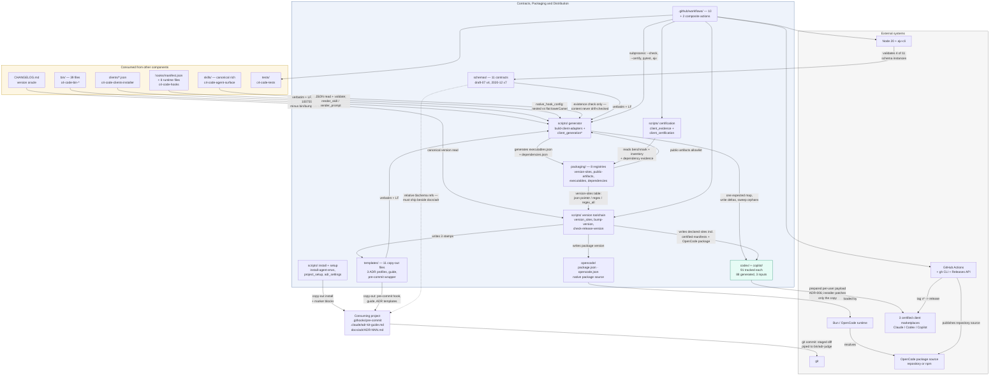

# Contracts, Packaging and Distribution

## Overview

- **Name**: Contracts, Packaging and Distribution (slug `contracts-and-distribution`)
- **Description**: The declarative contract layer, the release toolchain that acts on it, the two
  generated certified-client payloads it emits, and the native OpenCode package source. Eleven JSON
  Schema documents pin the shape of every machine-readable
  artefact adr-kit produces or consumes; eleven copy-out templates become live files in a consuming
  project; eight `packaging/*.json` registries plus twenty `scripts/*.py` modules turn one repository
  into three certified marketplace payloads plus a native OpenCode package source; ten GitHub Actions
  workflows gate the result. The `codex/` and `copilot/` trees are the generated output: 91 tracked
  files each, of which 88 are a deterministic projection of declared source and 3 are hand-maintained
  inputs. The OpenCode package remains at the repository root.
- **Type**: Declarative contract layer + build/release CLI toolchain + generated distribution
  payloads. No long-running process, no service. The only thing here that runs during normal
  operation is `templates/githooks/pre-commit`, once it has been installed into a project.
- **Technology**: JSON Schema (draft-07 ×4 and 2020-12 ×7 — mixed by design, see findings),
  Python 3.10+ stdlib-only (`from __future__ import annotations` throughout, zero third-party
  imports across all 20 `scripts/` modules), TypeScript executed by Bun/OpenCode for the native
  package, GitHub Actions YAML with embedded `bash`/`pwsh`,
  POSIX shell, Markdown, and one committed Windows PE binary (`hooks/bin/windows-x64/adr-hook.exe`,
  248,320 bytes, mirrored into both trees but stored as a single git blob).

### Component boundary — what is owned versus consumed

This matters because the generator reads five input families and only two of them belong here.
A reader will otherwise assume `clients/*.json` lives in this component. It does not.

| Directory / artefact | Ownership | Documented in |
|---|---|---|
| `schemas/` (11), `templates/` (11) | **owned** | [`c4-code-schemas-templates.md`](./c4-code-schemas-templates.md) |
| `instructions/` (3) | **shared** — authored in the agent surface, *mirrored* here as one of the four `COPY_ROOTS` | authored: [`c4-code-agent-surface.md`](./c4-code-agent-surface.md); mirrored: [`c4-code-generated-distributions.md`](./c4-code-generated-distributions.md) |
| `packaging/` (8), `scripts/` (20), `.github/workflows/` (10) + 2 composite actions | **owned** | [`c4-code-packaging-ci.md`](./c4-code-packaging-ci.md) |
| `codex/`, `copilot/` (91 tracked files each) | **owned** (88 generated) | [`c4-code-generated-distributions.md`](./c4-code-generated-distributions.md) |
| `opencode/`, `opencode.json`, `package.json`, `.npmignore` | **owned** native package source | [`docs/clients/opencode.md`](../docs/clients/opencode.md) and ADR-039 |
| `bin/` — 39 executables and libraries, mirrored verbatim | **consumed** | the seven `c4-code-bin-*.md` documents |
| `clients/capabilities.json`, `workflows.json`, `exceptions.json`, `clients/fixtures/` | **consumed** as generator inputs | [`c4-code-clients-installer.md`](./c4-code-clients-installer.md) |
| `hooks/manifest.json` + the 8 `HOOK_RUNTIME_FILES` | **consumed** as generator inputs | [`c4-code-hooks.md`](./c4-code-hooks.md) |
| `CHANGELOG.md` — the canonical version oracle | **consumed** (read at `client_generation_model.py:126`) | no code doc |
| `docs/adr/**`, `tests/**` | **consumed** as validation targets | [`c4-code-tests.md`](./c4-code-tests.md) |

One relationship runs the other way: `clients/installer` **consumes this component's payload** at
install time, copying `codex/` and `copilot/` into a per-user data root and patching only that
copy's MCP commands (ADR-006). For that one edge this component is the supplier, not the projector.

## Purpose

This is the only component whose job is to make claims about *other* components mechanically
verifiable. Everything else in adr-kit governs a consuming project's architecture; this component
governs adr-kit's own claims about itself — that an artefact has the shape it says it has, that every
publish surface carries the same version, that the three certified client payloads are a pure function
of one source tree, that the native OpenCode package source is included in the release contract, and
that a release claim is backed by evidence bound to an exact commit.

It does this through three mechanisms. Each one has a verified hole, and naming the holes alongside
the mechanisms is the component-level insight:

| Mechanism | Verified hole |
|---|---|
| **11 JSON Schemas** pin the shape of every machine-readable artefact | Only **4** ever have an instance evaluated by a real schema engine — `ajv` in `validate.yml:39,42,45,48` covers `plugin.json`, `marketplace.json`, `ADR-INDEX.json`, `adr-context-probes.json`. `adr-frontmatter.schema.json` and `doctor-output.schema.json` have **zero** consumers (grep finds only prose and backlog references); `bin/adr_schema.py:23-46` is the operative frontmatter contract. |
| **One version registry** (`packaging/version-sites.json`) writes every declared version site spanning all three certified-client sub-clusters and the OpenCode package from one declarative table | Three of those sites live in `templates/`, but `bin/adr-guardian` carries only **two** stamp detectors (`_WRAPPER_STAMP_RE` at `:218`, `_wrapper_version` at `:295`). The `<!-- adr-kit-guide vX.Y.Z -->` stamp has no reader. The `templates/github-workflows/` action pin is not a registered site at all. |
| **The generator** makes both mirrors a byte-deterministic function of declared source; `--check` is gated in three workflows | `--check` exits **1** on a git-clean Windows checkout (13 phantom drift entries, reproduced below). The determinism gate is unrunnable locally on the one platform ADR-010 declares `release-required`. |

The rest of this document is that table, expanded.

## Software Features

- **Artefact shape contracts.** Eleven schemas covering the ADR `## Enforcement` rule language, ADR
  frontmatter, the generated ADR graph (`schema_version: const 2`), the project policy file
  `.adr-kit.json` (11 blocks, 361 lines, doubling as reference documentation for the config surface),
  retrieval probes, readiness reports, doctor output, three-client capability and certification
  evidence, and the two Claude plugin manifests.
- **Closed-by-construction certified client roster.** `client-capabilities.schema.json` encodes the three
  certified first-class clients as a `const` array literal, pins `clients` to `minItems/maxItems: 3` with
  `minContains/maxContains: 1` per id, requires all seven outcome values per client, and freezes the
  expansion epic as `future_epic: const "TASK-43"`. Adding a fourth client is a schema edit — the
  schema is a release gate, not a description.
- **ADR body-profile templates.** Three selectable profiles (`madr` default, `nygard`, `canonical`)
  differing only in body headings while sharing one frontmatter block and the four adr-kit extension
  sections (`## Status History`, `## Decision Contract`, `## Open Questions`, `## Enforcement`).
- **Copy-out project installation.** Five template→destination pairs, each with a named installer,
  turning a plugin into live project files.
- **The installed fail-closed gate.** `templates/githooks/pre-commit` is the only executable template
  and the only blocking mechanism this component installs. It ranks candidate engine roots by
  manifest version — including the current git checkout, per ADR-008 — takes a non-blocking `flock`,
  and pipes `git diff --cached` into `bin/adr-judge`. Deliberately fail-open in five places; only the
  judge's own exit code propagates.
- **Deterministic client-tree generation.** `client_generation.generate()` builds a single
  `expected: dict[relpath, (bytes, mode)]` map covering **both** mirrors in one pass, compares it
  against disk with ≤16-thread bounded pools, writes only deltas, then sweeps orphans out of the
  declared `generated_roots`. `--check` makes it a pure drift assertion. Warm-state caching is keyed
  on `(size, mtime_ns, mode)` stamps plus a SHA-256 fingerprint of the whole expected map.
- **Per-client projection with a minimal transform surface.** Of the 88 generated files per mirror,
  the only genuine transformations are 15 rendered thin skills, one hook config, and one prepended
  provenance line. Everything else — 39 `bin/` executables, 11 schemas, 11 templates, 8 hook-runtime
  files — is `content.replace(b"\r\n", b"\n")` and nothing more, with mode `100755` preserved.
- **Single-registry version propagation.** `version_sites.py` implements a write protocol over
  heterogeneous file formats driven by one declarative table. `bump-version.py` is the only
  sanctioned writer, `check-release-version.py --expect <tag>` is the release gate, and both report
  **every** mismatch rather than aborting on the first.
- **Three-client certification.** `assemble_native_bundle()` folds three independent certified per-client
  Windows observations plus shared inventory, dependency and benchmark facts into one bundle bound to
  a 40–64 hex candidate commit, then validates its own output. `validate()` checks schema version,
  candidate binding, contract-date staleness, canonical client order, per-platform status, cold/warm
  latency budgets `{"cold": (1000, 2000, 5000), "warm": (150, 500, 1000)}` with a 20 % p95 regression
  ceiling and `writes == 0` when warm, and renders `docs/client-support.md`.
- **Native OpenCode package contract.** `package.json`, `opencode.json`, `.npmignore`, and
  `opencode/plugin.ts` form a root-level package source. `test_opencode_package.py` checks the package
  entrypoint, shared release registry, public-artifact allowlist, and explicit exclusion of generated
  certified-client trees; `test_opencode_plugin.py` exercises the callback surface with Bun when
  available. These checks are deliberately separate from the three-client certification bundle.
- **Release-payload allowlisting.** `packaging/public-artifacts.json` (45 `include_roots`, 10
  `forbidden_segments`, 5 `forbidden_globs`) splits this component in half: 14 of the 20
  `scripts/*.py` ship, the 6-module release toolchain does not, and the shipped subset is
  import-closed. `.github/workflows/**` is a forbidden glob, so this repo's own CI never ships;
  `templates/github-workflows/` is the shipped downstream variant.
- **Zero-runtime-dependency enforcement.** `dependencies()` refuses to emit
  `packaging/dependencies.json` unless `runtime` stays empty and the budget stays zero; an exact pin
  requires five evidence keys including an ADR reference.
- **Branch hygiene.** `check-branch-sync.py` compares `origin/main` against `origin/dev` (preferring
  the published ref over the local branch) and reports release tags that never reached dev, on a
  daily cron deliberately **not** triggered on push to `main` so a merge-back gets a grace period.
- **Measured latency evidence.** Two benchmark harnesses write `schema_version: 1` evidence compared
  against an approved baseline: client generation (clean p95 896.896 ms / warm p95 128.694 ms over 30
  samples, `platform.os: nt`) and ADR grilling (8 budgets over a 50-ADR / 500-changed-path fixture).

## Code Elements

| Code document | Role in this component |
|---|---|
| [`c4-code-schemas-templates.md`](./c4-code-schemas-templates.md) | The contract layer itself: 11 JSON Schemas defining every artefact shape, plus the 11 copy-out templates — three ADR body profiles, the project guide, the pre-commit wrapper, the Guardian settings entry, two workflow samples, and two non-executable reference validators. A leaf that imports nothing; everything else reaches into it. |
| [`c4-code-packaging-ci.md`](./c4-code-packaging-ci.md) | The machinery: 8 declarative registries, 20 stdlib-only `scripts/` modules (11 runnable CLIs, 9 import-only libraries), 10 workflows and 2 composite actions. Generates the mirrors, propagates the version, assembles and validates certification evidence, installs into detected CLIs, benchmarks the deterministic paths. |
| [`c4-code-generated-distributions.md`](./c4-code-generated-distributions.md) | The output: `codex/` and `copilot/`, self-contained installable payloads with no independent implementation. Documents the projection manifest (the five module-level constants that *are* the real source of these trees), the copied-versus-transformed split, and the three hand-maintained input files per mirror. |
| [`docs/clients/opencode.md`](../docs/clients/opencode.md) | The native OpenCode package contract: root-level `package.json`, `opencode.json`, `.npmignore`, and `opencode/plugin.ts`, with focused static and Bun smoke evidence. |

## Interfaces

Eight structurally different interface kinds. A flat list would blur them, so they are enumerated by
protocol.

### 1. CLI — the release and setup toolchain

Eleven runnable `scripts/*.py`. Cross-cutting exit convention, documented once at
`scripts/check-branch-sync.py:20-23` and followed by the composite actions: **0** clean, **1**
finding, **2** infrastructure error.

| Command | Operation |
|---|---|
| `build-client-adapters.py [--check] [--root P] [--output-root P] [--format human\|json]` | Regenerate or drift-check both mirrors; `--check` writes nothing. Legacy alias `sync-agent-plugins.py` re-enters it via `runpy.run_path`. |
| `… --certify BUNDLE --candidate-commit SHA [--release-candidate] [--support-output P]` | The three-client outcome-contract gate. |
| `… --assemble-native-evidence DIR --candidate-commit SHA --evidence-output P` | Fold `{claude,codex,copilot}/windows-native.json` into one bundle. |
| `bump-version.py <MAJOR.MINOR.PATCH> [--date D] [--check]` | The only sanctioned writer of every version site. |
| `check-release-version.py --expect <version\|vversion>` | Release gate; `[ok]`/`[MISMATCH]` per site plus the exact remediation command. |
| `check-branch-sync.py [--release-branch main] [--dev-branch dev] [--format text\|json]` | Read-only: no pushes, no issues, no merges. |
| `install-agent-envs.py [--clients auto\|all\|<csv>] [--plan] [--dry-run] [--yes] [--detect-only] [--uninstall] …` | Native installer; exit 2 when no supported CLI is detected. |
| `setup-project.py`, `settings.py [show\|set\|unset]` | Project marker-block setup and layered settings resolution. |
| `benchmark-client-generation.py [--samples N>=5]`, `benchmark-adr-grilling.py` | Write measured latency evidence; exit 1 on any budget or regression failure. |
| `refresh-otgw-corpus.py [--source ../OTGW-firmware]` | Snapshot the frozen real-world ADR corpus with per-file SHA-256. |

Importable surface (the test suite is the primary consumer): `client_generation.generate`,
`client_certification.{validate, support_matrix}`, `client_evidence.{assemble_native_bundle, write_bundle}`,
`version_sites.{load_registry, read_canonical, read_all, check, write_all, format_findings}`,
`client_generation_artifacts.{render_skill, render_prompt, native_hook_config, validate_*, inventory, dependencies}`,
`client_generation_state.{validate_release_paths, collect_release_files}`,
`project_setup.{collect_changes, apply_changes, plan_uninstall, validate_markers, marker_block}`,
`adr_settings.{resolve_settings, write_setting, local_judgment_state, discover_ollama_models}`.
Underscore prefixes are **not** module boundaries here: `client_evidence.py:16` imports
`client_certification._all_true` across a module boundary, and `client_generation.py:50-54` re-exports
five validators under underscore aliases to preserve the surface the tests import.

### 2. JSON file contracts

- **Schema → instance**, eleven pairs (full constraint surfaces in
  [`c4-code-schemas-templates.md`](./c4-code-schemas-templates.md)). Two instances
  (`ADR-INDEX.json`, `adr-context-probes.json`) self-declare `"$schema": "../../schemas/…"` as a
  *relative* ref, which is why the schema directory must ship alongside the ADR directory.
  `clients/capabilities.json:2` declares the same style of ref, but nothing resolves it.
- **`packaging/*.json`**, eight registries, all `schema_version: 1`. The three generated ones
  (`executables.json`, `dependencies.json`, `client-generation-benchmark.json`) carry a `provenance`
  string naming `scripts/build-client-adapters.py`. `executables.json` holds 28 entries: 22 under
  `bin/`, 6 under `scripts/`, **0** under the mirrors.
- **Certification bundle**: `{schema_version, candidate_commit, contract_date, records[3]}` with the
  three clients in canonical order; native observations at
  `<evidence-root>/{claude,codex,copilot}/windows-native.json`.
- **Generator JSON output**: `{status, check, drift[], stats{…}, elapsed_ms}`;
  `{passed, release_candidate, errors}` for certification;
  `{passed, check, candidate_commit, output, errors}` for evidence assembly.
- **An exit-code contract expressed as a schema**: `doctor-output.schema.json:46` pins
  `exit_code ∈ [0, 1]`.

### 3. Copy-out file installation

| Template | Destination | Installer |
|---|---|---|
| `templates/githooks/pre-commit` | `.githooks/pre-commit` | `/adr-kit:install-hooks`, `scripts/project_setup.py:218` |
| `templates/cc-settings/guardian-hook-entry.json` | an entry under `hooks.SessionStart[0].hooks[]` in `.claude/settings.json` | `/adr-kit:install-hooks`, `/adr-kit:upgrade` |
| `templates/adr-kit-guide.md` | `.claude/adr-kit-guide.md` | `/adr-kit:init`, `:upgrade`, `:setup` |
| `templates/adr-template.{madr,nygard,canonical}.md` | `docs/adr/ADR-NNN-<slug>.md` | `python bin/adr new "<title>" [--profile <id>]` |
| `templates/github-workflows/*.yml` | `.github/workflows/…` | manual copy-paste, documented in the file headers |

`project_setup.py` performs these writes under an `O_CREAT|O_EXCL` lock on `.adr-kit/setup.lock`,
with content-addressed backups at `.adr-kit/backups/<flat>.<sha12>.<kind>.bak`, preserving each
file's newline convention and BOM, and refusing outright to replace a user-owned hook or a foreign
`core.hooksPath`.

### 4. git hook — the installed fail-closed gate

`.githooks/pre-commit` runs on every `git commit`:
`git diff --cached --unified=0 | "$ADR_JUDGE" --diff - --adr-dir "$ROOT/docs/adr/" --repo-root "$ROOT" --snapshot staged [--llm]`.
Exit codes pass through from `bin/adr-judge`: 0 clean, 1 violation, 2 config/runtime error. Knobs:
`ADR_KIT_HOOK_DISABLE`, `ADR_KIT_LLM`, `ADR_KIT_NO_LLM`, `ADR_KIT_SUGGEST`,
`ADR_KIT_SUGGEST_DISABLE`, `ADR_KIT_OVERRIDE`, `CODEX_HOME`, `COPILOT_HOME`. Fail-open at five
points by design: missing Python, no engine root, empty staged diff, `flock` contention (declarative
pass kept, LLM suppressed), and both advisory passes.

### 5. GitHub Actions

Two composite actions are the CI interface:

- `./.github/actions/adr-judge` — inputs `adr-dir` (default `docs/adr/`), `python-version` (default
  `3.11`); pipes `git diff --unified=0 origin/<base>...HEAD` into `bin/adr-judge`.
- `./.github/actions/adr-readiness` — inputs `adr-dir`, `base`, `head`, `python-version`; outputs
  `blocking-count`, `blocking-adrs` (compact JSON array), `advisory-count`, `schema-version`,
  `conclusion` ∈ `{blocked, advisory-or-clean}`.

Ten workflows: eight blocking (`validate.yml`, `release-publish.yml`, `release-candidate.yml`,
`adr-judge-self.yml`, `adr-readiness.yml`, `adr-index-check.yml`, `adr-lint-self.yml`,
`branch-sync-check.yml`) and two report-only cron sweeps that always exit 0 and route findings to a
single tracking issue via `gh` (`adr-guardian-audit.yml`, `adr-retire-audit.yml`).
`release-candidate.yml` is the only Windows job, using `pwsh` steps, and it sparse-checks out an
independently retained evidence commit while refusing a bundle path that escapes it.

### 6. Version-site write protocol

`packaging/version-sites.json` declares 1 `canonical` source (the top `## [x.y.z]` heading in
`CHANGELOG.md`), all version-bearing repository sites, and 1 `must_not_carry_version` rule
(`.agents/plugins/marketplace.json`). The sites span the three certified-client sub-clusters, the
OpenCode package, templates, and README pins — which is what makes the registry the thread that ties
them together:

| `kind` | Sites |
|---|---|
| `json` (RFC 6901 pointer subset) | `.claude-plugin/plugin.json`, `codex/.codex-plugin/plugin.json`, `copilot/plugin.json`, `.claude-plugin/marketplace.json`, `.github/plugin/marketplace.json`, `templates/cc-settings/guardian-hook-entry.json` |
| `regex` | `package.json` (the OpenCode package version), `templates/githooks/pre-commit` (the `ADR_KIT_WRAPPER_VERSION` stamp), `templates/adr-kit-guide.md` |
| `regex_all` | `README.md` ×2 — the composite-action pin and the `rev:` pre-commit pin |

### 7. Payload-facing interfaces exposed by the generated distributions

- **Skill invocation**: Codex `$adr-kit:<workflow>`; Copilot `adr-kit:<workflow>` via `/skills`.
  Fifteen workflows each, from the closed `WORKFLOW_IDS` set.
- **MCP** over stdio, server name `adr-kit`, via `bin/adr-mcp` — registered through **three
  deliberately divergent command forms**: Codex `./bin/adr-mcp` with `cwd: "."`, Copilot
  `${PLUGIN_ROOT}/bin/adr-mcp`, root Claude `${CLAUDE_PLUGIN_ROOT}/bin/adr-mcp`.
- **Lifecycle hooks**: Codex binds 6 events (nested schema, `$PLUGIN_ROOT` + `commandWindows`);
  Copilot binds 3 (flat lowerCamel, dual `bash`/`powershell`). `hooks/manifest.json` maps
  `pre-tool-use`, `subagent-start` and `pre-compact` to `null` for `github-copilot-cli` — an
  honestly declared capability gap, not a shim. All hooks fail open (`|| true` / `exit 0`) with
  `timeoutSec` 1–5.
- **CLI entrypoints**: all 39 `bin/` commands present and mode-`100755` inside each mirror.

### 8. Native OpenCode package interface

The root package exposes the OpenCode plugin entrypoint through
`package.json` (`main: "./opencode/plugin.ts"`) and the repository-local
`opencode.json` (`plugin: ["./"]`). The TypeScript adapter registers canonical
skills, instructions, ADR references, workflow commands, and the local MCP
server during `config`, then delegates prompt, context, compaction, edit, and
shell callbacks to the shared Python Hook Runtime.

This package is a repository source artifact in the current release workflow,
not an npm publication. `tests/test_opencode_package.py` validates its file
allowlist and version registry entry; `tests/test_opencode_plugin.py` provides
the Bun smoke contract. Neither test changes the three-client certification
schema or evidence bundle.

## Dependencies

### Components used

Sibling component slugs are being assigned in parallel, so each dependency is identified by the
`c4-code-*.md` document(s) it contains — that identifier exists on disk today. Slugs given in
parentheses are provisional.

| Dependency | Mechanism |
|---|---|
| **ADR engine CLIs and libraries** — the seven `c4-code-bin-cli-*.md` and `c4-code-bin-lib-*.md` documents | (a) **Verbatim file copy**: all 39 `bin/` files are read as bytes and written into each mirror, LF-normalized, mode preserved, minus `bin/bump-version` (`COPY_EXCLUSIONS`). (b) **Subprocess**: workflows and scripts invoke `bin/adr-lint`, `adr-index`, `adr-retire`, `adr-status`, `adr-judge`, `adr-readiness-ci`, `adr-migrate`, `adr-mcp`, `adr-context`. (c) **Import**: `benchmark-adr-grilling.py` imports `bin/adr_readiness.py` and `bin/adr_schema.py` after a `sys.path` insert. (d) **Reverse read**: `bin/adr_config.py`, `bin/adr-judge`, `bin/adr-lint`, `bin/adr_catalog.py`, `bin/adr`, `bin/adr-guardian` all read files owned by this component. |
| **Client registry and installer** — [`c4-code-clients-installer.md`](./c4-code-clients-installer.md) | (a) **JSON file read**: `clients/{capabilities,workflows,exceptions}.json` are declared generator inputs validated by `validate_capabilities` / `validate_workflows`; `workflows.json` is the sole source of the 15 rendered skills and 45 rendered prompts. (b) **Import**: `install-agent-envs.py` imports `clients.installer.{contracts,detection,native,payload,planning,transaction,updates}`. (c) **Supplier edge**: the installer copies this component's `codex/`/`copilot/` trees to a per-user data root and patches only that copy (ADR-006). |
| **Hook integration layer** — [`c4-code-hooks.md`](./c4-code-hooks.md) | (a) **JSON file read**: `hooks/manifest.json` drives `native_hook_config()`, which emits `hooks/hooks.json`, `codex/hooks/hooks.json` and `copilot/hooks.json`. (b) **Verbatim copy, flattened**: the 8 `HOOK_RUNTIME_FILES` become `<client>/hooks/…`, with `.exe`/`.dll` skipping LF normalization. |
| **Agent-facing surface** — [`c4-code-agent-surface.md`](./c4-code-agent-surface.md) | (a) **Generation**: `render_skill` / `render_prompt` produce the thin `codex/skills/`, `copilot/skills/` and all three `prompts/<client>/` corpora. (b) **Existence check only**: the canonical `skills/` tree is required to exist for Claude (`GenerationError("missing canonical rich skill")`) but its content is never drift-checked. (c) **Verbatim copy**: `instructions/` into both mirrors, with one prepended provenance line on `ADR-guide.md`. |
| **Native OpenCode plugin** — `opencode/plugin.ts` | **Root package source**: `package.json`, `opencode.json`, and `.npmignore` declare the OpenCode entrypoint and allowlisted payload; the adapter consumes canonical skills, workflows, the Hook Runtime, and MCP Server without entering the generated mirrors. |
| **Test suite** — [`c4-code-tests.md`](./c4-code-tests.md) | (a) **Subprocess gate**: `validate.yml` runs a hand-picked 10-module packaging subset and a full-suite 3-OS × Python 3.10/3.12 compatibility matrix. (b) **Fixture read**: `tests/certification/simulated-pass.json` is the CI certification input; `tests/fixtures/hooks/reference-corpus.json` backs the hook latency method. (c) **Write**: `refresh-otgw-corpus.py` writes `tests/testsets/otgw-firmware/`. |

### External systems

- **git** — `check-branch-sync.py` (`rev-list`, `tag --merged`, ref resolution preferring
  `origin/<name>`), `project_setup.py` (`core.hooksPath`, 5 s timeout), `refresh-otgw-corpus.py`,
  the installed pre-commit hook (`diff --cached`), and workflow checkout steps.
- **GitHub** — Actions runners as the execution host; `$GITHUB_STEP_SUMMARY` / `$GITHUB_OUTPUT` as
  append-only sinks; the `gh` CLI for issue and release management; the Releases API via
  `release-publish.yml` (`contents: write`).
- **The three marketplaces** — Claude Code, Codex CLI and GitHub Copilot CLI plugin managers consume
  the published payloads; their manifests are the version sites this component writes.
- **OpenCode host / npm when separately published** — OpenCode loads the root TypeScript package from
  a reviewed checkout or an npm package; the current GitHub release workflow validates but does not
  publish npm.
- **Filesystem and OS** — `os.replace` atomic rename everywhere, `O_CREAT|O_EXCL` locking,
  `fsync`, POSIX file modes (`expected_mode` in `executables.json`), the system temp directory for
  the generator warm-state cache, and platform-specific plugin cache globbing
  (`~/.claude`, `${CODEX_HOME:-~/.codex}`, `${COPILOT_HOME:-~/.copilot}`) in the hook template.
- **Node 20 + `ajv-cli` + `ajv-formats`** — CI only; the only real JSON Schema engine anywhere in
  the project.
- **`jsonschema` (PyPI)** — optional and import-guarded; deepens `bin/adr-judge` / `bin/adr-lint`
  validation when present. Declared in neither `runtime` nor `development`.
- **`jq`, `awk`, `flock`, `perl`, `sort -V`, `grep`, `date`, `cmd.exe`, PowerShell, `python3|python|py`** —
  shell utilities the templates and workflow steps depend on; `flock` and `perl` are optional
  fallbacks that degrade cleanly.
- **`claude` CLI** — reached only transitively through `bin/adr-judge --llm` and `bin/adr-suggest`.
  **No workflow in this component invokes an LLM**, and no credential beyond `GITHUB_TOKEN` is used
  anywhere in it.
- **`http://127.0.0.1:11434`** — a bounded 250 ms loopback probe for local Ollama *identity* in
  `adr_settings.discover_ollama_models`. Never invokes a model; any error returns `[]`.
- **`rustc`** — build-time only, manual, for `hooks/native/*.rs`. No CI step compiles it.

## Governing ADRs

Two tables, because the split is itself a finding. I enumerated every `## Enforcement` `path_glob`
in `docs/adr/` to produce the first one.

### Mechanically enforced — exactly three globs land in this component

| ADR | Rule | Target | State |
|---|---|---|---|
| **ADR-005** — Selectable agent-friendly ADR formats | `require_pattern` `"default"\s*:\s*"madr"` | `schemas/adr-kit-config.schema.json` | satisfied at line 99 |
| **ADR-008** — Resolve the enforcement engine from a version-ranked root set including the checkout | `require_pattern` `_self_root` | `templates/githooks/pre-commit` | satisfied at lines 99–103 |
| **ADR-010** — Certify three native CLI clients through one outcome contract | `require_pattern` on `schema_version const 1` and the three client ids | `schemas/client-capabilities.schema.json` | satisfied at lines 22–24 and 33–39 |

### Prose-governing — verified by ADR body text, not by enforcement scope

| ADR | What it constrains here |
|---|---|
| **ADR-012** — Release to the three coding-agent marketplaces from the public repository | One identical version across `.claude-plugin/plugin.json`, `codex/.codex-plugin/plugin.json`, `copilot/plugin.json` and both marketplace manifests. Enforced operationally by `validate_manifests` and `check-release-version.py`. |
| **ADR-039** — Add a Native OpenCode Plugin Without Expanding the Certified CLI Gate | The root `opencode/plugin.ts` package source, `opencode.json`, and `package.json` are versioned and release-visible, but OpenCode is not added to the certified capability schema, generated mirrors, installer, or native evidence bundle. |
| **ADR-013** — Declare version sites in one registry and bump by writing | Names `packaging/version-sites.json`, `scripts/version_sites.py`, `scripts/bump-version.py` directly. The strongest textual link in the cluster. |
| **ADR-010** (broader) | One outcome contract across three clients; *"generated artifacts must stay byte-deterministic while clean and unchanged generation remain fast on Windows"*; hooks stay local, bounded, model-free and fail-open; the zero-runtime-dependency baseline holds. `binding: true`, `gate: three-client-release`. Sets the 300/400-line module budgets. |
| **ADR-006** — Prepare platform-local marketplaces for native installs | Governs `install-agent-envs.py`: build a prepared, version-pinned, per-user payload from a validated source and patch only the copy, never the checkout. |
| **ADR-004** — Layered ADR context injection | Defines the injection tiers the generated `hooks.json` files wire up, and locates the fail-closed floor at `bin/adr-judge` plus the CI action — client-independent, which is why Copilot's missing `PreToolUse` costs advice, not enforcement. ADR-004 explicitly *rejects* a fail-closed `PreToolUse` gate. |
| **ADR-001** / **ADR-002** | Cited in `adr-guardian-audit.yml:3,:9` as the reason the CI sweep is cheap-tier-only, report-only and never invokes an LLM. |

**The interesting negative result:** no Enforcement `path_glob` anywhere in the repository covers
`scripts/`, `packaging/`, or `.github/workflows/`. The release toolchain that mechanically guards
every other component is itself unguarded by the pre-commit judge; its guarantees rest entirely on
CI and the test suite.

**ADR-015** (two-second deterministic latency budget) is deliberately **not** cited: its glob is
`tests/fixtures/cli/latency-corpus.json` and its `forbid_pattern` targets the literal
`"hard_timeout_ms": 2000`, while this component's benchmark uses a different key
(`hard_timeouts_ms`, values `{clean: 5000, warm: 1000}`) on a different surface — release tooling,
not a user-facing CLI. The relationship between the two budget surfaces is written down nowhere.

**ADR-016** (serve both MCP protocol eras from one hand-rolled stdio server, dated 2026-07-29) is
`status: "Proposed"`, so it advises rather than governs. Its Enforcement rules target `bin/adr-mcp`
and `tests/test_adr_mcp.py`, neither of which is owned here — but note that a landed ADR-016 must be
regenerated into both mirrors or the Codex and Copilot payloads silently diverge.

## Component Diagram

## Carried-Forward Findings

Findings from the Code phase that survive to component level, ordered by consequence. Each was
re-verified in this session unless marked otherwise.

1. **TASK-57 — the byte-determinism gate cannot be run locally on Windows, and the obvious fix masks
   the defect.** `build-client-adapters.py --check --format json` exits **1** on this git-clean
   checkout with **13 phantom drift entries**: `hooks/hooks.json`, `{codex,copilot}/hooks.json`, and
   `{codex,copilot}/templates/{adr-kit-guide.md, cc-settings/guardian-hook-entry.json,
   githooks/pre-commit, validate_adr_template.py, validate_adr_template.sh}`. Root cause confirmed:
   `core.autocrlf=true`, every committed blob is LF, and `.gitattributes` pins `eol=lf` for `bin/*`,
   `scripts/*.py`, `.githooks/*`, `templates/githooks/*`, `codex/bin/*`, `copilot/bin/*` — but **not**
   for `templates/*` generally, **not** for `codex/templates/**` or `copilot/templates/**`, and
   **not** for any `hooks*.json`. Note the asymmetry: `templates/githooks/pre-commit` is pinned while
   its own mirror `codex/templates/githooks/pre-commit` is not. **The trap:** the bare (write)
   invocation rewrites all 13 files as LF, making the check pass locally and hiding the defect — the
   fix belongs in `.gitattributes`, not the files. This bites hardest because ADR-010 declares
   Windows `release-required`.

2. **Seven of eleven schemas never have an instance evaluated by a schema engine.** `ajv` covers
   exactly four. `adr-frontmatter.schema.json` and `doctor-output.schema.json` have zero consumers of
   any kind; `adr-readiness.schema.json` is presence-checked only; `client-capabilities` and
   `client-certification` have dedicated tests, but those assert on the *schema document's own JSON*
   while their instances are checked by hand-rolled Python in `scripts/`. Consequence:
   `adr-frontmatter.schema.json` is documentation and `bin/adr_schema.py:23-46` is the operative
   contract, with nothing tying the two together.

3. **`adr-kit-config.schema.json` is co-designed with a hand-rolled validator and nothing enforces
   the coupling.** `bin/adr_config.py:39-116` implements a stdlib JSON Schema *subset* (`type`,
   `enum`, `minLength`, `pattern`, `minItems`, `items`, `minimum`, `maximum`, `required`,
   `properties`, `patternProperties`, `additionalProperties`, `oneOf`) and silently ignores
   unsupported keywords rather than rejecting them. The config schema uses exactly zero constructs
   outside that subset, so the two agree today. A future constraint using `const`, `$ref`, `allOf`,
   `maxLength` or `format` would be enforced only where the optional `jsonschema` package happens to
   be installed. Every *other* schema already leans on `$ref`/`$defs`/`const`/`contains` and so
   cannot be checked by the always-on path at all.

4. **Version-stamp asymmetry — three registered sites, two detectors, and this repository is the
   proof.** The registry declares `templates/githooks/pre-commit`,
   `templates/cc-settings/guardian-hook-entry.json` and `templates/adr-kit-guide.md`; `bin/adr-guardian`
   detects staleness for only the first two. **Correcting this component's own code doc:**
   `c4-code-schemas-templates.md` finding 6 says the deployed `.claude/adr-kit-guide.md` "carries no
   stamp at all." It does — `<!-- adr-kit-guide v0.30.3 -->` against a template at `v0.42.0`, twelve
   minor releases behind, 192 lines versus 302. The stamp exists, is a registered version site, and
   has no reader. Separately, `templates/github-workflows/adr-readiness.yml:16` pins
   `…/adr-readiness@v0.37.0` and is **not** a registered site, so `bump-version.py` never advances it
   and downstream copy-paste users get five-release-old action behaviour.

5. **The certification executable baseline is tautological *and* wrong.**
   `client_evidence._shared_inventory` (`scripts/client_evidence.py:90-91`) hardcodes
   `bin_baseline: 27, scripts_baseline: 3`; `client_certification.validate`
   (`scripts/client_certification.py:113`) then asserts exactly those literals. Producer and
   validator agree by construction, so the check cannot fail on a bundle `assemble_native_bundle`
   built — it is a real assertion only against a hand-authored fixture such as
   `tests/certification/simulated-pass.json`. Both numbers also disagree with the current generated
   inventory of **22** `bin/` and **6** `scripts/` entries. Which was intended is not determinable
   from the code.

6. **Rich/thin skill asymmetry — the largest *functional* consequence of the distribution design, and
   invisible from file counts.** Claude Code reads the canonical `skills/` tree (3,076 lines across 15
   files; `skills/adr/SKILL.md` alone is 759). Codex and Copilot receive **274 lines total** — an
   11.2× overall reduction, 36× for the flagship `adr` workflow (759 → 21 lines).
   `clients/workflows.json` marks this deliberately (`skill_mode: "canonical-rich"` vs `"generated"`)
   and `generate()` *refuses* to render a thin skill for Claude. ADR-010 requires equal **outcomes**,
   not identical instructions, so this is by design — but the three clients are at parity on tooling,
   not on guidance depth.

7. **Copilot binds 3 of 6 lifecycle events, honestly declared.** `hooks/manifest.json` maps
   `pre-tool-use`, `subagent-start` and `pre-compact` to `null` for `github-copilot-cli`. The
   user-visible consequence: ADR-004's fail-*open* edit-tier injection — the `Edit|MultiEdit|Write`
   hook prepending the `[adr-inject]` block — never fires for Copilot users. The fail-*closed* floor
   is unaffected, being `bin/adr-judge` at pre-commit plus the CI action, a git hook independent of
   the client. Copilot loses pre-edit advice, not enforcement.

8. **Generated and hand-maintained files are interleaved inside the mirrors with no on-disk marker.**
   Exactly three files per mirror are inputs: the plugin manifest, the `.mcp.json` registration, and
   `README.md`. The first two are declared in `SOURCE_FILES` and validated but never written;
   `README.md` falls outside every `generated_roots` entry so the sweep never reaches it. Editing
   `codex/bin/adr-lint` is silently reverted on the next run; editing `codex/README.md` persists. The
   generated files carry no provenance header — only `ADR-guide.md`, the skills and the prompts do.

9. **`packaging/executables.json` omits two-thirds of the shipped executables.** `inventory()` filters
   on `relative.startswith("bin/") and path.suffix == ""`, so its 28 entries cover 22 root `bin/`
   commands and 6 `scripts/` entrypoints and **zero** mirrored ones. The 44 mirrored entrypoints are
   genuinely executable — mode `755` in the worktree and `100755` in the git index. `expected_mode` is
   declared but never compared against a real file mode; the only assertion is that the *set* of
   declared values is a subset of `{100644, 100755}`.

10. **`jsonschema` is an undeclared optional third-party dependency.** Guarded
    `try/except ImportError` imports at `bin/adr-judge:101` and `bin/adr-lint:112,236` (and their
    mirrored copies) degrade to `None`, so the stdlib-only guarantee holds and
    `packaging/dependencies.json` correctly reports `runtime: []`. But `jsonschema` appears in neither
    `runtime` nor `development` (which lists only `pytest`), so a validation path that silently
    strengthens when the package happens to be installed is recorded nowhere. The wider CI toolchain
    (`ajv-cli`, `ajv-formats`, `markdownlint-cli2`, `jq`, `gh`) is likewise undeclared — consistent
    with `.github/workflows/**` being a forbidden glob, since the manifest describes what ships, not
    what CI needs.

11. **Mixed schema dialects and decorative `$id`s.** Four schemas declare draft-07, seven declare
    2020-12 — which is why `validate.yml` passes `--spec=draft7` twice and `--spec=draft2020` twice.
    `adr-enforcement.schema.json` has no `$id` at all; the other ten split across three hosts
    (`github.com/rvdbreemen` ×8, `rvdbreemen.github.io`, `adr-kit.dev`). Every in-repo reference is a
    relative path, so the `$id`s are decorative here. Whether the URLs resolve was not verified.

12. **Smaller items worth keeping.** `templates/adr-template.md` is a byte-identical duplicate of
    `templates/adr-template.madr.md` (both md5 `d4c524a1100a53c4c7ae0ef2ae07ae39`) and both ship.
    `guardian-hook-entry.json:4` declares `"_remove_marker": "adr-guardian-session-start"` as the
    uninstall handle, but no reader exists outside the mirrors. Untracked stale `.pdb` files survive in
    both mirrors (1,052,672 bytes against the root's 1,511,424 — different builds) because the sweep
    hard-skips any path containing `/hooks/bin/`; correctly excluded from release, so untidiness rather
    than a leak. `_nested_hook_config` hardcodes the literal `codex-cli` instead of interpolating
    `client_id` — correct today, a latent trap for a fourth nested-schema client. Three orphan `.pyc`
    files in `scripts/__pycache__/` name modules that no longer exist (`certify-client`,
    `client_artifacts`, `generate-support-matrix`). Nine of ten workflows pin Python 3.11 — the one
    version the compatibility matrix (3.10, 3.12) skips.
