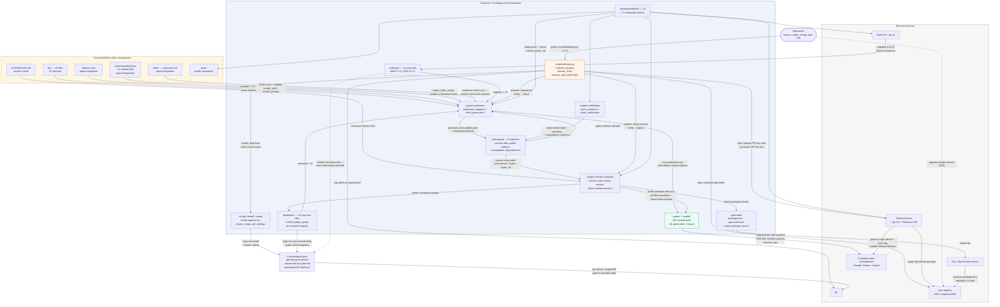

# Contracts, Packaging and Distribution

## Overview

- **Name**: Contracts, Packaging and Distribution (slug `contracts-and-distribution`)
- **Description**: The declarative contract layer, the release toolchain that acts on it, the two
  generated certified-client payloads it emits, and the native OpenCode package source. Eleven JSON
  Schema documents pin the shape of every machine-readable
  artefact adr-kit produces or consumes; fourteen copy-out templates become live files in a consuming
  project; eight `packaging/*.json` registries plus twenty-seven `scripts/*.py` modules turn one repository
  into three certified marketplace payloads plus a native OpenCode package source; one command,
  `python scripts/release.py X.Y.Z`, drives the release end to end (ADR-042); thirteen GitHub Actions
  workflows and three composite actions gate the result. The `codex/` and `copilot/` trees are the
  generated output: 114 tracked files each, of which 111 are a deterministic projection of declared
  source and 3 are hand-maintained inputs. The OpenCode package remains at the repository root.
- **Type**: Declarative contract layer + build/release CLI toolchain + generated distribution
  payloads. No long-running process, no service. The only thing here that runs during normal
  operation is `templates/githooks/pre-commit`, once it has been installed into a project.
- **Technology**: JSON Schema (draft-07 ×4 and 2020-12 ×7 — mixed by design, see findings),
  Python 3.10+ stdlib-only (`from __future__ import annotations` throughout, zero third-party
  imports across all 27 `scripts/` modules), TypeScript executed by Bun/OpenCode for the native
  package, GitHub Actions YAML with inline `bash`/`pwsh`,
  POSIX shell, and Markdown. Every shipped file is text: since 0.55.1 (ADR-029) the native hook binary
  and its mirrored copies are gone, and the Python hook runtime is the only thing either mirror carries
  under `hooks/`.

### Component boundary — what is owned versus consumed

This matters because the generator reads five input families and only two of them belong here.
A reader will otherwise assume `clients/*.json` lives in this component. It does not.

The code-level documents this table used to link (`c4-code-schemas-templates.md`,
`c4-code-packaging-ci.md`, `c4-code-generated-distributions.md`) were retired on 2026-08-09; the module
docstrings in `scripts/` carry that detail now.

| Directory / artefact | Ownership | Documented in |
|---|---|---|
| `schemas/` (11), `templates/` (14) | **owned** | this document; schema `description` fields and template headers |
| `instructions/` (3) | **shared** — authored in the agent surface, *mirrored* here as one of the four `COPY_ROOTS` | authored: [`c4-component-agent-integration.md`](./c4-component-agent-integration.md); mirrored: this document |
| `packaging/` (8), `scripts/` (27), `.github/workflows/` (13) + 3 composite actions | **owned** | this document; `docs/RELEASING.md` for the release procedure |
| `codex/`, `copilot/` (114 tracked files each) | **owned** (111 generated) | this document |
| `opencode/`, `opencode.json`, `package.json`, `.npmignore` | **owned** native package source | [`docs/clients/opencode.md`](../docs/clients/opencode.md) and ADR-039 |
| `bin/` — 48 tracked files, 47 mirrored verbatim | **consumed** | [`c4-component-decision-engine.md`](./c4-component-decision-engine.md), [`c4-component-enforcement-engine.md`](./c4-component-enforcement-engine.md), [`c4-component-retrieval-and-injection.md`](./c4-component-retrieval-and-injection.md), [`c4-component-health-and-lifecycle.md`](./c4-component-health-and-lifecycle.md) |
| `clients/capabilities.json`, `workflows.json`, `exceptions.json`, `clients/fixtures/`, plus the 5 `clients/` runtime-support modules mirrored verbatim | **consumed** as generator inputs | [`c4-component-agent-integration.md`](./c4-component-agent-integration.md) |
| `hooks/manifest.json` + the 9 `HOOK_RUNTIME_FILES` | **consumed** as generator inputs | [`c4-component-agent-integration.md`](./c4-component-agent-integration.md) |
| `CHANGELOG.md` — the canonical version oracle | **consumed** (read at `client_generation_model.py:168`) | `packaging/version-sites.json` `canonical` |
| `docs/adr/**`, `tests/**` | **consumed** as validation targets | [`c4-component-quality-assurance.md`](./c4-component-quality-assurance.md) |

One relationship runs the other way: `clients/installer` **consumes this component's payload** at
install time, copying the `packaging/public-artifacts.json` roots — `codex/` and `copilot/` among
them — into a per-user data root and patching only that copy's MCP commands (ADR-006). For that one
edge this component is the supplier, not the projector.

## Purpose

This is the only component whose job is to make claims about *other* components mechanically
verifiable. Everything else in adr-kit governs a consuming project's architecture; this component
governs adr-kit's own claims about itself — that an artefact has the shape it says it has, that every
publish surface carries the same version, that the three certified client payloads are a pure function
of one source tree, that the native OpenCode package source is included in the release contract, and
that a release claim is backed by evidence bound to an exact commit.

It does this through three mechanisms. Each one has a verified hole, and naming the holes alongside
the mechanisms is the component-level insight:

| Mechanism | Verified hole |
|---|---|
| **11 JSON Schemas** pin the shape of every machine-readable artefact | Only **4** ever have an instance evaluated by a real schema engine — `ajv` in `validate.yml:43,46,49,52` covers `plugin.json`, `marketplace.json`, `ADR-INDEX.json`, `adr-context-probes.json`. `adr-frontmatter.schema.json` and `doctor-output.schema.json` have **zero** consumers in `bin/`, `hooks/`, `scripts/`, `clients/`, `tests/` or `.github/`; `bin/adr_schema.py:48-85` is the operative frontmatter contract. |
| **One version registry** (`packaging/version-sites.json`) writes 17 declared version sites across 15 files — all three certified-client sub-clusters, the OpenCode package, the templates, this repository's own dogfooded copies, README pins and the CHANGELOG compare link — from one declarative table | The `<!-- adr-kit-guide vX.Y.Z -->` stamp is written at three sites and has **no code reader**: `bin/adr-guardian` carries only the two wrapper-stamp detectors (`_WRAPPER_STAMP_RE` at `:267`, `_wrapper_version` at `:344`), and `adr-doctor`'s guidance check tests only that the guide exists. Guide staleness is left to the prose of `skills/upgrade/SKILL.md:50`. |
| **The generator** makes both mirrors a byte-deterministic function of declared source; `--check` is gated in CI and in the release driver's `verify` phase | The comparison ignores line-ending style only (`_same_content`, `client_generation.py:57-84`, the TASK-57 fix), so `--check` now passes on a git-clean `core.autocrlf=true` Windows checkout. What it does **not** cover is the canonical `skills/` tree Claude Code reads: the generator checks that each rich `SKILL.md` exists and never drift-checks its content. |

The rest of this document is that table, expanded.

## Software Features

- **Artefact shape contracts.** Eleven schemas covering the ADR `## Enforcement` rule language, ADR
  frontmatter, the generated ADR graph (`schema_version: const 2`), the project policy file
  `.adr-kit.json` (14 top-level blocks, 389 lines, doubling as reference documentation for the config surface),
  retrieval probes, readiness reports, doctor output, three-client capability and certification
  evidence, and the two Claude plugin manifests.
- **Closed-by-construction certified client roster.** `client-capabilities.schema.json` encodes the three
  certified first-class clients as a `const` array literal, pins `clients` to `minItems/maxItems: 3` with
  `minContains/maxContains: 1` per id, requires all seven outcome values per client, and freezes the
  expansion epic as `future_epic: const "TASK-43"`. Adding a fourth client is a schema edit — the
  schema is a release gate, not a description.
- **ADR body-profile templates.** Three selectable profiles (`madr` default, `nygard`, `canonical`)
  differing only in body headings while sharing one frontmatter block and the four adr-kit extension
  sections (`## Status History`, `## Decision Contract`, `## Open Questions`, `## Enforcement`).
- **Copy-out project installation.** Five template→destination pairs, each with a named installer,
  turning a plugin into live project files.
- **The installed fail-closed gate.** `templates/githooks/pre-commit` is the only executable template
  and the only blocking mechanism this component installs. It finds a Python 3.10 or newer by asking
  each candidate interpreter for its own `sys.version_info` and keeps searching past an older one,
  ranks candidate engine roots by manifest version with `_version_ge()` running on that Python (no GNU
  `sort` dependency, since 0.59.1) — including the current git checkout, per ADR-008 — takes a
  non-blocking `flock`, and pipes `git diff --cached` into `bin/adr-judge`. Deliberately fail-open in
  five places; only the judge's own exit code propagates.
- **Deterministic client-tree generation.** `client_generation.generate()` builds a single
  `expected: dict[relpath, (bytes, mode)]` map covering **both** mirrors in one pass, compares it
  against disk with ≤16-thread bounded pools, writes only deltas, then sweeps orphans out of the
  declared `generated_roots`. `--check` makes it a pure drift assertion. Warm-state caching is keyed
  on `(size, mtime_ns, mode)` stamps plus a SHA-256 fingerprint of the whole expected map.
  `adr-doctor` runs the same check, and repairs drift only in an installed payload: in a git checkout
  it reports `stale` and names the build command instead of rewriting `codex/` and `copilot/`
  (`bin/adr_doctor_checks.py:252-266`, 0.59.0).
- **Per-client projection with a minimal transform surface.** Of the 111 generated files per mirror,
  the only genuine transformations are 17 rendered thin skills, one hook config, and one prepended
  provenance line. Everything else — 47 `bin/` files, 11 schemas, 14 templates, 3 instructions, the 9
  `HOOK_RUNTIME_FILES` and the 9 `RUNTIME_SUPPORT_FILES` (the `clients/`, `hooks/` and `scripts/`
  modules that mirrored `bin/` entrypoints import from outside `bin/`) — is
  `content.replace(b"\r\n", b"\n")` and nothing more, with source mode preserved.
- **Single-registry version propagation.** `version_sites.py` implements a write protocol over
  heterogeneous file formats driven by one declarative table. `bump-version.py` is the only
  sanctioned writer (it also inserts the `## [X.Y.Z]` heading with a `- TODO:` placeholder and
  retargets the compare links), `check-release-version.py --expect <tag>` is the release gate, and
  both report **every** mismatch rather than aborting on the first.
  `check-release-version.py --print-canonical` prints the CHANGELOG version alone, which is how
  `release-publish.yml` derives the tag.
- **A one-command release driver (ADR-042).** `python scripts/release.py X.Y.Z` runs
  `docs/RELEASING.md` from the maintainer's machine with the maintainer's own `gh` credentials, because
  GitHub starts no workflow runs for a pull request opened with `GITHUB_TOKEN`. Each phase answers
  `done(ctx)` from the repository's actual state, so the command is safe to re-run and resumes an
  interrupted release; `--status` reports and changes nothing, `--only <phase>` runs one phase,
  `--skip-tests` leaves pytest to CI. The tag is never typed by hand: `release-publish.yml` creates
  it from the merged `main` commit. The driver's notes record why: v0.55.0 was burned by a tag
  placed on the `dev` tip. Detail under Interfaces §2.
- **Released-section guard.** `scripts/check-changelog-sections.py` (0.57.0, run in `validate.yml:166`)
  refuses a CHANGELOG bullet appended under a `## [X.Y.Z]` heading that has already shipped, by
  comparing top-level bullet counts against the section at that tag; it reads sections with the same
  regex shape as `release_phases._changelog_section`, and counts the sections it could not compare
  instead of passing them silently.
- **Three-client certification.** `assemble_native_bundle()` folds three independent certified per-client
  Windows observations plus shared inventory, dependency and benchmark facts into one bundle bound to
  a 40–64 hex candidate commit (`client_evidence.py:227`), then validates its own output. `validate()`
  checks schema version, candidate binding, contract-date staleness, canonical client order,
  per-platform status, cold/warm latency budgets `{"cold": (1000, 2000, 5000), "warm": (150, 500, 1000)}`
  with a 20 % p95 regression ceiling and `writes == 0` when warm, and `client_support_matrix.py`
  renders `docs/client-support.md`. `probe-client-events.py` asks an installed client which lifecycle
  events it actually emits and records `not-run` rather than failing where no client is available.
- **Native OpenCode package contract.** `package.json`, `opencode.json`, `.npmignore`, and
  `opencode/plugin.ts` form a root-level package source. `test_opencode_package.py` checks the package
  entrypoint, shared release registry, public-artifact allowlist, and explicit exclusion of generated
  certified-client trees; `test_opencode_plugin.py` exercises the callback surface with Bun when
  available. These checks are deliberately separate from the three-client certification bundle.
- **Release-payload allowlisting.** `packaging/public-artifacts.json` (49 `include_roots`, 10
  `forbidden_segments`, 5 `forbidden_globs`) splits this component in half: 14 of the 27
  `scripts/*.py` ship, the release toolchain (`release*.py`, `bump-version.py`,
  `check-release-version.py`, `check-changelog-sections.py`, `check-branch-sync.py`) does not.
  The shipped subset is **not** import-closed — see finding 3. `.github/workflows/**` is a forbidden
  glob, so this repo's own CI never ships; `templates/github-workflows/` is the shipped downstream variant.
- **Zero-runtime-dependency enforcement.** `dependencies()` refuses to emit
  `packaging/dependencies.json` unless `runtime` stays empty and the budget stays zero; an exact pin
  requires five evidence keys including an ADR reference.
- **Branch hygiene.** `check-branch-sync.py` compares `origin/main` against `origin/dev` (preferring
  the published ref over the local branch) and reports release tags that never reached dev, on a
  daily cron deliberately **not** triggered on push to `main` so a merge-back gets a grace period.
  The release driver runs the same script as its preflight and as the done-test of its `syncback` phase.
- **Measured latency evidence.** Two benchmark harnesses write `schema_version: 1` evidence compared
  against an approved baseline: client generation (clean p95 896.896 ms / warm p95 128.694 ms over 30
  samples, `platform.os: nt`) and ADR grilling (8 budgets over a 50-ADR / 500-changed-path fixture).

## Code Elements

| Code area | Role in this component |
|---|---|
| `schemas/` + `templates/` | The contract layer itself: 11 JSON Schemas defining every artefact shape, plus the 14 copy-out templates — three ADR body profiles and a `madr` duplicate, the project guide, the pre-commit wrapper, the Guardian settings entry, five workflow samples, and two non-executable reference validators. A leaf that imports nothing; everything else reaches into it. |
| `packaging/` + `scripts/` + `.github/` | The machinery: 8 declarative registries, 27 stdlib-only `scripts/` modules (14 runnable CLIs, 13 import-only libraries), 13 workflows and 3 composite actions. Generates the mirrors, propagates the version, drives the release, assembles and validates certification evidence, installs into detected CLIs, benchmarks the deterministic paths. |
| `codex/` + `copilot/` | The output: self-contained installable payloads with no independent implementation. The module-level constants in `scripts/client_generation_model.py` (`COPY_ROOTS`, `COPY_EXCLUSIONS`, `HOOK_RUNTIME_FILES`, `RUNTIME_SUPPORT_FILES`, `SOURCE_FILES`) *are* the real source of these trees; three hand-maintained input files per mirror sit among the generated ones. |
| [`docs/clients/opencode.md`](../docs/clients/opencode.md) | The native OpenCode package contract: root-level `package.json`, `opencode.json`, `.npmignore`, and `opencode/plugin.ts`, with focused static and Bun smoke evidence. |

## Interfaces

Nine structurally different interface kinds. A flat list would blur them, so they are enumerated by
protocol.

### 1. CLI — the build and setup toolchain

Fourteen runnable `scripts/*.py`. Cross-cutting exit convention, documented once at
`scripts/check-branch-sync.py:21-23` and followed by the composite actions: **0** clean, **1**
finding, **2** infrastructure error.

| Command | Operation |
|---|---|
| `build-client-adapters.py [--check] [--root P] [--output-root P] [--format human\|json]` | Regenerate or drift-check both mirrors; `--check` writes nothing. Legacy alias `sync-agent-plugins.py` re-enters it via `runpy.run_path`. |
| `… --certify BUNDLE --candidate-commit SHA [--release-candidate] [--support-output P]` | The three-client outcome-contract gate. |
| `… --assemble-native-evidence DIR --candidate-commit SHA --evidence-output P` | Fold `{claude,codex,copilot}/windows-native.json` into one bundle. |
| `bump-version.py <MAJOR.MINOR.PATCH> [--date D] [--check]` | The only sanctioned writer of every version site. |
| `check-release-version.py --expect <version\|vversion>` \| `--print-canonical` | Release gate; `[ok]`/`[MISMATCH]` per site plus the exact remediation command. `--print-canonical` prints the CHANGELOG version and nothing else. |
| `check-changelog-sections.py` | Refuse an entry added under an already-released CHANGELOG heading. |
| `check-branch-sync.py [--release-branch main] [--dev-branch dev] [--format text\|json]` | Read-only: no pushes, no issues, no merges. |
| `install-agent-envs.py [--clients auto\|all\|<csv>] [--plan] [--dry-run] [--yes] [--detect-only] [--uninstall] …` | Native installer; exit 2 when no supported CLI is detected. |
| `setup-project.py`, `settings.py [show\|set\|unset]` | Project marker-block setup and layered settings resolution. |
| `benchmark-client-generation.py [--samples N>=5]`, `benchmark-adr-grilling.py` | Write measured latency evidence; exit 1 on any budget or regression failure. |
| `probe-client-events.py` | Ask an installed client which lifecycle events it emits; never fails the build. |
| `refresh-otgw-corpus.py [--source ../OTGW-firmware]` | Snapshot the frozen real-world ADR corpus with per-file SHA-256. |
| `release.py X.Y.Z [--status] [--only PHASE] [--skip-tests] [--timeout-min 45]` | The release driver; see §2. |

Importable surface (the test suite is the primary consumer): `client_generation.generate`,
`client_certification.validate`, `client_support_matrix.support_matrix` (re-exported from
`client_certification`), `client_evidence.{assemble_native_bundle, write_bundle}`,
`version_sites.{load_registry, read_canonical, read_all, check, write_all, format_findings}`,
`client_generation_artifacts.{render_skill, render_prompt, native_hook_config, validate_*, inventory, dependencies}`,
`client_generation_state.{validate_release_paths, collect_release_files}`,
`project_setup.{collect_changes, apply_changes, plan_uninstall, validate_markers, marker_block}`,
`adr_settings.{resolve_settings, write_setting}`, and `release_phases.PHASES`.
Underscore prefixes are **not** module boundaries here: `client_evidence.py:16` imports
`client_certification._all_true` across a module boundary, and `client_generation.py:50-54` re-exports
five functions under underscore aliases to preserve the surface the tests import.

### 2. The release driver (ADR-042)

`scripts/release.py` (171 lines) orchestrates; `release_phases.py` holds the phases, `release_shell.py`
the subprocess and git helpers, `release_npm.py` the npm step. Each phase mirrors one step of
`docs/RELEASING.md`, in order, and decides from the repository whether its work is already done.

| Step | Phase | What it does | Treated as done when |
|---|---|---|---|
| 0 | `preflight` | Refuses a dirty tree unless every change is a file `prepare` writes (a registry site or `codex/`/`copilot/`) and the version is already written; runs `check-branch-sync.py`; requires `gh auth status`. | Never — it is cheap and its answer can change. |
| 1 | `prepare` | `bump-version.py X.Y.Z`, then `build-client-adapters.py`; stops while the `## [X.Y.Z]` section is empty or holds a top-level `- TODO:` item. The placeholder is recognised by that shape, not by the word, so notes that quote `- TODO:` still pass (0.57.0, `release_phases.py:129-145`). | Every site reads X.Y.Z and the section is written. |
| 2 | `verify` | `check-release-version.py --expect vX.Y.Z`, `build-client-adapters.py --check`, `bin/adr-lint --strict docs/adr`, `bin/adr-index --check docs/adr`, full `pytest -q` unless `--skip-tests`. | Never — the point is to run them. |
| 3 | `land` | Commits `chore(release): vX.Y.Z` on `release/vX.Y.Z`, opens the pull request into `main`, arms `gh pr merge --auto --merge`, waits up to `--timeout-min`. | `origin/main:CHANGELOG.md` carries the heading. |
| 3 | `tag` | Waits for `release-publish.yml` to create the tag and asserts it peels to `origin/main`; on a mismatch it refuses to move a pushed tag and tells the maintainer to release the next patch. | The tag resolves to `origin/main`. |
| 4 | `syncback` | Merges `origin/main` into `sync/vX.Y.Z-to-dev` cut from `origin/dev`, opens the pull request into `dev`, arms auto-merge. | `check-branch-sync.py` exits 0. |
| 6 | `install` | Runs `install-agent-envs.py --clients all`, then reads each client's installed version back rather than trusting the exit code. | Claude, Codex and Copilot all report X.Y.Z. |
| 3a | npm (`release_npm.py`, deliberately not a phase) | Reads `npm view @rvdbreemen/adr-kit-opencode dist-tags`. **done** → exit 0; **staged** → prints the 2FA approval steps (approve staged versions in ascending order) and exits 0; **wrong-latest** (published, but `latest` names another version) → prints the `npm dist-tag add` remedy and exits **1** (0.57.0); **unreachable** → exits 1. | `dist-tags.latest` equals X.Y.Z. |

Step 5 of `docs/RELEASING.md` (optional three-client native certification) is not driven. What stays
human, per ADR-042: choosing the version, writing the notes, approving the merge, and npm's 2FA.

### 3. JSON file contracts

- **Schema → instance**, eleven pairs. Two instances
  (`ADR-INDEX.json`, `adr-context-probes.json`) self-declare `"$schema": "../../schemas/…"` as a
  *relative* ref, which is why the schema directory must ship alongside the ADR directory.
  `clients/capabilities.json:2` declares the same style of ref, but nothing resolves it.
- **`packaging/*.json`**, eight registries, all `schema_version: 1`. Two generated ones
  (`executables.json`, `dependencies.json`) carry a `provenance` string naming
  `scripts/build-client-adapters.py`; `client-generation-benchmark.json` is written by
  `benchmark-client-generation.py` and names the generator in `methodology.generator` instead.
  `executables.json` holds 31 entries: 25 under `bin/`, 6 under `scripts/`, **0** under the mirrors.
- **Certification bundle**: `{schema_version, candidate_commit, contract_date, records[3]}` with the
  three clients in canonical order; native observations at
  `<evidence-root>/{claude,codex,copilot}/windows-native.json`.
- **Generator JSON output**: `{status, check, drift[], stats{…}, elapsed_ms}`;
  `{passed, release_candidate, errors}` for certification;
  `{passed, check, candidate_commit, output, errors}` for evidence assembly.
- **An exit-code contract expressed as a schema**: `doctor-output.schema.json:46` pins
  `exit_code ∈ [0, 1]`.

### 4. Copy-out file installation

| Template | Destination | Installer |
|---|---|---|
| `templates/githooks/pre-commit` | `.githooks/pre-commit` | `/adr-kit:install-hooks`, `scripts/project_setup.py:230` |
| `templates/cc-settings/guardian-hook-entry.json` | an entry under `hooks.SessionStart[0].hooks[]` in `.claude/settings.json` | `/adr-kit:install-hooks`, `/adr-kit:upgrade` |
| `templates/adr-kit-guide.md` | `.claude/adr-kit-guide.md` | `/adr-kit:init`, `:upgrade`, `:setup` |
| `templates/adr-template.{madr,nygard,canonical}.md` | `docs/adr/ADR-NNN-<slug>.md` | `python bin/adr new "<title>" [--profile <id>]` |
| `templates/github-workflows/*.yml` (5) | `.github/workflows/…` | manual copy-paste, documented in the file headers |

`project_setup.py` performs these writes under an `O_CREAT|O_EXCL` lock on `.adr-kit/setup.lock`,
with content-addressed backups at `.adr-kit/backups/<flat>.<sha12>.<kind>.bak`, preserving each
file's newline convention and BOM, and refusing outright to replace a user-owned hook or a foreign
`core.hooksPath`.

### 5. git hook — the installed fail-closed gate

`.githooks/pre-commit` runs on every `git commit`:
`git diff --cached --unified=0 | "$ADR_JUDGE" --diff - --adr-dir "$ROOT/docs/adr/" --repo-root "$ROOT" --snapshot staged [--llm]`
(`templates/githooks/pre-commit:269`).
Exit codes pass through from `bin/adr-judge`: 0 clean, 1 violation, 2 config/runtime error. Knobs:
`ADR_KIT_HOOK_DISABLE`, `ADR_KIT_LLM`, `ADR_KIT_NO_LLM`, `ADR_KIT_SUGGEST`,
`ADR_KIT_SUGGEST_DISABLE`, `ADR_KIT_OVERRIDE`, `CODEX_HOME`, `COPILOT_HOME`, plus
`judge.pre_commit_timeout_ms` for the non-blocking slow-commit warning. Fail-open at five
points by design: no Python 3.10+, no engine root, empty staged diff, `flock` contention (declarative
pass kept, LLM suppressed), and both advisory passes.

### 6. GitHub Actions

Three composite actions are the CI interface:

- `./.github/actions/adr-judge` — inputs `adr-dir` (default `docs/adr/`), `python-version` (default
  `3.11`), `max-diff-bytes` (default 32 MiB); pipes `git diff --unified=0 origin/<base>...HEAD` into
  `bin/adr-judge`, declarative-only by default.
- `./.github/actions/adr-readiness` — inputs `adr-dir`, `base`, `head`, `python-version`; outputs
  `blocking-count`, `blocking-adrs` (compact JSON array), `advisory-count`, `schema-version`,
  `conclusion` ∈ `{blocked, advisory-or-clean}`.
- `./.github/actions/adr-index-check` — inputs `adr-dir`, `python-version`; output `conclusion` ∈
  `{fresh, stale}` for `docs/adr/README.md`, `ADR-INDEX.md` and `ADR-INDEX.json`. Only
  `adr-readiness` is in the public allowlist; the other two are consumed by their `@main` ref.

Thirteen workflow files:

- **Pull-request and push gates**: `validate.yml` (ajv, the packaging test subset,
  `check-changelog-sections.py`, and a 3-OS × Python 3.10/3.12 full-suite matrix),
  `adr-judge-self.yml`, `adr-lint-self.yml`, `adr-index-check.yml`, `adr-readiness.yml`.
- **Release**: `release-publish.yml` (push to `main` → derive and push the tag; tag push or
  `workflow_dispatch` → publish), `publish-opencode-npm.yml` (a reusable `workflow_call` workflow
  called by `release-publish.yml`, not an additional release trigger), `release-candidate.yml`
  (`workflow_dispatch` only), and `install-smoke.yml` (0.57.0: runs on release tags, on pull requests
  touching `.pre-commit-hooks.yaml`, `bin/adr-judge*`, the workflow templates or the composite
  actions, and on dispatch; it installs the shipped hook through the `pre-commit` framework into a
  fixture repository and checks that every pinned action ref exists, and says in its own output that
  it does not cover the three vendor CLIs or the npm tarball).
- **Report-only cron sweeps** that always exit 0 and route findings to a single tracking issue via
  `gh`: `adr-audit.yml`, `adr-guardian-audit.yml`, `adr-retire-audit.yml`; plus `branch-sync-check.yml`
  (daily cron, fails when `dev` lags).

What actually gates a merge is branch protection, not this list: on `dev` the only required check is
`validate`; on `main` the required checks are `validate`, `pytest`, `ADR Enforcement (declarative)` and
`generated ADR indexes are up to date`. The OS/Python matrix legs are required on neither (see
[`c4-component-quality-assurance.md`](./c4-component-quality-assurance.md)).
`release-candidate.yml` is the only Windows-only workflow, using `pwsh` steps, and it sparse-checks out an
independently retained evidence commit while refusing a bundle path that escapes it.

### 7. Version-site write protocol

`packaging/version-sites.json` declares 1 `canonical` source (the top `## [x.y.z]` heading in
`CHANGELOG.md`), 17 site entries across 15 files, and 1 `must_not_carry_version` rule
(`.agents/plugins/marketplace.json`). The sites span the three certified-client sub-clusters, the
OpenCode package, templates, this repository's own dogfooded copies, and README pins — which is what
makes the registry the thread that ties them together:

| `kind` | Sites |
|---|---|
| `json` (RFC 6901 pointer subset) | `.claude-plugin/plugin.json`, `codex/.codex-plugin/plugin.json`, `copilot/plugin.json`, `.claude-plugin/marketplace.json`, `.github/plugin/marketplace.json`, `templates/cc-settings/guardian-hook-entry.json` |
| `regex` | `package.json` (the OpenCode package version), `templates/githooks/pre-commit` and `.githooks/pre-commit` (the `ADR_KIT_WRAPPER_VERSION` stamp), `templates/adr-kit-guide.md`, `instructions/ADR-guide.md` and `.adr-kit/ADR-guide.md` (the guide stamp), the `CHANGELOG.md` `[Unreleased]` compare link |
| `regex_all` | `README.md` ×3 — the composite-action pin, the `rev:` pre-commit pin and the OpenCode npm pin — and the `adr-readiness@v` action pin in `templates/github-workflows/adr-readiness.yml` (a registered site since 0.56.0) |

Registering `.githooks/pre-commit` and `.adr-kit/ADR-guide.md` keeps this repository's own
dogfooded copies on the released version; since 0.59.0 a test also keeps both equal to their sources
(TASK-213). `SECURITY.md` deliberately names
no version, so it is not a site.

### 8. Payload-facing interfaces exposed by the generated distributions

- **Skill invocation**: Codex `$adr-kit:<workflow>`; Copilot `adr-kit:<workflow>` via `/skills`.
  Seventeen workflows each, from the closed `WORKFLOW_IDS` set.
- **MCP** over stdio, server name `adr-kit`, via `bin/adr-mcp` — registered through **three
  deliberately divergent command forms**: Codex `./bin/adr-mcp` with `cwd: "."`, Copilot
  `${PLUGIN_ROOT}/bin/adr-mcp` (also with `cwd: "."`), root Claude `${CLAUDE_PLUGIN_ROOT}/bin/adr-mcp`.
- **Lifecycle hooks**: Codex binds 6 events in 7 entries (nested schema, `$PLUGIN_ROOT` +
  `commandWindows`, `timeout` 5); Copilot binds 3 (flat lowerCamel, dual `bash`/`powershell`,
  `timeoutSec` 1–5). `hooks/manifest.json` maps `pre-tool-use`, `plan-exit`, `pr-create`,
  `subagent-start` and `pre-compact` to `null` for `github-copilot-cli` — an honestly declared
  capability gap, not a shim. All hooks run `hooks/adr-hook.py` under Python and fail open
  (`|| true` / `exit 0`).
- **CLI entrypoints**: all 47 mirrored `bin/` files present inside each mirror, the 25 extensionless
  entrypoints at mode `100755`.

### 9. Native OpenCode package interface

The root package exposes the OpenCode plugin entrypoint through
`package.json` (`main: "./opencode/plugin.ts"`) and the repository-local
`opencode.json` (`plugin: ["./"]`). The TypeScript adapter registers canonical
skills, instructions, ADR references, workflow commands, and the local MCP
server during `config`, then delegates prompt, context, compaction, edit, and
shell callbacks to the shared Python Hook Runtime.

This package is a repository source artifact and a staged npm artifact in the
release workflow. `tests/test_opencode_package.py` validates its file allowlist
and version registry entry; `tests/test_opencode_plugin.py` provides the Bun
smoke contract. Neither test changes the three-client certification schema or
evidence bundle.

## Dependencies

### Components used

| Dependency | Mechanism |
|---|---|
| **ADR engine CLIs and libraries** — [`decision-engine`](./c4-component-decision-engine.md), [`enforcement-engine`](./c4-component-enforcement-engine.md), [`retrieval-and-injection`](./c4-component-retrieval-and-injection.md), [`health-and-lifecycle`](./c4-component-health-and-lifecycle.md) | (a) **Verbatim file copy**: 47 of the 48 `bin/` files are read as bytes and written into each mirror, LF-normalized, mode preserved, minus `bin/bump-version` (`COPY_EXCLUSIONS`). (b) **Subprocess**: workflows, the release driver and scripts invoke `bin/adr-lint`, `adr-index`, `adr-retire`, `adr-status`, `adr-judge`, `adr-readiness-ci`, `adr-migrate`, `adr-mcp`, `adr-context`. (c) **Import**: `benchmark-adr-grilling.py` imports `bin/adr_readiness.py` and `bin/adr_schema.py` after a `sys.path` insert. (d) **Reverse read**: `bin/adr_config.py`, `bin/adr-judge`, `bin/adr-lint`, `bin/adr_catalog.py`, `bin/adr`, `bin/adr-guardian` all read files owned by this component; `bin/adr_doctor_checks.py` imports `scripts/adr_settings.py`, `scripts/project_setup.py` and, lazily, `scripts/client_generation.py`. |
| **Client registry, installer and hook runtime** — [`agent-integration`](./c4-component-agent-integration.md) | (a) **JSON file read**: `clients/{capabilities,workflows,exceptions}.json` are declared generator inputs validated by `validate_capabilities` / `validate_workflows`; `workflows.json` is the sole source of the 17 rendered skills per mirror and the 51 rendered prompts. (b) **Import**: `install-agent-envs.py` imports `clients.installer.{contracts,detection,native,payload,planning,transaction,updates}`. (c) **Supplier edge**: the installer copies this component's allowlisted payload to a per-user data root and patches only that copy (ADR-006). (d) **Hook config**: `hooks/manifest.json` drives `native_hook_config()`, which emits `hooks/hooks.json`, `codex/hooks/hooks.json` and `copilot/hooks.json`. (e) **Verbatim copy, flattened**: the 9 `HOOK_RUNTIME_FILES` become `<client>/hooks/…`. (f) **Generation**: `render_skill` / `render_prompt` produce the thin `codex/skills/`, `copilot/skills/` and all three `prompts/<client>/` corpora; the canonical `skills/` tree is required to exist for Claude (`GenerationError("missing canonical rich skill")`) but its content is never drift-checked; `instructions/` is copied into both mirrors with one prepended provenance line on `ADR-guide.md`. |
| **Native OpenCode plugin** — `opencode/plugin.ts` | **Root package source**: `package.json`, `opencode.json`, and `.npmignore` declare the OpenCode entrypoint and allowlisted payload; the adapter consumes canonical skills, workflows, the Hook Runtime, and MCP Server without entering the generated mirrors. |
| **Test suite** — [`quality-assurance`](./c4-component-quality-assurance.md) | (a) **Subprocess gate**: `validate.yml` runs a hand-picked 10-module packaging subset and a full-suite 3-OS × Python 3.10/3.12 compatibility matrix; the release driver's `verify` phase runs the full suite locally. (b) **Fixture read**: `tests/certification/simulated-pass.json` is the CI certification input; `tests/fixtures/hooks/reference-corpus.json` backs the hook latency method. (c) **Write**: `refresh-otgw-corpus.py` writes `tests/testsets/otgw-firmware/`. |

### External systems

- **git** — `check-branch-sync.py` (`rev-list`, `tag --merged`, ref resolution preferring
  `origin/<name>`), the release driver (`fetch --tags`, branch, commit, push, `rev-parse <tag>^{}`),
  `project_setup.py` (`core.hooksPath`, 5 s timeout), `refresh-otgw-corpus.py`, the installed
  pre-commit hook (`diff --cached`), and workflow checkout steps.
- **GitHub** — Actions runners as the execution host; `$GITHUB_STEP_SUMMARY` / `$GITHUB_OUTPUT` as
  append-only sinks; the `gh` CLI for issue and release management in CI and, on the maintainer's
  machine with the maintainer's own authentication, for opening and auto-merging the release and
  sync-back pull requests; `release-publish.yml` (`contents: write`) pushes the tag and creates the
  GitHub Release.
- **The three marketplaces** — Claude Code, Codex CLI and GitHub Copilot CLI plugin managers consume
  the published payloads; their manifests are the version sites this component writes.
- **npm registry** — `publish-opencode-npm.yml` stages `@rvdbreemen/adr-kit-opencode` with
  `npm stage publish` through OIDC trusted publishing (`id-token: write`); a maintainer approves the
  staged version with 2FA; `release_npm.py` reads `npm view … dist-tags` to verify `latest`.
- **OpenCode host** — OpenCode loads the root TypeScript package from a reviewed checkout or the
  published npm package.
- **Filesystem and OS** — `os.replace` atomic rename everywhere, `O_CREAT|O_EXCL` locking,
  `fsync`, POSIX file modes (`expected_mode` in `executables.json`), the system temp directory for
  the generator warm-state cache, and platform-specific plugin cache globbing
  (`~/.claude`, `${CODEX_HOME:-~/.codex}`, `${COPILOT_HOME:-~/.copilot}`) in the hook template.
- **Node 20 + `ajv-cli` + `ajv-formats`** — CI only; the only real JSON Schema engine anywhere in
  the project.
- **`pre-commit` (PyPI)** — installed only by `install-smoke.yml` to exercise `.pre-commit-hooks.yaml`.
- **`jsonschema` (PyPI)** — optional and import-guarded; deepens `bin/adr-judge` / `bin/adr-lint`
  validation when present. Declared in neither `runtime` nor `development`.
- **`jq`, `awk`, `flock`, `perl`, `grep`, `date`, `cmd.exe`, PowerShell, `python3|python|py`** —
  shell utilities the templates and workflow steps depend on; `flock` and `perl` are optional
  fallbacks that degrade cleanly. `templates/cc-settings/guardian-hook-entry.json` additionally
  picks the newest cached plugin with GNU `ls … | sort -V | tail -1`, which BSD/macOS `sort` lacks;
  the pre-commit template dropped that dependency in 0.59.1, this entry has not (TASK-220, open).
- **Host agent CLIs** (`claude -p`, `codex exec`, `copilot -p`) — reached only transitively through
  `bin/adr-judge --llm`, `bin/adr-suggest` and `probe-client-events.py`. **No workflow in this
  component invokes a model.**

## Governing ADRs

Two tables, because the split is itself a finding. I enumerated every `## Enforcement` `path_glob`
in `docs/adr/` to produce the first one.

### Mechanically enforced — four ADRs have globs that land in this component

| ADR | Rule | Target | State |
|---|---|---|---|
| **ADR-005** — Selectable agent-friendly ADR formats | `require_pattern` `"default"\s*:\s*"madr"` | `schemas/adr-kit-config.schema.json` | satisfied at line 121 |
| **ADR-008** — Resolve the enforcement engine from a version-ranked root set including the checkout | `require_pattern` `_self_root` | `templates/githooks/pre-commit` | satisfied at lines 116–119 |
| **ADR-010** — Certify three native CLI clients through one outcome contract | `require_pattern` on `schema_version const 1` and the three client ids | `schemas/client-capabilities.schema.json` | satisfied at lines 22–23 and 34–37 |
| **ADR-042** — Drive the release from the maintainer's machine and create the tag from the merge | `require_pattern` on the `push:` trigger | `.github/workflows/release-publish.yml` | satisfied — the workflow keeps `push` on `main` and on `v*` tags |

ADR-016 (Accepted) also globs into this component's output: its five rules target
`{bin,codex/bin,copilot/bin}/adr-mcp`, so the mirrored copies are judged alongside the source.

### Prose-governing — verified by ADR body text, not by enforcement scope

| ADR | What it constrains here |
|---|---|
| **ADR-012** — Release to the three coding-agent marketplaces from the public repository | One identical version across `.claude-plugin/plugin.json`, `codex/.codex-plugin/plugin.json`, `copilot/plugin.json` and both marketplace manifests. Enforced operationally by `validate_manifests` and `check-release-version.py`. |
| **ADR-042** (broader) | The release runs from the maintainer's machine through `scripts/release.py`, with `docs/RELEASING.md` as the specification; the tag is derived from the merged `main` commit by `release-publish.yml`, which must remain the initiating workflow because npm validates the Trusted Publisher against that filename. Its contract is held by `tests/test_release_driver.py`, `test_release_workflow_identity.py`, `test_docs_claims.py` and `test_release_allowlist.py`. |
| **ADR-039** — Add a Native OpenCode Plugin Without Expanding the Certified CLI Gate | The root `opencode/plugin.ts` package source, `opencode.json`, and `package.json` are versioned and release-visible, but OpenCode is not added to the certified capability schema, generated mirrors, installer, or native evidence bundle. |
| **ADR-013** — Declare version sites in one registry and bump by writing | Names `packaging/version-sites.json`, `scripts/version_sites.py`, `scripts/bump-version.py` directly. The strongest textual link in the cluster. |
| **ADR-010** (broader) | One outcome contract across three clients; *"generated artifacts must stay byte-deterministic while clean and unchanged generation remain fast on Windows"*; hooks stay local, bounded, model-free and fail-open; the zero-runtime-dependency baseline holds. `binding: true`, `gate: three-client-release`. Sets the 300/400-line module budgets that `tests/test_release_allowlist.py` enforces on `scripts/`. |
| **ADR-006** — Prepare platform-local marketplaces for native installs | Governs `install-agent-envs.py`: build a prepared, version-pinned, per-user payload from a validated source and patch only the copy, never the checkout. |
| **ADR-004** — Layered ADR context injection | Defines the injection tiers the generated `hooks.json` files wire up, and locates the fail-closed floor at `bin/adr-judge` plus the CI action — client-independent, which is why Copilot's missing `PreToolUse` costs advice, not enforcement. ADR-004 explicitly *rejects* a fail-closed `PreToolUse` gate. |
| **ADR-001** / **ADR-002** | Cited in `adr-guardian-audit.yml:3,:9` as the reason the CI sweep is cheap-tier-only, report-only and never invokes an LLM. |

**The interesting negative result:** no Enforcement `path_glob` anywhere in the repository covers
`scripts/` or `packaging/`, and only one file under `.github/workflows/` is covered (ADR-042's
`release-publish.yml`). The release toolchain that mechanically guards every other component is
itself unguarded by the pre-commit judge; its guarantees rest on CI and the test suite.

**ADR-015** (two-second deterministic latency budget) is deliberately **not** cited: its glob is
`tests/fixtures/cli/latency-corpus.json` and its `forbid_pattern` targets the literal
`"hard_timeout_ms": 2000`, while this component's benchmark uses a different key
(`hard_timeouts_ms`, values `{clean: 5000, warm: 1000}`) on a different surface — release tooling,
not a user-facing CLI. The relationship between the two budget surfaces is written down nowhere.

## Component Diagram

```mermaid
flowchart TB
    subgraph EXT["External systems"]
        GIT["git"]
        GH["GitHub Actions<br/>+ gh CLI + Releases API"]
        AJV["Node 20 + ajv-cli"]
        NPM["npm registry<br/>OIDC staged publish"]
        BUN["Bun / OpenCode runtime"]
        MKT["3 certified client marketplaces<br/>Claude / Codex / Copilot"]
    end

    MAINT(["Maintainer<br/>version, notes, merge, npm 2FA"])

    subgraph CONSUMED["Consumed from other components"]
        BINC["bin/ — 48 files<br/>47 mirrored"]
        CLIC["clients/*.json<br/>agent-integration"]
        HKC["hooks/manifest.json<br/>+ 9 runtime files<br/>agent-integration"]
        SKC["skills/ — canonical rich<br/>agent-integration"]
        CHL["CHANGELOG.md<br/>version oracle"]
        TSTC["tests/<br/>quality-assurance"]
    end

    subgraph THIS["Contracts, Packaging and Distribution"]
        SCH["schemas/ — 11 contracts<br/>draft-07 x4, 2020-12 x7"]
        TPL["templates/ — 14 copy-out files<br/>3 ADR profiles, guide,<br/>pre-commit wrapper"]
        REG["packaging/ — 8 registries<br/>version-sites, public-artifacts,<br/>executables, dependencies"]
        REL["scripts/release.py<br/>+ release_phases, release_shell,<br/>release_npm (ADR-042)"]
        GEN["scripts/ generator<br/>build-client-adapters +<br/>client_generation*"]
        VER["scripts/ version toolchain<br/>version_sites, bump-version,<br/>check-release-version"]
        CERT["scripts/ certification<br/>client_evidence +<br/>client_certification"]
        INST["scripts/ install + setup<br/>install-agent-envs,<br/>project_setup, adr_settings"]
        CI[".github/workflows/ — 13<br/>+ 3 composite actions"]
        DIST["codex/ + copilot/<br/>114 tracked each<br/>111 generated, 3 inputs"]
        OC["opencode/<br/>package.json · opencode.json<br/>native package source"]
    end

    PROJ["Consuming project<br/>.githooks/pre-commit<br/>.claude/adr-kit-guide.md<br/>docs/adr/ADR-NNN.md"]

    BINC -->|"verbatim + LF, mode kept<br/>minus bin/bump-version"| GEN
    CLIC -->|"JSON read + validate;<br/>render_skill / render_prompt"| GEN
    HKC -->|"native_hook_config:<br/>nested vs flat lowerCamel"| GEN
    SKC -->|"existence check only —<br/>content never drift-checked"| GEN
    CHL -->|"canonical version read"| VER
    SCH -->|"verbatim + LF"| GEN
    TPL -->|"verbatim + LF"| GEN
    REG -->|"public-artifacts allowlist"| GEN
    GEN -->|"one expected map,<br/>write deltas, sweep orphans"| DIST
    GEN -->|"generates executables.json<br/>+ dependencies.json"| REG

    REG -->|"version-sites table:<br/>json pointer / regex / regex_all"| VER
    VER -->|"writes declared sites incl.<br/>certified manifests + OpenCode package"| DIST
    VER -->|"writes package version"| OC
    VER -->|"writes 4 template stamps"| TPL

    MAINT -->|"python scripts/release.py X.Y.Z"| REL
    REL -->|"prepare: bump-version<br/>verify: --expect"| VER
    REL -->|"prepare: regenerate<br/>verify: --check"| GEN
    REL -->|"land: release PR into main<br/>syncback: PR into dev"| GH
    REL -->|"tag: peels to origin/main?"| GIT
    REL -->|"install: read each<br/>client version back"| INST
    REL -->|"npm: read dist-tags.latest"| NPM

    CERT -->|"reads benchmark + inventory<br/>+ dependency evidence"| REG
    CI -->|"subprocess: --check,<br/>--certify, pytest, ajv"| GEN
    CI --> CERT
    CI --> VER
    CI --> TSTC
    CI --> GH
    CI --> AJV
    AJV -->|"validates 4 of 11<br/>schema instances"| SCH

    INST -->|"copy-out install<br/>+ marker blocks"| PROJ
    TPL -->|"copy-out: pre-commit hook,<br/>guide, ADR templates"| PROJ
    SCH -.->|"relative $schema refs —<br/>must ship beside docs/adr"| PROJ
    PROJ -->|"git commit: staged diff<br/>piped to bin/adr-judge"| GIT
    DIST -->|"prepared per-user payload<br/>ADR-006; installer patches<br/>only the copy"| MKT
    OC -->|"loaded by"| BUN
    GH -->|"push to main: derive + push tag,<br/>publish GitHub Release"| MKT
    GH -->|"stage OpenCode package"| NPM
    MAINT -.->|"approve staged version (2FA)"| NPM
    BUN -->|"resolves package from<br/>repository or npm"| NPM

    style THIS fill:#eef3fb,stroke:#31578f
    style CONSUMED fill:#fdf6e3,stroke:#b58900
    style EXT fill:#f6f6f6,stroke:#777
    style DIST fill:#e6fcf5,stroke:#087f5b
    style REL fill:#fff4e6,stroke:#d9480f
```

## Carried-Forward Findings

Findings that survive to component level, ordered by consequence. Each was re-verified against the
repository at v0.59.1 (2026-10-06) unless marked otherwise.

1. **Seven of eleven schemas never have an instance evaluated by a schema engine.** `ajv` covers
   exactly four. `adr-frontmatter.schema.json` and `doctor-output.schema.json` have zero consumers of
   any kind; `adr-readiness.schema.json` is presence-checked only; `client-capabilities` and
   `client-certification` have dedicated tests, but those assert on the *schema document's own JSON*
   while their instances are checked by hand-rolled Python in `scripts/`. Consequence:
   `adr-frontmatter.schema.json` is documentation and `bin/adr_schema.py:48-85` is the operative
   contract, with nothing tying the two together.

2. **`adr-kit-config.schema.json` is co-designed with a hand-rolled validator and nothing enforces
   the coupling.** `bin/adr_config.py:115-221` (`_type_matches`, `_validate`) implements a stdlib JSON
   Schema *subset* (`type`, `enum`, `minLength`, `pattern`, `minItems`, `items`, `minimum`, `maximum`,
   `required`, `properties`, `patternProperties`, `additionalProperties`, `oneOf`) and silently ignores
   unsupported keywords rather than rejecting them. The config schema uses no validation keyword
   outside that subset, so the two agree today. A future constraint using `const`, `$ref`, `allOf`,
   `maxLength` or `format` would be enforced only where the optional `jsonschema` package happens to
   be installed. Every *other* schema already leans on `$ref`/`$defs`/`const`/`contains` and so
   cannot be checked by the always-on path at all.

3. **The shipped `scripts/` subset is not import-closed.** `scripts/client_certification.py` is in
   `packaging/public-artifacts.json`, and its line 153 unconditionally imports
   `client_support_matrix`, which is not. Copying exactly the 14 allowlisted scripts into an empty
   directory and running `python build-client-adapters.py --help` there fails with
   `ModuleNotFoundError: No module named 'client_support_matrix'` (reproduced in a scratch directory,
   2026-10-06). The installer's `_copy_public_payload` builds the prepared per-user payload from those
   same roots, so `build-client-adapters.py` and `client_evidence.py` cannot import inside it. The
   generated mirrors are unaffected (they carry no `scripts/` beyond `adr_settings.py` and
   `project_setup.py`), and `test_release_allowlist.py` budgets `client_support_matrix.py`'s line count
   without checking that it ships. Whether anyone runs the generator from an installed payload was
   not established.

4. **Version-stamp asymmetry — the guide stamp is written three times and read by no code.** The
   registry declares the `<!-- adr-kit-guide vX.Y.Z -->` stamp at `templates/adr-kit-guide.md`,
   `instructions/ADR-guide.md` and `.adr-kit/ADR-guide.md`; `bin/adr-guardian` detects staleness only
   for the two wrapper stamps, and `adr-doctor`'s `_guidance_check` tests only that
   `.adr-kit/ADR-guide.md` exists. A deployed guide's staleness is caught only if an agent follows
   `skills/upgrade/SKILL.md:50`. Two earlier gaps are closed: the `adr-readiness@v` pin in
   `templates/github-workflows/adr-readiness.yml` is a registered site since 0.56.0 and now reads
   `v0.59.1`, and this repository's own `.githooks/pre-commit` and `.adr-kit/ADR-guide.md` are
   registered sites, kept equal to their sources by a test since 0.59.0. Still unregistered: `templates/github-workflows/adr-judge.yml` and
   `adr-index-check.yml` pin their composite actions at `@main`, so downstream copies track the
   moving branch rather than a release.

5. **The certification executable baseline is tautological *and* wrong.**
   `client_evidence._shared_inventory` (`scripts/client_evidence.py:91-92`) hardcodes
   `bin_baseline: 27, scripts_baseline: 3`; `client_certification.validate`
   (`scripts/client_certification.py:118`) then asserts exactly those literals. Producer and
   validator agree by construction, so the check cannot fail on a bundle `assemble_native_bundle`
   built — it is a real assertion only against a hand-authored fixture such as
   `tests/certification/simulated-pass.json`. Both numbers also disagree with the current generated
   inventory of **25** `bin/` and **6** `scripts/` entries. Which was intended is not determinable
   from the code.

6. **Rich/thin skill asymmetry — the largest *functional* consequence of the distribution design, and
   invisible from file counts.** Claude Code reads the canonical `skills/` tree (3,786 lines across 17
   `SKILL.md` files; `skills/adr/SKILL.md` alone is 780). Codex and Copilot each receive **320 lines
   total** — an 11.8× overall reduction, 37× for the flagship `adr` workflow (780 → 21 lines).
   `clients/workflows.json` marks this deliberately (`skill_mode: "canonical-rich"` vs `"generated"`)
   and `generate()` *refuses* to render a thin skill for Claude. ADR-010 requires equal **outcomes**,
   not identical instructions, so this is by design — but the three clients are at parity on tooling,
   not on guidance depth.

7. **Copilot binds 3 of 8 manifest events, honestly declared.** `hooks/manifest.json` maps
   `pre-tool-use`, `plan-exit`, `pr-create`, `subagent-start` and `pre-compact` to `null` for
   `github-copilot-cli`. The user-visible consequence: ADR-004's fail-*open* edit-tier injection — the
   `Edit|MultiEdit|Write` hook prepending the `[adr-inject]` block — never fires for Copilot users, and
   neither does the `gh pr create` guard. The fail-*closed* floor is unaffected, being `bin/adr-judge`
   at pre-commit plus the CI action, a git hook independent of the client. Copilot loses pre-edit
   advice, not enforcement.

8. **Generated and hand-maintained files are interleaved inside the mirrors with no on-disk marker.**
   Exactly three files per mirror are inputs: the plugin manifest, the `.mcp.json` registration, and
   `README.md`. The first two are declared in `SOURCE_FILES` and validated but never written;
   `README.md` falls outside every `generated_roots` entry so the sweep never reaches it. Editing
   `codex/bin/adr-lint` is silently reverted on the next run; editing `codex/README.md` persists. The
   generated files carry no provenance header — only `ADR-guide.md`, the skills and the prompts do.
   The ownership registry disagrees with the generator on one pair: `clients/capabilities.json` lists
   `codex/hooks/hooks.json` and `copilot/hooks.json` under `hand_authored_validated`, while
   `client_generation.py:165-170` writes both from `native_hook_config()`.

9. **`packaging/executables.json` omits the mirrored executables.** `inventory()` filters
   on `relative.startswith("bin/") and path.suffix == ""` (excluding `bump-version`), so its 31 entries
   cover 25 root `bin/` commands and 6 `scripts/` entrypoints and **zero** mirrored ones. The 50
   mirrored entrypoints are genuinely executable — `100755` in the git index. `expected_mode` is
   declared but never compared against a real file mode; the only assertion is that the *set* of
   declared values is a subset of `{100644, 100755}`.

10. **`jsonschema` is an undeclared optional third-party dependency.** Guarded
    `try/except ImportError` imports at `bin/adr-judge:192` and `bin/adr-lint:106` (and their
    mirrored copies) degrade to `None`, so the stdlib-only guarantee holds and
    `packaging/dependencies.json` correctly reports `runtime: []`. But `jsonschema` appears in neither
    `runtime` nor `development` (which lists only `pytest`), so a validation path that silently
    strengthens when the package happens to be installed is recorded nowhere. The wider CI toolchain
    (`ajv-cli`, `ajv-formats`, `markdownlint-cli2`, `jq`, `gh`, `pre-commit`) is likewise undeclared —
    consistent with `.github/workflows/**` being a forbidden glob, since the manifest describes what
    ships, not what CI needs.

11. **Mixed schema dialects and decorative `$id`s.** Four schemas declare draft-07, seven declare
    2020-12 — which is why `validate.yml` passes `--spec=draft7` twice and `--spec=draft2020` twice.
    `adr-enforcement.schema.json` has no `$id` at all; the other ten split across three hosts
    (`github.com/rvdbreemen` ×8, `rvdbreemen.github.io`, `adr-kit.dev`). Every in-repo reference is a
    relative path, so the `$id`s are decorative here. Whether the URLs resolve was not verified.

12. **Smaller items worth keeping.** `templates/adr-template.md` is a byte-identical duplicate of
    `templates/adr-template.madr.md` (same md5) and both ship.
    `guardian-hook-entry.json:4` declares `"_remove_marker": "adr-guardian-session-start"` as the
    uninstall handle, but no reader exists outside the mirrors. `_nested_hook_config` hardcodes the
    literal `codex-cli` (`client_generation_artifacts.py:151,177`) instead of interpolating
    `client_id` — correct today, a latent trap for a fourth nested-schema client. Every workflow runs
    Python 3.11, directly or through a composite-action default — the one version the compatibility
    matrix (3.10, 3.12) skips.
