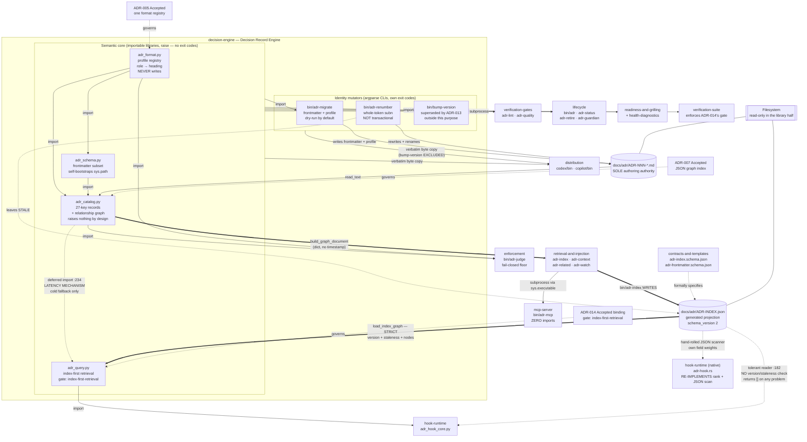

# Decision Record Engine

## Overview

- **Name**: Decision Record Engine (`decision-engine`)
- **Description**: The semantic core of adr-kit. It defines what an Architecture
  Decision Record *means* — how a Markdown body maps onto stable semantic roles
  across three body profiles, what its frontmatter must contain, how a directory
  of ADRs projects into shared records and a node-and-edge graph, and how that
  graph answers retrieval queries. It also owns the two mutators of ADR
  *identity*: profile/frontmatter migration and renumbering.
- **Type**: **Importable Python library (4 modules) plus three single-file CLI
  front-ends.** This split matters and is not cosmetic — the four library
  modules define no `main()`, use no `argparse`, and have no `__main__` block
  (verified by grep). They **raise**; the calling script maps exceptions to exit
  status. The three CLIs have their own argparse surfaces and exit-code
  conventions. A reader who assumes the whole component behaves like the rest of
  `bin/` will get the failure model wrong.
- **Technology**: Python 3.10+, `from __future__ import annotations`
  throughout. **Zero third-party imports** across all seven files — verified by
  enumerating every `import` statement. Standard library only: `re`, `json`,
  `pathlib`, `typing`, `functools.lru_cache`, `datetime.date`, `fnmatch`,
  `argparse`, `sys`, `os`, `tempfile`. No network, no external CLI invoked, no
  subprocess.
- **Size**: 3,396 lines across 7 files (2,330 library + 1,066 CLI).

### Role in the system, stated precisely

The framing "the component every other component reads through" is **almost**
true, and the two exceptions are load-bearing:

- **Every Python consumer reads through it.** 17 external consumers import these
  modules by bare name: 16 in `bin/` (`adr`, `adr-audit`, `adr-context`,
  `adr-generate-scripts`, `adr-index`, `adr-judge`, `adr-lint`, `adr-quality`,
  `adr-related`, `adr-retire`, `adr-status`, `adr-suggest`, `adr-watch`,
  `adr_doctor_core.py`, `adr_readiness.py`, `adr_retrieval_health.py`) plus
  `hooks/adr_hook_core.py`. None of them parses ADR Markdown itself.
- **`bin/adr-mcp` does not import it at all.** Verified: zero occurrences of
  `adr_catalog`/`adr_format`/`adr_schema`/`adr_query` in the file, and its
  import block is stdlib-only. The MCP server reaches this component *only* by
  spawning sibling CLIs through `sys.executable`. That buys crash isolation and
  exact CLI/MCP outcome parity at the cost of one interpreter start per tool
  call.
- **`hooks/native/adr-hook.rs` re-implements it.** The Rust hook host has its own
  `load_records` (`:174`) reading `ADR-INDEX.json` with a hand-rolled JSON
  scanner (no serde) and its own `rank` (`:259`) with hardcoded integer field
  weights (`symbols * 95`, …). It never touches `adr_query`.

So: **every Python consumer imports it; the MCP server subprocesses to it; the
native hook host duplicates it.**

### Governing ADRs (verified against the ADR bodies)

| ADR | Status | How it governs this component |
|---|---|---|
| [ADR-005](../docs/adr/ADR-005-selectable-agent-friendly-adr-formats.md) — *Use Selectable ADR Body Profiles with MADR as the Default* | Accepted | Mandates "one semantic format registry" for `madr`/`nygard`/`canonical` with MADR as default. That registry **is** `adr_format.py`. Item 6 — *"Migration between supported profiles is explicit, dry-run by default, content-preserving, deterministic, and idempotent"* — is the contract `adr-migrate --to-profile` implements. Supersedes ADR-003. |
| [ADR-007](../docs/adr/ADR-007-json-adr-graph-index-for-agent-retrieval.md) — *JSON ADR Graph Index for Agent Retrieval* | Accepted | Mandates a versioned node-and-edge graph generated "from one shared, format-aware semantic record loader". That loader **is** `adr_catalog.py`; ADR-007's References cite `bin/adr_format.py` directly. |
| [ADR-014](../docs/adr/ADR-014-use-the-generated-adr-graph-as-the-selective-context-query-engine.md) — *Use the Generated ADR Graph as the Selective-Context Query Engine* | Accepted, `binding: true`, `gate: "index-first-retrieval"` | Its `verified_in` names `bin/adr_query.py:INDEX_FIRST_RETRIEVAL_GATE` — the literal string anchor at `adr_query.py:16` (frontmatter verified in source). Defines schema-v2 retrieval metadata, the three-value authority model, and the fail-open Markdown fallback posture. |
| [ADR-013](../docs/adr/ADR-013-declare-version-sites-in-one-registry-and-bump-by-writing.md) — *Declare Version Sites in One Registry and Bump by Writing* | Accepted 2026-07-22 | Governs `bin/bump-version` **by superseding it**, not by describing it. See "The `bump-version` exception" below. |

**ADR-004** (layered context injection) is architecturally adjacent — it defines
the task tier that *consumes* this component — but its Decision constrains
`bin/adr-context` and the injection tiers, not these modules, so it is not cited
as governing. Note ADR-004 describes that tier as "five weighted signals";
`adr_query.FIELD_WEIGHTS` now weights **eight** fields, a post-ADR-014 change.

**No ADR Enforcement `path_glob` anywhere in the repository covers
`bin/adr_*.py`.** ADR-005's glob targets `schemas/adr-kit-config.schema.json`
(verified in source), ADR-007's targets `docs/adr/ADR-INDEX.json`, and ADR-014
ships deliberately empty rule arrays. The semantic authority for the entire
toolkit is therefore unguarded by the very pre-commit mechanism it powers —
edit-tier ADR injection never fires on these files even though ADR-014 is
`binding: true` with a named gate. **ADR-014's gate is enforced by tests, not by
the judge.**

---

## Purpose

adr-kit accepts three different ADR body layouts (MADR, Nygard, canonical) and
serves them to five different readers (12 CLIs, a hook runtime, an MCP server, a
test suite, and CI). Without a single semantic layer, every tool would grow its
own Markdown parser and they would disagree — which is exactly the bug class this
component was built to close. `tests/test_adr_index.py` loads six tools side by
side purely to assert that every status reader delegates to
`adr_catalog.adr_status`, the fix for a forked-regex bug (PR #38) where one ADR
read as `Accepted` by one tool and `Unknown` by another.

Four problems it solves:

1. **Format pluralism without parser proliferation.** Headings map to stable
   *roles*; engines consume roles, never literal heading text (ADR-005 point 1).
2. **A machine-readable projection of a human-authored corpus.** Markdown stays
   the sole authoring authority; the JSON graph is a *generated runtime
   projection* with a visible Markdown fallback (ADR-007, ADR-014).
3. **Deterministic, bounded, model-free retrieval.** Ranking uses positive field
   evidence only — no recency, no negative signals, no relationship count, no
   embedding, no LLM, no network.
4. **Safe identity mutation.** Renumbering an ADR after a merge collision and
   migrating a body between profiles are the two operations that must never
   half-apply.

**What it deliberately does not do:** it never writes `ADR-INDEX.json` (that is
`bin/adr-index`, a different component), never decides lifecycle status
transitions (that is `bin/adr`), and never blocks a commit (that is
`bin/adr-judge`). `adr_format` never writes a file at all — `migration_notice`
returns data-only advice with a hard-coded `"writes_automatically": False`
(`adr_format.py:461-466`), which is what lets lint, install, upgrade and
`adr-migrate` render identical guidance from one implementation.

---

## Software Features

| Feature | Description |
|---|---|
| **Semantic profile registry** | `PROFILE_HEADINGS` maps 3 profiles × 13 roles to heading text; `REQUIRED_ROLES` plus MADR's extra `drivers` requirement. `_validate_profile_catalog_contract` is a self-check that raises if the catalog drifts from `SUPPORTED_PROFILES`. |
| **Fence-aware profile detection** | `detect_profile` — a declared frontmatter `format:` wins; otherwise deterministic heading detection yields a supported profile, `hybrid`, or `unknown`. `@lru_cache(maxsize=256)`. `detect_legacy_profile` recognizes Y-Statement / Tyree-Akerman / arc42 as *migration inputs*, never as storage profiles. |
| **Role-based section extraction** | `section_text(text, role, *, profile=None, tolerant=True)` — the workhorse every other component calls to read a Decision, Context or Consequences section without knowing the body profile. |
| **Invariant frontmatter schema** | 10 always-emitted fields + 6 optional retrieval fields, 6 valid statuses, 2 context scopes. `render_frontmatter` ↔ `parse_frontmatter` is a closed round-trip over a deliberate YAML *subset* (scalars plus string lists) — not a general YAML parser. |
| **Frontmatter validation and inference** | `validate_frontmatter` returns human-readable issues (ADR id shape, ISO dates via `date.fromisoformat`, booleans, reference lists, retrieval bounds ≤32 entries / ≤120 chars / case-insensitively unique). `infer_frontmatter` reconstructs canonical metadata from legacy prose without editing the body. |
| **Tolerant semantic record projection** | `load_adr_record` yields a shared 27-key record. Malformed frontmatter becomes a `FRONTMATTER_MALFORMED` finding and discovery continues from invariant prose rather than failing. Finding codes: `FRONTMATTER_MALFORMED`, `STATUS_UNKNOWN`, `FORMAT_UNKNOWN`, `RETRIEVAL_METADATA_INVALID`. |
| **Relationship graph construction** | `build_relationships` emits sorted, de-duplicated directed edges of type `related` / `supersedes` / `superseded-by` / `amended-by`, each with a `resolved` boolean. `build_graph_document` assembles the schema-v2 document — with **no timestamp**, by design (ADR-007 point 2), so regeneration is byte-stable. |
| **Single cross-tool status reader** | `adr_status` resolves `## Status` body, then bold-inline `**Status:** X`, then a plain `Status: X` line — a deliberate superset of the older per-tool regexes so judge, lint, retire, status and watch cannot disagree. |
| **Enforcement-block extraction** | `ENFORCEMENT_BLOCK_RE` and `enforcement_globs` — re-exported to `adr-judge`, `adr-status` and `adr-generate-scripts`, making this component the parser of the enforcement contract it does not itself enforce. |
| **Decision Contract projection** | `decision_contract` projects the optional `## Decision Contract` into `must` / `must_not` / `exceptions` / `verification` (with `Confirmation` mapping onto `verification`), bounded at 240 chars × 20 items. |
| **Strict index reading** | `load_index_graph` validates schema version, **freshness against every `ADR-*.md` mtime**, node structure and duplicate ids, and raises `IndexQueryError`. Staleness is part of the contract, not a warning. |
| **Index-first ranked retrieval** | `score_record` over 8 weighted fields (`path 1.0` → `decision_summary 0.40`), capped at 1.0, with an early `break` once the score saturates. Explicit filter hits score full coverage; lexical hits score `matched_tokens / query_keywords`. |
| **Authority model** | `governing` (Accepted) / `advisory` (Proposed) / `historical`. A `Superseded` match is **not returned** but *redirects* its score to a live successor with a `successor_redirect` marker and a `redirected_from` field. Other historical statuses are dropped unless `include_history`. Ordering is `(-total, ADR-number, ADR-id)` — ADR id is the stable final tie-breaker. |
| **Bounded one-hop expansion** | After ranking, `query_records` appends up to `MAX_SUPPORTING_RESULTS = 2` one-hop `related` ADRs (`adr_query.py:45`, enforced at `:562-564`) — ADR-014's "at most two one-hop supporting ADRs". These carry `role="supporting"` and `score=0.0`, which is where the `role` field of the result contract gets its second value; every directly-matched ADR is `role="primary"`. A consumer of the 25-key payload must expect results it did not match on. |
| **Visible fail-open fallback** | On `IndexQueryError`, `query_adr_context` re-raises when `strict_index=True`, else emits `[adr-context] WARN: …; using Markdown compatibility fallback` into `warnings` and rebuilds the graph from Markdown. Degradation is always observable in the payload (`source`, `engine`). |
| **Profile migration** | `convert_profile` renames the five body roles, appends placeholder blocks for roles the target requires but the source lacks, then stamps the frontmatter discriminator. Refuses when `--from-profile` conflicts with a declared format, or when `context`/`decision`/`consequences` are missing. |
| **Migration planning and advice** | `adr-migrate --plan` reads *every* `*.md` (so legacy filenames like `0010-use-queues.md` are seen) and emits `deterministic-preview` or `guided-migration` notices. Always read-only, always exit 0, always closes with *"No files changed. Migration is never automatic."* |
| **Retrieval-metadata suggestion** | `adr-migrate --suggest-retrieval --dry-run` derives topics/components/symbols and a Decision Contract *candidate* from existing ADR evidence. Existing values always win over derived ones; every result carries `requires_human_approval: True` and `writes_automatically: False`. |
| **ReDoS-hardened renumbering** | `adr-renumber` builds `\bADR-(?:0043\|043\|43)(?!\d)` — a pure alternation of literal spellings sorted longest-first, linear time by construction. Whole-token only: renumbering `ADR-043` provably never touches `ADR-0430`. Gaps are never reused (`max(used) + 1`), because a gap usually means a retired or reserved number. |

---

## Code Elements

| Code document | Role in this component |
|---|---|
| [`c4-code-bin-lib-semantic-core.md`](c4-code-bin-lib-semantic-core.md) | The four importable library modules (2,330 lines) that *are* the semantic layer: `adr_format.py` (profile registry, role↔heading), `adr_schema.py` (frontmatter subset), `adr_catalog.py` (records + graph), `adr_query.py` (index-first retrieval). No CLI surface, no exit codes — these raise. |
| [`c4-code-bin-cli-migration.md`](c4-code-bin-cli-migration.md) | The identity mutators: `bin/adr-migrate` (517 lines — the only CLI here that depends on the semantic layer) and `bin/adr-renumber` (254 lines — deliberately standalone so it keeps working while the parsing layer is mid-migration). Also carries `bin/bump-version`, which is in the cluster but outside this component's purpose — see below. |

### Internal dependency spine

`adr_format` → `adr_schema` → `adr_catalog` → `adr_query`, with one deliberate
inversion:

- `adr_format` has **zero** internal dependencies — the root of the component.
- `adr_schema` imports `adr_format.SUPPORTED_PROFILES` (`:21`).
- `adr_catalog` imports from both (`:15`, `:21`).
- `adr_query` imports `adr_catalog` **function-locally and deferred**
  (`adr_query.py:234`), never at module scope. The comment at `:231-233` gives
  the reason: *"Keep the semantic Markdown stack off the healthy index hot
  path."* This is a **latency mechanism, not tidiness debt** — consistent with
  ADR-014's p95 threshold (250 ms through 200 ADRs) and ADR-015's 2,000 ms CLI
  ceiling. Hoisting that import to the top of the file would silently regress
  the budget.

`bin/adr-migrate` imports `adr_format`, `adr_schema` and `adr_catalog` after a
`sys.path` prepend (`:26-28`). `bin/adr-renumber` imports nothing from the repo.

### The `bump-version` exception

`bin/bump-version` (295 lines) sits in the migration cluster but stamps **release
manifests**, not ADRs — it touches no ADR semantics and belongs to no feature
above. It is documented here for completeness only:

- **Superseded, not removed.** ADR-013 (Accepted 2026-07-22, shipped 0.39.0)
  moved release bumping to `packaging/version-sites.json` +
  `scripts/version_sites.py` + `scripts/bump-version.py`. `docs/RELEASING.md`,
  `CONTRIBUTING.md` and `.claude/commands/release-adr-kit.md` name only the
  `scripts/` path, calling it *"the only place a version is typed"*. Yet
  `bin/bump-version` remains, carries a live 269-line test suite, and has no
  deprecation notice.
- **Neither writer is a superset of the other.** `bin/bump-version` stamps
  `.githooks/pre-commit`, which the registry never declares; the registry
  declares two `README.md` pins that `bin/bump-version` never touches. Running
  either alone now produces a silent partial bump.
- **Verified consequence:** `.githooks/pre-commit:51` reads
  `ADR_KIT_WRAPPER_VERSION="0.37.0"` while `templates/githooks/pre-commit:51`
  and `.claude-plugin/plugin.json` are at `0.42.0`. Per `bin/bump-version:20-22`,
  `adr-guardian` compares these stamps against the plugin version to flag stale
  wrappers — so **the kit's own hook is in the state its own guardian is built
  to detect.** This reads as a dangling edge from the ADR-013 migration, not a
  deliberate exclusion.
- **Not shipped.** Absent from `packaging/executables.json` and
  `packaging/public-artifacts.json`, and excluded from client copies by
  `COPY_EXCLUSIONS = {"bin/bump-version"}` at
  `scripts/client_generation_model.py:32` — the only file in this component that
  is *not* triplicated.

---

## Interfaces

### 1. Sibling-module import (the primary interface)

**Protocol**: Python import by bare module name, after the caller inserts `bin/`
into `sys.path`. No installed package, no `__init__.py`.

**Operations** (signatures verbatim from source):

```python
# adr_format.py — the registry
section_text(text, role, *, profile=None, tolerant=True) -> str      # :616
detect_profile(text) -> str                                          # :320 (@lru_cache 256)
classify_format(text) -> str                                         # :413
required_headings(profile) -> List[str]                              # :599
convert_profile(text, target, *, source=None) -> Tuple[str, str]     # :696
migration_notice(text, path, *, metadata_changed=False, ...) -> Optional[Dict]  # :453
normalize_profile(value, *, default=None) -> str                     # :214
is_migration_candidate(path, text) -> bool                           # :577
unresolved_open_questions(text) -> List[str]                         # :284

# adr_schema.py — the frontmatter dialect
split_frontmatter(text) -> Tuple[Optional[str], str]                 # :78
parse_frontmatter(raw) -> Dict                                       # :115
render_frontmatter(data) -> str                                      # :222
infer_frontmatter(body, path=None) -> Dict                           # :145
validate_frontmatter(data) -> List[str]                              # :305
migrate_text(text, path=None) -> Tuple[str, bool, List[str]]          # :390

# adr_catalog.py — records and graph
load_adr_record(path) -> Dict                                        # :327
load_adr_records(adr_dir) -> List[Dict]                              # :437
build_relationships(records) -> List[Dict]                           # :443
public_adr_node(record) -> Dict                                      # :480
build_graph_document(records, *, schema_ref=GRAPH_SCHEMA_REF) -> Dict # :507
adr_status(text) -> Optional[str]                                    # :63
enforcement_globs(text) -> List[str]                                 # :117
decision_contract(text) -> Dict[str, List[str]]                      # :258
ENFORCEMENT_BLOCK_RE                                                 # :40 (re-exported)

# adr_query.py — retrieval
query_adr_context(query, adr_dir, *, limit=5, min_score=0.1,
                  strict_index=False, include_history=False,
                  statuses=(), authorities=(), paths=(),
                  symbols=(), components=(), topics=()) -> Dict      # :593
load_index_graph(adr_dir) -> Tuple[List[Dict], List[Dict], int]      # :201
query_records(...) -> List[Dict]                                     # :456
score_record(...) -> Dict                                            # :305
```

**`sys.path` bootstrap asymmetry** — a real trap: only `adr_schema` fixes its own
import path (`:17-19`). `adr_format`, `adr_catalog` and `adr_query` require the
caller to have inserted `bin/` (as `hooks/adr_hook_core.py:14-16` does). This is
why five test files load `adr_schema` via
`importlib.util.spec_from_file_location` while others import normally.

### 2. The `docs/adr/ADR-INDEX.json` document contract

**Protocol**: JSON file on disk, formally specified by
[`schemas/adr-index.schema.json`](../schemas/adr-index.schema.json).

This component owns **both ends of the contract but not the serialization step**:

| Stage | Owner | Component |
|---|---|---|
| Build the document (in memory) | `adr_catalog.build_graph_document` | **this one** |
| Write it to disk | `bin/adr-index` | retrieval/index component |
| Read and validate it strictly | `adr_query.load_index_graph` | **this one** |

**Shape**: `{$schema, schema_version: 2, adrs[], relationships[]}`. Node keys:
`id, title, path, format, status, date, decision_summary, topics, aliases,
components, symbols, context_scope, decision_contract, scope, metadata`. Edge
keys: `source, target, type, resolved` with
`type ∈ {related, supersedes, superseded-by, amended-by}`.

**Freshness is part of the contract.** `load_index_graph` compares `st_mtime_ns`
against every `ADR-*.md` and rejects a graph older than any of them.

### 3. The frontmatter round-trip contract

**Protocol**: YAML-subset text embedded in each ADR Markdown file. Formal schema:
[`schemas/adr-frontmatter.schema.json`](../schemas/adr-frontmatter.schema.json).

`render_frontmatter` ↔ `parse_frontmatter`, scoped by the module docstring itself
to "scalar fields plus string lists". Field order is stable: 10 required, then
optional-if-present, then remaining keys sorted alphabetically — so regeneration
never produces spurious diffs.

Note: the JSON Schema is **documentation**; `bin/adr_schema.py:23-46` is the
operative contract. It re-declares the same 10 required fields in the schema's
exact order plus `VALID_STATUSES` and `VALID_CONTEXT_SCOPES`, and no test
imports both. `schemas/adr-frontmatter.schema.json` has **no consumer repo-wide**
— no test, no ajv step, no runtime reader.

### 4. The `query_adr_context` result contract (de-facto RPC payload)

**Protocol**: Python dict, serialized to JSON by `bin/adr-context --format json`
and re-exposed as the `adr_context` MCP tool by `bin/adr-mcp`.

Returns `{results, warnings, source, engine, schema_version}` where `source ∈
{index-v1, index-v2, markdown-fallback}` and `engine ∈ {index-first,
markdown-fallback}`. Each of the 25-key results carries `adr_id, title, path,
status, is_accepted, authority, role, format, decision_summary, scope,
related_ids, metadata, topics, aliases, components, symbols, context_scope,
decision_contract, score, signals, matches, source, engine, schema_version,
redirected_from`.

### 5. `bin/adr-migrate` — CLI

```
adr-migrate [path=docs/adr] [--check] [--plan] [--dry-run]
            [--format {text,json}]
            [--to-profile {madr,nygard,canonical}]
            [--from-profile {madr,nygard,canonical}]
            [--suggest-retrieval]
```

Writes only when neither `--check` nor `--dry-run` is passed (`:473`).
Mutual exclusion enforced at `:398-415`.

**Exit codes**: `0` success (including *every* `--plan` run); `1` only in
`--check` mode when a file needs migration; `2` on any file failure, a
`--suggest-retrieval` failure, or a rejected `--to-profile`.

**Three JSON shapes keyed by `mode`**: `plan` /
`retrieval-suggestions` (with `requires_human_approval: true`,
`writes_automatically: false`) / `check|dry-run|write`.

**Callers**: `skills/migrate/SKILL.md`, `docs/format-migration.md`,
`docs/selective-context.md`, `clients/workflows.json`. Declared a shipped
entrypoint at `packaging/executables.json:108`.

### 6. `bin/adr-renumber` — CLI

```
adr-renumber <source> [--to ADR-NNN] [--adr-dir DIR] [--apply] [--version]
```

`source` is an ADR id or a `.md` path; `--to` defaults to `max(used) + 1`.
Dry-run by default; `--apply` executes. No JSON mode — the plan is
human-readable `file:line` text, deliberately greppable and clickable.

**Exit codes**: `0` success; `2` input error (source missing, target taken,
target equals source, ambiguous source, malformed id, missing directory).

### 7. Failure channel

| Exception | Raised by | Meaning |
|---|---|---|
| `AdrFormatError(ValueError)` | `adr_format` | Unsupported profile, undetectable body format, missing semantic section, catalog drift |
| `FrontmatterError(Exception)` | `adr_schema` | Frontmatter outside the supported YAML subset |
| `IndexQueryError(RuntimeError)` | `adr_query` | Graph missing / stale / unparseable / unsupported version / duplicate ids |
| `ValueError` | `adr_query.query_adr_context` | Argument validation |
| `RenumberError(Exception)` | `bin/adr-renumber` | Input error, mapped once in `main` to exit 2 |

`adr_catalog` **raises nothing of its own by design** — it degrades into
`metadata_findings` entries so index and retrieval stay available on damaged
input. Whether a caller sees an exception or a warning is a deliberate policy
split: `strict_index=True` and CI fail loudly; hooks and interactive context
fail open (ADR-014).

---

## Dependencies

> **Note on sibling slugs**: no component registry exists in the repository, so
> the slugs below are inferred from the verifiable Code-phase cluster names. Each
> entry names the `c4-code-*.md` document that resolves it, so the reference
> holds even if a sibling document chose a different slug.

### Components used

**None for the library half.** `adr_format`, `adr_schema`, `adr_catalog` and
`adr_query` import no other repo module — this is a **leaf-root component**. The
entire dependency chain is internal and architecturally load-bearing. `adr-migrate`
depends only on the library half; `adr-renumber` depends on nothing.

That inversion is the component's defining structural property: it is depended
*upon*, not depending.

### Components that depend on this one

| Consumer (inferred slug) | Resolved by | Mechanism |
|---|---|---|
| `enforcement` | [`c4-code-bin-cli-enforcement.md`](c4-code-bin-cli-enforcement.md) | **Python import.** `bin/adr-judge` imports `ENFORCEMENT_BLOCK_RE`, `adr_id_from_filename`, `adr_status` from `adr_catalog` and `section_text` from `adr_format` (format-aware Decision extraction). `bin/adr-generate-scripts` imports the same enforcement extractor. |
| `enforcement` (audit path) | [`c4-code-bin-cli-enforcement.md`](c4-code-bin-cli-enforcement.md), [`c4-code-bin-lib-doctor.md`](c4-code-bin-lib-doctor.md) | **Python import + subprocess.** `bin/adr-audit:41` imports only `SUPPORTED_PROFILES, detect_profile` from `adr_format` — verified; it is a format-registry consumer, not a catalog consumer. Reached as a subprocess by `adr_doctor_core` on material drift. **Divergence risk touching this component's enforcement-glob semantics:** `bin/adr-audit:126` holds a duplicated `glob_to_regex` commented *"Same translator as bin/adr-judge"*, so glob translation exists in two hand-synced copies while `adr_catalog.enforcement_globs` supplies the globs to both. |
| `verification-gates` | [`c4-code-bin-cli-gates.md`](c4-code-bin-cli-gates.md) | **Python import.** `bin/adr-lint` imports from all three of format/schema/catalog; `bin/adr-quality` imports `adr_format`. |
| `retrieval-and-injection` | [`c4-code-bin-cli-retrieval.md`](c4-code-bin-cli-retrieval.md) | **Python import + JSON file.** `bin/adr-index` calls `build_graph_document` and **writes** the graph; `bin/adr-context` calls `query_adr_context`; `bin/adr-related`, `bin/adr-watch`, `bin/adr-suggest` import catalog/format. |
| `lifecycle` | [`c4-code-bin-cli-lifecycle.md`](c4-code-bin-cli-lifecycle.md) | **Python import.** `bin/adr` imports `adr_format` (profile catalog for `adr new --profile`) and `adr_schema` (frontmatter round-trip for status transitions); `adr-status` and `adr-retire` import `adr_catalog` *specifically so reports agree with what `adr-judge` acts on*. |
| `readiness-and-grilling` | [`c4-code-bin-lib-readiness-grill.md`](c4-code-bin-lib-readiness-grill.md) | **Python import.** `adr_readiness.py` imports `load_adr_records`/`build_relationships`/`normalize_adr_id`; `adr_retrieval_health.py` imports `load_index_graph`/`query_records`/`IndexQueryError`. |
| `health-diagnostics` | [`c4-code-bin-lib-doctor.md`](c4-code-bin-lib-doctor.md) | **Python import.** `adr_doctor_core.py` imports `parse_frontmatter`/`split_frontmatter`. |
| `hook-runtime` | [`c4-code-hooks.md`](c4-code-hooks.md) | **Two mechanisms.** `hooks/adr_hook_core.py:19` imports `query_adr_context` (Python) *and* `:182 load_index_records` reads `ADR-INDEX.json` with its own tolerant reader. `hooks/native/adr-hook.rs` **re-implements** both in Rust. |
| `mcp-server` | [`c4-code-bin-cli-mcp.md`](c4-code-bin-cli-mcp.md) | **Subprocess only — no import.** `bin/adr-mcp` spawns `bin/adr-context` etc. via `sys.executable`. Verified: zero references to any `adr_*.py` module. |
| `contracts-and-templates` | [`c4-code-schemas-templates.md`](c4-code-schemas-templates.md) | **JSON Schema files on disk.** `adr-index.schema.json` and `adr-frontmatter.schema.json` specify this component's two data contracts; `adr_catalog.GRAPH_SCHEMA_REF` stamps the relative `$schema` pointer. |
| `distribution` | [`c4-code-generated-distributions.md`](c4-code-generated-distributions.md), [`c4-code-packaging-ci.md`](c4-code-packaging-ci.md) | **Verbatim byte copy.** `scripts/build-client-adapters.py` copies all four modules plus `adr-migrate`/`adr-renumber` into `codex/bin/` and `copilot/bin/` (`COPY_ROOTS` includes `bin`). `bin/bump-version` alone is excluded. |
| `verification-suite` | [`c4-code-tests.md`](c4-code-tests.md) | **Python import + subprocess.** 11+ test modules; `adr_schema` loaded via `importlib.util.spec_from_file_location`, the CLIs driven as subprocesses. The suite is what enforces ADR-014's `index-first-retrieval` gate. |

### External systems

| System | How used |
|---|---|
| **Filesystem** | Read-only in the library half — `Path.read_text`, `Path.glob`, `Path.is_file`, `Path.stat`. None of the four modules writes a file. `adr-migrate` writes ADR text; `adr-renumber` rewrites lines and calls `Path.rename`. |
| **OS durability primitives** | Only via `bin/bump-version`: `tempfile.NamedTemporaryFile(dir=path.parent)` → `flush` → `os.fsync` → `os.replace`. Notably **absent** from `adr-renumber --apply` (see below). |
| **Nothing else.** | No network. No database. No LLM. No `git`, `gh` or `claude` CLI. No `subprocess`, no `os.system`. **No environment-variable reads** — `os` is not even imported in any of the four library modules. `bump-version` only *prints* git commands for the operator. |

---

## Component Diagram



Reading the diagram: the thick spine
`Markdown → adr_catalog → bin/adr-index → ADR-INDEX.json → adr_query` is the
intended runtime flow under ADR-007 and ADR-014. The dashed
`adr_catalog ⇢ adr_query` edge is the compatibility fallback that exists only
because of the deferred import — it is meant to stay cold. The three dashed
edges into `ADR-INDEX.json`'s consumers are the strictness divergence described
below.

---

## Notable characteristics carried forward from the Code phase

These are the architecturally surprising facts a reader of this component needs.
Each was verified in source.

1. **Three independent readers of `ADR-INDEX.json` at three strictness levels.**
   `adr_query.load_index_graph` validates schema version, staleness, node
   structure and duplicate ids, and **raises**. `hooks/adr_hook_core.py:182
   load_index_records` reads the same file, caps it at 2 MiB, and returns `[]`
   on any problem — **no version check, no staleness check** (verified in
   source). `hooks/native/adr-hook.rs:174` is a third reader in Rust with a
   hand-rolled JSON scanner. The fail-open hook posture is what ADR-014 asks
   for, but the consequence is that **a stale or schema-v1 graph is rejected by
   the CLI and silently accepted by both hook readers.**

2. **No Enforcement `path_glob` covers `bin/adr_*.py`.** The semantic authority
   for the entire toolkit is unguarded by the pre-commit judge it powers.
   ADR-014 is `binding: true` with `gate: "index-first-retrieval"` and names
   `bin/adr_query.py:INDEX_FIRST_RETRIEVAL_GATE` in `verified_in`, yet ships
   empty rule arrays. The gate lives in `tests/test_adr_query.py`, not in the
   judge.

3. **The component is triplicated by copy.** All four library modules plus
   `adr-migrate` and `adr-renumber` exist as byte-identical copies under
   `codex/bin/` and `copilot/bin/`. In sync today; nothing in the modules
   enforces it. ADR-007 point 9 mandates the copying and ADR-005's Confirmation
   requires payload synchronization, but the guard is a generator plus a
   byte-comparison drift check — which **currently false-positives on Windows
   CRLF checkouts (open TASK-57)**. Any "drift" report touching this component
   should be checked for line-ending noise first.

4. **Two status-resolution paths inside `adr_catalog.py` that can disagree.**
   `adr_status()` (`:63`) is documented as the single cross-tool reader, but
   `load_adr_record` **never calls it** — it takes the last `_status_history`
   entry first, then frontmatter (`:348-350`). The docstring says this is
   deliberate, so it is a designed split rather than a bug; but gates and
   index/retrieval will report different statuses for an ADR whose `## Status`
   line and `status_history` chain have diverged.

5. **Three overlapping status vocabularies requiring triple maintenance.**
   `adr_schema.VALID_STATUSES` (`:45`) has 6 entries; `load_adr_record`
   re-declares the same 6 as an inline literal set rather than importing it
   (`adr_catalog.py:352`); `adr_query.SUPPORTED_STATUSES` (`:18`) has 7 because
   it adds `Unknown` as a queryable status.

6. **The formal schema is stricter than the reader.**
   `schemas/adr-index.schema.json` pins `"schema_version": {"const": 2}` while
   `adr_query.SUPPORTED_SCHEMA_VERSIONS = {1, 2}`. Intentional and time-bounded
   per ADR-014 ("schema-v1 compatibility for one minor-release window"), but a
   v1 graph passes retrieval and fails schema validation.

7. **`detect_profile` is `lru_cache`d on the entire ADR body string**
   (`adr_format.py:319`, `maxsize=256`). Harmless for short-lived CLI processes;
   for the long-lived MCP server it retains up to 256 full documents for the
   process lifetime.

8. **`adr-renumber --apply` is not transactional, while `bump-version` is.**
   `apply_plan` (`adr-renumber:153-167`) writes each changed file in turn then
   renames; an `OSError` on file *k* leaves a half-renumbered ADR set with no
   rollback. `bin/bump-version` solved exactly this with `_apply_transaction`
   (original-bytes snapshot + rollback + rollback-failure reporting) under
   TASK-32.5. The renumber path was not covered by that work.

9. **`adr-renumber` reads with two different error policies.** `build_plan` uses
   `errors="replace"` (`:145`); `apply_plan` uses strict UTF-8 (`:161`). A file
   with invalid UTF-8 yields a clean dry-run plan and then raises
   `UnicodeDecodeError` mid-apply — the exact scenario finding 8 makes
   unrecoverable.

10. **`adr-renumber` does not update `ADR-INDEX.md` or `ADR-INDEX.json`.**
    `ADR_FILENAME_RE = ^ADR-(\d{1,4})-` requires digits after `ADR-`, so
    `ADR-INDEX.md` never matches discovery, and `ADR-INDEX.json` is not `.md`.
    A renumber leaves both generated indexes pointing at the old id and
    `bin/adr-index` must be re-run — but nothing in the tool's output says so.
    The same applies to ADR ids cited in CHANGELOG, README and `backlog/tasks/`.

11. **ADR-014's References cite `bin/adr_catalog.py:170-338`, which no longer
    matches today's functions** (`load_adr_record` starts at `:327`). This is
    **expected drift, not a defect** — that References section explicitly
    documents the pre-TASK-52 baseline, and Accepted ADRs are immutable by
    policy.

12. **Ranking uses positive evidence only, per ADR-014** — no negative signals,
    no recency, no relationship count. Superseded matches are not returned but
    **redirect** their score to a live successor with a `successor_redirect`
    marker and a `redirected_from` field (`adr_query.py:505-524`). Final
    tie-breaker is ADR id, so ordering is fully deterministic.

13. **Windows hardening is disproportionate to the component's size and worth
    preserving in any refactor.** `adr-migrate:254` guards against reading a
    Windows drive letter (`D:\...`) as a `file:symbol` pointer separator;
    `bump-version` CRLF-normalizes every text payload before encoding
    (`:268-272`) so a Windows bump cannot inject CRLF into shipped shell
    wrappers; and the `bump-version` docstring (`:35-41`) records the `python3`
    Store-alias / Python Install Manager shebang-dispatch trap that forced the
    original bash-to-Python rewrite.
