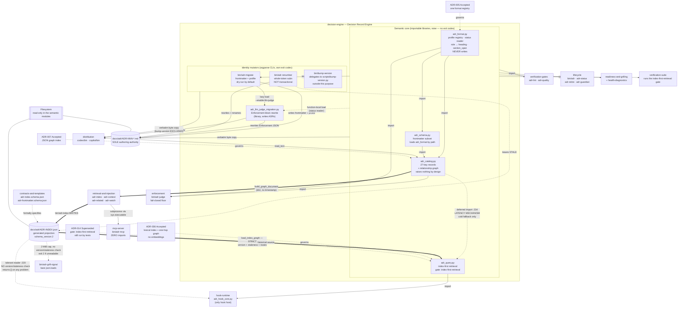

# Decision Record Engine

## Overview

- **Name**: Decision Record Engine (`decision-engine`)
- **Description**: The semantic core of adr-kit. It defines what an Architecture
  Decision Record *means* — how a Markdown body maps onto stable semantic roles
  across three body profiles, what its frontmatter must contain, how a directory
  of ADRs projects into shared records and a node-and-edge graph, and how that
  graph answers retrieval queries. It also owns the two mutators of ADR
  *identity*: profile/frontmatter migration and renumbering — plus
  `adr_llm_judge_migration.py`, the deterministic Enforcement-block rewrite that
  `bin/adr-migrate --enable-llm-judge` loads for the upgrade skill.
- **Type**: **Importable Python library (4 semantic modules plus one migration
  module) plus three single-file CLI front-ends.** This split matters and is not
  cosmetic — the five library modules define no `main()`, use no `argparse`, and
  have no `__main__` block (verified by grep). They **raise**; the calling script
  maps exceptions to exit status. The three CLIs have their own argparse surfaces
  and exit-code conventions. A reader who assumes the whole component behaves
  like the rest of `bin/` will get the failure model wrong.
- **Technology**: Python 3.10+, `from __future__ import annotations`
  throughout. **Zero third-party imports** across all eight files — verified by
  enumerating every `import` statement. Standard library only: `re`, `json`,
  `pathlib`, `typing`, `functools.lru_cache`, `datetime.date`, `fnmatch`,
  `argparse`, `sys`, `importlib.machinery`/`importlib.util` (explicit-path
  sibling loading). No network, no external CLI invoked, no subprocess.
- **Size**: 4,017 lines across 8 files: 2,686 semantic library (`adr_format`
  1,028, `adr_schema` 466, `adr_catalog` 514, `adr_query` 678), 314 migration
  module (`adr_llm_judge_migration.py`), 1,017 CLI (`adr-migrate` 692,
  `adr-renumber` 254, `bump-version` 71).

### Role in the system, stated precisely

The framing "the component every other component reads through" is **almost**
true, and the exception is load-bearing:

- **Every Python consumer reads through it.** 24 shipped files outside the
  component import these modules by bare name: 22 in `bin/` (`adr`,
  `adr-context`, `adr-discover`, `adr-doctor`, `adr-generate-scripts`,
  `adr-guardian`, `adr-index`, `adr-judge`, `adr-lint`, `adr-quality`,
  `adr-readiness`, `adr-related`, `adr-retire`, `adr-status`, `adr-substance`,
  `adr-suggest`, `adr-watch`, `adr_doctor_core.py`, `adr_index_core.py`,
  `adr_quality_core.py`, `adr_readiness.py`, `adr_retrieval_health.py`) plus
  `hooks/adr_hook_core.py` and `scripts/benchmark-adr-grilling.py` (verified by
  grep for `from adr_* import` / `_load_sibling("adr_*")` on 2026-10-06).
  None of them parses ADR Markdown itself.
- **`bin/adr-mcp` does not import it at all.** Verified: zero occurrences of
  `adr_catalog`/`adr_format`/`adr_schema`/`adr_query` in the file, and its
  import block is stdlib-only. The MCP server reaches this component *only* by
  spawning sibling CLIs through `sys.executable`. That buys crash isolation and
  exact CLI/MCP outcome parity at the cost of one interpreter start per tool
  call.

There is no second implementation. A native hook host that re-implemented the
ranking was retired in 0.55.1 under ADR-029 ("Retire the Native Hook Binary
Rather Than Maintain a Second Retrieval Engine"); Python is the only hook host.

So: **every Python consumer imports it; the MCP server subprocesses to it.**

### Governing ADRs (verified against the ADR bodies)

| ADR | Status | How it governs this component |
|---|---|---|
| [ADR-005](../docs/adr/ADR-005-selectable-agent-friendly-adr-formats.md) — *Use Selectable ADR Body Profiles with MADR as the Default* | Accepted | Mandates "one semantic format registry" for `madr`/`nygard`/`canonical` with MADR as default. That registry **is** `adr_format.py`. Item 6 — *"Migration between supported profiles is explicit, dry-run by default, content-preserving, deterministic, and idempotent"* — is the contract `adr-migrate --to-profile` implements. Supersedes ADR-003. |
| [ADR-007](../docs/adr/ADR-007-json-adr-graph-index-for-agent-retrieval.md) — *JSON ADR Graph Index for Agent Retrieval* | Accepted | Mandates a versioned node-and-edge graph generated "from one shared, format-aware semantic record loader". That loader **is** `adr_catalog.py`; ADR-007's References cite `bin/adr_format.py` directly. |
| [ADR-036](../docs/adr/ADR-036-retire-the-vector-layer-and-run-the-judge-on-the-host-model-only.md) — *Retire the vector layer and run the judge on the host model only* | Accepted, `binding: true`, `gate: "adr-host-only-judge-v1"` | Decision point 4 fixes retrieval as **lexical scoring over the generated index plus one-hop graph neighbours**, with no embedding model in the path — which is exactly what `adr_query` does. It also states why `adr_catalog.public_adr_node` empties the Decision Contract of a Superseded node (`adr_catalog.py:481-489`): authority is joined from status at search time, and the empty shape keeps the graph inside the 2 KiB-per-ADR budget. |
| [ADR-014](../docs/adr/ADR-014-use-the-generated-adr-graph-as-the-selective-context-query-engine.md) — *Use the Generated ADR Graph as the Selective-Context Query Engine* | **Superseded** (chain ADR-014 → ADR-018 → ADR-020 → ADR-036), `binding: true`, `gate: "index-first-retrieval"` | Historical source of the index-first design this component still implements. Its `verified_in` names `bin/adr_query.py:INDEX_FIRST_RETRIEVAL_GATE` — the literal string anchor at `adr_query.py:16`, still present — and `tests/test_adr_query.py` still runs the `index-first-retrieval` gate. Defined schema-v2 retrieval metadata, the three-value authority model, and the fail-open Markdown fallback posture; ADR-036 re-affirms its prohibition on embedding models in the retrieval path. |
| [ADR-013](../docs/adr/ADR-013-declare-version-sites-in-one-registry-and-bump-by-writing.md) — *Declare Version Sites in One Registry and Bump by Writing* | Accepted 2026-07-22 | Names `scripts/bump-version.py` as the one bump writer; `bin/bump-version` is now a thin delegate to it. See "The `bump-version` exception" below. |

**ADR-004** (layered context injection) is architecturally adjacent — it defines
the task tier that *consumes* this component — but its Decision constrains
`bin/adr-context` and the injection tiers, not these modules, so it is not cited
as governing. Note ADR-004 describes that tier as "five weighted signals";
`adr_query.FIELD_WEIGHTS` now weights **eight** fields, a post-ADR-014 change.

**No Accepted ADR's Enforcement `path_glob` covers `bin/adr_*.py`.** ADR-005's
glob targets `schemas/adr-kit-config.schema.json` (verified in source),
ADR-007's targets `docs/adr/ADR-INDEX.json`, ADR-014 shipped empty rule arrays,
and ADR-036 has no `## Enforcement` section at all (its gate is verified in
`tests/test_adr_judge_llm.py`). The only rule that ever named a file here — ADR-018's
`forbid_pattern` on `bin/adr_query.py` (no network or subprocess imports) —
belongs to a Superseded record and is no longer enforced. The semantic
authority for the entire toolkit is therefore unguarded by the very pre-commit
mechanism it powers. **The retrieval gate is enforced by tests, not by the
judge.**

---

## Purpose

adr-kit accepts three different ADR body layouts (MADR, Nygard, canonical) and
serves them to five different kinds of reader (the `bin/` CLIs and their support
modules, a hook runtime, an MCP server, a test suite, and CI). Without a single semantic layer, every tool would grow its
own Markdown parser and they would disagree — which is exactly the bug class this
component was built to close. `tests/test_adr_index.py` loads six tools side by
side purely to assert that every status reader delegates to
`adr_catalog.adr_status`, the fix for a forked-regex bug (PR #38) where one ADR
read as `Accepted` by one tool and `Unknown` by another. Since 0.56.0 the
frontmatter *writer* uses that reader too (issue #118): before, inference
defaulted to `Proposed` on any Status shape it could not parse, and
`adr-migrate` wrote the guess with exit 0.

Four problems it solves:

1. **Format pluralism without parser proliferation.** Headings map to stable
   *roles*; engines consume roles, never literal heading text (ADR-005 point 1).
2. **A machine-readable projection of a human-authored corpus.** Markdown stays
   the sole authoring authority; the JSON graph is a *generated runtime
   projection* with a visible Markdown fallback (ADR-007, ADR-014).
3. **Deterministic, bounded, model-free retrieval.** Ranking uses positive field
   evidence only — no recency, no negative signals, no relationship count, no
   embedding, no LLM, no network.
4. **Safe identity mutation.** Renumbering an ADR after a merge collision and
   migrating a body between profiles are the two operations that must never
   half-apply.

**What it deliberately does not do:** it never writes `ADR-INDEX.json` (that is
`bin/adr-index`, a different component), never decides lifecycle status
transitions (that is `bin/adr`), and never blocks a commit (that is
`bin/adr-judge`). `adr_format` never writes a file at all — `migration_notice`
returns data-only advice with a hard-coded `"writes_automatically": False`
(`adr_format.py:680`), which is what lets lint, install, upgrade and
`adr-migrate` render identical guidance from one implementation. Where a writer
elsewhere needs to place text inside a section, `adr_format.section_span()`
(`:796`, 0.56.0) returns the offsets `section_text()` reads from, so writer and
reader share one matcher; `bin/adr` uses it to put `status_history` entries
inside `## Status History` (issue #119).

---

## Software Features

| Feature | Description |
|---|---|
| **Semantic profile registry** | `PROFILE_HEADINGS` maps 3 profiles × 13 roles to heading text; `REQUIRED_ROLES` plus MADR's extra `drivers` requirement. `_validate_profile_catalog_contract` is a self-check that raises if the catalog drifts from `SUPPORTED_PROFILES`. |
| **Fence-aware profile detection** | `detect_profile` — a declared frontmatter `format:` wins; otherwise deterministic heading detection yields a supported profile, `hybrid`, or `unknown`. `@lru_cache(maxsize=256)`. `detect_legacy_profile` recognizes Y-Statement / Tyree-Akerman / arc42 as *migration inputs*, never as storage profiles. |
| **Role-based section extraction** | `section_text(text, role, *, profile=None, tolerant=True)` — the workhorse every other component calls to read a Decision, Context or Consequences section without knowing the body profile. `section_span` returns the same section's offsets for writers. |
| **Unwritten-section detection** | `unfilled_required_sections` / `unfilled_required_roles` report required headings that are present but empty *or* hold only a placeholder; `placeholder_required_sections` returns only the placeholder half (consumed by `adr_readiness.py` for its `SECTION_PLACEHOLDER_ONLY` finding). Both placeholder spellings count — the `- TODO:` item `adr-migrate` writes and the `<!-- TODO: ... -->` comment the `/adr-kit:migrate` skill writes (0.57.0). The present-but-empty completeness failure itself is enforced in `bin/adr-lint`, not here. |
| **Open-question grouping** | `open_question_items` groups an Open Questions section into one item per top-level bullet, including wrapped lines and nested bullets (0.58.0); `unresolved_open_questions` and `all_open_questions` read through it, so a multi-line question is one question everywhere. |
| **Invariant frontmatter schema** | 10 always-emitted fields + 7 optional fields (`related`, `topics`, `aliases`, `components`, `symbols`, `context_scope`, `format`), 6 valid statuses, 2 context scopes. `render_frontmatter` ↔ `parse_frontmatter` is a closed round-trip over a deliberate YAML *subset* (scalars plus string lists) — not a general YAML parser. |
| **Frontmatter validation and inference** | `validate_frontmatter` returns human-readable issues (ADR id shape, ISO dates via `date.fromisoformat`, booleans, reference lists, retrieval bounds ≤32 entries / ≤120 chars / case-insensitively unique). `infer_frontmatter` reconstructs canonical metadata from legacy prose without editing the body; it reads the status through `adr_status` and leaves it `None` when unreadable rather than guessing, and recovers date and `superseded_by` from the same line via `status_statement`, including the link-wrapped `Superseded by [ADR-124](...)` form (0.56.0). |
| **Tolerant semantic record projection** | `load_adr_record` yields a shared 27-key record. Malformed frontmatter becomes a `FRONTMATTER_MALFORMED` finding and discovery continues from invariant prose rather than failing. Finding codes: `FRONTMATTER_MALFORMED`, `STATUS_UNKNOWN`, `FORMAT_UNKNOWN`, `RETRIEVAL_METADATA_INVALID`. |
| **Relationship graph construction** | `build_relationships` emits sorted, de-duplicated directed edges of type `related` / `supersedes` / `superseded-by` / `amended-by`, each with a `resolved` boolean. `build_graph_document` assembles the schema-v2 document — with **no timestamp**, by design (ADR-007 point 2), so regeneration is byte-stable. |
| **Single cross-tool status reader** | `adr_status` (`adr_format.py:147`, re-exported by `adr_catalog`) resolves `## Status` body, then bold-inline `**Status:** X`, then a plain `Status: X` line, and returns `None` rather than guessing — a deliberate superset of the older per-tool regexes so index, judge, lint, retire, watch and frontmatter inference cannot disagree. It lives in `adr_format` because `adr_schema` needs it and `adr_catalog` imports `adr_schema`, not the reverse. |
| **Enforcement-block extraction** | `ENFORCEMENT_BLOCK_RE` and `enforcement_globs` — re-exported to `adr-judge`, `adr-status` and `adr-generate-scripts`, making this component the parser of the enforcement contract it does not itself enforce. |
| **Decision Contract projection** | `decision_contract` projects the optional `## Decision Contract` into `must` / `must_not` / `exceptions` / `verification` (with `Confirmation` mapping onto `verification`), bounded at 240 chars × 20 items. |
| **Strict index reading** | `load_index_graph` validates schema version, **freshness against every `ADR-*.md` mtime**, node structure and duplicate ids, and raises `IndexQueryError`. Staleness is part of the contract, not a warning. |
| **Index-first ranked retrieval** | `score_record` over 8 weighted fields (`path 1.0` → `decision_summary 0.40`), capped at 1.0, with an early `break` once the score saturates. Explicit filter hits score full coverage; lexical hits score `matched_tokens / query_keywords`. |
| **Authority model** | `governing` (Accepted) / `advisory` (Proposed) / `historical`. A `Superseded` match is **not returned** but *redirects* its score to a live successor with a `successor_redirect` marker and a `redirected_from` field. Other historical statuses are dropped unless `include_history`. Ordering is `(-total, ADR-number, ADR-id)` — ADR id is the stable final tie-breaker. |
| **Bounded one-hop expansion** | After ranking, `query_records` appends up to `MAX_SUPPORTING_RESULTS = 2` one-hop `related` ADRs (`adr_query.py:45`, enforced at `:562-565`) — ADR-014's "at most two one-hop supporting ADRs", kept by ADR-036's "one-hop graph neighbours". These carry `role="supporting"` and `score=0.0`, which is where the `role` field of the result contract gets its second value; every directly-matched ADR is `role="primary"`. A consumer of the 25-key payload must expect results it did not match on. |
| **Visible fail-open fallback** | On `IndexQueryError`, `query_adr_context` re-raises when `strict_index=True`, else emits `[adr-context] WARN: …; using Markdown compatibility fallback` into `warnings` and rebuilds the graph from Markdown. Degradation is always observable in the payload (`source`, `engine`). |
| **Profile migration** | `convert_profile` renames the five body roles, appends placeholder blocks for roles the target requires but the source lacks, then stamps the frontmatter discriminator. Refuses when `--from-profile` conflicts with a declared format, or when `context`/`decision`/`consequences` are missing. `adr-migrate` then reports each section that run left unfilled as `needs content: ## <heading>` — comparing *roles* before and after, each side read in its own profile, so a hole the source already had is not blamed on the conversion (0.57.0, 0.58.0) — and lists a Related Decisions section it had to add as `review: ## Related Decisions` (written as `- None.`). The report is advisory: a placeholder still passes the completeness gate by design. |
| **LLM-judge opt-out migration** | `adr_llm_judge_migration.apply` rewrites the `## Enforcement` JSON of existing ADRs for the `llm_judge: true` default: a bare `"llm_judge": false` is treated as a leftover and removed, a `false` with `llm_judge_reason` is a recorded decision and left alone, and a rule-less block is marked no-code-surface unless force-enabled. Driven by `adr-migrate --enable-llm-judge [--except … --reason …] [--force-enable …]` from the upgrade skill. Deterministic, no prompting. |
| **Migration planning and advice** | `adr-migrate --plan` reads *every* `*.md` (so legacy filenames like `0010-use-queues.md` are seen) and emits `deterministic-preview` or `guided-migration` notices. Always read-only, always exit 0, always closes with *"No files changed. Migration is never automatic."* |
| **Retrieval-metadata suggestion** | `adr-migrate --suggest-retrieval --dry-run` derives topics/components/symbols and a Decision Contract *candidate* from existing ADR evidence. Existing values always win over derived ones; every result carries `requires_human_approval: True` and `writes_automatically: False`. |
| **ReDoS-hardened renumbering** | `adr-renumber` builds `\bADR-(?:0043\|043\|43)(?!\d)` — a pure alternation of literal spellings sorted longest-first, linear time by construction. Whole-token only: renumbering `ADR-043` provably never touches `ADR-0430`. Gaps are never reused (`max(used) + 1`), because a gap usually means a retired or reserved number. |

---

## Code Elements

| Code document | Role in this component |
|---|---|
| `c4-code-bin-lib-semantic-core.md` | The four importable library modules (2,686 lines) that *are* the semantic layer: `adr_format.py` (profile registry, role↔heading, status reader, section spans and unwritten-section detection), `adr_schema.py` (frontmatter subset), `adr_catalog.py` (records + graph), `adr_query.py` (index-first retrieval). No CLI surface, no exit codes — these raise. |
| `c4-code-bin-cli-migration.md` | The identity mutators: `bin/adr-migrate` (692 lines — depends on the semantic layer) and `bin/adr-renumber` (254 lines — deliberately standalone so it keeps working while the parsing layer is mid-migration). Also carries `bin/bump-version`, which is in the cluster but outside this component's purpose — see below. `bin/adr_llm_judge_migration.py` (314 lines) is not yet claimed by a code document; it is placed here by its only caller, `bin/adr-migrate:541`. |

### Internal dependency spine

`adr_format` → `adr_schema` → `adr_catalog` → `adr_query`, with one deliberate
inversion:

- `adr_format` has **zero** internal dependencies — the root of the component.
- `adr_schema` loads `adr_format` itself, by explicit file path via
  `_load_sibling` (`:22-44`), then imports `SUPPORTED_PROFILES`, `adr_status`
  and `status_statement` (`:46`). It never touches `sys.path` (TASK-62).
- `adr_catalog` imports from both (`:15`, `:25`) and re-exports the status
  reader and its regexes for callers that import them from there.
- `adr_query` imports `adr_catalog` **function-locally and deferred**
  (`adr_query.py:234`), never at module scope. The comment at `:232-233` gives
  the reason: *"Keep the semantic Markdown stack off the healthy index hot
  path."* This is a **latency mechanism, not tidiness debt** — consistent with
  ADR-014's p95 threshold (250 ms through 200 ADRs) and ADR-015's 2,000 ms CLI
  ceiling. Hoisting that import to the top of the file would silently regress
  the budget.
- `adr_llm_judge_migration` loads `adr_format`, `adr_schema` and `adr_catalog`
  function-locally (`_status_word`, `:52`) to reuse the one status reader, so it
  cannot disagree with the judge about which ADRs are Accepted.

`bin/adr-migrate` loads `adr_format`, `adr_schema` and `adr_catalog` by explicit
path through its own `_load_sibling` (`:31`, `:54-56`) and loads
`adr_llm_judge_migration` lazily, only for `--enable-llm-judge` (`:541`).
`bin/adr-renumber` imports nothing from the repo.

### The `bump-version` exception

`bin/bump-version` (71 lines) sits in the migration cluster but bumps **release
versions**, not ADRs — it touches no ADR semantics and belongs to no feature
above. It is documented here for completeness only:

- **A delegate, not a second writer.** Its docstring says "This script
  implements nothing": it loads `scripts/bump-version.py` — the one writer
  ADR-013 and `docs/RELEASING.md` name — by explicit path and calls its `main`.
  The earlier duplicate implementation was removed under TASK-139 because the
  two writers did different things; the path stays only because people have it
  in their shell history. `tests/test_bump_version.py` drives the release bump
  through it.
- **Not shipped.** Absent from `packaging/executables.json` and
  `packaging/public-artifacts.json`, and excluded from client copies by
  `COPY_EXCLUSIONS = {"bin/bump-version"}` at
  `scripts/client_generation_model.py:34` — the only file in this component that
  is *not* triplicated.

---

## Interfaces

### 1. Sibling-module import (the primary interface)

**Protocol**: Python import by bare module name, after the caller inserts `bin/`
into `sys.path`. No installed package, no `__init__.py`.

**Operations** (signatures verbatim from source):

```python
# adr_format.py — the registry
section_text(text, role, *, profile=None, tolerant=True) -> str      # :844
section_span(text, role, *, profile=None, tolerant=True)
    -> Optional[Tuple[int, int]]                                     # :796
detect_profile(text) -> str                                          # :500 (@lru_cache 256)
classify_format(text) -> str                                         # :593
required_headings(profile) -> List[str]                              # :779
convert_profile(text, target, *, source=None) -> Tuple[str, str]     # :993
migration_notice(text, path, *, metadata_changed=False, ...) -> Optional[Dict]  # :633
normalize_profile(value, *, default=None) -> str                     # :294
is_migration_candidate(path, text) -> bool                           # :757
adr_status(text) -> Optional[str]                                    # :147 (re-exported by adr_catalog)
status_statement(text) -> str                                        # :175
open_question_items(section) -> List[Dict[str, Any]]                 # :368
unresolved_open_questions(text) -> List[str]                         # :448
unfilled_required_sections(text, profile) -> List[str]               # :939
placeholder_required_sections(text, profile) -> List[str]            # :951

# adr_schema.py — the frontmatter dialect
split_frontmatter(text) -> Tuple[Optional[str], str]                 # :115
parse_frontmatter(raw) -> Dict                                       # :152
render_frontmatter(data) -> str                                      # :272
infer_frontmatter(body, path=None) -> Dict                           # :182
validate_frontmatter(data) -> List[str]                              # :355
migrate_text(text, path=None) -> Tuple[str, bool, List[str]]          # :451

# adr_catalog.py — records and graph
load_adr_record(path) -> Dict                                        # :314
load_adr_records(adr_dir) -> List[Dict]                              # :424
build_relationships(records) -> List[Dict]                           # :430
public_adr_node(record) -> Dict                                      # :467
build_graph_document(records, *, schema_ref=GRAPH_SCHEMA_REF) -> Dict # :503
enforcement_globs(text) -> List[str]                                 # :95
decision_contract(text) -> Dict[str, List[str]]                      # :236
ENFORCEMENT_BLOCK_RE                                                 # :44 (re-exported)

# adr_llm_judge_migration.py — Enforcement-block rewrite
apply(adr_dir, *, opt_out_ids=(), no_code_surface_ids=(),
      force_enable_ids=(), opt_out_reason="", dry_run=False) -> Dict # :220
scan(adr_dir) -> List[Dict]                                          # :153

# adr_query.py — retrieval
query_adr_context(query, adr_dir, *, limit=5, min_score=0.1,
                  strict_index=False, include_history=False,
                  statuses=(), authorities=(), paths=(),
                  symbols=(), components=(), topics=()) -> Dict      # :593
load_index_graph(adr_dir) -> Tuple[List[Dict], List[Dict], int]      # :201
query_records(...) -> List[Dict]                                     # :456
score_record(...) -> Dict                                            # :305
```

**Loading-order trap**: only `adr_schema` loads its own dependency (`adr_format`,
by explicit path, `:22-44`). `adr_catalog` and `adr_query` use bare
`from adr_format import …` / `from adr_catalog import …`, so the caller must
already have made the siblings importable. The `bin/` entrypoints do that with a
per-file `_load_sibling` that registers each module in `sys.modules` in
dependency order (`adr_format`, `adr_schema`, `adr_catalog`) without touching
`sys.path` — the TASK-62 hardening, because inserting `bin/` ahead of the
standard library let any file committed beside the scripts execute as code.
`hooks/adr_hook_core.py` is the exception that still inserts `bin/` into
`sys.path` (`:28-29`) before importing `query_adr_context` (`:31`). Several test
files likewise load these modules by explicit path rather than by plain import.

### 2. The `docs/adr/ADR-INDEX.json` document contract

**Protocol**: JSON file on disk, formally specified by
[`schemas/adr-index.schema.json`](../schemas/adr-index.schema.json).

This component owns **both ends of the contract but not the serialization step**:

| Stage | Owner | Component |
|---|---|---|
| Build the document (in memory) | `adr_catalog.build_graph_document` | **this one** |
| Write it to disk | `bin/adr-index` | retrieval/index component |
| Read and validate it strictly | `adr_query.load_index_graph` | **this one** |

**Shape**: `{$schema, schema_version: 2, adrs[], relationships[]}`. Node keys:
`id, title, path, format, status, date, decision_summary, topics, aliases,
components, symbols, context_scope, decision_contract, scope, metadata`. Edge
keys: `source, target, type, resolved` with
`type ∈ {related, supersedes, superseded-by, amended-by}`.

**Freshness is part of the contract.** `load_index_graph` compares `st_mtime_ns`
against every `ADR-*.md` and rejects a graph older than any of them.

### 3. The frontmatter round-trip contract

**Protocol**: YAML-subset text embedded in each ADR Markdown file. Formal schema:
[`schemas/adr-frontmatter.schema.json`](../schemas/adr-frontmatter.schema.json).

`render_frontmatter` ↔ `parse_frontmatter`, scoped by the module docstring itself
to "scalar fields plus string lists". Field order is stable: 10 required, then
optional-if-present, then remaining keys sorted alphabetically — so regeneration
never produces spurious diffs.

Note: the JSON Schema is **documentation**; `bin/adr_schema.py:48-78` is the
operative contract. It re-declares the same 10 required fields in the schema's
exact order plus `VALID_STATUSES` and `VALID_CONTEXT_SCOPES`, and no test
imports both. `schemas/adr-frontmatter.schema.json` has **no consumer repo-wide**
— no test, no ajv step, no runtime reader.

### 4. The `query_adr_context` result contract (de-facto RPC payload)

**Protocol**: Python dict, serialized to JSON by `bin/adr-context --format json`
and re-exposed as the `adr_context` MCP tool by `bin/adr-mcp`.

Returns `{results, warnings, source, engine, schema_version}` where `source ∈
{index-v1, index-v2, markdown-fallback}` and `engine ∈ {index-first,
markdown-fallback}`. Each of the 25-key results carries `adr_id, title, path,
status, is_accepted, authority, role, format, decision_summary, scope,
related_ids, metadata, topics, aliases, components, symbols, context_scope,
decision_contract, score, signals, matches, source, engine, schema_version,
redirected_from`.

### 5. `bin/adr-migrate` — CLI

```
adr-migrate [path=docs/adr] [--check] [--plan] [--dry-run]
            [--format {text,json}]
            [--to-profile {madr,nygard,canonical}]
            [--from-profile {madr,nygard,canonical}]
            [--suggest-retrieval]
            [--enable-llm-judge [--except IDS --reason TEXT]
                                [--force-enable IDS]]
```

Writes only when neither `--check` nor `--dry-run` is passed (`:648`).
Mutual exclusion enforced at `:507-534`; `--enable-llm-judge` combines with
nothing but `--dry-run` and `--format`, and `--except`/`--force-enable`/`--reason`
require it.

**Exit codes**: `0` success (including *every* `--plan` run); `1` only in
`--check` mode when a file needs migration; `2` on any file failure, a
`--suggest-retrieval` failure, a rejected `--to-profile`, or a refused
`--enable-llm-judge` argument set.

**Three JSON shapes keyed by `mode`**: `plan` /
`retrieval-suggestions` (with `requires_human_approval: true`,
`writes_automatically: false`) / `check|dry-run|write`; each per-file result in
the last carries `unfilled_sections`. `--enable-llm-judge` prints the result of
`adr_llm_judge_migration.apply` instead.

**Callers**: `skills/migrate/SKILL.md`, `skills/upgrade/SKILL.md`
(`--enable-llm-judge`), `docs/format-migration.md`,
`docs/selective-context.md`, `clients/workflows.json`. Declared a shipped
entrypoint at `packaging/executables.json:116`.

### 6. `bin/adr-renumber` — CLI

```
adr-renumber <source> [--to ADR-NNN] [--adr-dir DIR] [--apply] [--version]
```

`source` is an ADR id or a `.md` path; `--to` defaults to `max(used) + 1`.
Dry-run by default; `--apply` executes. No JSON mode — the plan is
human-readable `file:line` text, deliberately greppable and clickable.

**Exit codes**: `0` success; `2` input error (source missing, target taken,
target equals source, ambiguous source, malformed id, missing directory).

### 7. Failure channel

| Exception | Raised by | Meaning |
|---|---|---|
| `AdrFormatError(ValueError)` | `adr_format` | Unsupported profile, undetectable body format, missing semantic section, catalog drift |
| `FrontmatterError(Exception)` | `adr_schema` | Frontmatter outside the supported YAML subset |
| `IndexQueryError(RuntimeError)` | `adr_query` | Graph missing / stale / unparseable / unsupported version / duplicate ids |
| `ValueError` | `adr_query.query_adr_context` | Argument validation |
| `ValueError` | `adr_llm_judge_migration.apply` / `opt_out` | Opt-out without a reason, or an ADR named both opt-out and no-code-surface; `adr-migrate` maps it to exit 2 |
| `RenumberError(Exception)` | `bin/adr-renumber` | Input error, mapped once in `main` to exit 2 |

`adr_catalog` **raises nothing of its own by design** — it degrades into
`metadata_findings` entries so index and retrieval stay available on damaged
input. Whether a caller sees an exception or a warning is a deliberate policy
split: `strict_index=True` and CI fail loudly; hooks and interactive context
fail open (ADR-014).

---

## Dependencies

> **Note on sibling slugs**: no component registry exists in the repository, so
> the slugs below are inferred from the verifiable Code-phase cluster names. Each
> entry names the `c4-code-*.md` document that resolves it, so the reference
> holds even if a sibling document chose a different slug.

### Components used

**None for the library half.** `adr_format`, `adr_schema`, `adr_catalog` and
`adr_query` import no other repo module — this is a **leaf-root component**. The
entire dependency chain is internal and architecturally load-bearing. `adr-migrate`
and `adr_llm_judge_migration` depend only on the library half; `adr-renumber`
depends on nothing. `bin/bump-version` is the one outbound edge, and it leaves
the component's purpose rather than its layer: it delegates to
`scripts/bump-version.py`.

That inversion is the component's defining structural property: it is depended
*upon*, not depending.

### Components that depend on this one

| Consumer (inferred slug) | Resolved by | Mechanism |
|---|---|---|
| `enforcement` | `c4-code-bin-cli-enforcement.md` | **Python import.** `bin/adr-judge` imports `ENFORCEMENT_BLOCK_RE`, `adr_id_from_filename`, `adr_status` from `adr_catalog` and `section_text` from `adr_format` (format-aware Decision extraction). `bin/adr-generate-scripts` imports the same enforcement extractor. |
| `enforcement` (discovery path) | `c4-code-bin-cli-enforcement.md`, `c4-code-bin-lib-doctor.md` | **Python import + subprocess.** `bin/adr-discover:66` imports only `SUPPORTED_PROFILES, detect_profile` from `adr_format` — verified; it is a format-registry consumer, not a catalog consumer. Reached as a subprocess by `adr_doctor_core` on material drift. (Since ADR-026 the name `bin/adr-audit` belongs to the combined lint + judge command, which imports nothing from this component.) **Divergence risk touching this component's enforcement-glob semantics:** `bin/adr-discover:155` holds a duplicated `glob_to_regex` beside the judge's own (`bin/adr-judge:672`), so glob translation exists in two hand-synced copies while `adr_catalog.enforcement_globs` supplies the globs to both. |
| `verification-gates` | `c4-code-bin-cli-gates.md` | **Python import.** `bin/adr-lint` imports from all three of format/schema/catalog; `bin/adr-quality` and `adr_quality_core.py` import `adr_format` (and the core also `adr_catalog`). |
| `retrieval-and-injection` | `c4-code-bin-cli-retrieval.md` | **Python import + JSON file.** `bin/adr-index` and its importable generator `adr_index_core.py` call `build_graph_document`, and `bin/adr-index` **writes** the graph; `bin/adr-context` calls `query_adr_context`; `bin/adr-related`, `bin/adr-watch`, `bin/adr-suggest` import catalog/format. |
| `lifecycle` | `c4-code-bin-cli-lifecycle.md` | **Python import.** `bin/adr` imports `adr_format` (profile catalog for `adr new --profile`, and `section_span` so status-history writes land inside `## Status History`) and `adr_schema` (frontmatter round-trip for status transitions); `adr-status`, `adr-retire` and `adr-guardian` import `adr_catalog` *specifically so reports agree with what `adr-judge` acts on*. |
| `readiness-and-grilling` | `c4-code-bin-lib-readiness-grill.md` | **Python import.** `adr_readiness.py` imports `load_adr_records`/`build_relationships`/`normalize_adr_id` and `all_open_questions`/`placeholder_required_sections`; `adr_retrieval_health.py` imports `load_index_graph`/`query_records`/`IndexQueryError`; `bin/adr-substance` imports catalog/format. |
| `health-diagnostics` | `c4-code-bin-lib-doctor.md` | **Python import.** `adr_doctor_core.py` imports `parse_frontmatter`/`split_frontmatter`; `bin/adr-doctor` pre-loads all four library modules in dependency order. |
| `hook-runtime` | `c4-code-hooks.md` | **Two mechanisms.** `hooks/adr_hook_core.py:31` imports `query_adr_context` (Python) *and* `:220 load_index_records` reads `ADR-INDEX.json` with its own tolerant reader. |
| `mcp-server` | `c4-code-bin-cli-mcp.md` | **Subprocess only — no import.** `bin/adr-mcp` spawns `bin/adr-context` etc. via `sys.executable`. Verified: zero references to any `adr_*.py` module. |
| `contracts-and-templates` | `c4-code-schemas-templates.md` | **JSON Schema files on disk.** `adr-index.schema.json` and `adr-frontmatter.schema.json` specify this component's two data contracts; `adr_catalog.GRAPH_SCHEMA_REF` stamps the relative `$schema` pointer. |
| `distribution` | `c4-code-generated-distributions.md`, `c4-code-packaging-ci.md` | **Verbatim byte copy.** `scripts/build-client-adapters.py` copies all four modules plus `adr_llm_judge_migration.py` and `adr-migrate`/`adr-renumber` into `codex/bin/` and `copilot/bin/` (`COPY_ROOTS` includes `bin`). `bin/bump-version` alone is excluded. |
| `verification-suite` | `c4-code-tests.md` | **Python import + subprocess.** 17 test modules reference the four library modules by name or path (grep, 2026-10-06), plus `tests/test_adr_llm_judge_migration.py`; several load them by explicit file path, and the CLIs are driven as subprocesses. The suite is what runs the `index-first-retrieval` gate. |

### External systems

| System | How used |
|---|---|
| **Filesystem** | Read-only in the four semantic modules — `Path.read_text`, `Path.glob`, `Path.is_file`, `Path.stat`; none of them writes a file. The writers are `adr-migrate` (ADR text, `:205`), `adr_llm_judge_migration` (the `## Enforcement` JSON, `:196`, `:216`) and `adr-renumber` (rewrites lines and calls `Path.rename`). None of the three uses an atomic temp-file-and-replace write (see below). |
| **Nothing else.** | No network. No database. No LLM — `adr_llm_judge_migration` edits the `llm_judge` *flag* but never calls a model. No `git`, `gh` or `claude` CLI. No `subprocess`, no `os.system`. **No environment-variable reads** — `os` is not imported in any of the eight files. |

---

## Component Diagram


```mermaid
flowchart TB
    subgraph DE["decision-engine — Decision Record Engine"]
        direction TB
        subgraph LIB["Semantic core (importable libraries, raise — no exit codes)"]
            direction LR
            FMT["adr_format.py<br/>profile registry · status reader<br/>role → heading · section_span<br/>NEVER writes"]
            SCH["adr_schema.py<br/>frontmatter subset<br/>loads adr_format by path"]
            CAT["adr_catalog.py<br/>27-key records<br/>+ relationship graph<br/>raises nothing by design"]
            QRY["adr_query.py<br/>index-first retrieval<br/>gate: index-first-retrieval"]
            FMT -->|import| SCH
            FMT -->|import| CAT
            SCH -->|import| CAT
            CAT -.->|"deferred import :234<br/>LATENCY MECHANISM<br/>cold fallback only"| QRY
        end
        subgraph CLI["Identity mutators (argparse CLIs, own exit codes)"]
            direction LR
            MIG["bin/adr-migrate<br/>frontmatter + profile<br/>dry-run by default"]
            REN["bin/adr-renumber<br/>whole-token subn<br/>NOT transactional"]
            BUMP["bin/bump-version<br/>delegates to scripts/bump-version.py<br/>outside this purpose"]
        end
        LJM["adr_llm_judge_migration.py<br/>Enforcement-block rewrite<br/>(library, writes ADRs)"]
        LIB -->|import| MIG
        MIG -->|"lazy load<br/>--enable-llm-judge"| LJM
        LIB -.->|"function-local load<br/>(status reader)"| LJM
    end

    MD[("docs/adr/ADR-NNN-*.md<br/>SOLE authoring authority")]
    IDXJSON[("docs/adr/ADR-INDEX.json<br/>generated projection<br/>schema_version 2")]
    SCHEMAS["contracts-and-templates<br/>adr-index.schema.json<br/>adr-frontmatter.schema.json"]

    MD -->|"read_text"| CAT
    MIG -->|"writes frontmatter + profile"| MD
    LJM -->|"rewrites Enforcement JSON"| MD
    REN -->|"rewrites + renames"| MD
    REN -.->|"leaves STALE"| IDXJSON

    CAT ==>|"build_graph_document<br/>(dict, no timestamp)"| RET
    RET ==>|"bin/adr-index WRITES"| IDXJSON
    IDXJSON ==>|"load_index_graph — STRICT<br/>version + staleness + nodes"| QRY
    SCHEMAS -.->|"formally specifies"| IDXJSON

    RET["retrieval-and-injection<br/>adr-index · adr-context<br/>adr-related · adr-watch"]
    ENF["enforcement<br/>bin/adr-judge<br/>fail-closed floor"]
    GATES["verification-gates<br/>adr-lint · adr-quality"]
    LIFE["lifecycle<br/>bin/adr · adr-status<br/>adr-retire · adr-guardian"]
    READY["readiness-and-grilling<br/>+ health-diagnostics"]
    HOOKS["hook-runtime<br/>adr_hook_core.py<br/>(only hook host)"]
    GRILL["bin/adr-grill-signal<br/>bare json.loads"]
    MCP["mcp-server<br/>bin/adr-mcp<br/>ZERO imports"]
    DIST["distribution<br/>codex/bin · copilot/bin"]
    TESTS["verification-suite<br/>runs the index-first-retrieval gate"]

    CAT -->|import| ENF
    FMT -->|import| ENF
    LIB -->|import| GATES
    LIB -->|import| LIFE
    LIB -->|import| READY
    QRY -->|import| HOOKS
    IDXJSON -.->|"tolerant reader :220<br/>NO version/staleness check<br/>returns [] on any problem"| HOOKS
    IDXJSON -.->|"2 MiB cap, no version/staleness check<br/>exit 2 if unreadable"| GRILL
    RET -->|"subprocess via sys.executable"| MCP
    LIB -->|"verbatim byte copy"| DIST
    LJM -->|"verbatim byte copy"| DIST
    CLI -->|"verbatim byte copy<br/>(bump-version EXCLUDED)"| DIST
    LIB -->|"import + subprocess"| TESTS

    FS[["Filesystem<br/>read-only in the semantic modules"]]
    FS --- MD
    FS --- IDXJSON

    ADR005["ADR-005 Accepted<br/>one format registry"]
    ADR007["ADR-007 Accepted<br/>JSON graph index"]
    ADR036["ADR-036 Accepted<br/>lexical index + one-hop graph<br/>no embeddings"]
    ADR014["ADR-014 Superseded<br/>gate: index-first-retrieval<br/>still run by tests"]
    ADR005 -.->|governs| FMT
    ADR007 -.->|governs| CAT
    ADR036 -.->|governs| QRY
    ADR014 -.->|"historical source"| QRY
```

Reading the diagram: the thick spine
`Markdown → adr_catalog → bin/adr-index → ADR-INDEX.json → adr_query` is the
intended runtime flow under ADR-007 and ADR-036 (inheriting ADR-014's design).
The dashed `adr_catalog ⇢ adr_query` edge is the compatibility fallback that
exists only because of the deferred import — it is meant to stay cold. The two
dashed edges out of `ADR-INDEX.json` into lenient readers, set against the strict
`load_index_graph` edge, are the strictness divergence described below.

---

## Notable characteristics carried forward from the Code phase

These are the architecturally surprising facts a reader of this component needs.
Each was verified in source.

1. **Three independent readers of `ADR-INDEX.json` at different strictness
   levels.** `adr_query.load_index_graph` validates schema version, staleness,
   node structure and duplicate ids, and **raises**. `hooks/adr_hook_core.py:220
   load_index_records` reads the same file, caps it at 2 MiB, and returns `[]`
   on any problem — **no version check, no staleness check** (verified in
   source). `bin/adr-grill-signal:107-109` applies the same 2 MiB cap and a bare
   `json.loads`, exiting 2 on an unreadable file — again no version or
   staleness check. The fail-open hook posture is what ADR-014 asked for, but
   the consequence is that **a stale or schema-v1 graph is rejected by the query
   engine and accepted by both lenient readers.**

2. **No Accepted ADR's Enforcement `path_glob` covers `bin/adr_*.py`.** The
   semantic authority for the entire toolkit is unguarded by the pre-commit
   judge it powers. ADR-014 (now Superseded) is `binding: true` with
   `gate: "index-first-retrieval"` and names
   `bin/adr_query.py:INDEX_FIRST_RETRIEVAL_GATE` in `verified_in`, yet shipped
   empty rule arrays; ADR-036, which governs retrieval now, has no Enforcement
   section. The gate lives in `tests/test_adr_query.py`, not in the judge.

3. **The component is triplicated by copy.** All four library modules plus
   `adr_llm_judge_migration.py`, `adr-migrate` and `adr-renumber` exist as
   byte-identical copies under `codex/bin/` and `copilot/bin/` (verified with
   `git diff --no-index` on 2026-10-06). Nothing in the modules enforces it.
   ADR-007 point 9 mandates the copying and ADR-005's Confirmation requires
   payload synchronization; the guard is a generator plus a byte-comparison
   drift check (`python scripts/build-client-adapters.py --check`).

4. **Two status-resolution paths that can disagree, by design.** `adr_status()`
   (`adr_format.py:147`) is the single cross-tool reader for the `## Status`
   line, and since 0.56.0 `infer_frontmatter` uses it. But `load_adr_record`
   ranks the sources: the last `_status_history` entry first, then declared
   frontmatter, and only then the inferred value (`adr_catalog.py:331-337`).
   The `adr_status` docstring says the history chain is authoritative, so this
   is a designed split rather than a bug — but gates and index/retrieval will
   report different statuses for an ADR whose `## Status` line and
   `status_history` chain have diverged.

5. **Three overlapping status vocabularies requiring triple maintenance.**
   `adr_schema.VALID_STATUSES` (`:77`) has 6 entries; `load_adr_record`
   re-declares the same 6 as an inline literal set rather than importing it
   (`adr_catalog.py:339`); `adr_query.SUPPORTED_STATUSES` (`:18`) has 7 because
   it adds `Unknown` as a queryable status.

6. **The formal schema is stricter than the reader.**
   `schemas/adr-index.schema.json` pins `"schema_version": {"const": 2}` while
   `adr_query.SUPPORTED_SCHEMA_VERSIONS = {1, 2}`. Intentional and time-bounded
   per ADR-014 ("schema-v1 compatibility for one minor-release window"), but a
   v1 graph passes retrieval and fails schema validation.

7. **`detect_profile` is `lru_cache`d on the entire ADR body string**
   (`adr_format.py:499-500`, `maxsize=256`). Harmless for the short-lived CLI
   and hook processes that import it. The one long-lived process, `bin/adr-mcp`,
   reaches this component only by subprocess, so it never holds the cache; a
   future long-lived importer would retain up to 256 full documents.

8. **`adr-renumber --apply` is not transactional.** `apply_plan`
   (`adr-renumber:153-167`) writes each changed file in turn then renames; an
   `OSError` on file *k* leaves a half-renumbered ADR set with no rollback.
   `bin/adr`'s status transitions do snapshot and roll back; the renumber path
   has no equivalent.

9. **`adr-renumber` reads with two different error policies.** `build_plan` uses
   `errors="replace"` (`:145`); `apply_plan` uses strict UTF-8 (`:161`). A file
   with invalid UTF-8 yields a clean dry-run plan and then raises
   `UnicodeDecodeError` mid-apply — the exact scenario finding 8 makes
   unrecoverable.

10. **`adr-renumber` does not update `ADR-INDEX.md` or `ADR-INDEX.json`.**
    `ADR_FILENAME_RE = ^ADR-(\d{1,4})-` requires digits after `ADR-`, so
    `ADR-INDEX.md` never matches discovery, and `ADR-INDEX.json` is not `.md`.
    A renumber leaves both generated indexes pointing at the old id and
    `bin/adr-index` must be re-run — but nothing in the tool's output says so.
    The same applies to ADR ids cited in CHANGELOG, README and `backlog/tasks/`.

11. **ADR-014's References cite `bin/adr_catalog.py:170-338`, which no longer
    matches today's functions** (`load_adr_record` starts at `:314`). This is
    **expected drift, not a defect** — that References section explicitly
    documents the pre-TASK-52 baseline, and ADR-014 is now a Superseded,
    historical record whose body is not rewritten.

12. **Ranking uses positive evidence only, per ADR-014 and ADR-036** — no negative signals,
    no recency, no relationship count. Superseded matches are not returned but
    **redirect** their score to a live successor with a `successor_redirect`
    marker and a `redirected_from` field (`adr_query.py:505-524`). Final
    tie-breaker is ADR id, so ordering is fully deterministic.

13. **Windows hardening is worth preserving in any refactor.** `adr-migrate:330`
    refuses to read a Windows drive letter (`D:\...`) as a `file:symbol`
    pointer separator when deriving retrieval suggestions; and the
    `bump-version` docstring (`:27-33`) records the `python3` Store-alias /
    Python Install Manager shebang-dispatch trap that forced the original
    bash-to-Python rewrite. There is no explicit line-ending preservation here:
    `adr-migrate`, `adr_llm_judge_migration` and `adr-renumber` read with
    universal newlines and write with plain `Path.write_text`, so a file's
    endings follow the platform default. The CRLF-preserving write added in
    0.59.0 lives in `bin/adr`'s lifecycle commands (`newline=""`), not in this
    component.
