# Enforcement and Verification Engine

## Overview

- **Name**: Enforcement and Verification Engine (`enforcement-engine`)
- **Description**: The component that turns an Architecture Decision Record from prose into a mechanism. It judges a unified git diff against the fenced JSON `## Enforcement` block of every **Accepted** ADR, scores and gates ADR quality against the named verification gates, and owns the sandboxed regex evaluator that makes repository-authored policy safe to execute. It is the only part of adr-kit that **blocks**; every other component steers.
- **Type**: CLI toolchain plus supporting runtime libraries — five extensionless Python executables (`bin/adr-judge`, `bin/adr-judge-precommit`, `bin/adr-generate-scripts`, `bin/adr-lint`, `bin/adr-quality`) and four importable stdlib modules (`bin/adr_config.py`, `bin/adr_state.py`, `bin/adr_regex.py`, `bin/adr_regex_worker.py`).
- **Technology**: Python 3.10+, standard library only. No package, no `__init__.py`, no install step — the CLIs are extensionless (deliberately non-importable) and reach their sibling modules by `sys.path.insert(0, Path(__file__).resolve().parent)`. `jsonschema` is the single third-party name that appears anywhere in the component, and it is optional and import-guarded at four sites (`bin/adr-judge:101`, `bin/adr-lint:112`, `:236`, `:941`); every deterministic check runs whether or not it is installed. No network access, no credentials, no database. The `claude` CLI is invoked only on the opt-in LLM path and its absence never blocks.
- **Size**: ~4,700 lines of judging and gating logic (`adr-judge` 1987, `adr-lint` 1590, `adr-quality` 715, `adr-generate-scripts` 393, `adr-judge-precommit` 77) over ~600 lines of runtime primitives.

---

## Purpose

### The trust boundary this component exists to hold

A `pattern` string inside an ADR's `## Enforcement` block is **executable, repository-authored, untrusted input**. Anyone who can land a file under `docs/adr/` — a collaborator, a merged pull request, or a well-meaning author who wrote `(a+)+$` — supplies a regular expression that the pre-commit gate will then compile and run against every added line of a staged diff.

The component splits the handling of that input across its three parts, and the split is the architecture:

| Stage | Where | What it does |
| --- | --- | --- |
| **Validate** | `bin/adr-lint` policy gate | Parses the Enforcement JSON and *statically* checks every pattern with a bare `re.compile(pat)` (`bin/adr-lint:971`) — it never calls `search`. Compilation is bounded; catastrophic backtracking is a search-time phenomenon, so no sandbox is needed to validate. Malformed JSON or an uncompilable pattern is `FAIL` (`POLICY_SCHEMA_INVALID`, `POLICY_BAD_REGEX`). |
| **Execute** | `bin/adr_regex.py` + `bin/adr_regex_worker.py` | Runs the pattern in a **killable subprocess** under three budgets: 1.0 s wall clock, 4096 pattern chars, 2 MiB input. A process boundary is *required*, not preferred: CPython holds the GIL while backtracking, so an in-process `join(timeout)` never gets scheduled to enforce its own deadline. Audit finding F-01 records the reproduction — `(a+)+$` against 30 `a` characters plus `!`, with a nominal 0.1 s helper timeout, blew straight past an outer 5 s process timeout. `kill()` is the only thing that lands. |
| **Fail closed** | `bin/adr-judge` | Converts every `RegexEvaluationError` into a `severity: violation` finding (`bin/adr-judge:657-660` for forbid rules, `:736-739` for require rules) → exit 1. Availability protection on its own would create a new bypass: pad an input until the pattern times out and the rule silently stops applying. |

Validate → sandbox → fail closed. Everything else in this component is in service of that sequence, or of deciding whether the ADR carrying the rule was well-formed enough to be trusted in the first place.

### "The only mechanism that blocks", with its four qualifications

[ADR-004](../docs/adr/ADR-004-layered-adr-context-injection.md) names `bin/adr-judge` at pre-commit and in the CI action as the one fail-closed floor beneath three fail-open injection tiers. That claim is accurate but has four documented escape valves, none of which any single Code-level document tabulates together. A reader who meets them piecemeal will read them as contradictions:

| Qualification | Mechanism | Rationale |
| --- | --- | --- |
| 1. Only the **declarative** pass fails closed | A regex blowing its safety budget is a `violation` (`bin/adr-judge:676`, `:753`). | A malicious pattern must not sneak past the gate. |
| 2. The **LLM pass never blocks on failure** | Any failure — binary off `PATH`, timeout, non-zero exit, unparseable output — returns `None` and is skipped with a warning (`bin/adr-judge:1043`). | A missing `claude` binary must not stop legitimate work. |
| 3. `judge.advisory_only: true` | Prints every violation and still exits 0 (`bin/adr-judge:1975`). | Project-wide "report but don't gate" mode. ADR-004 pins *where* the floor lives, not that it is unliftable. |
| 4. `ADR_KIT_OVERRIDE="ADR-NNN: reason"` | Downgrades `violation` → `advisory` for **exactly one** ADR (`apply_override`, `bin/adr-judge:1254`); other ADRs keep blocking. Logged to `<adr-dir>/.adr-kit-overrides.jsonl` and reconcilable against `ADR-Override:` git-log trailers via `--audit-overrides`. An empty reason is an explicit refusal. | Audited, attributed, per-commit escape hatch rather than a global off switch. |

### The component that is the enforcement mechanism is almost entirely unenforced by itself

This is the sharpest observation available at component level, and it holds across all three clusters:

- **One** declarative rule covers any file here: ADR-009's `require_pattern` on the literal `CLARITY_ACRONYM_ALLOWLIST` with `path_glob: bin/adr-lint`. It mechanically prevents the reviewable allowlist from being swapped for a tuned threshold.
- **ADR-001 deliberately declines a rule** for `bin/adr-judge` — its Enforcement block says "Manual review only", because a regex on `--llm` would false-positive on the legitimate `_LLM_FLAG="--llm"`, `--llm-cmd` and `--llm-timeout`.
- **No `path_glob` anywhere in `docs/adr/*.md` covers `bin/adr_*.py`** (verified by enumeration in the runtime Code doc). The regex sandbox — the component's security primitive — has no mechanical guard.
- **ADR-015 budgets `adr-lint`** (p50 1200 ms / p95 1600 ms / hard 2000 ms in `tests/fixtures/cli/latency-corpus.json`) but its Enforcement `path_glob` targets the *fixture*, so `tests/test_cli_performance.py` guards the budget, not the judge. For `bin/adr-judge` ADR-015 is a purely **negative** constraint: it merely *excludes* `adr-judge --llm` from the deterministic budget (`ADR-015:154`).

The consequence is concrete rather than ironic: the two documented prose/code drifts in this component (see [Software Features](#software-features)) are precisely the kind nothing mechanical will ever catch.

---

## Software Features

### 1. Declarative diff judging (always on, free, offline)

`bin/adr-judge` parses a unified diff into `{path: DiffFile}` and applies each Accepted ADR's Enforcement block:

| Rule kind | Input surface | Regex flags | Failure semantics |
| --- | --- | --- | --- |
| `forbid_pattern` | Added (`+`) lines only, one line at a time | none | Match → `violation` at `path:line` with a 200-char snippet |
| `forbid_import` | Identical engine; the separate name documents intent | none | Same — both kinds share one loop |
| `require_pattern` | Full post-image of every file matching `path_glob`, via `read_snapshot_content` | `re.MULTILINE` | Absent match → `violation`. A non-`present` snapshot state → `violation` with "enforcement failed closed" |

`path_glob` is translated by `glob_to_regex` (`bin/adr-judge:540`) supporting `**`, `*`, `?` and brace expansion, cached process-wide. A rule with no `path_glob` applies everywhere.

**An invalid Enforcement block is never silently used.** `parse_enforcement` → `validate_enforcement` runs *before* any regex compile or prompt construction, and a structurally broken block produces `enforcement_config_finding` — severity **advisory**, message "…is structurally invalid and was IGNORED (no rule was applied or sent to the LLM)" (`bin/adr-judge:408`, used at `:1840`).

### 2. The seam between judging and linting — a gap worth naming

Two facts, each unremarkable alone:

- An invalid Enforcement block at judge time is **advisory and ignored** (above).
- `policy` is in `ALL_GATES` but **not** in `DEFAULT_GATES = ["completeness", "audit", "consistency"]` (`bin/adr-lint:137`, verified in source).

Their conjunction: **a structurally broken Enforcement block is silently non-enforcing at commit time, and the gate that would have caught it is off by default in a plain `adr-lint docs/adr` run.** The ADR still reads as governing to a human; nothing blocks.

The gap is closed at exactly one place — acceptance. `bin/adr accept` → `_assert_acceptance_gates` (`bin/adr:413`) invokes `adr-lint --strict --gates schema,completeness,audit,evidence,clarity,consistency,policy` and refuses acceptance on non-zero (verified in source at `bin/adr:430`). So the invariant is "policy is checked when the decision is accepted, not on every lint run" — sound, but it means an Enforcement block edited *after* acceptance is not re-validated by any default path.

### 3. Opt-in batched LLM judging (ADR-001)

All `llm_judge: true` ADRs are batched into **one** `claude -p --model claude-sonnet-4-6` call. The ADR set is placed **before** the diff so the prompt-cache prefix stays stable across commits. Activation is a three-way OR gated by a force-off:

```python
llm_mode_active = (args.llm or judge_cfg.llm_enabled or judge_cfg.llm_default) and not ADR_KIT_NO_LLM
```

All three inputs default false (`bin/adr-judge:1699`), which is ADR-001's mandate. `bin/adr-judge-precommit` complies **by omission** — it simply never passes `--llm`.

**Prompt-injection defence via content-derived sentinels.** Both blobs are wrapped in `<<<ADR-KIT-DATA-{sha256[:16]} BEGIN>>> … END>>>` fences where the token is derived from the fenced content (`_data_fence_token`, `bin/adr-judge:918`). An attacker cannot pre-place a matching END marker: embedding a guessed token changes the content and therefore changes the token. It is deterministic, so tests can assert on the constructed prompt.

**Split trust model for the LLM command.** `_LLM_CMD_ALLOWLIST` (`bin/adr-judge:71`) restricts the binary **only** when it arrives via repo-tracked `.adr-kit.json` (authorable by anyone with commit access). `ADR_KIT_LLM_CMD` and `--llm-cmd` are deliberately unrestricted as operator-controlled. A rejected config value warns and falls back to the default rather than erroring.

**Verdict parsing errs toward not blocking:** anything whose verdict is not literally `VIOLATION` (case-insensitive) is treated as OK (`bin/adr-judge:1114`), and verdicts for ADRs not in the target set are silently ignored.

### 4. Bounded regex evaluation, and what it does not defend

One persistent worker subprocess speaks newline-delimited JSON over pipes; the parent owns every timeout so the child can be killed outright. `bin/adr-judge` is the **only** in-process consumer in the entire repository (verified: `bounded_regex_search` appears at `bin/adr-judge:60` and `:121` and nowhere else in `bin/`, `scripts/` or `hooks/`).

Two properties any future maintainer must preserve:

- **The v0.41.0 queue-binding invariant** (`bin/adr_regex.py:62-73`). The reader thread must close over local `_stdout` and `_responses`, not `self.*`. Without it, a retired worker's EOF sentinel lands in the *new* worker's queue after a restart, and the next evaluation fails closed with "worker exited unexpectedly" — blocking a commit that had no violation. This was a shipped bug (`CHANGELOG.md:72-79`).
- **`MemoryError` and `RecursionError` are deliberately excluded** from the worker's caught set (`KeyError, TypeError, ValueError, re.error`). They crash the worker, the parent's EOF sentinel fires, and `search` raises `RegexEvaluationError` — fail-closed by design. A worker that cannot answer is treated exactly like one that answers "violation".

**Limits of the sandbox, stated plainly.** This is isolation for *termination*, not a security sandbox. Same user, same filesystem, same `sys.executable`; no seccomp filter, no rlimit, no namespace. Three budgets are enforced — wall clock, pattern length, input size — and **memory is not among them**. A pattern that allocates rather than backtracks is only reaped when the deadline fires, and only after it has already allocated. The pattern text is passed to `re.compile` verbatim and never sanitized, which is the point: policy semantics must match plain CPython `re` exactly, or an ADR author cannot predict what their rule does.

`RegexEvaluator.search` has **no mutex** and `_DEFAULT_EVALUATOR` is a lazily-created process global (`bin/adr_regex.py:147`). Concurrent calls from multiple threads would interleave requests and responses on one shared queue. This is currently safe only because every caller is single-threaded — the MCP server shells out to `adr-judge` as a subprocess rather than importing `adr_regex`. Any future in-process concurrency needs a lock.

### 5. Verification gates — eight in `adr-lint`, four weighted in `adr-quality`

The project narrative (and `.claude/adr-kit-guide.md`) says "four verification gates". That name survives in both tools but neither realises it as four:

| Gate | `adr-lint` | `adr-quality` | Nature |
| --- | --- | --- | --- |
| **completeness** | default | weight 0.4 | Deterministic — profile-aware heading presence + unresolved Open Questions |
| **consistency** | default | weight 0.2 | Deterministic — filename/heading agreement, duplicate numbers, supersession bidirectionality, frontmatter cross-refs |
| **audit** | default | — | Deterministic — `status_history` chain: required fields, ISO dates, no future dates, monotonic order, `entries[-1]` agrees with `## Status` |
| **evidence** | opt-in | weight 0.2 | Heuristic — bare comparatives with no nearby number/citation, reported only at 3+ hits |
| **clarity** | opt-in | weight 0.2 | Heuristic — unexpanded ALL-CAPS acronyms. The gate ADR-009 bounded |
| **schema** | opt-in (auto-added by `--strict`) | — | Deterministic — canonical YAML frontmatter |
| **policy** | opt-in | — | Mixed — deterministic Enforcement JSON + regex compilability (`FAIL`); heuristic anti-pattern advisories |
| **quality** | opt-in, always `ADVISORY` | — (this *is* `adr-quality`) | Heuristic — a deliberately reduced subset of the other tool |

`adr-lint` resolves each finding to `FAIL` or `ADVISORY` through a three-level model (`config.ignore` > in-file markers > `config.severity`) and exits non-zero only on `FAIL`. `adr-quality` weights four gates into a `0.00–1.00` composite with an A–D grade and 15 stable issue codes.

**The `adr-quality` clarity gate never received the ADR-009 bounding, and it can still contribute to blocking acceptance.** Verified two ways — source read and runtime. `adr-quality`'s `_ACRO_RE = r"\b([A-Z]{2,})\b"` scans the whole document *including* frontmatter, matches 2-letter acronyms, never recognises the `expansion (ACRONYM)` word order, and has no allowlist (only `ADR`/`ID` plus 20 two-letter English words). Run both tools on `docs/adr/ADR-007` — the very record ADR-009 was written about: `adr-lint --gates clarity` reports **PASS** with zero findings, while `adr-quality` flags `ACRONYM_UNEXPLAINED: CI, CLI, INDEX, JSON, MADR` and deducts 0.2. `CLI` is ADR-009's own worked false-positive example; `JSON` and `MADR` are in its allowlist. Because `bin/adr accept --quality-threshold` gates on `overall` (default 0.70), the un-bounded heuristic feeds an acceptance gate. ADR-009's Confirmation section pins only `tests/test_adr_lint_clarity.py`, so nothing catches the divergence.

Two lesser gate quirks worth carrying: `severity_of` hardcodes an undocumented exception — with `strict_from` set, every gate defaults to `advisory_before_strict_from` **except** `consistency`, which stays `always_strict` (`bin/adr-lint:262`). And `adr-quality`'s `gate_consistency` can report a failed check while awarding full credit: the `else` branch at `bin/adr-quality:447` sets `referenced_adrs_exist = False` yet still adds `+0.3`, so the text renderer prints `[2/3 checks passed]` beside a perfect `1.00`.

### 6. Two independent readers of one config file

`docs/adr/.adr-kit.json` is read twice inside this component by two different mechanisms with **different always-on validation depth**:

| Reader | Mechanism | Always-on depth | Deep check |
| --- | --- | --- | --- |
| `bin/adr-judge` (and `bin/adr-suggest`, another component) | `adr_config.load_validated_config` → `ConfigValidationError` → `JudgeError` → **exit 2** | Hand-rolled **subset** of JSON Schema draft-07 over the whole document | n/a — the subset *is* the check |
| `bin/adr-lint` | Its own `load_config` → `PolicyError` → **exit 2** (`bin/adr-lint:1516`, verified) | Hand-rolled **per-key** checks: `severity` gate names and values, `strict_from` pattern, `template.profile` membership | `jsonschema.validate` against the full schema, inside `try/except ImportError` (`bin/adr-lint:234-248`) |

Both exit 2, so the fail-closed posture is consistent. What differs is depth, and for `adr-lint` it differs **by environment**: a machine with `jsonschema` installed validates the whole config document; a bare machine validates four keys. `bin/adr-quality` reads no config at all.

`adr_config`'s validator implements a genuine subset and **silently ignores** unsupported keywords rather than rejecting them. Verified that the shipped schema uses none of `allOf`/`anyOf`/`$ref`/`const`/`maxLength`/`maxItems`/`uniqueItems`/`dependencies`/`if`/`format`/`multipleOf`/`propertyNames`/`exclusiveMin`/`exclusiveMax`/`not`, and no array-form `"type"` — so validator and schema agree **today**. Nothing mechanically prevents a future schema edit from adding a constraint that is silently dropped. Two sharper edges: `_type_matches` returns `True` for any unrecognized type name, so a typo'd `"type": "strng"` accepts everything; and `oneOf` early-returns without applying sibling keywords (harmless as written — both uses are sibling-free `llm_cmd` unions).

The motivation is on record. Audit finding **F-02** (`docs/reviews/2026-07-18-source-audit/FINDINGS.md:124-147`): before `adr_config` existed, `adr-judge` read config with Python truthiness and bare `int()`, so `"advisory_only": "false"` was truthy (violations exited 0) and `"max_diff_bytes": -1` skipped every non-empty diff. **Type coercion was an enforcement bypass.**

**One dead key survives in the same block.** `schemas/adr-kit-config.schema.json` accepts `judge.llm_timeout_ms`, and a repo-wide grep finds **no reader** anywhere in `bin/` — `adr-judge` reads only `judge.llm_timeout_seconds` (`:1737`). Setting it validates cleanly and does nothing. This is precisely the failure mode ADR-001's own Context calls out for `suggest.enabled` ("the opt-out was a documented-but-unread no-op"), still live one block over.

### 7. Compiling Enforcement blocks into standalone validators

`bin/adr-generate-scripts` emits `.generated/<ADR-ID>/{capabilities.json, validate.py, validate.sh}` so the same rules can run in foreign CI with no adr-kit on `sys.path`.

**It refuses to degrade silently.** `_collect_rules` (`:54`) flags any `path_glob`, any empty or uncompilable `pattern`, and the presence of `llm_judge` as unsupported; `capabilities.json` flips to `status: "unsupported"`, **no validator is written**, and `main()` returns 2. `path_scope: false` in the metadata is an honest admission that the standalone form has no notion of which file it is reading — it takes one blob on stdin.

**`validate.sh` is not a shell reimplementation.** It `del rules` on its first line (`:190`) and emits a POSIX launcher that `exec`s `validate.py`, so regex semantics stay byte-identical. Consequence: `--lang shell` still writes `validate.py`.

**The generated validators re-implement the sandbox inline** (`bin/adr-generate-scripts:80-145`): self-re-exec via a `--regex-worker` argv flag, `subprocess.run(timeout=1.0)`, the same 2 MiB ceiling — rather than importing `adr_regex`. They have to; the artefact must ship dependency-free. The cost is a second implementation of the same threat model, per-call instead of persistent, kept semantically aligned by hand.

### 8. Status-history maintenance (the one write path)

Normal judging is read-only with respect to tracked content. `--migrate-status-history` is a separate early-exit subcommand and the **only** path that rewrites ADR files. `append_to_status_history` appends one validated transition without touching earlier entries and refuses on backwards dates. The override path also writes, but only untracked state: `<adr-dir>/.adr-kit-overrides.jsonl` plus a best-effort append to `.git/info/exclude`.

### 9. Deliberate prose drift that nothing will catch

Carried forward because ADR-001 declining a declarative rule means these will not self-correct:

- **`bin/adr-judge:4-18`** still says "Two evaluation paths run on every commit when invoked from the pre-commit hook" and describes the LLM pass as "opt-out via `ADR_KIT_NO_LLM=1`" — the pre-ADR-001 semantics. The runtime at `:1698-1703` is correct (opt-in) and the `--llm` help text at `:1636` correctly says "Default off". The file contradicts itself 1600 lines apart.
- **`bin/adr-lint:5-6`** says "Default gates are completeness and consistency (the deterministic ones)" while `:137` is `DEFAULT_GATES = ["completeness", "audit", "consistency"]`. The `audit` gate was added without updating the docstring or `.claude/adr-kit-guide.md`, which still describes four gates for a tool that has eight.
- Both `--version` strings hardcode `0.15.0` (`bin/adr-lint:1490`, `bin/adr-quality:689`) against a plugin at `0.42.0` — apparently unregistered ADR-013 version sites.

---

## Code Elements

| Code document | Role in this component |
| --- | --- |
| [`c4-code-bin-cli-enforcement.md`](c4-code-bin-cli-enforcement.md) | The fail-closed floor. `bin/adr-judge` (two-pass diff judging, override handling, status-history maintenance), `bin/adr-judge-precommit` (pre-commit.com framework adapter), `bin/adr-generate-scripts` (compiles the portable rule subset into standalone validators). |
| [`c4-code-bin-cli-gates.md`](c4-code-bin-cli-gates.md) | The verification gates. `bin/adr-lint` — eight named gates with a three-level severity model, the pass/fail policy engine that also *statically validates* Enforcement blocks. `bin/adr-quality` — four weighted gates into a 0.00–1.00 composite with 15 stable issue codes. |
| [`c4-code-bin-lib-runtime.md`](c4-code-bin-lib-runtime.md) | The runtime safety primitives. `adr_config.py` (hand-rolled JSON-Schema-subset validation, fail-closed and fail-open loaders), `adr_regex.py` + `adr_regex_worker.py` (the killable bounded regex evaluator), `adr_state.py` (locked atomic state transactions). |

### Scope note on `adr_state.py`

`bin/adr_state.py` is inside this component's boundary because its **cluster** is, not because enforcement uses it. Its consumers are `bin/adr-guardian` and `bin/adr-watch` — both in other components. Nothing in `adr-judge`, `adr-lint`, `adr-quality`, `adr-judge-precommit` or `adr-generate-scripts` imports it (verified: `grep -n "adr_state"` across all five files returns no matches). It belongs to the same fail-open/fail-closed thesis (`update_state` catches, warns and returns `None`; `state_lock` is a non-blocking spin loop with a 10 ms sleep and a deadline, using `fcntl.flock` on POSIX and `msvcrt.locking` on Windows) but it carries no enforcement responsibility.

### Adjacent code that is not a Code Element here

`bin/adr-audit:127` holds a **duplicated copy** of `glob_to_regex` commented "Same translator as `bin/adr-judge`". It lives in a different component; the duplication is a standing divergence risk for path-glob semantics and is recorded here so a change to `glob_to_regex` is known to have two homes.

---

## Interfaces

### 1. `bin/adr-judge` — CLI (the enforcement floor)

**Protocol**: CLI; unified diff on stdin or from a file; findings on stderr, machine payload on stdout.

```
adr-judge [--diff PATH|-] [--adr-dir DIR] [--config PATH] [--json] [--repo-root DIR]
          [--snapshot {diff,staged,worktree}] [--llm] [--llm-cmd CMD] [--llm-timeout N]
          [--profile] [--migrate-status-history] [--check-override] [--audit-overrides]
          [--dry-run-enforcement ADR-NNN]
```

Operations: default judging; `--dry-run-enforcement ADR-NNN` (single-ADR test, zero state changes, accepts `ADR-001`/`ADR-1`/`001`/`1`); `--check-override` (validate `ADR_KIT_OVERRIDE` and exit); `--audit-overrides` (read-only reconciliation, always exit 0); `--migrate-status-history` (the only ADR-file write path); `--profile` (timing table against `judge.pre_commit_timeout_ms`, default 5000).

**Snapshot modes** decide where `require_pattern` reads its post-image: `staged` = `git show :<path>`, `worktree` = read the file, `diff` = reconstruct from the patch and **fail closed** on an incomplete modified-file patch.

**Exit codes** (shared by all five CLIs in this component): `0` clean · `1` at least one finding that gates · `2` config or input error.

**Output convention**: *all* judging output — finding list, every WARN, the profile table, the override banner — goes to **stderr**, so stdout stays clean for `--json`. One exception: the non-JSON `--migrate-status-history` summary at `bin/adr-judge:1770` is a bare `print()` to stdout despite wearing the same `[adr-judge]` prefix as the stderr messages.

**JSON contract** (`--json`, stdout):

```json
{"summary": {"adrs_checked": 0, "violations": 0, "advisories": 0},
 "findings": [{"adr": "ADR-001", "rule": "forbid_pattern", "pattern": "...",
               "path": "src/x.py", "line": 42, "snippet": "...",
               "message": "...", "severity": "violation"}]}
```

`--audit-overrides --json` returns a different shape: `{log_path, log_present, git_log_available, entries[], summary{logged, reconciled, unmatched}}`.

**Environment variables**:

| Variable | Effect |
| --- | --- |
| `ADR_KIT_NO_LLM=1` | Highest-precedence force-off for the LLM pass; beats `--llm` and both config flags. The MCP server sets it unconditionally. |
| `ADR_KIT_LLM_CMD` | Override the LLM invocation; **not** allowlist-restricted (operator-controlled). |
| `ADR_KIT_OVERRIDE="ADR-NNN: reason"` | One-ADR downgrade to loud advisories; empty reason refused. |
| `ADR_KIT_DEBUG=1` | Unmask LLM stderr and parse errors (off by default so prompts and paths do not leak into hook output). |
| `ADR_KIT_LLM=1` | Read by `templates/githooks/pre-commit:194`, **not** by `adr-judge` itself, to set `_LLM_FLAG="--llm"`. |

### 2. `bin/adr-lint` — CLI (the verification policy engine)

**Protocol**: CLI over a directory or one file.

```
adr-lint [path=docs/adr/] [--strict-from ADR-NNN] [--strict] [--repo-root PATH]
         [--gates G[,G...]|all] [--format human|text|json] [--config PATH] [-v] [--version]
```

**JSON contract** (`--format json`): `{target, config_path, config_summary, strict_from_override, strict_mode, repo_root, gates_enabled, summary{pass,advisory,fail,skipped,total}, files[{file, adr_num, bucket, skip_reason?, findings[{gate, level, details, summary, code?}], migration_notice}], migration_notices, exit_code}`.

**In-file control markers** (an interface, because ADR authors write them): `<!-- adr-kit-lint: skip -->`, `<!-- adr-kit-lint: advisory -->`, `<!-- adr-kit-lint: skip evidence,clarity -->`. Precedence: `config.ignore` beats markers, markers beat `config.severity`, first matching marker wins.

**Finding codes**: `POLICY_SCHEMA_INVALID`, `POLICY_BAD_REGEX`, `POLICY_EXCESSIVE_WILDCARD`, `POLICY_BROAD_GLOB`, `SELECTIVE_CONTEXT_METADATA`, `OPEN_QUESTIONS_UNRESOLVED`, `QUALITY_VAGUE_LANGUAGE`, `QUALITY_NO_METRICS`, `QUALITY_FEW_ALTERNATIVES`.

Note that the `policy` gate does two unrelated jobs under one label: `check_policy_gate` validates the `## Enforcement` JSON, while `check_retrieval_metadata` validates selective-context retrieval metadata (an ADR-014/ADR-004 concern). They share a severity bucket but not a subject, and only the latter is configurable via `context.retrieval_completeness`.

### 3. `bin/adr-quality` — CLI (the scoring engine)

```
adr-quality <file> [--format text|json] [--version]
```

Single file only, **no directory mode**. Exit `0` when `overall >= 0.70`, `1` below, `2` on a missing or unreadable file.

**JSON contract**: `{adr_id, overall, grade, gates{completeness|evidence|clarity|consistency: {score, issues[{code, detail, severity, message}], checks{…bool}}}, issues, recommendations}`. The 15 issue codes in `ISSUE_MESSAGES` / `_RECOMMENDATIONS_BY_CODE` are the machine-readable contract consumers should key on rather than parsing human text.

### 4. `## Enforcement` block — JSON-in-Markdown contract

**Protocol**: fenced JSON code block inside an ADR's `## Enforcement` section, formally specified by [`schemas/adr-enforcement.schema.json`](../schemas/adr-enforcement.schema.json).

```json
{
  "forbid_pattern": [{"pattern": "...", "path_glob": "src/**/*.py", "message": "..."}],
  "forbid_import":  [{"pattern": "...", "path_glob": "src/**"}],
  "require_pattern":[{"pattern": "...", "path_glob": "bin/adr-lint"}],
  "llm_judge": false
}
```

Known keys: `{forbid_pattern, forbid_import, require_pattern, llm_judge}`; rule keys `{pattern, path_glob, message}`. Two readers with different postures: `adr-judge` validates structurally in stdlib and *ignores* an invalid block with an advisory; `adr-lint --gates policy` validates the same block and reports `FAIL`. The formal schema is read at runtime by both, but **only when `jsonschema` is importable**.

### 5. `docs/adr/.adr-kit.json` — JSON config contract

**Protocol**: JSON file on disk, validated against [`schemas/adr-kit-config.schema.json`](../schemas/adr-kit-config.schema.json) (draft-07). Top-level keys starting with `_` are allowed as annotations. A missing file means defaults in every reader.

`judge` block (`additionalProperties: false`): `skip_files[]`, `advisory_only`, `max_diff_bytes` (default 1048576 → exit 2 with enforcement *not performed* when exceeded), `llm_enabled`, `llm_default` (legacy), `llm_cmd` (allowlisted when repo-tracked), `llm_model`, `llm_timeout_seconds`, `pre_commit_timeout_ms`, `warn_on_exceed`. Plus the dead `llm_timeout_ms`.

Lint policy keys: `ignore[]`, `severity.<gate>` ∈ `{always_strict, always_advisory, advisory_before_strict_from}`, `strict_from`, `template.profile`, `template.required_sections[]`, `context.retrieval_completeness` ∈ `{off, advisory, strict}`.

### 6. Regex worker NDJSON line protocol

**Protocol**: newline-delimited JSON over pipes to a spawned `sys.executable` child. The only process-level interface the runtime libraries expose.

Request (`ensure_ascii=False`, `separators=(",",":")`, newline-terminated):

```json
{"pattern": "<regex source>", "text": "<subject>", "flags": 0}
```

Response, one object per request:

```json
{"ok": true, "matched": false}
{"ok": false, "error": "missing ), unterminated subpattern at position 3"}
```

`flags` is an integer bitmask passed straight to `re.compile`. Worker stderr is `DEVNULL` (a traceback is never surfaced — the parent sees only the EOF sentinel); the worker takes no argv and exits 0 on stdin EOF.

### 7. LLM wire contract

**Protocol**: one-shot subprocess with the prompt on stdin, JSON expected on stdout.

Prompt layout: instruction preamble → `=== ADRS TO EVALUATE (untrusted data) ===` → fenced ADR blob → `=== STAGED DIFF (untrusted data) ===` → fenced diff. Fences are `<<<ADR-KIT-DATA-{sha256[:16]} BEGIN>>> … END>>>`, token derived from the fenced content.

Expected response: `{"ADR-NNN": {"verdict": "OK"}}` or `{"ADR-NNN": {"verdict": "VIOLATION", "reason": "<one sentence>"}}`, reasons truncated to 500 chars. `parse_llm_response` does three-tier recovery: direct parse → fenced ```` ```json ```` block → greedy first `{...}`.

### 8. Generated standalone validator artefacts

**Protocol**: files on disk plus a stdin/exit-code contract, both adr-kit-free.

`.generated/<ADR-ID>/capabilities.json`:

```json
{"schema_version": 1, "adr_id": "...", "status": "supported|unsupported",
 "rule_types": [...], "regex_engine": "python-re-isolated-subprocess",
 "regex_timeout_seconds": 1.0, "max_input_bytes": 2097152,
 "path_scope": false, "shell_mode": "python-launcher"|null, "unsupported": [...]}
```

`validate.py` / `validate.sh`: file content on stdin; exit `0` clean, `1` violations (`VIOLATION line N:` on stderr), `2` input over 2 MiB or a rule that blew the 1.0 s regex budget.

### 9. Git-hook and CI integration surfaces (inbound)

| Surface | Protocol | Operation |
| --- | --- | --- |
| [`templates/githooks/pre-commit`](../templates/githooks/pre-commit) | git hook, installed as `.githooks/pre-commit` | Builds `_LLM_FLAG` from `ADR_KIT_LLM` (ADR-001 compliant, verified at `:193-194`), holds a `flock` concurrency guard, calls `adr-judge --snapshot staged`. Only `adr-judge`'s exit code propagates. |
| [`.pre-commit-hooks.yaml`](../.pre-commit-hooks.yaml) | pre-commit.com framework | Hook id `adr-judge`, `entry: bin/adr-judge-precommit`, `language: script`, `pass_filenames: false`, `minimum_pre_commit_version: 3.2.0`. The wrapper runs `git diff --cached --unified=0` and pipes the raw bytes into the judge with a **hard-coded `--adr-dir docs/adr/`** (`bin/adr-judge-precommit:67`) — no flag, no env var, no config lookup. A project whose ADRs live in `docs/decisions` cannot use this integration path at all, even though `adr-generate-scripts` advertises `--adr-dir docs/decisions` and both the native hook and the GitHub Action parameterise the directory. |
| [`.github/actions/adr-judge/action.yml`](../.github/actions/adr-judge/action.yml) | GitHub composite action | Inputs `adr-dir` (default `docs/adr/`), `python-version` (default `3.11`). Runs `git diff --unified=0 origin/$GITHUB_BASE_REF...HEAD \| adr-judge --diff - --snapshot worktree`. Requires `fetch-depth: 0`. |
| `bin/adr-mcp` | MCP `tools/call` → subprocess | Exposes `adr_judge` (`tool_adr_judge`, `bin/adr-mcp:456`) forcing `ADR_KIT_NO_LLM=1` (`:474`), and `adr_quality` (`:512`) wrapping `adr-quality --format json`. Judge exit 1 is a *normal* result carrying `verdict: "violation"`; only exit 2 becomes `isError`. |

---

## Dependencies

### Components used

| Component (inferred slug — code doc) | Mechanism | What crosses the boundary |
| --- | --- | --- |
| `semantic-core` — [`c4-code-bin-lib-semantic-core.md`](c4-code-bin-lib-semantic-core.md) | **Python import by bare name** after `sys.path.insert` of `bin/`. No package, so `bin/` is a flat namespace. | `adr_catalog`: `ENFORCEMENT_BLOCK_RE` (`:40`), `adr_status` (`:63`), `adr_id_from_filename` (`:92`), plus the status regexes `adr-lint` uses. `adr_format`: `section_text(text, role, *, profile, tolerant)` (`:616`) — makes Decision extraction and heading requirements format-profile-aware per ADR-005 — plus `detect_profile`, `required_headings`, `SUPPORTED_PROFILES`, `is_migration_candidate`, `migration_notice`, `unresolved_open_questions`. `adr_schema`: `FrontmatterError`, `migrate_text`, `parse_frontmatter`, `split_frontmatter`, `validate_frontmatter` (`adr-lint` only). |
| `contracts-and-templates` — [`c4-code-schemas-templates.md`](c4-code-schemas-templates.md) | **JSON files read from disk at runtime.** | `schemas/adr-enforcement.schema.json` (read only when `jsonschema` is importable, by both `adr-judge` and `adr-lint`, each with a cached validator); `schemas/adr-kit-config.schema.json` (read by `adr_config` via `__file__`-relative `DEFAULT_CONFIG_SCHEMA`, and independently by `adr-lint`); `templates/githooks/pre-commit` is the shipped wrapper that invokes this component. |
| `lifecycle-and-health` — [`c4-code-bin-cli-lifecycle.md`](c4-code-bin-cli-lifecycle.md), [`c4-code-bin-lib-doctor.md`](c4-code-bin-lib-doctor.md) | **Inbound subprocess calls.** | `bin/adr accept` → `_assert_acceptance_gates` runs `adr-lint --strict --gates schema,completeness,audit,evidence,clarity,consistency,policy` (the strictest gate invocation in the repo) and `_assert_auto_accept_eligible` runs `adr-quality --format json`, blocking below `--quality-threshold`. `bin/adr_doctor_core.py` runs `adr-lint --strict --format json` and escalates to `bin/adr-audit` on material drift. |
| `mcp-server` — [`c4-code-bin-cli-mcp.md`](c4-code-bin-cli-mcp.md) | **Inbound subprocess via `sys.executable`** (zero import-level coupling by design). | MCP tools `adr_judge` and `adr_quality`. Key-free by construction: `ADR_KIT_NO_LLM=1` injected, no `--llm` ever passed. |
| `packaging-and-ci` — [`c4-code-packaging-ci.md`](c4-code-packaging-ci.md) | **Workflow steps invoking the CLIs**; composite actions. | `python bin/adr-lint --strict docs/adr` as a release gate in `release-publish.yml:71` and `release-candidate.yml:49`; `adr-lint-self.yml` self-test; `adr-guardian-audit.yml:53` report-only cheap tier (documented as never invoking an LLM, citing ADR-001). |
| `client-distributions` — [`c4-code-generated-distributions.md`](c4-code-generated-distributions.md), [`c4-code-clients-installer.md`](c4-code-clients-installer.md) | **Verbatim file copy** by `scripts/build-client-adapters.py` (`COPY_ROOTS = ("bin","schemas","templates","instructions")`), drift-checked with `--check`. | All nine files of this component exist three times — `bin/`, `codex/bin/`, `copilot/bin/` (verified by presence check across all three roots; note `bin/bump-version`, in another component, is a declared `COPY_EXCLUSIONS` entry, so mirroring is not universal across `bin/`). `bin/` is the source of truth; **never hand-edit a mirror**. The four runtime modules are MD5-identical across all three roots. Because `schemas/` travels with `bin/`, `DEFAULT_CONFIG_SCHEMA`'s `__file__`-relative resolution lands correctly in each root. **Open TASK-57**: the drift check is a raw-bytes compare and false-positives on Windows CRLF — reproduced exactly in this component's `bin/adr-quality` (25305 bytes, 715 CRLF) versus its two LF forks (24590 bytes, byte-identical after newline normalization). `bin/adr-lint` is unaffected (already LF). |
| `agent-surface` — [`c4-code-agent-surface.md`](c4-code-agent-surface.md) | **Prose instructing an agent to invoke the CLIs.** | `/adr-kit:judge` and `/adr-kit:lint` skills wrap `adr-judge` and `adr-lint`; `skills/adr` and `agents/adr-generator.md` describe the gates. Note `agents/adr-generator.md:151` carries an explicit warning that the two gate tools disagree by design, so "the four gates pass" is ambiguous unless the tool is named. |
| `test-suite` — [`c4-code-tests.md`](c4-code-tests.md) | **Subprocess invocation plus `SourceFileLoader` in-process import.** | Unusually thorough for this component: `test_adr_judge.py`, `test_adr_judge_llm.py`, `test_adr_judge_override.py`, `test_adr_judge_precommit.py`, `test_adr_judge_security.py`, `test_adr_generate_scripts.py`, `test_adr_regex_safety.py`, `test_adr_lint*.py` (four modules), `test_adr_policy.py`, `test_adr_quality.py`, `test_adr_runtime_config.py`, `test_cli_performance.py`. The suite is also the **only** guard on ADR-015's `adr-lint` latency budget and on the fail-closed regex posture (asserting exit 1, elapsed under 3 s, and a message containing "failed closed"). `--llm-cmd` exists partly so tests can inject a fake binary. |

### External systems

| System | Mechanism | Purpose |
| --- | --- | --- |
| **`claude` CLI** | `subprocess.run(["claude", "-p", "--model", "claude-sonnet-4-6"], timeout=120)`, presence probed with `shutil.which` | The opt-in LLM pass. Absence, timeout, non-zero exit or unparseable output → warn and skip. Never blocks. |
| **`git` CLI** | `subprocess`, all but one call through `_git_output` with a 10 s timeout that swallows failures to `None` | `diff --cached --unified=0` (staged diff capture); `show :<path>` (staged post-image for `require_pattern` — **called directly with no timeout**, on the hot path); `config user.name`/`user.email` (attribute an override); `rev-parse --git-path info/exclude`; `log --format=%(trailers:key=ADR-Override,valueonly=true)` (override reconciliation); `cat-file -e <sha>^{commit}` with a 5 s timeout (`adr-lint` resolving `verified_in: ["commit:<sha>"]` pointers — degrades to a consistency finding when `git` is missing). |
| **The Python interpreter itself** | `subprocess.Popen([sys.executable, adr_regex_worker.py])`, persistent, one reader thread | The regex sandbox. Also `sys.executable __file__ --regex-worker` per rule inside each generated validator. |
| **`python3` / `python`** | probe inside the generated `validate.sh` launcher | Keeps the generated artefact runnable without knowing the host layout. |
| **Filesystem and OS** | `os.fsync` + `os.replace` (durable atomic writes); `fcntl.flock(LOCK_EX\|LOCK_NB)` / `msvcrt.locking(LK_NBLCK, 1)` (advisory cross-process locks, `adr_state` only); `os.walk(followlinks=False)` capped at 5000 files; `stat.S_IXUSR` on generated validators | `adr-lint` walks the **entire consuming repository** to answer "does this ADR's `gate:` frontmatter string appear anywhere?". It prunes any directory containing a `.git` entry — a fix driven by this repo's own `.claude/worktrees/` agent trees, which pushed `adr-lint` from p95 665 ms to p95 2032 ms. The 5000-file cap silently truncates, so a legitimate `gate` string beyond file 5000 yields a false "gate not found" finding. |
| **GitHub Actions** | composite action `.github/actions/adr-judge` | PR-time enforcement, the second half of ADR-004's fail-closed floor. |
| **pre-commit.com framework** | `.pre-commit-hooks.yaml` hook id `adr-judge` | Third-party hook-manager integration (with the hard-coded ADR directory noted above). |

**Not used, deliberately**: no network access, no credentials, no database, no LLM on any deterministic path. `adr-lint` and `adr-quality` never invoke a model at all, which is the invariant `adr-guardian-audit.yml:8` records for the guardian's cheap tier.

### Governing ADRs

Cited only where verified to apply, with the kind of applicability made explicit:

| ADR | Status | Applies how |
| --- | --- | --- |
| [ADR-001](../docs/adr/ADR-001-llm-gates-opt-in.md) — Make Per-Commit LLM Gates Opt-In | Accepted | **Directly governs `bin/adr-judge`.** Mandates `judge.llm_enabled` defaulting false, the three-way OR activation, and that the hook template must not hard-code `--llm`. All verified present. Its Enforcement is explicitly **"Manual review only"** — no declarative rule, because `--llm` also appears in `_LLM_FLAG="--llm"`, `--llm-cmd`, `--llm-timeout`. |
| [ADR-004](../docs/adr/ADR-004-layered-adr-context-injection.md) — Layered ADR Context Injection | Accepted | **Governs both CLI clusters.** Names `bin/adr-judge` as the one fail-closed floor, and pins the canonical fields every reader shares: scope is the Enforcement `path_glob`; status is the `## Status` line reconciled with the last `status_history` entry — "the same `entries[-1]` comparison `bin/adr-judge` and `bin/adr-lint` already make" (`ADR-004:118`), which is `gate_audit` at `bin/adr-lint:440`. Its Enforcement block is present but empty, so this is prose governance. |
| [ADR-009](../docs/adr/ADR-009-bound-heuristic-gates-to-findings-an-author-can-act-on.md) — Bound Heuristic Gates to Findings an Author Can Act On | Accepted, `binding: false` | **The only mechanical rule over any file in this component**: `require_pattern` on `CLARITY_ACRONYM_ALLOWLIST` with `path_glob: bin/adr-lint`. All three mandated bounds are present in `adr-lint` (frontmatter excluded with line numbers preserved via `_strip_frontmatter_lines`; both expansion word orders accepted; a 23-entry reviewable allowlist rather than a tuned threshold). **Not** applied in `bin/adr-quality`. |
| [ADR-015](../docs/adr/ADR-015-enforce-a-two-second-deterministic-latency-budget-as-a-test-fixture-contract.md) — Two-Second Deterministic Latency Budget | Accepted, `binding: true` | **Asymmetric.** For `bin/adr-lint`: a real budget (p50 1200 / p95 1600 / hard 2000 ms) naming `_resolve_gates_locally` in `symbols`, but its Enforcement `path_glob` targets `tests/fixtures/cli/latency-corpus.json`, so tests enforce it, not the judge. For `bin/adr-judge`: a **negative constraint only** — it merely *excludes* `adr-judge --llm` from the deterministic budget (`ADR-015:154`). Do not read it as enforcing anything in the judge. |

**Explicitly not governing.** For `bin-lib-runtime`, ADR-002 (defines the `.adr-kit-state.json` artefact), ADR-004 (states the fail-open/fail-closed principle) and ADR-005 (governs the config *schema file*) are related by artefact or principle and are **not enforcement-bound** — verified by enumerating every `path_glob` in `docs/adr/*.md`, none of which matches `bin/adr_*.py`. ADR-005 similarly reaches `adr-lint` and `adr-quality` only through `adr_format`'s profile registry, which is why the completeness gate is profile-aware; it does not govern them. ADR-008 governs `templates/githooks/pre-commit` (engine-root resolution), not the files here.

---

## Component Diagram

```mermaid
flowchart TD
    subgraph external["External systems"]
        GIT(["git CLI"])
        CLAUDE(["claude CLI<br/>opt-in only"])
        GH(["GitHub Actions"])
        PCF(["pre-commit.com<br/>framework"])
        FS[("filesystem<br/>repo working tree")]
    end

    subgraph other["Other components"]
        SEM["semantic-core<br/>adr_catalog · adr_format · adr_schema"]
        CONTRACTS["contracts-and-templates<br/>schemas/ · templates/githooks"]
        LIFE["lifecycle-and-health<br/>bin/adr accept · adr-doctor"]
        MCPC["mcp-server<br/>bin/adr-mcp"]
        CI["packaging-and-ci<br/>release gates · workflows"]
        DIST["client-distributions<br/>codex/bin · copilot/bin"]
        AGENT["agent-surface<br/>/adr-kit:judge · /adr-kit:lint"]
        TESTS["test-suite<br/>the only guard on latency<br/>and fail-closed posture"]
    end

    subgraph comp["enforcement-engine"]
        subgraph enf["bin-cli-enforcement"]
            JUDGE["bin/adr-judge<br/>two-pass diff judging<br/>exit 0 / 1 / 2"]
            PRE["bin/adr-judge-precommit<br/>adapter, --adr-dir HARD-CODED"]
            GENSC["bin/adr-generate-scripts<br/>compiles portable rule subset"]
        end

        subgraph gates["bin-cli-gates"]
            LINT["bin/adr-lint<br/>8 gates · FAIL or ADVISORY<br/>statically re.compile patterns"]
            QUAL["bin/adr-quality<br/>4 weighted gates · A-D<br/>15 stable issue codes"]
        end

        subgraph rt["bin-lib-runtime"]
            CFG["adr_config.py<br/>draft-07 SUBSET validator<br/>fail-closed + fail-open loaders"]
            RX["adr_regex.py<br/>RegexEvaluator<br/>1.0s · 4096 chars · 2 MiB"]
            WRK["adr_regex_worker.py<br/>re.compile + search only<br/>owns NO timeout"]
            ST["adr_state.py<br/>no consumer in this component"]
        end
    end

    subgraph artefacts["Artefacts this component reads and writes"]
        ADRMD[("docs/adr/ADR-NNN.md<br/>## Enforcement block")]
        CFGF[("docs/adr/.adr-kit.json")]
        OVR[("docs/adr/.adr-kit-overrides.jsonl<br/>+ .git/info/exclude")]
        GENOUT[("generated output dir<br/>capabilities.json<br/>validate.py + validate.sh")]
    end

    PCF -->|"hook id adr-judge"| PRE
    PRE -->|"git diff --cached, pipe stdin"| JUDGE
    GH -->|"composite action<br/>--snapshot worktree"| JUDGE
    CONTRACTS -->|"installed as .githooks/pre-commit<br/>--snapshot staged"| JUDGE
    MCPC -->|"subprocess, ADR_KIT_NO_LLM=1"| JUDGE
    MCPC -->|"subprocess --format json"| QUAL
    LIFE -->|"--strict --gates all-but-quality<br/>blocks acceptance"| LINT
    LIFE -->|"--format json, quality-threshold"| QUAL
    CI -->|"release gate"| LINT
    AGENT -->|"skill prose invokes"| JUDGE
    AGENT --> LINT
    TESTS -.->|"SourceFileLoader + subprocess"| comp

    JUDGE -->|"import by bare name<br/>after sys.path.insert"| SEM
    LINT --> SEM
    QUAL --> SEM
    GENSC --> SEM

    JUDGE -->|"load_validated_config<br/>raises to exit 2"| CFG
    LINT -->|"OWN load_config, PolicyError<br/>jsonschema-gated deep check"| CFGF
    CFG -->|"reads schema file"| CONTRACTS
    CFG -->|"validates"| CFGF

    JUDGE -->|"bounded_regex_search<br/>error becomes violation"| RX
    RX ==>|"spawns sys.executable<br/>NDJSON over pipes, killable"| WRK
    LINT -.->|"validates patterns statically<br/>never searches, no sandbox"| ADRMD
    JUDGE -->|"parse + validate Enforcement<br/>invalid = advisory, IGNORED"| ADRMD
    JUDGE -->|"--migrate-status-history<br/>the only ADR write path"| ADRMD
    JUDGE -->|"append override record"| OVR

    JUDGE -->|"diff --cached · show staged path<br/>config user · log trailers"| GIT
    LINT -->|"cat-file -e for verified_in"| GIT
    LINT -->|"os.walk, cap 5000, prune nested checkouts"| FS
    JUDGE -->|"one batched call<br/>failure = skip, never block"| CLAUDE

    GENSC -->|"writes"| GENOUT
    GENSC -.->|"RE-IMPLEMENTS the sandbox inline<br/>ships without adr-kit on sys.path"| WRK
    comp -.->|"verbatim copy, drift-checked<br/>TASK-57 CRLF false positive"| DIST
    ST -.->|"in the cluster, not used by enforcement<br/>consumed by adr-guardian and adr-watch"| LIFE

    ADR001["ADR-001<br/>LLM gates opt-in<br/>Enforcement: manual review only"]
    ADR004["ADR-004<br/>the one fail-closed floor<br/>last status_history entry reconciliation"]
    ADR009["ADR-009<br/>THE ONLY declarative rule here<br/>path_glob bin/adr-lint"]
    ADR015["ADR-015<br/>budgets adr-lint via a fixture<br/>EXCLUDES adr-judge --llm"]

    ADR001 -.->|governs| JUDGE
    ADR004 -.->|governs| JUDGE
    ADR004 -.->|pins status reading| LINT
    ADR009 ==>|"require_pattern, enforced"| LINT
    ADR015 -.->|"tests enforce, not the judge"| LINT
```


