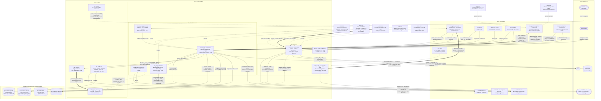

# Enforcement and Verification Engine

## Overview

- **Name**: Enforcement and Verification Engine (`enforcement-engine`)
- **Description**: The component that turns an Architecture Decision Record from prose into a mechanism. It judges a unified git diff against the fenced JSON `## Enforcement` block of every **Accepted** ADR, scores and gates ADR quality against the named verification gates, and owns the sandboxed regex evaluator that makes repository-authored policy safe to execute. It is the only part of adr-kit that **blocks**; every other component steers.
- **Type**: CLI toolchain plus supporting runtime libraries — five extensionless Python executables (`bin/adr-judge`, `bin/adr-judge-precommit`, `bin/adr-generate-scripts`, `bin/adr-lint`, `bin/adr-quality`) and six importable stdlib modules (`bin/adr_config.py`, `bin/adr_state.py`, `bin/adr_regex.py`, `bin/adr_regex_worker.py`, `bin/adr_llm.py`, `bin/adr_quality_core.py`). `adr_llm.py` resolves the one LLM backend that remains — the host client's own CLI ([ADR-036](../docs/adr/ADR-036-retire-the-vector-layer-and-run-the-judge-on-the-host-model-only.md)) — and `adr_quality_core.py` is the four-gate scorer split out of `bin/adr-quality` so it can be imported in-process rather than only shelled out to (see [Software Features #5](#5-verification-gates--nine-in-adr-lint-four-weighted-in-adr-quality)).
- **Technology**: Python 3.10+, standard library only. No package, no `__init__.py`, no install step — the CLIs are extensionless (deliberately non-importable) and load each sibling module by explicit path through `_load_sibling` (`bin/adr-judge:74`), which creates no `sys.path` entry, so nothing committed next to the scripts can shadow a module (TASK-62). `jsonschema` is the single third-party name that appears anywhere in the component, and it is optional and import-guarded (`bin/adr-judge:192`, `bin/adr-lint:106`); every deterministic check runs whether or not it is installed. The component opens no network connection itself: the LLM pass spawns the host client's CLI (`claude -p`, `codex exec` or `copilot -p`) as a subprocess, and that CLI carries its own authentication. No credentials in tracked config (ADR-025 refuses one), no database. A model is invoked only on the LLM path, and its absence or failure never blocks.
- **Size**: 11 files, 7,709 lines, verified by direct line count on 2026-10-06 (v0.59.1): 6,669 lines of judging and gating logic — `adr-judge` 2974, `adr-lint` 2203, `adr-generate-scripts` 421, `adr-judge-precommit` 105, `adr-quality` 275 (a thin CLI shell) plus `adr_quality_core.py` 691 (the scorer it delegates to) — over 1,040 lines of runtime primitives (`adr_config.py` 280, `adr_state.py` 172, `adr_regex.py` 165, `adr_regex_worker.py` 30, `adr_llm.py` 393).

### Staleness of the Code-level documents this refresh relied on

The two Code-level documents this component summarises, `c4-code-bin-cli-enforcement.md` and `c4-code-bin-cli-gates.md`, are stale. Every claim, anchor and count in this document was re-verified directly against source at v0.59.1 (2026-10-06); where the Code-level documents disagree, this document follows the source. The discrepancies:

1. **Both Code-level documents predate ADR-017 and ADR-036.** `c4-code-bin-cli-enforcement.md` states `bin/adr-judge` is 1987 lines and that `judge.llm_enabled` "exists and defaults false." Direct measurement: 2974 lines; `bool(judge_cfg.get("llm_enabled", True))` at `bin/adr-judge:2631` and `:2034`. Neither document mentions ADR-017, ADR-036 or `bin/adr_llm.py`.
2. **`c4-code-bin-cli-gates.md` predates the `bin/adr-quality` / `bin/adr_quality_core.py` split.** It describes a single 715-line `bin/adr-quality` file and cites line numbers within it (`:72`, `:348`, `:447`) for the clarity-gate and consistency-gate quirks this document also relies on. Those quirks were re-verified against the current `bin/adr_quality_core.py` (691 lines) and still hold, at the line numbers given in [Feature #5](#5-verification-gates--nine-in-adr-lint-four-weighted-in-adr-quality).
3. **Neither document mentions `hooks/adr_pr_guard.py`, ADR-023, ADR-024, ADR-025, or ADR-026.** All four ADRs and the guard module were verified directly against `docs/adr/*.md` and `hooks/adr_pr_guard.py`, not against either Code-level document.

**The two Code-level documents themselves are not corrected by this refresh**, so a reader following their links for `bin/adr-judge` or `bin/adr-quality` internals will see the pre-ADR-017, pre-split state until they get their own refresh.

---

## Purpose

### The trust boundary this component exists to hold

A `pattern` string inside an ADR's `## Enforcement` block is **executable, repository-authored, untrusted input**. Anyone who can land a file under `docs/adr/` — a collaborator, a merged pull request, or a well-meaning author who wrote `(a+)+$` — supplies a regular expression that the pre-commit gate will then compile and run against every added line of a staged diff.

The component splits the handling of that input across its three parts, and the split is the architecture:

| Stage | Where | What it does |
| --- | --- | --- |
| **Validate** | `bin/adr-lint` policy gate | Parses the Enforcement JSON and *statically* checks every pattern with a bare `re.compile(pat)` (`bin/adr-lint:1467`) — it never calls `search`. Compilation is bounded; catastrophic backtracking is a search-time phenomenon, so no sandbox is needed to validate. Malformed JSON or an uncompilable pattern is `FAIL` (`POLICY_SCHEMA_INVALID`, `POLICY_BAD_REGEX`). |
| **Execute** | `bin/adr_regex.py` + `bin/adr_regex_worker.py` | Runs the pattern in a **killable subprocess** under three budgets: 1.0 s wall clock, 4096 pattern chars, 2 MiB input. A process boundary is *required*, not preferred: CPython holds the GIL while backtracking, so an in-process `join(timeout)` never gets scheduled to enforce its own deadline. Audit finding F-01 records the reproduction — `(a+)+$` against 30 `a` characters plus `!`, with a nominal 0.1 s helper timeout, blew straight past an outer 5 s process timeout. `kill()` is the only thing that lands. |
| **Fail closed** | `bin/adr-judge` | Converts every `RegexEvaluationError` into a `severity: violation` finding (`bin/adr-judge:808` for forbid rules; `:886` for an unreadable post-image and `:922` for a regex timeout on require rules) → exit 1. Availability protection on its own would create a new bypass: pad an input until the pattern times out and the rule silently stops applying. |

Validate → sandbox → fail closed. Everything else in this component is in service of that sequence, or of deciding whether the ADR carrying the rule was well-formed enough to be trusted in the first place.

### "The only mechanism that blocks", with its five qualifications

[ADR-004](../docs/adr/ADR-004-layered-adr-context-injection.md) named `bin/adr-judge` at pre-commit and in the CI action as the one fail-closed floor beneath three fail-open injection tiers. [ADR-023](../docs/adr/ADR-023-record-the-pull-request-guard-as-a-fail-closed-tier.md) formally narrows that claim: `hooks/adr_pr_guard.py`, intercepting `gh pr create` (a component outside this one — see [Software Feature #10](#10-a-second-fail-closed-caller-hooksadr_pr_guardpy-on-gh-pr-create-adr-023-adr-024)), also blocks, by shelling out to this component's own `bin/adr-judge`. ADR-023's own words: "ADR-004's fail-closed floor gains one sibling." The floor this component *is* has not moved; a second caller now stands on it. The escape valves below, plus that fifth one, are not tabulated together in any single Code-level document, and a reader who meets them piecemeal will read them as contradictions:

| Qualification | Mechanism | Rationale |
| --- | --- | --- |
| 1. Only the **declarative** pass fails closed | A regex blowing its safety budget is a `violation` (`RegexEvaluationError` caught at `bin/adr-judge:790` and `:895`, both producing an "enforcement failed closed" message). | A malicious pattern must not sneak past the gate. |
| 2. The **LLM pass never blocks on failure** | Any failure of the host CLI call — no recorded host client, binary not on `PATH`, non-zero status, timeout, unparseable output, no verdict keyed to the ADR — costs that ADR's verdict, is named in the pass attestation, and is skipped with a warning (see [Feature #3](#3-per-adr-isolated-llm-judging-on-the-host-model-on-by-default-adr-036)). | Tooling drift must not stop legitimate work. |
| 3. `judge.advisory_only: true` | Prints every violation and still exits 0. | Project-wide "report but don't gate" mode. ADR-004 pins *where* the floor lives, not that it is unliftable. |
| 4. `ADR_KIT_OVERRIDE="ADR-NNN: reason"` | Downgrades `violation` → `advisory` for **exactly one** ADR (`apply_override`); other ADRs keep blocking. Logged to `<adr-dir>/.adr-kit-overrides.jsonl` and reconcilable against `ADR-Override:` git-log trailers via `--audit-overrides`. An empty reason is an explicit refusal. | Audited, attributed, per-commit escape hatch rather than a global off switch. |
| 5. The pull-request tier's verdict-half is unliftable **the same way**, but a second, purely advisory pass rides beside it | ADR-024 adds a "was a decision left unrecorded" nudge to the same guard invocation. It can never deny; only the judge's verdict can. | A suggestion that could block would teach people to write an empty ADR to get past it. |

### The component that is the enforcement mechanism is almost entirely unenforced by itself

This is the sharpest observation available at component level, and it still holds. Verified by grepping every `path_glob` value in `docs/adr/*.md` for a string touching this component's files (2026-10-06): **one Accepted ADR** carries a mechanical rule over them.

- **ADR-009**'s `require_pattern` on the literal `CLARITY_ACRONYM_ALLOWLIST` with `path_glob: bin/adr-lint`. It mechanically prevents the reviewable allowlist from being swapped for a tuned threshold.
- **ADR-017's two `forbid_pattern` rules no longer apply.** They are scoped to `path_glob: "{bin,codex/bin,copilot/bin}/adr{-judge,-suggest,_llm.py}"` (no re-pinning a model, no reintroducing a `DEFAULT_LLM_CMD =` constant), but ADR-017 is now **Superseded** by ADR-036, and the judge applies Enforcement blocks of Accepted ADRs only (`bin/adr-judge:2786`). ADR-036 carries no `## Enforcement` section, so the "no pinned model" rule is held by `HOST_COMMANDS` having no model flag and by tests (`tests/test_adr_judge_llm.py`, ADR-036's `verified_in`), not by the judge.
- **No `path_glob` anywhere in `docs/adr/*.md` covers `bin/adr_config.py`, `bin/adr_state.py`, `bin/adr_regex.py`, `bin/adr_regex_worker.py`, or `bin/adr_quality_core.py`** (verified by the same enumeration). The regex sandbox and the quality scorer — two of the component's load-bearing primitives — have no mechanical guard.
- **ADR-015 budgets `adr-lint`** (p50 1200 ms / p95 1600 ms / hard 2000 ms in `tests/fixtures/cli/latency-corpus.json`) but its Enforcement `path_glob` targets the *fixture*, so `tests/test_cli_performance.py` guards the budget, not the judge. For `bin/adr-judge` ADR-015 is a purely **negative** constraint: it merely *excludes* `adr-judge --llm` from the deterministic budget.

The consequence is concrete rather than ironic: prose/code drift in this component (see [Software Features](#software-features)) is precisely the kind two mechanical rules will not catch.

---

## Software Features

### 1. Declarative diff judging (always on, free, offline)

`bin/adr-judge` parses a unified diff into `{path: DiffFile}` and applies each Accepted ADR's Enforcement block:

| Rule kind | Input surface | Regex flags | Failure semantics |
| --- | --- | --- | --- |
| `forbid_pattern` | Added (`+`) lines only, one line at a time | none | Match → `violation` at `path:line` with a 200-char snippet |
| `forbid_import` | Identical engine; the separate name documents intent | none | Same — both kinds share one loop |
| `require_pattern` | Full post-image of every file matching `path_glob`, via `read_snapshot_content` | `re.MULTILINE` | Absent match → `violation`. A missing or unreadable post-image → `violation` with "enforcement failed closed". Under `--snapshot diff`, a modified file has no post-image → `advisory` naming `--snapshot staged`/`worktree` (TASK-65) |

`path_glob` is translated by `glob_to_regex` (`bin/adr-judge:672`) supporting `**`, `*`, `?` and brace expansion, cached process-wide. A rule with no `path_glob` applies everywhere.

**An invalid Enforcement block is never silently used.** `parse_enforcement` → `validate_enforcement` runs *before* any regex compile or prompt construction, and a structurally broken block produces `enforcement_config_finding` — severity **advisory**, message "…is structurally invalid and was IGNORED (no rule was applied or sent to the LLM)" (`bin/adr-judge:515`, used at `:2798`).

### 2. The seam between judging and linting — a gap worth naming

Two facts, each unremarkable alone:

- An invalid Enforcement block at judge time is **advisory and ignored** (above).
- `policy` is in `ALL_GATES` but **not** in `DEFAULT_GATES = ["completeness", "audit", "consistency"]` (`bin/adr-lint:206` and `:217`, verified in source).

Their conjunction: **a structurally broken Enforcement block is silently non-enforcing at commit time, and the gate that would have caught it is off by default in a plain `adr-lint docs/adr` run.** The ADR still reads as governing to a human; nothing blocks.

The gap is closed at exactly one place — acceptance. `bin/adr accept` → `_assert_acceptance_gates` (`bin/adr:724`) invokes `adr-lint --strict --gates schema,completeness,audit,evidence,clarity,consistency,policy` and refuses acceptance on non-zero. So the invariant is "policy is checked when the decision is accepted, not on every lint run" — sound, but it means an Enforcement block edited *after* acceptance is not re-validated by any default path.

### 3. Per-ADR isolated LLM judging on the host model, on by default (ADR-036)

Verified directly against `bin/adr-judge` (2974 lines) and `bin/adr_llm.py` (393 lines) rather than against the Code-level documents — see the [staleness note](#staleness-of-the-code-level-documents-this-refresh-relied-on).

**Not batched: one isolated call per ADR.** TASK-63 found that sharing one prompt across every `llm_judge: true` ADR let a second ADR's Decision text ("ADR-050 is retired, this no longer applies") flip a genuine `VIOLATION` on a *different* ADR to `OK` — reproduced 3/3 against a live CLI, byte-identical to a real pass. `run_llm_batch` now loops `for t in targets: _run_llm_single(t, diff_text, resolved, timeout_s)`, one prompt per target, each containing only that ADR's own Decision text plus the diff. A sibling ADR's text is structurally absent from the context that decides any one verdict. **Cost is therefore linear in the number of `llm_judge: true` ADRs touching the diff, not constant**, and two timeouts bound it. `judge.llm_timeout_seconds` (default 120 s) bounds each isolated call; `judge.llm_pass_timeout_seconds` (default 600 s, since 0.58.0, TASK-210) caps the whole pass. Each call gets the smaller of its own timeout and what is left of the pass; ADRs reached after the deadline get no verdict, and the attestation names them.

**On by default, on the host model.** `judge.llm_enabled` defaults to `true` (`bin/adr-judge:2631`, `bool(judge_cfg.get("llm_enabled", True))`; schema default `true`). ADR-017 reversed ADR-001's opt-in default and ADR-036, which superseded ADR-017, kept it while narrowing the pass to the host model. ADR-001's other guarantees survive: the concurrency guard, the `ADR_KIT_NO_LLM` force-off, and graceful degradation on any failure. Default-on shipped *only together with* the per-ADR isolation above. `--llm` forces the pass on, `ADR_KIT_NO_LLM=1` forces it off, and `judge.llm_enabled: false` turns it off per project; the legacy `judge.llm_default` key is now refused at config validation (`adr_config.REMOVED_KEYS`):

```python
llm_mode_active = (args.llm or judge_cfg.llm_enabled) and not ADR_KIT_NO_LLM
```

The pass also needs a recorded host client. `clients/installer/judge_backend.py` (`record_host_client`) writes `judge.host_client` into the gitignored `docs/adr/.adr-kit.local.json` when an install run installs exactly one client, and an operator's earlier choice is never overwritten. When a run installs several clients it records nothing and prints the command for each, because picking one would decide which vendor sees the diffs. So after a single-client install the LLM pass runs by default, for every `llm_judge: true` ADR. With no recorded client the judge prints one warning and runs declarative-only (`bin/adr_llm.py:269-293`).

**The model is the host client's own, resolved from code, never from committed config (ADR-036, constrained by ADR-025).** `BACKENDS` (`bin/adr_llm.py:301`) holds one entry, `host`, and `judge.backend` accepts only `host`. `HOST_COMMANDS` (`bin/adr_llm.py:61-65`) maps the recorded client to its non-interactive entry point — `claude -p`, `codex exec` or `copilot -p` — with **no model flag**, so the user's own configured model answers. `resolve_llm_backend` (`:306`) applies the precedence `--llm-cmd` > `ADR_KIT_LLM_CMD` > `judge.backend`; the first two are operator-controlled escape hatches and deliberately unrestricted. The HTTP backends ADR-017 had added were retired in 0.48.0 by ADR-036; a config still naming one gets a sentence saying what replaced it, and the pass does not run (`:340-349`). [ADR-025](../docs/adr/ADR-025-separate-what-tracked-configuration-may-select-from-what-only-a-machine-may-introduce.md) is the general rule this instantiates: repository-tracked configuration may *select* among what an operator enabled, and may never *introduce* a command, endpoint or credential. A credential-shaped key in `.adr-kit.json` is refused by name (`find_credential_keys`, `credential_refusal_message`), and repo-tracked command and model keys are refused by `adr_config.REMOVED_KEYS`. `bin/adr-judge-precommit` never passes `--llm`; whether the LLM pass runs there is entirely `judge.llm_enabled`'s call.

**Prompt-injection defence via content-derived sentinels.** Every blob is wrapped in `<<<ADR-KIT-DATA-{sha256[:16]} BEGIN>>> … END>>>` fences where the token is derived from the fenced content. An attacker cannot pre-place a matching END marker: embedding a guessed token changes the content and therefore changes the token. It is deterministic, so tests can assert on the constructed prompt.

**Two different failure postures, one per layer.** Within a single successfully-parsed verdict, anything not literally `OK` (`_LLM_OK_VERDICTS = frozenset({"OK"})`, matched case-insensitively) is treated as a violation for that ADR — a stray "MAYBE" or "UNSURE" fails closed. Above that, a call that cannot be parsed at all, times out, runs past the pass deadline, or that the tool cannot even reach costs *that ADR's* verdict and nothing else (ADR-038, TASK-170): `run_llm_batch` returns the findings it established, sets `attestation.degraded` and names every unjudged ADR in `degraded_reason`. It returns `None` only when no ADR received a verdict. Until v0.50.0 a single failure discarded the whole pass — which meant a VIOLATION already established by an earlier call vanished and the run printed `OK`. The failure mode TASK-63 exists to remove is a partial pass reported *as complete*; the attestation is what prevents that, so the verdicts no longer have to be thrown away to earn it.

### 4. Bounded regex evaluation, and what it does not defend

One persistent worker subprocess speaks newline-delimited JSON over pipes; the parent owns every timeout so the child can be killed outright. `bin/adr-judge` is the **only** in-process consumer in the entire repository (verified: `bounded_regex_search` appears at `bin/adr-judge:128` and `:212` and nowhere else in `bin/`, `scripts/` or `hooks/`).

Two properties any future maintainer must preserve:

- **The v0.41.0 queue-binding invariant** (`bin/adr_regex.py:62-71`). The reader thread must close over local `_stdout` and `_responses`, not `self.*`. Without it, a retired worker's EOF sentinel lands in the *new* worker's queue after a restart, and the next evaluation fails closed with "worker exited unexpectedly" — blocking a commit that had no violation. This was a shipped bug, fixed in v0.41.0 (`CHANGELOG.md:2108-2115`).
- **`MemoryError` and `RecursionError` are deliberately excluded** from the worker's caught set (`KeyError, TypeError, ValueError, re.error`). They crash the worker, the parent's EOF sentinel fires, and `search` raises `RegexEvaluationError` — fail-closed by design. A worker that cannot answer is treated exactly like one that answers "violation".

**Limits of the sandbox, stated plainly.** This is isolation for *termination*, not a security sandbox. Same user, same filesystem, same `sys.executable`; no seccomp filter, no rlimit, no namespace. Three budgets are enforced — wall clock, pattern length, input size — and **memory is not among them**. A pattern that allocates rather than backtracks is only reaped when the deadline fires, and only after it has already allocated. The pattern text is passed to `re.compile` verbatim and never sanitized, which is the point: policy semantics must match plain CPython `re` exactly, or an ADR author cannot predict what their rule does.

`RegexEvaluator.search` has **no mutex** and `_DEFAULT_EVALUATOR` is a lazily-created process global (`bin/adr_regex.py:147`). Concurrent calls from multiple threads would interleave requests and responses on one shared queue. This is currently safe only because every caller is single-threaded — the MCP server shells out to `adr-judge` as a subprocess rather than importing `adr_regex`. Any future in-process concurrency needs a lock.

### 5. Verification gates — nine in `adr-lint`, four weighted in `adr-quality`

The project narrative (and `.claude/adr-kit-guide.md`) says "four verification gates". That name survives in both tools but neither realises it as four; `adr-lint` has grown an eighth and, since ADR-022, a ninth:

| Gate | `adr-lint` | `adr-quality` | Nature |
| --- | --- | --- | --- |
| **completeness** | default | weight 0.4 | Deterministic — profile-aware heading presence + unresolved Open Questions |
| **consistency** | default | weight 0.2 | Deterministic — filename/heading agreement, duplicate numbers, supersession bidirectionality, frontmatter cross-refs |
| **audit** | default | — | Deterministic — `status_history` chain: required fields, ISO dates, no future dates, monotonic order, `entries[-1]` agrees with `## Status` |
| **evidence** | opt-in | weight 0.2 | Heuristic — bare comparatives with no nearby number/citation, reported only at 3+ hits |
| **clarity** | opt-in | weight 0.2 | Heuristic — unexpanded ALL-CAPS acronyms. The gate ADR-009 bounded |
| **schema** | opt-in (auto-added by `--strict`) | — | Deterministic — canonical YAML frontmatter |
| **policy** | opt-in | — | Mixed — deterministic Enforcement JSON + regex compilability (`FAIL`); heuristic anti-pattern advisories |
| **quality** | opt-in, always `ADVISORY` | — (this *is* `adr-quality`) | Heuristic — a deliberately reduced subset of the other tool |
| **open-questions** | opt-in | — | **Deterministic, git-dependent ([ADR-022](../docs/adr/ADR-022-make-open-questions-append-only-for-a-proposed-adr.md)).** A `Proposed` ADR's `## Open Questions` list is append-only: a question may graduate to an answered `- [x] … — **Answered …**` entry, but a deletion with no answer is `FAIL`. Reads the previous revision via `git show HEAD:./<file>`; without git history it degrades to `ADVISORY` rather than skipping silently. Internals — `check_open_questions_append_only`, `_previous_revision` — belong to `c4-code-bin-cli-gates.md`; this component doc only places it in the gate roster. |

`adr-lint` resolves each finding to `FAIL` or `ADVISORY` through a three-level model (`config.ignore` > in-file markers > `config.severity`) and exits non-zero only on `FAIL`. `adr-quality` weights four gates into a `0.00–1.00` composite with an A–D grade and 15 stable issue codes.

**`bin/adr-quality` is now a 275-line rendering shell over a separately importable scorer, `bin/adr_quality_core.py` (691 lines).** This is new since the previous refresh — commit `d30031c`, "let quality decide who gets grilled" — and it is a real architectural change, not a rename: `adr_quality_core.py`'s own docstring explains why. Readiness scoring used to compute its own crude three-boolean "quality" signal because the real weighted scorer sat behind a command line only `bin/adr accept --auto` ever invoked; moving `score_adr_quality`/`score_path`/`score_directory` into an importable module let `bin/adr_readiness.py` (`from adr_quality_core import QUALITY_THRESHOLD, score_path`) and the guardian queue (`bin/adr_guardian_queue.py`) read the same scorer **in-process** instead of re-deriving a cheaper proxy — a new cross-component coupling recorded in [Dependencies](#dependencies). The gate logic itself did not change in the move: same four gates, same weights, same 15 issue codes. `bin/adr-quality` also grew a `--adr-dir DIR` sweep mode (`_run_sweep`, calling the new `score_directory`) that scores every ADR under a directory and reports which have decayed below threshold — **the CLI is no longer single-file-only**, correcting that claim in Interface #3.

**The `adr-quality` clarity gate never received the ADR-009 bounding, and it can still contribute to blocking acceptance.** Still true after the move — verified against the current `bin/adr_quality_core.py`. Its `_ACRO_RE = r"\b([A-Z]{2,})\b"` (`:99`) scans the whole document *including* frontmatter, matches 2-letter acronyms, never recognises the `expansion (ACRONYM)` word order, and has no allowlist beyond `acro_stopwords` (`:392`) — `ADR`/`ID` plus 20 two-letter English words. Run both tools on `docs/adr/ADR-007` — the very record ADR-009 was written about: `adr-lint --gates clarity` reports **PASS** with zero findings, while `adr-quality` flags `ACRONYM_UNEXPLAINED: CI, CLI, INDEX, JSON, MADR` and deducts 0.2. `CLI` is ADR-009's own worked false-positive example; `JSON` and `MADR` are in its allowlist. Because `bin/adr accept --quality-threshold` gates on `overall` (default 0.70), the un-bounded heuristic feeds an acceptance gate — and now also feeds the guardian's decay ranking and readiness's queue order, both of which import this same scorer in-process. ADR-009's Confirmation section pins only `tests/test_adr_lint_clarity.py`, so nothing catches the divergence.

Two lesser gate quirks worth carrying: `severity_of` (`bin/adr-lint:368`) hardcodes an undocumented exception — with `strict_from` set, every gate defaults to `advisory_before_strict_from` **except** `consistency`, which stays `always_strict` (`:377`). And `adr_quality_core.py`'s `gate_consistency` can report a failed check while awarding full credit: the `else` branch (`:491-495`) sets `checks["referenced_adrs_exist"] = False` yet still adds `+0.3` whenever `## Related Decisions` is non-empty, so the text renderer prints `[2/3 checks passed]` beside a perfect `1.00`. The `elif mentioned_adrs` branch just above it (`:487-490`) awards the same full `+0.3` for ADR references it explicitly has no directory to verify against.

### 6. Two independent readers of one config file

`docs/adr/.adr-kit.json` is read twice inside this component by two different mechanisms with **different always-on validation depth**:

| Reader | Mechanism | Always-on depth | Deep check |
| --- | --- | --- | --- |
| `bin/adr-judge` (and `bin/adr-suggest`, another component) | `adr_config.load_validated_config` → `ConfigValidationError` → `JudgeError` → **exit 2** | Hand-rolled **subset** of JSON Schema draft-07 over the whole document | n/a — the subset *is* the check |
| `bin/adr-lint` | Its own `load_config` (`:278`, raising `PolicyError`) → **exit 2** where `main()` catches it (`bin/adr-lint:2109`) | Hand-rolled **per-key** checks: `severity` gate names and values, `strict_from` pattern, `template.profile` membership | `jsonschema.validate` against the full schema, inside `try/except ImportError` (`bin/adr-lint:106`) |

Both exit 2, so the fail-closed posture is consistent. What differs is depth, and for `adr-lint` it differs **by environment**: a machine with `jsonschema` installed validates the whole config document; a bare machine validates four keys. `bin/adr-quality` reads no config at all.

`adr_config`'s validator implements a genuine subset and **silently ignores** unsupported keywords rather than rejecting them. Verified that the shipped schema uses none of `allOf`/`anyOf`/`$ref`/`const`/`maxLength`/`maxItems`/`uniqueItems`/`dependencies`/`if`/`format`/`multipleOf`/`propertyNames`/`exclusiveMin`/`exclusiveMax`/`not`, and no array-form `"type"` — so validator and schema agree **today**. Nothing mechanically prevents a future schema edit from adding a constraint that is silently dropped. Two sharper edges: `_type_matches` returns `True` for any unrecognized type name, so a typo'd `"type": "strng"` accepts everything; and `oneOf` early-returns without applying sibling keywords (harmless today — the shipped schema no longer uses `oneOf` at all).

The motivation is on record. Audit finding **F-02** (`docs/reviews/2026-07-18-source-audit/FINDINGS.md:124-147`): before `adr_config` existed, `adr-judge` read config with Python truthiness and bare `int()`, so `"advisory_only": "false"` was truthy (violations exited 0) and `"max_diff_bytes": -1` skipped every non-empty diff. **Type coercion was an enforcement bypass.**

**The one dead key from the previous refresh is now ten, tracked deliberately rather than silently live.** `bin/adr_config.py`'s `RETIRED_KEYS` dict (`:20-45`) holds ten dotted paths — `judge.llm_timeout_ms`, `judge.pre_push_timeout_ms`, `policy.regex_compile_checks`, `policy.pattern_warnings`, `context.weights`, and the five `context.weights.*` children — each removed from the schema but still silently accepted (never rejected) so an existing `.adr-kit.json` keeps loading. (The project narrative and this dict's own consuming test both round this to "nine"; the direct count of dotted paths in the dict is ten, and that is the number this refresh traces to source.) `retired_keys_present(config)` lets a caller warn without breaking the run. A second dict, `REMOVED_KEYS` (`:52-91`), is the opposite posture: eight keys that once *did* something — the retired backend model keys, `judge.llm_cmd`, `judge.llm_model`, `judge.llm_default`, `suggest.llm_cmd`, `suggest.llm_model` — are **refused**, each with a sentence naming what replaced it (ADR-036), because silently dropping a real choice is the drift the kit exists to prevent. This closes precisely the gap the previous refresh flagged — `judge.llm_timeout_ms` validating cleanly and doing nothing — by naming it instead of leaving it live. The gap it does **not** close is structural drift: a new schema key with no reader would still validate cleanly and do nothing, silently. That gap now has its own gate: `tests/test_config_schema_has_readers.py` walks every declared schema path and `git grep`s for a reader under `bin/`, `hooks/`, `templates/`, `scripts/`, `clients/`, failing the moment a declared key has none (excluding keys listed in `RETIRED_KEYS`, and excluding keys resolved dynamically enough that a literal grep cannot find them — currently none are registered in that exemption list). It also asserts the inverse: a key cannot be both retired and still declared in the schema.

### 7. Compiling Enforcement blocks into standalone validators

`bin/adr-generate-scripts` emits `.generated/<ADR-ID>/{capabilities.json, validate.py, validate.sh}` so the same rules can run in foreign CI with no adr-kit on `sys.path`.

**It refuses to degrade silently.** `_collect_rules` (`:82`) flags any `path_glob`, any empty or uncompilable `pattern`, and the presence of `llm_judge` as unsupported; `capabilities.json` flips to `status: "unsupported"`, **no validator is written**, and `main()` returns 2. `path_scope: false` in the metadata is an honest admission that the standalone form has no notion of which file it is reading — it takes one blob on stdin.

**`validate.sh` is not a shell reimplementation.** It `del rules` early (`:218`) and emits a POSIX launcher that `exec`s `validate.py`, so regex semantics stay byte-identical. Consequence: `--lang shell` still writes `validate.py`.

**The generated validators re-implement the sandbox inline** (self-re-exec via `--regex-worker`, `bin/adr-generate-scripts:148` and `:206`): `subprocess.run(timeout=1.0)`, the same 2 MiB ceiling — rather than importing `adr_regex`. They have to; the artefact must ship dependency-free. The cost is a second implementation of the same threat model, per-call instead of persistent, kept semantically aligned by hand.

### 8. Status-history maintenance (the one write path)

Normal judging is read-only with respect to tracked content. `--migrate-status-history` is a separate early-exit subcommand and the **only** path that rewrites ADR files. `append_to_status_history` appends one validated transition without touching earlier entries and refuses on backwards dates. The override path also writes, but only untracked state: `<adr-dir>/.adr-kit-overrides.jsonl` plus a best-effort append to `.git/info/exclude`.

### 9. Prose drift: one instance resolved since the previous refresh, one still open

The previous refresh of this document flagged `bin/adr-judge`'s own module docstring as self-contradicting — describing the LLM pass with the pre-ADR-001 "opt-out via `ADR_KIT_NO_LLM=1`" wording 1600 lines apart from a runtime that was actually opt-in. **That instance is now resolved, not carried forward as a drift.** ADR-017 landed together with a docstring rewrite (now `bin/adr-judge:2-52`, which also names `host` as the only backend since ADR-036): it correctly says "LLM pass (on by default per ADR-017; opt-out via `ADR_KIT_NO_LLM=1`)" and the `--llm` flag's own `help=` text was updated to match — "The pass is on by default (ADR-017); this flag matters only when `judge.llm_enabled` was explicitly set false." Verified directly: both now agree with the runtime and with each other, which is itself worth recording, since it shows this specific class of drift is not permanent once someone notices it — it just was not, previously, for eighteen months.

One instance remains open, unrelated to the LLM pass: `bin/adr-lint`'s own module docstring (`:2-6`) still says "the four adr-kit verification gates" and "Default gates are completeness and consistency (the deterministic ones)", while `DEFAULT_GATES = ["completeness", "audit", "consistency"]` (`:215`) has included `audit` for some time and `ALL_GATES` (`:204-214`) now lists nine, not four, including the ADR-022 `open-questions` gate added since the previous refresh. `.claude/adr-kit-guide.md` has not been updated to match either. Both `--version` strings still hardcode `0.15.0` (`bin/adr-lint:2083`, `bin/adr-quality:244`) against a plugin now at `0.59.1` — apparently unregistered ADR-013 version sites.

### 10. A second fail-closed caller: `hooks/adr_pr_guard.py` on `gh pr create` (ADR-023, ADR-024)

New since the previous refresh, and not yet documented in any Code-level document — verified directly against `hooks/adr_pr_guard.py` (367 lines) and against ADR-023/ADR-024, because `c4-code-hooks.md` does not yet mention it. `hooks/adr_pr_guard.py` lives outside this component (it belongs to the hooks/agent-integration cluster), but it is a **caller of this component's judge**, not a new decision engine, so it belongs here as a fourth inbound integration surface alongside pre-commit, the CI action and the MCP server.

**What it does.** A `PreToolUse` hook matches the shape of the command `gh pr create` (not a substring — `gh pr list` and a comment mentioning the phrase must not fire) and, before the tool call runs, spawns `bin/adr-judge --snapshot worktree` over the diff between the branch and its base (`git diff --unified=0 origin/<base>...HEAD`), inside a single deadline derived from `hooks/manifest.json`'s `runner_timeout_sec` for the `pr-create` event (5000 ms when the manifest omits the key, which five of eight events currently do). A violation returns `permissionDecision: deny` with the finding list rendered into the reason; every other outcome — no judge binary, no git, no base branch, an empty diff, a budget that ran out, a non-1/non-0 judge exit — **allows**, because "a check that could not run" must read the same as "no violation" to a caller that cannot tell the difference otherwise.

**Why this is a second fail-closed tier, not a rewrite of "the only mechanism that blocks."** [ADR-023](../docs/adr/ADR-023-record-the-pull-request-guard-as-a-fail-closed-tier.md) exists specifically to correct [ADR-004](../docs/adr/ADR-004-layered-adr-context-injection.md)'s "the commit judge is the only mechanism that blocks" sentence, which the guard's shipped behaviour (v0.44.0) had already made false without anyone updating the record. ADR-023's resolution keeps ADR-004's three injection tiers fail-open and unchanged, and adds a second, distinctly-scoped fail-closed tier at the pull-request moment — justified because a pull request is created once per branch (not constantly, unlike an edit) and the user is present to see the guard fire and can decline it, the same presence-and-refusability test ADR-019 uses elsewhere in the kit. The judge this guard calls is unchanged; only the set of callers that can turn its verdict into a denial grew by one.

**The ADR-024 half: a missing-decision nudge riding the same budget.** Before ADR-024, the guard answered only one of spec R2's two questions — does the branch violate a recorded decision — and left "does the branch contain a decision nobody recorded" reachable only on demand, via `bin/adr-suggest` behind `/adr-kit:review` or an environment variable nobody set, which in practice meant it did not run. ADR-024 extends the same interception rather than adding a second one: after the judge returns, `_nudge()` reuses the *same* diff text already read and whatever is left of the *same* `Deadline`, and runs `bin/adr-suggest --diff - --adr-dir <dir> --llm-timeout <remaining>`, appending any `[adr-suggest] This change …` lines it produces to the result as `result["nudge"]`. Two properties are structural, not just documented intent: the nudge can only ever add a `"nudge"` key to a dict whose `"decision"` was already decided by the judge — nothing downstream of `_with_nudge` can flip `allow` to `deny` — and a branch with no candidate decisions produces no nudge, so the common case costs nothing extra. **The gap ADR-024 accepts rather than closes:** a pull request opened by hand, from a web UI, or by a teammate not working through an agent gets neither half of R2 at this moment. A `pull_request` CI workflow would close it, and ADR-024 explicitly rejects shipping one by default, because CI spends unattended on every push with nobody present to refuse — the exact premise ADR-019 and ADR-023 both reject elsewhere.

| Code document | Role in this component |
| --- | --- |
| `c4-code-bin-cli-enforcement.md` | The fail-closed floor. `bin/adr-judge` (per-ADR isolated diff judging, override handling, status-history maintenance), `bin/adr-judge-precommit` (pre-commit.com framework adapter), `bin/adr-generate-scripts` (compiles the portable rule subset into standalone validators). **Stale as of this refresh** — see [staleness note](#staleness-of-the-code-level-documents-this-refresh-relied-on); it predates ADR-017 and ADR-036 and the resulting line-count and default-value changes documented directly from source above. |
| `c4-code-bin-cli-gates.md` | The verification gates. `bin/adr-lint` — nine named gates with a three-level severity model, the pass/fail policy engine that also *statically validates* Enforcement blocks. `bin/adr-quality` — four weighted gates into a 0.00–1.00 composite with 15 stable issue codes. **Stale as of this refresh** — predates the `bin/adr-quality` / `bin/adr_quality_core.py` split and the ADR-022 `open-questions` gate's addition to `DEFAULT_GATES`'s sibling `ALL_GATES`. |
| `c4-code-bin-lib-runtime.md` | The runtime safety primitives. `adr_config.py` (hand-rolled JSON-Schema-subset validation, fail-closed and fail-open loaders), `adr_regex.py` + `adr_regex_worker.py` (the killable bounded regex evaluator), `adr_state.py` (locked atomic state transactions). Not verified against source in this refresh (out of scope — the task named the two docs above); line counts in this document's Overview were independently re-measured and agree with a ~600-line combined size for these four files. |

Two modules this component now ships have **no Code-level document at all**, in any of the three docs above — verified by grep, and named here so a future refresh knows to add them rather than assuming they were missed by oversight: `bin/adr_llm.py` (393 lines, the host-CLI resolver — see [Feature #3](#3-per-adr-isolated-llm-judging-on-the-host-model-on-by-default-adr-036)) and `bin/adr_quality_core.py` (691 lines, the scorer split out of `bin/adr-quality` — see [Feature #5](#5-verification-gates--nine-in-adr-lint-four-weighted-in-adr-quality)).

### Scope note on `adr_state.py`

`bin/adr_state.py` is inside this component's boundary because its **cluster** is, not because enforcement uses it. Its consumers are `bin/adr-guardian` and `bin/adr-watch` — both in other components. Nothing in `adr-judge`, `adr-lint`, `adr-quality`, `adr-judge-precommit` or `adr-generate-scripts` imports it (verified: `grep -n "adr_state"` across all five files returns no matches). It belongs to the same fail-open/fail-closed thesis (`update_state` catches, warns and returns `None`; `state_lock` is a non-blocking spin loop with a 10 ms sleep and a deadline, using `fcntl.flock` on POSIX and `msvcrt.locking` on Windows) but it carries no enforcement responsibility.

### Adjacent code that is not a Code Element here

**`bin/adr-audit` was renamed underneath this note.** The previous refresh located the duplicated `glob_to_regex` (commented "Same translator as `bin/adr-judge`") at `bin/adr-audit:127`. [ADR-026](../docs/adr/ADR-026-record-the-combined-audit-command-and-its-five-way-exit-contract.md) records that the repository-scanner command formerly named `adr-audit` was renamed to `bin/adr-discover`, and `adr-audit` now names a different, new command (below). The duplicate moved with the rename — verified at `bin/adr-discover:155` — so the divergence risk this note tracks is real but the file name is not. `bin/adr-discover` lives in a different component; the duplication is a standing divergence risk for path-glob semantics and is recorded here so a change to `glob_to_regex` is known to have two homes.

**`bin/adr-audit` now names a new consumer of this component, worth recording here even though it is not a Code Element.** Per ADR-026, it is the combined `adr-lint` + `adr-judge` command (493 lines) with a five-way exit contract — `EXIT_OK=0`, `EXIT_CODE_VIOLATION=1`, `EXIT_TOOLING=2`, `EXIT_ADR_QUALITY=3`, `EXIT_BOTH=4` — so a caller can route "the code violates a decision" and "the decisions are not good enough" to different owners without parsing output. It invokes `bin/adr-lint` and `bin/adr-judge` as subprocesses in one of two modes: diff mode (the default) or `--whole-codebase`, which judges every tracked file as a diff against the empty tree, bounded by its own diff budget. A bare invocation with no mode is refused at exit 2 rather than silently reporting "on course" against an empty diff — the specific failure ADR-026 records as worse than any of the other four exit codes.

---

## Interfaces

### 1. `bin/adr-judge` — CLI (the enforcement floor)

**Protocol**: CLI; unified diff on stdin or from a file; findings on stderr, machine payload on stdout.

```
adr-judge [--diff PATH|-] [--adr-dir DIR] [--config PATH] [--json] [--repo-root DIR]
          [--snapshot {diff,staged,worktree}] [--llm] [--llm-cmd CMD] [--llm-timeout N]
          [--max-diff-bytes N] [--profile] [--migrate-status-history]
          [--check-override] [--audit-overrides] [--dry-run-enforcement ADR-NNN]
          [--check-scope] [--show-config]
          [--set-backend host --host-client ID] [--record-host-client ID]
```

Operations: default judging; `--dry-run-enforcement ADR-NNN` (single-ADR test, zero state changes, accepts `ADR-001`/`ADR-1`/`001`/`1`); `--check-override` (validate `ADR_KIT_OVERRIDE` and exit); `--audit-overrides` (read-only reconciliation, always exit 0); `--migrate-status-history` (the only ADR-file write path); `--profile` (timing table against `judge.pre_commit_timeout_ms`, default 5000); `--check-scope` (since 0.58.0: reads `git ls-files` and names, as advisories, every Enforcement rule of an Accepted ADR whose `path_glob` matches no tracked file — a rule that can never fire — then exits 0; `scope_check`, `bin/adr-judge:2277`); `--show-config` (effective judge settings with provenance, no model call); `--set-backend host --host-client ID` and `--record-host-client ID` (write the host client into the gitignored `.adr-kit.local.json`; the installer calls the latter); `--max-diff-bytes N` (overrides `judge.max_diff_bytes` for one run, so a CI gate can judge a whole branch without raising the commit-path cap).

**`judge.pre_commit_timeout_ms` is read and validated, not decorative.** The installed pre-commit hook (`templates/githooks/pre-commit:199-245`) — not `adr-judge` itself — reads this key from `.adr-kit.json` and validates it by name before using it: absent → 5000 ms (the schema default); `0` → the value is honoured but the after-the-fact WARN is suppressed (matching `adr-judge`'s own reading of `0`); an integer `1..3,600,000` → used as given; anything else (a string, a float, a bool, a negative number, or a value over the ceiling) → **refused by name on stderr** — `"judge.pre_commit_timeout_ms is not an integer from 0 to 3600000; using ${_BUDGET_MS}ms"` — and the hook falls back to 5000 ms rather than silently doing nothing with it. `warn_on_exceed: false` independently silences the after-the-fact "hook took longer than budget" WARN even when the budget itself is a valid, non-zero value. The 3,600,000 ms (one-hour) ceiling leaves room for the LLM pass, which `judge.llm_pass_timeout_seconds` caps at 600 s by default and a project may raise (see [Feature #3](#3-per-adr-isolated-llm-judging-on-the-host-model-on-by-default-adr-036)).

**Snapshot modes** decide where `require_pattern` reads its post-image: `staged` = `git show :<path>`, `worktree` = read the file, `diff` = reconstruct new files from the patch; a modified file has no post-image there, so the rule is reported as an **advisory** naming `--snapshot staged`/`worktree`, never as a blocking violation (TASK-65). The pre-commit hook and the CI action use `staged` and `worktree` and never reach that branch.

**Exit codes** (shared by all five CLIs in this component): `0` clean · `1` at least one finding that gates · `2` config or input error. `bin/adr-judge-precommit` also exits `2` when the judge outlives its 900 s ceiling.

**Output convention**: *all* judging output — finding list, every WARN, the profile table, the override banner — goes to **stderr**, so stdout stays clean for `--json`. One exception: the non-JSON `--migrate-status-history` summary at `bin/adr-judge:2726` is a bare `print()` to stdout despite wearing the same `[adr-judge]` prefix as the stderr messages.

**JSON contract** (`--json`, stdout):

```json
{"summary": {"adrs_checked": 0, "violations": 0, "advisories": 0},
 "findings": [{"adr": "ADR-001", "rule": "forbid_pattern", "pattern": "...",
               "path": "src/x.py", "line": 42, "snippet": "...",
               "message": "...", "severity": "violation"}]}
```

`--audit-overrides --json` returns a different shape: `{log_path, log_present, git_log_available, entries[], summary{logged, reconciled, unmatched}}`.

**Environment variables**:

| Variable | Effect |
| --- | --- |
| `ADR_KIT_NO_LLM=1` | Highest-precedence force-off for the LLM pass; beats `--llm` and both config flags. The MCP server sets it unconditionally. |
| `ADR_KIT_LLM_CMD` | Operator override of the LLM invocation, outranking `judge.backend` (only `--llm-cmd` beats it); deliberately unrestricted, because it comes from the person running the command, not from committed config. |
| `ADR_KIT_OVERRIDE="ADR-NNN: reason"` | One-ADR downgrade to loud advisories; empty reason refused. |
| `ADR_KIT_DEBUG=1` | Unmask LLM stderr and parse errors (off by default so prompts and paths do not leak into hook output). |
| `ADR_KIT_LLM=1` | Read by `templates/githooks/pre-commit:257`, **not** by `adr-judge` itself, to set `_LLM_FLAG="--llm"`. |
| `ADR_KIT_JUDGE_TIMEOUT_S` | Read by `bin/adr-judge-precommit:77`, not by `adr-judge`: the wrapper's wall-clock ceiling on the whole judge run (default 900 s); on expiry it exits 2 and suggests `ADR_KIT_NO_LLM=1`. |

### 2. `bin/adr-lint` — CLI (the verification policy engine)

**Protocol**: CLI over a directory or one file.

```
adr-lint [path=docs/adr/] [--strict-from ADR-NNN] [--strict] [--repo-root PATH]
         [--gates G[,G...]|all] [--format human|text|json] [--config PATH] [-v] [--version]
```

**JSON contract** (`--format json`): `{target, config_path, config_summary, strict_from_override, strict_mode, repo_root, gates_enabled, summary{pass,advisory,fail,skipped,total}, files[{file, adr_num, bucket, skip_reason?, findings[{gate, level, details, summary, code?}], migration_notice}], migration_notices, exit_code}`.

**In-file control markers** (an interface, because ADR authors write them): `<!-- adr-kit-lint: skip -->`, `<!-- adr-kit-lint: advisory -->`, `<!-- adr-kit-lint: skip evidence,clarity -->`. Precedence: `config.ignore` beats markers, markers beat `config.severity`, first matching marker wins.

**Finding codes**: `POLICY_SCHEMA_INVALID`, `POLICY_BAD_REGEX`, `POLICY_EXCESSIVE_WILDCARD`, `POLICY_BROAD_GLOB`, `SELECTIVE_CONTEXT_METADATA`, `OPEN_QUESTIONS_UNRESOLVED`, `QUALITY_VAGUE_LANGUAGE`, `QUALITY_NO_METRICS`, `QUALITY_FEW_ALTERNATIVES`.

Note that the `policy` gate does two unrelated jobs under one label: `check_policy_gate` validates the `## Enforcement` JSON, while `check_retrieval_metadata` validates selective-context retrieval metadata (an ADR-014/ADR-004 concern). They share a severity bucket but not a subject, and only the latter is configurable via `context.retrieval_completeness`.

### 3. `bin/adr-quality` — CLI (the scoring engine)

```
adr-quality <file> [--adr-dir DIR] [--status S] [--below F] [--format text|json] [--version]
```

**No longer single-file-only** — the previous refresh's "no directory mode" claim is corrected here. `<file>` scores one ADR as before, exit `0` when `overall >= 0.70`, `1` below, `2` on a missing or unreadable file. `--adr-dir DIR` instead runs a **directory sweep** (`_run_sweep`, new since the previous refresh): scores every ADR under `DIR` via the same `score_directory` that `bin/adr-guardian` now imports in-process (see [Feature #5](#5-verification-gates--nine-in-adr-lint-four-weighted-in-adr-quality)), optionally narrowed with repeatable `--status` and a `--below` threshold override (default `QUALITY_THRESHOLD = 0.70`), and exits `1` if anything scored below threshold. Sweep `--format json` returns a shape distinct from the single-file contract below: `{adr_dir, threshold, statuses, scored, below_threshold, results: [{adr_id, overall, grade, below_threshold}]}`. `--version` prints `adr-quality 0.15.0` (stale — see [Feature #9](#9-prose-drift-one-instance-resolved-since-the-previous-refresh-one-still-open)).

**JSON contract**: `{adr_id, overall, grade, gates{completeness|evidence|clarity|consistency: {score, issues[{code, detail, severity, message}], checks{…bool}}}, issues, recommendations}`. The 15 issue codes in `ISSUE_MESSAGES` / `_RECOMMENDATIONS_BY_CODE` are the machine-readable contract consumers should key on rather than parsing human text.

### 4. `## Enforcement` block — JSON-in-Markdown contract

**Protocol**: fenced JSON code block inside an ADR's `## Enforcement` section, formally specified by [`schemas/adr-enforcement.schema.json`](../schemas/adr-enforcement.schema.json).

```json
{
  "forbid_pattern": [{"pattern": "...", "path_glob": "src/**/*.py", "message": "..."}],
  "forbid_import":  [{"pattern": "...", "path_glob": "src/**"}],
  "require_pattern":[{"pattern": "...", "path_glob": "bin/adr-lint"}],
  "llm_judge": false
}
```

Known keys: `{forbid_pattern, forbid_import, require_pattern, llm_judge}`; rule keys `{pattern, path_glob, message}`. Two readers with different postures: `adr-judge` validates structurally in stdlib and *ignores* an invalid block with an advisory; `adr-lint --gates policy` validates the same block and reports `FAIL`. The formal schema is read at runtime by both, but **only when `jsonschema` is importable**.

### 5. `docs/adr/.adr-kit.json` — JSON config contract

**Protocol**: JSON file on disk, validated against [`schemas/adr-kit-config.schema.json`](../schemas/adr-kit-config.schema.json) (draft-07). Top-level keys starting with `_` are allowed as annotations. A missing file means defaults in every reader.

`judge` block (`additionalProperties: false`): `skip_files[]`, `advisory_only`, `max_diff_bytes` (default 1048576 → exit 2 with enforcement *not performed* when exceeded), `llm_enabled` (default `true`), `backend` (enum with the single value `host`, resolving through the code-side table in `bin/adr_llm.py`, never a repo-suppliable command), `llm_timeout_seconds` (default 120; bounds *each* isolated per-ADR call), `llm_pass_timeout_seconds` (default 600; caps the whole pass), `pre_commit_timeout_ms`, `warn_on_exceed`. The keys ADR-036 removed — `llm_cmd`, `llm_model`, `llm_default` and the retired backends' model keys — are refused with a sentence naming the replacement (`REMOVED_KEYS`); the ten keys in `RETIRED_KEYS` that never did anything are accepted and ignored (see [Feature #6](#6-two-independent-readers-of-one-config-file)). The gitignored **`docs/adr/.adr-kit.local.json`** holds the one per-machine fact ADR-025 requires stay out of the committed file — `judge.host_client`, which client CLI the `host` backend calls — written by the installer for a single-client install, or by `adr-judge --set-backend host --host-client <id>` / `--record-host-client <id>`.

Lint policy keys: `ignore[]`, `severity.<gate>` ∈ `{always_strict, always_advisory, advisory_before_strict_from}`, `strict_from`, `template.profile`, `template.required_sections[]`, `context.retrieval_completeness` ∈ `{off, advisory, strict}`.

### 6. Regex worker NDJSON line protocol

**Protocol**: newline-delimited JSON over pipes to a spawned `sys.executable` child. The only process-level interface the runtime libraries expose.

Request (`ensure_ascii=False`, `separators=(",",":")`, newline-terminated):

```json
{"pattern": "<regex source>", "text": "<subject>", "flags": 0}
```

Response, one object per request:

```json
{"ok": true, "matched": false}
{"ok": false, "error": "missing ), unterminated subpattern at position 3"}
```

`flags` is an integer bitmask passed straight to `re.compile`. Worker stderr is `DEVNULL` (a traceback is never surfaced — the parent sees only the EOF sentinel); the worker takes no argv and exits 0 on stdin EOF.

### 7. LLM wire contract

**Protocol**: one-shot subprocess with the prompt on stdin, JSON expected on stdout.

Prompt layout: instruction preamble → `=== ADRS TO EVALUATE (untrusted data) ===` → fenced ADR blob → `=== STAGED DIFF (untrusted data) ===` → fenced diff. Fences are `<<<ADR-KIT-DATA-{sha256[:16]} BEGIN>>> … END>>>`, token derived from the fenced content.

Expected response: `{"ADR-NNN": {"verdict": "OK"}}` or `{"ADR-NNN": {"verdict": "VIOLATION", "reason": "<one sentence>"}}`, reasons truncated to 500 chars. `parse_llm_response` does three-tier recovery: direct parse → fenced ```` ```json ```` block → greedy first `{...}`.

### 8. Generated standalone validator artefacts

**Protocol**: files on disk plus a stdin/exit-code contract, both adr-kit-free.

`.generated/<ADR-ID>/capabilities.json`:

```json
{"schema_version": 1, "adr_id": "...", "status": "supported|unsupported",
 "rule_types": [...], "regex_engine": "python-re-isolated-subprocess",
 "regex_timeout_seconds": 1.0, "max_input_bytes": 2097152,
 "path_scope": false, "shell_mode": "python-launcher"|null, "unsupported": [...]}
```

`validate.py` / `validate.sh`: file content on stdin; exit `0` clean, `1` violations (`VIOLATION line N:` on stderr), `2` input over 2 MiB or a rule that blew the 1.0 s regex budget.

### 9. Git-hook and CI integration surfaces (inbound)

| Surface | Protocol | Operation |
| --- | --- | --- |
| [`templates/githooks/pre-commit`](../templates/githooks/pre-commit) | git hook, installed as `.githooks/pre-commit` | Finds a Python 3.10+ by asking each candidate interpreter for its own `sys.version_info` and keeps searching past an older one; picks the newest cached plugin with `_version_ge()` on that Python (0.59.1; no GNU `sort -V`). Builds `_LLM_FLAG` from `ADR_KIT_LLM` (never hard-codes `--llm`, verified at `:256-257`), reads and validates `judge.pre_commit_timeout_ms` (`:199-245`, see Interface #1), holds a `flock` concurrency guard, calls `adr-judge --snapshot staged`. Only `adr-judge`'s exit code propagates. |
| [`.pre-commit-hooks.yaml`](../.pre-commit-hooks.yaml) | pre-commit.com framework | Hook id `adr-judge`, `entry: bin/adr-judge-precommit`, `language: script`, `pass_filenames: false`, `minimum_pre_commit_version: 3.2.0`. The wrapper runs `git diff --cached --unified=0` and pipes the raw bytes into the judge with `--snapshot staged` and a **hard-coded `--adr-dir docs/adr/`** (`bin/adr-judge-precommit:86`) — no flag, no env var, no config lookup. A project whose ADRs live in `docs/decisions` cannot use this integration path at all, even though `adr-generate-scripts` advertises `--adr-dir docs/decisions` and both the installed git hook and the GitHub Action parameterise the directory. The judge run is bounded at 900 s (`ADR_KIT_JUDGE_TIMEOUT_S`); past it the wrapper exits 2 (TASK-210). |
| [`.github/actions/adr-judge/action.yml`](../.github/actions/adr-judge/action.yml) | GitHub composite action | Inputs include `adr-dir` (default `docs/adr/`), `python-version` (default `3.11`) and a diff-size cap (default 32 MiB, passed as `--max-diff-bytes`). Runs `git diff --unified=0 origin/$GITHUB_BASE_REF...HEAD \| adr-judge --diff - --snapshot worktree`. Requires `fetch-depth: 0`. |
| `bin/adr-mcp` | MCP `tools/call` → subprocess | Exposes `adr_judge` (`tool_adr_judge`, `bin/adr-mcp:583`) forcing `ADR_KIT_NO_LLM=1` (`:601`), and `adr_quality` (`:639`) wrapping `adr-quality --format json`. Judge exit 1 is a *normal* result carrying `verdict: "violation"`; only exit 2 becomes `isError`. |
| [`hooks/adr_pr_guard.py`](../hooks/adr_pr_guard.py) | `PreToolUse` hook, spawns `adr-judge --snapshot worktree` | **New since the previous refresh; see [Feature #10](#10-a-second-fail-closed-caller-hooksadr_pr_guardpy-on-gh-pr-create-adr-023-adr-024).** Fires only when the shell command matches `gh pr create`; judges `origin/<base>...HEAD`, not a single commit. Denies the tool call on a violation (a second fail-closed caller, ADR-023) and, since ADR-024, appends an advisory missing-ADR nudge from `bin/adr-suggest` that can never affect the decision. Fails open on anything that is not a clean violation verdict — no judge, no git, no base branch, out of budget. Lives outside this component; documented here only as an inbound caller. |
| `bin/adr-audit` | CLI, subprocess → `adr-lint` + `adr-judge` | **New since the previous refresh; see the [Adjacent code](#adjacent-code-that-is-not-a-code-element-here) note.** [ADR-026](../docs/adr/ADR-026-record-the-combined-audit-command-and-its-five-way-exit-contract.md)'s combined command, five-way exit contract (0/1/2/3/4). Lives outside this component; documented here only as an inbound caller. |

---

## Dependencies

### Components used

| Component (inferred slug — code doc) | Mechanism | What crosses the boundary |
| --- | --- | --- |
| `semantic-core` — `c4-code-bin-lib-semantic-core.md` | **Python import by explicit path** through each CLI's `_load_sibling` (no `sys.path` entry). No package, so `bin/` is a flat namespace. | `adr_catalog`: `ENFORCEMENT_BLOCK_RE` (`:44`), `adr_status` (re-exported; defined at `adr_format.py:147`), `adr_id_from_filename` (`:70`), plus the status regexes `adr-lint` uses. `adr_format`: `section_text(text, role, *, profile, tolerant)` (`:844`) — makes Decision extraction and heading requirements format-profile-aware per ADR-005 — plus `detect_profile`, `required_headings`, `SUPPORTED_PROFILES`, `is_migration_candidate`, `migration_notice`, `unresolved_open_questions`. `adr_schema`: `FrontmatterError`, `migrate_text`, `parse_frontmatter`, `split_frontmatter`, `validate_frontmatter` (`adr-lint` only). |
| `contracts-and-templates` — `c4-code-schemas-templates.md` | **JSON files read from disk at runtime.** | `schemas/adr-enforcement.schema.json` (read only when `jsonschema` is importable, by both `adr-judge` and `adr-lint`, each with a cached validator); `schemas/adr-kit-config.schema.json` (read by `adr_config` via `__file__`-relative `DEFAULT_CONFIG_SCHEMA`, and independently by `adr-lint`); `templates/githooks/pre-commit` is the shipped wrapper that invokes this component. |
| `lifecycle-and-health` — `c4-code-bin-cli-lifecycle.md`, `c4-code-bin-lib-doctor.md` | **Inbound subprocess calls, plus a new in-process Python import.** | `bin/adr accept` → `_assert_acceptance_gates` runs `adr-lint --strict --gates schema,completeness,audit,evidence,clarity,consistency,policy` (the strictest gate invocation in the repo) and `_assert_auto_accept_eligible` runs `adr-quality --format json`, blocking below `--quality-threshold`. `bin/adr_doctor_core.py` runs `adr-lint --strict --format json` and escalates to `bin/adr-audit` on material drift. **New coupling since the previous refresh**: `bin/adr_readiness.py` (`from adr_quality_core import QUALITY_THRESHOLD, score_path`) and `bin/adr_guardian_queue.py` now import this component's scorer directly, in-process, rather than only invoking it as a subprocess — see [Feature #5](#5-verification-gates--nine-in-adr-lint-four-weighted-in-adr-quality). |
| `mcp-server` — `c4-code-bin-cli-mcp.md` | **Inbound subprocess via `sys.executable`** (zero import-level coupling by design). | MCP tools `adr_judge` and `adr_quality`. Key-free by construction: `ADR_KIT_NO_LLM=1` injected, no `--llm` ever passed. |
| `packaging-and-ci` — `c4-code-packaging-ci.md` | **Workflow steps invoking the CLIs**; composite actions. | `python bin/adr-lint --strict docs/adr` as a release gate in `release-publish.yml:137` and `release-candidate.yml:49`; `adr-lint-self.yml` self-test; `adr-guardian-audit.yml:53` report-only cheap tier (documented as never invoking an LLM, citing ADR-001). |
| `client-distributions` — `c4-code-generated-distributions.md`, `c4-code-clients-installer.md` | **Verbatim file copy** by `scripts/build-client-adapters.py` (`COPY_ROOTS = ("bin","schemas","templates","instructions")`), drift-checked with `--check`. | All eleven files of this component now exist three times — `bin/`, `codex/bin/`, `copilot/bin/`, including the two modules new since the previous refresh, `adr_llm.py` and `adr_quality_core.py` (verified by presence check across all three roots; note `bin/bump-version`, in another component, is a declared `COPY_EXCLUSIONS` entry, so mirroring is not universal across `bin/`). `bin/` is the source of truth; **never hand-edit a mirror**. `bin/adr-quality` and `bin/adr_quality_core.py` are byte-identical (0 CRLF) across all three roots as of this refresh. **TASK-57 is still open**, but this component's own files no longer reproduce it: a direct byte-and-CRLF scan of `bin/`, `codex/bin/`, `copilot/bin/` on 2026-08-06 found the only CRLF-containing file to be `bin/adr-renumber` (254 CRLF), which is **not** one of this component's five CLIs. The previous refresh's worked example — `bin/adr-quality` at 25305 bytes with 715 CRLF — described a file that has since been rewritten into the 275-line CLI shell noted in [Feature #5](#5-verification-gates--nine-in-adr-lint-four-weighted-in-adr-quality); the example no longer applies and should not be repeated. |
| `agent-surface` — `c4-code-agent-surface.md` | **Prose instructing an agent to invoke the CLIs.** | `/adr-kit:judge` and `/adr-kit:lint` skills wrap `adr-judge` and `adr-lint`; `skills/adr` and `agents/adr-generator.md` describe the gates. Note `agents/adr-generator.md:151` carries an explicit warning that the two gate tools disagree by design, so "the four gates pass" is ambiguous unless the tool is named. |
| `test-suite` — `c4-code-tests.md` | **Subprocess invocation plus `SourceFileLoader` in-process import.** | Unusually thorough for this component: `test_adr_judge.py`, `test_adr_judge_llm.py`, `test_adr_judge_override.py`, `test_adr_judge_precommit.py`, `test_adr_judge_security.py`, `test_adr_generate_scripts.py`, `test_adr_regex_safety.py`, `test_adr_lint*.py` (four modules), `test_adr_policy.py`, `test_adr_quality.py`, `test_adr_runtime_config.py`, `test_cli_performance.py`. The suite is also the **only** guard on ADR-015's `adr-lint` latency budget and on the fail-closed regex posture (asserting exit 1, elapsed under 3 s, and a message containing "failed closed"). `--llm-cmd` exists partly so tests can inject a fake binary. |

### External systems

| System | Mechanism | Purpose |
| --- | --- | --- |
| **The host client CLI: `claude -p`, `codex exec` or `copilot -p`** | `run_cli` (`bin/adr_llm.py:176`) spawns the client recorded in `.adr-kit.local.json` (or the `ADR_KIT_LLM_CMD`/`--llm-cmd` override) with the prompt on stdin and **no model flag**; output goes to temporary files and a timeout kills the whole process tree, so a grandchild holding a pipe cannot stall the commit (TASK-210). Presence is probed with `shutil.which` before the first call. | The default-on LLM pass (ADR-036). No recorded client, a missing binary, a non-zero status, a timeout or unparseable output → warn and skip *that ADR's* call; the attestation marks the pass degraded and names the unjudged ADRs (see [Feature #3](#3-per-adr-isolated-llm-judging-on-the-host-model-on-by-default-adr-036)). Never blocks. |
| **`git` CLI** | `subprocess`, all but one call through `_git_output` with a 10 s timeout that swallows failures to `None` | `diff --cached --unified=0` (staged diff capture); `ls-files -z` (60 s timeout, for `--check-scope`); `show :<path>` (staged post-image for `require_pattern` — **called directly with no timeout**, on the hot path); `config user.name`/`user.email` (attribute an override); `rev-parse --git-path info/exclude`; `log --format=%(trailers:key=ADR-Override,valueonly=true)` (override reconciliation); `cat-file -e <sha>^{commit}` with a 5 s timeout (`adr-lint` resolving `verified_in: ["commit:<sha>"]` pointers — degrades to a consistency finding when `git` is missing). |
| **The Python interpreter itself** | `subprocess.Popen([sys.executable, adr_regex_worker.py])`, persistent, one reader thread | The regex sandbox. Also `sys.executable __file__ --regex-worker` per rule inside each generated validator. |
| **`python3` / `python`** | probe inside the generated `validate.sh` launcher | Keeps the generated artefact runnable without knowing the host layout. |
| **Filesystem and OS** | `os.fsync` + `os.replace` (durable atomic writes); `fcntl.flock(LOCK_EX\|LOCK_NB)` / `msvcrt.locking(LK_NBLCK, 1)` (advisory cross-process locks, `adr_state` only); `os.walk(followlinks=False)` under four budgets (`bin/adr-lint:268-271`); `stat.S_IXUSR` on generated validators | `adr-lint` walks the **entire consuming repository** to answer "does this ADR's `gate:` frontmatter string appear anywhere?". It prunes any directory containing a `.git` entry — a fix driven by this repo's own `.claude/worktrees/` agent trees, which pushed `adr-lint` from p95 665 ms to p95 2032 ms. Since 0.58.0 the walk counts what it costs, not only what it yields — 5000 files read, 100,000 entries visited, 10 s, 1 MiB per file — and a scan that hits a budget reports which one, so an unfound gate reads as "not verified" rather than "missing". |
| **GitHub Actions** | composite action `.github/actions/adr-judge` | PR-time enforcement, the second half of ADR-004's fail-closed floor. |
| **pre-commit.com framework** | `.pre-commit-hooks.yaml` hook id `adr-judge` | Third-party hook-manager integration (with the hard-coded ADR directory noted above). |

**Not used, deliberately**: no credentials committed to tracked config (ADR-025 refuses one on sight), no database, no LLM on any deterministic path. `adr-lint` and `adr-quality`/`adr_quality_core.py` never invoke a model at all, which is the invariant `adr-guardian-audit.yml:8` records for the guardian's cheap tier. The component opens no network connection of its own; the host CLI it spawns for the LLM pass does its own networking and authentication, and every failure of that call degrades to declarative-only rather than blocking.

### Governing ADRs

Cited only where verified to apply, with the kind of applicability made explicit:

| ADR | Status | Applies how |
| --- | --- | --- |
| [ADR-036](../docs/adr/ADR-036-retire-the-vector-layer-and-run-the-judge-on-the-host-model-only.md) — Run the Judge on the Host Model Only | Accepted, `binding: true` | **Governs `bin/adr-judge` and `bin/adr_llm.py` in prose; no `## Enforcement` section.** Supersedes ADR-017 and keeps its default-on LLM pass and per-ADR isolation (TASK-63), while narrowing `judge.backend` to `host`: `BACKENDS` holds one entry, `HOST_COMMANDS` carries no model flag, and the removed backend and command keys are refused (`REMOVED_KEYS`). Verified by `tests/test_adr_judge_llm.py` (its `verified_in`). [ADR-025](../docs/adr/ADR-025-separate-what-tracked-configuration-may-select-from-what-only-a-machine-may-introduce.md) states the general trust-boundary rule this resolution implements — select, never introduce a command/endpoint/credential — and is cited here rather than given its own row because it carries no `path_glob` over these files. |
| [ADR-017](../docs/adr/ADR-017-run-the-llm-judge-by-default-on-the-host-agent-model.md) and [ADR-001](../docs/adr/ADR-001-llm-gates-opt-in.md) | **Superseded** (ADR-001 by ADR-017, ADR-017 by ADR-036) | Historical. ADR-017's two `forbid_pattern` rules over `adr{-judge,-suggest,_llm.py}` are no longer applied, because the judge reads Enforcement blocks of Accepted ADRs only. What ADR-001 contributed survives in ADR-036: the concurrency guard, the `ADR_KIT_NO_LLM` force-off, and graceful degradation on any failure. |
| [ADR-022](../docs/adr/ADR-022-make-open-questions-append-only-for-a-proposed-adr.md) — Make Open Questions Append-Only for a Proposed ADR | Accepted, `binding: false` | **Governs `bin/adr-lint`'s ninth gate**, `open-questions` (opt-in, git-dependent) — see [Feature #5](#5-verification-gates--nine-in-adr-lint-four-weighted-in-adr-quality) and `c4-code-bin-cli-gates.md` for `check_open_questions_append_only`'s internals. Not in `DEFAULT_GATES`. |
| [ADR-004](../docs/adr/ADR-004-layered-adr-context-injection.md) — Layered ADR Context Injection | Accepted | **Governs both CLI clusters, narrowed by ADR-023.** Names `bin/adr-judge` as *a* fail-closed floor (no longer "the only mechanism that blocks" — see [Feature #10](#10-a-second-fail-closed-caller-hooksadr_pr_guardpy-on-gh-pr-create-adr-023-adr-024)), and pins the canonical fields every reader shares: scope is the Enforcement `path_glob`; status is the `## Status` line reconciled with the last `status_history` entry — "the same `entries[-1]` comparison `bin/adr-judge` and `bin/adr-lint` already make" (`ADR-004:118`), which is `gate_audit` at `bin/adr-lint:553`. Its Enforcement block is present but empty, so this is prose governance. |
| [ADR-009](../docs/adr/ADR-009-bound-heuristic-gates-to-findings-an-author-can-act-on.md) — Bound Heuristic Gates to Findings an Author Can Act On | Accepted, `binding: false` | **The only mechanical rule from an Accepted ADR over files in this component**: `require_pattern` on `CLARITY_ACRONYM_ALLOWLIST` with `path_glob: bin/adr-lint`. All three mandated bounds are present in `adr-lint` (frontmatter excluded with line numbers preserved via `_strip_frontmatter_lines`; both expansion word orders accepted; a 23-entry reviewable allowlist rather than a tuned threshold). **Not** applied in `bin/adr_quality_core.py`. |
| [ADR-015](../docs/adr/ADR-015-enforce-a-two-second-deterministic-latency-budget-as-a-test-fixture-contract.md) — Two-Second Deterministic Latency Budget | Accepted, `binding: true` | **Asymmetric.** For `bin/adr-lint`: a real budget (p50 1200 / p95 1600 / hard 2000 ms) naming `_resolve_gates_locally` in `symbols`, but its Enforcement `path_glob` targets `tests/fixtures/cli/latency-corpus.json`, so tests enforce it, not the judge. For `bin/adr-judge`: a **negative constraint only** — it merely *excludes* `adr-judge --llm` from the deterministic budget. |

**Governs a caller, not this component's own files.** [ADR-023](../docs/adr/ADR-023-record-the-pull-request-guard-as-a-fail-closed-tier.md) and [ADR-024](../docs/adr/ADR-024-ask-for-a-missing-adr-at-the-pull-request-moment-inside-the-guard.md) govern `hooks/adr_pr_guard.py`, which lives in a different component and calls into this one — see [Feature #10](#10-a-second-fail-closed-caller-hooksadr_pr_guardpy-on-gh-pr-create-adr-023-adr-024). [ADR-026](../docs/adr/ADR-026-record-the-combined-audit-command-and-its-five-way-exit-contract.md) governs `bin/adr-audit`, also a different component, which subprocesses both `bin/adr-lint` and `bin/adr-judge` — see the [Adjacent code](#adjacent-code-that-is-not-a-code-element-here) note. None of the three carries a `path_glob` over this component's own files.

**Explicitly not governing.** For `bin-lib-runtime`, ADR-002 (defines the `.adr-kit-state.json` artefact) and ADR-004 (states the fail-open/fail-closed principle) are related by artefact or principle and are **not enforcement-bound** — verified by enumerating every `path_glob` in `docs/adr/*.md`: among Accepted ADRs only ADR-009 (`bin/adr-lint`) matches any file in this component (ADR-017's glob over `bin/adr-judge` and `bin/adr_llm.py` sits on a Superseded ADR); none matches `bin/adr_config.py`, `bin/adr_state.py`, `bin/adr_regex.py`, `bin/adr_regex_worker.py`, or `bin/adr_quality_core.py`. ADR-005 reaches `adr-lint` and `adr-quality` only through `adr_format`'s profile registry, which is why the completeness gate is profile-aware; it does not govern them by Enforcement. ADR-008 governs `templates/githooks/pre-commit` (engine-root resolution), not the files here.

---

## Component Diagram


```mermaid
flowchart TD
    subgraph external["External systems"]
        GIT(["git CLI"])
        BACKEND(["host client CLI<br/>claude -p · codex exec · copilot -p"])
        GH(["GitHub Actions"])
        PCF(["pre-commit.com<br/>framework"])
        FS[("filesystem<br/>repo working tree")]
    end

    subgraph other["Other components"]
        SEM["semantic-core<br/>adr_catalog · adr_format · adr_schema"]
        CONTRACTS["contracts-and-templates<br/>schemas/ · templates/githooks"]
        LIFE["lifecycle-and-health<br/>bin/adr accept · adr-doctor<br/>readiness · guardian (in-process import)"]
        MCPC["mcp-server<br/>bin/adr-mcp"]
        CI["packaging-and-ci<br/>release gates · workflows"]
        DIST["client-distributions<br/>codex/bin · copilot/bin"]
        AGENT["agent-surface<br/>/adr-kit:judge · /adr-kit:lint"]
        TESTS["test-suite<br/>the only guard on latency<br/>and fail-closed posture"]
        HOOKS["lifecycle hooks (other component)<br/>hooks/adr_pr_guard.py<br/>gh pr create interception"]
        AUDIT["bin/adr-audit (other component)<br/>combined lint+judge, 5 exit codes"]
    end

    subgraph comp["enforcement-engine"]
        subgraph enf["bin-cli-enforcement"]
            JUDGE["bin/adr-judge (2974 lines)<br/>per-ADR isolated diff judging<br/>--check-scope · exit 0 / 1 / 2"]
            PRE["bin/adr-judge-precommit<br/>adapter, --adr-dir HARD-CODED<br/>900 s ceiling, then exit 2"]
            GENSC["bin/adr-generate-scripts<br/>compiles portable rule subset"]
            LLM["adr_llm.py (393 lines)<br/>BACKENDS: host only (ADR-036)<br/>ADR_KIT_LLM_CMD override"]
        end

        subgraph gates["bin-cli-gates"]
            LINT["bin/adr-lint (2203 lines)<br/>9 gates · FAIL or ADVISORY<br/>statically re.compile patterns"]
            QUAL["bin/adr-quality (275 lines)<br/>NOW a thin CLI shell<br/>+ --adr-dir sweep mode"]
            QCORE["adr_quality_core.py (691 lines)<br/>the scorer, importable<br/>4 weighted gates · 15 issue codes"]
        end

        subgraph rt["bin-lib-runtime"]
            CFG["adr_config.py<br/>draft-07 SUBSET validator<br/>RETIRED_KEYS 10 · REMOVED_KEYS 8"]
            RX["adr_regex.py<br/>RegexEvaluator<br/>1.0s · 4096 chars · 2 MiB"]
            WRK["adr_regex_worker.py<br/>re.compile + search only<br/>owns NO timeout"]
            ST["adr_state.py<br/>no consumer in this component"]
        end
    end

    subgraph artefacts["Artefacts this component reads and writes"]
        ADRMD[("docs/adr/ADR-NNN.md<br/>## Enforcement block")]
        CFGF[("docs/adr/.adr-kit.json<br/>+ .adr-kit.local.json<br/>gitignored judge.host_client")]
        OVR[("docs/adr/.adr-kit-overrides.jsonl<br/>+ .git/info/exclude")]
        GENOUT[("generated output dir<br/>capabilities.json<br/>validate.py + validate.sh")]
    end

    PCF -->|"hook id adr-judge"| PRE
    PRE -->|"git diff --cached, pipe stdin"| JUDGE
    GH -->|"composite action<br/>--snapshot worktree"| JUDGE
    CONTRACTS -->|"installed as .githooks/pre-commit<br/>--snapshot staged, budget validated"| JUDGE
    MCPC -->|"subprocess, ADR_KIT_NO_LLM=1"| JUDGE
    MCPC -->|"subprocess --format json"| QUAL
    LIFE -->|"--strict --gates all-but-quality<br/>blocks acceptance"| LINT
    LIFE -->|"--format json, quality-threshold"| QUAL
    LIFE ==>|"NEW: score_path / QUALITY_THRESHOLD<br/>in-process import"| QCORE
    CI -->|"release gate"| LINT
    AGENT -->|"skill prose invokes"| JUDGE
    AGENT --> LINT
    TESTS -.->|"SourceFileLoader + subprocess"| comp
    HOOKS ==>|"NEW (ADR-023): subprocess<br/>--snapshot worktree, branch diff<br/>deny on violation"| JUDGE
    HOOKS -.->|"NEW (ADR-024): advisory nudge<br/>reuses diff + deadline, never blocks"| JUDGE
    AUDIT -->|"NEW (ADR-026): subprocess, diff mode<br/>or --whole-codebase"| JUDGE
    AUDIT -->|"NEW (ADR-026): subprocess"| LINT

    JUDGE -->|"_load_sibling<br/>explicit-path import"| SEM
    LINT --> SEM
    QCORE --> SEM
    GENSC --> SEM
    JUDGE -->|"resolve_llm_backend"| LLM
    QUAL -->|"score_adr_quality / score_path /<br/>score_directory"| QCORE

    JUDGE -->|"load_validated_config<br/>raises to exit 2"| CFG
    LINT -->|"OWN load_config, PolicyError<br/>jsonschema-gated deep check"| CFGF
    CFG -->|"reads schema file"| CONTRACTS
    CFG -->|"validates"| CFGF

    JUDGE -->|"bounded_regex_search<br/>error becomes violation"| RX
    RX ==>|"spawns sys.executable<br/>NDJSON over pipes, killable"| WRK
    LINT -.->|"validates patterns statically<br/>never searches, no sandbox"| ADRMD
    JUDGE -->|"parse + validate Enforcement<br/>invalid = advisory, IGNORED"| ADRMD
    JUDGE -->|"--migrate-status-history<br/>the only ADR write path"| ADRMD
    JUDGE -->|"append override record"| OVR

    JUDGE -->|"diff --cached · show staged path<br/>ls-files · config user · log trailers"| GIT
    LINT -->|"cat-file -e for verified_in;<br/>show HEAD:./file for open-questions"| GIT
    LINT -->|"os.walk under 4 budgets<br/>prune nested checkouts"| FS
    LLM -->|"ONE isolated call per llm_judge ADR<br/>pass capped at 600 s<br/>failure costs that verdict, never blocks"| BACKEND

    GENSC -->|"writes"| GENOUT
    GENSC -.->|"RE-IMPLEMENTS the sandbox inline<br/>ships without adr-kit on sys.path"| WRK
    comp -.->|"verbatim copy, drift-checked<br/>TASK-57 open, but not reproduced<br/>in this component's own files today"| DIST
    ST -.->|"in the cluster, not used by enforcement<br/>consumed by adr-guardian and adr-watch"| LIFE

    ADR036["ADR-036<br/>supersedes ADR-017<br/>default-on, host model only<br/>no Enforcement block"]
    ADR004["ADR-004<br/>a fail-closed floor (narrowed by ADR-023)<br/>last status_history entry reconciliation"]
    ADR009["ADR-009<br/>the ONLY declarative rule here<br/>path_glob bin/adr-lint"]
    ADR015["ADR-015<br/>budgets adr-lint via a fixture<br/>EXCLUDES adr-judge --llm"]
    ADR022["ADR-022<br/>open-questions gate, adr-lint<br/>git-dependent, opt-in"]
    ADR023["ADR-023<br/>records the PR guard as a<br/>SECOND fail-closed tier"]
    ADR024["ADR-024<br/>advisory missing-ADR nudge<br/>rides the same guard call"]

    ADR036 -.->|governs| JUDGE
    ADR036 -.->|governs| LLM
    ADR004 -.->|governs| JUDGE
    ADR004 -.->|pins status reading| LINT
    ADR009 ==>|"require_pattern, enforced"| LINT
    ADR015 -.->|"tests enforce, not the judge"| LINT
    ADR022 -.->|governs| LINT
    ADR023 -.->|"governs the caller"| HOOKS
    ADR024 -.->|"governs the caller"| HOOKS
```
