# Health, Guardian and Lifecycle

## Overview

- **Name**: Health, Guardian and Lifecycle (`health-and-lifecycle`)
- **Description**: The component that owns the *time dimension* of an ADR set. It performs the
  only sanctioned lifecycle status transitions, and it is otherwise entirely read-side: staleness
  detection at session start, a per-machine health ledger with trend history, a coverage dashboard,
  four-signal retirement scoring, seven-class deterministic readiness with a CI merge gate,
  bounded fail-open grill advisories, retrieval-health probes, and the local `adr-doctor`
  check/repair/probe engine.
- **Type**: CLI toolchain (8 executable entry points) plus 9 importable stdlib-only Python
  libraries. No long-running service, no daemon, no server socket.
- **Technology**: Python 3.10+, standard library only — verified across all 17 files. Zero
  third-party imports. The extensionless-script convention (`bin/adr-retire`, not
  `adr_retire.py`) means the 8 entry points are not normally importable; tests load them through
  `importlib.machinery.SourceFileLoader` / `spec_from_file_location`, and every production
  consumer reaches them as a **subprocess**. The 9 `.py` siblings are ordinary flat modules
  importable once `bin/` is on `sys.path`.
- **Size**: 17 files, 7,178 lines. Largest single file: `bin/adr` (1,552 lines) — the lifecycle
  writer grew past the guardian this cycle with the `answer`, `relate` and `signer` subcommands and
  the ADR-027 signer-derivation machinery.

---

## Purpose

Every other component in adr-kit answers "what does this ADR say?" or "does this diff violate
it?". This component answers **"is the ADR set still honest, and what should happen to it next?"**

It solves four problems that are all fundamentally about elapsed time:

1. **Decisions rot silently.** An ADR accepted eighteen months ago may name a library that no
   longer exists in the tree, or point at a `verified_in` target that has moved. Nothing in a
   commit-time gate notices, because the gate only looks at the diff. `bin/adr-retire` and
   `bin/adr-doctor` look at the whole tree against the whole ADR set.
2. **Nobody remembers to check.** A health tool that must be invoked is a health tool that is not
   invoked. `bin/adr-guardian check` runs at Claude Code SessionStart, decides whether a health
   tier is *due* on a two-tier cadence, and injects a short nudge into the session — then gets out
   of the way. It never runs the sweep itself; the in-session model does (ADR-002's
   "dumb detector, smart sweep" split).
3. **Proposed ADRs get implemented and never accepted.** `bin/adr-readiness` classifies every
   record into one of seven readiness classes and computes *explicit, inspectable* evidence that a
   diff implements a linked Proposed ADR. `bin/adr-readiness-ci` is the only thing in the
   component that turns that finding into a non-zero exit code, blocking a merge.
4. **The tooling itself drifts out of the project.** Installed pre-commit wrappers, `.mcp.json`
   launchers, native hook packages, generated client adapters and managed guidance blocks can all
   go stale relative to the installed plugin version. `bin/adr-doctor` measures that and applies an
   enumerated set of safe repairs.

The component also holds the **write** side of the lifecycle: `bin/adr` is the single sanctioned
writer of `## Status` transitions, and it is the strictest transactional writer in the repository —
its `_commit_lifecycle_changes` snapshots the ADR files *plus* `README.md`, `ADR-INDEX.md` and
`ADR-INDEX.json`, applies every atomic replace, regenerates the indexes, and restores the whole
snapshot if any step fails, including index regeneration.

The consistent posture across the read side is **fail-open, report-only**. The one fail-closed
enforcement floor in adr-kit lives in `bin/adr-judge` at pre-commit — a different component. This
component's SessionStart detector, hook advisories and dashboards can never block work; only
`bin/adr-readiness-ci` (a CI merge gate) and `bin/adr-doctor` (a CI health gate) emit a blocking
exit code, and neither runs on a developer's commit path.

---

## Software Features

### Lifecycle writing

- **Ten subcommands, one writer.** `bin/adr new|profiles|propose|accept|reject|answer|relate|
  supersede|document|signer`. `answer`, `relate` and `signer` are new since the last pass: `answer`
  resolves an open question in place (`- [ ] text` → `- [x] text — **Answered <date> by
  <signer>:**`), keeping both the question and the resolution inside the immutable ADR rather than
  deleting it, which is the required path through ADR-022's append-only constraint; `relate`
  records a `related:` cross-reference on both ADRs in one command instead of two hand-edits;
  `signer` is read-only diagnostics over the ADR-027 machinery below (`--suggest` proposes
  candidates and writes nothing, `--audit` lists history entries with no human actor, `--set`
  writes the machine-local signer).
- **Transactional status transitions** — a legal-transition table (`LEGAL_TRANSITIONS`,
  `bin/adr:74`) gates every mutation; the write itself goes through a snapshot/apply/regenerate/
  rollback transaction that also covers the three generated index artefacts. A failed rollback is
  surfaced with both error messages rather than swallowed.
- **Seven-gate acceptance check** — `_assert_acceptance_gates` (`bin/adr:611`) blocks acceptance on
  unresolved `## Open Questions`, then shells out to `bin/adr-lint --strict --gates
  schema,completeness,audit,evidence,clarity,consistency,policy` with `--context-dir` pointed at the
  ADR's own directory so a `supersedes`/`related` reference can resolve against its siblings. This
  is the strictest gate invocation in the repo; `adr-lint` itself defaults to only three gates.
- **`accept` requires `--confirm` (ADR-027, breaking in v0.45.0).** Acceptance is the one lifecycle
  transition that *decides* rather than records: it writes a signer name and a date into a
  `## Status History` entry that is immutable from that point on, and the signer is commonly
  *derived* — `git config user.name`, adopted and announced on stderr, per the resolution order
  explicit flag → `lifecycle.signer` → derived git identity → refusal. `--confirm` is the guard
  against that derived name landing in an immutable record nobody agreed to: it stops acceptance
  happening *by accident* — from a stale script, from CI, from an agent following an old
  instruction — without stopping a caller who deliberately passes it
  (`_assert_acceptance_was_asked_for`, `bin/adr:718`). A name that would name a machine
  (`github-actions[bot]`, `runner`, a bare `user`, …) is refused outright rather than asked to
  confirm (`person_shaped`, `bin/adr:1238`). **`accept --auto` is exempt** — spec R1 grants the
  init flow that exception, since there the user asked for a batch of records over code that
  already exists, and that request is itself the consent.
- **Human-gated auto-accept** — `accept --auto` additionally requires `documents_shipped: true`,
  at least one `verified_in` pointer, and an `adr-quality` composite score above
  `lifecycle.auto_accept.quality_threshold` (default 0.70). In the default `assist` mode it prints
  an eligibility line and mutates nothing without `--confirm` — the same flag, a separate check
  (`command_auto_accept`, `bin/adr:693`), reached only via the exempted path above.
- **Body-profile instantiation** — `adr new --profile madr|nygard|canonical` and
  `adr profiles --format json`, consuming the ADR-005 profile registry.

### Staleness detection and the health ledger

- **Two-tier due-date cadence** — `_compute_due_tiers` (`bin/adr-guardian:370`) computes
  `(cheap_due, llm_due)` from independent per-tier clocks against `drift_stale_days` (default 1)
  and `llm_stale_days` (default 14). Never having run counts as due.
- **Non-blocking SessionStart nudge** — `adr-guardian check` prints either nothing or exactly one
  JSON line carrying an `[adr-guardian]` `additionalContext` block. It is read-only on ADRs (it
  only *counts* files), spawns nothing, runs no model, and always exits 0. A cwd-guard silences it
  entirely when no `docs/adr/` with ADRs is reachable.
- **Nudge throttling and trend history** — `nudge_cooldown_hours` (default 24) suppresses repeat
  nudges; an append-only `trend` list capped at 52 entries carries drift and coverage numbers
  forward so the nudge can say `trend: drift 2 -> 0, coverage 40% -> 45%`.
- **Cross-process-safe state** — `.adr-kit-state.json` mutations go through
  `adr_state.update_state`, which takes an advisory lock (`fcntl` on POSIX, `msvcrt` on Windows)
  around a complete read-modify-write and finishes with an atomic `os.replace`. Corrupt state is
  tolerated as empty state with one stderr warning.
- **Sweep handoff channel** — `stamp --retire-seen '<json array>'` records which retirement
  candidates the in-session sweep already reported; the `/adr-kit:guardian` skill reads it back
  through `adr-guardian state` to suppress repeat nudges. The detector itself never reads it.
- **Copied-artifact staleness** — `_artifact_report` (`bin/adr-guardian:330`) compares the
  `ADR_KIT_WRAPPER_VERSION="X.Y.Z"` stamp in `.githooks/pre-commit` and `.git/hooks/pre-commit`,
  and the `_wrapper_version` on the guardian entry inside `.claude/settings.json`, against the
  installed plugin version. A stale artefact is itself a due item, so it surfaces even when both
  sweep tiers are fresh.

### Health reporting

- **Coverage dashboard** — `bin/adr-status --format table|markdown|json` computes `total`,
  `by_status`, `health_pct`, `avg_age_days`, `with_enforcement`, `enforcement_valid_pct`,
  `coverage_pct`, `llm_judge_pct`, and the three ADR-004 enforcement-floor buckets
  (`accepted_declarative`, `accepted_manual_review`, `accepted_no_enforcement`). Coverage is
  defined over **Accepted ADRs only**. `summary.coverage_pct` is the documented feed for
  `adr-guardian stamp --coverage`.
- **Four-signal retirement scoring** — `bin/adr-retire` scores each ADR as the unweighted mean of
  `staleness_90day`, `tech_removal`, `broken_supersession` and `policy_mismatch`, yielding
  `KEEP` / `MONITOR` (≥0.4) / `REVIEW` (≥0.6) / `RETIRE` (≥0.8). Only `broken_supersession` runs
  for non-Accepted statuses, so a Proposed ADR can score at most 0.25 and can never reach
  `MONITOR`.
- **Bounded whole-tree scanning** — `_walk_repo_files` uses `os.walk(followlinks=False)`, prunes
  ignored directories in place, refuses to descend into any directory containing a `.git` entry
  (nested agent worktrees), and caps at `MAX_FILES = 50_000`. `_WALK_CACHE` memoizes on
  `(repo_root, frozenset(extensions))` and `main` resolves the union of every ADR's technology
  terms in a single pass — the ADR-015 fix that replaced N full-tree walks for N ADRs.
- **Retrieval health** — `adr_retrieval_health.run_retrieval_health` validates the project's
  declared retrieval probes against the generated ADR graph and flags Accepted binding ADRs that
  carry no selective-context metadata. Status is a deliberate trichotomy: `pass`, `fail` (a real
  finding), `degraded` (the index itself was missing, stale, invalid or an unsupported version, so
  no judgement was possible). That distinction is what lets hooks fail open while CI and the
  doctor report failure.

### Readiness and grilling

- **Seven-class deterministic readiness** — `adr_readiness.build_readiness_report` classifies each
  record as `not-an-adr`, `needs-human-input`, `needs-mechanical-fix`, `ready-for-confirmation`,
  `accepted`, `rejected` or `supersession-required`. The evaluation date is **injected**, every
  list is sorted, and the report is emitted with `sort_keys=True` — so the same repository,
  arguments and date produce byte-stable output.
- **Explicit implementation-link evidence** — `implementation_evidence` declares an ADR *linked*
  only when a changed path lies outside `docs/adr/` **and** one of three corroborations holds: the
  ADR id is cited in the diff text, the ADR file itself changed, or a `verified_in` target changed.
  Heuristics are never allowed to prove linkage; architecture-sensitive paths produce a separate,
  explicitly non-blocking `ARCHITECTURE_REVIEW_RECOMMENDED` advisory.
- **CI merge gate** — `bin/adr-readiness-ci` re-spawns `bin/adr-readiness --all-proposed
  --format json`, renders a GitHub Step Summary, emits `::error`/`::notice` annotations and five
  step outputs, and exits 1 when `summary.blocking_count` is truthy. All values pass through
  `github_escape` (`%`→`%25`, CR→`%0D`, LF→`%0A`) or `markdown_escape` first.
- **Bounded fail-open hook advisories** — `bin/adr-grill-signal` reads only the generated
  `ADR-INDEX.json` (refusing anything over 2 MiB), emits at most three signals per category, and
  prints `[adr-grill] STRONG …` / `[adr-grill] ADVISORY …` lines — the exact prefixes the
  pre-commit hook greps for before writing them to stderr with `|| true`.
- **Proposed-ADR work queue cache** — `adr_guardian_queue` ranks Proposed ADRs on a documented
  seven-key sort with human-readable `reasons`, then persists at most three
  `/adr-kit:grill ADR-NNN` actions into the gitignored `docs/adr/.adr-kit-readiness.json` with a
  24-hour TTL, a 256 KiB ceiling and an explicit `"authoritative": false`. The writer uses an
  `"xb"` temp file plus `os.replace` with eight `PermissionError` retries — Windows AV/indexer
  hardening.
- **Shell-quoting and injection hardening** — the grill-signal `normalize_path` scrubs control
  characters and rewrites `::` to `__` so a crafted filename cannot forge a workflow command or
  hook directive; `_quote` quotes for POSIX (`shlex.quote`) or PowerShell (single-quote doubling)
  and truncates at 4096 characters. The probe-file loader resolves the configured path and returns
  a `fail` payload rather than raising when it escapes the ADR directory.

### The doctor

- **ADR-set health engine** — `adr_doctor_core.run_doctor` (`bin/adr_doctor_core.py:205`) runs
  `adr-index --check` and `adr-lint --strict` as JSON subprocesses, resolves `verified_in` pointers
  (`commit:<sha>` via `git cat-file -e <sha>^{commit}`; `path:symbol` by substring), and emits up to
  seven finding types: `shipped_but_proposed` and `old_proposed` (Proposed ADRs — the latter gated
  by `doctor.proposed_stale_days`, default 30), `accepted_evidence_changed` (an Accepted ADR's
  `verified_in` target changed after acceptance, by mtime), `missing_gate` (from the lint
  consistency gate), `retrieval_probe_config` and `retrieval_probe` (a configured probe errored or
  failed), and `selective_context_metadata` at `FAIL` level. It escalates to a full `bin/adr-audit`
  subprocess when a finding's type is in `MATERIAL_DRIFT_TYPES = {"accepted_evidence_changed",
  "missing_gate"}`. **The resulting exit code reports findings, not repair success**
  (`bin/adr_doctor_core.py:304`: `1 if index_code != 0 or lint_code != 0 or findings else 0`) — a
  bare `adr-doctor` run first regenerates the index (so `index_code` returns to 0) and can still
  exit 1 on the very same run, because none of the seven finding types above is something
  `--fix-index` repairs; a stale Proposed ADR or a missing gate needs a human decision, not a
  rewrite.
- **The doctor knows about generated client trees (ADR-032).** `generated_tree_owner(plugin_root)`
  and `client_root(plugin_root, client)` (`bin/adr_doctor_models.py:155`, `:174`) answer a question
  the doctor could not ask before: *is this tree a canonical payload root, or is it itself one
  client's mirrored install?* Identity is positive, not import-failure-shaped — a canonical root
  always carries `clients/workflows.json` (the generator's own input); its absence plus a
  client-specific plugin manifest (`.codex-plugin/plugin.json`, or `plugin.json` + `hooks.json` for
  Copilot) identifies a mirror and names which client owns it. `client_root` then re-roots every
  per-client check: in a canonical root each client owns a subdirectory (`codex/`, `copilot/`), but
  in a mirror there is exactly one client and it owns the root itself — `codex/.mcp.json`, not
  `codex/codex/.mcp.json`, a distinction whose absence used to make the doctor report six failures
  against paths that were never meant to exist. The owning client's checks run for real; the other
  two report `unsupported`, not `failed` — not broken, simply not installed there. `run_client_checks`
  (`bin/adr_doctor_checks.py:338`) consumes both through every `check_mcp_launcher`/
  `check_hook_package` call. The generated-adapters check is the sharpest edge: because the doctor's
  default mode repairs, and a mirror carries no canonical inputs to diff, `_generated_check`
  (`bin/adr_doctor_checks.py:222`) returns `unsupported` **before** importing the generator at all —
  `client_generation` is imported lazily, only once a canonical root is confirmed, specifically so a
  repair-mode run in `codex/` or `copilot/` can never write into the tree it is inspecting.
- **Fast local client tier** — `adr_doctor_checks.run_client_checks` emits, in order:
  `generated-adapters` (byte-comparison drift against `codex/` and `copilot/`), `settings`,
  `local-judgment` (cached model health only — fast mode invokes no model), `project-guidance`
  (managed marker blocks in `AGENTS.md`, `CLAUDE.md`, `.github/copilot-instructions.md`, read as
  `utf-8-sig`), then per client a `native-client` / `mcp-launcher` / `hook-package` triple.
- **Enumerated safe repairs** — default mode regenerates the index and the client adapters; `--fix`
  additionally authorises backed-up managed-guidance rewrites through
  `project_setup.collect_changes`/`apply_changes`. `--check` is the same diagnosis with every
  mutation suppressed.
- **Bounded deep probes** — `--deep` adds a 10 s native `<cli> plugin list`, a 15 s four-message
  stdio MCP handshake against `bin/adr-mcp`, a 1 s + 2 s loopback Ollama identity probe
  (`127.0.0.1:11434`), and a 5-sample hook-latency harness via `hooks.hook_benchmark.measure`.
  Every probe failure becomes a check, never an exception. The `hook-latency-extension` check
  (`bin/adr_doctor_probes.py:341`) reports `healthy` when `all_targets_met`, else `degraded`,
  `required: false` — until ADR-030 (below), `all_targets_met` was false on every platform, every
  run, because seven of the eight budgets in `hooks/manifest.json` were calibrated for the native
  hook binary ADR-029 retired in v0.44.1 and could not be met by the Python host that replaced it.
  Re-run live on this checkout after the recalibration: `adr-doctor --check --deep` now reports
  `hook-latency-extension: healthy` with every event's p50/p95/hard-timeout target met — and the
  run's `overall_status` was still `failed`, from an unrelated `native-registration claude:
  trust-pending` (this machine's Claude CLI plugin needing a trust prompt). That is the signal
  ADR-030 restores: a specific, actionable finding about one client, not a permanent red that
  taught nobody to look.
- **Model-judgment honesty** — `classify_model_probe` maps nine ordered states to a status such
  that a missing provider, missing model, unreachable backend, nonexistent tag, ambiguous
  discovery, empty model list or rejected probe all report `degraded` — never successful judgment
  (ADR-010).
- **Versioned report and single exit code** — `adr_doctor_models.check()` is the sole producer of
  the ten-key check object. Each check carries two independent axes: a `status` on an eight-value
  ladder (`STATUS_ORDER`, `bin/adr_doctor_models.py:10`, worst-to-best) — `failed` > `stale` >
  `trust-pending` > `degraded` > `repaired` > `disabled` > `unsupported` > `healthy` — and a
  `required` bool. `build_report` folds checks into a per-client rollup by taking the worst status
  on that ladder, an `overall_status` (`failed` if the exit code is set, else `degraded` if any
  check is `degraded`/`trust-pending`, else `repaired` if anything repaired, else `healthy`), and
  `exit_code = 1 if adr_exit_code or any required check is failed|stale`. `FAILURE_STATUSES =
  {failed, stale}` is deliberately a two-value set: `trust-pending` and `degraded` can turn
  `overall_status` red without ever failing the exit code, which is what lets ADR-032's
  `unsupported` sit two rungs *below* `failed` on the same ladder rather than needing a separate
  vocabulary — "not applicable here" and "broken" are different points on one ordering, not
  different types.

---

## Code Elements

| Code-level document | Role in this component |
|---|---|
| [`c4-code-bin-cli-lifecycle.md`](./c4-code-bin-cli-lifecycle.md) | The five entry points that own the time dimension: `bin/adr` (the only sanctioned lifecycle writer, transactional with snapshot rollback), `bin/adr-guardian` (two-tier staleness detector + `.adr-kit-state.json` ledger + trend history), `bin/adr-status` (coverage dashboard), `bin/adr-retire` (four-signal retirement scorer), `bin/adr-doctor` (166-line argparse shell over the doctor libraries, up from 80 — the sys.path hardening from TASK-62 and the generated-tree import support from ADR-032 both landed here). |
| [`c4-code-bin-lib-doctor.md`](./c4-code-bin-lib-doctor.md) | The whole of `adr-doctor`'s logic in four flat modules: `adr_doctor_core` (ADR-set health, index/lint/staleness/retrieval, escalation to `adr-audit`), `adr_doctor_checks` (fast local client tier + enumerated safe repairs), `adr_doctor_probes` (bounded deep tier: native CLI, MCP handshake, Ollama identity, hook latency), `adr_doctor_models` (the versioned JSON contract, `check()`/`build_report()`/`render_human()` and the exit-code rule). |
| [`c4-code-bin-cli-readiness.md`](./c4-code-bin-cli-readiness.md) | The three thin readiness entry points: `bin/adr-readiness` (human/JSON/GitHub renderer and the component's de-facto internal RPC), `bin/adr-readiness-ci` (the CI merge gate — the only exit-1-on-findings path here), `bin/adr-grill-signal` (index-only fail-open hook advisories). 354 lines total; all classification lives in the libraries. |
| [`c4-code-bin-lib-readiness-grill.md`](./c4-code-bin-lib-readiness-grill.md) | The deterministic engine behind readiness and grilling: `adr_readiness` (seven-class model + implementation-link evidence), `adr_readiness_ci` (GitHub Step Summary, annotations, step outputs, escaping), `adr_grill_signal` (bounded index-only advisories), `adr_guardian_queue` (ranked Proposed queue + 24 h TTL cache), `adr_retrieval_health` (probe validation + selective-metadata findings, the pass/fail/degraded trichotomy). |

---

## Interfaces

### 1. `bin/adr` — lifecycle CLI

- **Protocol**: CLI, subprocess. Exit 0 success, 2 on any `AdrLifecycleError`.
- **Description**: The only sanctioned writer of ADR status transitions. Every mutation is a
  snapshot/apply/regenerate/rollback transaction that also covers the generated indexes.
- **Operations**:
  - `adr new <title> [--adr-dir DIR] [--date YYYY-MM-DD] [--changed-by WHO] [--reason TEXT] [--profile madr|nygard|canonical] [--config PATH]`
  - `adr profiles [--format human|json]`
  - `adr propose|reject <adr>`
  - `adr accept <adr> [--auto] [--auto-mode auto|assist] --confirm [--quality-threshold F] [--repo-root DIR]`
  - `adr answer <adr> --answer TEXT [--question <number|text>]`
  - `adr relate <adr> --to <other-adr> [--remove]`
  - `adr supersede <old> --by <new>`
  - `adr document <adr> --verified-in POINTER [--verified-in ...]`
  - `adr signer [--adr-dir DIR] [--set NAME] [--audit] [--suggest] [--format text|json]`
- **`--confirm` is required for `accept` since v0.45.0 (ADR-027, breaking).** Acceptance writes a
  signer and date into an immutable `## Status History` entry; the flag exists so that write is
  asked for rather than arrived at, and it blocks an accidental caller — a stale script, CI, an
  agent on an old instruction — without stopping a deliberate one. Omitting it exits 2 naming the
  signer that would have been written. `accept --auto` is exempt (spec R1's init-flow consent).
- **Stdout**: one line per performed action (`accepted: ADR-016-foo.md`).

### 2. `bin/adr-guardian` — detector CLI and SessionStart hook contract

- **Protocol**: CLI, plus a **host lifecycle-hook stdout contract**. Wired into a project through
  a `SessionStart` entry in `.claude/settings.json`, installed from
  `templates/cc-settings/guardian-hook-entry.json` — a shell one-liner that resolves the newest
  `~/.claude/plugins/cache/rvdbreemen-adr-kit/adr-kit/*/` directory, probes
  `python3 || python || py`, runs `check`, and swallows everything with `|| true` (timeout 10 s).
- **Description**: Read-only staleness detection and the write side of the sweep ledger.
- **Operations**: `check`, `stamp <cheap|llm> [--violations N] [--retire N] [--retire-seen JSON]
  [--lint STR] [--suggest N] [--audit N] [--coverage PCT] [--state-dir DIR]`, `state`,
  `artifacts [--format human|json]`, `refresh-readiness [--base REF --head REF] [--ttl-hours N]`,
  `retrieval-health [--probes-file PATH] [--format human|json]`.
- **Envelope**: when `CLAUDE_PLUGIN_ROOT` is set and `COPILOT_CLI` is not —
  `{"suppressOutput":true,"hookSpecificOutput":{"hookEventName":"SessionStart","additionalContext":"[adr-guardian] …"}}`;
  otherwise the flat `{"suppressOutput":true,"additionalContext":"…"}`.
- **Exit codes**: **always 0** for every subcommand (a blanket `except Exception: return 0` at
  `bin/adr-guardian:1000-1003`); 2 only when no subcommand is given.

### 3. `bin/adr-status` — dashboard CLI and JSON contract

- **Protocol**: CLI + JSON on stdout.
- **Operations**: `adr-status [ADR_DIR] [--adr-dir DIR] [--format table|markdown|json] [--limit N]`.
- **JSON shape**: `{summary, adrs[], retirement_candidates[], retrieval}`. No schema file exists.
- **Exit codes**: 1 only for a missing ADR directory; otherwise `main() -> None` falls off the end
  and exits 0. **Report-only — it cannot signal "unhealthy".**

### 4. `bin/adr-retire` — retirement scorer CLI and JSON contract

- **Protocol**: CLI + JSON on stdout.
- **Operations**: `adr-retire [ADR_DIR] [--format text|markdown|json] [--threshold 0.0..1.0] [--config PATH] [--repo-root DIR]`.
- **JSON shape**: `[{adr_id, status, retirement_score, signals{staleness_90day, tech_removal, broken_supersession, policy_mismatch}, recommendation}]`, sorted by descending score then id.
- **Exit codes**: 0 / 2 on `RetireError`. A `RETIRE` recommendation is *not* a non-zero exit.

### 5. `bin/adr-doctor` — health gate CLI and JSON contract

- **Protocol**: CLI + JSON on stdout; **the only gating tool in this component that a developer
  runs locally**.
- **Operations**: `adr-doctor [ADR_DIR] [--repo-root DIR] [--plugin-root DIR] [--config PATH]
  [--global-settings PATH] [--stale-days N] [--format text|human|json] [--check] [--fix] [--deep]`.
  `--fix-index` is a hidden `argparse.SUPPRESS` alias.
- **JSON contract**: [`schemas/doctor-output.schema.json`](../schemas/doctor-output.schema.json) —
  `schema_version` const 1, `mode` `fast|deep`, checks `additionalProperties:false` over exactly
  ten keys, `exit_code` enum `[0,1]`, plus the flat legacy fields
  `adr_dir/repo_root/index/lint/findings/audit`. **Declared but never validated anywhere.**
- **Exit codes**: 0 / 1 from `report["exit_code"]` (`adr_doctor_models.build_report`:
  `1 if adr.get("exit_code") or required_failures else 0`). Two independent sources feed it, and
  neither is repair success: the ADR side's own `1 if index_code != 0 or lint_code != 0 or findings
  else 0` (`bin/adr_doctor_core.py:304`, seven finding types — see *The doctor* above), and any
  client-side check with `required: true` whose status is `failed`/`stale`. **A bare `adr-doctor`
  run can regenerate the index, pass strict lint, and still exit 1** on the same run, because a
  stale Proposed ADR or a missing gate is a finding no repair touches — the exit code reports what
  was found, not what was fixed.

### 6. `bin/adr-readiness` — the component's de-facto internal RPC

- **Protocol**: CLI + JSON on stdout, consumed by three independent subprocess callers.
- **Operations**: `adr-readiness [ADR] [--all-proposed] [--diff] [--base REF --head REF]
  [--format human|json|github] [--repo-root PATH] [--adr-dir PATH] [--today YYYY-MM-DD]`.
  `--base`/`--head` must be supplied together and use triple-dot `base...head` (merge-base
  symmetric difference, matching GitHub PR diff semantics).
- **JSON contract**: [`schemas/adr-readiness.schema.json`](../schemas/adr-readiness.schema.json) —
  `schema_version` const 1; required per-ADR `adr_id, title, path, status, classification,
  mechanical_findings, human_findings, quality, implementation_link, next_command`.
- **Exit codes**: 0 on success **regardless of findings**, 2 on error, **never 1**. This is not a
  gate.
- **Subprocess consumers**: `bin/adr-readiness-ci` (30 s), `bin/adr-guardian refresh-readiness`
  (10 s), `bin/adr-mcp` `tool_adr_readiness` (60 s). Any change to this JSON breaks three callers
  at once.

### 7. `bin/adr-readiness-ci` — CI merge gate and GitHub Actions contract

- **Protocol**: CLI, plus the **GitHub Actions runner contract** (`$GITHUB_STEP_SUMMARY` and
  `$GITHUB_OUTPUT` appends, `::error`/`::notice` workflow commands on stdout). Wrapped by the
  composite action [`.github/actions/adr-readiness/action.yml`](../.github/actions/adr-readiness/action.yml)
  (inputs `adr-dir`, `base`, `head`, `python-version` default 3.11) and consumed by
  [`.github/workflows/adr-readiness.yml`](../.github/workflows/adr-readiness.yml).
- **Operations**: `adr-readiness-ci --base REF --head REF [--repo-root PATH] [--adr-dir PATH]
  [--today YYYY-MM-DD] [--summary-file PATH] [--output-file PATH]`. Always runs the child with
  `--all-proposed`.
- **Step outputs** (sorted `key=value`, CR/LF stripped): `blocking-count`, `blocking-adrs`
  (compact JSON array), `advisory-count`, `schema-version`, `conclusion`
  (`blocked` | `advisory-or-clean`).
- **Exit codes**: 0 clean-or-advisory, **1 blocking**, 2 infrastructure failure (also emitted as
  `::error title=ADR readiness infrastructure::`). The 0/1/2 split is what lets a workflow
  distinguish "your PR is blocked" from "the check itself broke".

### 8. `bin/adr-grill-signal` — git-hook stdout line contract

- **Protocol**: CLI, invoked from `templates/githooks/pre-commit:226-232`, which pipes its output
  through `grep -aE "^\[adr-grill\] (STRONG|ADVISORY) "` to stderr and discards the exit status
  with `|| true`.
- **Operations**: `adr-grill-signal [--repo-root PATH] [--index PATH] [--staged]
  [--paths P ...] [--source-text TEXT] [--shell posix|powershell] [--format human|json]`.
- **JSON shape**: `{schema_version: 1, linked_proposed[], suspected_decisions[], signal_count}`.
  No schema file.
- **Exit codes**: **0 always** on the success path, 2 on error. Prints nothing when the report is
  empty.

### 9. `adr_readiness` MCP tool (served by another component, backed by this one)

- **Protocol**: JSON-RPC 2.0 over stdio, `tools/call`. The tool is *defined* in `bin/adr-mcp`
  (`:237` schema, `:540` handler) — the MCP component — and *implemented* by spawning
  `bin/adr-readiness --format json` from this component. There is no import-level coupling.
- **Arguments**: `adr_id?`, `all_proposed?`, `base?`+`head?` (together), `today?`, plus the shared
  `project_root`/`adr_dir` workspace pair.
- **Guarantee**: readiness only, no lifecycle mutation. ADR-011's Enforcement block pins a
  `require_pattern` on the literal `adr_readiness` in `bin/adr-mcp` to keep the tool present.
  `bin/adr-status` and `bin/adr-quality` are exposed the same way; `bin/adr` is deliberately not.

### 10. MCP *client* interface (doctor deep probe)

- **Protocol**: JSON-RPC 2.0 over stdio, this component acting as the **client**.
- **Description**: `adr_doctor_probes._mcp_deep` spawns `python bin/adr-mcp` and drives a
  four-message session with a 15 s timeout: `initialize` (protocolVersion `2025-06-18`, clientInfo
  `adr-doctor/1`), `notifications/initialized`, `tools/list`, `tools/call adr_status`.
- **Contract**: `healthy` requires exit 0, a non-error tool result, and a tool set **exactly equal**
  to `{adr_context, adr_judge, adr_status, adr_quality, adr_readiness}` — set equality, not
  containment.

### 11. JSON file contracts on disk

| File | Producer | Consumers | Shape / bounds |
|---|---|---|---|
| `docs/adr/.adr-kit-state.json` (+ `.lock` sibling; gitignored, per-machine) | `adr-guardian stamp`, `check` (only `last_nudged`) | `adr-guardian check`/`state`, the `/adr-kit:guardian` skill | `{cheap_tier{last_run,drift_violations,retire_candidates,lint}, llm_tier{last_run,suggest_hits,audit_findings}, retire_seen[], last_nudged, trend[≤52]}` |
| `docs/adr/.adr-kit-readiness.json` (gitignored) | `adr-guardian refresh-readiness` → `adr_guardian_queue.write_queue_cache` | `hooks/adr_hook_core.py:200`, `hooks/native/adr-hook.rs:210`, `adr_guardian_queue.load_queue_actions` (tests only) | `schema_version 1`, ≤3 actions, 24 h TTL, ≤256 KiB, `"authoritative": false`, commands matched against `^/adr-kit:grill ADR-\d{3,4}$` |
| `.adr-kit/model-health.json` | `adr_doctor_probes` deep tier (atomic `.<pid>.tmp` + `os.replace`) | `adr_doctor_checks._model_fast` | `{schema_version:1, status, checked_at, **evidence}`. Unlike the other two, this path is **not** covered by adr-kit's own `.gitignore` — verified with `git check-ignore` — so in a consuming project it surfaces as untracked unless that project ignores it. |
| `docs/adr/adr-context-probes.json` | hand-authored per project | `adr_retrieval_health.load_probes` | [`schemas/adr-context-probes.schema.json`](../schemas/adr-context-probes.schema.json), `schema_version` const 1, ≤100 probes, ≤20 expectations each |

### 12. Configuration contract — `docs/adr/.adr-kit.json`

Validated against [`schemas/adr-kit-config.schema.json`](../schemas/adr-kit-config.schema.json).
Blocks this component reads:

- `guardian`: `enabled` (true), `drift_stale_days` (1), `llm_stale_days` (14),
  `nudge_cooldown_hours` (24), `llm_autorun` (false)
- `retirement`: `threshold_days` (90), `check_supersession`, `check_tech_removal`,
  `check_policy_mismatch`
- `lifecycle.auto_accept`: `mode` (`assist`), `quality_threshold` (0.70)
- `doctor.proposed_stale_days` (default 30)
- `context.probes_file`, `context.retrieval_completeness` (`off|advisory|strict`, default
  `advisory`)
- `template.profile` (for `adr new`)

`bin/adr-guardian` reads it through the **fail-open** `adr_config.load_json_config` (returns `{}`
on any problem), not the fail-closed `load_validated_config` the pre-commit judge uses.

### 13. Importable Python surface

The 9 `.py` modules are importable once `bin/` is on `sys.path`; the doctor modules additionally
require `<root>` and `<root>/scripts` on the path because they import from `scripts/`. There is no
`bin/__init__.py`.

- `adr_readiness.{build_readiness_report, readiness_for_record, implementation_evidence, architecture_advisories, explicit_adr_ids, normalize_path, ReadinessError}`
- `adr_readiness_ci.{render_summary, output_values, write_outputs, annotations, github_escape, markdown_escape}`
- `adr_grill_signal.{analyze_index, normalize_path, MAX_SIGNALS}`
- `adr_guardian_queue.{rank_proposed, build_queue_cache, write_queue_cache, load_queue_actions, QUEUE_CACHE_NAME}`
- `adr_retrieval_health.{load_probes, evaluate_probes, run_retrieval_health, render_retrieval_health, ProbeConfigError}`
- `adr_doctor_core.{run_doctor, render_text}` — `run_doctor` takes a **duck-typed argparse
  Namespace**, not keyword arguments
- `adr_doctor_checks.{run_client_checks, check_mcp_launcher, check_hook_package, resolve_launcher_target}`
- `adr_doctor_probes.{run_deep_extensions, classify_model_probe}` (plus `_mcp_deep`, imported by
  `tests/test_client_doctor.py:25` despite the underscore)
- `adr_doctor_models.{check, benchmark_extension, build_report, render_human, generated_tree_owner, client_root}`

The 8 extensionless entry points expose `main()` (and `build_parser()` in `bin/adr-readiness`)
in form only. Tests reach `extract_status`, `compute_summary`, `find_retirement_candidates`,
`score_adr`, `detect_*`, `mutate_status`, `append_status_history` and `_compute_due_tiers` through
`SourceFileLoader`; nothing else does.

---

## Dependencies

> Sibling *component* slugs were not supplied to this synthesis. Each dependency below is named by
> its authoritative Code-phase cluster slug, with the likely component name in parentheses.

### Components used

| Dependency | Mechanism | What is used |
|---|---|---|
| `bin-lib-semantic-core` (Semantic Core) | **Python import** | `adr_format` (`SUPPORTED_PROFILES`, `profile_catalog`, `profile_template_path`, `configured_profile`, `normalize_profile`, `unresolved_open_questions`, `section_text`); `adr_schema` (`migrate_text`, `parse_frontmatter`, `render_frontmatter`, `split_frontmatter`); `adr_catalog` (`adr_status`, `ENFORCEMENT_BLOCK_RE`, `ADR_FILENAME_RE`, `load_adr_records`, `build_relationships`, `normalize_adr_id`); `adr_query` (`load_index_graph`, `query_records`, `IndexQueryError`) via `adr_retrieval_health`. `bin/adr-status` imports `adr_catalog.adr_status` **specifically so the dashboard reports the same status `adr-judge` acts on**. |
| `bin-lib-runtime` (Runtime Safety) | **Python import** | `adr_config.load_json_config` (fail-open config read) and `adr_state.{find_project_adr_dir, load_state, update_state}` (advisory-locked, fsync'd, atomically replaced state transactions). |
| `bin-cli-gates` (Verification Gates) | **Subprocess** (`sys.executable`), plus one **direct Python import** | `bin/adr-lint --strict --gates schema,completeness,audit,evidence,clarity,consistency,policy` for acceptance (`bin/adr:611`) and `--strict` for the doctor's ADR tier; `bin/adr-quality --format json` for the `accept --auto` threshold. Separately, `adr_readiness.py` imports `adr_quality_core.{QUALITY_THRESHOLD, score_path}` directly to populate the `quality`/`below_threshold` fields of its own JSON report — the one place in this component that reaches a gates module in-process rather than through a subprocess. |
| `bin-cli-retrieval` (Retrieval and Context) | **Subprocess** | `bin/adr-index` inside every lifecycle transaction (`bin/adr:228`) and in the doctor's default mode; the doctor's `adr-index --check` freshness gate. `bin/adr-grill-signal` and `adr_retrieval_health` **read the artefact** this component produces: `docs/adr/ADR-INDEX.json`. |
| `bin-cli-enforcement` (Enforcement Floor) | **Subprocess, orchestrated by the agent** | `bin/adr-judge` is the cheap-tier drift tool and, with `--llm`, the LLM-tier audit tool. This component never spawns it: the `/adr-kit:guardian` skill runs it and reports counts back through `adr-guardian stamp --violations N` / `--audit N`. |
| `bin-cli-mcp` (MCP Server) | **Subprocess, bidirectional** | *Outbound*: `adr_doctor_probes._mcp_deep` spawns `bin/adr-mcp` as an MCP client. *Inbound*: `bin/adr-mcp` spawns `bin/adr-readiness`, `bin/adr-status` and `bin/adr-quality` to serve three of its five tools. Coupling is purely process-level in both directions. |
| `hooks` (Hook Integration) | **Python import + JSON file on disk** | *Import*: `adr_doctor_probes` does `from hooks.hook_benchmark import measure` for the latency extension. *File*: `hooks/adr_hook_core.py:200` and `hooks/native/adr-hook.rs:210` each **independently re-implement a reader** for this component's `.adr-kit-readiness.json` queue cache. |
| `agent-surface` (Agent Instruction Surface) | **Prose orchestration** | `skills/guardian/SKILL.md` is the in-session smart sweep: it reads `adr-guardian state`, runs the due tier's tools across four components, diffs fresh retire candidates against `retire_seen`, then calls `adr-guardian stamp` and `adr-guardian refresh-readiness`. `clients/workflows.json` (the grill workflow) instructs agents to run `bin/adr-readiness` before asking a question. |
| `packaging-ci` (Packaging and Release) | **Python import — a layering inversion** | `bin/adr_doctor_checks.py` imports `scripts/adr_settings.py` (`resolve_settings`, `local_judgment_state`, `SettingsError`), `scripts/client_generation.py` (`generate`, `GenerationError`) and `scripts/project_setup.py` (`validate_markers`, `collect_changes`, `apply_changes`, `SetupError`). `bin/` depending on `scripts/` is inverted layering, made possible only by `bin/adr-doctor:12-14` inserting three roots into `sys.path`. |
| `clients-installer` (Client Installation) | **Python import** | `clients/installer/detection.py` (`detect_clients`) and `clients/installer/contracts.py` (`CLIENT_IDS = ("claude","codex","copilot")`). The doctor is the *measurement* surface for what the installer *builds*. |
| `schemas-templates` (Contracts and Templates) | **Data files read at runtime** | `schemas/adr-readiness.schema.json`, `schemas/adr-context-probes.schema.json`, `schemas/adr-kit-config.schema.json`, `schemas/doctor-output.schema.json` (declared, unenforced); `templates/cc-settings/guardian-hook-entry.json` (the SessionStart wiring this component's `check` is installed by); `templates/githooks/pre-commit` (the wrapper whose `ADR_KIT_WRAPPER_VERSION` stamp `adr-guardian artifacts` reads); `templates/adr-template.{madr,nygard,canonical}.md` (instantiated by `adr new`). |
| `generated-distributions` (Generated Client Payloads) | **Byte-comparison drift check** | All 17 files of this component exist as byte-identical generated mirrors under `codex/bin/` and `copilot/bin/`. The doctor's `generated-adapters` check verifies those copies — so the check is **self-referential**: the doctor confirms its own copies match itself, and any edit here requires re-running `scripts/build-client-adapters.py`. |
| `tests` (Test and Certification Suite) | **Import + subprocess, inbound** | This is the component's *only* mechanical guard: `tests/test_cli_performance.py` enforces the ADR-015 latency budget for `adr-retire`, and `tests/test_adr_retrieval_health.py` is named in ADR-014's `verified_in`. See finding 11. |
| **`bin/adr-audit`** | **Subprocess — undocumented** | `adr_doctor_core.run_audit` shells out to `bin/adr-audit --root <repo_root>` on material drift. `bin/adr-audit` (485 lines, a deterministic missing-ADR candidate scanner) **appears in no Code-level cluster document**. Flagged as a documentation gap, not a defect. |

### External systems

- **`git` CLI** — read-only verbs only. `git diff --name-only -M` / `--unified=0 -M` (10 s in
  `adr-readiness`, 5 s in `adr-grill-signal`), and `git -C <root> cat-file -e <sha>^{commit}` for
  `commit:` pointer resolution in the doctor. No mutating verb anywhere in the component.
- **Filesystem** — the substrate and, importantly, a *signal*: `pointer_changed_after` uses
  `os.path.getmtime`, so file mtimes are load-bearing (see finding 8). Also: advisory locking
  (`fcntl.flock` / `msvcrt.locking`), `os.fsync`, `os.replace`, `os.walk` over the whole consuming
  repository.
- **GitHub Actions runtime** — `$GITHUB_STEP_SUMMARY` and `$GITHUB_OUTPUT` append targets,
  `::error`/`::notice` workflow commands. Consumed by `.github/workflows/adr-readiness.yml` via the
  composite action.
- **GitHub API via the `gh` CLI** — used by the two report-only cron workflows that drive this
  component's tools: `.github/workflows/adr-guardian-audit.yml` (weekly cheap-tier sweep →
  single "ADR guardian audit" tracking issue) and `.github/workflows/adr-retire-audit.yml`
  (`adr-retire --threshold 0.4` → tracking issue). Both always exit 0 and need no secret beyond
  `GITHUB_TOKEN`.
- **`claude` / `codex` / `copilot` CLIs** — detected with `shutil.which`; probed with
  `plugin list` (10 s) under `--deep` only. All three are optional; absence yields `unsupported`,
  not failure.
- **Ollama over loopback HTTP** — `http://127.0.0.1:11434/api/tags` (1.0 s) and `/api/show`
  (2.0 s), `--deep` only. **The only network call in the component, and it never leaves the
  loopback interface.** No outbound network call exists anywhere in these 17 files.
- **Agent host runtimes** (Claude Code CLI, Codex CLI, GitHub Copilot CLI) — consume
  `adr-guardian check`'s SessionStart envelope and the `[adr-grill]` stderr lines.
- **No LLM.** No file in this component invokes `claude` or any model. The guardian's "LLM tier"
  is a *cadence label*: the detector says the tier is due, and the in-session model runs
  `adr-suggest` and `adr-judge --llm` itself. `ADR_KIT_LLM`/`ADR_KIT_NO_LLM` are read by the
  pre-commit template and the judge, not here.

---

## Governing ADRs

Verified against the ADR sources and every Enforcement block in `docs/adr/`.

| ADR | Status | How it governs | Mechanically enforced here? |
|---|---|---|---|
| **ADR-002** — ADR Guardian: SessionStart Staleness Detector with Two-Tier Cadence | Accepted 2026-05-31, `binding: false` | Names `bin/adr-guardian check` as the dumb SessionStart detector plus in-session smart sweep, and names `adr-retire`/`adr-lint`/`adr-status` as the cheap-tier tools (ADR-002:52, :62, :173). Defines `.adr-kit-state.json` as gitignored per-machine state with independent tier clocks. | No. Enforcement block present with empty rule arrays. |
| **ADR-004** — Layered ADR Context Injection for Agent Work | Accepted | Its **session tier *is*** `bin/adr-guardian check` (ADR-004:46). Its three fail-open tiers / one fail-closed floor model is why every read path here exits 0 and why the floor lives in `bin/adr-judge` instead. The three enforcement-floor buckets `adr-status` reports are this ADR's model. Its "pin canonical fields" clause fixes the `entries[-1]` status reconciliation the readers use. | No. Enforcement block present with empty rule arrays. |
| **ADR-010** — Certify Three Native CLI Clients Through One Outcome Contract | Accepted 2026-07-23, `binding: true`, gate `three-client-release` | Names `bin/adr-doctor` as the measurement surface (ADR-010:66, :406) and dictates the doctor almost clause by clause: fast tier uses local files and cached health only; both tiers may repair an enumerated set of safe ADR-Kit-owned state; `--check` is the same diagnosis without mutation; `--fix` adds backed-up managed rewrites; deep probes must be bounded; a missing/ambiguous/unreachable/rejected model must never read as successful judgment. Requires that the per-event hook latency budgets the `hook-latency-extension` checks be honest numbers — ADR-030 is the ADR that made them so, by replacing the values this ADR's era inherited from the retired native binary. | No — its `require_pattern`s glob `schemas/client-capabilities.schema.json`, not `bin/`. |
| **ADR-011** — Adopt Deterministic Readiness and Human-Gated Grilling | Accepted 2026-07-20, `binding: false` | Directly defines the readiness boundary: a shared stdlib-only read-only engine, the seven classification values implemented verbatim in `READINESS_CLASSES`, stable ordering under an injected date, hooks emitting only short fail-open advisories with an exact grill command, CI needing "no secret or model", and CI blocking **only** on explicit inspectable evidence of a linked implemented Proposed ADR. Its warm p95 targets: 500 ms single-record CLI, 1 s all-Proposed over 50 records, ≤100 ms MCP adapter overhead, ≤5 s PR action overhead. | Only indirectly — its `require_pattern`s glob `clients/workflows.json` and `bin/adr-mcp`. Nothing guards the read-only or fail-open posture of the readiness files themselves. |
| **ADR-014** — Use the Generated ADR Graph as the Selective-Context Query Engine | Accepted 2026-07-23, `binding: true`, gate `index-first-retrieval` | Governs `adr_retrieval_health.py`: probes run through the one shared engine, a historical-authority result is itself a failure, and the `degraded` status implements ADR-014's "missing, invalid, unsupported or stale graph handling will be explicit and observable". Its `verified_in` names `tests/test_adr_retrieval_health.py` directly. Also governs `adr_grill_signal`'s index-only posture. | No — its declarative rule arrays are deliberately empty; the gate is enforced by tests. |
| **ADR-015** — Enforce a Two-Second Deterministic Latency Budget as a Test Fixture Contract | Accepted 2026-07-26, `binding: true`, gate `adr-kit-cli-latency-v1` | Its frontmatter `components` lists **`adr-retire`** and its `symbols` list `resolve_present_terms` and `_WALK_CACHE` — both in this component. `tests/fixtures/cli/latency-corpus.json` carries the measured budget `adr-retire: p50 800 ms / p95 1200 ms / hard 2000 ms`, with the recorded root cause "walked the full repository once per ADR from `detect_tech_removal`; now one memoized walk plus one single-pass term resolution per run". Its 2000 ms ceiling is also the constraint every ADR-030 hook budget below stays under. | Not by the judge — its `require_pattern` globs the fixture file, so the budget is guarded by `tests/test_cli_performance.py`. |
| **ADR-027** — Derive the Lifecycle Signer From a Person-Named Git Identity, Announced | Accepted 2026-08-04, `binding: true`, gate `adr-signer-derivation-v1` | Governs `bin/adr`'s signer machinery directly: `resolve_signer`'s four-step order, the mandatory stderr announcement of a derived name, the machine-identity denylist in `person_shaped`, the machine-local (never repository-tracked) `lifecycle.signer`, and the `signer --suggest` read-only proposal. It is also why `--confirm` matters: acceptance most often signs with a *derived* name, which is exactly the value a human has not yet agreed to. | No Enforcement block in the ADR at all — the invariants are held by `tests/test_adr_signer_discovery.py` alone. |
| **ADR-030** — Recalibrate the Hook Latency Budgets to the Python Host That Actually Ships | Accepted 2026-08-05, `binding: true`, gate `adr-hook-python-budgets-v1` | Rewrites every `latency` block in `hooks/manifest.json` from measurement against the Python host, replacing budgets calibrated for the native binary ADR-029 retired. Directly names the visible cost this component carries: `bin/adr_doctor_probes.py`'s `hook-latency-extension` check reported `degraded` on every platform, every run, before this ADR, because three events declared a 100 ms hard timeout against a measured 182.6 ms bare-interpreter floor (`MEASURED_INTERPRETER_FLOOR_MS`, `hooks/hook_benchmark.py:60`) — no hook-side optimisation could ever have met them. | No — empty rule arrays; guarded by `tests/test_hook_performance.py` against the recorded corpus. |
| **ADR-032** — Treat a Generated Client Tree as a First-Class Doctor Context | Accepted 2026-08-05, `binding: true`, gate `adr-doctor-generated-tree-v1` | Directly defines `generated_tree_owner`/`client_root` (`bin/adr_doctor_models.py:155`, `:174`) and the resulting `_generated_check` short-circuit in `adr_doctor_checks.py` — the positive-identity rule, the per-client re-rooting, the `unsupported`-not-`failed` posture for a client not installed in a mirror, and the lazy, guarded import of `client_generation` so a repair-mode run in a mirror can never write into it. Names `bin/adr-doctor` as ADR-010's measurement surface, applied to the codex/copilot mirrors specifically. | No — empty rule arrays; guarded by `tests/generated_tree_imports.py`'s transitive import-closure walk and a before/after SHA-256 snapshot test. |

Not governing, verified: **ADR-005** supplies the profile registry `adr new --profile` consumes
(contract-level only); **ADR-001** is an *inherited* constraint (no model on a hook hot path) that
explains `_model_fast` reading a cache and `_model_deep` only talking to loopback, but its own
Decision never mentions the doctor; **ADR-007** constrains the produced `ADR-INDEX.json` artefact,
not its readers here; **ADR-009** is scoped to `bin/adr-lint` yet mentions `bin/adr accept` and
constrains the seven-gate set `_assert_acceptance_gates` invokes. **ADR-016** exists but is
`Proposed` and untracked, so it governs nothing. **ADR-029** (Accepted 2026-08-04, retiring the
native hook binary) governs `hooks/`, not this component — but it is the reason ADR-030 exists:
retiring the compiled host is what made the eight `hooks/manifest.json` budgets false, and it is
also what makes `hook_benchmark.host_command` fall through to `python-fallback` unless
`ADR_KIT_NATIVE_HOOK=1` is set, which the doctor's benchmark now follows rather than the filesystem
(finding 14, below).

---

## Notable findings carried forward

### Component-boundary surprises

1. **Two independent, non-communicating retirement detectors live inside this one component.**
   `bin/adr-status:353 find_retirement_candidates` (Superseded/Deprecated → high; Proposed >365 d →
   medium; Accepted >730 d without Enforcement → low) and `bin/adr-retire:294 score_adr` (four-signal
   mean, configurable 90-day threshold, KEEP/MONITOR/REVIEW/RETIRE) answer the same question with
   different heuristics, thresholds and vocabularies, share no code, and neither imports the other.
   ADR-002:62 names `adr-retire` as the cheap-tier retirement tool and the sweep stamps `--retire N`
   from it, so `adr-status`'s candidate list is **display-only and feeds nothing downstream**. This
   is the most architecturally surprising thing in the component.
2. **Two independent SessionStart producers, neither aware of the other.** The plugin-level hook
   routes SessionStart to `hooks/adr-hook.py`, which reads *this component's* readiness queue cache
   itself (`hooks/adr_hook_core.py:200`) and emits Proposed-ADR advisories. The `[adr-guardian]`
   health nudge can only come from `bin/adr-guardian check`, reached via a **project-scoped**
   `.claude/settings.json` entry. Zero files under `hooks/` reference `adr-guardian`. Both feed the
   same session from different producers.
3. **One JSON contract, three independent readers, two different freshness rules.** The queue cache
   is read by `adr_guardian_queue.load_queue_actions` (**no production consumer — tests only**),
   by `hooks/adr_hook_core.py:200` in Python, and by `hooks/native/adr-hook.rs:210` in Rust.
   Python validates the payload's own `expires_at`; Rust uses filesystem mtime < 24 h. A cache with
   a distant `expires_at` but an old mtime is honoured by one host and dropped by the other.
4. **Readiness is Markdown-first while grill-signal and retrieval-health are index-first.** The same
   concepts are therefore read from differently shaped records: readiness uses `record["verified_in"]`
   and a flat `record["scope"]` glob list; the index path uses `record["metadata"]["verified_in"]` and
   `record["scope"]["path_globs"]`. The implementation-linkage rule consequently exists in two places
   (`adr_readiness.py:66` and `adr_grill_signal.py:50`), with `_ARCHITECTURE_PATH_RE` and
   `_SENSITIVE_RE` character-identical but independently defined. The two have already diverged in
   one observable way: `adr_grill_signal.py:76` compares `Path(path).name == record["path"]`
   exactly while `adr_readiness.py:92-95` casefolds both sides, so on a case-insensitive filesystem
   a differently-cased diff path yields `ADR_FILE_CHANGED` from readiness but not from the hook
   signal. Fail-open — a missing advisory, never a false block.
5. **`normalize_path` exists twice with different semantics, and the injection defence is on the
   wrong side of the boundary.** `adr_readiness.py:52` only folds separators;
   `adr_grill_signal.py:24` also strips control characters and maps `::`→`__`. The `::` defence —
   which prevents forging a GitHub workflow command — lives in the module that prints to *hook
   stderr*, while the module that actually emits `::error`/`::notice` relies on a separate
   `github_escape`. Importing the wrong `normalize_path` silently weakens the defence.
6. **The cadence ledger is strictly local.** `.github/workflows/adr-guardian-audit.yml` runs the
   cheap tier's *tools* (`adr-lint` + `adr-retire` + `adr-status`) but never invokes
   `bin/adr-guardian` itself — there is no state file in CI, by design, since it is gitignored and
   per-machine. Team-mode visibility is a tracking issue, not a shared clock.

### Gating and exit codes

7. **Eight entry points, five exit-code conventions.** Anything scripting this component needs the
   distinction: `bin/adr` 0/2; `bin/adr-guardian` **never non-zero** for any subcommand (blanket
   `except Exception: return 0`, so scripting callers of `state`/`artifacts`/`refresh-readiness`
   cannot distinguish failure from success); `bin/adr-status` 0 implicit, 1 only for a missing
   directory — it *cannot* report "unhealthy"; `bin/adr-retire` 0/2 with a `RETIRE` score still
   exiting 0; `bin/adr-doctor` 0/1; `bin/adr-readiness` 0/2 and **never 1 even when
   `blocking_count > 0`**; `bin/adr-readiness-ci` 0/1/2; `bin/adr-grill-signal` 0 always. A future
   consumer that checks only `adr-readiness`'s exit status silently misses every block.
   A related asymmetry sits on the same path: `bin/adr-readiness`'s `_human()` indexes required
   report keys directly (`report['summary']['total']` at `:64`, `item['implementation_link']` at
   `:73`) while `adr_readiness_ci` is `.get()`-defensive throughout, and `KeyError` is **absent**
   from the caught tuple at `bin/adr-readiness:161`. Because that JSON is the de-facto internal RPC
   of three subprocess consumers, a readiness-schema change surfaces in the default human renderer
   as a traceback instead of the clean exit-2 path.
8. **`--deep` raises the required bar.** `_mcp_deep` and `_native_deep` build their checks with
   `check()`'s default `required=True`, while their fast-tier counterparts are `required=False`.
   A native CLI whose `plugin list` output lacks `adr-kit` yields `stale` + `required` → exit 1 under
   `--deep` where fast mode exited 0. `trust-pending` is deliberately excluded from
   `FAILURE_STATUSES`, so a trust prompt does not block.
9. **The fast doctor tier fails on integrations the user never installed — in a canonical root.**
   `mcp-launcher` and `hook-package` run for every non-disabled client regardless of whether the CLI
   is present — `detected.get(name)` feeds only the `native-client` check. In a set-up project, a
   missing `codex/.mcp.json` is a `required` `failed` check → exit 1 for a CLI that was never
   installed. This is a different code path from ADR-032's `unsupported`: that status fires only
   when `client_root` returns `None` because the tree itself *is* another client's mirror; this
   finding fires when the tree is canonical and the client's owned config is simply absent.

### The health check that mutates the tree

10. **A bare `adr-doctor` writes, and on Windows it very likely writes for no reason.**
    `bin/adr-doctor:133` forces `args.fix_index = bool(args.fix_index or not args.check)`, so default
    mode regenerates `ADR-INDEX.{md,json}` as a side effect of a health check. Worse,
    `_generated_check` builds its drift result with `status="stale"` and no `required=`, so the
    default `required=True` applies and `stale ∈ FAILURE_STATUSES` → **`adr-doctor --check` exits 1
    on any adapter drift, in fast mode, without `--deep`**. The drift test is a raw-bytes compare
    (`scripts/client_generation.py:193`), which is exactly the path open **TASK-57** names: on a
    Windows checkout with `core.autocrlf`, 13 generated files report drift while `git diff` is clean.
    Mechanically implied (not run-verified): `--check` exits 1 on such a checkout, and default mode
    silently rewrites those files as LF and reports `repaired`.

### Measurement honesty

11. **No ADR Enforcement `path_glob` covers a single file in this component.** Verified by parsing
    every Enforcement block in `docs/adr/`: the globs are
    `schemas/adr-kit-config.schema.json`, `docs/adr/ADR-INDEX.json`, `templates/githooks/pre-commit`,
    `bin/adr-lint`, `schemas/client-capabilities.schema.json`, `clients/workflows.json`,
    `bin/adr-mcp`, `tests/fixtures/cli/latency-corpus.json` and `tests/test_adr_mcp.py`. **The
    component that runs the gates is itself entirely unguarded by the fail-closed floor.** Its
    invariants — read-only readiness, fail-open hooks, no lifecycle mutation over MCP, the 2-second
    budget — are held by the test suite alone. A regression here passes `bin/adr-judge` untouched.
12. **`age_days` measures time since the last status transition, not authoring age.**
    `bin/adr-status:216 parse_adr` never strips frontmatter, so `extract_date` returns the
    frontmatter `date:` field — and `bin/adr:220 mutate_status` rewrites `data["date"]` on **every**
    transition. Both age-based candidate rules ("Proposed for >365 days without acceptance",
    "Accepted >730 days without Enforcement") therefore measure something other than what their
    reason strings claim.
13. **Staleness rests on filesystem mtime, not git history.** `pointer_changed_after` compares
    `os.path.getmtime` against the acceptance date, so a fresh clone, a checkout or a line-ending
    rewrite can manufacture `accepted_evidence_changed` findings — and because that type is in
    `MATERIAL_DRIFT_TYPES`, it escalates to a full `bin/adr-audit` subprocess.
14. **Hook-latency evidence is single-host.** `hooks/hook_benchmark.py:155` calls
    `host_command(plugin_root, "codex-cli", event)` for every event — a hardcoded host — which
    qualifies any ADR-010 *parity* reading of the reported latency. The doctor further aggregates
    per-event p50/p95/max by **max across events** (worst event wins). This is the same file whose
    recalibrated budgets (ADR-030) made `hook-latency-extension` reportable as `healthy` at all: the
    numbers behind that verdict are still evidence from one client name, and
    `MEASURED_INTERPRETER_FLOOR_MS` (`:60`, 182.6 ms on this machine, 124 ms recorded on the corpus's
    original 2026-07-26 measurement) is a property of the machine the doctor runs on, not of the
    kit — a slower CI runner narrows the margin the recalibrated budgets carry.
15. **`signal_count` under-reports the payload.** `adr_grill_signal.py:122` computes
    `min(3, len(linked) + len(suspected))` while `MAX_SIGNALS` is applied *per list*, so 3 linked +
    3 suspected emits **six** items and still reports `3`. The only test asserts `signal_count <= 3`.
    No production consumer reads the field today.
16. **The timeout ladder far exceeds every stated budget.** 5 s per git call in `adr-grill-signal`,
    10 s in `adr-readiness`, 30 s for the child in `adr-readiness-ci`, 10 s native / 15 s MCP in the
    doctor. These are ceilings rather than expectations, but all exceed ADR-011's p95 targets and the
    10 s/30 s ones exceed ADR-015's 2 s goal. Of the eight entry points, **only `adr-retire` has a
    committed CLI latency budget** in `tests/fixtures/cli/latency-corpus.json`.

### Unenforced contracts and dead surface

17. **`schemas/doctor-output.schema.json` is declared but never validated.** No test, runtime check
    or CI step evaluates `build_report`'s output against it, so producer and schema can drift
    silently. Related: `check()` accepts a `degradations` argument and the schema *requires* the key,
    but no caller anywhere passes it — the array is always `[]`. A dead field in a required contract
    slot. A third unchecked contract crosses a component boundary: **`bin/adr-grill-signal` never
    inspects `schema_version` on `ADR-INDEX.json`**, even though ADR-007's Enforcement pins that
    artefact to schema v2. A v1 graph would be consumed silently on the hook path, and because the
    reader never opens ADR Markdown, a stale index simply yields stale advisories. The producer is
    guarded; this consumer is not.
18. **Dead and unreachable surface, catalogued.** `adr_guardian_queue.load_queue_actions` has no
    production consumer. `--format github` in `bin/adr-readiness` duplicates
    `adr_readiness_ci.render_summary` and **has already diverged** (`_github` emits every ADR and
    omits Evidence lines; `render_summary` skips non-linked non-Proposed items and includes them) —
    referenced only by tests. `adr_doctor_core.main()` is a second, still-working standalone CLI with
    `prog="adr-doctor"` that nothing invokes. The `text`-with-no-checks branch at
    `bin/adr-doctor:72-73` is unreachable because `run_client_checks` always appends at least three
    checks. `run_deep_extensions` accepts a `checks` keyword that its body never reads.
    `ADR_FILENAME_RE` in `adr_doctor_core.py` is compiled and unused. And one live path is fragile
    rather than dead: `adr_readiness_ci.py:71` detects the empty state with `if len(lines) == 4`,
    coupling the "No ADR readiness findings." message to the exact four-line header length — adding
    a header line silently suppresses it, in the merge-gate path.
19. **The lifecycle CLI cannot reach every status its own readers understand.**
    `LEGAL_TRANSITIONS` has `Deprecated` and `Amended` only as *source* states and there is no
    `deprecate`/`amend` subcommand, yet `adr-status`'s `CANONICAL_STATUSES` recognises both and
    `find_retirement_candidates` treats `deprecated` as high-confidence. Those states can only arrive
    by hand-editing or an external writer.
20. **`adr-guardian check --adr-dir` only works for one layout.** `bin/adr-guardian:982-983` steers
    discovery by mutating `os.environ["CLAUDE_PROJECT_DIR"] = Path(args.adr_dir).resolve().parent.parent`,
    so the flag works only when the ADR directory is exactly `<root>/docs/adr`. Any other layout
    resolves elsewhere, the cwd-guard trips, and `check` exits 0 in silence.
21. **`detect_policy_mismatch` treats unparseable enforcement as *total* policy mismatch.**
    `_enforcement_rules` returns `None` on malformed JSON and the signal becomes the maximum 1.0 —
    not "no enforcement", but "maximally mismatched enforcement".

### Platform and packaging

22. **Windows hardening is real but uneven.** `adr_guardian_queue.write_queue_cache` retries
    `os.replace` eight times with linear backoff on `PermissionError` (AV/indexer holding the
    destination handle). `_pointer_parts` refuses to read a Windows drive letter as a `path:symbol`
    separator. But `_ensure_utf8_streams()` exists only in `bin/adr-readiness`; in
    `bin/adr-grill-signal` the two `print()` calls sit *outside* the `try/except` that catches
    `UnicodeError`, so a non-ASCII path on a cp1252 console raises rather than degrading to exit 2,
    and `bin/adr-readiness-ci` lacks the guard entirely.
23. **All 17 files exist as byte-identical mirrors in `codex/bin/` and `copilot/bin/`.** `bin/` is
    the source of truth; the mirrors are generated by `scripts/build-client-adapters.py`. Editing a
    mirror is always wrong, and editing `bin/` without regenerating turns the doctor's own
    `generated-adapters` check `stale`.
24. **`AdrRecord` is a plain `__slots__` class, not a dataclass** — explicitly to dodge a Python 3.14
    `SourceFileLoader` + dataclass interaction when an extensionless file is imported via
    `importlib`. That constraint follows from the extensionless-script convention and applies to all
    of `bin/`, not just this file.

---

## Component Diagram

```mermaid
flowchart TB
    subgraph triggers["Triggers"]
        SESSION["Agent host SessionStart<br/>.claude/settings.json entry"]
        SKILL["/adr-kit:guardian skill<br/>in-session smart sweep"]
        PRECOMMIT["git pre-commit hook<br/>templates/githooks/pre-commit"]
        HUMAN["Engineer or agent<br/>direct CLI"]
        GHA["GitHub Actions<br/>adr-readiness · guardian-audit · retire-audit"]
    end

    subgraph comp["Component: health-and-lifecycle"]
        direction TB

        subgraph life["bin-cli-lifecycle"]
            ADR["bin/adr<br/>the only lifecycle writer<br/>snapshot + rollback"]
            GUARD["bin/adr-guardian<br/>check · stamp · state · artifacts<br/>refresh-readiness · retrieval-health"]
            STATUS["bin/adr-status<br/>coverage dashboard"]
            RETIRE["bin/adr-retire<br/>4-signal retirement scorer"]
            DOCSHELL["bin/adr-doctor<br/>80-line argparse shell"]
        end

        subgraph doclib["bin-lib-doctor"]
            DCORE["adr_doctor_core<br/>ADR-set health"]
            DCHECKS["adr_doctor_checks<br/>fast tier + safe repairs"]
            DPROBES["adr_doctor_probes<br/>bounded deep tier"]
            DMODELS["adr_doctor_models<br/>check · build_report · exit code"]
        end

        subgraph rdycli["bin-cli-readiness"]
            RDY["bin/adr-readiness<br/>de-facto internal RPC<br/>exit 0 always"]
            RDYCI["bin/adr-readiness-ci<br/>MERGE GATE, exit 1"]
            SIG["bin/adr-grill-signal<br/>fail-open, exit 0"]
        end

        subgraph rdylib["bin-lib-readiness-grill"]
            LRDY["adr_readiness<br/>7 classes + link evidence"]
            LCI["adr_readiness_ci<br/>summary · outputs · annotations"]
            LSIG["adr_grill_signal<br/>analyze_index, max 3+3"]
            LQ["adr_guardian_queue<br/>rank + TTL cache"]
            LRH["adr_retrieval_health<br/>pass · fail · degraded"]
        end
    end

    subgraph owned["State this component owns"]
        ST[("docs/adr/.adr-kit-state.json<br/>+ .lock — per-machine, gitignored")]
        RQ[("docs/adr/.adr-kit-readiness.json<br/>3 actions · 24h TTL · authoritative:false")]
        MH[(".adr-kit/model-health.json")]
    end

    subgraph siblings["Sibling components"]
        SEM["bin-lib-semantic-core<br/>adr_format · adr_schema<br/>adr_catalog · adr_query"]
        RUNTIME["bin-lib-runtime<br/>adr_config · adr_state"]
        GATES["bin-cli-gates<br/>adr-lint · adr-quality"]
        ENF["bin-cli-enforcement<br/>adr-judge"]
        RETRIEVE["bin-cli-retrieval<br/>adr-index · adr-suggest"]
        MCPC["bin-cli-mcp<br/>bin/adr-mcp"]
        HOOKS["hooks<br/>hook_benchmark · adr_hook_core<br/>native adr-hook.rs"]
        PKG["packaging-ci<br/>client_generation · project_setup<br/>adr_settings"]
        INST["clients-installer<br/>detection · contracts"]
        SCH["schemas-templates<br/>schemas + templates"]
        AUDIT["bin/adr-audit<br/>NO code-level doc"]
    end

    subgraph ext["External systems"]
        GIT[("git CLI — diff, cat-file")]
        FS[("filesystem — mtime is a signal<br/>flock/msvcrt, os.replace, os.walk")]
        RUNNER[/"GITHUB_STEP_SUMMARY · GITHUB_OUTPUT<br/>::error / ::notice"/]
        GHCLI["gh CLI — tracking issues"]
        NATIVE["claude · codex · copilot CLIs<br/>plugin list, 10s"]
        OLLAMA[("127.0.0.1:11434<br/>/api/tags 1s · /api/show 2s")]
    end

    IDX[("docs/adr/ADR-INDEX.json<br/>generated, schema v2")]
    MD[("docs/adr/ADR-NNN-*.md")]

    SESSION -->|"exit 0, one JSON line"| GUARD
    SKILL -->|"state, stamp, refresh-readiness"| GUARD
    SKILL --> RETIRE
    SKILL --> STATUS
    SKILL -.->|"runs, reports counts back"| ENF
    SKILL -.->|"runs, reports counts back"| RETRIEVE
    PRECOMMIT -->|"greps [adr-grill], status discarded"| SIG
    HUMAN --> ADR
    HUMAN --> DOCSHELL
    HUMAN --> RDY
    GHA -->|"composite action"| RDYCI
    GHA --> RETIRE
    GHA --> STATUS
    GHA --> GHCLI

    ADR -->|"transactional write"| MD
    ADR -->|"subprocess, inside the transaction"| RETRIEVE
    ADR -->|"subprocess, 7 gates"| GATES
    ADR -->|"subprocess, --auto threshold"| GATES

    GUARD -->|"locked read-modify-write"| ST
    GUARD --> LQ --> RQ
    GUARD --> LRH
    GUARD -->|"subprocess, 10s"| RDY
    GUARD -->|"reads version stamps"| SCH

    STATUS --> LRH
    RETIRE -->|"os.walk, memoized, 50k cap"| FS

    DOCSHELL --> DCORE
    DOCSHELL --> DCHECKS
    DOCSHELL -->|"--deep only"| DPROBES
    DOCSHELL --> DMODELS
    DCHECKS --> DMODELS
    DPROBES --> DMODELS
    DCORE --> LRH
    DCORE -->|"subprocess"| RETRIEVE
    DCORE -->|"subprocess --strict"| GATES
    DCORE -->|"only on material drift"| AUDIT
    DCORE --> GIT
    DCHECKS --> PKG
    DCHECKS --> INST
    DPROBES --> INST
    DPROBES -->|"import hook_benchmark.measure"| HOOKS
    DPROBES -->|"MCP client, stdio, 15s"| MCPC
    DPROBES --> NATIVE
    DPROBES --> OLLAMA
    DPROBES -->|"unless --check"| MH
    DCHECKS -.->|"reads cache, never probes"| MH

    RDY --> LRDY
    RDY --> GIT
    RDYCI -->|"subprocess sys.executable"| RDY
    RDYCI --> LCI --> RUNNER
    SIG --> LSIG
    SIG -->|"2 MiB cap"| IDX
    SIG --> GIT

    LRDY -->|"Markdown-first"| SEM
    LRH -->|"index-first"| SEM
    LSIG -->|"index-only"| IDX
    SEM --> MD
    RETRIEVE --> IDX

    GUARD --> RUNTIME
    ADR --> SEM
    STATUS --> SEM
    RETIRE --> SEM

    MCPC -.->|"spawns adr-readiness, adr-status,<br/>adr-quality for 3 of its 5 tools"| RDY
    RQ -.->|"read fail-open by 2 more<br/>independent implementations"| HOOKS
```

**Reading the diagram.** Three things are deliberate rather than accidental:

- The dotted arrows from `/adr-kit:guardian` to `bin-cli-enforcement` and `bin-cli-retrieval` are
  hops the **in-session model** performs — it runs `adr-judge`/`adr-suggest` and passes counts back
  through `adr-guardian stamp`. `bin/adr-guardian` never spawns them. That is ADR-002's
  "dumb detector, smart sweep" invariant drawn as a graph.
- `bin-cli-mcp` appears on both sides: the doctor is an MCP *client* against it, and it is a
  subprocess *client* of three tools in this component. Coupling is purely process-level in both
  directions, with no shared imports.
- `docs/adr/.adr-kit-readiness.json` is the component's only outward-facing data contract: written
  here once, read by three independent implementations (this component's Python library, the
  Python hook core, and the Rust hook host) with two different freshness rules.
