# Quality Assurance

## Overview

- **Name**: Quality Assurance (`quality-assurance`)
- **Description**: The single pytest suite plus the fixture, corpus and
  certification-evidence families that sit around it — 71 modules, 806 test
  functions collecting as 903 tests, 19,906 lines, larger than `bin/` itself. It
  is dominated by black-box subprocess tests that invoke the extensionless
  `bin/adr-*` CLIs and assert on their JSON contracts and exit codes,
  supplemented by white-box tests that load those same scripts through
  `importlib.machinery.SourceFileLoader` or `runpy.run_path`, and by a large
  share of **artefact-contract tests** that read `README.md`,
  `.github/workflows/*.yml`, `clients/*.json`, `skills/*/SKILL.md`, `schemas/`
  and `templates/**` and assert on their content.
- **Type**: Verification harness and contract corpus — *not* a runtime
  component. Nothing in the shipped product imports it, with exactly one
  verified exception (see [Interfaces](#8-hook-latency-method-fixture--the-one-inbound-runtime-dependency)).
- **Technology**: Python 3.10+ with `pytest` as the sole third-party dependency;
  JSON fixtures; Markdown ADR control fixtures; one GPLv3 licence text. No
  `conftest.py`, no `tests/__init__.py`, no fixture package.
- **Location**: [`tests/`](../tests) — [`tests/fixtures/`](../tests/fixtures),
  [`tests/certification/`](../tests/certification),
  [`tests/testsets/otgw-firmware/`](../tests/testsets/otgw-firmware),
  plus [`pytest.ini`](../pytest.ini) at the repository root. One fixture family
  lives outside the directory: [`clients/fixtures/`](../clients/fixtures).

## Purpose

adr-kit ships as a set of extensionless, stdlib-only Python scripts with no
package boundary, no installed entry points, no type checker and no runtime
schema validation on most of its JSON artefacts. Nothing in the codebase
mechanically prevents two tools from disagreeing about what an ADR's status is,
prevents a shipped template's version stamp from going stale, or prevents a
generated client tree from drifting from its source. **The Quality Assurance
component is the mechanism that does.**

It carries three distinct jobs that are usually separate concerns:

1. **Behavioural certification.** Every one of the 23 `bin/` commands, the hook
   runtime (Python and native Rust hosts), the MCP stdio server, the installer
   transaction model and the client generator are driven end to end and pinned
   at their observable surface: exit code, JSON shape, stdout/stderr split, and
   whether the tree was mutated. The convention is uniform across every tool —
   `0` clean/advisory/fail-open, `1` a real finding, `2` usage or infrastructure
   error.

2. **Artefact-contract enforcement.** A large fraction of the suite is not unit
   testing. It asserts on Markdown prose, YAML text and JSON Schema documents:
   that `skills/grill/SKILL.md` literally says *"Ask exactly one question."*,
   that the three shipped template version stamps equal `plugin.json`'s version,
   that a composite action contains no `ANTHROPIC`/`API_KEY` string, that 45
   `SKILL.md` files carry a non-empty English description (with a Dutch-word
   regex guarding against the maintainer's first language leaking in). Because
   no ADR `Enforcement` `path_glob` covers `skills/`, `prompts/`,
   `instructions/`, `templates/` or `.github/`, **this suite is the only gate on
   those surfaces** — and the consequence is that editing documentation can
   break tests.

3. **Non-functional evidence and release gating.** The two latency method
   fixtures (`adr-kit-cli-latency-v1`, `adr-kit-hook-latency-v1`) are committed
   budget contracts with measured before/after evidence, one of them pinned by
   an ADR `Enforcement` rule. `tests/certification/` holds committed per-client
   release evidence, not test input. The frozen 169-ADR real-world corpus gives
   retrieval and migration a target that no synthetic fixture can substitute
   for.

Its role in the architecture is structurally distinctive: it is the **only**
component that reaches every other component, and the only one whose failure
mode is a red CI leg rather than a broken user workflow.

## Software Features

| Feature | Description |
| --- | --- |
| **Ten-family test taxonomy** | The 71 modules partition exactly once into quality gates (6), enforcement/judge (9), lifecycle & status (8), retrieval & index (5), readiness & grilling (6), guardian/hooks/runtime-config (8), clients/packaging/release (14), formats & migration (5), performance budgets (4), and runtime-env/MCP/generators/corpus (6). Filenames are unreliable — `test_adr_audit.py` tests a *codebase scanner*, `test_documentation_contracts.py` tests prose. |
| **Extensionless-script loading layer** | Four idioms substitute for packaging: `SourceFileLoader` + `spec_from_loader` (14 modules, because `bin/adr-status` has no `.py` suffix), `spec_from_file_location` (14), `runpy.run_path` (6, to reach module constants like `ENFORCEMENT_BLOCK_RE`), and `sys.path.insert` + plain import (17). 45 of 71 modules carry one. |
| **Key-free LLM certification** | The whole opt-in LLM surface (`adr-judge --llm`, `adr-suggest`) is exercised without a network call or an API key: a generated fake Python `claude` is injected via `--llm-cmd`. A capturing variant records the constructed prompt so the content-derived SHA-256 prompt fences can be asserted. A counter file proves N `llm_judge` ADRs cost exactly one invocation. |
| **Bidirectional fail-open / fail-closed pinning** | Every advisory path is asserted to exit `0` (guardian `check`, `adr-watch`, `adr-suggest`, all hooks — *always* 0, even on corrupt state). Every fail-closed path is asserted **not to silently skip**: an oversize diff must say "enforcement was not performed" and must not say "skipping"; a killed ReDoS regex becomes a `violation`; a staged delete under `require_pattern` fails closed. |
| **Adversarial-input battery** | Prompt injection with forged sentinels, ReDoS patterns authored *by the ADR under evaluation*, `../outside.py` path escapes, `::error::` and `%0A` injection into GitHub annotations, hostile shell metacharacters quoted for both posix and PowerShell, `<script>` in ADR titles, and a maintainer-home-directory leak scanner that ships its own meta-test to prove it is not vacuously passing. |
| **Cross-tool unification checks** | Whole bug *classes* are guarded, not instances. `test_adr_index.py` loads six tools side by side to assert every status reader delegates to `adr_catalog.adr_status` — the fix for a forked-regex bug (PR #38) where one ADR read as `Accepted` by one tool and `Unknown` by another. `test_enforcement_redos.py` is parameterised over three tools' copies of `ENFORCEMENT_BLOCK_RE`. |
| **Two-layer latency method** | Machine-independent structural guards (memoization identity `first is second`, single-pass needle resolution, `.git`-containing directories pruned) that fail on any runner, plus a live wall-clock smoke test. Mandated in this shape by ADR-015. |
| **Committed release evidence** | `tests/certification/` holds five records that the release gate validates rather than the suite consuming. All three native observations carry `working_tree_clean: false` and `release_eligible: false` and share one `prepared_payload_sha256`; the tests assert exactly that, so a dirty capture can never be promoted to a release. |
| **Frozen real-world corpus** | 169 ADRs / 1,946,079 bytes from `rvdbreemen/OTGW-firmware`, sha256-pinned per file in `manifest.json`, with `.gitattributes` `-text` so Windows checkouts cannot rewrite the hashed bytes. Every corpus test re-computes the hashes afterwards; migration writes only into `tmp_path` copies. |
| **Windows-first honest skips** | Platform behaviour is `skipif`-guarded, never branched: `sys.platform == "win32"` for exec bits, `os.name == "nt"` for the polyglot wrapper, `NATIVE.is_file()` for the native hook host, and a *usability* probe rather than mere presence for bash (Windows ships a `bash.exe` stub that exists but cannot run). |
| **Release-artefact test modules** | Six test modules are named in CI's file-existence check and are therefore shipped-release artefacts in their own right: deleting or renaming one fails CI before pytest runs. |

## Code Elements

This component synthesizes exactly one Code-level document. The whole of its
substance lives in that one cluster — there is no internal sub-decomposition,
because there is no shared test infrastructure to decompose into.

| Code document | Role |
| --- | --- |
| [`c4-code-tests.md`](c4-code-tests.md) | The complete inventory: the ten-family taxonomy, per-module test counts and notable invariants, the 35 test classes and the invariant each owns, the module-loading layer, the five fixture families plus the external `clients/fixtures/`, the CI job matrix, and the governing-ADR verification. |

## Interfaces

Nine interfaces, grouped by direction. The first five are how the component is
*driven*; the last four are contracts the component *publishes* to the rest of
the repository — including one that a shipped runtime command actually reads.

### 1. pytest CLI

**Protocol**: command-line invocation.
[`pytest.ini`](../pytest.ini) supplies `pythonpath = .` — which is what makes
`hooks.hook_benchmark`, `clients.installer.*` and the one shared test helper
importable — and declares `slow` as the only marker.

```bash
python -m pytest                                  # 903 tests, including the 4 slow ones
python -m pytest -m "not slow"                    # excludes the 4 wall-clock tests
python -m pytest tests/test_adr_lint.py -q        # per-module
ADR_KIT_RUN_PERF=1 python -m pytest tests/test_adr_query.py
```

### 2. CI job contract

**Protocol**: GitHub Actions workflow steps, read from
[`.github/workflows/validate.yml`](../.github/workflows/validate.yml).

| Job | Runner(s) | Python | Invocation |
| --- | --- | --- | --- |
| `validate` | `ubuntu-latest` | `3.11` | a hand-picked 10-module packaging subset (`validate.yml:153`): `test_agent_installer`, `test_adr_mcp`, `test_bump_version`, `test_python_check`, `test_documentation_contracts`, `test_packaging_contract`, `test_client_adapter_generation`, `test_client_generator_performance`, `test_release_allowlist`, `test_client_certification` |
| `python-compatibility` | `ubuntu-latest`, `macos-latest`, `windows-latest` | `3.10`, `3.12` (6 legs, `fail-fast: false`) | `python -m pytest -q` (`validate.yml:187`) — the complete suite |

The same workflow's *"Verify required files exist"* step (`validate.yml:98-103`)
lists six test modules as required release artefacts:
`tests/test_adr_lint.py`, `test_adr_judge.py`, `test_adr_judge_llm.py`,
`test_adr_audit.py`, `test_adr_status_history.py`, `test_adr_retire.py`.

Six further workflows drive this component's *tooling* rather than its tests
(`adr-lint-self`, `adr-judge-self`, `adr-index-check`, `adr-retire-audit`,
`adr-guardian-audit`, `adr-readiness`, `branch-sync-check`), and four of those
workflow files are themselves asserted on by test modules — a bidirectional
edge with the release-engineering component.

### 3. Exit-code convention pinned across every tool

**Protocol**: process exit status. This is a *published* convention the suite
enforces uniformly, not a per-tool detail.

| Code | Meaning |
| --- | --- |
| `0` | clean, advisory-only, skipped, or a fail-open degradation. `adr-guardian check`, `adr-watch`, `adr-suggest` and every hook path are asserted to be **always** 0. |
| `1` | a real finding: lint FAIL, judge violation, doctor drift, readiness block, branch-sync drift, index staleness. |
| `2` | usage / configuration / infrastructure error: malformed `.adr-kit.json`, unknown gate, missing path, illegal lifecycle transition, unknown ADR id, missing git ref, `--suggest-retrieval` without `--dry-run`. |
| `42` | a local sentinel inside `test_python_check.py`'s inline bash, meaning "Python 3 was found" — deliberately distinguishable from the hook's non-blocking `exit 0`. |

### 4. JSON document contracts asserted

**Protocol**: JSON payloads on stdout, and JSON files on disk.

| Tool / artefact | Asserted shape |
| --- | --- |
| `adr-lint --format json` | `{summary: {pass, advisory, fail, skipped, total}, files: [{adr_num, file, bucket, skip_reason, findings: [{gate, level, code, summary, details}]}], migration_notices, strict_mode}` |
| `adr-judge --json` | `{summary: {violations, advisories, adrs_checked}, findings: [{adr, rule, path, line, snippet, message, severity, overridden}]}` |
| `adr-index --format graph` | `{$schema, schema_version: 2, adrs: [...], relationships: [...]}`, sorted, `resolved: false` for dangling edges, and **no `generated_at`** so two runs are byte-identical |
| `adr-status --format json` | `{summary, adrs, retirement_candidates, retrieval}`; additive-only — pre-existing summary keys asserted untouched |
| `adr-readiness --format json` | `{schema_version: 1, evaluated_on, summary, adrs, advisories}` |
| Schema documents | `schemas/client-capabilities.schema.json` asserted directly: `const: 1`, `additionalProperties: false`, `minItems == maxItems == 3`, plus a negative scan proving six deferred client names appear nowhere |

### 5. JSON-RPC 2.0 / MCP stdio session driver

**Protocol**: newline-delimited JSON-RPC 2.0 over a subprocess's stdin/stdout.
[`tests/test_adr_mcp.py`](../tests/test_adr_mcp.py) (24 tests) drives
`bin/adr-mcp` as a real child process. `run_session()` (`:116`) writes all
messages in one batch and matches responses by id — deadlock-free without
threads.

Operations exercised: `initialize` (asserted to echo the client's
`protocolVersion`), `tools/list` (asserted to return **exactly five** tools —
`adr_context`, `adr_judge`, `adr_status`, `adr_quality`, `adr_readiness`, with
`adr_suggest` deliberately absent), `tools/call`. Error codes pinned: `-32602`
unknown tool / bad arguments, `-32601` unknown method, `-32700` malformed line,
`-32600` non-request. Ten malformed or unsafe argument shapes (including
`adr_dir: "../outside"`) must return `isError: true` rather than a protocol
error. Two **parity tests assert the MCP payload is byte-equal to the
equivalent CLI JSON** for `adr_context` and `adr_readiness`.

### 6. Hook envelope contract

**Protocol**: single-line compact JSON on a hook host's stdout.
[`tests/test_hook_protocol.py`](../tests/test_hook_protocol.py) pins
`{suppressOutput: true, hookSpecificOutput: {hookEventName, additionalContext}}`
under Claude (`CLAUDE_PLUGIN_ROOT` set) and top-level `additionalContext`
otherwise; Copilot's `PreToolUse` correctly yields `{}` while its `PostToolUse`
carries context. Two tests compare the Python host's output against the native
Windows `adr-hook.exe` byte for byte — the **only** parity check between the two
retrieval implementations, and it is `skipif`-gated on
`sys.platform == "win32"` and the binary's presence, so on any non-Windows
runner nothing verifies that the two hosts agree.

### 7. CLI latency method fixture

**Protocol**: committed JSON budget contract on disk, plus one ADR
`Enforcement` `require_pattern`.

[`tests/fixtures/cli/latency-corpus.json`](../tests/fixtures/cli/latency-corpus.json)
declares `method_id: "adr-kit-cli-latency-v1"`, `process_startup_included: true`,
`ci_variance_percent: 20`, `python_floor_ms_p50: 124`, per-tool
`{p50_ms, p95_ms, hard_timeout_ms}` triples, and before/after evidence for a
clean tree, a contaminated tree (8 nested worktrees) and 16/50/100-ADR scaling.

**Verified budget entries: `adr-lint` (1200/1600/2000) and `adr-retire`
(800/1200/2000) — those two only.** Consumed by
[`tests/test_cli_performance.py`](../tests/test_cli_performance.py).

### 8. Hook latency method fixture — the one inbound runtime dependency

**Protocol**: JSON file read by production code at runtime.

[`tests/fixtures/hooks/reference-corpus.json`](../tests/fixtures/hooks/reference-corpus.json)
declares `method_id: "adr-kit-hook-latency-v1"`, seven per-event budget triples,
30 certification samples and three cache states. Its sibling
[`windows-process-floor.json`](../tests/fixtures/hooks/windows-process-floor.json)
records a 300-sample probe of a 3,072-byte no-CRT executable establishing the
irreducible Windows process-creation floor (p50 18.1 ms, p95 25.9 ms), keeping
one 144.6 ms scheduling outlier visible rather than smoothing it away.

Verified budgets: seven per-event triples with `hard_timeout_ms` between 100 ms
(`PreToolUse`, `PostToolUse`) and 750 ms (`Stop`) — an order of magnitude
tighter than the CLI corpus's 2000 ms.

This is the component's only **inbound** edge from shipped code:
`hooks/hook_benchmark.py:83-86` resolves
`plugin_root / "tests" / "fixtures" / "hooks" / "reference-corpus.json"` and
`json.loads` it, and `bin/adr_doctor_probes.py:20,299` calls
`measure()` during `adr-doctor --deep`. See the corresponding finding below.
The qualifier *shipped* is load-bearing and exact: the only other inbound edge
is `scripts/refresh-otgw-corpus.py`, which writes the OTGW corpus manifest but
is one of the six `scripts/*.py` deliberately absent from
`packaging/public-artifacts.json`'s `include_roots`, so it never reaches a
distributed tree.

### 9. Certification evidence and corpus manifest contracts

**Protocol**: committed JSON evidence files consumed by the release toolchain.

- [`tests/certification/simulated-pass.json`](../tests/certification) is read by
  `scripts/build-client-adapters.py --certify` directly from
  `validate.yml:150` — a CI gate reading a file under `tests/`.
  `simulated-fail.json` (`records: []`) is the negative control.
  `{claude,codex,copilot}/windows-native.json` are real observations from
  adr-kit 0.36.0 on Windows 11 / Python 3.12.9.
- [`tests/testsets/otgw-firmware/manifest.json`](../tests/testsets/otgw-firmware)
  is the corpus contract: `license: "GPL-3.0-only"`, source repository and both
  revisions, a 169-entry `{path, bytes, sha256}` list, and the reviewed baseline
  (`file_count` 169, `total_bytes` 1,946,079, format counts canonical 85 /
  nygard 11 / unknown 73, action counts deterministic-preview 81 /
  guided-migration 88, `metadata_dry_run` `exit_code: 2`, `changed: 154`,
  `failed: 15`).
- [`clients/fixtures/*.json`](../clients/fixtures) — three degradation records
  referenced by `clients/exceptions.json`; `test_client_adapter_generation.py:159`
  asserts every declared exception has a `rationale`, a `user_effect` and an
  existing fixture whose `exception_id` matches, so **a client degradation
  cannot be declared without committed evidence**.

### Environment-variable interface

| Variable | Direction | Effect |
| --- | --- | --- |
| `ADR_KIT_RUN_PERF=1` | set | opts into the absolute cold-process p95 gate (release certification only) |
| `ADR_KIT_NO_LLM=1` | set | forces declarative-only; asserted to beat an explicit `--llm` |
| `ADR_KIT_SUGGEST=1` | set | opts into the advisory suggest pass |
| `ADR_KIT_OVERRIDE` | set *and* popped | the `"ADR-NNN: reason"` audit-trail contract in one module; **popped** by other judge modules so a developer's local override cannot skew results |
| `CLAUDE_PROJECT_DIR`, `CLAUDE_PLUGIN_ROOT`, `CURSOR_PLUGIN_ROOT`, `COPILOT_CLI` | popped, then selectively set | popped so tests never pick up the checkout's own `docs/adr/`; `CLAUDE_PLUGIN_ROOT` then set deliberately to select the hook output envelope |
| `PATH` | rewritten | pointed at an empty directory to simulate a missing Python, or prepended with a fake `codex` executable |

### Python import surface

The genuine importable surface is one symbol. `_write_adr(adr_dir, num, *,
status="Proposed", open_questions="None.", verified_in=None) -> Path`
([`tests/test_adr_readiness.py:30`](../tests/test_adr_readiness.py#L30)) is
imported by `test_adr_open_questions.py`, `test_adr_readiness_ci.py` and
`test_adr_guardian_queue.py` — **shared by importing another test module**,
which works only because `pythonpath = .` puts `tests/` on `sys.path`.

Everything else the suite imports comes from outside the component, reached by
`sys.path` manipulation rather than packaging: roughly 40 symbols from
`bin/adr_*.py`, `hooks/adr_hook_core.py`, `hooks/adapters/`,
`hooks/hook_benchmark.py`, `scripts/version_sites.py`,
`scripts/client_evidence.py` and `clients/installer/*`. That list is enumerated
in full in [`c4-code-tests.md`](c4-code-tests.md).

## Dependencies

### Components used

Every other component in the system, without exception — this component's
dependency set *is* the component inventory. Because the sibling component
documents are authored in parallel, the table below names each dependency by the
Code-phase cluster slugs it comprises, which are the verified identifiers.

| Dependency (Code-phase clusters) | Mechanism |
| --- | --- |
| `bin-cli-gates`, `bin-cli-enforcement`, `bin-cli-lifecycle`, `bin-cli-retrieval`, `bin-cli-migration`, `bin-cli-readiness`, `bin-cli-mcp` | **subprocess** — `[sys.executable, <bin script>, …]` for all 23 commands, plus **module load** via `SourceFileLoader` / `runpy.run_path` to call pure functions and read module constants in-process |
| `bin-lib-semantic-core` | **import** after `sys.path.insert` — `adr_schema`, `adr_catalog`, `adr_format`, `adr_query` (`query_adr_context`, `IndexQueryError`) |
| `bin-lib-readiness-grill` | **import** — `adr_readiness`, `adr_readiness_ci`, `adr_retrieval_health`, `adr_guardian_queue`, `adr_grill_signal` |
| `bin-lib-runtime` | **import** — `adr_state` (`atomic_save_state`, `update_state`), `adr_regex` (`RegexEvaluator`, `RegexTimeoutError`) |
| `bin-lib-doctor` | **import** — `adr_doctor_checks` (`check_mcp_launcher`, `check_hook_package`), `adr_doctor_models` (`benchmark_extension`), `adr_doctor_probes` (`classify_model_probe`, and the underscore-private `_mcp_deep`, making it de facto public API) |
| `hooks` | **import** (`adr_hook_core`, the `adapters/` package, `hook_benchmark`), **subprocess** (`adr-hook.py`, `run-hook.cmd`), **native process** (`hooks/bin/windows-x64/adr-hook.exe`), and **JSON file read** (`hooks/manifest.json`, `hooks/hooks.json`) |
| `clients-installer` | **import** of `clients/installer/{contracts,detection,planning,transaction,payload,updates}.py` and **module load** of `scripts/install-agent-envs.py`. `clients/installer/native.py` is the only submodule with no direct test import — it is reached only indirectly |
| `packaging-ci` | **import / module load** of `scripts/client_generation.py`, `client_certification.py`, `client_evidence.py`, `project_setup.py`, `adr_settings.py`, `settings.py`, `version_sites.py`, `check-branch-sync.py`, `build-client-adapters.py`, and **text assertions** on `.github/workflows/*.yml` and `packaging/*.json`. Plus one **inbound write**: `scripts/refresh-otgw-corpus.py:24,186` regenerates `tests/testsets/otgw-firmware/manifest.json` including the 169 `sha256` entries that `test_otgw_corpus.py` then asserts are byte-unchanged — the corpus refresher is the only writer into this component. The edge therefore runs three ways: CI gates the suite, the suite gates CI's own files, and one release script owns a corpus the suite guards |
| `schemas-templates` | **file read + content assertion** — `schemas/*.json` are asserted on as JSON documents (their own `const`/`minItems` values), never validated through a schema engine here; `templates/**` version stamps are compared against `plugin.json` |
| `agent-surface` | **file read + prose assertion** — 45 `SKILL.md` files across the three clients, `prompts/`, `instructions/`, `clients/workflows.json`. Some tests assert on literal sentences in the prompts |
| `generated-distributions` | **file read + byte comparison** — `codex/` and `copilot/` skill counts, discovery syntax, hook handler tails, and the requirement that the three shipped `adr-hook.exe` copies share **one** SHA-256 |

### External systems

| System | How it is used |
| --- | --- |
| **`git` CLI** | Required by ~12 modules: `init`, `add`, `commit`, `mv`, `rm`, `tag`, `branch`, `checkout --detach`, `clone --depth`, `rev-parse`, `ls-files --stage`, `write-tree`, `archive`. Only `test_adr_judge_override.py:216` skips when git is absent; the rest assume it |
| **Filesystem / OS** | `tmp_path` throwaway trees throughout; POSIX exec bits and `chmod`; `utime` for staleness; process spawning; file locking through `clients/installer`'s `client_lock` |
| **`bash` / `sh`** | `test_python_check.py` and two `test_adr_generate_scripts.py` tests, guarded by a *usability* probe (`_find_usable_bash`) rather than mere `shutil.which` presence |
| **`cmd.exe`** | `test_packaging_contract.py:117` — the Windows polyglot-wrapper quietness contract (`stderr == ""`) |
| **Native `adr-hook.exe`** | The Windows Rust hook host, exercised by four `skipif`-guarded tests |
| **GitHub Actions** | The runner matrix, `pip install pytest`, and the `$GITHUB_STEP_SUMMARY` / `$GITHUB_OUTPUT` sinks that `test_adr_readiness_ci.py` simulates |
| **PyPI** | `pytest` only, installed by CI. `packaging/dependencies.json` declares `runtime: []`, `development: ["pytest"]`, and `tests/certification/simulated-pass.json` records `development_in_runtime: false` — two tests assert exactly that, so the dependency is self-declaring |
| **CI neighbours, not imported** | `jq`, Node 20 + `ajv-cli` + `ajv-formats`, `markdownlint-cli2` run in `validate.yml` steps around pytest. `jsonschema` is pip-installed only in `adr-lint-self.yml` |
| **Deliberately absent: the `claude` CLI and any network** | **No test in the suite invokes `claude`, makes a network call, or requires an API key.** Every LLM path is driven by a generated fake Python script passed via `--llm-cmd`. `test_adr_guardian_state.py` additionally asserts at string level that neither the self-dogfood nor the downstream-template `adr-guardian-audit.yml` runs an LLM or references any secret beyond `github.token` |

## Notable findings carried forward

Ranked by consequence. Items 1–3 are new at component level and were verified
directly against source during this synthesis; the rest are carried from
[`c4-code-tests.md`](c4-code-tests.md) and corroborated where noted.

1. **The hook latency reference fixture is a runtime input to a shipped command,
   but lives in a directory the release allowlist excludes.**
   `hooks/hook_benchmark.py:83-86` reads
   `plugin_root/tests/fixtures/hooks/reference-corpus.json`;
   `bin/adr_doctor_probes.py:20,299` calls it during `adr-doctor --deep`;
   `bin/adr-doctor:30` defaults `--plugin-root` to the adr-kit installation root.
   But no distributed tree contains that fixture, by two independent mechanisms:
   `tests` is absent from `packaging/public-artifacts.json`'s `include_roots`
   (which is all that `clients/installer/payload.py`'s `_copy_public_payload`
   consults when preparing a local install), and it is additionally listed in
   `forbidden_segments` (which the release-archive path enforces). Meanwhile
   `hooks` *is* an `include_root`, so `hook_benchmark.py` itself does ship. The
   shipped module points at an unshipped fixture. The `FileNotFoundError` is caught
   by the `except (OSError, ValueError, subprocess.SubprocessError)` handler at
   `adr_doctor_probes.py:338` and reported as
   `hook-latency-extension: failed, required=False` — non-blocking, but it means
   **the deep hook-latency probe can only actually measure inside a development
   checkout**. Mechanically implied from the read paths and the allowlist, not
   reproduced against an installed payload.

2. **The ADR-015 "every deterministic path has a budget entry" clause has no
   mechanical check, and the corpus covers two tools.** ADR-015's Decision
   Contract Must clause (`docs/adr/ADR-015…md:137-138`) reads *"Every
   deterministic user-facing CLI or hook path keeps a p50/p95/hard-budget entry
   in a committed latency fixture with measured evidence."* The CLI corpus
   carries `adr-lint` and `adr-retire` only, and **both layers of
   `test_cli_performance.py` hardcode that pair** — `:36` iterates the literal
   tuple `("adr-lint", "adr-retire")` and `:145` iterates a hardcoded
   `(tool, argv)` list, rather than enumerating `corpus["budgets"]`. So nothing
   enumerates the set of deterministic CLIs to compare against the corpus, and
   adding a corpus entry without editing the test yields an unmeasured budget.
   The same gap was flagged independently by the `bin-cli-retrieval` and
   `bin-cli-readiness` Code-phase documents. Mitigating context: ADR-015 also
   says *"New deterministic user-facing tools must be added to the corpus and
   test when they ship"*, which reads forward-looking, so back-filling
   pre-ADR-015 tools may not have been intended. Reported as an observed gap,
   not a violation.

3. **Two latency methods with an order-of-magnitude gap, plus a third budget key
   outside both.** `adr-kit-cli-latency-v1` uses a 2000 ms hard ceiling;
   `adr-kit-hook-latency-v1` uses 100–750 ms per-event hard budgets — an order
   of magnitude tighter, because a 3,072-byte no-CRT Windows process already
   costs 18.1 ms p50 to launch. The release toolchain declares its own
   `hard_timeouts_ms: {clean: 5000, warm: 1000}` in
   `packaging/client-generation-benchmark.json`, a different key on a
   plausibly non-user-facing surface. The relationship between the three is
   written down nowhere. Also worth noting for provenance: the hook method
   predates ADR-015 (Windows floor measured 2026-07-19, ADR-015 accepted
   2026-07-26) — ADR-015 generalised a discipline the hook harness already
   practised.

4. **CI does not use `-m "not slow"`, contradicting `pytest.ini`.** The marker
   docstring says `slow` tests are *"skipped in fast CI with `-m "not slow"`"*,
   but `validate.yml:187` runs plain `python -m pytest -q`, so all four
   wall-clock tests execute on all six matrix legs. The docstring is stale
   documentation. Four *further* latency assertions live in modules counted in
   other families and carry no marker at all, so `-m "not slow"` would not skip
   them either.

5. **The supported-runtime matrix is Python 3.10 + 3.12**, with 3.11 only in the
   packaging job. `tests/__pycache__/` carries `cpython-310`, `cpython-312`
   *and* `cpython-314` tags — the 3.14 byte-code is local-only evidence that the
   suite is smoke-run one minor version ahead of what it claims to support, not
   a CI leg.

6. **No shared test infrastructure at all.** No `conftest.py`, no
   `tests/__init__.py`, no fixture package. Loader boilerplate is duplicated
   across 45 modules in four idioms, and at least ten distinct ADR-writing
   helpers with different signatures are reimplemented per module. The single
   shared helper is exported by importing another test module. This is the
   component's largest maintenance liability and the reason a change to how
   `bin/` scripts are loaded touches dozens of files.

7. **The suite is the primary consumer of the private API.** It reaches into
   `_walk_repo_files`, `_resolve_gates_locally`, `_gate_exists_locally`,
   `_atomic_write_text`, `_write_transaction`, `_artifact_report`, `_load_state`,
   `_native_hook_config`, `_validate_manifests`, `_validate_workflows`,
   `_validate_capabilities`, `_render_skill`, `_mcp_deep`, `_apply_transaction`,
   `_atomic_write_bytes`, and constants `ENFORCEMENT_BLOCK_RE`, `DEFAULT_GATES`,
   `ALL_GATES`, `MAX_CONTEXT_CHARS`, `MAX_INPUT_BYTES`, `CLI_TIMEOUT_S`,
   `PREPARED_MARKER`, `DEFAULT_STATE`, `PROVENANCE`, `CLIENT_IDS`. Renaming any
   of them breaks tests in a way the CLI surface would never reveal.

8. **Documentation edits can break tests, and `.yml` is checked by substring.**
   Because PyYAML is not stdlib — stated explicitly at
   `test_adr_guardian_state.py:12` and again at `:196` — workflow files are
   asserted by string containment. Combined with the prose contracts on
   `SKILL.md`, `README.md` and `INSTALL-AGENT.md`, a wording change in a shipped
   document is a test-affecting change.

9. **`tests/certification/` is committed evidence, not test input.** All three
   native records carry `working_tree_clean: false` and
   `release_eligible: false` and share one `prepared_payload_sha256`; the tests
   assert exactly that, so a dirty capture can never be promoted to a release.
   `model_invocation` is `"not-run: paid/cloud model use requires opt-in"`. One
   of these files is also read by `validate.yml:150`, so the release gate depends
   on a path under `tests/` that the release payload excludes — the same
   allowlist boundary as finding 1, but harmless here because the gate runs in
   CI, never in a payload.

10. **A GPLv3 licence boundary sits inside an MIT repository.** The 169-ADR
    OTGW-firmware corpus is GPL-3.0-only and its own README forbids copying
    corpus prose into templates, examples or runtime documentation. The
    Code-phase document therefore describes the corpus only through
    `manifest.json` and quotes none of the 169 bodies; this document does the
    same. `.gitattributes` pins `-text` on the corpus so Windows checkouts
    cannot rewrite the hashed bytes.

11. **Six test modules are release artefacts.** `validate.yml:98-103` requires
    `tests/test_adr_lint.py`, `test_adr_judge.py`, `test_adr_judge_llm.py`,
    `test_adr_audit.py`, `test_adr_status_history.py` and `test_adr_retire.py`
    to exist. Renaming one fails CI in the file-existence check before pytest
    runs — a coupling between test-module naming and the release gate.

12. **`clients/installer/native.py`** is the only installer submodule with no
    direct test import; it is covered only indirectly through
    `scripts/install-agent-envs.py`, which the tests do load as a module.

13. **A test encodes a production incident structurally.**
    `test_bump_version.py` asserts the strings `subprocess` and `os.system` do
    **not** appear in `bin/bump-version`, because the old bash implementation
    shelled out to `python3` and the Windows Store alias dispatched on the
    *argument's* shebang, causing cygheap fork crashes during releases
    v0.27.0–v0.29.0. This is the clearest example of the suite guarding a
    mechanism rather than an output.

14. **Minor.** `tests/fixtures/client-artifacts/` is an empty, untracked
    directory with no consumer anywhere in the repository (verified: `ls -la`
    empty, `git ls-files` empty, no grep hit). The Code-phase claim that there
    are no orphaned fixtures holds for fixture *files*; this is leftover local
    debris from a renamed family, not a tracked orphan.

## Governing ADRs

Verified against every `## Enforcement` block in `docs/adr/` and against
ADR-015's own frontmatter.

**ADR-015 — Enforce a Two-Second Deterministic Latency Budget as a Test Fixture
Contract** (`Accepted 2026-07-26`, `binding: true`,
`gate: "adr-kit-cli-latency-v1"`) is the **only** ADR whose Enforcement
`path_glob` points into `tests/`. Verified rule:

```json
{
  "require_pattern": [
    {
      "pattern": "\"hard_timeout_ms\": 2000",
      "path_glob": "tests/fixtures/cli/latency-corpus.json",
      "message": "The 2000 ms hard ceiling is the ADR-015 contract; changing it requires superseding or amending ADR-015."
    }
  ],
  "llm_judge": false
}
```

So the fail-closed pre-commit judge blocks any commit that removes the 2000 ms
ceiling from the corpus. ADR-015's `verified_in` names
`tests/test_cli_performance.py` and `tests/test_hook_performance.py`, its
`components` include `tests`, and its Decision Outcome mandates the two-layer
split (machine-independent structural guards plus a live smoke test) that
`test_cli_performance.py` implements.

**Five further ADRs name test modules in `verified_in` without governing the
directory** — treat them as inherited constraints on the modules they name, not
as enforcement over this component:

| ADR | Names |
| --- | --- |
| ADR-008 | `tests/test_packaging_contract.py` |
| ADR-009 | `tests/test_adr_lint_clarity.py` |
| ADR-010 | `tests/test_client_capabilities_schema.py` (and the ≤ 300 / ≤ 400 line budgets that `test_release_allowlist.py` asserts) |
| ADR-014 | `tests/test_adr_query.py`, `tests/test_adr_retrieval_health.py` |

ADR-004 is referenced by name inside `test_adr_status_coverage.py` and
`test_adr_watch.py` assertions, and ADR-011 inside
`test_adr_grill_integrations.py`, but neither scopes `tests/`. No other ADR
applies.

## Component Diagram

```mermaid
flowchart TB
    subgraph QA["Quality Assurance (quality-assurance)"]
        direction TB
        subgraph SUITE["pytest suite — 71 modules / 903 tests"]
            LOAD["module-loading layer<br/>SourceFileLoader · spec_from_file_location<br/>runpy.run_path · sys.path.insert<br/><i>duplicated in 45 modules — no conftest.py</i>"]
            BEHAV["behavioural certification<br/>CLIs · hooks · MCP · installer · generator"]
            ARTE["artefact-contract tests<br/>README · workflows · SKILL.md · schemas · templates"]
            PERF["performance budgets<br/>two-layer: structural + live smoke"]
            FAKE["fake <i>claude</i> via --llm-cmd<br/><b>no network, no API key, ever</b>"]
        end
        subgraph FIX["fixtures &amp; corpora"]
            LINTFIX["fixtures/ — 9 lint control dirs<br/>+ madr|nygard (+ -migrated)"]
            CLILAT["fixtures/cli/latency-corpus.json<br/><b>adr-kit-cli-latency-v1</b> · 2000 ms"]
            HOOKLAT["fixtures/hooks/reference-corpus.json<br/><b>adr-kit-hook-latency-v1</b> · 100-750 ms<br/>+ windows-process-floor.json"]
            NATFIX["fixtures/{claude,codex,copilot}/<br/>native-contract.json"]
            GRILLFIX["fixtures/grill/*.json"]
            CERT["certification/*.json<br/><i>committed release evidence</i><br/>release_eligible: false"]
            CORPUS["testsets/otgw-firmware<br/>169 ADRs · GPLv3 · sha256-pinned"]
        end
    end

    subgraph SUT["system under test — every other component"]
        SEM["Semantic core<br/><small>bin-lib-semantic-core</small>"]
        CLIS["ADR CLI toolchain<br/><small>bin-cli-gates · -enforcement · -lifecycle<br/>-retrieval · -migration · -readiness · -mcp</small>"]
        LIBS["Runtime libraries<br/><small>bin-lib-runtime · -doctor · -readiness-grill</small>"]
        HK["Hook integration layer<br/><small>hooks + native adr-hook.exe</small>"]
        INST["Client installer<br/><small>clients-installer</small>"]
        REL["Release engineering<br/><small>packaging-ci</small>"]
        CONTR["Contract layer<br/><small>schemas-templates</small>"]
        AGENT["Agent surface<br/><small>agent-surface</small>"]
        DIST["Generated distributions<br/><small>generated-distributions</small>"]
    end

    subgraph EXT["external systems"]
        GIT[("git CLI")]
        FS[("filesystem<br/>tmp_path · exec bits · locks")]
        SH[("bash / sh · cmd.exe")]
        GHA[("GitHub Actions<br/>validate.yml · 2 jobs")]
        PYPI[("PyPI — pytest only")]
    end

    LOAD --> BEHAV & PERF
    FAKE --> BEHAV
    LINTFIX --> BEHAV
    GRILLFIX --> ARTE
    NATFIX --> ARTE
    CLILAT --> PERF
    HOOKLAT --> PERF
    CORPUS --> BEHAV

    BEHAV -->|"subprocess<br/>sys.executable + bin script"| CLIS
    BEHAV -->|"import after sys.path.insert"| SEM
    BEHAV -->|"import"| LIBS
    BEHAV -->|"import + subprocess + native exe"| HK
    BEHAV -->|"import clients.installer.*"| INST
    BEHAV -->|"import / module load scripts/*"| REL
    BEHAV -->|"JSON-RPC 2.0 over stdio"| CLIS

    ARTE -->|"file read + content assertion"| CONTR
    ARTE -->|"prose assertion on SKILL.md"| AGENT
    ARTE -->|"byte compare + one-SHA256 check"| DIST
    ARTE -->|"substring assertion on *.yml"| REL

    PERF -->|"cold-process wall clock"| CLIS
    PERF -->|"hook_benchmark.measure()"| HK

    CERT -.->|"read by build-client-adapters.py --certify<br/>(validate.yml:150)"| REL
    HOOKLAT -.->|"<b>read at runtime</b> by hooks/hook_benchmark.py:83<br/>via adr-doctor --deep · absent from release payload"| HK
    CLILAT -.->|"ADR-015 require_pattern<br/>pre-commit judge blocks relaxation"| CLIS

    GHA -->|"python -m pytest -q<br/>3.10 &amp; 3.12 x ubuntu/macos/windows"| SUITE
    GHA -->|"10-module packaging subset · 3.11"| SUITE
    PYPI --> SUITE
    GIT --> BEHAV
    FS --> BEHAV
    SH --> BEHAV

    QA -. "excluded from every release payload<br/>(public-artifacts.json forbidden_segments: tests)" .-> REL
```


