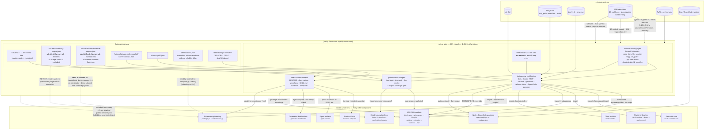

# Quality Assurance

## Overview

- **Name**: Quality Assurance (`quality-assurance`)
- **Description**: The single pytest suite plus the fixture, corpus and
  certification-evidence families that sit around it — 107 `test_*.py`
  modules, 1,410 `def test_` functions and 36,763 lines, larger than `bin/`
  itself. The full suite last ran green locally on 2026-10-06 at 1,965 passed
  and 12 skipped, run in two halves (960 passed + 4 skipped, 1,005 passed + 8
  skipped). It is dominated by black-box subprocess tests that invoke the extensionless
  `bin/adr-*` CLIs and assert on their JSON contracts and exit codes,
  supplemented by white-box tests that load those same scripts through
  `importlib.machinery.SourceFileLoader` or `runpy.run_path`, and by a large
  share of **artefact-contract tests** that read `README.md`,
  `.github/workflows/*.yml`, `clients/*.json`, `skills/*/SKILL.md`, `schemas/`
  and `templates/**` and assert on their content.
- **Type**: Verification harness and contract corpus — *not* a runtime
  component. Nothing in the shipped product imports it, with exactly one
  verified exception (see [Interfaces](#8-hook-latency-method-fixture--the-one-inbound-runtime-dependency)).
- **Technology**: Python 3.10+ with `pytest` as the sole third-party dependency;
  JSON fixtures; Markdown ADR control fixtures; one GPLv3 licence text. One
  single-fixture `tests/conftest.py`, two plain helper modules
  (`tests/adr_fixtures.py`, `tests/generated_tree_imports.py`); no
  `tests/__init__.py`, no fixture package.
- **Location**: [`tests/`](../tests) — [`tests/fixtures/`](../tests/fixtures),
  [`tests/certification/`](../tests/certification),
  [`tests/testsets/otgw-firmware/`](../tests/testsets/otgw-firmware),
  plus [`pytest.ini`](../pytest.ini) at the repository root. One fixture family
  lives outside the directory: [`clients/fixtures/`](../clients/fixtures).

## Purpose

adr-kit ships as a set of extensionless, stdlib-only Python scripts with no
package boundary, no installed entry points, no type checker and no runtime
schema validation on most of its JSON artefacts. Nothing in the codebase
mechanically prevents two tools from disagreeing about what an ADR's status is,
prevents a shipped template's version stamp from going stale, or prevents a
generated client tree from drifting from its source. **The Quality Assurance
component is the mechanism that does.**

It carries three distinct jobs that are usually separate concerns:

1. **Behavioural certification.** The 26 extensionless `bin/` entrypoints, the
   Python hook runtime, the MCP stdio server, the installer transaction model,
   the client generator, the release driver (`test_release_driver.py`, ADR-042)
   and the native OpenCode package contract are driven end to end and pinned
   at their observable surface: exit code, JSON shape, stdout/stderr split, and
   whether the tree was mutated. The convention is uniform across every tool —
   `0` clean/advisory/fail-open, `1` a real finding, `2` usage or infrastructure
   error.

2. **Artefact-contract enforcement.** A large fraction of the suite is not unit
   testing. It asserts on Markdown prose, YAML text and JSON Schema documents:
   that `skills/grill/SKILL.md` literally says *"Ask exactly one question."*,
   that the three shipped template version stamps equal `plugin.json`'s version,
   that a composite action contains no `ANTHROPIC`/`API_KEY` string, that 51
   `SKILL.md` files (17 workflows × 3 clients) carry a non-empty English description (with a Dutch-word
   regex guarding against the maintainer's first language leaking in). Because
   no ADR `Enforcement` `path_glob` covers `skills/`, `prompts/`,
   `instructions/`, `templates/` or `.github/`, **this suite is the only gate on
   those surfaces** — and the consequence is that editing documentation can
   break tests. `test_docs_claims.py` extends this to the claims a reader acts
   on: README counts, version literals and action pins in shipped templates.

3. **Non-functional evidence and release gating.** The two latency method
   fixtures (`adr-kit-cli-latency-v1`, `adr-kit-hook-latency-v1`) are committed
   method contracts with measured evidence; the CLI one carries its own budgets
   and is pinned by an ADR `Enforcement` rule, the hook one reads its budgets
   from `hooks/manifest.json`. `tests/certification/` holds committed per-client
   release evidence, not test input. The frozen 169-ADR real-world corpus gives
   retrieval and migration a target that no synthetic fixture can substitute
   for.

Its role in the architecture is structurally distinctive: it is the **only**
component that reaches every other component, and the only one whose failure
mode is a red CI leg rather than a broken user workflow.

## Software Features

| Feature | Description |
| --- | --- |
| **Ten-family test taxonomy** | The 107 modules group into quality gates, enforcement/judge, lifecycle & status, retrieval & index, readiness & grilling, guardian/hooks/runtime-config, clients/packaging/release, formats & migration, performance budgets, and runtime-env/MCP/generators/corpus. Per-family counts are not maintained. Filenames are unreliable — `test_documentation_contracts.py` and `test_docs_claims.py` test prose, not code. |
| **Extensionless-script loading layer** | Four idioms substitute for packaging: `SourceFileLoader` + `spec_from_loader` (30 modules, because `bin/adr-status` has no `.py` suffix), `spec_from_file_location` (20), `runpy.run_path` (5, to reach module constants like `ENFORCEMENT_BLOCK_RE`), and `sys.path.insert` + plain import (35). 72 of 107 modules carry at least one. |
| **Key-free LLM certification** | The whole LLM surface (`adr-judge --llm`, `adr-suggest`) is exercised without a network call or an API key: a generated fake Python `claude` is injected via `--llm-cmd`. A capturing variant records the constructed prompt so the content-derived SHA-256 prompt fences can be asserted. A counter file proves N `llm_judge` ADRs cost exactly one invocation. |
| **Bidirectional fail-open / fail-closed pinning** | Every advisory path is asserted to exit `0` (guardian `check`, `adr-watch`, `adr-suggest`, all hooks — *always* 0, even on corrupt state). Every fail-closed path is asserted **not to silently skip**: an oversize diff must say "enforcement was not performed" and must not say "skipping"; a killed ReDoS regex becomes a `violation`; a staged delete under `require_pattern` fails closed. |
| **Adversarial-input battery** | Prompt injection with forged sentinels, ReDoS patterns authored *by the ADR under evaluation*, `../outside.py` path escapes, `::error::` and `%0A` injection into GitHub annotations, hostile shell metacharacters quoted for both posix and PowerShell, `<script>` in ADR titles, and a maintainer-home-directory leak scanner that ships its own meta-test to prove it is not vacuously passing. |
| **Cross-tool unification checks** | Whole bug *classes* are guarded, not instances. `test_adr_index.py` runs five status readers (catalog, watch, judge, lint, retire) side by side to assert every one delegates to `adr_catalog.adr_status` — the fix for a forked-regex bug (PR #38) where one ADR read as `Accepted` by one tool and `Unknown` by another. `test_enforcement_redos.py` is parameterised over three tools' copies of `ENFORCEMENT_BLOCK_RE`. |
| **Two-layer latency method** | Machine-independent structural guards (memoization identity `first is second`, single-pass needle resolution, `.git`-containing directories pruned) that fail on any runner, plus a live wall-clock smoke test. Mandated in this shape by ADR-015. |
| **Committed release evidence** | `tests/certification/` holds six records that the release gate validates rather than the suite consuming: two simulated controls, three Windows observations and `probe-windows.json` (TASK-120, the events a real Claude Code 2.1.221 emitted, rendered into `docs/client-support.md`). All three Windows observations carry `working_tree_clean: false` and `release_eligible: false` and share one `prepared_payload_sha256`; the tests assert exactly that, so a dirty capture can never be promoted to a release. |
| **Frozen real-world corpus** | 169 ADRs / 1,946,079 bytes from `rvdbreemen/OTGW-firmware`, sha256-pinned per file in `manifest.json`, with `.gitattributes` `-text` so Windows checkouts cannot rewrite the hashed bytes. Every corpus test re-computes the hashes afterwards; migration writes only into `tmp_path` copies. |
| **Windows-first honest skips** | Platform behaviour is `skipif`-guarded, never branched: `sys.platform == "win32"` for exec bits, `os.name == "nt"` for the polyglot wrapper, and a *usability* probe rather than mere presence for bash (Windows ships a `bash.exe` stub that exists but cannot run). |
| **Retired-artefact absence checks** | Since ADR-029 the suite asserts that no compiled hook host comes back: `test_adr_hook_dispatch_matrix.py:283` and `test_client_adapter_generation.py:388` scan for `adr-hook.exe`, `ADR_KIT_NATIVE_HOOK` and `hooks/bin/` tokens, and `test_client_adapter_generation.py:211` asserts no hook tree carries a binary. |
| **Shell-template portability** | `test_pre_commit_portability.py` (0.59.1) cuts the interpreter probe and version comparison out of the real `templates/githooks/pre-commit` and runs them against stub interpreters: a Python older than 3.10 is skipped, and the comparison must not use GNU `sort -V`. Bash-gated by the same usability idea. |
| **Release-artefact test modules** | Six test modules are named in CI's file-existence check and are therefore shipped-release artefacts in their own right: deleting or renaming one fails CI before pytest runs. |
| **Native OpenCode package contract** | `test_opencode_package.py` validates the root package entrypoint, public-artifact allowlist, shared version registry, canonical skills, and explicit exclusion from the certified three-client registry. `test_opencode_plugin.py` runs the callback/config smoke with Bun when available and skips honestly when Bun is absent. |
| **Developer-machine isolation** | The installer tests probe a temporary directory, never the developer's live Copilot plugin; before 0.58.0 three Copilot tests renamed the real install aside and back (TASK-191, guarded in `test_agent_installer.py`). |

## Code Elements

This component was synthesized from exactly one Code-level document, retired
with the other `c4-code-*.md` files on 2026-08-09; the name below is a
provenance label, not a link. The whole of its substance lived in that one cluster — there is no internal sub-decomposition,
because there is no shared test infrastructure to decompose into.

| Code document | Role |
| --- | --- |
| `c4-code-tests.md` | The complete inventory: the ten-family taxonomy, per-module test counts and notable invariants, the test classes and the invariant each owns, the module-loading layer, the fixture families plus the external `clients/fixtures/`, the CI job matrix, and the governing-ADR verification. |

## Interfaces

Nine interfaces, grouped by direction. The first five are how the component is
*driven*; the last four are contracts the component *publishes* to the rest of
the repository — including one that a shipped runtime command actually reads.

### 1. pytest CLI

**Protocol**: command-line invocation.
[`pytest.ini`](../pytest.ini) supplies `pythonpath = .` — which is what makes
`hooks.hook_benchmark`, `clients.installer.*` and the one shared test helper
importable — and declares `slow` as the only marker.

```bash
python -m pytest -q                               # full suite, ~11 minutes; 1,965 passed / 12 skipped on 2026-10-06
python -m pytest -m "not slow"                    # excludes the 4 wall-clock tests
python -m pytest tests/test_adr_lint.py -q        # per-module
ADR_KIT_RUN_PERF=1 python -m pytest tests/test_adr_query.py
```

### 2. CI job contract

**Protocol**: GitHub Actions workflow steps, read from the thirteen files in
[`.github/workflows/`](../.github/workflows). Those that run pytest:

| Workflow · job (check name) | Runner(s) | Python | Invocation |
| --- | --- | --- | --- |
| `validate.yml` · `validate` | `ubuntu-latest` | `3.11` | a hand-picked 10-module packaging subset (`validate.yml:157`): `test_agent_installer`, `test_adr_mcp`, `test_bump_version`, `test_python_check`, `test_documentation_contracts`, `test_packaging_contract`, `test_client_adapter_generation`, `test_client_generator_performance`, `test_release_allowlist`, `test_client_certification` |
| `validate.yml` · `python-compatibility` (`Python <ver> on <os>`) | `ubuntu-latest`, `macos-latest`, `windows-latest` | `3.10`, `3.12` (6 legs, `fail-fast: false`) | `python -m pytest --collect-only -q --strict-markers` (`validate.yml:211`), then `python -m pytest -q --strict-markers` (`:214`) — the complete suite |
| `adr-lint-self.yml` · `pytest` | `ubuntu-latest` | `3.11` | `pytest tests/ -v` with `jsonschema` installed — also the complete suite |
| `release-candidate.yml` · `certify` | `windows-latest` | `3.11` | `python -m pytest -q`, manual dispatch on an exact candidate SHA |
| `release-publish.yml` · `publish` | `ubuntu-latest` | `3.11` | `python -m pytest -q` before the GitHub Release is published |
| `publish-opencode-npm.yml` · `preflight` | `ubuntu-latest` | `3.11` + Bun | `python -m pytest -q tests/test_opencode_package.py tests/test_opencode_plugin.py` |

The OpenCode pair is focused: the package test is stdlib-only, the plugin test
is Bun-gated and skips when Bun is unavailable, and neither adds OpenCode to the
three-client certification matrix. `install-smoke.yml` (0.57.0) runs no pytest:
it builds a fixture repository and runs the shipped `.pre-commit-hooks.yaml`
hook through `pre-commit try-repo`, and checks that shipped action pins
resolve. The other pull-request checks are `ADR Enforcement (declarative)`
(`adr-judge-self.yml`), `adr-lint smoke test on examples/` (`adr-lint-self.yml`),
`generated ADR indexes are up to date` (`adr-index-check.yml`) and
`adr-readiness`.

**What actually gates a merge** (branch protection, read via the GitHub API on
2026-10-06): on `dev` the only required check is `validate`, which runs the
filtered 10-module subset; on `main` the required checks are `validate`,
`pytest`, `ADR Enforcement (declarative)` and
`generated ADR indexes are up to date`. The six matrix legs are required on
neither branch, so a pull request into `dev` can auto-merge while a
3.10/3.12 or Windows/macOS leg is still running or red.

The `validate` job's *"Verify required files exist"* step
(`validate.yml:102-107`) lists six test modules as required release artefacts:
`tests/test_adr_lint.py`, `test_adr_judge.py`, `test_adr_judge_llm.py`,
`test_adr_discover.py`, `test_adr_status_history.py`, `test_adr_retire.py`.

Six of the thirteen workflow files (`validate`, `release-candidate`,
`release-publish`, `adr-guardian-audit`, `adr-index-check`, `adr-readiness`) are
themselves asserted on by test modules — a bidirectional edge with the
release-engineering component.

### 3. Exit-code convention pinned across every tool

**Protocol**: process exit status. This is a *published* convention the suite
enforces uniformly, not a per-tool detail.

| Code | Meaning |
| --- | --- |
| `0` | clean, advisory-only, skipped, or a fail-open degradation. `adr-guardian check`, `adr-watch`, `adr-suggest` and every hook path are asserted to be **always** 0. |
| `1` | a real finding: lint FAIL, judge violation, doctor drift, readiness block, branch-sync drift, index staleness. |
| `2` | usage / configuration / infrastructure error: malformed `.adr-kit.json`, unknown gate, missing path, illegal lifecycle transition, unknown ADR id, missing git ref, `--suggest-retrieval` without `--dry-run`. |
| `42` | a local sentinel inside `test_python_check.py`'s inline bash, meaning "Python 3 was found" — deliberately distinguishable from the hook's non-blocking `exit 0`. |

### 4. JSON document contracts asserted

**Protocol**: JSON payloads on stdout, and JSON files on disk.

| Tool / artefact | Asserted shape |
| --- | --- |
| `adr-lint --format json` | `{summary: {pass, advisory, fail, skipped, total}, files: [{adr_num, file, bucket, skip_reason, findings: [{gate, level, code, summary, details}]}], migration_notices, strict_mode}` |
| `adr-judge --json` | `{summary: {violations, advisories, adrs_checked}, findings: [{adr, rule, path, line, snippet, message, severity, overridden}]}` |
| `adr-index --format graph` | `{$schema, schema_version: 2, adrs: [...], relationships: [...]}`, sorted, `resolved: false` for dangling edges, and **no `generated_at`** so two runs are byte-identical. The committed `docs/adr/ADR-INDEX.json` is size-bounded at 16 KB + 2.5 KB per ADR (raised from 2 KB in 0.55.1) and at 25% of the ADR markdown (`test_adr_index.py:580-581`) |
| `adr-status --format json` | `{summary, adrs, retirement_candidates, retrieval}`; additive-only — pre-existing summary keys asserted untouched |
| `adr-readiness --format json` | `{schema_version: 1, evaluated_on, summary, adrs, advisories}` |
| OpenCode package documents | `package.json`, `opencode.json`, `.npmignore`, and `opencode/plugin.ts` are checked for a self-contained native entrypoint, shared version, public allowlist, and callback delegation; the package must not enter the certified three-client registry |
| Schema documents | `schemas/client-capabilities.schema.json` asserted directly: `const: 1`, `additionalProperties: false`, `minItems == maxItems == 3`, plus a negative scan proving six deferred client names appear nowhere |

### 5. JSON-RPC 2.0 / MCP stdio session driver

**Protocol**: newline-delimited JSON-RPC 2.0 over a subprocess's stdin/stdout.
[`tests/test_adr_mcp.py`](../tests/test_adr_mcp.py) (53 tests) drives
`bin/adr-mcp` as a real child process and is the conformance suite for
ADR-016's gate `adr-mcp-dual-era-v1`. `run_session()` (`:199`) writes all
messages in one batch and matches responses by id — deadlock-free without
threads.

Operations exercised: the legacy `initialize` handshake (a declared revision
is confirmed, anything else counter-offered, never echoed), the modern
stateless `_meta` envelope and `server/discover` (an unsupported version
returns `-32022`), `tools/list` (asserted to return **exactly seven** tools in
a fixed, append-only order per ADR-040 — `adr_context`, `adr_judge`,
`adr_status`, `adr_quality`, `adr_readiness`, `adr_lint`, `adr_related`, with
`adr_suggest` deliberately absent), and `tools/call`. Every emitted error code
must come from an allowlist; pinned codes include `-32602` unknown tool / bad
arguments, `-32601` unknown method, `-32700` malformed line, `-32600`
non-request. Malformed or unsafe argument shapes (including
`adr_dir: "../outside"`) must return `isError: true` rather than a protocol
error. Two **parity tests assert the MCP payload equals the parsed CLI JSON**
for `adr_context` and `adr_readiness`.

### 6. Hook envelope contract

**Protocol**: single-line compact JSON on a hook host's stdout.
[`tests/test_hook_protocol.py`](../tests/test_hook_protocol.py) pins
`{suppressOutput: true, hookSpecificOutput: {hookEventName, additionalContext}}`
under Claude (`CLAUDE_PLUGIN_ROOT` set) and top-level `additionalContext`
otherwise; Copilot's `PreToolUse` correctly yields `{}` while its `PostToolUse`
carries context. There is one host to pin: when 0.55.1 retired the native hook
binary (ADR-029), the parity tests against it went too, including three
parity-from-source tests in `test_adr_hook_result_limit.py`.

### 7. CLI latency method fixture

**Protocol**: committed JSON budget contract on disk, plus one ADR
`Enforcement` `require_pattern`.

[`tests/fixtures/cli/latency-corpus.json`](../tests/fixtures/cli/latency-corpus.json)
declares `method_id: "adr-kit-cli-latency-v1"`, `process_startup_included: true`,
`ci_variance_percent: 20`, `python_floor_ms_p50: 124`, 24 per-tool
`{p50_ms, p95_ms, hard_timeout_ms}` rows each tagged `kind: workload` (doing
the tool's real work) or `kind: startup` (`--help`, the interpreter-plus-import
floor), an `excluded` map naming four entrypoints that cannot be budgeted
(`adr-watch`, `adr-mcp`, `bump-version`, `adr-judge-precommit`) with the reason,
and a `known_over_ceiling` record for two whole-repository commands
(`adr-audit --whole-codebase`, `adr-doctor --check`) excepted by ADR-033.
`adr-lint` (1200/1600/2000) and `adr-retire` (800/1200/2000) keep their
before/after evidence for a clean tree, a contaminated tree (8 nested
worktrees) and 16/50/100-ADR scaling.

Consumed by [`tests/test_cli_performance.py`](../tests/test_cli_performance.py)
(structural guards and live smoke for `adr-lint` and `adr-retire`) and
[`tests/test_cli_corpus_coverage.py`](../tests/test_cli_corpus_coverage.py)
(9 tests, TASK-126), which fails on any `bin/` entrypoint that is neither
budgeted nor excluded, on an exclusion that names no entrypoint, and on a
budget row above the 2000 ms ceiling.

**Known stale:** two budget rows, `adr-embed` and `adr-context-vector`, name
tools that no longer exist since ADR-036 retired the vector layer. They pass
because the coverage test checks `excluded` against the entrypoints
(`test_cli_corpus_coverage.py:63-65`) but never checks `budgets` the same way.

### 8. Hook latency method fixture — the one inbound runtime dependency

**Protocol**: JSON file read by production code at runtime.

[`tests/fixtures/hooks/reference-corpus.json`](../tests/fixtures/hooks/reference-corpus.json)
declares `method_id: "adr-kit-hook-latency-v1"`, the sample counts (30 for
certification, 5 for `adr-doctor --deep`), three cache states, a Python floor
of 183 ms p50 and the 2026-08-05 recalibration record (ADR-030: budget =
measured p95 × 1.5, hard timeout = twice that). It no longer carries budgets:
`budget_source: "hooks/manifest.json"`, keyed by event id, so `plan-exit` and
`pr-create` can no longer collapse onto `pre-tool-use` and go unmeasured
(TASK-123). Its sibling
[`windows-process-floor.json`](../tests/fixtures/hooks/windows-process-floor.json)
records a 300-sample probe of a 3,072-byte no-CRT executable measuring the
irreducible Windows process-creation floor (p50 18.1 ms, p95 25.9 ms), keeping
one 144.6 ms scheduling outlier visible rather than smoothing it away.

Verified budgets (in `hooks/manifest.json`): eight per-event triples with
`hard_timeout_ms` between 900 ms (`user-prompt-submit`) and 2000 ms
(`pre-compact`), plus 5000 ms for `pr-create`, which runs the judge.

This is the component's only **inbound** edge from shipped code:
`hooks/hook_benchmark.py:115-118` resolves
`plugin_root / "tests" / "fixtures" / "hooks" / "reference-corpus.json"` and
`json.loads` it, and `bin/adr_doctor_probes.py:13,174` calls
`measure()` during `adr-doctor --deep`. See the corresponding finding below.
The qualifier *shipped* is load-bearing and exact: the only other inbound edge
is `scripts/refresh-otgw-corpus.py`, which writes the OTGW corpus manifest but
is absent from `packaging/public-artifacts.json`'s `include_roots`, so it never
reaches a distributed tree.

### 9. Certification evidence and corpus manifest contracts

**Protocol**: committed JSON evidence files consumed by the release toolchain.

- [`tests/certification/simulated-pass.json`](../tests/certification) is read by
  `scripts/build-client-adapters.py --certify` directly from
  `validate.yml:154` — a CI gate reading a file under `tests/`.
  `simulated-fail.json` (`records: []`) is the negative control.
  `{claude,codex,copilot}/windows-native.json` are real observations from
  adr-kit 0.36.0 on Windows 11 / Python 3.12.9, and `probe-windows.json`
  records the hook events a real Claude Code 2.1.221 emitted on win32.
- [`tests/testsets/otgw-firmware/manifest.json`](../tests/testsets/otgw-firmware)
  is the corpus contract: `license: "GPL-3.0-only"`, source repository and both
  revisions, a 169-entry `{path, bytes, sha256}` list, and the reviewed baseline
  (`file_count` 169, `total_bytes` 1,946,079, format counts canonical 85 /
  nygard 11 / unknown 73, action counts deterministic-preview 79 /
  guided-migration 90, `metadata_dry_run` `exit_code: 2`, `changed: 152`,
  `failed: 17`).
- [`clients/fixtures/*.json`](../clients/fixtures) — three degradation records
  referenced by `clients/exceptions.json`; `test_client_adapter_generation.py:174`
  asserts every declared exception has a `rationale`, a `user_effect` and an
  existing fixture whose `exception_id` matches, so **a client degradation
  cannot be declared without committed evidence**.

### Environment-variable interface

| Variable | Direction | Effect |
| --- | --- | --- |
| `ADR_KIT_RUN_PERF=1` | set | opts into the absolute cold-process p95 gate (release certification only) |
| `ADR_KIT_NO_LLM=1` | set | forces declarative-only; asserted to beat an explicit `--llm` |
| `ADR_KIT_SUGGEST=1` | set | opts into the advisory suggest pass |
| `ADR_KIT_OVERRIDE` | set *and* popped | the `"ADR-NNN: reason"` audit-trail contract in one module; **popped** by other judge modules so a developer's local override cannot skew results |
| `CLAUDE_PROJECT_DIR`, `CLAUDE_PLUGIN_ROOT`, `CURSOR_PLUGIN_ROOT`, `COPILOT_CLI` | popped, then selectively set | popped so tests never pick up the checkout's own `docs/adr/`; `CLAUDE_PLUGIN_ROOT` then set deliberately to select the hook output envelope |
| `PATH` | rewritten | pointed at an empty directory to simulate a missing Python, or prepended with a fake `codex` executable |

### Python import surface

The importable surface is small. `_write_adr(adr_dir, num, *,
status="Proposed", open_questions="None.", verified_in=None, references=...) -> Path`
([`tests/test_adr_readiness.py:30`](../tests/test_adr_readiness.py#L30)) is
imported by `test_adr_open_questions.py`, `test_adr_readiness_ci.py`,
`test_adr_guardian_queue.py`, `test_adr_auto_grill.py` and
`test_adr_substance.py` — **shared by importing another test module**,
which works only because `pythonpath = .` puts `tests/` on `sys.path`. Two
plain helper modules sit beside it: `tests/adr_fixtures.py` (`isolated_copy`,
which neutralises a borrowed ADR's cross-references; 4 importers) and
`tests/generated_tree_imports.py` (first-party import closure inside a
generated tree; 2 importers).

Everything else the suite imports comes from outside the component, reached by
`sys.path` manipulation rather than packaging: roughly 40 symbols from
`bin/adr_*.py`, `hooks/adr_hook_core.py`, `hooks/adapters/`,
`hooks/hook_benchmark.py`, `scripts/version_sites.py`,
`scripts/client_evidence.py` and `clients/installer/*`. That list was
enumerated in full in the retired `c4-code-tests.md`.

## Dependencies

### Components used

Every other component in the system, without exception — this component's
dependency set *is* the component inventory. Because the sibling component
documents are authored in parallel, the table below names each dependency by the
Code-phase cluster slugs it comprises, which are the verified identifiers.

| Dependency (Code-phase clusters) | Mechanism |
| --- | --- |
| `bin-cli-gates`, `bin-cli-enforcement`, `bin-cli-lifecycle`, `bin-cli-retrieval`, `bin-cli-migration`, `bin-cli-readiness`, `bin-cli-mcp` | **subprocess** — `[sys.executable, <bin script>, …]` for the 26 entrypoints, plus **module load** via `SourceFileLoader` / `runpy.run_path` to call pure functions and read module constants in-process |
| `bin-lib-semantic-core` | **import** after `sys.path.insert` — `adr_schema`, `adr_catalog`, `adr_format`, `adr_query` (`query_adr_context`, `IndexQueryError`) |
| `bin-lib-readiness-grill` | **import** — `adr_readiness`, `adr_readiness_ci`, `adr_retrieval_health`, `adr_guardian_queue`, `adr_grill_signal` |
| `bin-lib-runtime` | **import** — `adr_state` (`atomic_save_state`, `update_state`), `adr_regex` (`RegexEvaluator`, `RegexTimeoutError`) |
| `bin-lib-doctor` | **import** — `adr_doctor_checks` (`check_mcp_launcher`, `check_hook_package`), `adr_doctor_models` (`benchmark_extension`), `adr_doctor_probes` (`classify_model_probe`, and the underscore-private `_mcp_deep`, making it de facto public API) |
| `hooks` | **import** (`adr_hook_core`, the `adapters/` package, `hook_benchmark`), **subprocess** (`adr-hook.py`, `run-hook.cmd`), and **JSON file read** (`hooks/manifest.json`, `hooks/hooks.json`) |
| `clients-installer` | **import** of all eleven `clients/installer/*.py` submodules (including `native.py` and `judge_backend.py`, both imported by `test_agent_installer.py:18`) and **module load** of `scripts/install-agent-envs.py` |
| `packaging-ci` | **import / module load** of `scripts/release.py` and its phase modules (`test_release_driver.py`), `scripts/client_generation.py`, `client_certification.py`, `client_evidence.py`, `project_setup.py`, `adr_settings.py`, `settings.py`, `version_sites.py`, `check-branch-sync.py`, `build-client-adapters.py`, and **text assertions** on `.github/workflows/*.yml` and `packaging/*.json`. Plus one **inbound write**: `scripts/refresh-otgw-corpus.py:24,186` regenerates `tests/testsets/otgw-firmware/manifest.json` including the 169 `sha256` entries that `test_otgw_corpus.py` then asserts are byte-unchanged — the corpus refresher is the only writer into this component. The edge therefore runs three ways: CI gates the suite, the suite gates CI's own files, and one release script owns a corpus the suite guards |
| `schemas-templates` | **file read + content assertion** — `schemas/*.json` are asserted on as JSON documents (their own `const`/`minItems` values), never validated through a schema engine here; `templates/**` version stamps are compared against `plugin.json` |
| `agent-surface` | **file read + prose assertion** — 51 `SKILL.md` files across the three clients, `prompts/`, `instructions/`, `clients/workflows.json`. Some tests assert on literal sentences in the prompts |
| `generated-distributions` | **file read + byte comparison** — `codex/` and `copilot/` skill counts, discovery syntax, hook handler tails, and the requirement that no generated hook tree carries a compiled binary (`test_client_adapter_generation.py:211`) |

### External systems

| System | How it is used |
| --- | --- |
| **`git` CLI** | Invoked by about 26 modules: `init`, `add`, `commit`, `mv`, `rm`, `tag`, `branch`, `checkout --detach`, `clone --depth`, `rev-parse`, `ls-files --stage`, `write-tree`, `archive`. Only `test_adr_judge_override.py:216` and `test_adr_git_diff_semantics.py:202` skip when git is absent; the rest assume it |
| **Filesystem / OS** | `tmp_path` throwaway trees throughout; POSIX exec bits and `chmod`; `utime` for staleness; process spawning; file locking through `clients/installer`'s `client_lock` |
| **`bash` / `sh`** | `test_python_check.py`, `test_pre_commit_portability.py` and two `test_adr_generate_scripts.py` tests, guarded by a *usability* probe (`_find_usable_bash`, `_usable_bash`) rather than mere `shutil.which` presence |
| **`cmd.exe`** | `test_packaging_contract.py:117` — the Windows polyglot-wrapper quietness contract (`stderr == ""`) |
| **GitHub Actions** | The runner matrix, branch protection (only `validate` required on `dev`), `pip install pytest`, and the `$GITHUB_STEP_SUMMARY` / `$GITHUB_OUTPUT` sinks that `test_adr_readiness_ci.py` simulates |
| **PyPI** | `pytest` only, installed by CI. `packaging/dependencies.json` declares `runtime: []`, `development: ["pytest"]`, and `tests/certification/simulated-pass.json` records `development_in_runtime: false` — two tests assert exactly that, so the dependency is self-declaring |
| **CI neighbours, not imported** | `jq`, Node 20 + `ajv-cli` + `ajv-formats`, `markdownlint-cli2` run in `validate.yml` steps around pytest. `jsonschema` is pip-installed only in `adr-lint-self.yml`; `pre-commit` only in `install-smoke.yml` |
| **Bun / OpenCode** | Bun runs the native OpenCode plugin smoke harness when installed. The package contract remains testable without Bun; absence of Bun is an explicit focused-test skip, not a claim of certification. |
| **Deliberately absent: the `claude` CLI and any network** | **No test in the suite invokes `claude`, makes a network call, or requires an API key.** Every LLM path is driven by a generated fake Python script passed via `--llm-cmd` or `ADR_KIT_LLM_CMD`. `test_adr_guardian_state.py` additionally asserts at string level that neither the self-dogfood nor the downstream-template `adr-guardian-audit.yml` runs an LLM or references any secret beyond `github.token` |

## Notable findings carried forward

Ranked by consequence. Items 1–3 were verified directly against source at
component level; the rest were carried from the retired `c4-code-tests.md` and
re-checked against the v0.59.1 tree.

1. **The hook latency reference fixture is a runtime input to a shipped command,
   but lives in a directory the release allowlist excludes.**
   `hooks/hook_benchmark.py:115-118` reads
   `plugin_root/tests/fixtures/hooks/reference-corpus.json`;
   `bin/adr_doctor_probes.py:13,174` calls it during `adr-doctor --deep`;
   `bin/adr-doctor:116` defaults `--plugin-root` to the adr-kit installation root.
   But no distributed tree contains that fixture, by two independent mechanisms:
   `tests` is absent from `packaging/public-artifacts.json`'s `include_roots`
   (which is all that `clients/installer/payload.py`'s `_copy_public_payload`
   consults when preparing a local install), and it is additionally listed in
   `forbidden_segments` (which the release-archive path enforces). Meanwhile
   `hooks` *is* an `include_root`, so `hook_benchmark.py` itself does ship. The
   shipped module points at an unshipped fixture. The `FileNotFoundError` is caught
   by the `except (OSError, ValueError, subprocess.SubprocessError)` handler at
   `adr_doctor_probes.py:213` and reported as
   `hook-latency-extension: failed, required=False` — non-blocking, but it means
   **the deep hook-latency probe can only actually measure inside a development
   checkout**. Mechanically implied from the read paths and the allowlist, not
   reproduced against an installed payload.

2. **ADR-015's "every deterministic path has a budget entry" clause is now
   checked one way only.** ADR-015's Decision Contract Must clause
   (`docs/adr/ADR-015…md:144-145`) reads *"Every deterministic user-facing CLI
   or hook path keeps a p50/p95/hard-budget entry in a committed latency
   fixture with measured evidence."* `test_cli_corpus_coverage.py` (TASK-126)
   enforces the forward direction: every `bin/` entrypoint must be budgeted or
   excluded by name. The reverse is unchecked, which is how the `adr-embed` and
   `adr-context-vector` rows outlived their tools. And the corpus numbers are
   recorded, not re-measured: only `adr-lint` and `adr-retire` are timed by the
   suite, because **both layers of `test_cli_performance.py` hardcode that
   pair** — `:39` iterates the literal tuple `("adr-lint", "adr-retire")` and
   `:300` a hardcoded `(tool, argv)` list. The other 22 rows carry measured
   evidence from 2026-08-05 (`cli_measured`) but no test re-times them.

3. **Two latency methods with budgets in different places, plus a third budget
   key outside both.** `adr-kit-cli-latency-v1` keeps its budgets in the
   fixture under a 2000 ms hard ceiling; `adr-kit-hook-latency-v1` keeps only
   the method in the fixture and reads its budgets from `hooks/manifest.json`
   (900–2000 ms hard, 5000 ms for `pr-create`). Since the ADR-030
   recalibration to the Python host the two are in the same range; the hook
   budgets are no longer tighter than the CLI ceiling. The release toolchain
   declares its own `hard_timeouts_ms: {clean: 5000, warm: 1000}` in
   `packaging/client-generation-benchmark.json`, a different key on a
   plausibly non-user-facing surface. The relationship between the three is
   written down nowhere. Also worth noting for provenance: the hook method
   predates ADR-015 (Windows floor measured 2026-07-19, ADR-015 accepted
   2026-07-26) — ADR-015 generalised a discipline the hook harness already
   practised.

4. **CI does not use `-m "not slow"`, contradicting `pytest.ini`.** The marker
   docstring says `slow` tests are *"skipped in fast CI with `-m "not slow"`"*,
   but `validate.yml:214` runs `python -m pytest -q --strict-markers` with no
   marker filter, so all four wall-clock tests execute on all six matrix legs.
   The docstring is stale documentation. Further latency assertions live in
   modules counted in other families and carry no marker at all, so
   `-m "not slow"` would not skip them either.

5. **The supported-runtime matrix is Python 3.10 + 3.12, and it is not a gate
   on `dev`.** 3.11 appears only in the single-runner jobs (`validate`,
   `adr-lint-self` `pytest`, the release workflows). Branch protection on `dev`
   requires only `validate`, which runs the 10-module subset, so a module
   outside that subset can reach `dev` before the six matrix legs report. On
   `main` the full suite gates through `adr-lint-self`'s `pytest` check (3.11,
   ubuntu only); the 3.10/3.12 and Windows/macOS legs remain advisory there
   too.

6. **Little shared test infrastructure.** `tests/conftest.py` holds one
   fixture (`tree_snapshot`, TASK-128) and says it should stay single-purpose;
   two plain helper modules (`adr_fixtures.py`, `generated_tree_imports.py`)
   carry one concern each; no `tests/__init__.py`, no fixture package. Loader
   boilerplate is duplicated across 72 modules in four idioms, and distinct
   ADR-writing helpers with different signatures are reimplemented per module.
   The most widely shared helper, `_write_adr`, is exported by importing
   another test module. This is the
   component's largest maintenance liability and the reason a change to how
   `bin/` scripts are loaded touches dozens of files.

7. **The suite is the primary consumer of the private API.** It reaches into
   `_walk_repo_files`, `_resolve_gates_locally`, `_gate_exists_locally`,
   `_atomic_write_text`, `_write_transaction`, `_artifact_report`, `_load_state`,
   `_native_hook_config`, `_validate_manifests`, `_validate_workflows`,
   `_validate_capabilities`, `_render_skill`, `_mcp_deep`,
   `_atomic_write_bytes`, and constants `ENFORCEMENT_BLOCK_RE`, `DEFAULT_GATES`,
   `ALL_GATES`, `MAX_CONTEXT_CHARS`, `MAX_INPUT_BYTES`, `CLI_TIMEOUT_S`,
   `PREPARED_MARKER`, `DEFAULT_STATE`, `PROVENANCE`, `CLIENT_IDS`. Renaming any
   of them breaks tests in a way the CLI surface would never reveal.

8. **Documentation edits can break tests, and `.yml` is checked by substring.**
   Because PyYAML is not stdlib — stated explicitly at
   `test_adr_guardian_state.py:12` and again at `:196` — workflow files are
   asserted by string containment. Combined with the prose contracts on
   `SKILL.md`, `README.md` and `INSTALL-AGENT.md`, a wording change in a shipped
   document is a test-affecting change.

9. **`tests/certification/` is committed evidence, not test input.** All three
   Windows observation records carry `working_tree_clean: false` and
   `release_eligible: false` and share one `prepared_payload_sha256`; the tests
   assert exactly that, so a dirty capture can never be promoted to a release.
   `model_invocation` is `"not-run: paid/cloud model use requires opt-in"`. One
   of these files is also read by `validate.yml:154`, so the release gate depends
   on a path under `tests/` that the release payload excludes — the same
   allowlist boundary as finding 1, but harmless here because the gate runs in
   CI, never in a payload.

10. **A GPLv3 licence boundary sits inside an MIT repository.** The 169-ADR
    OTGW-firmware corpus is GPL-3.0-only and its own README forbids copying
    corpus prose into templates, examples or runtime documentation. The
    retired Code-phase document described the corpus only through
    `manifest.json` and quoted none of the 169 bodies; this document does the
    same. `.gitattributes` pins `-text` on the corpus so Windows checkouts
    cannot rewrite the hashed bytes.

11. **Six test modules are release artefacts.** `validate.yml:102-107` requires
    `tests/test_adr_lint.py`, `test_adr_judge.py`, `test_adr_judge_llm.py`,
    `test_adr_discover.py`, `test_adr_status_history.py` and `test_adr_retire.py`
    to exist. Renaming one fails CI in the file-existence check before pytest
    runs — a coupling between test-module naming and the release gate.

12. **A test encodes a production incident structurally.**
    `test_bump_version.py` asserts the strings `subprocess` and `os.system` do
    **not** appear in `bin/bump-version`, because the old bash implementation
    shelled out to `python3` and the Windows Store alias dispatched on the
    *argument's* shebang, causing cygheap fork crashes during releases
    v0.27.0–v0.29.0. This is the clearest example of the suite guarding a
    mechanism rather than an output.

## Governing ADRs

Verified against every `## Enforcement` block in `docs/adr/` and against
ADR-015's own frontmatter.

**ADR-015 — Enforce a Two-Second Deterministic Latency Budget as a Test Fixture
Contract** (`Accepted 2026-07-26`, `binding: true`,
`gate: "adr-kit-cli-latency-v1"`) is one of two ADRs whose Enforcement
`path_glob` points into `tests/`. Verified rule:

```json
{
  "forbid_pattern": [],
  "forbid_import": [],
  "require_pattern": [
    {
      "pattern": "\"hard_timeout_ms\": 2000",
      "path_glob": "tests/fixtures/cli/latency-corpus.json",
      "message": "The 2000 ms hard ceiling is the ADR-015 contract; changing it requires superseding or amending ADR-015."
    }
  ]
}
```

So the fail-closed pre-commit judge blocks any commit that removes the 2000 ms
ceiling from the corpus. ADR-015's `verified_in` names
`tests/test_cli_performance.py` and `tests/test_hook_performance.py`, its
`components` include `tests`, and its Decision Outcome mandates the two-layer
split (machine-independent structural guards plus a live smoke test) that
`test_cli_performance.py` implements.

**ADR-016 — Serve Both MCP Protocol Eras from One Hand-Rolled Stdio Server**
(`gate: "adr-mcp-dual-era-v1"`) is the other: one of its `require_pattern`
rules is scoped to `tests/test_adr_mcp.py` and requires the string
`server/discover`, so the pre-commit judge blocks a commit that stops the
conformance suite exercising the modern era's entry point.

**Further ADRs name test modules in `verified_in` without governing the
directory** — treat them as inherited constraints on the modules they name, not
as enforcement over this component:

| ADR | Names |
| --- | --- |
| ADR-008 | `tests/test_packaging_contract.py` |
| ADR-009 | `tests/test_adr_lint_clarity.py` |
| ADR-010 | `tests/test_client_capabilities_schema.py` (and the ≤ 300 / ≤ 400 line budgets that `test_release_allowlist.py` asserts) |
| ADR-023 | `tests/test_adr_pr_guard.py` |
| ADR-025 | `tests/test_adr_settings.py` |
| ADR-026 | `tests/test_adr_audit_command.py` |
| ADR-027 | `tests/test_adr_signer_discovery.py` |
| ADR-028 | `tests/test_adr_cross_references.py` |
| ADR-029 | `tests/test_adr_hook_dispatch_matrix.py`, `tests/test_client_adapter_generation.py`, `tests/test_hook_performance.py` |
| ADR-036, ADR-038 | `tests/test_adr_judge_llm.py` |
| ADR-014 (Superseded by ADR-018) | `tests/test_adr_query.py`, `tests/test_adr_retrieval_health.py` |

ADR-039 (native OpenCode package) has an empty `verified_in`;
`test_opencode_package.py` and `test_opencode_plugin.py` are its focused
evidence in practice, and neither changes the certified three-client gate.

ADR-004 is referenced by name inside `test_adr_status_coverage.py` and
`test_adr_watch.py` assertions, but does not scope `tests/`. No other ADR
applies.

## Component Diagram


```mermaid
flowchart TB
    subgraph QA["Quality Assurance (quality-assurance)"]
        direction TB
        subgraph SUITE["pytest suite — 107 modules · 1,410 test functions"]
            LOAD["module-loading layer<br/>SourceFileLoader · spec_from_file_location<br/>runpy.run_path · sys.path.insert<br/><i>duplicated in 72 modules</i>"]
            BEHAV["behavioural certification<br/>CLIs · hooks · MCP · installer · generator · release driver · OpenCode package"]
            ARTE["artefact-contract tests<br/>README · docs claims · workflows · SKILL.md · schemas · templates"]
            PERF["performance budgets<br/>two-layer: structural + live smoke<br/>+ corpus coverage gate"]
            FAKE["fake <i>claude</i> via --llm-cmd<br/><b>no network, no API key, ever</b>"]
        end
        subgraph FIX["fixtures &amp; corpora"]
            LINTFIX["fixtures/ — 11 lint control dirs<br/>+ madr|nygard (+ -migrated)"]
            CLILAT["fixtures/cli/latency-corpus.json<br/><b>adr-kit-cli-latency-v1</b> · 2000 ms<br/>24 budget rows · 4 excluded"]
            HOOKLAT["fixtures/hooks/reference-corpus.json<br/><b>adr-kit-hook-latency-v1</b> · method only<br/>+ windows-process-floor.json"]
            NATFIX["fixtures/{claude,codex,copilot}/<br/>native-contract.json"]
            GRILLFIX["fixtures/grill/*.json"]
            CERT["certification/*.json<br/><i>committed release evidence</i><br/>release_eligible: false"]
            CORPUS["testsets/otgw-firmware<br/>169 ADRs · GPLv3 · sha256-pinned"]
        end
    end

    subgraph SUT["system under test — every other component"]
        SEM["Semantic core<br/><small>bin-lib-semantic-core</small>"]
        CLIS["ADR CLI toolchain<br/><small>bin-cli-gates · -enforcement · -lifecycle<br/>-retrieval · -migration · -readiness · -mcp</small>"]
        LIBS["Runtime libraries<br/><small>bin-lib-runtime · -doctor · -readiness-grill</small>"]
        HK["Hook integration layer<br/><small>hooks · Python host · manifest.json budgets</small>"]
        INST["Client installer<br/><small>clients-installer</small>"]
        REL["Release engineering<br/><small>packaging-ci · scripts/release.py</small>"]
        CONTR["Contract layer<br/><small>schemas-templates</small>"]
        AGENT["Agent surface<br/><small>agent-surface</small>"]
        DIST["Generated distributions<br/><small>generated-distributions</small>"]
        OPC["Native OpenCode package<br/><small>opencode/plugin.ts · package.json</small>"]
    end

    subgraph EXT["external systems"]
        GIT[("git CLI")]
        FS[("filesystem<br/>tmp_path · exec bits · locks")]
        SH[("bash / sh · cmd.exe")]
        GHA[("GitHub Actions<br/>13 workflows · dev requires validate only")]
        PYPI[("PyPI — pytest only")]
        BUN[("Bun / OpenCode runtime")]
    end

    LOAD --> BEHAV & PERF
    FAKE --> BEHAV
    LINTFIX --> BEHAV
    GRILLFIX --> ARTE
    NATFIX --> ARTE
    CLILAT --> PERF
    HOOKLAT --> PERF
    CORPUS --> BEHAV

    BEHAV -->|"subprocess<br/>sys.executable + bin script"| CLIS
    BEHAV -->|"import after sys.path.insert"| SEM
    BEHAV -->|"import"| LIBS
    BEHAV -->|"import + subprocess"| HK
    BEHAV -->|"import clients.installer.*"| INST
    BEHAV -->|"import / module load scripts/*"| REL
    BEHAV -->|"JSON-RPC 2.0 over stdio"| CLIS
    BEHAV -->|"static contract + Bun smoke"| OPC

    ARTE -->|"file read + content assertion"| CONTR
    ARTE -->|"prose assertion on SKILL.md"| AGENT
    ARTE -->|"byte compare + no-binary check"| DIST
    ARTE -->|"package and callback assertions"| OPC
    ARTE -->|"substring assertion on *.yml"| REL

    PERF -->|"cold-process wall clock"| CLIS
    PERF -->|"hook_benchmark.measure()"| HK

    CERT -.->|"read by build-client-adapters.py --certify<br/>(validate.yml:154)"| REL
    HOOKLAT -.->|"<b>read at runtime</b> by hooks/hook_benchmark.py:115<br/>via adr-doctor --deep · absent from release payload"| HK
    CLILAT -.->|"ADR-015 require_pattern<br/>pre-commit judge blocks relaxation"| CLIS

    GHA -->|"python -m pytest -q --strict-markers<br/>3.10 &amp; 3.12 x ubuntu/macos/windows · advisory"| SUITE
    GHA -->|"10-module subset · 3.11 · required on dev"| SUITE
    GHA -->|"full suite · 3.11 · pytest check, required on main"| SUITE
    PYPI --> SUITE
    BUN --> OPC
    GIT --> BEHAV
    FS --> BEHAV
    SH --> BEHAV

    QA -. "excluded from every release payload<br/>(public-artifacts.json forbidden_segments: tests)" .-> REL
```
