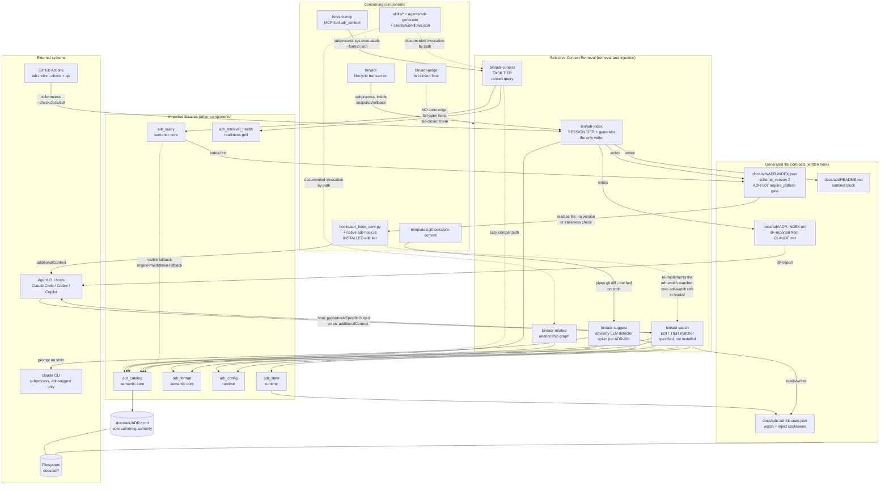

# Selective Context Retrieval

## Overview

- **Name**: Selective Context Retrieval (`retrieval-and-injection`)
- **Description**: The five extension-less Python CLIs that make recorded architecture
  decisions *findable* at the moment an agent needs them. One of them generates every
  derived index view; the other four read it. [`bin/adr-index`](../bin/adr-index) writes
  the compact `ADR-INDEX.md` session map, the ADR-007 node-and-edge `ADR-INDEX.json`
  graph, a legacy flat JSON list, and the sentinel-delimited block inside
  `docs/adr/README.md`. [`bin/adr-context`](../bin/adr-context) ranks ADRs against a
  free-text task query through that graph. [`bin/adr-related`](../bin/adr-related)
  answers inbound/outbound/dangling dependency questions for one ADR.
  [`bin/adr-watch`](../bin/adr-watch) implements the edit-tier matcher and injector that
  ADR-004 specifies. [`bin/adr-suggest`](../bin/adr-suggest) is the single LLM-backed
  member: an opt-in advisory detector for whether a staged diff introduces a *new*
  decision that is not yet recorded.
- **Type**: CLI toolchain — five standalone command-line programs, no service, no daemon,
  no long-lived process. One generator (`adr-index`) plus four consumers.
- **Technology**: Python 3 (3.10+ supported matrix), **standard library only** — verified:
  no third-party import in any of the five files. All five are **extension-less**
  (`#!/usr/bin/env python3`, no `.py`), so they are invoked as `python bin/<name>` and
  imported by tests through `importlib.machinery.SourceFileLoader`. 2,743 lines total
  (`adr-context` 551, `adr-related` 373, `adr-index` 418, `adr-watch` 643,
  `adr-suggest` 758). Communication with the rest of the system is by **JSON files on
  disk**, **subprocess invocation**, and **stdin pipes** — never by shared memory or a
  network socket.

## Purpose

This component owns the *retrieval* half of ADR-004's layered context model. ADR-004
(Accepted 2026-07-05) defines three fail-open injection tiers and one fail-closed
enforcement floor. All three fail-open tiers are named here by file:

| ADR-004 tier | Named implementation | What it delivers |
|---|---|---|
| **Session tier** | `bin/adr-index` → `docs/adr/ADR-INDEX.md`, `@`-imported from `CLAUDE.md` | One row per ADR (id, status, `path_glob` scope, one-line decision) present in every session from the first token |
| **Edit tier** | the `adr-watch` matcher — Enforcement `path_glob` strongest, keyword fallback | The single governing Accepted ADR's `## Decision` text, bounded to a token budget, injected before an `Edit`/`MultiEdit`/`Write` is applied |
| **Task tier** | `bin/adr-context` and the key-free MCP `adr_context` tool | A ranked pull-feed any agent or subagent can query mid-task |

The problem being solved is that an agent asked to change a file has no way to know which
of N recorded decisions constrain that file. Reading all of them is expensive and mostly
irrelevant; reading none of them produces drift the pre-commit judge then blocks. This
component narrows N to the few that matter, three different ways, at three different
moments — and it is **fail-open by construction** so that a retrieval failure degrades
into missing advice rather than a blocked developer. The fail-closed floor is
`bin/adr-judge`, which is deliberately **not** in this component.

The architectural shape is **generate once, query many**: `adr-index` is the only writer
of the derived artefacts, and `adr_query` (via `adr-context`), `hooks/adr_hook_core.py`,
`hooks/native/adr-hook.rs` and `bin/adr-grill-signal` are their readers. Markdown ADRs
remain the sole authoring authority; the JSON graph is a *generated runtime projection*
with a visible Markdown fallback (ADR-014).

### The edit tier is specified here and installed elsewhere

This is the most important thing to know about the component and it is not a footnote.

ADR-004's Decision says the edit tier "reuses the existing adr-watch matcher (Enforcement
`path_glob` strongest, keyword fallback)". `bin/adr-watch` still implements exactly that,
including `--pre-edit` (PreToolUse injection) and `--hook` (PostToolUse nudge), the
`inject`/`watch` cooldown state, and the bounded `[adr-inject] ADR-NNN (title) governs
<path>` envelope. **But it is no longer the wired implementation.** Verified: a recursive
grep for `adr-watch` across all of `hooks/` returns zero hits. The shipped runtime
declares `PreToolUse`/`PostToolUse` on `Edit|MultiEdit|Write` in `hooks/hooks.json`,
dispatches through `hooks/run-hook.cmd`, and lands in
`hooks/adr_hook_core.py`, which **re-implements the matcher itself**
(`_matching_path_records` at `hooks/adr_hook_core.py:319`, reading `ADR-INDEX.json`
directly via `load_index_records` at `:182`). A third implementation exists in Rust at
`hooks/native/adr-hook.rs`.

Meanwhile `templates/adr-kit-guide.md:262`, `CHANGELOG.md:513` and ADR-004 itself all
still describe `bin/adr-watch --pre-edit` / `--hook` as the wired edit tier. So the
edit-tier behaviour exists in two (Python) or three (counting Rust) places, with only the
newer one actually installed, and the documentation points at the older one. This
component owns the *specified* edit tier; the [Hook Integration Layer](./c4-code-hooks.md)
owns the *installed* one.

### Governing ADRs (verified in `docs/adr/`)

| ADR | Status | How it binds this component — verified |
|---|---|---|
| **ADR-004** — Layered ADR Context Injection | Accepted 2026-07-05, `binding: false` | Names `bin/adr-index`, the `adr-watch` matcher and `bin/adr-context` by file in its Decision (read directly: Decision items 1–4). Mandates exit 0 on every path, pins scope = Enforcement `path_glob` and status = `## Status` reconciled with `status_history[-1]`, and caps injected content to the single top-ranked ADR's Decision within a token budget. |
| **ADR-007** — JSON ADR Graph Index for Agent Retrieval | Accepted 2026-07-23 | Enforcement scope is `docs/adr/ADR-INDEX.json` — **the artefact this component writes**, not its code. Two `require_pattern` rules on that file: `"schema_version"\s*:\s*2` and `"relationships"\s*:`. Items 5–7 assign generation to `adr-index`, enriched ranked results to `adr-context`, and shared relationship-extraction rules to `adr-related`. |
| **ADR-014** — Use the Generated ADR Graph as the Selective-Context Query Engine | Accepted 2026-07-23, `binding: true`, `gate: index-first-retrieval` | Frontmatter `components:` includes `adr-context` (verified). Makes the graph the normal runtime projection with Markdown as *visible* fallback, and separates relevance from authority: Accepted governs, Proposed advises, Superseded redirects to a live successor. This is why `adr-context` delegates all scoring to `adr_query`. Its declarative rule arrays are **deliberately empty** — the ADR body states rules "are deferred until the implementation surface exists; empty rules do not weaken the named gate". |
| **ADR-001** — Make Per-Commit LLM Gates Opt-In | Accepted 2026-05-31, `binding: false` | Names `bin/adr-suggest` directly (`ADR-001:59`: "Fix `bin/adr-suggest` to honor `suggest.enabled` (default `false`)"). Implemented at `bin/adr-suggest:657`. Enforcement is "manual review only" for this ADR. |

**ADR-015 does not govern this component** — corrected against the Code-phase doc, which
listed it. Its frontmatter `components:` are `adr-lint`, `adr-retire`, `hooks`, `tests`,
and its Enforcement `path_glob` is `tests/fixtures/cli/latency-corpus.json`. It appears
below as an **unmet Must clause**, not as a governing decision.

**ADR-016 does not govern this component**: it exists on disk
(`ADR-016-serve-both-mcp-protocol-eras-from-one-hand-rolled-stdio-server.md`) and appears
as row 16 of the regenerated `ADR-INDEX.md`, but it is `Proposed` and untracked in git, so
it carries advisory authority only and its scope is `bin/adr-mcp` / `tests/test_adr_mcp.py`.
Noted here so a later reader comparing this document against a 16-row index does not read
the omission as drift.

**No Enforcement `path_glob` anywhere in the repository covers any of the five scripts.**
Verified by enumerating every `path_glob` in `docs/adr/*.md` (including the untracked
ADR-016): the complete set is `bin/adr-lint`, `bin/adr-mcp`, `clients/workflows.json`,
`docs/adr/ADR-INDEX.json`, `schemas/adr-kit-config.schema.json`,
`schemas/client-capabilities.schema.json`, `templates/githooks/pre-commit`,
`tests/fixtures/cli/latency-corpus.json`, `tests/test_adr_mcp.py`. The pre-commit judge
therefore guards this component's *output* (via ADR-007's two `require_pattern` rules on
`ADR-INDEX.json`) but never its *source*. Edit-tier ADR injection also never fires on
these five files, because no Accepted ADR claims them as scope — the component that
narrows context for every other file has no ADR narrowing context for itself.

## Software Features

### Session-tier index generation (`adr-index`)

- **Four derived views from one read pass.** `load_adr_records` reads each `ADR-*.md`
  exactly once, and all four renderers consume that shared record list: the compact
  Markdown map, the ADR-007 node-and-edge graph, a legacy flat JSON list, and the README
  block. No renderer re-parses Markdown.
- **Non-destructive README updating.** `update_readme` replaces only the text between
  `<!-- adr-kit-index:begin -->` and `<!-- adr-kit-index:end -->`; when the sentinels are
  absent it appends the block. Human prose either side is preserved byte-for-byte.
- **Freshness gate.** `build_readme_payload` computes desired content for all three
  artefacts, diffs each against disk, and detects duplicate ADR ids. `--check` reports
  staleness without writing (exit 1); CI consumes exactly the positional form
  `python bin/adr-index --check docs/adr`.
- **Two modes in one command, selected by flag shape** rather than subcommand:
  `-o`/`--adr-dir` force *context mode* (render to stdout or a file), a bare positional
  path or `--check`/`--readme` select *README mode* (write all three artefacts). See the
  precedence footgun below.

### Task-tier relevance ranking (`adr-context`)

- **Index-first with a visible fallback.** Delegates entirely to
  `adr_query.query_adr_context`. On a healthy `ADR-INDEX.json` the engine reports
  `engine: "index-first"`; on a missing, stale, schema-unsupported or malformed graph it
  falls back to reading Markdown and emits a warning to **stderr** with
  `engine: "markdown-fallback"`. `--strict-index` turns the fallback into an error.
- **Relevance separated from authority.** Every result carries both a `score` (positive
  evidence only — no recency, no negative signals, no relationship count) and an
  `authority` of `governing` / `advisory` / `historical` derived from status.
  Superseded matches are not returned; their score is *redirected* to a live successor,
  which is flagged with `redirected_from`.
- **Structured filters, not just free text.** `--path`, `--symbol`, `--component`,
  `--topic`, `--status`, `--authority`, `--include-history` narrow the candidate set
  using the schema-v2 retrieval metadata on each node.
- **Explainability fields.** `signals` and `matches` explain *why* each ADR ranked where
  it did. They are query-specific and deliberately never persisted into the graph.
- **Retrieval health probes.** `--check-probes` lazily imports
  `adr_retrieval_health` and validates `docs/adr/adr-context-probes.json` against the
  live graph (exit 1 on `fail` or `degraded`).

### Relationship-graph queries (`adr-related`)

- **Inbound, outbound, dangling in one answer.** `build_graph` returns
  `{adr, outbound, inbound, dangling}` for one target id.
- **Declared relationships outrank prose mentions.** Outbound edges exclude plain
  `ADR-NNN` mentions ("they carry no declared relationship"); inbound edges include them,
  so an ADR can discover that something merely talks about it. `kind` is one of
  `supersedes`, `superseded-by`, `amended-by`, `related`, `mention`.
- **Forgiving id normalisation.** `ADR-7`, `adr-007` and `7` all resolve to `ADR-007`.
- **Whole-token matching.** `_ADR_TOKEN_RE = \bADR-(\d{1,4})\b` — greedy digits are what
  stop `ADR-0430` matching as `ADR-043`.

### Edit-tier matching and injection (`adr-watch`)

- **Two-signal matcher with a hard precedence.** Any Enforcement `path_glob` match scores
  `1.0`; a keyword-only hit (directory names plus file stem, tokens ≥3 chars, hit
  fraction ≥ 0.5) is scaled by `0.8`, so a keyword hit can **never** outrank a declared
  scope. Results sort by `(-score, adr_id)`.
- **Accepted-only.** `load_adrs` keeps only `Accepted` ADRs, matching ADR-004's rule that
  only Accepted decisions are injected at edit time.
- **Bounded injection.** `run_inject` picks the *single* top-scored ADR for the first
  matching path and emits `[adr-inject] ADR-NNN (title) governs <path>. Honour its
  decision before editing:` plus the Decision text, truncated on the last paragraph or
  sentence boundary within `inject.max_tokens` (default 400) and suffixed `[…]`.
- **Per-ADR-per-path cooldown, transactionally stamped.** State lives under the `watch`
  and `inject` keys of `docs/adr/.adr-kit-state.json`, keyed `ADR-NNN|<relpath>`, written
  through `adr_state`'s locked (`fcntl`/`msvcrt`) atomic `os.replace` transaction so the
  same ADR is not re-injected within the window.
- **Structurally guaranteed exit 0.** A bottom-level `except Exception: sys.exit(0)` at
  `bin/adr-watch:641-643` makes ADR-004's fail-open mandate a property of the code rather
  than a convention.

### Advisory new-decision detection (`adr-suggest`)

- **Opt-in, per ADR-001.** A silent no-op unless `ADR_KIT_SUGGEST=1` or
  `suggest.enabled: true` in `.adr-kit.json`.
- **Cheap pre-filters before any model call.** `SKIP_GLOBS` drops diffs touching only
  docs, Markdown and lockfiles — those cannot carry a decision — so no LLM round-trip
  happens at all.
- **Duplicate suppression by construction.** `build_adr_list` puts one
  `- ADR-NNN — Title — <decision ≤160 chars>` line per existing ADR into the prompt so
  the model cannot propose a decision that is already recorded.
- **Content-derived prompt-injection fences.** `_data_fence_token` derives the sentinel
  from 16 hex chars of SHA-256 over the fenced content, so an attacker embedding a guessed
  END marker changes the content and therefore the token. Deterministic, so tests can
  assert on the constructed prompt.
- **Split trust model for the LLM binary.** `_LLM_CMD_ALLOWLIST` restricts only
  *repo-tracked* `llm_cmd` values (checked on both `Path(...).name` and `.stem`), because
  `.adr-kit.json` is authorable by anyone with commit access; `ADR_KIT_LLM_CMD` and
  `--llm-cmd` stay unrestricted as operator-controlled. A rejected repo value warns and
  falls through rather than being honoured.
- **Every failure is advisory.** Missing `claude` binary, timeout, non-zero exit or
  unparseable output all return `None` and exit 0. Exit 2 is reserved for genuine usage
  errors.

## Code Elements

| Code-level document | Role in this component |
|---|---|
| [`c4-code-bin-cli-retrieval.md`](./c4-code-bin-cli-retrieval.md) | The complete component: all five CLIs — `adr-index` (generator), `adr-context` (task tier), `adr-related` (graph queries), `adr-watch` (edit tier), `adr-suggest` (LLM advisory). Element tables, signatures and line anchors live there. |

This component contains exactly one code cluster. The shared semantic modules it leans on
(`adr_query.py`, `adr_catalog.py`, `adr_format.py`, `adr_config.py`, `adr_state.py`,
`adr_retrieval_health.py`) are **not** contained here — they are reached by inserting
`Path(__file__).resolve().parent` at the front of `sys.path` and importing by bare name.
That is a dependency edge, documented under Dependencies, not a containment edge. Keeping
the distinction is what makes the component boundary meaningful: the five scripts here are
argument parsing, output rendering, exit-code policy and cooldown state; the meaning of an
ADR lives in the semantic core.

## Interfaces

### 1. `adr-context` — task-tier query CLI

**Protocol**: CLI, JSON on stdout.

```
python bin/adr-context [--limit N] [--format json|text] [--adr-dir DIR] [--min-score F]
                       [--config PATH] [--strict-index] [--include-history]
                       [--status S]... [--authority A]... [--path P]... [--symbol S]...
                       [--component C]... [--topic T]... [--check-probes]
                       [--probes-file PATH] [query]
```

`--status` ∈ {Accepted, Amended, Deprecated, Proposed, Rejected, Superseded, Unknown};
`--authority` ∈ {governing, advisory, historical}.

**Exit codes**: 0 on success · 2 on `IndexQueryError`/`ValueError` (message on stderr,
prefixed `[adr-context] ERROR:`) · 1 when `--check-probes` reports `fail` or `degraded`.
A missing ADR directory prints `[]` in JSON mode, nothing in text mode, and exits 0.
Warnings go to stderr; results to stdout.

**Result object contract** (25 keys, built by `adr_query._public_result`):

```
adr_id, title, path, status, is_accepted, authority, role, format,
decision_summary, scope, related_ids, metadata, topics, aliases,
components, symbols, context_scope, decision_contract,
score, signals, matches, source, engine, schema_version, redirected_from
```

**Reachability caveat**: the CLI that actually runs is the terse `_index_first_cli`
parser at `bin/adr-context:39`. Verified by running `python bin/adr-context --help`.

### 2. `adr-related` — relationship-graph CLI

**Protocol**: CLI, JSON or human text on stdout.

```
python bin/adr-related <ADR-NNN|adr-7|7> [--adr-dir DIR] [--format human|json]
```

**Exit codes**: 0 on success · 2 on an invalid id, a missing directory, or an id absent
from the set.

**JSON shape**:
`{"adr": {adr_id, title, status, path}, "outbound": [{adr_id, kind, exists, title, status, path}], "inbound": [{adr_id, kind, title, status, path}], "dangling": [adr_id]}`
with `kind` ∈ {supersedes, superseded-by, amended-by, related, mention}.

### 3. `adr-index` — index generator CLI

**Protocol**: CLI; writes files.

```
Context mode:  python bin/adr-index [--adr-dir DIR] [--format md|json|graph] [-o PATH]
README mode:   python bin/adr-index <adr_dir> [--check] [--readme PATH] [--format text|json]
```

**Exit codes**: context mode returns 0 always (including on write failure) and 2 on an
unsupported `--format`. README mode returns 0 on a successful write, 1 on duplicate ADR
ids or (`--check`) when any of README / `ADR-INDEX.md` / `ADR-INDEX.json` is stale, and 2
on an unsupported `--format`.

**README-mode JSON**:
`{adr_dir, readme, context_markdown, context_json, summary: {total, duplicates, changed, readme_changed, context_markdown_changed, context_json_changed}, issues, records}`

### 4. `adr-watch` — edit-tier hook CLI

**Protocol**: CLI, plus a **stdin JSON hook payload / stdout JSON envelope** contract.

```
python bin/adr-watch <path> [<path> ...]     # plain CLI: one nudge line per stdout line
python bin/adr-watch --hook                  # PostToolUse: payload JSON on stdin
python bin/adr-watch --pre-edit              # PreToolUse edit-tier injection (ADR-004)
```

**Always exits 0.** Hook modes read
`{"tool_name": ..., "tool_input": {"file_path"|"notebook_path"|"path": ...}}` from stdin.
Output envelope: when `CLAUDE_PLUGIN_ROOT` is set and `COPILOT_CLI` is not,
`{"suppressOutput": true, "hookSpecificOutput": {"hookEventName": "PostToolUse"|"PreToolUse", "additionalContext": <text>}}`;
otherwise plain text.

### 5. `adr-suggest` — advisory detector CLI (stdin diff → stderr advisory)

**Protocol**: CLI; **unified diff piped on stdin**; advisory on stderr, JSON on stdout.

```
git diff --cached --unified=0 | python bin/adr-suggest [--diff -|PATH] [--intent-file PATH]
    [--adr-dir DIR] [--config PATH] [--llm-cmd CMD] [--llm-timeout S] [--json] [--repo-root PATH]
```

**Exit codes**: 0 on every advisory outcome (disabled, docs-only diff, LLM unavailable,
unparseable response, no decision, decision detected) · 2 only on a bad
`--diff`/`--intent-file` path, config validation failure, or `KeyboardInterrupt`.

**`--json` contract on stdout**:

```json
{"needs_adr": false, "confidence": "low|medium|high",
 "reason": "<=200 chars", "suggested_title": "<=80 chars",
 "category": "architecture|api-contract|dependency|security|data-model|none",
 "skipped": true}
```

`skipped` appears only on the three skip paths. The prompt/response JSON contract with
the model is defined at `bin/adr-suggest:379-383`.

### 6. Generated file contracts this component **writes**

**Protocol**: JSON / Markdown files on disk. These are the component's real published
interface — every downstream reader consumes a file, not a function call.

| Artefact | Contract | Readers |
|---|---|---|
| [`docs/adr/ADR-INDEX.json`](../docs/adr/ADR-INDEX.json) | `{$schema, schema_version: 2, adrs[], relationships[]}`, formally specified by [`schemas/adr-index.schema.json`](../schemas/adr-index.schema.json). Node keys include `id/title/path/format/status/date/decision_summary/topics/aliases/components/symbols/context_scope/decision_contract/scope/metadata`; edge keys `source/target/type/resolved` with `type` ∈ {related, supersedes, superseded-by, amended-by}. **Freshness is part of the contract**: a graph older than any `ADR-*.md` is rejected by the strict reader. Validated with `ajv` in `validate.yml:45`, and mechanically pinned by ADR-007's two `require_pattern` rules. | `adr_query.load_index_graph` (strict), `hooks/adr_hook_core.py:182` (lenient), `hooks/native/adr-hook.rs:174` (Rust, hand-rolled scanner), `bin/adr-grill-signal` |
| [`docs/adr/ADR-INDEX.md`](../docs/adr/ADR-INDEX.md) | Compact one-row-per-ADR table (ADR, Status, Scope, Decision) behind a generated-file banner. `@`-imported from `CLAUDE.md`, so it is in every session's context. | The agent's session context; humans |
| [`docs/adr/README.md`](../docs/adr/README.md) | Status-count summary plus per-decision table with supersession notes, confined between `<!-- adr-kit-index:begin -->` / `<!-- adr-kit-index:end -->`. | Humans; `instructions/adr.review.md` points reviewers here |
| `docs/adr/.adr-kit-state.json` (`watch` / `inject` keys) | Gitignored, per-machine cooldown ledger keyed `ADR-NNN\|<relpath>`. Written through `adr_state`'s locked atomic transaction. | `adr-watch` only |

### 7. Inbound invocation mechanisms

Named concretely, because "uses" is not an interface description:

| Caller | Mechanism |
|---|---|
| [`bin/adr-mcp`](../bin/adr-mcp) | **Subprocess** via `sys.executable` to `adr-context --format json --adr-dir …` (`bin/adr-mcp:450`), re-exposed as the MCP tool `adr_context` over newline-delimited JSON-RPC 2.0 on stdio. It validates `min_score` ∈ [0,1] before passing it through. `adr-suggest` is **deliberately not exposed** (`bin/adr-mcp:23`) — the MCP surface is key-free by construction. |
| [`bin/adr`](../bin/adr) | **Subprocess** to `adr-index` inside its snapshot/rollback lifecycle transaction (`bin/adr:228-236`). The snapshot covers `ADR-INDEX.md`, `ADR-INDEX.json` and `README.md`, so a failed index regeneration rolls the whole transition back. |
| [`templates/githooks/pre-commit`](../templates/githooks/pre-commit) | **Pipes `git diff --cached` on stdin** into `adr-suggest` (`:246`), swallowing the status so the advisory can never block a commit. |
| [`hooks/adr_hook_core.py`](../hooks/adr_hook_core.py), [`hooks/native/adr-hook.rs`](../hooks/native/adr-hook.rs) | **Read `docs/adr/ADR-INDEX.json` as a file** — no call into this component. Both read at *looser* strictness than `adr_query.load_index_graph`: no schema-version check, no staleness check, a 2 MiB cap, `[]` on any problem. Consequence: a stale or schema-v1 graph is rejected by the CLI and silently accepted by both hook readers. |
| GitHub Actions | **Subprocess** `python bin/adr-index --check docs/adr` as a freshness gate (`adr-index-check.yml:24`, `release-candidate.yml:50`, `release-publish.yml:74`, `validate.yml:151`). |
| `skills/{context,related,supersede,review,judge,adr}`, `agents/adr-generator.md`, `clients/workflows.json:142` | **Documented subprocess invocation by path** in agent-facing prose. |

## Dependencies

### Components used

Sibling component slugs were not established during the Code phase, so each dependency is
identified by the code-level document that describes it.

| Dependency | Document | Mechanism and what is used |
|---|---|---|
| **Semantic core layer** *(component slug not established in this phase)* | [`c4-code-bin-lib-semantic-core.md`](./c4-code-bin-lib-semantic-core.md) | **Python import** after `sys.path.insert`. `adr_query` → `query_adr_context`, `score_record`, `IndexQueryError`, `SUPPORTED_STATUSES`, `SUPPORTED_AUTHORITIES` (used by `adr-context`). `adr_catalog` → `load_adr_record(s)`, `discover_adr_files`, `enforcement_globs`, `adr_status`, `adr_id_from_filename`, `build_graph_document` (used by all five). `adr_format` → `section_text` for format-aware Decision extraction across MADR/Nygard/canonical (`adr-watch`, `adr-suggest`). |
| **Runtime safety layer** *(slug not established)* | [`c4-code-bin-lib-runtime.md`](./c4-code-bin-lib-runtime.md) | **Python import**. `adr_config.load_json_config` (fail-open, `adr-watch`) and `adr_config.load_validated_config` + `ConfigValidationError` (fail-closed, `adr-suggest` — the only member that schema-validates `.adr-kit.json`). `adr_state.find_project_adr_dir`, `load_state`, `update_state` for `adr-watch`'s locked atomic cooldown transactions. |
| **Readiness / grilling layer** *(slug not established)* | [`c4-code-bin-lib-readiness-grill.md`](./c4-code-bin-lib-readiness-grill.md) | **Python import, lazy** — `adr_retrieval_health.run_retrieval_health` and `render_retrieval_health` are imported only inside `adr-context --check-probes`, keeping them off the hot path. That module in turn reads the same `ADR-INDEX.json` this component writes. |
| **Hook Integration Layer** *(slug not established)* | [`c4-code-hooks.md`](./c4-code-hooks.md) | **JSON file on disk, one-way.** The hook runtime reads `ADR-INDEX.json`; nothing in `hooks/` calls into this component. This is also where the *installed* edit tier lives, duplicating `adr-watch`'s matcher. |
| **MCP server** *(slug not established)* | [`c4-code-bin-cli-mcp.md`](./c4-code-bin-cli-mcp.md) | **Subprocess, inbound.** `bin/adr-mcp` has zero import-level coupling to any `adr_*.py` module; it shells out with `sys.executable` and re-exposes `adr-context` as the MCP tool `adr_context`. |
| **Lifecycle CLIs** *(slug not established)* | [`c4-code-bin-cli-lifecycle.md`](./c4-code-bin-cli-lifecycle.md) | **Subprocess, inbound.** `bin/adr` invokes `adr-index` inside every lifecycle transaction; `bin/adr-status` and `bin/adr-guardian` consume retrieval health. |
| **Enforcement floor** *(slug not established)* | [`c4-code-bin-cli-enforcement.md`](./c4-code-bin-cli-enforcement.md) | **No code edge — a deliberate architectural boundary.** `bin/adr-judge` is the one fail-closed mechanism (ADR-004 item 2); everything in this component fails open. `adr-suggest` documents that `glob_to_regex`, `parse_diff`, `_split_cmd` and `_fence` are copied verbatim from `adr-judge` with a "keep these in sync" instruction. |
| **Agent-facing surface** *(slug not established)* | [`c4-code-agent-surface.md`](./c4-code-agent-surface.md) | **Documented invocation by path** in skill and prompt prose. `skills/context`, `skills/related`, `skills/supersede`, `skills/review`, `skills/judge`, `skills/adr` and `agents/adr-generator.md` all tell an agent to run these CLIs. |
| **Schemas and templates** *(slug not established)* | [`c4-code-schemas-templates.md`](./c4-code-schemas-templates.md) | **JSON Schema documents on disk.** `schemas/adr-index.schema.json` (pins `schema_version` const 2), `schemas/adr-context-probes.schema.json`, `schemas/adr-kit-config.schema.json`. Note that `ADR-INDEX.json` self-declares `"$schema": "../../schemas/adr-index.schema.json"`, so the schema directory must ship alongside the ADR directory. |
| **Generated client distributions** *(slug not established)* | [`c4-code-generated-distributions.md`](./c4-code-generated-distributions.md) | **Byte-level file copy.** All five scripts are copied verbatim (CRLF→LF normalised) into `codex/bin/` and `copilot/bin/` by `scripts/build-client-adapters.py`. `bin/` is the source of truth; a mirror must never be edited directly. |

### External systems

- **Filesystem** — the only universal dependency. Reads `docs/adr/ADR-*.md`; writes
  `ADR-INDEX.md`, `ADR-INDEX.json`, the `README.md` sentinel block and
  `.adr-kit-state.json`. `adr-watch` additionally uses **advisory file locking**
  (`fcntl.flock` on POSIX, `msvcrt.locking` on Windows) plus atomic `os.replace` through
  `adr_state`.
- **`claude` CLI** — external process, `adr-suggest` only. Default
  `claude -p --model claude-sonnet-4-6`, `shutil.which` pre-check, 120 s default timeout,
  prompt on stdin. This is the **only** process any of the five scripts spawns.
- **`git`** — *not invoked by this component.* The pre-commit hook produces the diff and
  pipes it in; no script here calls `git`.
- **Claude Code / Codex / Copilot CLI hosts** — consume the `hookSpecificOutput` envelope
  from `adr-watch`'s hook modes and the `@`-imported `ADR-INDEX.md`.
- **GitHub Actions** — runs `adr-index --check` as a freshness gate and `ajv` validation
  of `ADR-INDEX.json` against its schema.
- **Environment variables read**: `CLAUDE_PROJECT_DIR`, `CLAUDE_PLUGIN_ROOT`, `COPILOT_CLI`
  (`adr-watch`); `ADR_KIT_LLM_CMD`, `ADR_KIT_SUGGEST` (`adr-suggest`).
  `ADR_KIT_SUGGEST_DISABLE` is honoured by the pre-commit **wrapper**, not by
  `adr-suggest` — the script only advertises it in advisory text
  (`bin/adr-suggest:574-576`).
- **No network, no database, no credentials** other than whatever the `claude` CLI holds
  for itself.

## Component Diagram



Three structural points the diagram encodes:

1. **`adr-index` is the sole writer**; everything else in the system is a reader of the
   files it produces. That is the ADR-007 / ADR-014 "generate once, query many" shape, and
   it is why a stale index degrades *every* downstream tier at once.
2. **The dashed edge from `hooks/adr_hook_core.py` to `adr-watch` is a documented
   relationship with no code path behind it.** Verified: zero `adr-watch` references
   anywhere in `hooks/`.
3. **The dashed edge from `bin/adr-judge` is deliberately empty too.** There is no call
   in either direction. ADR-004 item 2 puts the only blocking mechanism outside this
   component; every path inside it exits 0.

## Notable Findings Carried Forward

These are carried from the Code phase because they change how a maintainer should read
this component. None is sanitized.

1. **`bin/adr-context` ships a dead documented CLI.** The first
   `if __name__ == "__main__":` at `bin/adr-context:166` raises `SystemExit`, so lines
   170–551 never execute as a script. `main()` at `:437` — the one with full `argparse`
   help text — is unreachable from the command line. Verified by running
   `python bin/adr-context --help`, which prints the terse `_index_first_cli` parser.
   The pattern is **deliberate** ("Run the healthy CLI path before loading legacy scoring
   compatibility", `:40`): it keeps regex compilation and the `adr_catalog` import off the
   CLI hot path while leaving the compatibility surface available to in-process importers
   like `tests/test_adr_context.py`. Do not "tidy" it — the second half of the file is
   live API for tests and would change the cold-start cost if promoted.
2. **Stale scoring documentation in two places, one of them unfixable.** The
   `adr-context` docstring still claims "heuristic scoring with 5 weighted signals"
   (`bin/adr-context:4`), and ADR-004's References line points at "five weighted signals,
   weights at `bin/adr-context:249`" (`ADR-004:191`). Neither holds: `score_adr`
   (`:343-350`) states that status, age, domain and relationship count no longer
   contribute, and scoring is `adr_query.score_record` field-weighted positive evidence
   over eight fields (ADR-014). ADR-004 is Accepted and therefore immutable by policy, so
   only the docstring can be corrected.
3. **`adr-index -o` reports success when the write fails.** `bin/adr-index:329-334`
   catches `OSError` around `Path(args.output).write_text(...)`, prints to stderr, and
   `return 0`. Deliberate fail-open per ADR-004, but a CI step using `-o` cannot detect a
   failed write from the exit code.
4. **`adr-index` flag precedence silently swallows `--check`.** `_should_use_context_mode`
   (`bin/adr-index:307-312`) tests `--output`/`--adr-dir` *before* `--check`. Verified:
   `python bin/adr-index --adr-dir docs/adr --check` prints the Markdown index to stdout
   and exits 0 — `--check` is ignored, so a freshness gate written that way always
   passes. Repository CI is unaffected because it uses the positional form.
5. **The edit tier exists in three implementations, one installed.** See *Purpose* above.
   `bin/adr-watch` (Python, specified by ADR-004, not wired),
   `hooks/adr_hook_core.py:319` (Python, wired), `hooks/native/adr-hook.rs` (Rust, wired
   on Windows when the binary is present). Parity between the two wired hosts is asserted
   by exactly one test that is `skipif`-gated on Windows.
6. **`adr-watch`'s stated latency target is 20× tighter than its test.** The docstring
   targets "<100 ms for 50 ADRs" (`bin/adr-watch:26-28`) and the hook corpus sets
   PreToolUse/PostToolUse at p50 25 ms / p95 50 ms / hard 100 ms
   (`tests/fixtures/hooks/reference-corpus.json`), but `tests/test_adr_watch.py:417`
   asserts only `elapsed < 2.0` seconds.
7. **Unmet ADR-015 Must clause (not a governing ADR here).** ADR-015's Must reads "Every
   deterministic user-facing CLI or hook path keeps a p50/p95/hard-budget entry in a
   committed latency fixture with measured evidence", and its outcome adds "New
   deterministic user-facing tools must be added to the corpus and test when they ship".
   `tests/fixtures/cli/latency-corpus.json` budgets only `adr-lint` and `adr-retire`, and
   `tests/test_cli_performance.py:36` iterates exactly those two. **None of `adr-context`,
   `adr-related`, `adr-index` or `adr-watch` has a CLI corpus entry.** `adr-watch`'s hook
   modes are covered indirectly by the separate `adr-kit-hook-latency-v1` hook corpus.
   Stated as an observed gap: these tools shipped before ADR-015, so intent is not
   established, and ADR-015's own `components:` list excludes them.
8. **Deliberate code duplication with `adr-judge`, on an obsolete rationale.**
   `bin/adr-suggest:108-113` documents that `glob_to_regex`, `parse_diff`, `_split_cmd`
   and `_fence` are copied verbatim from `adr-judge` because "adr-kit bins are standalone
   scripts with no shared importable module", with a "keep these in sync" instruction.
   That rationale has been overtaken: `adr_catalog`, `adr_format`, `adr_config`,
   `adr_state` and `adr_query` *are* shared importable modules used by the rest of this
   very component. `adr-watch` (`:113`) and `adr-suggest` (`:144`) each carry their own
   copy of `glob_to_regex`, differing only in caching.
9. **`adr-suggest --repo-root` is accepted and unused** (`bin/adr-suggest:640-644`),
   documented as "reserved for parity with adr-judge".
10. **Three readers of `ADR-INDEX.json` at three strictness levels.**
    `adr_query.load_index_graph` validates schema version, staleness, node structure and
    duplicate ids and raises `IndexQueryError`; `hooks/adr_hook_core.py:182` caps at
    2 MiB and returns `[]` on any problem with **no version and no staleness check**;
    `hooks/native/adr-hook.rs:174` is a third reader in Rust using a hand-rolled JSON
    scanner. The fail-open hook posture is what ADR-014 asks for, but the consequence is
    that a stale or schema-v1 graph is rejected by the CLI and silently accepted by both
    hook readers.
11. **All five scripts are triplicated into the client adapter trees**, byte-identical to
    `bin/` modulo line endings. **The adapter drift check false-positives on Windows CRLF
    (open TASK-57)** — every committed blob is LF, but `.gitattributes` does not pin
    `templates/*` generally or the mirror template trees, so a clean checkout can report
    drift. Any "drift" report touching these five files should be checked for
    line-ending noise before being believed, and the fix belongs in `.gitattributes`,
    not in the files.
12. **`adr-index` carries two unused module-level regexes** (`TITLE_RE` `:49`,
    `DECISION_SECTION_RE` `:50`) left from before parsing moved into `adr_catalog`, and
    inserts its `bin` directory into `sys.path` twice (`:32`, `:34-36`).
13. **Bytecode caches exist for extension-less files** —
    `bin/__pycache__/adr-{context,index,related,watch}cpython-{310,312,314}.pyc` and
    `adr-suggestcpython-312.pyc`. They exist only because the test suite imports these
    scripts as modules, which is also why `adr-related`'s `AdrRefs` is a plain
    `__slots__` class rather than a `@dataclass` (`bin/adr-related:66-68`): a Python 3.14
    `SourceFileLoader` + dataclass interaction bites extension-less files.
