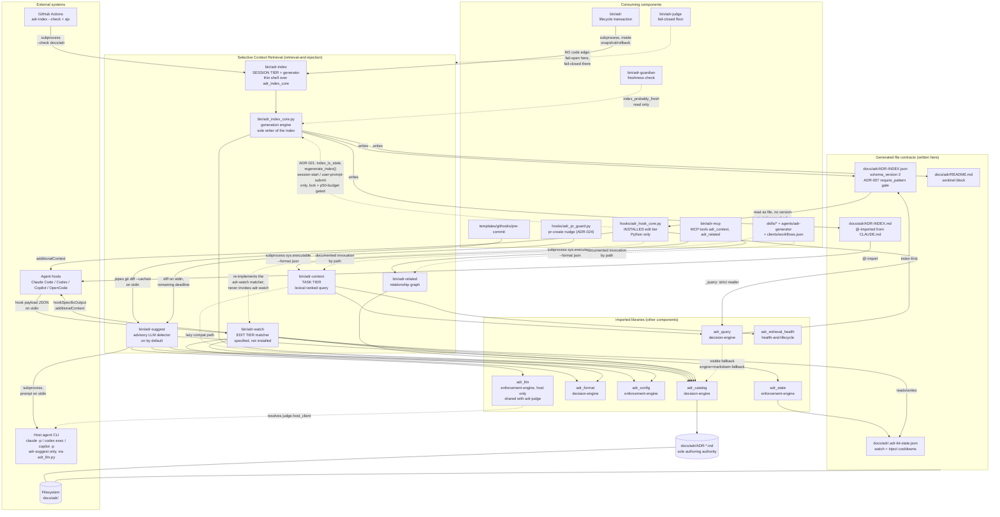

# Selective Context Retrieval

## Overview

- **Name**: Selective Context Retrieval (`retrieval-and-injection`)
- **Description**: Five extension-less Python CLIs plus one importable module that make
  recorded architecture decisions *findable* at the moment an agent needs them. One
  generator writes every derived index view; the other four CLIs read it.
  [`bin/adr-index`](../bin/adr-index), a thin shell over
  [`bin/adr_index_core.py`](../bin/adr_index_core.py), writes the compact `ADR-INDEX.md`
  session map, the ADR-007 node-and-edge `ADR-INDEX.json` graph, a legacy flat JSON list,
  and the sentinel-delimited block inside `docs/adr/README.md`.
  [`bin/adr-context`](../bin/adr-context) ranks ADRs against a free-text task query
  through that graph — lexical scoring over the generated index plus one-hop graph
  neighbours (ADR-036). [`bin/adr-related`](../bin/adr-related) answers
  inbound/outbound/dangling dependency questions for one ADR.
  [`bin/adr-watch`](../bin/adr-watch) implements the edit-tier matcher and injector that
  ADR-004 specifies. [`bin/adr-suggest`](../bin/adr-suggest) is the single LLM-backed
  member: an advisory detector, on by default, for whether a staged diff introduces a
  *new* decision that is not yet recorded.
- **Type**: CLI toolchain — five standalone command-line programs and one library module,
  no service, no daemon, no long-lived process. One generator (`adr-index` over
  `adr_index_core`) plus four consumers.
- **Technology**: Python 3 (3.10+ supported matrix), **standard library only** — verified:
  no third-party import in any of the six files, nor in `bin/adr_llm.py`, the backend
  registry `adr-suggest` loads. The five CLIs are **extension-less**
  (`#!/usr/bin/env python3`, no `.py`), so they are invoked as `python bin/<name>` and
  imported by tests through `importlib.machinery.SourceFileLoader`. 3,104 lines total,
  re-measured 2026-10-06 (`adr-context` 584, `adr-related` 401, `adr-index` 199,
  `adr-watch` 674, `adr-suggest` 803, `adr_index_core.py` 443). Communication with the rest
  of the system is by **JSON files on disk**, **subprocess invocation**, **stdin pipes**, and
  one in-process import of `adr_index_core` by the hook runtime and the guardian. No member
  reaches the network itself; `adr-suggest`'s only model path is a subprocess to the host
  agent CLI (see Dependencies).

## Purpose

This component owns the *retrieval* half of ADR-004's layered context model. ADR-004
(Accepted 2026-07-05) defines three fail-open injection tiers and one fail-closed
enforcement floor. All three fail-open tiers are named here by file:

| ADR-004 tier | Named implementation | What it delivers |
|---|---|---|
| **Session tier** | `bin/adr-index` → `docs/adr/ADR-INDEX.md`, `@`-imported from `CLAUDE.md` | One row per ADR (id, status, `path_glob` scope, one-line decision) present in every session from the first token |
| **Edit tier** | the `adr-watch` matcher — Enforcement `path_glob` strongest, keyword fallback | The single governing Accepted ADR's `## Decision` text, bounded to a token budget, injected before an `Edit`/`MultiEdit`/`Write` is applied |
| **Task tier** | `bin/adr-context` and the key-free MCP `adr_context` tool | A ranked pull-feed any agent or subagent can query mid-task |

The problem being solved is that an agent asked to change a file has no way to know which
of N recorded decisions constrain that file. Reading all of them is expensive and mostly
irrelevant; reading none of them produces drift the pre-commit judge then blocks. This
component narrows N to the few that matter, three different ways, at three different
moments — and it is **fail-open by construction** so that a retrieval failure degrades
into missing advice rather than a blocked developer. The fail-closed floor is
`bin/adr-judge`, which is deliberately **not** in this component.

The architectural shape is **generate once, query many**: the generation engine behind
`bin/adr-index` is the one writer of the derived artefacts, and `adr_query` (via
`adr-context`), `hooks/adr_hook_core.py` and `bin/adr-grill-signal` are pure readers.
Since ADR-021 that engine has a **second caller**: `hooks/adr_hook_core.py` invokes it
too, in-process, at exactly two events, to self-heal a stale index rather than let
retrieval go dark — see the new subsection below. Markdown ADRs remain the sole authoring
authority; the JSON graph is a *generated runtime projection* with a visible Markdown
fallback (ADR-014).

### The edit tier is specified here and installed elsewhere

This is the most important thing to know about the component and it is not a footnote.

ADR-004's Decision says the edit tier "reuses the existing adr-watch matcher (Enforcement
`path_glob` strongest, keyword fallback)". `bin/adr-watch` still implements exactly that,
including `--pre-edit` (PreToolUse injection) and `--hook` (PostToolUse nudge), the
`inject`/`watch` cooldown state, and the bounded `[adr-inject] ADR-NNN (title) governs
<path>` envelope. **But it is not the wired implementation.** Verified: nothing under
`hooks/` invokes `adr-watch`; the only mention is a docstring at
`hooks/adr_hook_core.py:413` recording that "no client's `hooks.json` invokes" it. The
shipped runtime declares `PreToolUse`/`PostToolUse` on `Edit|MultiEdit|Write` in
`hooks/hooks.json`, dispatches through `hooks/run-hook.cmd` to `hooks/adr-hook.py`, and
lands in `hooks/adr_hook_core.py`, which **re-implements the matcher itself**
(`_matching_path_records` at `hooks/adr_hook_core.py:653`, reading `ADR-INDEX.json`
directly via `load_index_records` at `:220`). Python is the only hook host: a native
binary that carried a third copy of the matcher was retired in 0.55.1 under ADR-029
("Retire the Native Hook Binary Rather Than Maintain a Second Retrieval Engine").

Meanwhile `templates/adr-kit-guide.md:304`, the `[0.31.0]` CHANGELOG entry that introduced
the edit-tier injector (`CHANGELOG.md:2549` at v0.59.1) and ADR-004 itself all still
describe `bin/adr-watch --pre-edit` / `--hook` as the wired edit tier. So the edit-tier
behaviour exists in two Python places, with only the newer one actually installed, and
the documentation points at the older one. This component owns the *specified* edit
tier; the Hook Integration Layer ([`agent-integration`](./c4-component-agent-integration.md))
owns the *installed* one.

### A stale index used to go dark silently; ADR-021 makes the hook layer self-heal it

An agent writing `docs/adr/ADR-NNN-something.md` directly with its Write tool — the
common path in a harness, and what `/adr-kit:adr` produces by design — leaves this
component's own generated index stale the instant the file lands, because this
component's writer (`bin/adr-index`) never ran. `hooks/adr_hook_core.py`'s `_query`
calls `adr_query.query_adr_context(..., strict_index=True)` — the same strict reader
`adr-context` also delegates to under ADR-014 — which raises
`IndexQueryError("generated ADR graph is stale")`. Before ADR-021, `_query` swallowed
that into `[]` and every subsequent task-tier and edit-tier injection in that session
went dark with zero signal: an empty result reads exactly like "no ADR was relevant."

**ADR-021** (Accepted 2026-08-04, frontmatter `components: [lifecycle hooks, adr-index]`)
fixes this at the two events whose declared budget can absorb a render:
`hooks/adr_hook_core.py::refresh_index` regenerates the index in-process at
`session-start` and `user-prompt-submit` (`REFRESHING_EVENTS`, `hooks/adr_hook_core.py:490`)
before querying. Every other event — `pre-tool-use`, `post-tool-use`, the plan-exit
branch, and everything else `refresh_index` sees — stays read-only per ADR-021's Must
Not clause and instead renders an actionable message: *"The generated ADR index is
stale, so ADR context is unavailable for this step. Run `bin/adr-index docs/adr` to
regenerate it."* The full mechanism — `refresh_index()`, `index_is_stale()`,
`_event_budget_ms()` — is documented in
[`c4-component-agent-integration.md`](./c4-component-agent-integration.md); it is not
duplicated here because the decision to write is taken in the Hook Integration Layer, a
sibling component, not in any of this component's five CLIs.

What the hook layer calls, though, **is this component's own engine**. The regeneration
goes through `bin/adr_index_core.py::regenerate_index`, and that module's own docstring
states why it exists: "`bin/adr-index` was both the renderer and the command... So the
rendering and comparison live here... and `bin/adr-index` is the thin argument-parsing
shell over it." The extraction landed 2026-08-02 (commit `c2e55f2`), shrinking
`bin/adr-index` from 418 to 199 lines, independently of ADR-021's own acceptance date —
it was done so a caller could ask "is the committed index still what the generator would
produce?" without spawning a subprocess, which is exactly the question ADR-021 needed
answered from inside a hook. The hook layer therefore reuses this component's generation
logic rather than duplicating it. It reaches the module differently from the CLIs: the
hook core puts `bin/` on `sys.path` (`hooks/adr_hook_core.py:27-29`) and does a
function-local `from adr_index_core import ...`, where the CLIs use the
`sys.modules`-cached `_load_sibling` loader. `bin/adr-guardian:476` is a third,
read-only caller: it loads `adr_index_core` through `_load_sibling` to check freshness
without a subprocess, and never regenerates.

The numbers, measured on this repository at 29 ADRs, 2026-08-05, and recorded next to
the code that uses them (`bin/adr_index_core.py:394-397`) rather than in ADR-021's own
body text, which predates this recalibration by a day: the freshness probe
`index_probably_fresh` — an mtime comparison, "deliberately NOT proof of freshness...
use it to avoid work, never to certify a result" — costs **~2.8 ms**; a full in-process
render costs **~84 ms median** (~4.7 ms/ADR); the same work through a subprocess costs
**~302 ms**, which is why regeneration happens in-process rather than by spawning
`bin/adr-index`.

Two guards keep the write bounded. Before writing, `refresh_index` compares
`projected_render_ms(adr_dir)` — a projection from the ADR count, deliberately not a
trial render — against the event's own **p50** budget, read live from
`hooks/manifest.json` by `_event_budget_ms()`: **400 ms** for `session-start`, **450 ms**
for `user-prompt-submit`, with a **400.0 ms** fallback if the manifest can't be parsed
(`hooks/adr_hook_core.py:579-598`). That is deliberately the p50 figure, not the event's
declared hard timeout (`hooks/manifest.json`'s `latency_budget_ms`, which equals
`latency.hard_timeout_ms` for all eight events: 1000 ms and 900 ms for these two) — a
projection that exceeds p50 renders the staleness message instead of writing. A single
advisory lock file (`.adr-index.lock`, opened `O_CREAT | O_EXCL`) serialises concurrent
regeneration; a session that cannot take the lock does not wait, it renders the
staleness message and continues, because waiting inside a hook budget would spend a
budget the loser cannot recover on a write another session is already doing.

This is the second-caller relationship named in Purpose above. The task-tier query the
hook runs at those two events is the same lexical ranking `adr-context` uses —
`hooks/adr_hook_core.py::_query` calls `adr_query.query_adr_context(..., strict_index=True)`
over the generated index, with no model in the path (ADR-036). This component's own
`adr-context` CLI does not self-heal: on a stale index it falls back to Markdown with a
visible warning instead. Self-healing belongs to the Hook Integration Layer's installed
task tier, built on top of this component's index-reader contract and generation engine.

### Governing ADRs (verified in `docs/adr/`)

| ADR | Status | How it binds this component — verified |
|---|---|---|
| **ADR-004** — Layered ADR Context Injection | Accepted 2026-07-05, `binding: false` | Names `bin/adr-index`, the `adr-watch` matcher and `bin/adr-context` by file in its Decision (read directly: Decision items 1–4). Mandates exit 0 on every path, pins scope = Enforcement `path_glob` and status = `## Status` reconciled with `status_history[-1]`, and caps injected content to the single top-ranked ADR's Decision within a token budget. |
| **ADR-007** — JSON ADR Graph Index for Agent Retrieval | Accepted 2026-07-23 | Enforcement scope is `docs/adr/ADR-INDEX.json` — **the artefact this component writes**, not its code. Two `require_pattern` rules on that file: `"schema_version"\s*:\s*2` and `"relationships"\s*:`. Items 5–7 assign generation to `adr-index`, enriched ranked results to `adr-context`, and shared relationship-extraction rules to `adr-related`. |
| **ADR-036** — Retire the Vector Layer and Run the Judge on the Host Model Only | Accepted 2026-08-09, `binding: true`, `gate: "adr-host-only-judge-v1"`; no `## Enforcement` block | Decision point 4 fixes retrieval as **lexical scoring over the generated index plus one-hop graph neighbours**, with no embedding model in the path — what `adr-context` delegates to `adr_query`. Decision point 3 leaves the host agent CLI as the only model backend, which is the only model `adr-suggest` can reach. Supersedes ADR-017 and ADR-020. |
| **ADR-014** — Use the Generated ADR Graph as the Selective-Context Query Engine | **Superseded** (chain ADR-014 → ADR-018 → ADR-020 → ADR-036), `binding: true`, `gate: index-first-retrieval` | Historical source of the index-first design this component still implements: the graph as the normal runtime projection with Markdown as *visible* fallback, and relevance separated from authority (Accepted governs, Proposed advises, Superseded redirects to a live successor). This is why `adr-context` delegates all scoring to `adr_query`. ADR-036 re-affirms its prohibition on embedding models in the retrieval path. |
| **ADR-021** — Let the Session-Scoped Hooks Regenerate a Stale ADR Index | Accepted 2026-08-04, `binding: true`, `gate: "adr-hook-index-refresh-v1"`, anchored in `tests/test_adr_hook_index_refresh.py` (the Verification section, `ADR-021:216-218`, agrees) | Frontmatter `components:` includes `adr-index` (verified). Fixes a defect in this component's own generated artefact: an agent writing `docs/adr/ADR-NNN.md` directly leaves `ADR-INDEX.json` stale, `adr_query.query_adr_context(strict_index=True)` raises, and every task-tier and edit-tier query goes dark with no message. See the subsection above and Software Features. |

**`adr-suggest` has no Accepted governing ADR for its default.** ADR-001 ("Make Per-Commit
LLM Gates Opt-In", which made it opt-in, `ADR-001:101`) is Superseded by ADR-017, itself
Superseded by ADR-036. The code now runs the pass by default and cites ADR-035 for it
(`bin/adr-suggest:681-701`, schema `suggest.enabled` default `true`), but ADR-035 ("Run
the Suggestion Pass by Default on the Same Terms as the Judge") is still **Proposed**, with
`documents_shipped: false`. Reported as observed: the shipped default runs ahead of its
decision record.

**ADR-015 does not govern this component** — its frontmatter `components:` are
`adr-lint`, `adr-retire`, `hooks`, `tests`, and its Enforcement `path_glob` is
`tests/fixtures/cli/latency-corpus.json`. Its fixture contract does reach these CLIs; see
Notable Finding 7.

**No Enforcement `path_glob` of an Accepted ADR covers any of the six files.** Verified
2026-10-06 by enumerating every `path_glob` in Accepted ADRs: the complete set is
`bin/adr-lint`, `bin/adr-mcp`, `{bin,codex/bin,copilot/bin}/adr-mcp`,
`clients/workflows.json`, `docs/adr/ADR-INDEX.json`, `schemas/adr-kit-config.schema.json`,
`schemas/client-capabilities.schema.json`, `templates/githooks/pre-commit`,
`tests/fixtures/cli/latency-corpus.json`, `tests/test_adr_mcp.py`,
`.github/workflows/release-publish.yml`. The pre-commit judge therefore guards this
component's *output* (via ADR-007's two `require_pattern` rules on `ADR-INDEX.json`) but
never its *source*. Edit-tier ADR injection also never fires on these files, because no
Accepted ADR claims them as scope — the component that narrows context for every other
file has no ADR narrowing context for itself.

## Software Features

### Session-tier index generation (`adr-index`)

- **Four derived views from one read pass.** `load_adr_records` reads each `ADR-*.md`
  exactly once, and all four renderers consume that shared record list: the compact
  Markdown map, the ADR-007 node-and-edge graph, a legacy flat JSON list, and the README
  block. No renderer re-parses Markdown.
- **Non-destructive README updating.** `update_readme` replaces only the text between
  `<!-- adr-kit-index:begin -->` and `<!-- adr-kit-index:end -->`; when the sentinels are
  absent it appends the block. Human prose either side is preserved byte-for-byte.
- **Freshness gate.** `build_readme_payload` computes desired content for all three
  artefacts, diffs each against disk, and detects duplicate ADR ids. `--check` reports
  staleness without writing (exit 1); CI consumes exactly the positional form
  `python bin/adr-index --check docs/adr`.
- **Two modes in one command, selected by flag shape** rather than subcommand:
  `-o`/`--adr-dir` force *context mode* (render to stdout or a file), a bare positional
  path or `--check`/`--readme` select *README mode* (write all three artefacts). See the
  precedence footgun below.
- **The generator is an importable engine, not just a script.** Since 2026-08-02
  (commit `c2e55f2`), all rendering, comparison and freshness logic lives in
  `bin/adr_index_core.py` (443 lines); `bin/adr-index` itself is 199 lines of argument
  parsing that imports it (`bin/adr-index:66-85`). This is what let ADR-021 give
  `hooks/adr_hook_core.py` a way to answer "is the index stale?" and regenerate it without
  spawning a subprocess — see the Purpose subsection above.
- **A size budget on the graph.** `tests/test_adr_index.py:581-582` bounds
  `ADR-INDEX.json` (LF-normalised) to 16 KiB plus 2.5 KiB per ADR — raised from 2 KiB per
  ADR in 0.55.0, when 41 records had left 4 bytes of headroom — and to at most 25% of the
  Markdown it projects. Superseded nodes carry an emptied Decision Contract to stay inside
  it.

### Task-tier relevance ranking (`adr-context`)

- **Index-first with a visible fallback.** Delegates entirely to
  `adr_query.query_adr_context`. On a healthy `ADR-INDEX.json` the engine reports
  `engine: "index-first"`; on a missing, stale, schema-unsupported or malformed graph it
  falls back to reading Markdown and emits a warning to **stderr** with
  `engine: "markdown-fallback"`. `--strict-index` turns the fallback into an error.
- **Relevance separated from authority.** Every result carries both a `score` (positive
  evidence only — no recency, no negative signals, no relationship count) and an
  `authority` of `governing` / `advisory` / `historical` derived from status.
  Superseded matches are not returned; their score is *redirected* to a live successor,
  which is flagged with `redirected_from`.
- **Structured filters, not just free text.** `--path`, `--symbol`, `--component`,
  `--topic`, `--status`, `--authority`, `--include-history` narrow the candidate set
  using the schema-v2 retrieval metadata on each node.
- **Explainability fields.** `signals` and `matches` explain *why* each ADR ranked where
  it did. They are query-specific and deliberately never persisted into the graph.
- **Lexical, with one-hop neighbours.** Ranking is `adr_query.score_record`'s
  field-weighted positive evidence over the index, followed by up to two one-hop
  `related` ADRs returned as `role: "supporting"` with `score: 0.0` (ADR-036). No
  embedding or model call is in the path.
- **Retrieval health probes.** `--check-probes` uses `adr_retrieval_health` (loaded at
  module scope since TASK-62, `bin/adr-context:61`) and validates `docs/adr/adr-context-probes.json` against the
  live graph (exit 1 on `fail` or `degraded`).

### Relationship-graph queries (`adr-related`)

- **Inbound, outbound, dangling in one answer.** `build_graph` returns
  `{adr, outbound, inbound, dangling}` for one target id.
- **Declared relationships outrank prose mentions.** Outbound edges exclude plain
  `ADR-NNN` mentions ("they carry no declared relationship"); inbound edges include them,
  so an ADR can discover that something merely talks about it. `kind` is one of
  `supersedes`, `superseded-by`, `amended-by`, `related`, `mention`.
- **Forgiving id normalisation.** `ADR-7`, `adr-007` and `7` all resolve to `ADR-007`.
- **Whole-token matching.** `_ADR_TOKEN_RE = \bADR-(\d{1,4})\b` — greedy digits are what
  stop `ADR-0430` matching as `ADR-043`.

### Edit-tier matching and injection (`adr-watch`)

- **Two-signal matcher with a hard precedence.** Any Enforcement `path_glob` match scores
  `1.0`; a keyword-only hit (directory names plus file stem, tokens ≥3 chars, hit
  fraction ≥ 0.5) is scaled by `0.8`, so a keyword hit can **never** outrank a declared
  scope. Results sort by `(-score, adr_id)`.
- **Accepted-only.** `load_adrs` keeps only `Accepted` ADRs, matching ADR-004's rule that
  only Accepted decisions are injected at edit time.
- **Bounded injection.** `run_inject` picks the *single* top-scored ADR for the first
  matching path and emits `[adr-inject] ADR-NNN (title) governs <path>. Honour its
  decision before editing:` plus the Decision text, truncated on the last paragraph or
  sentence boundary within `inject.max_tokens` (default 400) and suffixed `[…]`.
- **Per-ADR-per-path cooldown, transactionally stamped.** State lives under the `watch`
  and `inject` keys of `docs/adr/.adr-kit-state.json`, keyed `ADR-NNN|<relpath>`, written
  through `adr_state`'s locked (`fcntl`/`msvcrt`) atomic `os.replace` transaction so the
  same ADR is not re-injected within the window.
- **Structurally guaranteed exit 0.** A bottom-level `except Exception: sys.exit(0)` at
  `bin/adr-watch:672-674` (moved from `:641-643` as the file grew from 643 to 674 lines)
  makes ADR-004's fail-open mandate a property of the code rather than a convention.

### Advisory new-decision detection (`adr-suggest`)

- **On by default, with two switches.** Runs unless `ADR_KIT_SUGGEST_DISABLE=1` (wins
  over everything) or `suggest.enabled: false` in `.adr-kit.json`; `ADR_KIT_SUGGEST=1`
  re-enables it per run for a project that set `false` (`bin/adr-suggest:681-701`). The
  script reads the disable variable itself, so the switch works at the pull-request guard
  as well as in the pre-commit wrapper. See the governing-ADR note on ADR-035 above.
- **Cheap pre-filters before any model call.** `SKIP_GLOBS` drops diffs touching only
  docs, Markdown and lockfiles — those cannot carry a decision — so no LLM round-trip
  happens at all.
- **Duplicate suppression by construction.** `build_adr_list` puts one
  `- ADR-NNN — Title — <decision ≤160 chars>` line per existing ADR into the prompt so
  the model cannot propose a decision that is already recorded.
- **Content-derived prompt-injection fences.** `_data_fence_token` derives the sentinel
  from 16 hex chars of SHA-256 over the fenced content, so an attacker embedding a guessed
  END marker changes the content and therefore the token. Deterministic, so tests can
  assert on the constructed prompt.
- **Model selection goes through a shared registry, not a local constant.**
  `bin/adr-suggest` resolves its backend from the same registry `bin/adr-judge` uses
  (`bin/adr_llm.py`), with precedence `--llm-cmd` > `ADR_KIT_LLM_CMD` env >
  `judge.backend`. The registry holds one backend, `host`: the agent CLI the installer
  recorded as `judge.host_client` (`claude -p`, `codex exec`, `copilot -p`), with no
  model flag (ADR-036). There is deliberately no `suggest.backend`: which model the
  project talks to is a `judge`-level property. Repo-tracked `suggest.llm_cmd` /
  `judge.llm_cmd` / `*.llm_model` are refused by name at config validation — honouring
  them would let committed repo content choose which binary this script executes. The
  script's own comment explains why the split sits where it does: "Anything that decides
  WHICH MODEL IS CALLED is the exception — that now lives in the shared
  bin/adr_llm.py, because a copy of it drifted (TASK-72) and drift in that particular
  code is a security property going quiet" (`bin/adr-suggest:151-158`).
- **Every failure is advisory.** An unresolved or unavailable backend, timeout, non-zero
  exit or unparseable output all return `None` and exit 0. Exit 2 is reserved for genuine
  usage errors.

## Code Elements

| Code-level document | Role in this component |
|---|---|
| `c4-code-bin-cli-retrieval.md` | The five CLIs — `adr-index` (generator shell), `adr-context` (task tier), `adr-related` (graph queries), `adr-watch` (edit tier), `adr-suggest` (LLM advisory). The code-level documents were retired under TASK-149; the name is kept as the cluster label. |
| [`bin/adr_index_core.py`](../bin/adr_index_core.py) | The generation engine: renderers, README block update, `build_readme_payload`, `stale_index_artifacts`, `index_probably_fresh`, `projected_render_ms`, `regenerate_index`. Not claimed by any code-level document; placed here by `c4-component.md`'s census because `bin/adr-index` is its shell and its other two callers (hook runtime, guardian) reach it only for this component's artefacts. |

This component contains six files. The shared modules it leans on (`adr_query.py`,
`adr_catalog.py`, `adr_format.py`, `adr_config.py`, `adr_state.py`,
`adr_retrieval_health.py`, and — `adr-suggest` only — `adr_llm.py`) are **not**
contained here — they are reached through each script's own `_load_sibling` helper,
which loads `bin/<name>.py` by explicit `SourceFileLoader` path and caches it in
`sys.modules` under its bare name. All five CLIs and `adr_index_core.py` carry this
helper as of **SEC-HIGH TASK-62**, which replaced an older `sys.path.insert(0, _BIN_DIR)`
pattern: that pattern put the `bin/` directory ahead of the standard library for every
import, so a module merely committed next to one of these scripts would execute as code,
undoing the isolation CPython's `-P` / `PYTHONSAFEPATH` provide. None of the six inserts
into `sys.path`. This is a dependency edge, documented under Dependencies, not a
containment edge. Keeping the distinction is what makes the component boundary
meaningful: the CLIs here are argument parsing, output rendering, exit-code policy and
cooldown state, `adr_index_core.py` is index generation and freshness; the meaning of an
ADR lives in the semantic core.

## Interfaces

### 1. `adr-context` — task-tier query CLI

**Protocol**: CLI, JSON on stdout.

```
python bin/adr-context [--limit N] [--format json|text] [--adr-dir DIR] [--min-score F]
                       [--config PATH] [--strict-index] [--include-history]
                       [--status S]... [--authority A]... [--path P]... [--symbol S]...
                       [--component C]... [--topic T]... [--check-probes]
                       [--probes-file PATH] [query]
```

`--status` ∈ {Accepted, Amended, Deprecated, Proposed, Rejected, Superseded, Unknown};
`--authority` ∈ {governing, advisory, historical}.

**Exit codes**: 0 on success · 2 on `IndexQueryError`/`ValueError` (message on stderr,
prefixed `[adr-context] ERROR:`) · 1 when `--check-probes` reports `fail` or `degraded`.
A missing ADR directory prints `[]` in JSON mode, nothing in text mode, and exits 0.
Warnings go to stderr; results to stdout.

**Result object contract** (25 keys, built by `adr_query._public_result`):

```
adr_id, title, path, status, is_accepted, authority, role, format,
decision_summary, scope, related_ids, metadata, topics, aliases,
components, symbols, context_scope, decision_contract,
score, signals, matches, source, engine, schema_version, redirected_from
```

**Reachability caveat**: the CLI that actually runs is the terse `_index_first_cli`
parser at `bin/adr-context:72` (moved from `:39` as the file grew to 584 lines).
Re-verified 2026-10-06 by running `python bin/adr-context --help`.

### 2. `adr-related` — relationship-graph CLI

**Protocol**: CLI, JSON or human text on stdout.

```
python bin/adr-related <ADR-NNN|adr-7|7> [--adr-dir DIR] [--format human|json]
```

**Exit codes**: 0 on success · 2 on an invalid id, a missing directory, or an id absent
from the set.

**JSON shape**:
`{"adr": {adr_id, title, status, path}, "outbound": [{adr_id, kind, exists, title, status, path}], "inbound": [{adr_id, kind, title, status, path}], "dangling": [adr_id]}`
with `kind` ∈ {supersedes, superseded-by, amended-by, related, mention}.

### 3. `adr-index` — index generator CLI

**Protocol**: CLI; writes files.

```
Context mode:  python bin/adr-index [--adr-dir DIR] [--format md|json|graph] [-o PATH]
README mode:   python bin/adr-index <adr_dir> [--check] [--readme PATH] [--format text|json]
```

**Exit codes**: context mode returns 0 always (including on write failure) and 2 on an
unsupported `--format`. README mode returns 0 on a successful write, 1 on duplicate ADR
ids or (`--check`) when any of README / `ADR-INDEX.md` / `ADR-INDEX.json` is stale, and 2
on an unsupported `--format`.

**README-mode JSON**:
`{adr_dir, readme, context_markdown, context_json, summary: {total, duplicates, changed, readme_changed, context_markdown_changed, context_json_changed}, issues, records}`

### 4. `adr-watch` — edit-tier hook CLI

**Protocol**: CLI, plus a **stdin JSON hook payload / stdout JSON envelope** contract.

```
python bin/adr-watch <path> [<path> ...]     # plain CLI: one nudge line per stdout line
python bin/adr-watch --hook                  # PostToolUse: payload JSON on stdin
python bin/adr-watch --pre-edit              # PreToolUse edit-tier injection (ADR-004)
```

**Always exits 0.** Hook modes read
`{"tool_name": ..., "tool_input": {"file_path"|"notebook_path"|"path": ...}}` from stdin.
Output envelope: when `CLAUDE_PLUGIN_ROOT` is set and `COPILOT_CLI` is not,
`{"suppressOutput": true, "hookSpecificOutput": {"hookEventName": "PostToolUse"|"PreToolUse", "additionalContext": <text>}}`;
otherwise plain text.

### 5. `adr-suggest` — advisory detector CLI (stdin diff → stderr advisory)

**Protocol**: CLI; **unified diff piped on stdin**; advisory on stderr, JSON on stdout.

```
git diff --cached --unified=0 | python bin/adr-suggest [--diff -|PATH] [--intent-file PATH]
    [--adr-dir DIR] [--config PATH] [--llm-cmd CMD] [--llm-timeout S] [--json] [--repo-root PATH]
```

**Exit codes**: 0 on every advisory outcome (disabled, docs-only diff, LLM unavailable,
unparseable response, no decision, decision detected) · 2 only on a bad
`--diff`/`--intent-file` path, config validation failure, or `KeyboardInterrupt`.

**`--json` contract on stdout**:

```json
{"needs_adr": false, "confidence": "low|medium|high",
 "reason": "<=200 chars", "suggested_title": "<=80 chars",
 "category": "architecture|api-contract|dependency|security|data-model|none",
 "skipped": true}
```

`skipped` appears only on the three skip paths. The prompt is built by
`build_suggest_prompt` (`bin/adr-suggest:387`); the response contract is enforced by
`parse_suggest_response`.

### 6. Generated file contracts this component **writes**

**Protocol**: JSON / Markdown files on disk. These are the component's real published
interface — every downstream reader consumes a file, not a function call.

| Artefact | Contract | Readers |
|---|---|---|
| [`docs/adr/ADR-INDEX.json`](../docs/adr/ADR-INDEX.json) | `{$schema, schema_version: 2, adrs[], relationships[]}`, formally specified by [`schemas/adr-index.schema.json`](../schemas/adr-index.schema.json). Node keys include `id/title/path/format/status/date/decision_summary/topics/aliases/components/symbols/context_scope/decision_contract/scope/metadata`; edge keys `source/target/type/resolved` with `type` ∈ {related, supersedes, superseded-by, amended-by}. **Freshness is part of the contract**: a graph older than any `ADR-*.md` is rejected by the strict reader. Validated with `ajv` in `validate.yml:49`, mechanically pinned by ADR-007's two `require_pattern` rules, and size-bounded by `tests/test_adr_index.py:581-582`. | `adr_query.load_index_graph` (strict), `hooks/adr_hook_core.py:220-222` (lenient), `bin/adr-grill-signal:107-109` (lenient), `bin/adr-guardian:476` via `adr_index_core` (freshness only) |
| [`docs/adr/ADR-INDEX.md`](../docs/adr/ADR-INDEX.md) | Compact one-row-per-ADR table (ADR, Status, Scope, Decision) behind a generated-file banner. `@`-imported from `CLAUDE.md`, so it is in every session's context. | The agent's session context; humans |
| [`docs/adr/README.md`](../docs/adr/README.md) | Status-count summary plus per-decision table with supersession notes, confined between `<!-- adr-kit-index:begin -->` / `<!-- adr-kit-index:end -->`. | Humans; `instructions/adr.review.md` points reviewers here |
| `docs/adr/.adr-kit-state.json` (`watch` / `inject` keys) | Gitignored, per-machine cooldown ledger keyed `ADR-NNN\|<relpath>`. Written through `adr_state`'s locked atomic transaction. | `adr-watch` only |

### 7. Inbound invocation mechanisms

Named concretely, because "uses" is not an interface description:

| Caller | Mechanism |
|---|---|
| [`bin/adr-mcp`](../bin/adr-mcp) | **Subprocess** via `sys.executable` (the generic `run_cli` wrapper, `cmd = [sys.executable, str(BIN_DIR / script)] + args` at `bin/adr-mcp:400`) to `adr-context --format json --adr-dir …` (args built in `tool_adr_context` at `bin/adr-mcp:490`) and to `adr-related --format json --adr-dir … <id>` (`tool_adr_related`, `:752-763`), re-exposed as two of the server's seven MCP tools, `adr_context` and `adr_related`, over newline-delimited JSON-RPC 2.0 on stdio. It validates `min_score` ∈ [0,1] before passing it through. `adr-suggest` is **deliberately not exposed** (`bin/adr-mcp:47-49`) — the MCP surface is key-free by construction. |
| [`bin/adr`](../bin/adr) | **Subprocess** to `adr-index` inside its snapshot/rollback lifecycle transaction. `_commit_lifecycle_changes` (`bin/adr:489-518`) snapshots first (`:494`), runs `adr-index` via `run_index`'s own `subprocess.run` (`:478-485`), and restores the snapshot on any exception (`:507`). The snapshot covers `ADR-INDEX.md`, `ADR-INDEX.json` and `README.md`, so a failed index regeneration rolls the whole transition back. |
| [`templates/githooks/pre-commit`](../templates/githooks/pre-commit) | **Pipes `git diff --cached` on stdin** into `adr-suggest --diff - --llm-timeout <bound>` (`:343`), swallowing the status (`\|\| true`) so the advisory can never block a commit, and skipping the call when `ADR_KIT_SUGGEST_DISABLE=1` (`:337`). |
| [`hooks/adr_pr_guard.py`](../hooks/adr_pr_guard.py) | **Subprocess** to `adr-suggest --diff - --adr-dir … --llm-timeout <remaining>` with the diff on stdin (`hooks/adr_pr_guard.py:208-220`, ADR-024) — the `pr-create` guard's advisory nudge, bounded by what is left of the event's deadline. |
| [`hooks/adr_hook_core.py`](../hooks/adr_hook_core.py) | **Reads `docs/adr/ADR-INDEX.json` as a file** for the edit tier, at *looser* strictness than `adr_query.load_index_graph`: no schema-version check, no staleness check, a 2 MiB cap, `[]` on any problem. **Imports `adr_index_core`** for the ADR-021 refresh (see Purpose). Its task-tier `_query` goes through `adr_query`'s strict reader. |
| [`bin/adr-guardian`](../bin/adr-guardian) | **Python import** of `adr_index_core` via `_load_sibling` (`:476`) for an mtime freshness check; reads only. |
| GitHub Actions | **Subprocess** `python bin/adr-index --check docs/adr` as a freshness gate (`adr-index-check.yml:24`, `release-candidate.yml:50`, `release-publish.yml:140`, `validate.yml:155`, `publish-opencode-npm.yml:118`). |
| `skills/{adr,context,guardian,init,install-hooks,judge,related,review,supersede}`, `agents/adr-generator.md`, `clients/workflows.json:159` (`adr-related` invocation inside the `"related"` workflow block) | **Documented subprocess invocation by path** in agent-facing prose. |

## Dependencies

### Components used

Each dependency is identified by the code-cluster name it had in the Code phase. Those
code-level documents were retired under TASK-149, so the names are labels, not links; the
owning component documents are listed in [`c4-component.md`](./c4-component.md).

| Dependency | Document | Mechanism and what is used |
|---|---|---|
| **Semantic core layer** (`decision-engine`) | `c4-code-bin-lib-semantic-core.md` | **Python import** via `_load_sibling`'s cached `SourceFileLoader` (no `sys.path` mutation — see Code Elements). `adr_query` → `query_adr_context`, `score_record`, `IndexQueryError`, `SUPPORTED_STATUSES`, `SUPPORTED_AUTHORITIES` (used by `adr-context`). `adr_catalog` → `load_adr_record(s)`, `discover_adr_files`, `enforcement_globs`, `adr_status`, `adr_id_from_filename`, `build_graph_document` (used by all five). `adr_format` → `section_text` for format-aware Decision extraction across MADR/Nygard/canonical (`adr-watch`, `adr-suggest`). `adr_index_core` is a member of this component, not of the semantic core (see Code Elements); it loads `adr_format`, `adr_schema` and `adr_catalog` the same way. |
| **Runtime safety layer** (`enforcement-engine`) | `c4-code-bin-lib-runtime.md` | **Python import**. `adr_config.load_json_config` (fail-open, `adr-watch`) and `adr_config.load_validated_config` + `ConfigValidationError` (fail-closed, `adr-suggest` — the only member that schema-validates `.adr-kit.json`). `adr_state.find_project_adr_dir`, `load_state`, `update_state` for `adr-watch`'s locked atomic cooldown transactions. |
| **Readiness / grilling layer** (`health-and-lifecycle`) | `c4-code-bin-lib-readiness-grill.md` | **Python import.** `adr_retrieval_health` is loaded at module scope by `_load_sibling` (`bin/adr-context:61`, since TASK-62); `run_retrieval_health` and `render_retrieval_health` are bound function-locally (`:139`, `:520`) and used only by `adr-context --check-probes`. That module in turn reads the same `ADR-INDEX.json` this component writes. |
| **Hook Integration Layer** (`agent-integration`) | `c4-code-hooks.md` | **JSON file on disk for querying; a Python call for regenerating, since ADR-021.** The hook runtime reads `ADR-INDEX.json` directly (unchanged). It is no longer purely one-way: `hooks/adr_hook_core.py::refresh_index` calls `index_probably_fresh`, `projected_render_ms` and `regenerate_index` from `bin/adr_index_core.py` — the engine `bin/adr-index` (this component) wraps — to self-heal a stale index in-process at `session-start`/`user-prompt-submit`. This is also where the *installed* edit tier lives, duplicating `adr-watch`'s matcher, and where `hooks/adr_pr_guard.py` calls `adr-suggest` as a subprocess at `pr-create` (ADR-024). |
| **MCP server** (`agent-integration`) | `c4-code-bin-cli-mcp.md` | **Subprocess, inbound.** `bin/adr-mcp` has zero import-level coupling to any `adr_*.py` module; it shells out with `sys.executable` and re-exposes `adr-context` and `adr-related` as the MCP tools `adr_context` and `adr_related` (two of seven). |
| **Lifecycle CLIs** (`health-and-lifecycle`) | `c4-code-bin-cli-lifecycle.md` | **Subprocess and import, inbound.** `bin/adr` invokes `adr-index` inside every lifecycle transaction; `bin/adr-guardian:476` imports `adr_index_core` for a read-only freshness check; `bin/adr-status` and `bin/adr-guardian` consume retrieval health. |
| **Enforcement floor** (`enforcement-engine`) | `c4-code-bin-cli-enforcement.md` | **Mostly no code edge, plus one shared import since ADR-017.** `bin/adr-judge` is the one fail-closed mechanism (ADR-004 item 2); everything in this component fails open. `adr-suggest` still keeps its own copies of `glob_to_regex`, `parse_diff` and `_fence`, "kept self-contained on purpose" (`bin/adr-suggest:151-158`) — three small pure diff/glob-parsing functions the script deliberately does not import rather than adding an import for. `_split_cmd` is gone from `adr-suggest`; it existed to parse a local `llm_cmd` string, which stopped being this script's job. What **is** a real import edge: `adr-suggest` resolves its LLM backend through `bin/adr_llm.py`, the same host-only registry `adr-judge` uses (ADR-017/TASK-72, reduced to `host` by ADR-036) — the one piece the two scripts used to keep in sync by copying, and stopped, because "drift in that particular code is a security property going quiet" (`bin/adr-suggest:157-158`). |
| **Agent-facing surface** (`agent-integration`) | `c4-code-agent-surface.md` | **Documented invocation by path** in skill and prompt prose. `skills/{adr,context,guardian,init,install-hooks,judge,related,review,supersede}` and `agents/adr-generator.md` all name these CLIs. |
| **Schemas and templates** (`contracts-and-distribution`) | `c4-code-schemas-templates.md` | **JSON Schema documents on disk.** `schemas/adr-index.schema.json` (pins `schema_version` const 2), `schemas/adr-context-probes.schema.json`, `schemas/adr-kit-config.schema.json`. Note that `ADR-INDEX.json` self-declares `"$schema": "../../schemas/adr-index.schema.json"`, so the schema directory must ship alongside the ADR directory. |
| **Generated client distributions** (`contracts-and-distribution`) | `c4-code-generated-distributions.md` | **Byte-level file copy.** All six files are copied verbatim (CRLF→LF normalised) into `codex/bin/` and `copilot/bin/` by `scripts/build-client-adapters.py`. `bin/` is the source of truth; a mirror must never be edited directly. |

### External systems

- **Filesystem** — the only universal dependency. Reads `docs/adr/ADR-*.md`; writes
  `ADR-INDEX.md`, `ADR-INDEX.json`, the `README.md` sentinel block and
  `.adr-kit-state.json`. `adr-watch` additionally uses **advisory file locking**
  (`fcntl.flock` on POSIX, `msvcrt.locking` on Windows) plus atomic `os.replace` through
  `adr_state`.
- **The host agent CLI, `adr-suggest` only, resolved through `bin/adr_llm.py`** — the
  CLI the installer recorded as `judge.host_client` (`claude -p`, `codex exec`,
  `copilot -p`), run as a subprocess with the prompt on stdin and no model flag, unless an
  operator overrides it with `--llm-cmd` or `ADR_KIT_LLM_CMD`. With no recorded client and
  no override there is no backend, and the pass is skipped with exit 0. Timeout
  precedence: `--llm-timeout` > `suggest.llm_timeout_seconds` >
  `judge.llm_timeout_seconds` > `DEFAULT_LLM_TIMEOUT_S` — **30 s** (`bin/adr-suggest:112`,
  `resolve_llm_timeout` at `:571`). The schema default and the `--llm-timeout` help text
  both say 120; the constant the code returns is 30. `bin/adr-judge`'s own default is a
  separate constant of the same name at **120 s** (`bin/adr-judge:130`) — the two scripts
  do not share a timeout default even though they share the backend registry that
  resolves everything else about the call.
- **`git`** — *not invoked by this component.* The pre-commit hook produces the diff and
  pipes it in; no script here calls `git`.
- **Claude Code / Codex / Copilot CLI hosts** — consume the `hookSpecificOutput` envelope
  from `adr-watch`'s hook modes and the `@`-imported `ADR-INDEX.md`. OpenCode consumes
  the same retrieval engine through `opencode/plugin.ts`, which stores prompt context
  for its system-transform and compaction callbacks rather than using this component's
  certified hook envelope.
- **GitHub Actions** — runs `adr-index --check` as a freshness gate and `ajv` validation
  of `ADR-INDEX.json` against its schema.
- **Environment variables read**: `CLAUDE_PROJECT_DIR`, `CLAUDE_PLUGIN_ROOT`, `COPILOT_CLI`
  (`adr-watch`); `ADR_KIT_LLM_CMD`, `ADR_KIT_SUGGEST`, `ADR_KIT_SUGGEST_DISABLE`
  (`adr-suggest`, `:699-700`; the pre-commit wrapper also checks the disable variable
  before calling it).
- **No network.** No file in this component opens a socket or imports an HTTP client.
  `adr-suggest`'s model call is a subprocess to the host agent CLI, which does its own
  networking under the host's credentials; this component holds none. No database.

## Component Diagram


```mermaid
flowchart TB
    subgraph ext["External systems"]
        hostcli["Host agent CLI<br/>claude -p / codex exec / copilot -p<br/>adr-suggest only, via adr_llm.py"]
        hosts["Agent hosts<br/>Claude Code / Codex / Copilot / OpenCode"]
        gha["GitHub Actions<br/>adr-index --check + ajv"]
        fs[("Filesystem<br/>docs/adr/")]
    end

    subgraph comp["Selective Context Retrieval (retrieval-and-injection)"]
        index["bin/adr-index<br/>SESSION TIER + generator<br/>thin shell over adr_index_core"]
        idxcore["bin/adr_index_core.py<br/>generation engine<br/>sole writer of the index"]
        context["bin/adr-context<br/>TASK TIER<br/>lexical ranked query"]
        related["bin/adr-related<br/>relationship graph"]
        watch["bin/adr-watch<br/>EDIT TIER matcher<br/>specified, not installed"]
        suggest["bin/adr-suggest<br/>advisory LLM detector<br/>on by default"]
    end

    subgraph artefacts["Generated file contracts (written here)"]
        graphjson["docs/adr/ADR-INDEX.json<br/>schema_version 2<br/>ADR-007 require_pattern gate"]
        cmap["docs/adr/ADR-INDEX.md<br/>@-imported from CLAUDE.md"]
        readme["docs/adr/README.md<br/>sentinel block"]
        statef["docs/adr/.adr-kit-state.json<br/>watch + inject cooldowns"]
    end

    subgraph libs["Imported libraries (other components)"]
        query["adr_query<br/>decision-engine"]
        catalog["adr_catalog<br/>decision-engine"]
        fmt["adr_format<br/>decision-engine"]
        conf["adr_config<br/>enforcement-engine"]
        state["adr_state<br/>enforcement-engine"]
        health["adr_retrieval_health<br/>health-and-lifecycle"]
        llm["adr_llm<br/>enforcement-engine, host only<br/>shared with adr-judge"]
    end

    subgraph consumers["Consuming components"]
        mcp["bin/adr-mcp<br/>MCP tools adr_context, adr_related"]
        lifecycle["bin/adr<br/>lifecycle transaction"]
        guardian["bin/adr-guardian<br/>freshness check"]
        precommit["templates/githooks/pre-commit"]
        prguard["hooks/adr_pr_guard.py<br/>pr-create nudge (ADR-024)"]
        hookcore["hooks/adr_hook_core.py<br/>INSTALLED edit tier<br/>Python only"]
        skills["skills/* + agents/adr-generator<br/>+ clients/workflows.json"]
        judge["bin/adr-judge<br/>fail-closed floor"]
    end

    mds[("docs/adr/ADR-*.md<br/>sole authoring authority")]

    mcp -->|"subprocess sys.executable<br/>--format json"| context
    mcp -->|"subprocess sys.executable<br/>--format json"| related
    lifecycle -->|"subprocess, inside<br/>snapshot/rollback"| index
    precommit -->|"pipes git diff --cached<br/>on stdin"| suggest
    prguard -->|"diff on stdin,<br/>remaining deadline"| suggest
    gha -->|"subprocess<br/>--check docs/adr"| index
    skills -.->|"documented invocation<br/>by path"| context
    skills -.->|"documented invocation<br/>by path"| related
    hosts -->|"hook payload JSON<br/>on stdin"| watch

    context --> query
    context --> health
    context -.->|"lazy compat path"| catalog
    index --> idxcore
    idxcore --> catalog
    related --> catalog
    watch --> catalog
    watch --> fmt
    watch --> conf
    watch --> state
    suggest --> catalog
    suggest --> fmt
    suggest --> conf
    suggest --> llm

    catalog --> mds
    query -->|"index-first"| graphjson
    query -.->|"visible fallback<br/>engine=markdown-fallback"| catalog
    state --> statef

    idxcore -->|"writes"| graphjson
    idxcore -->|"writes"| cmap
    idxcore -->|"writes"| readme
    watch -->|"reads/writes"| statef

    hookcore -.->|"ADR-021: index_is_stale,<br/>regenerate_index()<br/>session-start / user-prompt-submit<br/>only, lock + p50-budget gated"| idxcore
    guardian -.->|"index_probably_fresh<br/>read only"| idxcore
    hookcore -->|"_query: strict reader"| query

    cmap -->|"@-import"| hosts
    graphjson -->|"read as file, no version<br/>or staleness check"| hookcore
    watch -->|"hookSpecificOutput<br/>additionalContext"| hosts
    hookcore -->|"additionalContext"| hosts
    suggest -->|"subprocess,<br/>prompt on stdin"| hostcli
    llm -.->|"resolves judge.host_client"| hostcli

    artefacts --- fs
    mds --- fs

    judge -.->|"NO code edge:<br/>fail-open here,<br/>fail-closed there"| comp
    hookcore -.->|"re-implements the<br/>adr-watch matcher;<br/>never invokes adr-watch"| watch
```

Four structural points the diagram encodes:

1. **`adr_index_core`'s generation engine is the one writer**; everything else in the
   diagram not labelled ADR-021 is a reader of the files it produces. That is the ADR-007 /
   ADR-014 "generate once, query many" shape, and it is why a stale index used to degrade
   *every* downstream tier at once — before ADR-021 gave the engine a second caller.
2. **The dashed edges into `idxcore` are the exception, and they are narrow.**
   `hooks/adr_hook_core.py` calls `adr_index_core` directly — not through
   `bin/adr-index` — at exactly two events, behind a lock and a p50-budget check
   (ADR-021). This is the only place in the diagram where a component outside this one
   *triggers* a write of an artefact this component owns; the bytes are still produced by
   this component's engine. `bin/adr-guardian` also imports the engine, but only to read
   freshness.
3. **The dashed edge from `hooks/adr_hook_core.py` to `adr-watch` is a documented
   relationship with no code path behind it.** Verified: nothing in `hooks/` invokes
   `adr-watch`; its one mention is a docstring (`hooks/adr_hook_core.py:413`).
4. **The dashed edge from `bin/adr-judge` is deliberately empty too.** There is no call
   in either direction. ADR-004 item 2 puts the only blocking mechanism outside this
   component; every path inside it exits 0.

## Notable Findings Carried Forward

These are carried from the Code phase because they change how a maintainer should read
this component. None is sanitized.

1. **`bin/adr-context` ships a dead documented CLI.** The first
   `if __name__ == "__main__":` at `bin/adr-context:199` (was `:166`; the file has grown
   from 551 to 584 lines) raises `SystemExit`, so everything after it never executes as a
   script. `main()` at `:470` (was `:437`) — the one with full `argparse` help text — is
   unreachable from the command line. Re-verified 2026-10-06 by running `python
   bin/adr-context --help`, which still prints the terse `_index_first_cli` parser (now
   at `bin/adr-context:72`, was `:39`). The pattern is **deliberate** (comment preserved
   near the top of the import-only half): it keeps regex compilation and the
   `adr_catalog` import off the CLI hot path while leaving the compatibility surface
   available to in-process importers like `tests/test_adr_context.py`. Do not "tidy" it —
   the second half of the file is live API for tests and would change the cold-start cost
   if promoted.
2. **Stale scoring documentation in two places, one of them unfixable.** The
   `adr-context` docstring still claims "heuristic scoring with 5 weighted signals"
   (`bin/adr-context:4`, unchanged), and ADR-004's References line points at "five
   weighted signals, weights at `bin/adr-context:249`" (`ADR-004:212`, re-anchored from a
   stale `:191`). Neither holds:
   `score_adr` (now at `:376`, was `:343-350`) states that status, age, domain and
   relationship count no longer contribute, and scoring is `adr_query.score_record`
   field-weighted positive evidence over eight fields (ADR-014). ADR-004 is Accepted and
   therefore immutable by policy, so only the docstring can be corrected.
3. **`adr-index -o` reports success when the write fails.** `_run_context_mode`
   (`bin/adr-index:110-115`) catches `OSError` around `Path(args.output).write_text(...)`,
   prints to stderr, and `return 0`. This logic stayed in `bin/adr-index` itself through
   the 2026-08-02 extraction described above — only the renderers it calls moved into
   `bin/adr_index_core.py` — so the code moved within the same 199-line file; the
   pre-2026-08-02 doc had it around line 330 of the then-418-line file. Deliberate
   fail-open per ADR-004, but a CI step using `-o` cannot detect a failed write from the
   exit code.
4. **`adr-index` flag precedence silently swallows `--check`.** `_should_use_context_mode`
   (`bin/adr-index:88-93`) tests `--output`/`--adr-dir` *before* `--check`. Same file, same
   2026-08-02 renumbering (it sat around line 308 of the pre-split 418-line file).
   Re-verified 2026-10-06:
   `python bin/adr-index --adr-dir docs/adr --check` prints the Markdown index to stdout
   and exits 0 — `--check` is ignored, so a freshness gate written that way always
   passes. Repository CI is unaffected because it uses the positional form.
5. **The edit tier exists in two implementations, one installed.** See *Purpose* above.
   `bin/adr-watch` (specified by ADR-004, not wired) and `hooks/adr_hook_core.py:653`
   (wired). Both are Python; there is no parity test between them, because only one runs.
6. **`adr-watch`'s docstring target and the hook budgets measure different things, and
   both numbers changed.** The docstring still targets "<100ms for 50 ADRs"
   (`bin/adr-watch:26-28`, confirmed unchanged) — that is the in-process matcher's own
   algorithmic budget, excluding interpreter startup. It is not comparable to, and was
   never measuring the same thing as, the end-to-end hook budgets in
   `hooks/manifest.json`'s `latency_budget_ms` (equal to `latency.hard_timeout_ms` for
   every event): `pre-tool-use` 1100 ms, `post-tool-use` 1500 ms, `session-start` 1000 ms,
   `user-prompt-submit` 900 ms, `plan-exit` 1800 ms, `subagent-start` 1600 ms,
   `pre-compact` 2000 ms, and `pr-create` 5000 ms — the one event whose budget exceeds
   ADR-015's 2000 ms deterministic ceiling, named as a deliberate, verified exception in
   ADR-031. These are the numbers ADR-030 (Accepted 2026-08-05) recalibrated to the
   Python host; the *old* budgets (p50 25 ms / p95 50 ms / hard 100 ms) were sized for
   a hook host that no longer ships, and are no longer in
   `tests/fixtures/hooks/reference-corpus.json` at all — that fixture now reads
   `"budget_source": "hooks/manifest.json"` and carries only the interpreter-floor
   evidence and the recalibration record, not per-event numbers of its own. Three events
   had declared a 100 ms hard timeout against a measured interpreter floor of **182.6 ms**
   (`MEASURED_INTERPRETER_FLOOR_MS`, `hooks/hook_benchmark.py:51`; `183 ms` at
   `tests/fixtures/hooks/reference-corpus.json:24`, same measurement rounded) — `python -c
   pass` alone exceeded the budget before `adr-hook.py` reached its first line. Against
   all of that, `tests/test_adr_watch.py:417` still asserts only `elapsed < 2.0` seconds
   for `run_watch` over 50 ADRs — a real gap from the docstring's <100ms, just not the
   20× figure this document previously stated, which compared the matcher's target to a
   budget measuring something else entirely.
7. **ADR-015's latency fixture now covers this component — and mis-describes one
   member.** ADR-015's Must reads "Every deterministic user-facing CLI or hook path keeps
   a p50/p95/hard-budget entry in a committed latency fixture with measured evidence".
   `tests/fixtures/cli/latency-corpus.json` now budgets `adr-context`, `adr-index`,
   `adr-related` and `adr-suggest` (measured 2026-08-05), and
   `tests/test_cli_corpus_coverage.py` (TASK-126) fails on any `bin/` entrypoint that is
   neither budgeted nor excluded by name. `adr-watch` is excluded, with the reason
   "long-running file watcher; it has no terminating invocation to budget" — which does
   not match the code: every `adr-watch` mode reads its input and exits 0. Its hook modes
   are not installed (finding 5), so the gap costs nothing at runtime. Note that the
   coverage test checks presence, not numbers: `tests/test_cli_performance.py:39` still
   asserts budgets only for `adr-lint` and `adr-retire`.
8. **The code-duplication finding this document previously raised has been partly acted
   on — the security-sensitive half, specifically.** `bin/adr-suggest:151-158` now reads:
   "The diff/ADR parsing helpers below are still copies... duplicating three small pure
   functions beats an import hack. Keep them in sync... Anything that decides WHICH MODEL
   IS CALLED is the exception — that now lives in the shared `bin/adr_llm.py`, because a
   copy of it drifted (TASK-72) and drift in that particular code is a security property
   going quiet." So `glob_to_regex`, `parse_diff` and `_fence` remain deliberately
   duplicated with `adr-judge` (stated rationale: extension-less scripts loaded directly
   make an import less appealing than three small pure functions), while the one part of
   the old duplication that was a live security risk — LLM command/model resolution — was
   extracted into the shared `adr_llm.py` registry under ADR-017. `_split_cmd`, which
   existed to parse a local `llm_cmd` string, is gone from `adr-suggest` along with the
   logic it served. `adr-watch` still carries its own `glob_to_regex` (`bin/adr-watch:144`).
9. **`adr-suggest --repo-root` is accepted and unused** (`bin/adr-suggest:668-672`), documented as "reserved for parity with adr-judge; not currently
   used".
10. **Three readers of `ADR-INDEX.json` at three strictness levels.**
    `adr_query.load_index_graph` validates schema version, staleness, node structure and
    duplicate ids and raises `IndexQueryError`; `hooks/adr_hook_core.py:222` caps at 2 MiB
    and returns `[]` on any problem with **no version and no staleness check**
    (staleness is handled separately by the ADR-021 refresh); `bin/adr-grill-signal:107-109`
    applies the same 2 MiB cap and a bare `json.loads`. The fail-open hook posture is what
    ADR-014 asked for, but the consequence is that a stale or schema-v1 graph is rejected by
    the query engine and accepted by both lenient readers.
11. **All six files are triplicated into the client adapter trees** (`codex/bin/`,
    `copilot/bin/`), byte-identical to `bin/` modulo line endings. The Windows CRLF
    false-positive in the adapter drift check is fixed (TASK-57, Done): `.gitattributes`
    pins `bin/*`, `codex/bin/*` and `copilot/bin/*` to `eol=lf`. A drift report on these
    files is now worth believing.
12. **The unused-regexes finding moved house; the `sys.path`-twice finding no longer
    holds.** `TITLE_RE` and `DECISION_SECTION_RE`, left over from before parsing moved
    into `adr_catalog`, are still unused (verified: no `.match`/`.search`/`.finditer`
    call on either) — they just moved with the rest of the rendering code into
    `bin/adr_index_core.py:68-71` on 2026-08-02, rather than living in `bin/adr-index`
    any more. The `sys.path` claim is now false: `bin/adr-index` no longer inserts into
    `sys.path` at all. It, the four other CLIs and `adr_index_core.py` itself use `_load_sibling`'s cached
    `SourceFileLoader` instead (SEC-HIGH TASK-62; see Code Elements) — a real fix, not a
    rename, since the old pattern put `bin/` ahead of the standard library for every
    import.
13. **Bytecode caches exist for extension-less files** — e.g.
    `bin/__pycache__/adr-contextcpython-312.pyc`, one per CLI on this checkout, untracked.
    They exist only because the test suite imports these
    scripts as modules, which is also why `adr-related`'s `AdrRefs` is a plain
    `__slots__` class rather than a `@dataclass` (`bin/adr-related:91-98`, moved from
    `:66-68` as the file grew from 373 to 401 lines): a Python 3.14 `SourceFileLoader` +
    dataclass interaction bites extension-less files.
