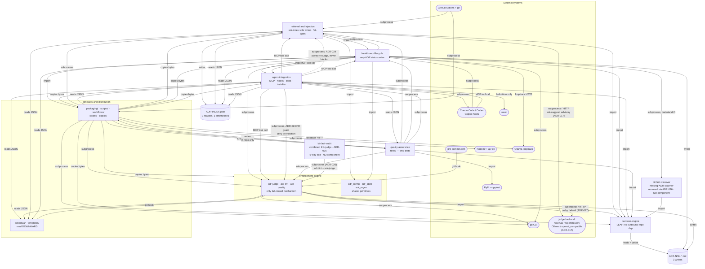

# adr-kit Components

Seven components, synthesized from the eighteen `c4-code-*.md` cluster documents.
Every claim below is traceable to a component document; this file adds only the
cross-component structure that no single component document can see. It is one
of four C4 levels — see [Document map](#document-map) at the end of this file
for how to navigate from here to the code, container and context levels.

## System Components

| Component | Short description | Document |
| --- | --- | --- |
| **Decision Record Engine** (`decision-engine`) | The semantic core: what an ADR *means*. Three body profiles mapped onto stable semantic roles, the frontmatter dialect, the directory-to-graph projection, and the retrieval query engine — plus the two mutators of ADR *identity* (profile migration, renumbering). 7 files, 3,396 lines, stdlib-only, **zero outbound repository dependencies**. | [c4-component-decision-engine.md](./c4-component-decision-engine.md) |
| **Enforcement and Verification Engine** (`enforcement-engine`) | The only part of adr-kit that **blocks**. Judges a staged diff against every Accepted ADR's fenced JSON `## Enforcement` block, scores and gates ADR quality, and owns the killable-subprocess regex sandbox that makes repository-authored policy safe to execute. Since ADR-017 the LLM pass is **on by default**, judged one ADR at a time in isolation, and resolved through a pluggable backend registry (host CLI / OpenRouter / Ollama / OpenAI-compatible) rather than a pinned model. 5 CLIs plus 6 importable runtime/backend modules, ~6,600 lines total. | [c4-component-enforcement-engine.md](./c4-component-enforcement-engine.md) |
| **Selective Context Retrieval** (`retrieval-and-injection`) | Makes recorded decisions *findable* at the moment an agent needs them. One generator (`adr-index`, the sole writer of every derived index view) plus four readers covering ADR-004's session, task and edit tiers. 5 CLIs, 2,743 lines, fail-open by construction — every path exits 0. | [c4-component-retrieval-and-injection.md](./c4-component-retrieval-and-injection.md) |
| **Health, Guardian and Lifecycle** (`health-and-lifecycle`) | The time dimension of an ADR set: the only sanctioned status writer (`bin/adr`, transactional with snapshot rollback, now requiring `--confirm` and a person-named signer on acceptance per ADR-027), the SessionStart staleness detector, the health ledger, retirement scoring, seven-class readiness with a CI merge gate, and the local `adr-doctor` check/repair/probe engine. 17 files, 7,178 lines. | [c4-component-health-and-lifecycle.md](./c4-component-health-and-lifecycle.md) |
| **Agent and Client Integration** (`agent-integration`) | Every path by which an LLM agent or CLI client reaches the engine, deliberately kept separate: a hand-rolled MCP stdio server (5 read-only tools, key-free), a lifecycle-hook runtime that pushes context unasked, an instruction corpus of skills/prompts/one subagent, and a capability registry plus desired-state installer. Owns no ADR semantics — every path terminates in a `bin/` CLI. Since ADR-023/024, one of its hooks (`hooks/adr_pr_guard.py`) is also a second, direct caller into the enforcement floor at the `gh pr create` moment. | [c4-component-agent-integration.md](./c4-component-agent-integration.md) |
| **Contracts, Packaging and Distribution** (`contracts-and-distribution`) | The declarative contract layer and the release toolchain that acts on it: 11 JSON Schemas, 11 copy-out templates, 8 `packaging/*.json` registries, 20 `scripts/*.py` modules, 10 workflows plus 2 composite actions, and the two generated client payloads (`codex/`, `copilot/` — 91 tracked files each, 88 of them a deterministic projection). | [c4-component-contracts-and-distribution.md](./c4-component-contracts-and-distribution.md) |
| **Quality Assurance** (`quality-assurance`) | The single pytest suite plus its fixture, corpus and certification-evidence families — 71 modules, 806 test functions collecting as 903 tests, 19,906 lines, larger than `bin/` itself. Dominated by black-box subprocess tests over the extensionless CLIs, and the only mechanical guard on several ADR gates. | [c4-component-quality-assurance.md](./c4-component-quality-assurance.md) |

**Not covered by any of the seven:** `bin/adr-discover` (546 lines, the
renamed missing-ADR scanner) and `bin/adr-audit` (419 lines, the combined
`adr-lint` + `adr-judge` command ADR-026 records). See
[Coverage gap](#coverage-gap-binadr-discover-and-binadr-audit).

## Component Relationships Diagram

**Label vocabulary** — every edge carries exactly one:

| Label | Mechanism |
| --- | --- |
| `import` | Python import by bare name, after a `sys.path.insert` (there is no package) |
| `subprocess` | Process spawn — `sys.executable`, a `bin/` CLI, or an external binary |
| `MCP tool call` | JSON-RPC 2.0 over stdio to `bin/adr-mcp`, which then subprocesses onward |
| `git hook` | Invoked by the installed pre-commit wrapper or the pre-commit.com framework |
| `reads JSON` / `reads + writes` | File read (or read-modify-write) on disk — JSON, or Markdown for the ADR bodies |
| `writes` | File write on disk — durable via `os.fsync` + `os.replace` throughout |
| `copies bytes` | Verbatim file copy by `scripts/build-client-adapters.py`, drift-checked with `--check` |
| `loopback HTTP` | Bounded probe to `127.0.0.1:11434` for Ollama *identity* that never invokes a model |
| `subprocess / HTTP (opt-in)` | Either a subprocess to the installer-recorded host CLI, or a stdlib-`urllib` HTTP call to OpenRouter or a local Ollama daemon, selected by `judge.backend`; every path degrades to declarative-only on failure (ADR-017) |
| `build-time only` | `rustc` over `hooks/native/*.rs` — manual, invoked by no CI step |

Three conventions matter for reading the arrows.

**Data-flow direction on artefact edges.** `reads`/`writes` edges point the way the bytes
travel, so the dependency between a generator and its consumer runs *through* the artefact
node, not directly between components. `adr-index` writes `ADR-INDEX.json`; the hook
runtime reads it; there is no call in either direction. Only the two artefacts that carry a
cross-component hazard are drawn — `ADR-NNN-*.md` (three writers, one of them
transactional) and `ADR-INDEX.json` (three readers at three strictness levels). Three more
shared files exist and are one-per-component-pair rather than structural:
`.adr-kit-state.json` (written by `adr-watch` and `adr-guardian`),
`.adr-kit-readiness.json` (written by `adr-guardian refresh-readiness`, read by the hook
runtime) and `.adr-kit.json` (read independently by the judge, retrieval and health).

**Sub-component targets inside `enforcement-engine`.** The arrows from
`retrieval-and-injection` and `health-and-lifecycle` land on the shared runtime primitives
node, not the judge. Drawn at component granularity they would suggest the fail-open tiers
depend on the fail-closed floor, which is the inverse of what the code does.

**The `agent-integration → quality-assurance` edge is not a test edge.** It is
`hooks/hook_benchmark.py` reading `tests/fixtures/hooks/reference-corpus.json` at runtime —
shipped code consuming a test fixture as production configuration. See cycle 6.

## Layering

### The intended stack

**Foundational.** `decision-engine` is a true leaf: its four library modules import no
other repository module, define no `main()`, and raise rather than exit — the caller maps
exceptions to status. Seventeen consumers import it, one subprocesses to it, and one
re-implements it in Rust. Everything that parses an ADR reads through it, which is why
"the ADR set means one thing" is an enforceable property rather than a hope.

The second foundational element is the *declarative half* of
`contracts-and-distribution` — `schemas/` and `templates/`. These are data, not code,
and four components read them downward at runtime.

**Engines.** `enforcement-engine`, `retrieval-and-injection` and `health-and-lifecycle`
sit above the leaf. They divide by posture, not by subject matter: enforcement is the sole
fail-closed mechanism (ADR-004 puts blocking authority in `bin/adr-judge`, joined since
ADR-023 by the pull-request guard's own call into that same judge), while retrieval and
health are fail-open and report-only — every read path exits 0. That posture split is the
load-bearing boundary in the whole system, and it is enforced socially rather than
mechanically.

**Surfaces.** `agent-integration` and the *release half* of `contracts-and-distribution`
are the outer skin. Nothing in either owns ADR semantics; every path terminates in a
`bin/` CLI. `agent-integration`'s import edge out of itself
(`hooks/adr_hook_core.py` importing `query_adr_context`) remains the exception that
mostly proves the rule — but it is no longer the *only* one: since ADR-023/024, its
`hooks/adr_pr_guard.py` also reaches directly into `enforcement-engine` (a fail-closed
subprocess call, not an import) and into `retrieval-and-injection` (an advisory subprocess
nudge that can never block) — both drawn above as new edges out of `AI`.

**Verification.** `quality-assurance` sits on top and depends on all six others. It should
be removable without affecting behaviour. It is not — see below.

**Allowed direction:** downward only. A surface may reach an engine; an engine may reach
the leaf; nothing should reach up. Four things violate that.

### One component spans both ends of the stack

`contracts-and-distribution` is the structural oddity, and naming it resolves most of the
apparent tangle. Its `schemas/` + `templates/` half is *declarative data consumed
downward* by `enforcement-engine`, `retrieval-and-injection`, `health-and-lifecycle` and
`agent-integration`. Its `packaging/` + `scripts/` + `codex/` + `copilot/` half consumes
those same four components *upward* — copying every mirrored `bin/` file verbatim,
subprocessing nine of the CLIs in workflow steps, and rendering
`agent-integration`'s skills, prompts and `hooks.json` from `agent-integration`'s own
registries.

So four of the loops below are the same fact seen four times: a component that is
simultaneously the bottom and the top of the stack. That is a naming problem, not a
design defect — and it is separable, because the two halves share no code. The two loops
that survive that reframing are genuine, and they are listed first.

### Cycles, ranked by mechanism (import > subprocess > file read)

**1. `health-and-lifecycle` ↔ `contracts-and-distribution` — a code-level inversion, the
worst of the set.** `bin/adr_doctor_checks.py` imports `scripts/adr_settings.py`
(`resolve_settings`, `local_judgment_state`), `scripts/client_generation.py` (`generate`)
and `scripts/project_setup.py` (`validate_markers`, `collect_changes`, `apply_changes`).
`bin/` importing `scripts/` works only because `bin/adr-doctor:12-14` inserts three roots
into `sys.path`. The health-and-lifecycle document labels this a layering inversion in its
own dependency table. The return edge is the generator copying and subprocessing all of
`bin/`. Consequence: `scripts/` is not release-only infrastructure — `adr-doctor` cannot
run without it, so the release toolchain is a runtime dependency of the health tool.

**2. `health-and-lifecycle` ↔ `agent-integration` — import in one direction, MCP in the
other.** `bin/adr_doctor_probes.py` does `from hooks.hook_benchmark import measure` and
imports `detect_clients` / `CLIENT_IDS` from `clients/installer/`, then drives a
four-message MCP session against `bin/adr-mcp` as a *client*. Meanwhile `bin/adr-mcp`
subprocesses `adr-readiness`, `adr-status` and `adr-quality` to serve three of its five
tools, and the hook runtime reads the `.adr-kit-readiness.json` queue that
`adr-guardian refresh-readiness` writes. The health-and-lifecycle document records the MCP
half as "purely process-level in both directions", so a signature change cannot break it;
the `hooks.hook_benchmark` import is the part that can, being a real code edge from an
engine up into a surface.

**3. `agent-integration` ↔ `contracts-and-distribution` — generator and generated.** The
generator reads `clients/{capabilities,workflows,exceptions}.json` and
`hooks/manifest.json` as declared inputs and emits this component's own `hooks.json`,
15 skills and 45 prompts; the installer then copies the resulting `codex/`/`copilot/`
payload to a per-user data root and patches only that copy (ADR-006); and
`agent-integration` reads `schemas/client-capabilities.schema.json` and the `templates/`
copy-out artefacts. Three mechanisms, no import edge, and the ownership boundary is
documented on both sides — the mildest of the four.

**4. `retrieval-and-injection` ↔ `health-and-lifecycle` — subprocess down, lazy import
up.** `bin/adr` subprocesses `bin/adr-index` inside every lifecycle transaction (and
restores its snapshot if index regeneration fails); `bin/adr-context --check-probes`
imports `adr_retrieval_health` — but *lazily, inside the function*, explicitly to keep it
off the hot path. The laziness is deliberate and documented, which makes this the
best-managed cycle in the system. It is still a cycle: change the health probe's signature
and a retrieval CLI breaks.

**5. `contracts-and-distribution` ↔ `quality-assurance` — a three-way loop.** CI gates the
suite (`validate.yml` runs a 10-module packaging subset plus a 3-OS × Python 3.10/3.12
matrix); the suite asserts on CI's own files (text assertions over
`.github/workflows/*.yml` and `packaging/*.json`); and `scripts/refresh-otgw-corpus.py:186`
*writes* `tests/testsets/otgw-firmware/manifest.json` including the 169 `sha256` entries
that `test_otgw_corpus.py` then asserts are byte-unchanged. One release script owns a
corpus the suite guards.

The write edge carries a qualification worth keeping attached to it, because it bounds the
blast radius: `refresh-otgw-corpus.py` is invoked by **no workflow** (verified — the only
matches for `refresh-otgw` outside the script itself are its own `__pycache__`), and it is
absent from `packaging/public-artifacts.json`'s `include_roots`, as is `tests/` entirely
(both verified). So this is a manual, in-repo maintenance operation that never reaches a
distributed tree. It is a real loop in the source repository and a non-loop in anything
shipped — unlike cycle 6, which ships.

**6. `quality-assurance` ↔ `agent-integration` (and transitively `health-and-lifecycle`) —
shipped code reads a test fixture.** This is the most surprising cross-component fact in
the system and it inverts the top of the stack. `hooks/hook_benchmark.py:83-86` resolves
`plugin_root / "tests" / "fixtures" / "hooks" / "reference-corpus.json"` and `json.loads`
it; `bin/adr_doctor_probes.py:20,299` calls `measure()` during `adr-doctor --deep`. So
`tests/` is not removable from a distributed tree if `--deep` is to work — the latency
*method* (budget triples, sample counts, cache states) is defined as a test fixture and
consumed as production configuration. Everything else about `quality-assurance` is
correctly one-way.

### Placement smells that are not cycles

- **`adr_state` and `adr_config` are homed in the wrong component.** Both live in the
  `bin-lib-runtime` cluster inside `enforcement-engine`, and the enforcement document
  states plainly that `adr_state` has *no consumer in this component* — its real users are
  `adr-guardian` (health) and `adr-watch` (retrieval). They are shared primitives wearing
  an enforcement badge. Moving them to their own foundational module beside
  `decision-engine` would delete two misleading arrows without changing a line of logic.

- **Duplication is used instead of dependency, deliberately, to preserve the ADR-004
  boundary.** There is no code edge in either direction between
  `retrieval-and-injection` and `bin/adr-judge`, because everything in retrieval fails open
  and the judge fails closed. The price is verbatim copies: `bin/adr-suggest` carries
  `glob_to_regex`, `parse_diff`, `_split_cmd` and `_fence` copied from `bin/adr-judge` with
  a "keep these in sync" instruction, and `bin/adr-discover:155` carries a third
  `glob_to_regex` commented "Same translator as `bin/adr-judge`" (moved here from the file
  formerly named `bin/adr-audit` when ADR-026 renamed it — the duplication itself did not
  move). **Path-glob translation — the function that decides which files an ADR governs —
  therefore has three homes and no mechanical guard.** That is the highest-consequence
  duplication in the repository, because a divergence changes enforcement *scope* silently.

- **Three readers of `ADR-INDEX.json` at three strictness levels.**
  `adr_query.load_index_graph` validates schema version, staleness, node structure and
  duplicate ids, and raises. `hooks/adr_hook_core.py:182` caps the file at 2 MiB and
  returns `[]` on any problem — no version check, no staleness check.
  `hooks/native/adr-hook.rs:174` is a third reader in Rust with a hand-rolled JSON scanner
  and its own hardcoded field weights. A stale or schema-v1 graph is rejected by the CLI
  and silently accepted by both hook readers.

- **Three components can write ADR Markdown.** `bin/adr` owns status transitions
  (transactionally, with snapshot rollback), `bin/adr-migrate` and `bin/adr-renumber` own
  profile and identity, and `bin/adr-judge --migrate-status-history` is a third write path
  in the component whose entire purpose is otherwise read-only judging. Only `bin/adr` is
  transactional. Neither `bin/adr-discover` nor `bin/adr-audit` writes ADR files, so this
  count is unaffected by the ADR-026 rename.

### Coverage gap: `bin/adr-discover` and `bin/adr-audit`

The census here no longer lands on a single orphan file. [ADR-026](../docs/adr/ADR-026-record-the-combined-audit-command-and-its-five-way-exit-contract.md)
(Accepted 2026-08-04) records a rename that split what earlier versions of this index
called `bin/adr-audit` into two files with different jobs:

- **`bin/adr-discover`** (546 lines) is the deterministic missing-ADR candidate scanner
  this index used to describe under the name `bin/adr-audit` — the tool `/adr-kit:init`
  runs to discover undocumented decisions. It still imports `SUPPORTED_PROFILES` and
  `detect_profile` from `adr_format` (verified at `bin/adr-discover:66`) — a
  `decision-engine` format-registry consumer, unchanged by the rename — and it still
  carries the duplicated `glob_to_regex` translator noted above, now at
  `bin/adr-discover:155`. Its only known in-repo caller is
  `bin/adr_doctor_core.py:216` (`audit_script = bin_dir / "adr-discover"`, verified by
  direct read), which subprocesses it on material drift — that caller is
  `health-and-lifecycle`.
- **`bin/adr-audit`** (419 lines) now names something new: the combined `adr-lint` +
  `adr-judge` command ADR-026 records, with a five-way exit contract —
  `EXIT_OK=0`, `EXIT_CODE_VIOLATION=1`, `EXIT_TOOLING=2`, `EXIT_ADR_QUALITY=3`,
  `EXIT_BOTH=4` — implemented by `exit_code()` at `bin/adr-audit:246` (verified by direct
  read; the `lint`/`judge` outcomes feed `bad_adrs`/`bad_code` booleans that combine into
  one of the five codes). It runs `bin/adr-lint` and `bin/adr-judge` as subprocesses,
  either against a diff (the default) or, in `--whole-codebase` mode, against a diff of
  every tracked file versus the empty tree — a caller *into* `enforcement-engine`, not a
  member of it. A bare invocation with neither `--diff` nor `--whole-codebase` is refused
  at exit 2, naming `bin/adr-discover` rather than silently reporting a clean pass against
  an empty diff. Unlike the scanner, it imports nothing from `decision-engine`: its only
  imports are stdlib (`argparse`, `json`, `os`, `subprocess`, `sys`, `pathlib`, `typing`).

Neither file is claimed as a Code Element by any of the seven component documents;
`enforcement-engine`'s own document is explicit that both are "documented here only as an
inbound caller."

The arithmetic that used to close this section no longer holds at all. `bin/` now holds
**50** files (verified by direct listing, 2026-08-06) — not the 40 the previous refresh
counted. Summing what the seven components' own just-refreshed documents claim for
themselves: `decision-engine` 7, `enforcement-engine` 11 (up from 9 — `adr_llm.py` and
`adr_quality_core.py` are new since ADR-017), `retrieval-and-injection` 5,
`health-and-lifecycle` 17, `agent-integration` 1 (`bin/adr-mcp`) — 41 files. Add the two
named above and the total reaches 43, seven short of 50. The remaining seven —
`adr_embedding_runtime.py`, `adr_history_scan.py`, `adr_index_core.py`,
`adr_llm_judge_migration.py`, `adr_vector_store.py`, `adr-embed` and `adr-settings` —
arrived after, or independent of, this refresh cycle and are named by none of the seven
component documents. Three of them — `adr_embedding_runtime.py`, `adr_vector_store.py`
and `adr-embed` — evidently belong together with `hooks/adr_embed_query.py` under
[ADR-020](../docs/adr/ADR-020-embed-the-query-where-the-query-is-asked-and-read-authority-from-the-index.md)
(query-time semantic embedding retrieval, described in `c4-context.md` §4.1 and §5 but
not yet in `c4-component-retrieval-and-injection.md`). `adr_index_core.py` is the module
`bin/adr-index` was split into so the guardian can answer "is the committed index still
what the generator would produce?" without spawning a subprocess (per its own docstring);
it belongs with `retrieval-and-injection` by the same logic that already places
`adr_quality_core.py` in `enforcement-engine`, but that component's document does not yet
say so. The other three's purpose was only skimmed from their own module docstrings for
this refresh, not verified against any component document, and are named here so the next
refresh does not have to rediscover them from a bare directory listing.

### One number that looks like agreement and is not

Two different 39s appear in the component documents and they exclude different files.
`contracts-and-distribution` reports **39 `bin/` files copied into each client mirror** —
that is 40 minus `bin/bump-version`, a declared `COPY_EXCLUSIONS` entry. This index's own
previous census also reached **39** — that is 40 minus the file then named `bin/adr-audit`.
Same total, different exclusion; do not read the match as corroboration. Neither 39 holds
today: as the coverage-gap arithmetic above shows, a direct listing of `bin/` on
2026-08-06 counts 50 files, meaning both cited 39s — and this index's own former 40 —
predate at least eleven files that have since landed.

## Document map

Four C4 levels document this system. This file is the component level; the other three
are one hop away.

| Level | Document(s) | What it covers |
| --- | --- | --- |
| Code | 18 `c4-code-*.md` cluster documents, linked individually from each component document's own "Code Elements" table above | Function signatures, arguments, module-level dependencies and line-anchored facts for one cluster of files at a time |
| Component (this level) | The seven `c4-component-*.md` documents indexed above, synthesized here | Component boundaries, cross-component dependencies, layering and cycles |
| Container | [c4-container.md](./c4-container.md) | What actually runs: CLI Toolkit, MCP Server, Hook Runtime, Pre-commit Gate, Instruction & Skill Corpus, Client Generation & Release Toolchain, Generated Client Mirrors. Substitutes **distribution** for **deployment** throughout, because this repository ships no deployment artifact of any kind — no Dockerfile, Kubernetes manifest, Terraform file, docker-compose file or serverless function definition exists anywhere in the tree — and deliberately carries no `apis/` directory or OpenAPI specification, because adr-kit exposes no HTTP interface (its three machine-readable contracts are a stdio JSON-RPC tool surface, a native lifecycle-hook event contract, and a set of CLI exit-code contracts). |
| Context | [c4-context.md](./c4-context.md) | Who uses adr-kit and why, one level above the container boundary: four evidenced personas (maintainer/human decision-maker, coding agent, committing engineer, CI/the automated gate), the system features and user journeys each one drives, and the external systems (git, the host CLI runtime, the public GitHub repository, GitHub Actions, an optional LLM backend, an optional local embedding model, the pre-commit.com framework) adr-kit depends on. |
