# adr-kit Containers

## Scope note: distribution, not deployment

C4's container level normally asks "what runs where." This repository has no
answer in that shape: verified directly against the working tree, there are
**zero** Dockerfiles, Kubernetes manifests, Terraform files, docker-compose
files, or serverless function definitions anywhere in adr-kit (confirmed by
file search, not assumption). adr-kit is not a deployed service. It is a
governance toolkit distributed as a **plugin** to three coding-agent
command-line interfaces (CLIs) — Claude Code, Codex, and GitHub Copilot CLI
(ADR-010) — installed into a plugin cache on someone else's machine and run
there as short-lived subprocesses and one long-lived stdio process.

This document therefore substitutes **distribution** for **deployment**
throughout: instead of "which server runs this container," the question is
"which manifest declares this container, which marketplace resolves it, and
which gate proves the copy a client actually runs still matches the source."

**On the absence of an `apis/` directory.** This document does **not**
include an `apis/` directory or any OpenAPI/Swagger specification. OpenAPI
describes HTTP interfaces, and adr-kit exposes none — there is no HTTP
server, no REST or GraphQL endpoint, anywhere in the repository. The three
interfaces this system actually has are process-boundary contracts: a
stdio JSON-RPC tool surface, a native lifecycle-hook event contract, and a
set of CLI exit-code contracts. All three are documented below, each
sourced from the repository artifact that defines it (`bin/adr-mcp`,
`hooks/manifest.json`, ADR-026 and the CLIs it governs) rather than
invented to fit an API-documentation template that does not apply here.

## Containers

| Container | Description | Type | Technology |
| --- | --- | --- | --- |
| **CLI Toolkit** | 26 extensionless entrypoints in `bin/` (25 excluding `adr-mcp`, which is documented separately below) plus 24 `bin/*.py` support modules — the engine behind every ADR workflow: lint, judge, audit, context, index, status, quality, readiness, retire, doctor, guardian, migrate, renumber, related, settings, watch, suggest, grill-signal, embed. | Short-lived, one-shot subprocesses | Python 3, standard library only (ADR-016's zero-runtime-dependency baseline extends to the whole `bin/` surface) |
| **MCP Server** | `bin/adr-mcp` (1,093 lines) — a hand-rolled, dual-era Model Context Protocol (MCP) server that wraps five of the CLI Toolkit's tools for direct agent invocation. | Long-lived, persistent stdio process (`for line in sys.stdin:`) | Python 3 standard library, zero runtime dependencies (ADR-016) |
| **Hook Runtime** | `hooks/` — per-client lifecycle adapters (`hooks/adapters/{claude,codex,copilot}.py`) over a shared core (`hooks/adr_hook_core.py`, `hooks/adr_embed_query.py`, `hooks/adr_pr_guard.py`), dispatched by `hooks/adr-hook.py` and `hooks/run-hook.cmd`, with an opt-in native fallback. | Short-lived subprocess, invoked by the host client on a lifecycle event | Python 3 (canonical path); optional native Rust binary `hooks/bin/windows-x64/adr-hook.exe` (ADR-029 has **Accepted** its retirement — see Distribution, below) |
| **Pre-commit Gate** | `templates/githooks/pre-commit`, installed by `/adr-kit:install-hooks` into a consuming project's own `.githooks/pre-commit` (this repository dogfoods its own copy at `.githooks/pre-commit`). Chains any pre-existing hook, then runs the declarative judge always and the LLM pass on `llm_judge:true` ADRs by default (ADR-017). | Shell script invoked by `git commit`, outside any agent host | Bash (with a `perl` timing fallback for macOS), subprocessing into the CLI Toolkit |
| **Instruction & Skill Corpus** | `skills/` (17 canonical-rich `SKILL.md` files), `instructions/` (`ADR-guide.md`, `adr.coding.md`, `adr.review.md`), `prompts/claude-code-cli/`, and `agents/adr-generator.md` (the one subagent) — plus their generated counterparts `codex/skills/`, `copilot/skills/`, `prompts/codex-cli/`, `prompts/github-copilot-cli/`. Not executable; content consumed by each client's native skill/prompt discovery. | Declarative content (Markdown + JSON front matter), no runtime process | Markdown, rendered per-workflow by the generation toolchain for the two non-canonical clients |
| **Client Generation & Release Toolchain** | `scripts/build-client-adapters.py` (and its `client_generation*.py`, `client_certification.py`, `client_evidence.py` support modules), `scripts/install-agent-envs.py`, `scripts/setup-project.py`, `scripts/settings.py`, `scripts/sync-agent-plugins.py`, plus the release-only `scripts/bump-version.py` / `scripts/check-release-version.py` / `scripts/check-branch-sync.py`, reading `packaging/*.json`. Produces the two generated mirrors, enforces version consistency, and drives per-machine installs. | Command-line build/release tooling — some of it distributed to installed clients, some maintainer/CI-only (see Distribution) | Python 3 |
| **Generated Client Mirrors** | `codex/` and `copilot/` — deterministic projections of the CLI Toolkit, MCP Server, Hook Runtime and Instruction & Skill Corpus, produced by the Client Generation Toolchain, each carrying its own hand-authored plugin manifest, `.mcp.json` and `hooks.json`. | Generated distribution trees, drift-checked, never hand-edited | Identical technology to the containers they mirror; generation and validation logic in Python |

Claude Code needs no mirror: its plugin source is the repository root itself
(`./`, per `docs/RELEASING.md`'s marketplace table), so it runs the CLI
Toolkit, MCP Server, Hook Runtime and Instruction & Skill Corpus directly
from the canonical tree. Codex and Copilot run the corresponding files
inside `codex/` and `copilot/`.

## Purpose

### CLI Toolkit

Everything an ADR workflow actually does — reading, writing, lifting,
scoring, or enforcing an Architecture Decision Record — happens here. Every
other container in this document is a thin caller: the MCP Server
subprocesses into it, the Hook Runtime subprocesses into it, the Pre-commit
Gate subprocesses into it, and CI subprocesses into it directly. None of the
other containers duplicates its logic.

### MCP Server

Gives an agent host a structured, typed way to call five read-only CLI
Toolkit operations without shelling out and parsing text — `tools/list`
advertises them, `tools/call` invokes them, and every response is either
plain text or JSON emitted by the wrapped CLI. It owns no ADR semantics of
its own; per its own module docstring, it is "a thin Model Context Protocol
server wrapping the adr-kit CLIs."

### Hook Runtime

Pushes ADR context and edit governance into an agent session **unasked**, at
the moment the host client fires a native lifecycle event (session start, a
prompt, a tool call, plan exit, pull-request creation, a subagent start, or
a context compaction). This is the container ADR-004's fail-open context
tiers describe, and the one place where a strict wall-clock budget is a
first-class design constraint (see Interfaces, below).

### Pre-commit Gate

The one deterministic, always-on enforcement floor that does not depend on
an agent host being present at all. It runs at `git commit` time regardless
of which client (or no client) staged the change, which is why ADR-023
records the pull-request guard and this gate as the two fail-closed tiers of
the system.

### Instruction & Skill Corpus

Teaches each client's agent *how* to use adr-kit — the skill and prompt text
an agent reads to decide which CLI or MCP tool to invoke and in what order.
It carries no logic of its own; every workflow it describes bottoms out in a
CLI Toolkit or MCP Server call.

### Client Generation & Release Toolchain

Turns one canonical semantic source (`clients/workflows.json`,
`clients/capabilities.json`, `hooks/manifest.json`, and the CLI
Toolkit/Hook Runtime/Instruction Corpus files themselves) into two
byte-verified, client-native trees, and keeps every version-bearing file in
the repository — eleven of them, per `packaging/version-sites.json` — equal
to the tag being released (ADR-013).

### Generated Client Mirrors

The actual bytes that ship to the Codex and Copilot marketplaces. Nothing in
either tree is meant to be hand-edited: `scripts/build-client-adapters.py
--check` fails the moment either drifts from what generation would produce
from the canonical source.

## Components

Each container maps onto the seven components documented at the C4
component level; several component documents are being refreshed in
parallel with this one, so this section links rather than restates.

| Container | Component document(s) | Relationship |
| --- | --- | --- |
| CLI Toolkit | [c4-component-decision-engine.md](./c4-component-decision-engine.md), [c4-component-enforcement-engine.md](./c4-component-enforcement-engine.md), [c4-component-retrieval-and-injection.md](./c4-component-retrieval-and-injection.md), [c4-component-health-and-lifecycle.md](./c4-component-health-and-lifecycle.md) | This container is the union of four components' `bin/` surfaces: what an ADR *means* (decision-engine), what *blocks* a commit (enforcement-engine), what makes a decision *findable* (retrieval-and-injection), and the *time dimension* of an ADR set — status, health, doctor (health-and-lifecycle). |
| MCP Server | [c4-component-agent-integration.md](./c4-component-agent-integration.md) | One of three surfaces this component owns; the component document's own count attributes exactly one `bin/` file to `agent-integration` — `bin/adr-mcp`. |
| Hook Runtime | [c4-component-agent-integration.md](./c4-component-agent-integration.md) | A second surface of the same component, described there as "a lifecycle-hook runtime that pushes context unasked." |
| Pre-commit Gate | [c4-component-contracts-and-distribution.md](./c4-component-contracts-and-distribution.md) | The template is one of the eleven copy-out templates that document attributes to this component; at commit time it calls into enforcement-engine (`bin/adr-judge`) as an external caller, not as a dependency of it. |
| Instruction & Skill Corpus | [c4-component-agent-integration.md](./c4-component-agent-integration.md) | The third surface of the same component: "an instruction corpus of skills/prompts/one subagent." |
| Client Generation & Release Toolchain | [c4-component-contracts-and-distribution.md](./c4-component-contracts-and-distribution.md) | The release half of this component, which the component document itself flags as spanning both ends of the dependency stack — it reads the other components' outputs and also writes their mirrored copies. |
| Generated Client Mirrors | [c4-component-contracts-and-distribution.md](./c4-component-contracts-and-distribution.md) | The output artifact of the same component's release half. |

Not represented as a distributed container: **quality-assurance**
(`tests/`). It is excluded from the public artifact allowlist
(`packaging/public-artifacts.json` `forbidden_segments` names `tests`
explicitly) and from every `COPY_ROOTS`/`HOOK_RUNTIME_FILES`/
`RUNTIME_SUPPORT_FILES` list in `scripts/client_generation_model.py` — it
verifies every container above but ships in none of them, with one narrow,
documented exception: `hooks/hook_benchmark.py` reads
`tests/fixtures/hooks/reference-corpus.json` at runtime inside `adr-doctor
--deep`, which is why `tests/` is a genuine (if surprising) runtime
dependency of the Hook Runtime's deep-diagnostic path despite being excluded
from distribution.

**A note on `bin/adr-audit` and staleness.** `C4-Documentation/c4-component.md`
currently describes `bin/adr-audit` as "a deterministic missing-ADR
candidate scanner" belonging to no component. That description predates
ADR-026 (Accepted 2026-08-04): the file it describes is now
`bin/adr-discover`, and `bin/adr-audit` (419 lines, verified by direct read)
is the combined lint-and-judge command with the five-way exit contract
documented under Interfaces below. Both files exist side by side today in
the CLI Toolkit; this document describes the current, post-rename state.

## Interfaces

adr-kit exposes exactly three machine-readable interface contracts. None is
HTTP.

### 1. MCP tool surface — `tools/list` on `bin/adr-mcp`

Read directly from `TOOL_DEFINITIONS` in `bin/adr-mcp` (lines 169-334), not
paraphrased. All five tools are read-only, key-free (no API key required or
accepted), and each is a bounded subprocess call into a sibling `bin/`
script with a 60-second timeout (`CLI_TIMEOUT_S = 60`, `bin/adr-mcp:122`).

| Tool | Purpose | Parameters |
| --- | --- | --- |
| `adr_context` | Find the ADRs most relevant to a task through the local generated index; deterministic, read-only. Wraps `bin/adr-context --format json`. | **Required:** `query` (string). **Optional:** `limit` (integer 1-100), `paths`/`components`/`symbols`/`topics` (string arrays, ≤32 items each), `statuses` (enum array: `Accepted`, `Proposed`, `Superseded`, `Rejected`, `Deprecated`, `Amended`, `Unknown`), `authorities` (enum array: `governing`, `advisory`, `historical`), `include_history` (boolean), `strict_index` (boolean), `min_score` (number 0-1), plus `project_root`/`adr_dir` (workspace override, common to all five tools). |
| `adr_judge` | Judge a unified diff against the `## Enforcement` blocks of Accepted ADRs — declarative pass only, never `--llm` (key-free by design). Wraps `bin/adr-judge --json`. | **Required:** `diff` (string, e.g. `git diff --cached` output). **Optional:** `project_root`/`adr_dir`. |
| `adr_status` | ADR repository health dashboard: totals, status breakdown, enforcement health, retirement candidates. Wraps `bin/adr-status --format json`. | **Optional only:** `project_root`/`adr_dir`. |
| `adr_quality` | Score ADRs on quality across 4 gates (0.0-1.0 each, grade A-D). Wraps `bin/adr-quality --format json`. | **Optional:** `adr_id` (string, e.g. `ADR-001`; omit to score every ADR), plus `project_root`/`adr_dir`. |
| `adr_readiness` | Inspect ADR lifecycle readiness and explicit implementation links; incapable of accepting an ADR. Wraps `bin/adr-readiness --format json`. | **Optional:** `adr_id`, `all_proposed` (boolean), `base`/`head` (git refs, must be given together), `today` (deterministic `YYYY-MM-DD` evaluation date), plus `project_root`/`adr_dir`. |

`adr-suggest` is deliberately **not** exposed (`bin/adr-mcp:41-43`): it is an
LLM-only advisory tool and the server stays key-free.

**Protocol shape.** Per ADR-016 (Accepted, 2026-07-30, verified live in the
current `bin/adr-mcp` by direct read of `HANDSHAKE_PROTOCOL_VERSIONS`,
`MODERN_PROTOCOL_VERSIONS` and the `server/discover` dispatch branch), the
server is **dual-era**: it answers the legacy `initialize` handshake
(`2024-11-05` .. `2025-11-25`) with a confirm-or-counter-offer negotiation,
and the modern, stateless `2026-07-28` revision through `server/discover` or
the `io.modelcontextprotocol/protocolVersion` sentinel in `params._meta`.
Era selection is a pure function of the single frame being answered — no
per-connection state. All three shipped copies (`bin/adr-mcp`,
`codex/bin/adr-mcp`, `copilot/bin/adr-mcp`) must stay byte-identical.

### 2. Hook event contract — `hooks/manifest.json`

Eight events, read directly from the manifest (schema version 1). Global
policy: `fail_open: true`, `network_allowed: false`,
`future_clients_allowed: false`.

| Event id | Native matcher | Outcome | p50 / p95 | Hard timeout | Claude Code | Codex | Copilot |
| --- | --- | --- | ---: | ---: | --- | --- | --- |
| `session-start` | — | task-context | 400 / 500 ms | 1000 ms | `SessionStart` | `SessionStart` | `sessionStart` |
| `user-prompt-submit` | — | task-context | 450 / 450 ms | 900 ms | `UserPromptSubmit` | `UserPromptSubmit` | `userPromptSubmitted` |
| `pre-tool-use` | `Edit\|MultiEdit\|Write` | edit-governance | 450 / 550 ms | 1100 ms | `PreToolUse` | `PreToolUse` | *(none)* |
| `post-tool-use` | `Edit\|MultiEdit\|Write` | edit-governance | 650 / 750 ms | 1500 ms | `PostToolUse` | `PostToolUse` | `postToolUse` |
| `plan-exit` | `ExitPlanMode` | task-context | 700 / 900 ms | 1800 ms | `PreToolUse` | *(none)* | *(none)* |
| `pr-create` | `Bash` | enforcement | 1500 / 3000 ms | **5000 ms** | `PreToolUse` | `PreToolUse` | *(none)* |
| `subagent-start` | — | task-context | 600 / 800 ms | 1600 ms | `SubagentStart` | `SubagentStart` | *(none)* |
| `pre-compact` | — | lifecycle | 650 / 1000 ms | 2000 ms | `PreCompact` | `PreCompact` | *(none)* |

`session-start` and `pr-create` additionally carry `runner_timeout_sec: 5` —
a process kill timeout, a different quantity from the latency budget above
it (ADR-031 makes this distinction explicit after the two were once
conflated).

**The `pr-create` exception.** ADR-015's Decision Contract sets a hard
2000 ms ceiling on every deterministic user-facing hook or CLI path.
`pr-create`'s 5000 ms budget is the sole exception, and it is not silent:
ADR-031 (Accepted, 2026-08-05, gate `adr-hook-ceiling-v1`) names `pr-create`
explicitly as a **deliberately slower, user-initiated event** — the user
typed `gh pr create` and is waiting for the branch judge to finish before
the pull request opens, which is categorically different from the other
seven events that fire as a side effect of work the user did not
specifically ask for. ADR-031's Decision Contract requires the exemption to
be *resolved from an Accepted ADR record*, never hardcoded as a literal
event name in test code — `adr-hook-ceiling-v1` is the gate that verifies
exactly this: every `latency_budget_ms` above 2000 ms in
`hooks/manifest.json` must be named by an Accepted ADR carrying the
exemption, or the gate fails.

### 3. CLI exit-code contracts

`bin/adr-audit` is the combined lint-and-judge command (ADR-026, Accepted
2026-08-04, gate `adr-audit-exit-contract-v1`). It runs `bin/adr-lint` and
`bin/adr-judge` as subprocesses in one invocation and combines their
pass/fail results into a five-way exit code, because "your ADRs are not
good enough" and "your code violates an ADR" are different problems with
different owners.

| Exit code | `bin/adr-audit` meaning | Owner |
| ---: | --- | --- |
| 0 | both clean — on course | — |
| 1 | the code violates an Accepted ADR | whoever wrote the code |
| 2 | the audit could not run at all (tooling/configuration; also returned for a bare invocation with no `--diff`/`--whole-codebase`, which now redirects the caller to `bin/adr-discover`) | whoever installed/invoked it |
| 3 | the ADR set fails its own quality gates | whoever wrote the ADRs |
| 4 | both 1 and 3 | both |

Exit codes 3 and 4 sit above 1 deliberately, so a caller that only checks
`!= 0` still blocks on any failure, while a caller that branches on the
value can route the failure to its owner without parsing output.

The two commands `adr-audit` wraps carry a simpler, shared two-plus-one
contract that `adr-audit`'s own code composes into the five-way result
(`exit_code()` in `bin/adr-audit:246-255`, verified by direct read):

| Command | 0 | 1 | 2 |
| --- | --- | --- | --- |
| `bin/adr-lint` | no `FAIL`-level finding | at least one `FAIL`-level finding | config or tooling error |
| `bin/adr-judge` | no `violation`-severity finding | at least one `violation`-severity finding | `JudgeError` or interrupt |

Exit 2 carries the same meaning across all three commands: "the tool could
not answer," which is never collapsed into "the answer was no" — stated
explicitly in `bin/adr-audit`'s module docstring and confirmed by its
`AuditError` handling, which maps every tooling failure (missing script,
subprocess failure, unreadable JSON, a wrapped command's own exit 2) to
`EXIT_TOOLING` rather than to a violation code.

## Dependencies

| Container | Depends on | Mechanism |
| --- | --- | --- |
| CLI Toolkit | ADR Markdown files (`docs/adr/*.md`), `ADR-INDEX.json`, `.adr-kit.json`/`.adr-kit-state.json` | File system read/write |
| CLI Toolkit | `git` CLI | Subprocess (diffs, staged content, refs) |
| CLI Toolkit | `claude` CLI, OpenRouter, or an Ollama loopback endpoint | Subprocess / loopback HTTP — opt-in LLM judge pass only (ADR-001), never on the hot path |
| MCP Server | CLI Toolkit (`adr-context`, `adr-judge`, `adr-status`, `adr-quality`, `adr-readiness`) | Subprocess, one call per tool invocation, `PYTHONIOENCODING=utf-8` forced on the child |
| MCP Server | Agent host (Claude Code, Codex, Copilot) | Long-lived stdio JSON-RPC — the host launches the process via `.mcp.json` / `codex/.mcp.json` / `copilot/.mcp.json` and keeps the pipe open |
| Hook Runtime | CLI Toolkit (`adr-context`, `adr-judge`, retrieval helpers) | Subprocess and, for `hooks/adr_hook_core.py`, a direct Python import of `query_adr_context` (the one documented exception to "surfaces only subprocess") |
| Hook Runtime | Agent host | Native lifecycle event dispatch (host calls the hook command synchronously and reads stdout/exit code) |
| Hook Runtime | `.adr-kit-readiness.json` | File read — written by `adr-guardian refresh-readiness`, read by the hook runtime for pull-request-moment context |
| Pre-commit Gate | CLI Toolkit (`adr-judge`, `adr-suggest`), installed client plugin caches (to resolve the latest `adr-judge`) | Subprocess; git invokes the wrapper synchronously at `pre-commit` time |
| Instruction & Skill Corpus | none (declarative content) | — (consumed, not calling out) |
| Client Generation & Release Toolchain | CLI Toolkit, Hook Runtime, Instruction & Skill Corpus, `clients/*.json`, `hooks/manifest.json`, `packaging/*.json` | File read (verbatim copy for `COPY_ROOTS`/`HOOK_RUNTIME_FILES`/`RUNTIME_SUPPORT_FILES`; per-workflow rendering for skills/prompts via `render_skill`/`render_prompt`) |
| Client Generation & Release Toolchain | `git` CLI, GitHub Actions runners | Subprocess / CI job |
| Generated Client Mirrors | Client Generation & Release Toolchain | Written by, never edited directly — `scripts/build-client-adapters.py --check` is the drift gate that enforces this |
| Generated Client Mirrors | Codex CLI, GitHub Copilot CLI | Native plugin-manager subprocess (`codex plugin ...` / `copilot plugin ...`) resolving the marketplace manifest that points at `./codex` or `copilot` |

## Distribution

| Container | Declaring manifest(s) | Version site(s) (`packaging/version-sites.json`) | Drift gate |
| --- | --- | --- | --- |
| CLI Toolkit | `.claude-plugin/plugin.json` (canonical); `codex/.codex-plugin/plugin.json` and `copilot/plugin.json` for the mirrored copies | Carries no version stamp of its own; version is inherited from whichever co-located plugin manifest ships it (demonstrated by `bin/adr-mcp`'s `server_version()`, which reads the nearest of the three plugin manifests — the same resolution pattern the rest of `bin/` relies on implicitly) | `scripts/build-client-adapters.py --check` (byte-identity of the copied `bin/` files across all three trees) |
| MCP Server | `.mcp.json` / `codex/.mcp.json` / `copilot/.mcp.json` (hand-authored-and-validated, per `clients/capabilities.json` `ownership.hand_authored_validated`) | Same three plugin manifests as CLI Toolkit | `scripts/build-client-adapters.py --check`; ADR-016 additionally requires all three shipped `adr-mcp` copies to stay byte-identical |
| Hook Runtime | `.claude-plugin/plugin.json` (hooks wired via the plugin's own hook registration; `codex/hooks/hooks.json` and `copilot/hooks.json` are the per-client hook registration files, `ownership.hand_authored_validated`) | No dedicated version site; content identity is what's checked, not a version number | `scripts/build-client-adapters.py --check` (the eight `HOOK_RUNTIME_FILES` entries, including `hooks/manifest.json` itself, are copied verbatim — `scripts/client_generation_model.py:35-52`); latency-budget *correctness* (as opposed to drift) is separately gated by ADR-031's `adr-hook-ceiling-v1` |
| Pre-commit Gate | None — not marketplace-declared; installed into a *consuming* project's own `.githooks/` by `/adr-kit:install-hooks`, outside any plugin manifest | `templates/githooks/pre-commit` (`ADR_KIT_WRAPPER_VERSION` stamp), `.githooks/pre-commit` (this repository's own dogfooded copy of the same stamp), `templates/cc-settings/guardian-hook-entry.json` (`/_wrapper_version`) | `scripts/build-client-adapters.py --check`, because `templates/` is one of the four verbatim `COPY_ROOTS` |
| Instruction & Skill Corpus | `.claude-plugin/plugin.json` (skills are plugin content, not separately manifested) | `templates/adr-kit-guide.md` (`<!-- adr-kit-guide vX.Y.Z -->` stamp); `skills/`/`prompts/` themselves carry no per-file stamp — they are regenerated wholesale each release | `scripts/build-client-adapters.py --check`, which also asserts every canonical-rich skill exists before rendering the generated ones (`client_generation.py`: `"missing canonical rich skill: {workflow['id']}"`) |
| Client Generation & Release Toolchain | Not itself plugin-declared | None directly — it is the thing that enforces the other sites via `packaging/version-sites.json` | `tests/test_version_sites.py` keeps the registry itself honest; **partially distributed**: `packaging/public-artifacts.json` names 11 specific `scripts/*.py` files in its public-archive `include_roots` (`build-client-adapters.py`, `client_generation*.py`, `client_certification.py`, `client_evidence.py`, `install-agent-envs.py`, `project_setup.py`, `settings.py`, `setup-project.py`, `sync-agent-plugins.py`, `benchmark-client-generation.py`, `adr_settings.py`) — these are live probes other containers call (e.g. `clients/capabilities.json` points `disable` at `scripts/settings.py` and `install`/`update`/`rollback`/`remove` at `scripts/install-agent-envs.py`). The release-cutting scripts (`bump-version.py`, `check-release-version.py`, `check-branch-sync.py`) are **not** in that allowlist — maintainer/CI-only, present in the git-source checkout but never resolved as part of any client's plugin source |
| Generated Client Mirrors | `.agents/plugins/marketplace.json` + `codex/.codex-plugin/plugin.json` (Codex); `.github/plugin/marketplace.json` + `copilot/plugin.json` (Copilot) | `codex/.codex-plugin/plugin.json` `/version`, `copilot/plugin.json` `/version`, `.github/plugin/marketplace.json` `/plugins/0/version`. `.claude-plugin/marketplace.json` `/plugins/0/version` also applies (Claude Code reads the repo root directly, not a mirror). `.agents/plugins/marketplace.json` is declared to **carry no version** (`must_not_carry_version` in the registry) because it points at the local `./codex` source and inherits the version from the Codex plugin manifest | `scripts/build-client-adapters.py --check` — the entire purpose of this gate; `scripts/check-release-version.py` additionally fails a release on any of the version sites above disagreeing with the git tag |

Both consumption paths named in `docs/RELEASING.md` apply across every
container above: **public git source** (the tagged commit on
`rvdbreemen/adr-kit`, which every end user's client resolves directly — no
extra step reaches them once the tag lands), and the **local prepared
directory** (`scripts/install-agent-envs.py`, building a version-pinned copy
under `%LOCALAPPDATA%\adr-kit\marketplaces\<version>` on Windows,
`~/Library/Application Support/adr-kit/marketplaces/<version>` on macOS,
`${XDG_DATA_HOME:-~/.local/share}/adr-kit/marketplaces/<version>` on Linux)
used by maintainer machines and offline installs. The second path is
**version-pinned and does not roll forward on its own** — a machine on it
stays on the installed version until `install-agent-envs.py` is re-run, which
is exactly what left a maintainer machine on v0.36.0 after v0.37.0 shipped to
`main` (the incident ADR-012 was written to prevent a recurrence of).

## Container Diagram

```mermaid
flowchart TB
    subgraph SRC["Canonical source tree (repo root, Claude Code's own plugin source)"]
        CLI["CLI Toolkit<br/>bin/*.py + 25 CLIs<br/>short-lived subprocesses"]
        MCP["MCP Server<br/>bin/adr-mcp<br/>long-lived stdio JSON-RPC"]
        HOOK["Hook Runtime<br/>hooks/*<br/>native lifecycle events"]
        PC["Pre-commit Gate<br/>templates/githooks/pre-commit<br/>git commit-time"]
        CORPUS["Instruction & Skill Corpus<br/>skills/ · prompts/claude-code-cli<br/>instructions/ · agents/"]
    end

    subgraph GEN["Client Generation & Release Toolchain"]
        BUILD["build-client-adapters.py<br/>+ client_generation*.py"]
        REL["bump-version.py<br/>check-release-version.py<br/>(release-only, not in public archive)"]
    end

    subgraph CODEXM["Generated: codex/"]
        CCLI["bin/ mirror"]
        CMCP["bin/adr-mcp mirror"]
        CHOOK["hooks/ mirror"]
        CSKILL["skills/ + prompts/codex-cli<br/>(rendered, not copied)"]
    end

    subgraph COPM["Generated: copilot/"]
        PCLI["bin/ mirror"]
        PMCP["bin/adr-mcp mirror"]
        PHOOK["hooks/ mirror"]
        PSKILL["skills/ + prompts/github-copilot-cli<br/>(rendered, not copied)"]
    end

    CLAUDE(["Claude Code CLI<br/>marketplace rvdbreemen-adr-kit"])
    CODEX(["Codex CLI<br/>marketplace rvdbreemen-adr-kit-codex"])
    COPILOT(["GitHub Copilot CLI<br/>marketplace rvdbreemen-adr-kit-copilot"])

    CLI -->|verbatim copy: COPY_ROOTS| BUILD
    MCP -->|verbatim copy: HOOK_RUNTIME_FILES| BUILD
    HOOK -->|verbatim copy: HOOK_RUNTIME_FILES| BUILD
    CORPUS -->|render_skill / render_prompt<br/>from clients/workflows.json| BUILD

    BUILD -->|generates| CCLI
    BUILD -->|generates| CMCP
    BUILD -->|generates| CHOOK
    BUILD -->|generates| CSKILL
    BUILD -->|generates| PCLI
    BUILD -->|generates| PMCP
    BUILD -->|generates| PHOOK
    BUILD -->|generates| PSKILL

    BUILD -.->|"--check: drift gate<br/>(fails on any byte mismatch)"| CODEXM
    BUILD -.->|"--check: drift gate"| COPM

    REL -->|writes 11 version sites<br/>packaging/version-sites.json| SRC
    REL -->|writes 2 mirrored manifests| CODEXM
    REL -->|writes 2 mirrored manifests| COPM

    CLAUDE -->|"plugin source ./<br/>.claude-plugin/marketplace.json"| SRC
    CODEX -->|"plugin source ./codex<br/>.agents/plugins/marketplace.json"| CODEXM
    COPILOT -->|"plugin source copilot<br/>.github/plugin/marketplace.json"| COPM

    PC -.->|subprocess, git commit time| CLI
    HOOK -.->|subprocess + 1 import| CLI
    MCP -.->|subprocess, 1 call per tool| CLI
```

**Reading the diagram.** Solid arrows are the generation pipeline: the
canonical source tree is copied or rendered into the two mirrors by the
toolchain, and the toolchain separately stamps every version site across all
three trees. Dashed arrows are runtime call relationships (subprocess/import)
and the drift-check relationship, kept visually distinct from generation
because they run at a different time and for a different reason — generation
happens at release time; `--check` and the runtime calls happen on every
commit and every agent session, respectively. The three client nodes each
resolve their own plugin source independently, per the marketplace table in
`docs/RELEASING.md`; nothing routes through a shared server, because there
is no shared server — each client's plugin cache holds its own complete,
independently resolved copy of the tree it reads.
