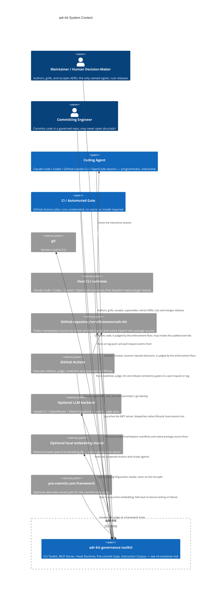

# adr-kit System Context

## Scope note

This document sits above [c4-container.md](./c4-container.md), which already
establishes that adr-kit is not a deployed service: it ships as a plugin,
resolved by three certified coding-agent command-line interfaces (CLIs) and a
separate native OpenCode package. The certified CLIs resolve directly from the
public `rvdbreemen/adr-kit` repository; OpenCode loads the repository
package or a separately published npm package. Everything runs on the machine
that installed it as short-lived subprocesses, one long-lived stdio process, or
a host-loaded native plugin.

This document does not restate that internal container structure; it asks
the question one level up — who or what uses adr-kit, for what outcome, and
through which external system. Component detail is in
[c4-component.md](./c4-component.md).

## 1. System Overview

**One sentence.** adr-kit turns an Architecture Decision Record from a file
nobody re-reads into a guardrail an AI coding agent is handed before it
writes code and checked against the moment it commits.

**In more detail, for a non-technical reader.** A software team accumulates
decisions — which database to use, which layer nothing may bypass, which
framework the project committed to — and normally writes them down, if at
all, in documents that go stale and unread. adr-kit keeps those decisions as
short Markdown files (`docs/adr/*.md`) and wires them into the actual
workflow of an AI coding agent: before the agent edits a file, adr-kit looks
up the decisions that govern that file and hands the agent the binding text,
not just a filename; while the agent works, it can ask adr-kit which
decisions apply to its current task; and when the agent (or a human) commits
code or opens a pull request, adr-kit checks the change against every
decision's machine-readable rules and can refuse the action outright. A
human remains the only one who can accept a decision as final — that
signature is what turns a proposal into policy — and a periodic health sweep
tells that human which decisions have gone stale, which were made but never
recorded, and which are ready to retire. The whole system is deterministic,
stdlib-only Python, and free by default: any pass that calls a language
model is opt-in and never sits on a path the agent cannot avoid (README,
"Why", "Security notes on the LLM passes").

## 2. Personas

Four personas are supported by direct repository evidence. Three were named
by the brief and are confirmed below; a fourth — a developer who commits
code in an adr-kit-governed repository without ever authoring an ADR — is
added because the pre-commit gate, the pull-request guard, and the audited
override mechanism are all built around exactly that person's presence, not
the maintainer's.

| Persona | Type | Primary features used |
| --- | --- | --- |
| Maintainer / human decision-maker | Human | Guided authoring & grilling, lifecycle acceptance, guardian, release runbook |
| Coding agent (Claude Code / Codex / Copilot CLI / OpenCode) | Programmatic — interactive, four host surfaces; three certified instances plus one separate native package | Context retrieval & injection, MCP tools, subject to the enforcement floor |
| Committing engineer | Human | Pre-commit gate, pull-request guard, override escape hatch |
| CI / the automated gate | Programmatic — unattended | Readiness action, judge action, lint gate, scheduled guardian/retire sweeps, release-publish gate |

### 2.1 Maintainer / human decision-maker

The one role the toolkit is built to make accountable. ADR-027 exists
specifically because every lifecycle command writes a `## Status History`
entry naming who decided, that entry is immutable once written, and "an ADR
whose history says a human accepted it when no human did is a lie that
survives the person who told it" (ADR-027, Context). The signer must resolve
to a person-named identity — an explicit `--changed-by "User: <name>"` flag,
a machine-local `lifecycle.signer` setting, or a derived `git config
user.name` that is *announced*, never assumed — and refuses outright for a
value that names a machine (`github-actions[bot]`, `runner`, `adr-kit`
itself, and eight other denylisted identities). Since v0.45.0, `bin/adr
accept` additionally requires an explicit `--confirm` flag: "an acceptance
can no longer happen *by accident* — from a script written against an older
interface, from a CI job, from an agent following a stale instruction"
(CHANGELOG 0.45.0). ADR-011 makes the same point from the authoring side: a
grilling session ends with an acceptance packet that "the engineer must
explicitly confirm... in the active session," after which the workflow
"invokes `adr accept`; it never emulates or bypasses that command." The same
person is the only one who can land a release: `docs/RELEASING.md` states
plainly that `main` is protected, "merging is the maintainer's action," and
an agent running the release runbook "must not merge with `--admin` or
otherwise bypass branch protection."

- **Goals.** Keep the decision log accurate and worth reading. Be the
  accountable name behind every Accepted, Superseded, Rejected, or Retired
  ADR. Ship a version-coherent release across all three marketplaces.
- **Key features used.** `/adr-kit:adr`, `/adr-kit:grill`, `bin/adr-readiness`,
  `bin/adr accept/propose/supersede/reject/document`, `bin/adr-guardian`,
  `docs/RELEASING.md`'s runbook.

### 2.2 Coding agent (Claude Code, Codex, GitHub Copilot CLI, OpenCode)

The most interesting persona because it sits on both sides of the system: it
is fed context it did not ask for, and it is the actor the enforcement floor
exists to constrain. ADR-004 organizes what it receives into three fail-open
tiers — session, edit, and task — plus one fail-closed floor that never
injects, only blocks (`bin/adr-judge`, ADR-004 Decision point 2; joined by a
second fail-closed tier at the pull-request moment per ADR-023, see
§2.3-adjacent discussion below). ADR-010 certifies exactly three named clients
— `claude-code-cli`, `codex-cli`, `github-copilot-cli` — through one outcome
contract rather than one event-name contract, because "equal outcomes are
required; identical event names are not" (ADR-010, Decision Outcome).
OpenCode is a separate native package governed by ADR-039 and is intentionally
not added to `clients/capabilities.json`. That registry records where a
certified client's native events fall short and what backstops the shortfall
(see §5 and §4.1). The README's
"Agent contract" section states the three rules that govern this persona
directly: query the index rather than read the ADR set, treat an injected
`[adr-inject]` block as binding, and never invent an ADR format outside the
registered profile catalog.

- **Goals.** Receive the governing decision before writing a file, not after.
  Distinguish binding (Accepted) from advisory (Proposed) from opt-in
  (historical) context. Self-check a diff via MCP before triggering the
  enforcement floor.
- **Key features used.** Session/prompt/edit/subagent/compaction hook
  injection, the five-tool MCP server (`adr_context`, `adr_judge`,
  `adr_status`, `adr_quality`, `adr_readiness`), the native OpenCode plugin
  surface where applicable, and — as the party whose work is judged — the
  commit and pull-request enforcement tiers.

### 2.3 Committing engineer

Distinct from the maintainer: this is anyone who commits code in a project
that has adr-kit installed, whether or not they have ever opened
`docs/adr/`. Their entire contact with the system can be a blocked or
silently-passed `git commit`. The README documents the mechanism directly —
"the one deterministic, always-on enforcement floor that does not depend on
an agent host being present at all... runs at `git commit` time regardless
of which client (or no client) staged the change" (c4-container.md,
"Pre-commit Gate") — and the README's audited escape hatch exists for
exactly this person: `ADR_KIT_OVERRIDE="ADR-003: hotfix for incident 42" git
commit ...` downgrades one ADR's violations to warnings, refuses an empty
reason, and logs the override locally (README, "Guard the agent while it
works"). ADR-023 adds a second moment this persona meets: `gh pr create` is
intercepted and the branch is judged before the pull request is even
published, justified specifically because "the user is present, sees the
guard run, and can decline" (ADR-023, "Why ADR-019's conclusion survives its
premise") — a fail-closed gate is only acceptable at a moment a human is
watching it.

- **Goals.** Land a change without discovering an architecture rule only
  after it is already merged. Get a `file:line` explanation when blocked,
  not a bare refusal. Have a documented, auditable way to override in a
  genuine emergency rather than reaching for `--no-verify`.
- **Key features used.** `templates/githooks/pre-commit` (installed via
  `/adr-kit:install-hooks`), `hooks/adr_pr_guard.py`, the
  `ADR_KIT_OVERRIDE` escape hatch.

### 2.4 CI / the automated gate

Runs every check with nobody present to ask a question of. ADR-011 states
the boundary explicitly: "Hooks and continuous integration (CI) must stay
local, model-free, bounded, and deterministic," and "CI blocks only when
explicit, inspectable evidence shows that the pull request implements a
linked Proposed ADR" — a suspected-but-unproven undocumented decision is
advisory, never a merge block (ADR-011, Decision Drivers and "Automation
boundary"). ADR-012 gives it the release gate: `.github/workflows/release-
publish.yml` triggers on a `v*` tag and re-runs the version-consistency
check, the client-adapter drift check, `adr-lint --strict`, `adr-index
--check`, and the full pytest suite before a GitHub Release is cut (ADR-012,
"Release flow").

- **Goals.** Block a pull request only on evidence it can point to, never on
  suspicion. Keep a release from shipping with a version mismatch across the
  three marketplaces. Keep the decision log's health visible to the whole
  team, not just whoever opened a session that day.
- **Key features used.** The `adr-readiness` and `adr-judge` composite
  GitHub Actions, `bin/adr-lint --strict`, `scripts/check-release-
  version.py`, the weekly `adr-guardian-audit.yml` and `adr-retire-
  audit.yml` cron workflows.

## 3. System Features

| Feature | Description | Personas | Journey |
| --- | --- | --- | --- |
| **Context Retrieval & Layered Injection** | The index-first query engine (`bin/adr-context`, with query-time semantic embedding and lexical fallback per ADR-020) plus ADR-004's three fail-open tiers that push relevant decisions into a session unasked. | Coding agent (primary), Maintainer (manual `/adr-kit:context` lookup) | [§4.1](#41-coding-agent--context-retrieval--layered-injection-programmatic-integration) |
| **Deterministic Enforcement Floor** | The only two mechanisms in the whole system that block: `bin/adr-judge` at pre-commit/CI (ADR-004's commit tier) and `hooks/adr_pr_guard.py` at `gh pr create` (ADR-023's pull-request tier). | Committing engineer, Coding agent (as the judged party), CI | [§4.2](#42-committing-engineer--deterministic-enforcement) |
| **Guided Authoring & Human-Gated Acceptance** | `/adr-kit:adr`, `/adr-kit:grill`'s one-question-at-a-time interview, `bin/adr-readiness`'s deterministic classification, and `bin/adr accept --confirm` as the sole mutation authority (ADR-011, ADR-027). | Maintainer (author/decider), Coding agent (drafts and asks, never signs) | [§4.3](#43-maintainer--guided-authoring--human-gated-acceptance) |
| **Readiness & Enforcement in CI** | The unattended pull-request path: an explicit-link readiness check and a declarative judge, both key-free and model-free. | CI | [§4.4](#44-ci--readiness-and-enforcement-on-a-pull-request) |
| **Health, Guardian & Retirement Maintenance** | `bin/adr-guardian`'s two-tier staleness/drift/missing-decision sweep, `bin/adr-retire`'s four-signal retirement ranking, and team-mode's tracking-issue cron. | Maintainer, CI (weekly sweep) | [§4.5](#45-maintainer--ci--guardian-health-sweep) |
| **Certified CLI Distribution, OpenCode Package & Release** | The capability registry (ADR-010) certifies three named clients through one outcome contract. ADR-039 keeps the native OpenCode package separate, while the release runbook (ADR-012) publishes the repository source and its version-consistent manifests. | Maintainer (cuts the release), CI (gates it) | [§4.6](#46-maintainer--certified-cli-distribution-and-opencode-package-release) |

## 4. User Journeys

### 4.1 Coding agent × Context Retrieval & Layered Injection (programmatic integration)

This is the journey ADR-004 exists to define, and it differs by host because
the underlying event models differ. Claude Code, Codex, and GitHub Copilot CLI
are the three certified clients in ADR-010; OpenCode uses the separate native
plugin contract in ADR-039 rather than entering `clients/capabilities.json`.

1. **Session start.** The host CLI fires its native session-start event
    (`SessionStart` on Claude Code and Codex, `sessionStart` on Copilot, and
    OpenCode's native plugin session callbacks).
   `hooks/adr_hook_core.py` probes index freshness (a 2.8 ms check per
   ADR-021), regenerates the index in-process if it is stale and the
   projected cost fits the event's budget, and returns a task-context
   injection. Budget: 400/500 ms (p50/p95), 1000 ms hard timeout
   (`hooks/manifest.json`, cited in c4-container.md).
2. **Prompt submitted.** `UserPromptSubmit` / `userPromptSubmitted` fires on
   every certified client; OpenCode's `chat.message` callback supplies the
   equivalent prompt path. The same freshness-and-regenerate path runs (ADR-021
   restricts in-process regeneration to exactly these two events because
   their 1000 ms and 900 ms budgets can absorb the measured 84 ms median
   render cost; the 1100 ms pre-tool-use edit tier cannot). If a local embedding backend is
   configured, the query itself is embedded here and compared against the
   precomputed corpus vectors; status and authority for every match are
   joined live from `ADR-INDEX.json`, never carried in the vector store
   (ADR-020, Decision Contract). An unreachable or slow backend falls back
   to lexical ranking, exits 0, and names which route answered — "a path
   that silently answers worse is worse than one that says it is answering
   worse" (ADR-020, Decision Drivers).
3. **Before an edit.** On Claude Code and Codex, `PreToolUse` matched to
   `Edit|MultiEdit|Write` injects the top-ranked governing ADR's `## Decision`
   text, bounded to a token budget, *before* the file is written (ADR-004's
   edit tier). Budget: 450/550 ms, 1100 ms hard timeout. Copilot CLI has no
   such native event; the capability registry's `copilot-pretool-context-
   limit` degradation names the consequence directly — "the same
   deterministic guard runs proactively and PostToolUse verifies the
   result" — and generated workflow prompts instruct the agent to look up
   context before editing rather than being handed it (`clients/
   capabilities.json`).
4. **After an edit.** `PostToolUse` on the same matcher fires on all three
   certified clients (650/750 ms, 1500 ms timeout) as a confirmation backstop.
   OpenCode's native plugin uses `tool.execute.after` for the same shared hook
   backstop, naming the ADRs that may apply if edit context was missed or
   ignored.
5. **Plan exit (Claude Code only).** `PreToolUse` matched to `ExitPlanMode`
   re-injects task context at 700/900 ms, 1800 ms timeout; Codex and Copilot
   have no equivalent. OpenCode's plugin provides its own prompt and system
   context path rather than claiming this event mapping.
6. **Subagent start / compaction (Claude Code and Codex only).**
   `SubagentStart` (600/800 ms) and `PreCompact` (650/1000 ms) re-inject
   context so a spawned subagent or a post-compaction session does not
   restart with no ADR awareness. Copilot's `copilot-lifecycle-event-limit`
   degradation states it has neither hook: "generated workflow instructions
   require agents to carry the selected ADR bundle forward without
    broadening it" (`clients/capabilities.json`). OpenCode carries the current
    ADR context through its native compaction callback.
7. **Pull request creation.** `Bash` matched against `gh pr create` fires the
   pull-request enforcement tier (§4.2) at a deliberately larger 1500/3000 ms
   budget, 5000 ms hard timeout — the sole named exception to the 2000 ms
   ceiling, because the user typed the command and is waiting on it
   (ADR-031, cited in c4-container.md).
8. **What happens when the index is stale and cannot be repaired in-process.**
   On the edit-tier events (pre-tool-use, 1100 ms), the hook stays strictly read-only per
   ADR-021 and renders an actionable staleness message — "run `bin/adr-index
   docs/adr`" — instead of empty output. Before ADR-021 this path returned
   `[]` silently, which "is indistinguishable from 'no ADR was relevant'"
   from the agent's point of view (ADR-021, Context); the decision closes
   exactly that gap by making the two cases look different.

Every step in this journey exits 0 regardless of outcome — the three tiers
are fail-open by construction (ADR-004, Decision point 1) — so a defect here
degrades context quality, never availability of the agent's tool loop.

### 4.2 Committing engineer × Deterministic Enforcement

1. The engineer (or an agent acting on their behalf) stages a change and
   runs `git commit`.
2. `templates/githooks/pre-commit` (installed into the project's own
   `.githooks/pre-commit` by `/adr-kit:install-hooks`) chains any
   pre-existing hook, then always runs `bin/adr-judge`'s declarative pass
   against the staged diff — `forbid_pattern`, `forbid_import`, and
   `require_pattern` rules from every Accepted ADR's `## Enforcement` block,
   scoped by `path_glob` — with `file:line` citations on failure.
3. If any Accepted ADR touched by the diff carries `llm_judge: true` (the
   default unless an ADR explicitly opts out), a model-reviewed pass also
   runs, bounded to the files that ADR's rules actually scope.
4. A `FAIL` blocks the commit. The engineer either fixes the violation, or —
   for a genuine emergency — commits with `ADR_KIT_OVERRIDE="ADR-NNN:
   <reason>"`, which downgrades that one ADR's violations to loud warnings,
   refuses an empty reason, and logs the override locally for later
   reconciliation with `adr-judge --audit-overrides`.
5. Later, if the engineer (or an agent) runs `gh pr create`, the Bash-matched
   pull-request tier re-judges the *branch* diff (not just the last commit).
   On a client that can return a permission decision (Claude Code, Codex),
   a violation denies the tool call outright. On a client that cannot
   (Copilot has no native `Bash`-matched pre-tool-use path per `clients/
   capabilities.json`), the verdict is shown as a labelled advisory naming
   the gates that still hold, "never rendered as an ordinary context
   injection, because that would spend the judge's cost while telling the
   user their branch was checked and cleared" (ADR-023, "Where a client
   cannot enforce"). Either way, the guard fails open on tooling failure —
   "a guard that cannot run must not block a pull request" (ADR-023, Must).

### 4.3 Maintainer × Guided Authoring & Human-Gated Acceptance

1. `python bin/adr profiles` lists the registered body-profile catalog
   (MADR default, Nygard, canonical); `python bin/adr new "<title>"
   --adr-dir docs/adr` creates a Proposed record from a registered template
   only — never a synthesized format.
2. `/adr-kit:grill ADR-NNN` reads repository facts first, classifies each
   claim as observed, human-stated, inferred, or unknown (ADR-011, "Evidence
   model"), and asks one unresolved decision question at a time with a
   recommended answer. Each answer is recorded and readiness is recomputed.
3. An interrupted session leaves a valid Proposed ADR with explicit Open
   Questions and a resume command — source material (a PR, a chat log, a
   document) is evidence, never acceptance authority (ADR-011, "Interaction
   and lifecycle boundary").
4. The grill session ends with an acceptance packet summarizing decision,
   rationale, alternatives, consequences, evidence, scope, conflicts, and
   lifecycle effect. The maintainer must explicitly confirm it in the same
   session.
5. The workflow invokes `python bin/adr accept ADR-NNN --changed-by
   "<engineer>" --reason "<decision>" --confirm`. The `--confirm` flag is
   mandatory since v0.45.0 specifically so acceptance "can no longer happen
   by accident" (CHANGELOG 0.45.0).
6. The signer resolves in order: an explicit `--changed-by` flag, a
   machine-local `lifecycle.signer` setting, or a derived `git config
   user.name` — announced on stderr, naming the source and how to override
   it. A value that names a machine rather than a person is refused with the
   rejected value named (ADR-027, Decision Outcome). `bin/adr signer
   --suggest` can propose a ranked candidate beforehand without writing
   anything.
7. Acceptance writes the frontmatter status, the `## Status` line, and an
   append-only `## Status History` entry, then refreshes the generated
   `ADR-INDEX.md`/`ADR-INDEX.json`/README block in one rollback-safe
   transaction (README, "Lifecycle commands").

### 4.4 CI × Readiness and Enforcement on a Pull Request

1. On a pull request, the `adr-readiness` composite GitHub Action (full
   history, base and head SHAs compared exactly) computes deterministic
   readiness for every Proposed ADR touched by the range, writes a sanitized
   Step Summary and annotations, and exits `1` **only** when changed
   implementation is explicitly linked to a Proposed ADR — Accepted,
   Rejected, and Superseded ADRs never block this gate (README, "CI
   integration").
2. The `adr-judge` composite Action re-runs the declarative pass over
   `origin/<base>...HEAD` (an entire branch, not one commit), exits `1` on a
   violation and `2` on a config error, with no LLM and no secret by
   default.
3. `bin/adr-lint --strict` runs Schema, Completeness, Audit, and Consistency
   deterministically; any `FAIL` exits `1`.
4. All three gates are declarative or index-driven — none requires a model
   or a credential — matching ADR-011's explicit boundary that CI "must stay
   local, model-free, bounded, and deterministic."
5. Weekly, `adr-guardian-audit.yml` and `adr-retire-audit.yml` run the cheap
   guardian tier and the retirement scan across the whole repository,
   maintaining a single self-updating tracking issue rather than filing a
   new one per run, so the finding is visible to the team even when no one
   opened a session that day (README, "Maintain the decision log").

### 4.5 Maintainer + CI × Guardian Health Sweep

1. At `SessionStart`, `bin/adr-guardian check` reads a local 24-hour cache —
   never scans live and never starts an interview inside the hook — and
   offers at most three next actions to the maintainer.
2. The cheap tier (daily, free) checks code drift against `## Enforcement`
   rules, retirement candidates, and lint health.
3. The LLM tier (bi-weekly) hunts for missing ADRs and runs the full
   model-reviewed audit, but "never runs in the background, never spends
   without asking" (README) — the maintainer is prompted before any
   cost-bearing pass.
4. Findings route by type: drift is surfaced loudly with `file:line`,
   missing decisions are offered for authoring, stale ADRs get a retirement
   draft for review — always for a human to act on, never applied
   automatically.
5. In team mode, the same sweep runs weekly from CI against the single
   tracking issue described in §4.4, so the health signal reaches the whole
   team rather than only whoever's local cache happens to be fresh.

### 4.6 Maintainer × Certified CLI Distribution and OpenCode Package Release

1. `python scripts/bump-version.py X.Y.Z` writes every version-bearing site
   from the single `packaging/version-sites.json` registry — the CHANGELOG
   heading, three certified client plugin manifests, the OpenCode package,
   two versioned marketplace manifests, template stamps, and README pins —
   because "a release is only coherent when the version is identical
   everywhere" (ADR-012, "Version-consistency invariant").
2. `python scripts/build-client-adapters.py` regenerates `codex/` and
   `copilot/` from the canonical source; `--check` is the drift gate that
   fails on any byte mismatch.
3. `scripts/check-release-version.py --expect vX.Y.Z`, `adr-lint --strict`,
   `adr-index --check`, the full pytest suite, and the focused OpenCode package
   smoke run locally — the same gates CI will re-run, with the OpenCode smoke
   additionally requiring Bun when available.
4. The maintainer opens the release PR; **merging it is the maintainer's own
   action** because `main` is a protected branch (`docs/RELEASING.md`, step
   3).
5. After merge, the maintainer tags `vX.Y.Z` and pushes the tag, which
   triggers `.github/workflows/release-publish.yml` — re-running every gate
   above before creating the GitHub Release from the CHANGELOG section
   (ADR-012, "Release flow"). This serves git-source users of the three
   certified marketplaces and the repository-native OpenCode package. npm
   publication, if desired, remains a separate operation.
6. The maintainer merges the release back into `dev` — a step ADR-012's
   own Context paragraph exists to formalize, because skipping it once left
   `dev` 32 commits behind `main`, still declaring the old version, and
   missing the release machinery itself.
7. The maintainer separately advances any maintainer machine on the
   version-pinned local prepared-directory source
   (`scripts/install-agent-envs.py --clients all`, then restarts each
   client) — a documented per-machine step, deliberately not CI-automatable,
   because it mutates a specific person's local client registrations
   (ADR-012, "Automation boundary").

## 5. External Systems and Dependencies

| System | Type | Description | Integration mechanism | Why adr-kit depends on it |
| --- | --- | --- | --- | --- |
| **git** | External CLI | Version control for the repository adr-kit governs and for adr-kit's own source. | Subprocess — diffs, staged content, refs (c4-container.md, CLI Toolkit dependencies); also the identity source `git config user.name` reads for signer derivation (ADR-027). | Every enforcement and lifecycle path needs the staged/committed diff and, for acceptance, a trustworthy human identity that already exists on the machine rather than one adr-kit would have to invent. |
| **Host CLI (Claude Code / Codex / GitHub Copilot CLI / OpenCode)** | External application (the agent's runtime) | The process that resolves adr-kit as a plugin, dispatches native lifecycle events, and launches the MCP server. | Certified clients use native plugin managers and stdio MCP manifests; OpenCode loads `opencode/plugin.ts` through `opencode.json` / `package.json` and the OpenCode plugin API. | This is the delivery mechanism for the Coding Agent persona (§2.2) — without a host runtime, no native hook or plugin callback fires and no MCP tool is reachable. |
| **GitHub repository `rvdbreemen/adr-kit`** | External system (source-controlled marketplace/package source) | The public repository every certified client resolves its plugin marketplace from directly and where the native OpenCode package source lives (`docs/RELEASING.md`). | Certified clients read `.claude-plugin/marketplace.json`, `.agents/plugins/marketplace.json`, and `.github/plugin/marketplace.json`; OpenCode reads `opencode.json` and `package.json` from a checkout or a separately published npm package. | It is the publication surface for the repository release (ADR-012); `release-publish.yml` also stages the npm package, with final publication still requiring maintainer 2FA. |
| **GitHub Actions** | External CI runner | Executes adr-kit's own composite Actions and scheduled workflows. | Subprocess/CI job — `.github/workflows/release-publish.yml` (tag-triggered), `.github/actions/adr-judge`, `.github/actions/adr-readiness`, `adr-guardian-audit.yml`, `adr-retire-audit.yml`, `release-candidate.yml` (ADR-010's optional native certification). | This is the concrete machinery behind the CI persona (§2.4) — every unattended gate described in §4.4 and the release gate in §4.6 runs here. |
| **Optional LLM backend (`claude` CLI subprocess, OpenRouter, or an Ollama loopback endpoint)** | External service, opt-in | Reviews an ADR's more nuanced Enforcement rules when regex cannot express them; also powers the guardian's LLM tier and `/adr-kit:grill`'s judgement passes. | Subprocess or loopback HTTP call, gated by `judge.llm_enabled` / `ADR_KIT_LLM=1`; "opt-in LLM judge pass only (ADR-001), never on the hot path" (c4-container.md, CLI Toolkit dependencies). | Some Enforcement rules are genuinely too nuanced for a regex (README); the model pass exists for exactly that case, and only that case, by design. |
| **Optional local embedding model (Ollama-hosted, default `qwen3-embedding:4b`, `nomic-embed-text` as an English-only fallback)** | External service, opt-in, local-first | Supplies the query-time vector for semantic ADR retrieval. | Loopback HTTP to `127.0.0.1:11434`; embeds only the query, never the corpus, at `session-start` and `user-prompt-submit`; falls back to lexical ranking on any failure (ADR-020, Decision Contract). | Without it, `adr-context`/the hooks answer lexically only — a query "whose wording shares no tokens with the governing ADR" (ADR-020, "Why not the alternatives") is the miss this backend exists to close. |
| **pre-commit.com framework** | External tool, optional | An alternative to adr-kit's own git-hook wrapper for installing the commit-time judge. | The `adr-judge` hook id, installed via a `repos:` entry pointing at a pinned adr-kit tag (README, "`pre-commit` framework"). | Gives teams that already standardize on the pre-commit framework the same deterministic gate without adr-kit's own installer. |

## 6. System Context Diagram

## 7. Related Documentation

- [c4-container.md](./c4-container.md) — the container-level breakdown (CLI
  Toolkit, MCP Server, Hook Runtime, Pre-commit Gate, Instruction & Skill
  Corpus, Client Generation & Release Toolchain, Generated Client Mirrors)
  that this document treats as a single system boundary.
- [c4-component.md](./c4-component.md) — the seven-component synthesis
  beneath the containers above (decision-engine, enforcement-engine,
  retrieval-and-injection, health-and-lifecycle, agent-integration,
  contracts-and-distribution, quality-assurance).
- [docs/clients/opencode.md](../docs/clients/opencode.md) — the separate native
  OpenCode package, installation path, tested hooks, and support boundary.
